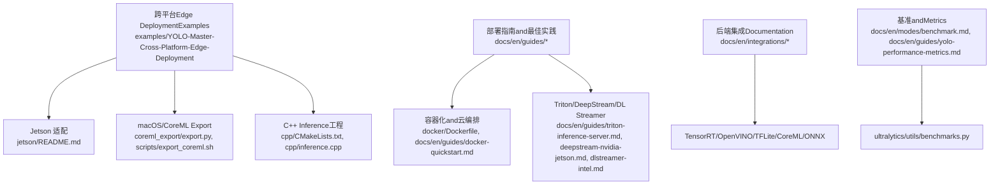
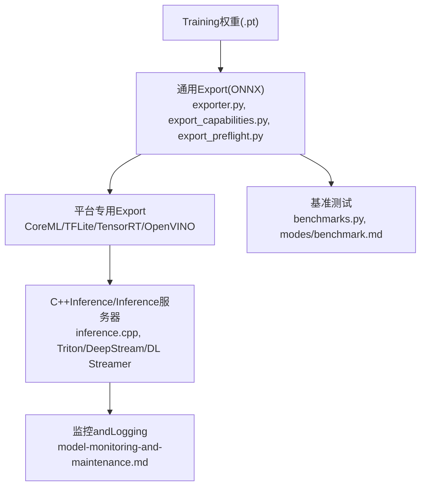
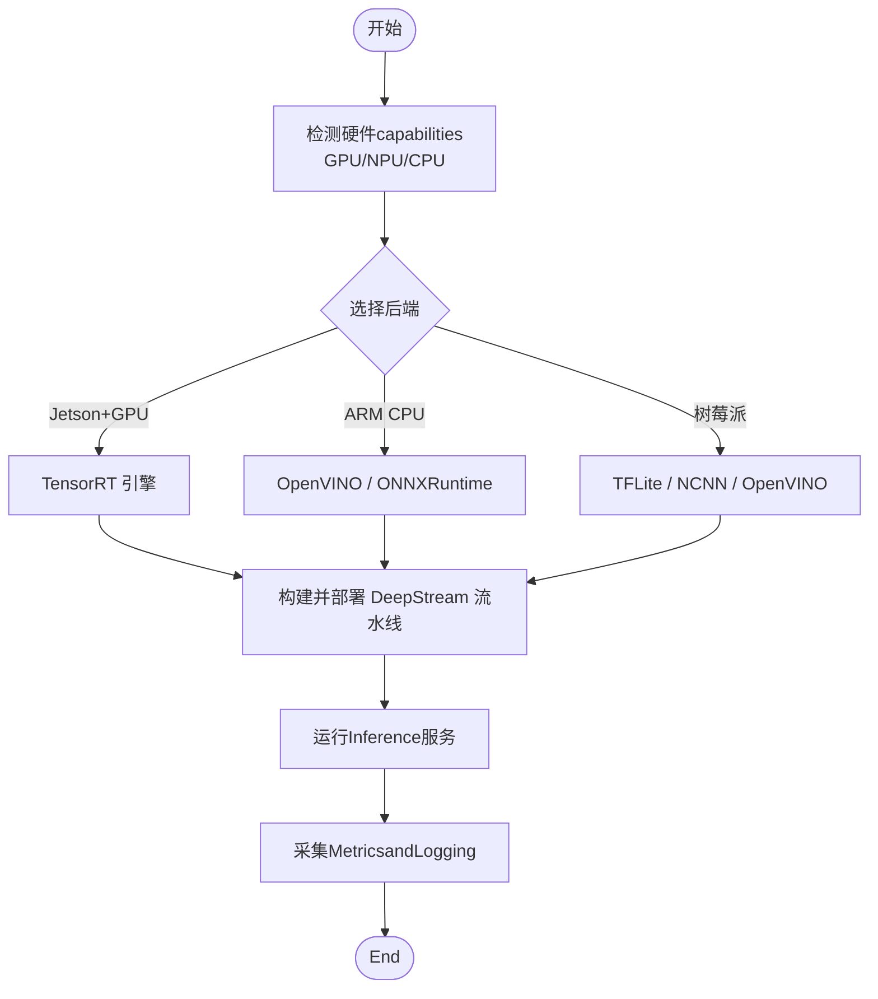
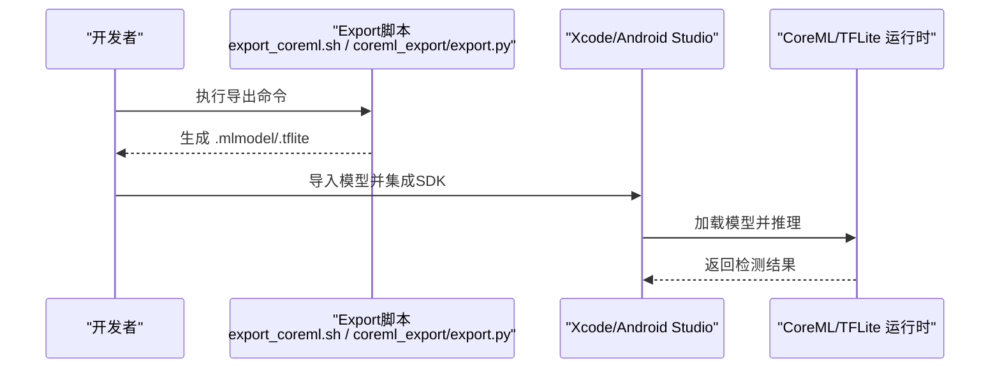
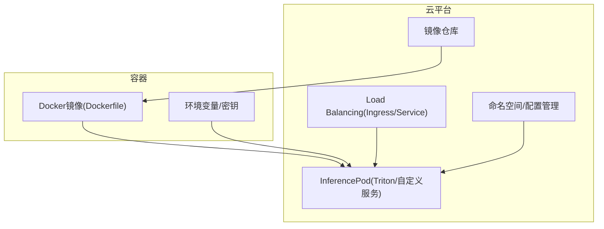
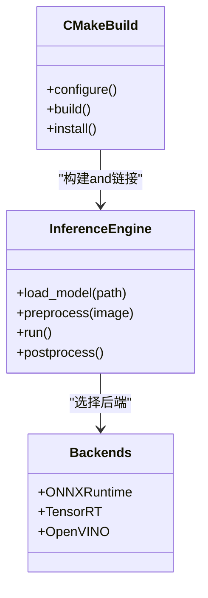
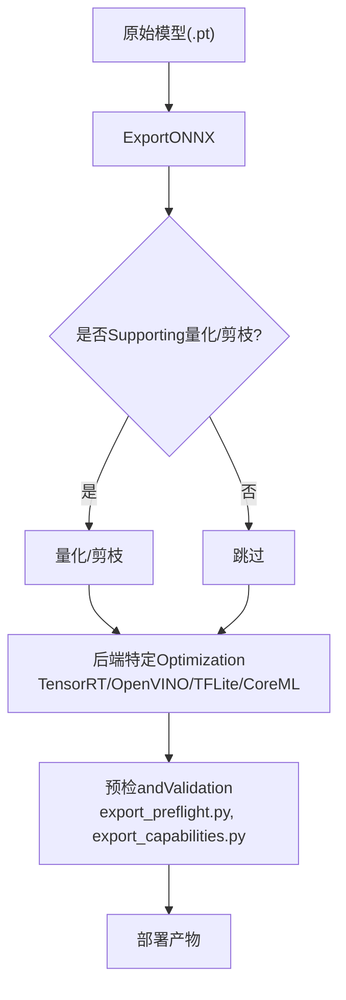
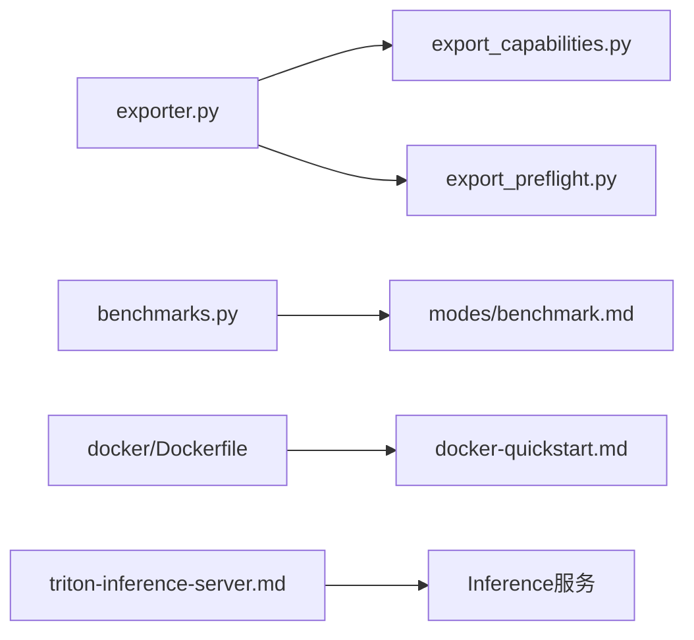
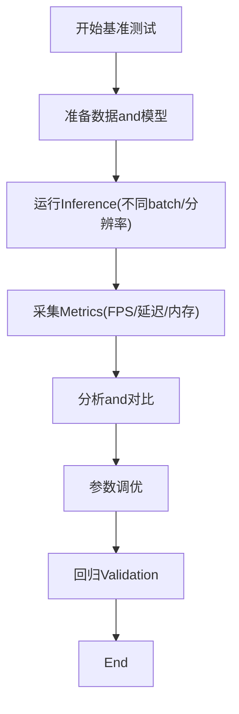
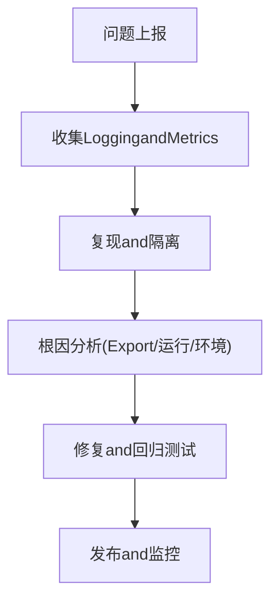

# Cross-Platform DeploymentExamples

<cite>
**Files Referenced in This Document**
- [README.md](file://README.md)
- [examples/YOLO-Master-Cross-Platform-Edge-Deployment/README.md](file://examples/YOLO-Master-Cross-Platform-Edge-Deployment/README.md)
- [examples/YOLO-Master-Cross-Platform-Edge-Deployment/TECHNICAL_REPORT.md](file://examples/YOLO-Master-Cross-Platform-Edge-Deployment/TECHNICAL_REPORT.md)
- [examples/YOLO-Master-Cross-Platform-Edge-Deployment/jetson/README.md](file://examples/YOLO-Master-Cross-Platform-Edge-Deployment/jetson/README.md)
- [examples/YOLO-Master-Cross-Platform-Edge-Deployment/mac/README.md](file://examples/YOLO-Master-Cross-Platform-Edge-Deployment/mac/README.md)
- [examples/YOLO-Master-Cross-Platform-Edge-Deployment/scripts/export_coreml.sh](file://examples/YOLO-Master-Cross-Platform-Edge-Deployment/scripts/export_coreml.sh)
- [examples/YOLO-Master-Cross-Platform-Edge-Deployment/cpp/CMakeLists.txt](file://examples/YOLO-Master-Cross-Platform-Edge-Deployment/cpp/CMakeLists.txt)
- [examples/YOLO-Master-Cross-Platform-Edge-Deployment/cpp/inference.cpp](file://examples/YOLO-Master-Cross-Platform-Edge-Deployment/cpp/inference.cpp)
- [examples/YOLO-Master-Cross-Platform-Edge-Deployment/coreml_export/export.py](file://examples/YOLO-Master-Cross-Platform-Edge-Deployment/coreml_export/export.py)
- [docker/Dockerfile](file://docker/Dockerfile)
- [docs/en/guides/model-deployment-options.md](file://docs/en/guides/model-deployment-options.md)
- [docs/en/guides/model-deployment-practices.md](file://docs/en/guides/model-deployment-practices.md)
- [docs/en/guides/nvidia-jetson.md](file://docs/en/guides/nvidia-jetson.md)
- [docs/en/guides/raspberry-pi.md](file://docs/en/guides/raspberry-pi.md)
- [docs/en/guides/deepstream-nvidia-jetson.md](file://docs/en/guides/deepstream-nvidia-jetson.md)
- [docs/en/guides/dlstreamer-intel.md](file://docs/en/guides/dlstreamer-intel.md)
- [docs/en/guides/triton-inference-server.md](file://docs/en/guides/triton-inference-server.md)
- [docs/en/guides/docker-quickstart.md](file://docs/en/guides/docker-quickstart.md)
- [docs/en/guides/vertex-ai-deployment-with-docker.md](file://docs/en/guides/vertex-ai-deployment-with-docker.md)
- [docs/en/integrations/tensorrt.md](file://docs/en/integrations/tensorrt.md)
- [docs/en/integrations/openvino.md](file://docs/en/integrations/openvino.md)
- [docs/en/integrations/litert.md](file://docs/en/integrations/litert.md)
- [docs/en/integrations/coreml.md](file://docs/en/integrations/coreml.md)
- [docs/en/integrations/onnx.md](file://docs/en/integrations/onnx.md)
- [docs/en/modes/benchmark.md](file://docs/en/modes/benchmark.md)
- [docs/en/guides/yolo-performance-metrics.md](file://docs/en/guides/yolo-performance-metrics.md)
- [docs/en/guides/model-monitoring-and-maintenance.md](file://docs/en/guides/model-monitoring-and-maintenance.md)
- [ultralytics/utils/benchmarks.py](file://ultralytics/utils/benchmarks.py)
- [ultralytics/engine/exporter.py](file://ultralytics/engine/exporter.py)
- [ultralytics/utils/export_capabilities.py](file://ultralytics/utils/export_capabilities.py)
- [ultralytics/utils/export_preflight.py](file://ultralytics/utils/export_preflight.py)
- [scripts/run_moe_dynamic_schedule_ablation.py](file://scripts/run_moe_dynamic_schedule_ablation.py)
</cite>

## Table of Contents
1. [Introduction](#Introduction)
2. [Project Structure](#Project Structure)
3. [Core Components](#Core Components)
4. [Architecture Overview](#Architecture Overview)
5. [Detailed Component Analysis](#Detailed Component Analysis)
6. [Dependency Analysis](#Dependency Analysis)
7. [性能andOptimization](#性能andOptimization)
8. [Troubleshooting Guide](#Troubleshooting Guide)
9. [Conclusion](#Conclusion)
10. [Appendix](#Appendix)

## Introduction
本ExamplesDocumentationtargeting“Cross-Platform Deployment”的高级应用实践，围绕边缘设备（Jetson、树莓派、ARM）、移动端（iOS CoreML、Android TFLite）、云服务（Docker、Kubernetes、Load Balancing）Centered onandC++高性能Inference后端（ONNXRuntime、TensorRT、OpenVINO）provides端to端指导。内容涵盖Model Exportand量化剪枝etc.部署前处理、基准测试and延迟Optimization、生产环境的监控Loggingand错误处理，帮助读者while多种目标平台上稳定交付高性能视觉Inference服务。

## Project Structure
仓库provides了丰富的部署相关资源：
- 跨平台Edge DeploymentExamples：包含Jetson、macOS、CoreMLExport脚本andC++Inference工程
- 官方指南：覆盖模型部署选项、最佳实践、容器化、Triton、DeepStream、Intel DL Streamer、Raspberry PiandJetson适配
- 集成Documentation：TensorRT、OpenVINO、TFLite、CoreML、ONNXetc.后端说明
- 基准andMetrics：统一基准模式and性能Metrics解读
- 工具链：Exportcapabilities矩阵、预检、基准工具etc.

Figure Source
- [examples/YOLO-Master-Cross-Platform-Edge-Deployment/README.md](file://examples/YOLO-Master-Cross-Platform-Edge-Deployment/README.md)
- [examples/YOLO-Master-Cross-Platform-Edge-Deployment/jetson/README.md](file://examples/YOLO-Master-Cross-Platform-Edge-Deployment/jetson/README.md)
- [examples/YOLO-Master-Cross-Platform-Edge-Deployment/coreml_export/export.py](file://examples/YOLO-Master-Cross-Platform-Edge-Deployment/coreml_export/export.py)
- [examples/YOLO-Master-Cross-Platform-Edge-Deployment/scripts/export_coreml.sh](file://examples/YOLO-Master-Cross-Platform-Edge-Deployment/scripts/export_coreml.sh)
- [examples/YOLO-Master-Cross-Platform-Edge-Deployment/cpp/CMakeLists.txt](file://examples/YOLO-Master-Cross-Platform-Edge-Deployment/cpp/CMakeLists.txt)
- [examples/YOLO-Master-Cross-Platform-Edge-Deployment/cpp/inference.cpp](file://examples/YOLO-Master-Cross-Platform-Edge-Deployment/cpp/inference.cpp)
- [docker/Dockerfile](file://docker/Dockerfile)
- [docs/en/guides/model-deployment-options.md](file://docs/en/guides/model-deployment-options.md)
- [docs/en/guides/model-deployment-practices.md](file://docs/en/guides/model-deployment-practices.md)
- [docs/en/guides/triton-inference-server.md](file://docs/en/guides/triton-inference-server.md)
- [docs/en/guides/deepstream-nvidia-jetson.md](file://docs/en/guides/deepstream-nvidia-jetson.md)
- [docs/en/guides/dlstreamer-intel.md](file://docs/en/guides/dlstreamer-intel.md)
- [docs/en/integrations/tensorrt.md](file://docs/en/integrations/tensorrt.md)
- [docs/en/integrations/openvino.md](file://docs/en/integrations/openvino.md)
- [docs/en/integrations/litert.md](file://docs/en/integrations/litert.md)
- [docs/en/integrations/coreml.md](file://docs/en/integrations/coreml.md)
- [docs/en/integrations/onnx.md](file://docs/en/integrations/onnx.md)
- [docs/en/modes/benchmark.md](file://docs/en/modes/benchmark.md)
- [docs/en/guides/yolo-performance-metrics.md](file://docs/en/guides/yolo-performance-metrics.md)
- [ultralytics/utils/benchmarks.py](file://ultralytics/utils/benchmarks.py)

Section Source
- [README.md](file://README.md)
- [examples/YOLO-Master-Cross-Platform-Edge-Deployment/README.md](file://examples/YOLO-Master-Cross-Platform-Edge-Deployment/README.md)
- [examples/YOLO-Master-Cross-Platform-Edge-Deployment/TECHNICAL_REPORT.md](file://examples/YOLO-Master-Cross-Platform-Edge-Deployment/TECHNICAL_REPORT.md)

## Core Components
- 跨平台Edge DeploymentExamples
  - Jetson适配andDeepStream流水线Refer to
  - macOS/CoreMLExportandC++Inference工程
  - 统一的Export脚本and构建配置
- 部署指南and最佳实践
  - 模型部署选项and实践建议
  - Docker快速入门and云端部署（Vertex AI）
  - TritonInference服务器、DeepStream、Intel DL Streamer
- 后端集成Documentation
  - TensorRT、OpenVINO、TFLite、CoreML、ONNX
- 基准andMetrics
  - 统一基准模式and性能Metrics解读
  - 基准工具implementing

Section Source
- [examples/YOLO-Master-Cross-Platform-Edge-Deployment/README.md](file://examples/YOLO-Master-Cross-Platform-Edge-Deployment/README.md)
- [docs/en/guides/model-deployment-options.md](file://docs/en/guides/model-deployment-options.md)
- [docs/en/guides/model-deployment-practices.md](file://docs/en/guides/model-deployment-practices.md)
- [docs/en/guides/triton-inference-server.md](file://docs/en/guides/triton-inference-server.md)
- [docs/en/guides/deepstream-nvidia-jetson.md](file://docs/en/guides/deepstream-nvidia-jetson.md)
- [docs/en/guides/dlstreamer-intel.md](file://docs/en/guides/dlstreamer-intel.md)
- [docs/en/integrations/tensorrt.md](file://docs/en/integrations/tensorrt.md)
- [docs/en/integrations/openvino.md](file://docs/en/integrations/openvino.md)
- [docs/en/integrations/litert.md](file://docs/en/integrations/litert.md)
- [docs/en/integrations/coreml.md](file://docs/en/integrations/coreml.md)
- [docs/en/integrations/onnx.md](file://docs/en/integrations/onnx.md)
- [docs/en/modes/benchmark.md](file://docs/en/modes/benchmark.md)
- [docs/en/guides/yolo-performance-metrics.md](file://docs/en/guides/yolo-performance-metrics.md)
- [ultralytics/utils/benchmarks.py](file://ultralytics/utils/benchmarks.py)

## Architecture Overview
下图展示从Training权重to多平台部署的端to端流程：Exporting to通用格式（ONNX），再根据目标平台转换for专用格式（CoreML、TFLite、TensorRT、OpenVINO），并ViaC++或Inference服务器进行高性能Inference；同时配套基准测试and监控。

Figure Source
- [ultralytics/engine/exporter.py](file://ultralytics/engine/exporter.py)
- [ultralytics/utils/export_capabilities.py](file://ultralytics/utils/export_capabilities.py)
- [ultralytics/utils/export_preflight.py](file://ultralytics/utils/export_preflight.py)
- [docs/en/integrations/coreml.md](file://docs/en/integrations/coreml.md)
- [docs/en/integrations/litert.md](file://docs/en/integrations/litert.md)
- [docs/en/integrations/tensorrt.md](file://docs/en/integrations/tensorrt.md)
- [docs/en/integrations/openvino.md](file://docs/en/integrations/openvino.md)
- [examples/YOLO-Master-Cross-Platform-Edge-Deployment/cpp/inference.cpp](file://examples/YOLO-Master-Cross-Platform-Edge-Deployment/cpp/inference.cpp)
- [docs/en/guides/triton-inference-server.md](file://docs/en/guides/triton-inference-server.md)
- [docs/en/guides/deepstream-nvidia-jetson.md](file://docs/en/guides/deepstream-nvidia-jetson.md)
- [docs/en/guides/dlstreamer-intel.md](file://docs/en/guides/dlstreamer-intel.md)
- [docs/en/modes/benchmark.md](file://docs/en/modes/benchmark.md)
- [ultralytics/utils/benchmarks.py](file://ultralytics/utils/benchmarks.py)
- [docs/en/guides/model-monitoring-and-maintenance.md](file://docs/en/guides/model-monitoring-and-maintenance.md)

## Detailed Component Analysis

### Edge Device Deployment（Jetson、树莓派、ARM）
- JetsonandDeepStream
  - UsesDeepStream加速视频流Inference，CombiningTensorRT引擎提升吞吐and降低延迟
  - Refer toJetson适配指南andDeepStream集成Documentation
- 树莓派andARM
  - 针对ARM CPU/GPU/NPU的Optimization策略，包括INT8量化、算子融合and内存对齐
  - Refer to树莓派部署指南
- 编译and运行环境
  - ViaDocker镜像固化依赖，确保跨设备一致性
  - Refer toDocker快速入门and云端部署Documentation

Figure Source
- [docs/en/guides/nvidia-jetson.md](file://docs/en/guides/nvidia-jetson.md)
- [docs/en/guides/deepstream-nvidia-jetson.md](file://docs/en/guides/deepstream-nvidia-jetson.md)
- [docs/en/guides/raspberry-pi.md](file://docs/en/guides/raspberry-pi.md)
- [docs/en/integrations/tensorrt.md](file://docs/en/integrations/tensorrt.md)
- [docs/en/integrations/openvino.md](file://docs/en/integrations/openvino.md)
- [docs/en/integrations/litert.md](file://docs/en/integrations/litert.md)
- [docs/en/guides/docker-quickstart.md](file://docs/en/guides/docker-quickstart.md)

Section Source
- [examples/YOLO-Master-Cross-Platform-Edge-Deployment/jetson/README.md](file://examples/YOLO-Master-Cross-Platform-Edge-Deployment/jetson/README.md)
- [docs/en/guides/nvidia-jetson.md](file://docs/en/guides/nvidia-jetson.md)
- [docs/en/guides/deepstream-nvidia-jetson.md](file://docs/en/guides/deepstream-nvidia-jetson.md)
- [docs/en/guides/raspberry-pi.md](file://docs/en/guides/raspberry-pi.md)
- [docs/en/guides/docker-quickstart.md](file://docs/en/guides/docker-quickstart.md)

### Mobile Deployment（iOS CoreML、Android TFLite）
- iOS CoreML
  - UsesCoreMLExport脚本生成.mlmodel，并whileXcode工程中集成
  - Refer toCoreMLExport脚本and集成Documentation
- Android TFLite
  - 将Model Exportfor.tflite，Combined withAndroid NNAPI或GPU DelegateOptimization
  - Refer toTFLite集成Documentation

Figure Source
- [examples/YOLO-Master-Cross-Platform-Edge-Deployment/scripts/export_coreml.sh](file://examples/YOLO-Master-Cross-Platform-Edge-Deployment/scripts/export_coreml.sh)
- [examples/YOLO-Master-Cross-Platform-Edge-Deployment/coreml_export/export.py](file://examples/YOLO-Master-Cross-Platform-Edge-Deployment/coreml_export/export.py)
- [docs/en/integrations/coreml.md](file://docs/en/integrations/coreml.md)
- [docs/en/integrations/litert.md](file://docs/en/integrations/litert.md)

Section Source
- [examples/YOLO-Master-Cross-Platform-Edge-Deployment/mac/README.md](file://examples/YOLO-Master-Cross-Platform-Edge-Deployment/mac/README.md)
- [examples/YOLO-Master-Cross-Platform-Edge-Deployment/scripts/export_coreml.sh](file://examples/YOLO-Master-Cross-Platform-Edge-Deployment/scripts/export_coreml.sh)
- [examples/YOLO-Master-Cross-Platform-Edge-Deployment/coreml_export/export.py](file://examples/YOLO-Master-Cross-Platform-Edge-Deployment/coreml_export/export.py)
- [docs/en/integrations/coreml.md](file://docs/en/integrations/coreml.md)
- [docs/en/integrations/litert.md](file://docs/en/integrations/litert.md)

### Cloud Service Deployment（Docker、Kubernetes、Load Balancing）
- Docker容器化
  - UsesDockerfile打包Inference环境and依赖，保证可移植性
  - Refer toDocker快速入门and云端部署Documentation
- Kubernetes编排
  - 将容器作forPod部署，配置副本数、资源限制and健康检查
  - CombiningTritonInference服务器implementing高并发and弹性伸缩
- Load Balancing
  - UsesIngress或Service暴露HTTP/gRPC接口，CombiningHPA自动扩缩容

Figure Source
- [docker/Dockerfile](file://docker/Dockerfile)
- [docs/en/guides/docker-quickstart.md](file://docs/en/guides/docker-quickstart.md)
- [docs/en/guides/vertex-ai-deployment-with-docker.md](file://docs/en/guides/vertex-ai-deployment-with-docker.md)
- [docs/en/guides/triton-inference-server.md](file://docs/en/guides/triton-inference-server.md)

Section Source
- [docker/Dockerfile](file://docker/Dockerfile)
- [docs/en/guides/docker-quickstart.md](file://docs/en/guides/docker-quickstart.md)
- [docs/en/guides/vertex-ai-deployment-with-docker.md](file://docs/en/guides/vertex-ai-deployment-with-docker.md)
- [docs/en/guides/triton-inference-server.md](file://docs/en/guides/triton-inference-server.md)

### C++高性能Inference（ONNXRuntime、TensorRT、OpenVINO）
- 工程结构
  - CMakeLists.txt定义构建规则and依赖
  - inference.cppEncapsulatesInference逻辑（Load model、预处理、Inference、Post-Processing）
- 后端选择
  - ONNXRuntime：跨平台通用后端
  - TensorRT：NVIDIA GPU极致性能
  - OpenVINO：Intel CPU/NPUOptimization
- 构建and运行
  - 交叉编译至ARM/Jetson/树莓派etc.平台
  - CombiningDeepStream/DL Streamerimplementing视频流处理

Figure Source
- [examples/YOLO-Master-Cross-Platform-Edge-Deployment/cpp/CMakeLists.txt](file://examples/YOLO-Master-Cross-Platform-Edge-Deployment/cpp/CMakeLists.txt)
- [examples/YOLO-Master-Cross-Platform-Edge-Deployment/cpp/inference.cpp](file://examples/YOLO-Master-Cross-Platform-Edge-Deployment/cpp/inference.cpp)
- [docs/en/integrations/onnx.md](file://docs/en/integrations/onnx.md)
- [docs/en/integrations/tensorrt.md](file://docs/en/integrations/tensorrt.md)
- [docs/en/integrations/openvino.md](file://docs/en/integrations/openvino.md)

Section Source
- [examples/YOLO-Master-Cross-Platform-Edge-Deployment/cpp/CMakeLists.txt](file://examples/YOLO-Master-Cross-Platform-Edge-Deployment/cpp/CMakeLists.txt)
- [examples/YOLO-Master-Cross-Platform-Edge-Deployment/cpp/inference.cpp](file://examples/YOLO-Master-Cross-Platform-Edge-Deployment/cpp/inference.cpp)
- [docs/en/integrations/onnx.md](file://docs/en/integrations/onnx.md)
- [docs/en/integrations/tensorrt.md](file://docs/en/integrations/tensorrt.md)
- [docs/en/integrations/openvino.md](file://docs/en/integrations/openvino.md)

### 部署前处理（量化、剪枝、编译Optimization）
- 量化
  - INT8/FP16量化，Combining校准数据集and后端特定Optimization
- 剪枝
  - 结构化/非结构化剪枝，减少计算量and内存占用
- 编译Optimization
  - 图级Optimization、算子融合、常量折叠
- 预检andcapabilities矩阵
  - Export前检查模型兼容性，避免运行时错误

Figure Source
- [ultralytics/engine/exporter.py](file://ultralytics/engine/exporter.py)
- [ultralytics/utils/export_capabilities.py](file://ultralytics/utils/export_capabilities.py)
- [ultralytics/utils/export_preflight.py](file://ultralytics/utils/export_preflight.py)
- [docs/en/integrations/tensorrt.md](file://docs/en/integrations/tensorrt.md)
- [docs/en/integrations/openvino.md](file://docs/en/integrations/openvino.md)
- [docs/en/integrations/litert.md](file://docs/en/integrations/litert.md)
- [docs/en/integrations/coreml.md](file://docs/en/integrations/coreml.md)

Section Source
- [ultralytics/engine/exporter.py](file://ultralytics/engine/exporter.py)
- [ultralytics/utils/export_capabilities.py](file://ultralytics/utils/export_capabilities.py)
- [ultralytics/utils/export_preflight.py](file://ultralytics/utils/export_preflight.py)

## Dependency Analysis
- Export链路
  - exporter.py负责统一Export入口，export_capabilities.py描述各后端capabilities，export_preflight.py进行预检
- 基准链路
  - benchmarks.pyprovides基准测试工具，modes/benchmark.md定义基准模式
- 部署链路
  - Dockerfileandguides/docker-quickstart.mdprovides容器化方案，triton-inference-server.mdprovidesInference服务器方案

Figure Source
- [ultralytics/engine/exporter.py](file://ultralytics/engine/exporter.py)
- [ultralytics/utils/export_capabilities.py](file://ultralytics/utils/export_capabilities.py)
- [ultralytics/utils/export_preflight.py](file://ultralytics/utils/export_preflight.py)
- [ultralytics/utils/benchmarks.py](file://ultralytics/utils/benchmarks.py)
- [docs/en/modes/benchmark.md](file://docs/en/modes/benchmark.md)
- [docker/Dockerfile](file://docker/Dockerfile)
- [docs/en/guides/docker-quickstart.md](file://docs/en/guides/docker-quickstart.md)
- [docs/en/guides/triton-inference-server.md](file://docs/en/guides/triton-inference-server.md)

Section Source
- [ultralytics/engine/exporter.py](file://ultralytics/engine/exporter.py)
- [ultralytics/utils/export_capabilities.py](file://ultralytics/utils/export_capabilities.py)
- [ultralytics/utils/export_preflight.py](file://ultralytics/utils/export_preflight.py)
- [ultralytics/utils/benchmarks.py](file://ultralytics/utils/benchmarks.py)
- [docs/en/modes/benchmark.md](file://docs/en/modes/benchmark.md)
- [docker/Dockerfile](file://docker/Dockerfile)
- [docs/en/guides/docker-quickstart.md](file://docs/en/guides/docker-quickstart.md)
- [docs/en/guides/triton-inference-server.md](file://docs/en/guides/triton-inference-server.md)

## 性能andOptimization
- 基准测试
  - Uses统一基准模式Evaluation吞吐and延迟，记录关键Metrics
- Metrics解读
  - 关注FPS、P50/P95延迟、内存占用and能耗
- 调优技巧
  - 批量大小调整、输入分辨率裁剪、动态形状Optimization、算子融合、内存池复用
  - 针对后端特性启用相应Optimization开关（such asTensorRT精度、OpenVINO线程数）

Figure Source
- [docs/en/modes/benchmark.md](file://docs/en/modes/benchmark.md)
- [docs/en/guides/yolo-performance-metrics.md](file://docs/en/guides/yolo-performance-metrics.md)
- [ultralytics/utils/benchmarks.py](file://ultralytics/utils/benchmarks.py)

Section Source
- [docs/en/modes/benchmark.md](file://docs/en/modes/benchmark.md)
- [docs/en/guides/yolo-performance-metrics.md](file://docs/en/guides/yolo-performance-metrics.md)
- [ultralytics/utils/benchmarks.py](file://ultralytics/utils/benchmarks.py)

## Troubleshooting Guide
- 常见问题定位
  - Export Failure：检查模型兼容性and预检报告
  - 运行时崩溃：核对后端版本and依赖，确认输入形状and数据类型
  - 性能不达标：分析bottlenecks（I/O、预处理、Inference、Post-Processing）
- 监控andLogging
  - 启用服务LoggingandMetrics收集，建立告警阈值
  - Combining模型监控and维护指南进行持续观测

Figure Source
- [docs/en/guides/model-monitoring-and-maintenance.md](file://docs/en/guides/model-monitoring-and-maintenance.md)
- [ultralytics/utils/export_preflight.py](file://ultralytics/utils/export_preflight.py)

Section Source
- [docs/en/guides/model-monitoring-and-maintenance.md](file://docs/en/guides/model-monitoring-and-maintenance.md)
- [ultralytics/utils/export_preflight.py](file://ultralytics/utils/export_preflight.py)

## Conclusion
Via本ExamplesDocumentation，读者可Centered on掌握从Model Export、量化剪枝、后端集成to容器化and编排的全链路部署方法。Combining基准测试and监控维护，能够while边缘设备、移动端and云环境中稳定交付高性能Inference服务。建议while实际项目中优先完成Export预检andcapabilities匹配，再按平台特性选择最优后端andOptimization策略，并Centered on基准and监控闭环保障质量and稳定性。

## Appendix
- 技术报告andExamples说明
  - 跨平台Edge Deployment技术报告andExamples说明
- 脚本and实验
  - 动态调度消融实验脚本（用于性能androuting strategiesEvaluation）

Section Source
- [examples/YOLO-Master-Cross-Platform-Edge-Deployment/TECHNICAL_REPORT.md](file://examples/YOLO-Master-Cross-Platform-Edge-Deployment/TECHNICAL_REPORT.md)
- [scripts/run_moe_dynamic_schedule_ablation.py](file://scripts/run_moe_dynamic_schedule_ablation.py)