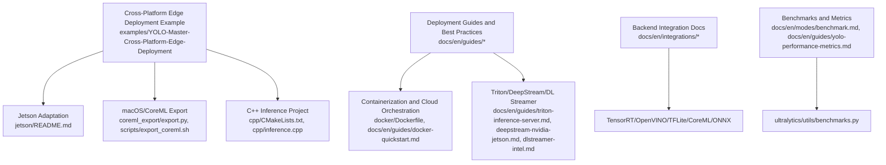
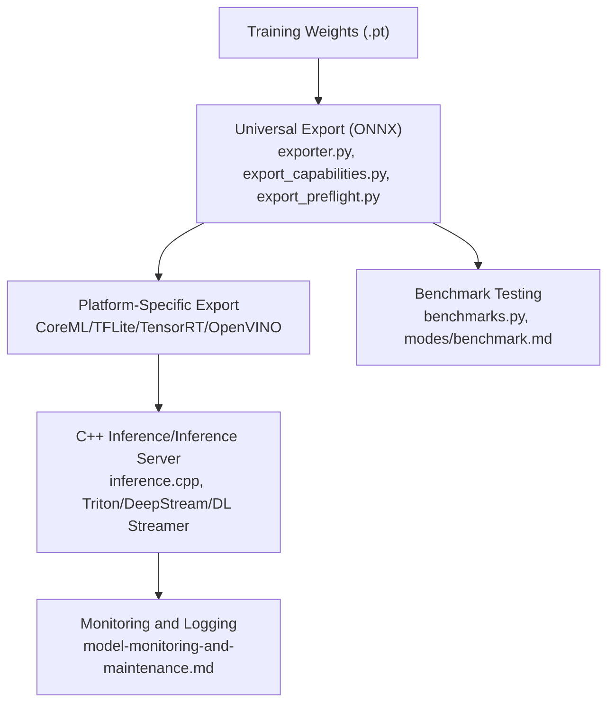
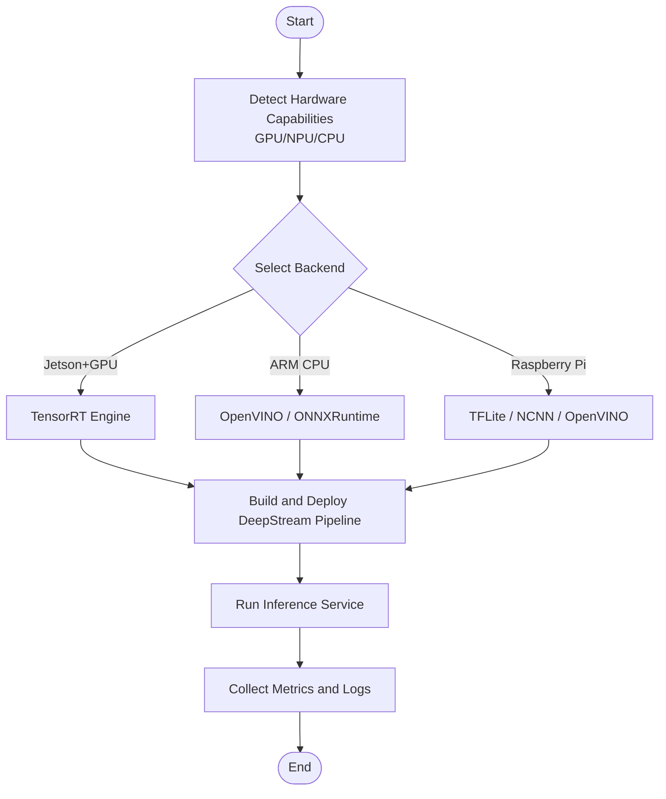
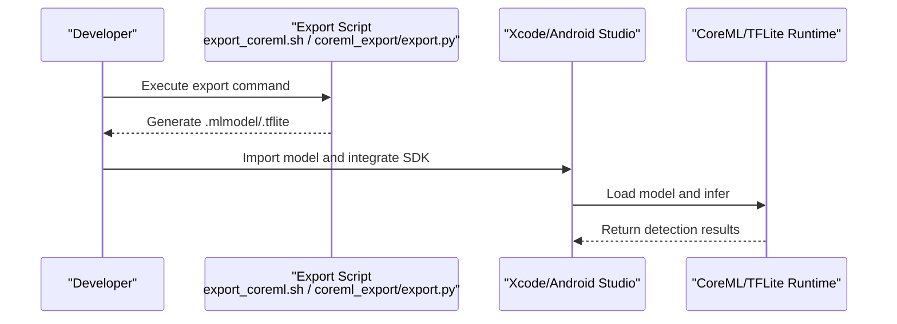
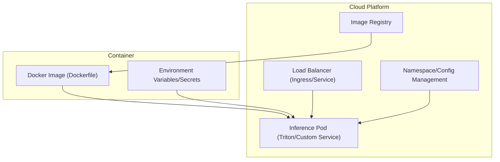
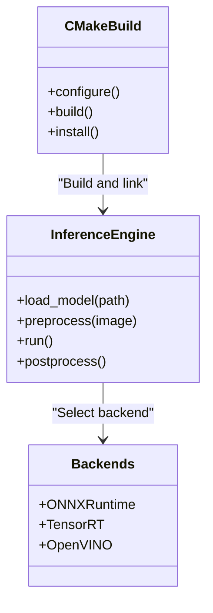
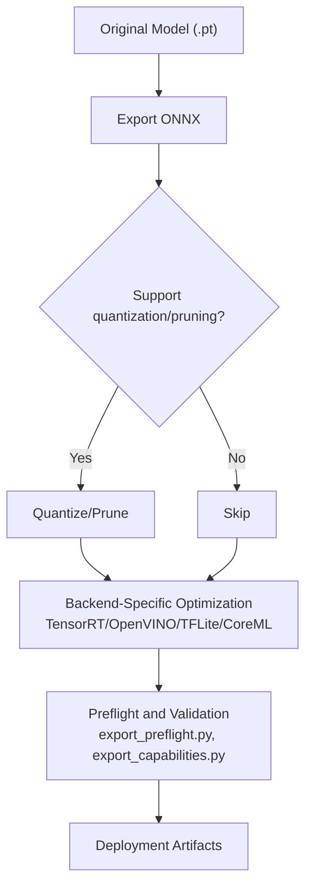
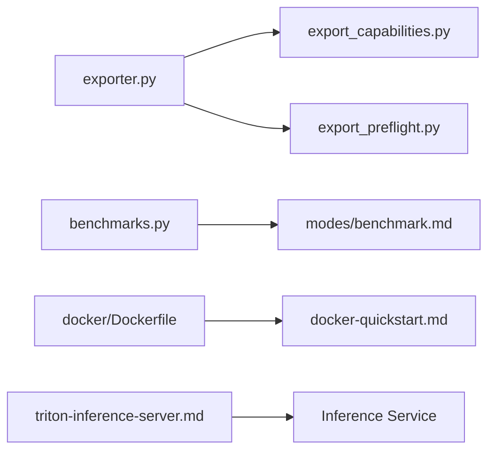
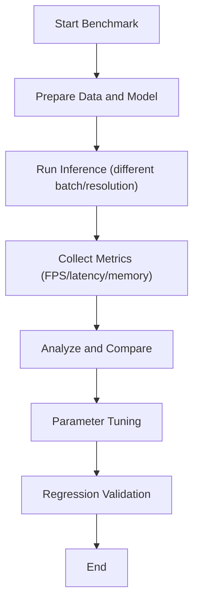
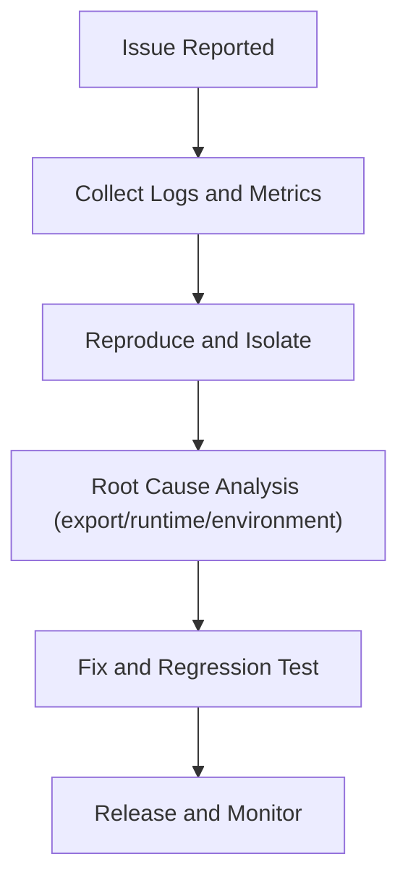

# Cross-Platform Deployment Examples

<cite>
**Files referenced in this document**
- [README.md](file://README.md)
- [examples/YOLO-Master-Cross-Platform-Edge-Deployment/README.md](file://examples/YOLO-Master-Cross-Platform-Edge-Deployment/README.md)
- [examples/YOLO-Master-Cross-Platform-Edge-Deployment/TECHNICAL_REPORT.md](file://examples/YOLO-Master-Cross-Platform-Edge-Deployment/TECHNICAL_REPORT.md)
- [examples/YOLO-Master-Cross-Platform-Edge-Deployment/jetson/README.md](file://examples/YOLO-Master-Cross-Platform-Edge-Deployment/jetson/README.md)
- [examples/YOLO-Master-Cross-Platform-Edge-Deployment/mac/README.md](file://examples/YOLO-Master-Cross-Platform-Edge-Deployment/mac/README.md)
- [examples/YOLO-Master-Cross-Platform-Edge-Deployment/scripts/export_coreml.sh](file://examples/YOLO-Master-Cross-Platform-Edge-Deployment/scripts/export_coreml.sh)
- [examples/YOLO-Master-Cross-Platform-Edge-Deployment/cpp/CMakeLists.txt](file://examples/YOLO-Master-Cross-Platform-Edge-Deployment/cpp/CMakeLists.txt)
- [examples/YOLO-Master-Cross-Platform-Edge-Deployment/cpp/inference.cpp](file://examples/YOLO-Master-Cross-Platform-Edge-Deployment/cpp/inference.cpp)
- [examples/YOLO-Master-Cross-Platform-Edge-Deployment/coreml_export/export.py](file://examples/YOLO-Master-Cross-Platform-Edge-Deployment/coreml_export/export.py)
- [docker/Dockerfile](file://docker/Dockerfile)
- [docs/en/guides/model-deployment-options.md](file://docs/en/guides/model-deployment-options.md)
- [docs/en/guides/model-deployment-practices.md](file://docs/en/guides/model-deployment-practices.md)
- [docs/en/guides/nvidia-jetson.md](file://docs/en/guides/nvidia-jetson.md)
- [docs/en/guides/raspberry-pi.md](file://docs/en/guides/raspberry-pi.md)
- [docs/en/guides/deepstream-nvidia-jetson.md](file://docs/en/guides/deepstream-nvidia-jetson.md)
- [docs/en/guides/dlstreamer-intel.md](file://docs/en/guides/dlstreamer-intel.md)
- [docs/en/guides/triton-inference-server.md](file://docs/en/guides/triton-inference-server.md)
- [docs/en/guides/docker-quickstart.md](file://docs/en/guides/docker-quickstart.md)
- [docs/en/guides/vertex-ai-deployment-with-docker.md](file://docs/en/guides/vertex-ai-deployment-with-docker.md)
- [docs/en/integrations/tensorrt.md](file://docs/en/integrations/tensorrt.md)
- [docs/en/integrations/openvino.md](file://docs/en/integrations/openvino.md)
- [docs/en/integrations/litert.md](file://docs/en/integrations/litert.md)
- [docs/en/integrations/coreml.md](file://docs/en/integrations/coreml.md)
- [docs/en/integrations/onnx.md](file://docs/en/integrations/onnx.md)
- [docs/en/modes/benchmark.md](file://docs/en/modes/benchmark.md)
- [docs/en/guides/yolo-performance-metrics.md](file://docs/en/guides/yolo-performance-metrics.md)
- [docs/en/guides/model-monitoring-and-maintenance.md](file://docs/en/guides/model-monitoring-and-maintenance.md)
- [ultralytics/utils/benchmarks.py](file://ultralytics/utils/benchmarks.py)
- [ultralytics/engine/exporter.py](file://ultralytics/engine/exporter.py)
- [ultralytics/utils/export_capabilities.py](file://ultralytics/utils/export_capabilities.py)
- [ultralytics/utils/export_preflight.py](file://ultralytics/utils/export_preflight.py)
- [scripts/run_moe_dynamic_schedule_ablation.py](file://scripts/run_moe_dynamic_schedule_ablation.py)
</cite>

## Table of Contents
1. [Introduction](#introduction)
2. [Project Structure](#project-structure)
3. [Core Components](#core-components)
4. [Architecture Overview](#architecture-overview)
5. [Detailed Component Analysis](#detailed-component-analysis)
6. [Dependency Analysis](#dependency-analysis)
7. [Performance and Optimization](#performance-and-optimization)
8. [Troubleshooting Guide](#troubleshooting-guide)
9. [Conclusion](#conclusion)
10. [Appendix](#appendix)

## Introduction
This example document is intended for advanced application practices in "cross-platform deployment", providing end-to-end guidance around edge devices (Jetson, Raspberry Pi, ARM), mobile platforms (iOS CoreML, Android TFLite), cloud services (Docker, Kubernetes, load balancing), and C++ high-performance inference backends (ONNXRuntime, TensorRT, OpenVINO). The content covers pre-deployment processing such as model export and quantization/pruning, benchmark testing and latency optimization, production environment monitoring/logging and error handling, helping readers stably deliver high-performance visual inference services across multiple target platforms.

## Project Structure
The repository provides rich deployment-related resources:
- Cross-platform edge deployment examples: Including Jetson, macOS, CoreML export scripts and C++ inference projects
- Official guides: Covering model deployment options, best practices, containerization, Triton, DeepStream, Intel DL Streamer, Raspberry Pi and Jetson adaptation
- Integration documentation: TensorRT, OpenVINO, TFLite, CoreML, ONNX and other backend descriptions
- Benchmarks and metrics: Unified benchmark modes and performance metric interpretation
- Toolchain: Export capability matrix, preflight checks, benchmark tools, etc.

Diagram source
- [examples/YOLO-Master-Cross-Platform-Edge-Deployment/README.md](file://examples/YOLO-Master-Cross-Platform-Edge-Deployment/README.md)
- [examples/YOLO-Master-Cross-Platform-Edge-Deployment/jetson/README.md](file://examples/YOLO-Master-Cross-Platform-Edge-Deployment/jetson/README.md)
- [examples/YOLO-Master-Cross-Platform-Edge-Deployment/coreml_export/export.py](file://examples/YOLO-Master-Cross-Platform-Edge-Deployment/coreml_export/export.py)
- [examples/YOLO-Master-Cross-Platform-Edge-Deployment/scripts/export_coreml.sh](file://examples/YOLO-Master-Cross-Platform-Edge-Deployment/scripts/export_coreml.sh)
- [examples/YOLO-Master-Cross-Platform-Edge-Deployment/cpp/CMakeLists.txt](file://examples/YOLO-Master-Cross-Platform-Edge-Deployment/cpp/CMakeLists.txt)
- [examples/YOLO-Master-Cross-Platform-Edge-Deployment/cpp/inference.cpp](file://examples/YOLO-Master-Cross-Platform-Edge-Deployment/cpp/inference.cpp)
- [docker/Dockerfile](file://docker/Dockerfile)
- [docs/en/guides/model-deployment-options.md](file://docs/en/guides/model-deployment-options.md)
- [docs/en/guides/model-deployment-practices.md](file://docs/en/guides/model-deployment-practices.md)
- [docs/en/guides/triton-inference-server.md](file://docs/en/guides/triton-inference-server.md)
- [docs/en/guides/deepstream-nvidia-jetson.md](file://docs/en/guides/deepstream-nvidia-jetson.md)
- [docs/en/guides/dlstreamer-intel.md](file://docs/en/guides/dlstreamer-intel.md)
- [docs/en/integrations/tensorrt.md](file://docs/en/integrations/tensorrt.md)
- [docs/en/integrations/openvino.md](file://docs/en/integrations/openvino.md)
- [docs/en/integrations/litert.md](file://docs/en/integrations/litert.md)
- [docs/en/integrations/coreml.md](file://docs/en/integrations/coreml.md)
- [docs/en/integrations/onnx.md](file://docs/en/integrations/onnx.md)
- [docs/en/modes/benchmark.md](file://docs/en/modes/benchmark.md)
- [docs/en/guides/yolo-performance-metrics.md](file://docs/en/guides/yolo-performance-metrics.md)
- [ultralytics/utils/benchmarks.py](file://ultralytics/utils/benchmarks.py)

Section source
- [README.md](file://README.md)
- [examples/YOLO-Master-Cross-Platform-Edge-Deployment/README.md](file://examples/YOLO-Master-Cross-Platform-Edge-Deployment/README.md)
- [examples/YOLO-Master-Cross-Platform-Edge-Deployment/TECHNICAL_REPORT.md](file://examples/YOLO-Master-Cross-Platform-Edge-Deployment/TECHNICAL_REPORT.md)

## Core Components
- Cross-platform edge deployment examples
  - Jetson adaptation and DeepStream pipeline reference
  - macOS/CoreML export and C++ inference project
  - Unified export scripts and build configurations
- Deployment guides and best practices
  - Model deployment options and practical recommendations
  - Docker quickstart and cloud deployment (Vertex AI)
  - Triton Inference Server, DeepStream, Intel DL Streamer
- Backend integration documentation
  - TensorRT, OpenVINO, TFLite, CoreML, ONNX
- Benchmarks and metrics
  - Unified benchmark modes and performance metric interpretation
  - Benchmark tool implementation

Section source
- [examples/YOLO-Master-Cross-Platform-Edge-Deployment/README.md](file://examples/YOLO-Master-Cross-Platform-Edge-Deployment/README.md)
- [docs/en/guides/model-deployment-options.md](file://docs/en/guides/model-deployment-options.md)
- [docs/en/guides/model-deployment-practices.md](file://docs/en/guides/model-deployment-practices.md)
- [docs/en/guides/triton-inference-server.md](file://docs/en/guides/triton-inference-server.md)
- [docs/en/guides/deepstream-nvidia-jetson.md](file://docs/en/guides/deepstream-nvidia-jetson.md)
- [docs/en/guides/dlstreamer-intel.md](file://docs/en/guides/dlstreamer-intel.md)
- [docs/en/integrations/tensorrt.md](file://docs/en/integrations/tensorrt.md)
- [docs/en/integrations/openvino.md](file://docs/en/integrations/openvino.md)
- [docs/en/integrations/litert.md](file://docs/en/integrations/litert.md)
- [docs/en/integrations/coreml.md](file://docs/en/integrations/coreml.md)
- [docs/en/integrations/onnx.md](file://docs/en/integrations/onnx.md)
- [docs/en/modes/benchmark.md](file://docs/en/modes/benchmark.md)
- [docs/en/guides/yolo-performance-metrics.md](file://docs/en/guides/yolo-performance-metrics.md)
- [ultralytics/utils/benchmarks.py](file://ultralytics/utils/benchmarks.py)

## Architecture Overview
The following diagram shows the end-to-end workflow from training weights to multi-platform deployment: export to a universal format (ONNX), then convert to platform-specific formats (CoreML, TFLite, TensorRT, OpenVINO) based on the target platform, and perform high-performance inference through C++ or inference servers; accompanied by benchmark testing and monitoring.

Diagram source
- [ultralytics/engine/exporter.py](file://ultralytics/engine/exporter.py)
- [ultralytics/utils/export_capabilities.py](file://ultralytics/utils/export_capabilities.py)
- [ultralytics/utils/export_preflight.py](file://ultralytics/utils/export_preflight.py)
- [docs/en/integrations/coreml.md](file://docs/en/integrations/coreml.md)
- [docs/en/integrations/litert.md](file://docs/en/integrations/litert.md)
- [docs/en/integrations/tensorrt.md](file://docs/en/integrations/tensorrt.md)
- [docs/en/integrations/openvino.md](file://docs/en/integrations/openvino.md)
- [examples/YOLO-Master-Cross-Platform-Edge-Deployment/cpp/inference.cpp](file://examples/YOLO-Master-Cross-Platform-Edge-Deployment/cpp/inference.cpp)
- [docs/en/guides/triton-inference-server.md](file://docs/en/guides/triton-inference-server.md)
- [docs/en/guides/deepstream-nvidia-jetson.md](file://docs/en/guides/deepstream-nvidia-jetson.md)
- [docs/en/guides/dlstreamer-intel.md](file://docs/en/guides/dlstreamer-intel.md)
- [docs/en/modes/benchmark.md](file://docs/en/modes/benchmark.md)
- [ultralytics/utils/benchmarks.py](file://ultralytics/utils/benchmarks.py)
- [docs/en/guides/model-monitoring-and-maintenance.md](file://docs/en/guides/model-monitoring-and-maintenance.md)

## Detailed Component Analysis

### Edge Device Deployment (Jetson, Raspberry Pi, ARM)
- Jetson and DeepStream
  - Use DeepStream to accelerate video stream inference, combined with TensorRT engine to improve throughput and reduce latency
  - Refer to Jetson adaptation guide and DeepStream integration documentation
- Raspberry Pi and ARM
  - Optimization strategies for ARM CPU/GPU/NPU, including INT8 quantization, operator fusion, and memory alignment
  - Refer to Raspberry Pi deployment guide
- Compilation and runtime environment
  - Use Docker images to solidify dependencies, ensuring cross-device consistency
  - Refer to Docker quickstart and cloud deployment documentation

Diagram source
- [docs/en/guides/nvidia-jetson.md](file://docs/en/guides/nvidia-jetson.md)
- [docs/en/guides/deepstream-nvidia-jetson.md](file://docs/en/guides/deepstream-nvidia-jetson.md)
- [docs/en/guides/raspberry-pi.md](file://docs/en/guides/raspberry-pi.md)
- [docs/en/integrations/tensorrt.md](file://docs/en/integrations/tensorrt.md)
- [docs/en/integrations/openvino.md](file://docs/en/integrations/openvino.md)
- [docs/en/integrations/litert.md](file://docs/en/integrations/litert.md)
- [docs/en/guides/docker-quickstart.md](file://docs/en/guides/docker-quickstart.md)

Section source
- [examples/YOLO-Master-Cross-Platform-Edge-Deployment/jetson/README.md](file://examples/YOLO-Master-Cross-Platform-Edge-Deployment/jetson/README.md)
- [docs/en/guides/nvidia-jetson.md](file://docs/en/guides/nvidia-jetson.md)
- [docs/en/guides/deepstream-nvidia-jetson.md](file://docs/en/guides/deepstream-nvidia-jetson.md)
- [docs/en/guides/raspberry-pi.md](file://docs/en/guides/raspberry-pi.md)
- [docs/en/guides/docker-quickstart.md](file://docs/en/guides/docker-quickstart.md)

### Mobile Deployment (iOS CoreML, Android TFLite)
- iOS CoreML
  - Use CoreML export scripts to generate .mlmodel and integrate in Xcode projects
  - Refer to CoreML export scripts and integration documentation
- Android TFLite
  - Export model to .tflite, optimize with Android NNAPI or GPU Delegate
  - Refer to TFLite integration documentation

Diagram source
- [examples/YOLO-Master-Cross-Platform-Edge-Deployment/scripts/export_coreml.sh](file://examples/YOLO-Master-Cross-Platform-Edge-Deployment/scripts/export_coreml.sh)
- [examples/YOLO-Master-Cross-Platform-Edge-Deployment/coreml_export/export.py](file://examples/YOLO-Master-Cross-Platform-Edge-Deployment/coreml_export/export.py)
- [docs/en/integrations/coreml.md](file://docs/en/integrations/coreml.md)
- [docs/en/integrations/litert.md](file://docs/en/integrations/litert.md)

Section source
- [examples/YOLO-Master-Cross-Platform-Edge-Deployment/mac/README.md](file://examples/YOLO-Master-Cross-Platform-Edge-Deployment/mac/README.md)
- [examples/YOLO-Master-Cross-Platform-Edge-Deployment/scripts/export_coreml.sh](file://examples/YOLO-Master-Cross-Platform-Edge-Deployment/scripts/export_coreml.sh)
- [examples/YOLO-Master-Cross-Platform-Edge-Deployment/coreml_export/export.py](file://examples/YOLO-Master-Cross-Platform-Edge-Deployment/coreml_export/export.py)
- [docs/en/integrations/coreml.md](file://docs/en/integrations/coreml.md)
- [docs/en/integrations/litert.md](file://docs/en/integrations/litert.md)

### Cloud Service Deployment (Docker, Kubernetes, Load Balancing)
- Docker containerization
  - Use Dockerfile to package inference environment and dependencies, ensuring portability
  - Refer to Docker quickstart and cloud deployment documentation
- Kubernetes orchestration
  - Deploy containers as Pods, configure replica count, resource limits, and health checks
  - Combine with Triton Inference Server for high concurrency and elastic scaling
- Load balancing
  - Use Ingress or Service to expose HTTP/gRPC interfaces, combined with HPA for auto-scaling

Diagram source
- [docker/Dockerfile](file://docker/Dockerfile)
- [docs/en/guides/docker-quickstart.md](file://docs/en/guides/docker-quickstart.md)
- [docs/en/guides/vertex-ai-deployment-with-docker.md](file://docs/en/guides/vertex-ai-deployment-with-docker.md)
- [docs/en/guides/triton-inference-server.md](file://docs/en/guides/triton-inference-server.md)

Section source
- [docker/Dockerfile](file://docker/Dockerfile)
- [docs/en/guides/docker-quickstart.md](file://docs/en/guides/docker-quickstart.md)
- [docs/en/guides/vertex-ai-deployment-with-docker.md](file://docs/en/guides/vertex-ai-deployment-with-docker.md)
- [docs/en/guides/triton-inference-server.md](file://docs/en/guides/triton-inference-server.md)

### C++ High-Performance Inference (ONNXRuntime, TensorRT, OpenVINO)
- Project structure
  - CMakeLists.txt defines build rules and dependencies
  - inference.cpp encapsulates inference logic (model loading, preprocessing, inference, postprocessing)
- Backend selection
  - ONNXRuntime: Cross-platform universal backend
  - TensorRT: Ultimate NVIDIA GPU performance
  - OpenVINO: Intel CPU/NPU optimization
- Build and run
  - Cross-compile to ARM/Jetson/Raspberry Pi and other platforms
  - Combine with DeepStream/DL Streamer for video stream processing

Diagram source
- [examples/YOLO-Master-Cross-Platform-Edge-Deployment/cpp/CMakeLists.txt](file://examples/YOLO-Master-Cross-Platform-Edge-Deployment/cpp/CMakeLists.txt)
- [examples/YOLO-Master-Cross-Platform-Edge-Deployment/cpp/inference.cpp](file://examples/YOLO-Master-Cross-Platform-Edge-Deployment/cpp/inference.cpp)
- [docs/en/integrations/onnx.md](file://docs/en/integrations/onnx.md)
- [docs/en/integrations/tensorrt.md](file://docs/en/integrations/tensorrt.md)
- [docs/en/integrations/openvino.md](file://docs/en/integrations/openvino.md)

Section source
- [examples/YOLO-Master-Cross-Platform-Edge-Deployment/cpp/CMakeLists.txt](file://examples/YOLO-Master-Cross-Platform-Edge-Deployment/cpp/CMakeLists.txt)
- [examples/YOLO-Master-Cross-Platform-Edge-Deployment/cpp/inference.cpp](file://examples/YOLO-Master-Cross-Platform-Edge-Deployment/cpp/inference.cpp)
- [docs/en/integrations/onnx.md](file://docs/en/integrations/onnx.md)
- [docs/en/integrations/tensorrt.md](file://docs/en/integrations/tensorrt.md)
- [docs/en/integrations/openvino.md](file://docs/en/integrations/openvino.md)

### Pre-Deployment Processing (Quantization, Pruning, Compilation Optimization)
- Quantization
  - INT8/FP16 quantization, combined with calibration datasets and backend-specific optimization
- Pruning
  - Structured/unstructured pruning to reduce computation and memory usage
- Compilation optimization
  - Graph-level optimization, operator fusion, constant folding
- Preflight and capability matrix
  - Check model compatibility before export to avoid runtime errors

Diagram source
- [ultralytics/engine/exporter.py](file://ultralytics/engine/exporter.py)
- [ultralytics/utils/export_capabilities.py](file://ultralytics/utils/export_capabilities.py)
- [ultralytics/utils/export_preflight.py](file://ultralytics/utils/export_preflight.py)
- [docs/en/integrations/tensorrt.md](file://docs/en/integrations/tensorrt.md)
- [docs/en/integrations/openvino.md](file://docs/en/integrations/openvino.md)
- [docs/en/integrations/litert.md](file://docs/en/integrations/litert.md)
- [docs/en/integrations/coreml.md](file://docs/en/integrations/coreml.md)

Section source
- [ultralytics/engine/exporter.py](file://ultralytics/engine/exporter.py)
- [ultralytics/utils/export_capabilities.py](file://ultralytics/utils/export_capabilities.py)
- [ultralytics/utils/export_preflight.py](file://ultralytics/utils/export_preflight.py)

## Dependency Analysis
- Export chain
  - exporter.py provides the unified export entry, export_capabilities.py describes backend capabilities, export_preflight.py performs preflight checks
- Benchmark chain
  - benchmarks.py provides benchmark testing tools, modes/benchmark.md defines benchmark modes
- Deployment chain
  - Dockerfile and guides/docker-quickstart.md provide containerization solutions, triton-inference-server.md provides inference server solutions

Diagram source
- [ultralytics/engine/exporter.py](file://ultralytics/engine/exporter.py)
- [ultralytics/utils/export_capabilities.py](file://ultralytics/utils/export_capabilities.py)
- [ultralytics/utils/export_preflight.py](file://ultralytics/utils/export_preflight.py)
- [ultralytics/utils/benchmarks.py](file://ultralytics/utils/benchmarks.py)
- [docs/en/modes/benchmark.md](file://docs/en/modes/benchmark.md)
- [docker/Dockerfile](file://docker/Dockerfile)
- [docs/en/guides/docker-quickstart.md](file://docs/en/guides/docker-quickstart.md)
- [docs/en/guides/triton-inference-server.md](file://docs/en/guides/triton-inference-server.md)

Section source
- [ultralytics/engine/exporter.py](file://ultralytics/engine/exporter.py)
- [ultralytics/utils/export_capabilities.py](file://ultralytics/utils/export_capabilities.py)
- [ultralytics/utils/export_preflight.py](file://ultralytics/utils/export_preflight.py)
- [ultralytics/utils/benchmarks.py](file://ultralytics/utils/benchmarks.py)
- [docs/en/modes/benchmark.md](file://docs/en/modes/benchmark.md)
- [docker/Dockerfile](file://docker/Dockerfile)
- [docs/en/guides/docker-quickstart.md](file://docs/en/guides/docker-quickstart.md)
- [docs/en/guides/triton-inference-server.md](file://docs/en/guides/triton-inference-server.md)

## Performance and Optimization
- Benchmark testing
  - Use unified benchmark modes to evaluate throughput and latency, recording key metrics
- Metric interpretation
  - Focus on FPS, P50/P95 latency, memory usage, and energy consumption
- Tuning tips
  - Batch size adjustment, input resolution cropping, dynamic shape optimization, operator fusion, memory pool reuse
  - Enable corresponding optimization switches based on backend characteristics (e.g., TensorRT precision, OpenVINO thread count)

Diagram source
- [docs/en/modes/benchmark.md](file://docs/en/modes/benchmark.md)
- [docs/en/guides/yolo-performance-metrics.md](file://docs/en/guides/yolo-performance-metrics.md)
- [ultralytics/utils/benchmarks.py](file://ultralytics/utils/benchmarks.py)

Section source
- [docs/en/modes/benchmark.md](file://docs/en/modes/benchmark.md)
- [docs/en/guides/yolo-performance-metrics.md](file://docs/en/guides/yolo-performance-metrics.md)
- [ultralytics/utils/benchmarks.py](file://ultralytics/utils/benchmarks.py)

## Troubleshooting Guide
- Common issue identification
  - Export failure: Check model compatibility and preflight report
  - Runtime crash: Verify backend version and dependencies, confirm input shape and data type
  - Performance not meeting targets: Analyze bottlenecks (I/O, preprocessing, inference, postprocessing)
- Monitoring and logging
  - Enable service logging and metric collection, establish alert thresholds
  - Combine with model monitoring and maintenance guide for continuous observation

Diagram source
- [docs/en/guides/model-monitoring-and-maintenance.md](file://docs/en/guides/model-monitoring-and-maintenance.md)
- [ultralytics/utils/export_preflight.py](file://ultralytics/utils/export_preflight.py)

Section source
- [docs/en/guides/model-monitoring-and-maintenance.md](file://docs/en/guides/model-monitoring-and-maintenance.md)
- [ultralytics/utils/export_preflight.py](file://ultralytics/utils/export_preflight.py)

## Conclusion
Through this example document, readers can master the full-chain deployment methodology from model export, quantization/pruning, backend integration to containerization and orchestration. Combined with benchmark testing and monitoring/maintenance, high-performance inference services can be stably delivered on edge devices, mobile platforms, and cloud environments. It is recommended to complete export preflight and capability matching first in actual projects, then select the optimal backend and optimization strategy based on platform characteristics, and ensure quality and stability through a benchmark and monitoring closed loop.

## Appendix
- Technical reports and example descriptions
  - Cross-platform edge deployment technical report and example descriptions
- Scripts and experiments
  - Dynamic scheduling ablation experiment scripts (for performance and routing strategy evaluation)

Section source
- [examples/YOLO-Master-Cross-Platform-Edge-Deployment/TECHNICAL_REPORT.md](file://examples/YOLO-Master-Cross-Platform-Edge-Deployment/TECHNICAL_REPORT.md)
- [scripts/run_moe_dynamic_schedule_ablation.py](file://scripts/run_moe_dynamic_schedule_ablation.py)
