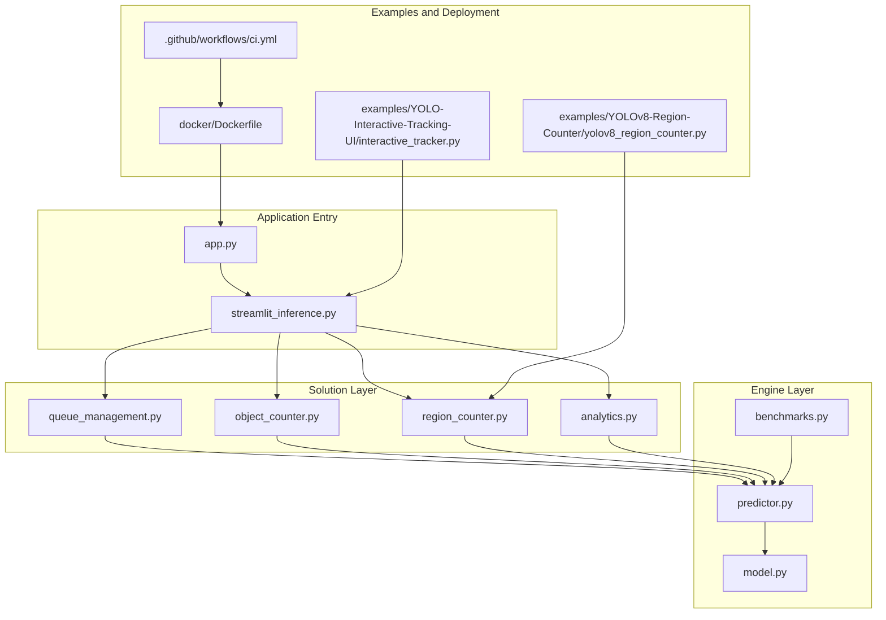
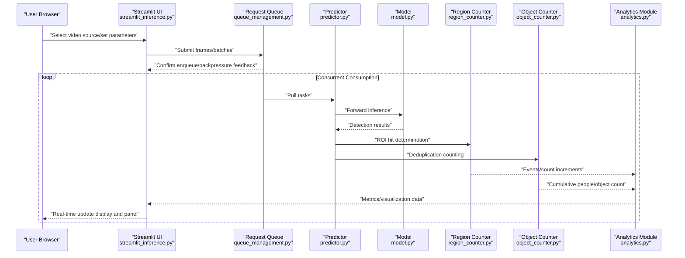
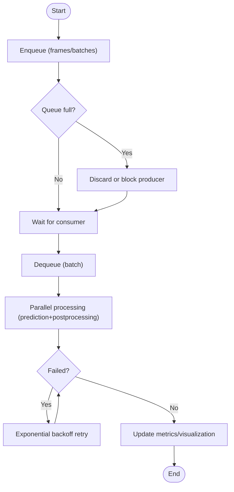
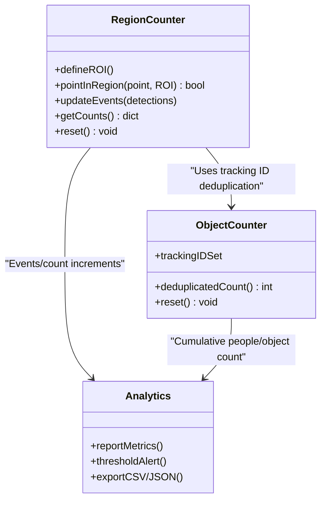
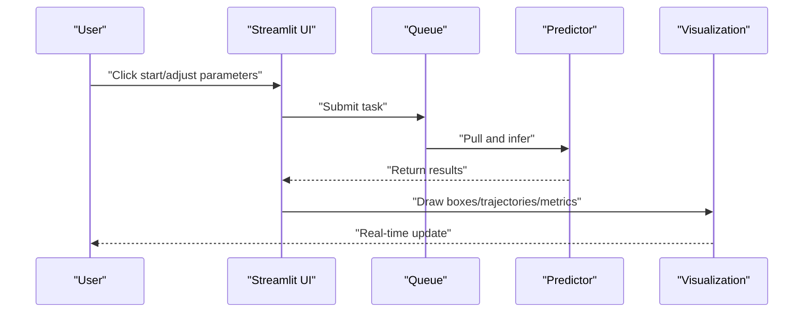
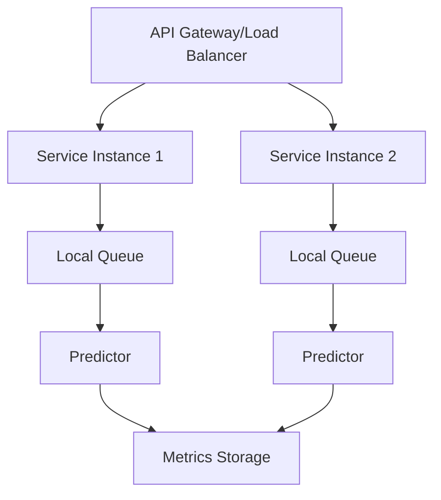
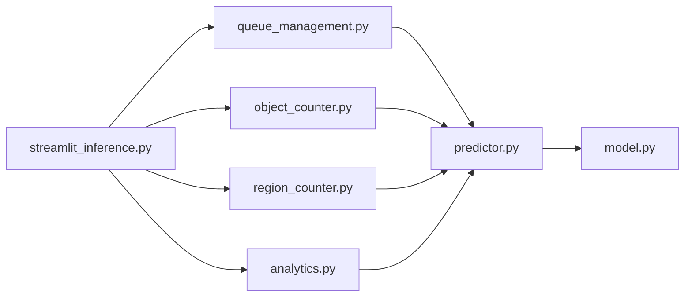

# Industrial-Grade Application Scenarios

<cite>
**Files referenced in this document**
- [README.md](file://README.md)
- [app.py](file://app.py)
- [ultralytics/solutions/__init__.py](file://ultralytics/solutions/__init__.py)
- [ultralytics/solutions/queue_management.py](file://ultralytics/solutions/queue_management.py)
- [ultralytics/solutions/object_counter.py](file://ultralytics/solutions/object_counter.py)
- [ultralytics/solutions/region_counter.py](file://ultralytics/solutions/region_counter.py)
- [ultralytics/solutions/analytics.py](file://ultralytics/solutions/analytics.py)
- [ultralytics/solutions/streamlit_inference.py](file://ultralytics/solutions/streamlit_inference.py)
- [ultralytics/engine/predictor.py](file://ultralytics/engine/predictor.py)
- [ultralytics/engine/model.py](file://ultralytics/engine/model.py)
- [ultralytics/utils/benchmarks.py](file://ultralytics/utils/benchmarks.py)
- [examples/YOLOv8-Region-Counter/yolov8_region_counter.py](file://examples/YOLOv8-Region-Counter/yolov8_region_counter.py)
- [examples/YOLO-Interactive-Tracking-UI/interactive_tracker.py](file://examples/YOLO-Interactive-Tracking-UI/interactive_tracker.py)
- [docker/Dockerfile](file://docker/Dockerfile)
- [.github/workflows/ci.yml](file://.github/workflows/ci.yml)
</cite>

## Table of Contents
1. [Introduction](#introduction)
2. [Project Structure](#project-structure)
3. [Core Components](#core-components)
4. [Architecture Overview](#architecture-overview)
5. [Detailed Component Analysis](#detailed-component-analysis)
6. [Dependency Analysis](#dependency-analysis)
7. [Performance Considerations](#performance-considerations)
8. [Troubleshooting Guide](#troubleshooting-guide)
9. [Conclusion](#conclusion)
10. [Appendix](#appendix)

## Introduction
This document is intended for industrial-grade real-time video processing and batch inference service scenarios. Combining the solution modules, engine predictor, example scripts, and deployment artifacts in the repository, it provides systematic guidance from multi-stream concurrency, memory and GPU resource optimization, to request queue management, load balancing, error retry, as well as interactive tracking UI, region counting, people statistics, behavior analysis, and high-concurrency and distributed deployment, monitoring alerts, performance tuning, and DevOps practices. The document is organized with "progressive complexity", suitable for both beginners to quickly get started and senior engineers for in-depth customization and extension.

## Project Structure
This project is built around a three-layer organization of "model inference engine + business solutions + examples and deployment":
- Engine layer: Responsible for model loading, device selection, batching, and result parsing (e.g., predictor, model).
- Solution layer: Encapsulates common business logic (object counting, region counting, streaming inference, queue management, etc.), composable and reusable.
- Examples and deployment: Provides end-to-end examples (region counting, interactive tracking), container images, and CI pipelines for engineering capabilities.

Diagram source
- [app.py:1-200](file://app.py#L1-L200)
- [ultralytics/solutions/streamlit_inference.py:1-200](file://ultralytics/solutions/streamlit_inference.py#L1-L200)
- [ultralytics/solutions/queue_management.py:1-200](file://ultralytics/solutions/queue_management.py#L1-L200)
- [ultralytics/solutions/object_counter.py:1-200](file://ultralytics/solutions/object_counter.py#L1-L200)
- [ultralytics/solutions/region_counter.py:1-200](file://ultralytics/solutions/region_counter.py#L1-L200)
- [ultralytics/solutions/analytics.py:1-200](file://ultralytics/solutions/analytics.py#L1-L200)
- [ultralytics/engine/predictor.py:1-200](file://ultralytics/engine/predictor.py#L1-L200)
- [ultralytics/engine/model.py:1-200](file://ultralytics/engine/model.py#L1-L200)
- [ultralytics/utils/benchmarks.py:1-200](file://ultralytics/utils/benchmarks.py#L1-L200)
- [examples/YOLOv8-Region-Counter/yolov8_region_counter.py:1-200](file://examples/YOLOv8-Region-Counter/yolov8_region_counter.py#L1-L200)
- [examples/YOLO-Interactive-Tracking-UI/interactive_tracker.py:1-200](file://examples/YOLO-Interactive-Tracking-UI/interactive_tracker.py#L1-L200)
- [docker/Dockerfile:1-200](file://docker/Dockerfile#L1-L200)
- [.github/workflows/ci.yml:1-200](file://.github/workflows/ci.yml#L1-L200)

Section source
- [README.md:1-200](file://README.md#L1-L200)

## Core Components
- Predictor and Model
  - Responsible for model loading, device allocation, preprocessing/postprocessing, NMS, visualization, and result aggregation.
  - Supports dynamic batch size, asynchronous execution, and caching strategies to improve throughput and reduce latency.
- Solution Modules
  - Queue management: Buffers inbound frames/requests, smooths peaks and valleys, controls concurrency and backpressure.
  - Object counting: Deduplication counting based on tracking IDs, stable cross-frame statistics.
  - Region counting: ROI polygon/rectangle determination, entry/exit events and dwell time statistics.
  - Analytics: Metric aggregation, threshold alerts, time-series data output.
- Streaming Inference UI
  - Streamlit-powered web interface supporting multiple video sources, parameter adjustment, real-time result display, and interactive control.
- Examples and Deployment
  - Region counting example script can be run directly to verify the ROI counting workflow.
  - Interactive tracking UI example demonstrates front-end interaction linked with back-end inference.
  - Dockerfile and CI workflow support containerization and automated testing.

Section source
- [ultralytics/engine/predictor.py:1-200](file://ultralytics/engine/predictor.py#L1-L200)
- [ultralytics/engine/model.py:1-200](file://ultralytics/engine/model.py#L1-L200)
- [ultralytics/solutions/queue_management.py:1-200](file://ultralytics/solutions/queue_management.py#L1-L200)
- [ultralytics/solutions/object_counter.py:1-200](file://ultralytics/solutions/object_counter.py#L1-L200)
- [ultralytics/solutions/region_counter.py:1-200](file://ultralytics/solutions/region_counter.py#L1-L200)
- [ultralytics/solutions/analytics.py:1-200](file://ultralytics/solutions/analytics.py#L1-L200)
- [ultralytics/solutions/streamlit_inference.py:1-200](file://ultralytics/solutions/streamlit_inference.py#L1-L200)
- [examples/YOLOv8-Region-Counter/yolov8_region_counter.py:1-200](file://examples/YOLOv8-Region-Counter/yolov8_region_counter.py#L1-L200)
- [examples/YOLO-Interactive-Tracking-UI/interactive_tracker.py:1-200](file://examples/YOLO-Interactive-Tracking-UI/interactive_tracker.py#L1-L200)
- [docker/Dockerfile:1-200](file://docker/Dockerfile#L1-L200)
- [.github/workflows/ci.yml:1-200](file://.github/workflows/ci.yml#L1-L200)

## Architecture Overview
The following diagram shows the overall call chain from the web entry to the inference engine and solution modules, including queue buffering, concurrent scheduling, result writeback, and visualization updates.

Diagram source
- [ultralytics/solutions/streamlit_inference.py:1-200](file://ultralytics/solutions/streamlit_inference.py#L1-L200)
- [ultralytics/solutions/queue_management.py:1-200](file://ultralytics/solutions/queue_management.py#L1-L200)
- [ultralytics/engine/predictor.py:1-200](file://ultralytics/engine/predictor.py#L1-L200)
- [ultralytics/engine/model.py:1-200](file://ultralytics/engine/model.py#L1-L200)
- [ultralytics/solutions/region_counter.py:1-200](file://ultralytics/solutions/region_counter.py#L1-L200)
- [ultralytics/solutions/object_counter.py:1-200](file://ultralytics/solutions/object_counter.py#L1-L200)
- [ultralytics/solutions/analytics.py:1-200](file://ultralytics/solutions/analytics.py#L1-L200)

## Detailed Component Analysis

### Queue Management and Concurrent Scheduling
- Responsibilities
  - Maintains a bounded queue, limiting maximum pending tasks to implement backpressure.
  - Provides producer/consumer interfaces, supporting batch pull and merging.
  - Integrates retry and timeout control to ensure stability.
- Key design
  - Capacity limit and discard strategy: When the queue is full, can choose to discard low-priority items or block the producer.
  - Batch pull: Aggregates by fixed size or time window to improve GPU utilization.
  - Error isolation: A single task failure does not affect overall queue health.
- Applicable scenarios
  - Multi-stream video concurrency, peak traffic smoothing, cross-process/cross-machine scaling.

Diagram source
- [ultralytics/solutions/queue_management.py:1-200](file://ultralytics/solutions/queue_management.py#L1-L200)

Section source
- [ultralytics/solutions/queue_management.py:1-200](file://ultralytics/solutions/queue_management.py#L1-L200)

### Region Counting and People Statistics
- Responsibilities
  - Defines ROI (polygon/rectangle), determines whether detection box center or centroid is within the region.
  - Records entry/exit events, supports dwell time and heatmap overlay.
- Key design
  - Geometric determination algorithm: Point-in-polygon test, boundary tolerance.
  - Deduplication strategy: Combines tracking IDs to avoid duplicate counting.
  - State machine: Enter -> In-region -> Exit, triggering different events.
- Typical usage
  - Entrance/exit people flow statistics, queue length monitoring, dangerous area intrusion alerts.

Diagram source
- [ultralytics/solutions/region_counter.py:1-200](file://ultralytics/solutions/region_counter.py#L1-L200)
- [ultralytics/solutions/object_counter.py:1-200](file://ultralytics/solutions/object_counter.py#L1-L200)
- [ultralytics/solutions/analytics.py:1-200](file://ultralytics/solutions/analytics.py#L1-L200)

Section source
- [ultralytics/solutions/region_counter.py:1-200](file://ultralytics/solutions/region_counter.py#L1-L200)
- [ultralytics/solutions/object_counter.py:1-200](file://ultralytics/solutions/object_counter.py#L1-L200)
- [ultralytics/solutions/analytics.py:1-200](file://ultralytics/solutions/analytics.py#L1-L200)
- [examples/YOLOv8-Region-Counter/yolov8_region_counter.py:1-200](file://examples/YOLOv8-Region-Counter/yolov8_region_counter.py#L1-L200)

### Interactive Tracking UI Development Guide
- Responsibilities
  - Provides a web interface supporting multiple video source selection, parameter adjustment, real-time result display, and interactive control.
- Key design
  - Front-end/back-end separation: Streamlit serves as the front-end, driving back-end inference through function calls.
  - Real-time data updates: Uses state variables and callbacks to refresh display and metrics.
  - User interaction: Buttons, sliders, dropdown menus map to inference parameters.
- Best practices
  - Place time-consuming operations in background threads or queues to avoid blocking the UI.
  - Throttle and downsample frequently updated metrics to reduce rendering pressure.

Diagram source
- [ultralytics/solutions/streamlit_inference.py:1-200](file://ultralytics/solutions/streamlit_inference.py#L1-L200)
- [examples/YOLO-Interactive-Tracking-UI/interactive_tracker.py:1-200](file://examples/YOLO-Interactive-Tracking-UI/interactive_tracker.py#L1-L200)

Section source
- [ultralytics/solutions/streamlit_inference.py:1-200](file://ultralytics/solutions/streamlit_inference.py#L1-L200)
- [examples/YOLO-Interactive-Tracking-UI/interactive_tracker.py:1-200](file://examples/YOLO-Interactive-Tracking-UI/interactive_tracker.py#L1-L200)

### Batch Inference Service Architecture
- Responsibilities
  - Receives external requests (HTTP/gRPC/message queue), unified enqueue, batch scheduling to predictor.
- Key design
  - Load balancing: Multi-instance deployment, session affinity or round-robin distribution.
  - Error retry: Idempotent design with exponential backoff to ensure eventual consistency.
  - Metric collection: Latency, throughput, error rate, queue length, etc.
- Extension recommendations
  - Introduce API gateway with rate limiting and circuit breaking.
  - Use persistent queues (e.g., Redis/Kafka) for cross-process/cross-node decoupling.

[This diagram is a conceptual architecture diagram and does not directly map to specific source code files]

## Dependency Analysis
- Component coupling
  - UI and solution modules are loosely coupled, communicating through function interfaces and shared state.
  - Solution modules depend on predictor and model but do not directly perceive underlying device details.
  - Queue module is independent of business logic and can be reused by multiple solutions.
- External dependencies
  - Inference backends (CUDA/TensorRT/OpenVINO, etc.) are abstracted by the engine layer.
  - Visualization and web framework (Streamlit) are used for interactive display.
- Potential circular dependencies
  - Current layering is clear with no obvious circular imports; it is recommended to maintain unidirectional dependencies when adding new modules.

Diagram source
- [ultralytics/solutions/streamlit_inference.py:1-200](file://ultralytics/solutions/streamlit_inference.py#L1-L200)
- [ultralytics/solutions/queue_management.py:1-200](file://ultralytics/solutions/queue_management.py#L1-L200)
- [ultralytics/solutions/object_counter.py:1-200](file://ultralytics/solutions/object_counter.py#L1-L200)
- [ultralytics/solutions/region_counter.py:1-200](file://ultralytics/solutions/region_counter.py#L1-L200)
- [ultralytics/solutions/analytics.py:1-200](file://ultralytics/solutions/analytics.py#L1-L200)
- [ultralytics/engine/predictor.py:1-200](file://ultralytics/engine/predictor.py#L1-L200)
- [ultralytics/engine/model.py:1-200](file://ultralytics/engine/model.py#L1-L200)

Section source
- [ultralytics/solutions/__init__.py:1-200](file://ultralytics/solutions/__init__.py#L1-L200)

## Performance Considerations
- Batch size optimization
  - Dynamically adjust batch size based on GPU memory and latency targets, balancing throughput and latency.
  - Use adaptive batching strategy: increase batch when idle, decrease batch when congested.
- Model caching
  - Warmup and keep weights resident in GPU memory to reduce cold start overhead.
  - In multi-model scenarios, keep resident by hot access order.
- Asynchronous processing
  - Asynchronize decoding, preprocessing, and postprocessing with pipeline parallelism.
  - Use non-blocking I/O and zero-copy transfer to reduce CPU-GPU bandwidth bottleneck.
- Monitoring and benchmarks
  - Use benchmark tools to evaluate throughput and latency under different configurations, establishing performance baselines.
  - Continuously collect runtime metrics to identify bottleneck stages.

Section source
- [ultralytics/utils/benchmarks.py:1-200](file://ultralytics/utils/benchmarks.py#L1-L200)
- [ultralytics/engine/predictor.py:1-200](file://ultralytics/engine/predictor.py#L1-L200)
- [ultralytics/engine/model.py:1-200](file://ultralytics/engine/model.py#L1-L200)

## Troubleshooting Guide
- Common issues
  - Queue backlog: Check consumer concurrency and batch size; scale instances if necessary.
  - Inference failure: Capture exceptions and record context (input size, confidence threshold, device state).
  - Memory leak: Periodically release intermediate tensors, avoid long-lifecycle references.
- Diagnostic methods
  - Enable verbose logging and metric reporting to identify slow paths.
  - Use benchmark scripts to reproduce experimental environments and compare regressions.
  - Construct minimal reproducible cases for specific scenarios to isolate the problem domain.

Section source
- [ultralytics/solutions/queue_management.py:1-200](file://ultralytics/solutions/queue_management.py#L1-L200)
- [ultralytics/utils/benchmarks.py:1-200](file://ultralytics/utils/benchmarks.py#L1-L200)

## Conclusion
By decoupling "queue buffering + concurrent scheduling + solution modules + engine predictor", this project achieves high-throughput, low-latency real-time video processing and batch inference services in industrial scenarios. Combined with interactive UI, region counting, and people statistics capabilities, it can quickly implement typical applications such as entrance/exit control, security alerts, and operational analytics. With containerization and CI/CD, it achieves stable version management and automated testing, meeting enterprise-grade delivery requirements.

## Appendix
- Deployment and operations
  - Use Docker to package services, ensuring environment consistency and portability.
  - Auto-scale in Kubernetes based on load levels, combined with HPA and resource quotas.
- DevOps practices
  - CI pipeline includes static checks, unit tests, and benchmark regression to ensure quality gates.
  - Release process adopts semantic versioning and changelogs for easy traceability and rollback.

Section source
- [docker/Dockerfile:1-200](file://docker/Dockerfile#L1-L200)
- [.github/workflows/ci.yml:1-200](file://.github/workflows/ci.yml#L1-L200)
