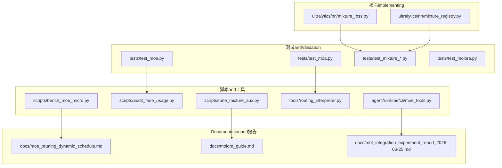
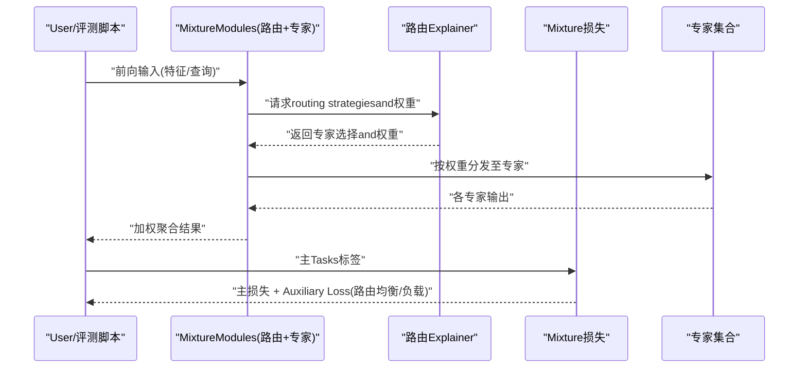
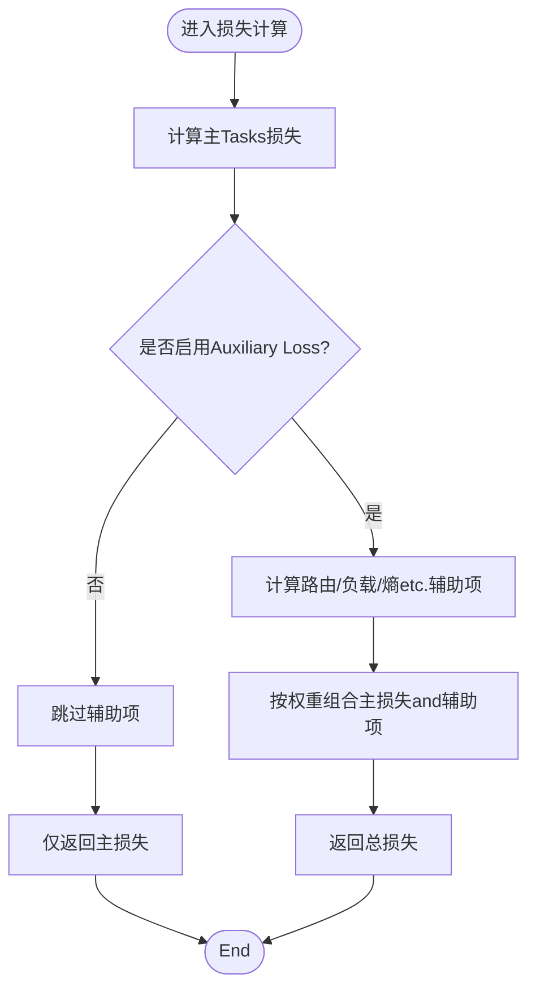
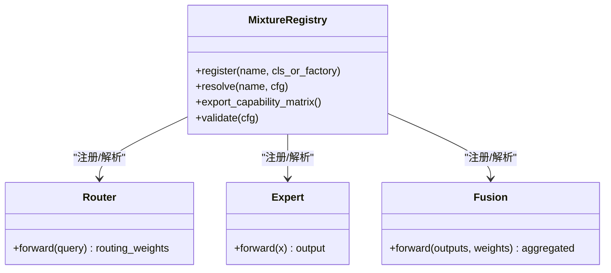
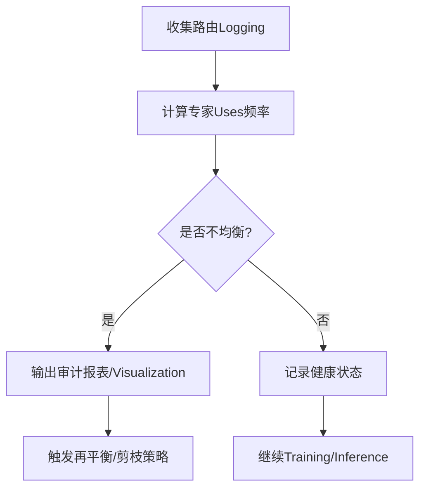
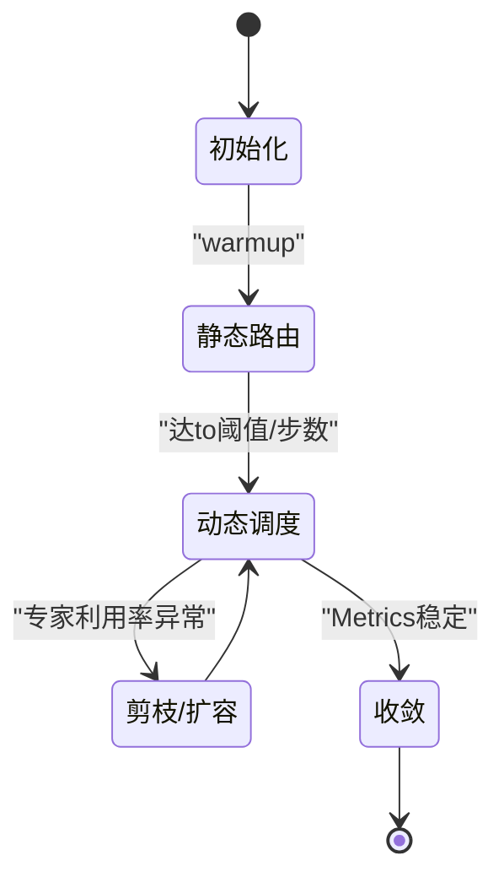
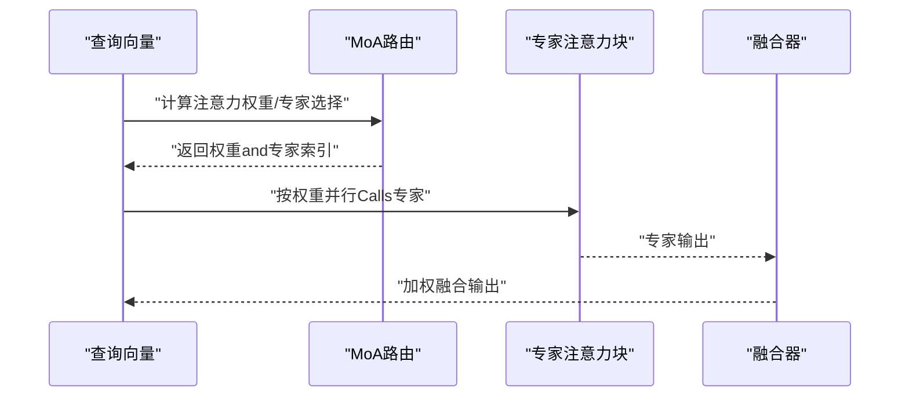
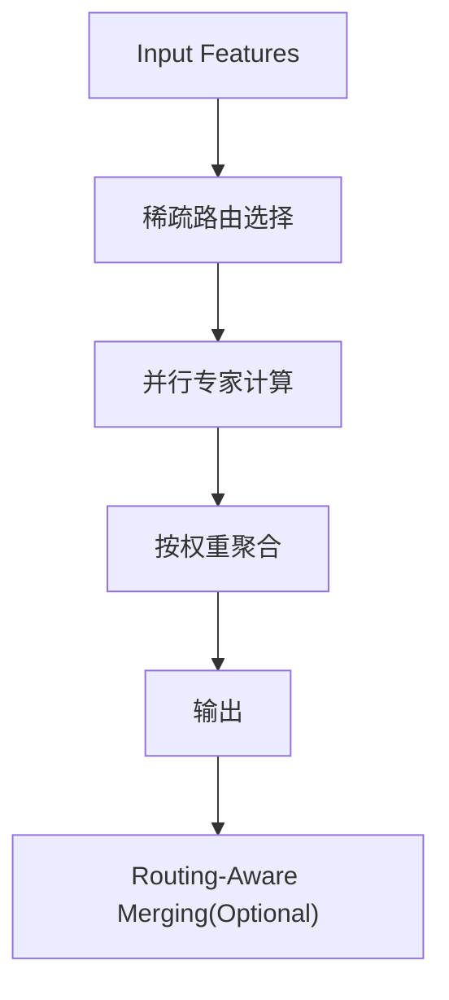
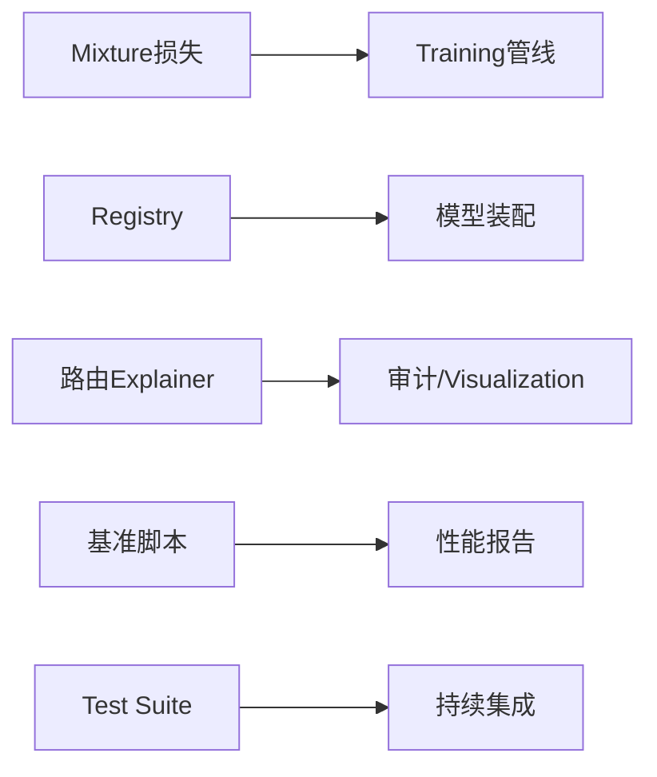

# Mixture of Experts应用Examples

<cite>
**Files Referenced in This Document**
- [mixture_loss.py](file://ultralytics/nn/mixture_loss.py)
- [mixture_registry.py](file://ultralytics/nn/mixture_registry.py)
- [moe_tools.py](file://agent/runtime/cli/moe_tools.py)
- [test_moa.py](file://tests/test_moa.py)
- [test_moe.py](file://tests/test_moe.py)
- [test_mixture_config_resolution.py](file://tests/test_mixture_config_resolution.py)
- [test_mixture_numeric.py](file://tests/test_mixture_numeric.py)
- [test_mixture_export.py](file://tests/test_mixture_export.py)
- [test_mixture_model_registry.py](file://tests/test_mixture_model_registry.py)
- [test_mixture_aux_loss.py](file://tests/test_mixture_aux_loss.py)
- [test_mixture_compile.py](file://tests/test_mixture_compile.py)
- [test_mixture_loss_composition.py](file://tests/test_mixture_loss_composition.py)
- [test_moe_dynamic_scheduler.py](file://tests/test_moe_dynamic_scheduler.py)
- [test_moe_router_boundaries.py](file://tests/test_moe_router_boundaries.py)
- [test_moe_ssot.py](file://tests/test_moe_ssot.py)
- [test_moe_usage_audit.py](file://tests/test_moe_usage_audit.py)
- [test_moe_validation_collectives.py](file://tests/test_moe_validation_collectives.py)
- [test_moe_variant_contract.py](file://tests/test_moe_variant_contract.py)
- [test_molora.py](file://tests/test_molora.py)
- [test_molora_sparse_dispatch.py](file://tests/test_molora_sparse_dispatch.py)
- [test_molora_routing_aware_merge.py](file://tests/test_molora_routing_aware_merge.py)
- [test_molora_dtype.py](file://tests/test_molora_dtype.py)
- [test_molora_merge_semantics.py](file://tests/test_molora_merge_semantics.py)
- [test_molora_supplementary.py](file://tests/test_molora_supplementary.py)
- [test_moa_mot_ddp_math.py](file://tests/test_moa_mot_ddp_math.py)
- [test_moa_mot_ssot.py](file://tests/test_moa_mot_ssot.py)
- [test_moe_amp_index_add.py](file://tests/test_moe_amp_index_add.py)
- [test_moe_ddp_fixes.py](file://tests/test_moe_ddp_fixes.py)
- [test_moe_aware_peft.py](file://tests/test_moe_aware_peft.py)
- [test_moe_dynamic_schedule.py](file://tests/test_moe_dynamic_schedule.py)
- [test_moe_usage_audit.py](file://tests/test_moe_usage_audit.py)
- [bench_moe_micro.py](file://scripts/bench_moe_micro.py)
- [bench_moe_mps.py](file://scripts/bench_moe_mps.py)
- [audit_moe_usage.py](file://scripts/audit_moe_usage.py)
- [check_moe_ssot.py](file://scripts/check_moe_ssot.py)
- [tune_mixture_aux.py](file://scripts/tune_mixture_aux.py)
- [compare_moe_coco128.py](file://scripts/compare_moe_coco128.py)
- [compare_moe_v0_12_voc.py](file://scripts/compare_moe_v0_12_voc.py)
- [compare_moe_v0_13_15_voc.py](file://scripts/compare_moe_v0_13_15_voc.py)
- [plot_moe_pruning_sweep.py](file://scripts/plot_moe_pruning_sweep.py)
- [run_moe_dynamic_schedule_ablation.py](file://scripts/run_moe_dynamic_schedule_ablation.py)
- [analyze_mot_routing.py](file://scripts/analyze_mot_routing.py)
- [diagnose_mot_routing.py](file://scripts/diagnose_mot_routing.py)
- [prepare_mot_routing_scenes.py](file://scripts/prepare_mot_routing_scenes.py)
- [routing_interpreter.py](file://tools/routing_interpreter.py)
- [moe_pruning_dynamic_schedule.md](file://docs/moe_pruning_dynamic_schedule.md)
- [molora_guide.md](file://docs/molora_guide.md)
- [mot_integration_experiment_report_2026-06-25.md](file://docs/mot_integration_experiment_report_2026-06-25.md)
- [YOLO-Master-v260721-MoA-MoE-MoT-PEFT-Planner-深度分析-v4.md](file://YOLO-Master-v260721-MoA-MoE-MoT-PEFT-Planner-深度分析-v4.md)
</cite>

## Table of Contents
1. [Introduction](#Introduction)
2. [Project Structure](#Project Structure)
3. [Core Components](#Core Components)
4. [Architecture Overview](#Architecture Overview)
5. [Detailed Component Analysis](#Detailed Component Analysis)
6. [Dependency Analysis](#Dependency Analysis)
7. [性能and调优](#性能and调优)
8. [Troubleshooting Guide](#Troubleshooting Guide)
9. [Conclusion](#Conclusion)
10. [Appendix：Training ConfigurationandTasks场景](#AppendixTraining ConfigurationandTasks场景)

## Introduction
本文件targeting希望while视觉Tasks中落地Mixture of Experts（MoE）andMixture注意力（MoA）的工程实践者，provides从架构、配置toTraining、Evaluation、部署and调试的完整指南。内容覆盖：
- MoE/MoA 的配置方法：routing strategies、Load Balancing、Expert Network规模and稀疏度etc.关键参数
- MoA 的implementing要点：注意力权重分配、Dynamic Routing算法、专家选择策略
- Training ConfigurationExamples：Loss Function设计、Gradient更新策略、监控Metrics
- 不同Tasks的调优经验：Object Detection、分割、Pose Estimationetc.
- 性能分析and调试：专家利用率监控、路由决策Visualization、Distributed Training注意事项

## Project Structure
仓库围绕“模型定义—路由andMixture机制—TrainingandEvaluation—工具andDocumentation”分层组织。and MoE/MoA 相关的核心代码集中while nn Modulesand tests、scripts、tools、docs etc.Table of Contents中；agent 侧provides CLI 工具链Centered onSupporting诊断and实验。

Figure Source
- [mixture_loss.py](file://ultralytics/nn/mixture_loss.py)
- [mixture_registry.py](file://ultralytics/nn/mixture_registry.py)
- [test_moe.py](file://tests/test_moe.py)
- [test_moa.py](file://tests/test_moa.py)
- [bench_moe_micro.py](file://scripts/bench_moe_micro.py)
- [audit_moe_usage.py](file://scripts/audit_moe_usage.py)
- [tune_mixture_aux.py](file://scripts/tune_mixture_aux.py)
- [routing_interpreter.py](file://tools/routing_interpreter.py)
- [moe_tools.py](file://agent/runtime/cli/moe_tools.py)
- [moe_pruning_dynamic_schedule.md](file://docs/moe_pruning_dynamic_schedule.md)
- [molora_guide.md](file://docs/molora_guide.md)
- [mot_integration_experiment_report_2026-06-25.md](file://docs/mot_integration_experiment_report_2026-06-25.md)

Section Source
- [mixture_loss.py](file://ultralytics/nn/mixture_loss.py)
- [mixture_registry.py](file://ultralytics/nn/mixture_registry.py)
- [test_moe.py](file://tests/test_moe.py)
- [test_moa.py](file://tests/test_moa.py)
- [bench_moe_micro.py](file://scripts/bench_moe_micro.py)
- [audit_moe_usage.py](file://scripts/audit_moe_usage.py)
- [tune_mixture_aux.py](file://scripts/tune_mixture_aux.py)
- [routing_interpreter.py](file://tools/routing_interpreter.py)
- [moe_tools.py](file://agent/runtime/cli/moe_tools.py)
- [moe_pruning_dynamic_schedule.md](file://docs/moe_pruning_dynamic_schedule.md)
- [molora_guide.md](file://docs/molora_guide.md)
- [mot_integration_experiment_report_2026-06-25.md](file://docs/mot_integration_experiment_report_2026-06-25.md)

## Core Components
- Mixture损失and辅助项
  - 负责计算主Tasks损失and MoE/MoA 相关Auxiliary Loss（such as路由均衡、负载惩罚etc.），并provides组合接口Centered on便while不同Tasks中复用。
- MixtureModulesRegistry
  - 统一注册and管理各类MixtureModules（路由、专家、融合器），provides按名称解析、版本兼容andExportcapabilities矩阵校验。
- 路由Explainerand审计工具
  - 对路由决策进行可解释性分析、统计专家Uses率、绘制路由热力图，并输出审计报表用于定位不均衡问题。
- 基准and微调脚本
  - provides微基准（吞吐/延迟）、MPS/CPU 行for一致性检查、Auxiliary Loss调参、跨数据集对比and动态调度消融etc.。

Section Source
- [mixture_loss.py](file://ultralytics/nn/mixture_loss.py)
- [mixture_registry.py](file://ultralytics/nn/mixture_registry.py)
- [routing_interpreter.py](file://tools/routing_interpreter.py)
- [audit_moe_usage.py](file://scripts/audit_moe_usage.py)
- [bench_moe_micro.py](file://scripts/bench_moe_micro.py)
- [tune_mixture_aux.py](file://scripts/tune_mixture_aux.py)

## Architecture Overview
下图展示了 MoE/MoA whileInferenceandTraining中的端to端流程，包括数据输入、路由决策、专家并行执行、结果聚合and损失回传。

Figure Source
- [mixture_loss.py](file://ultralytics/nn/mixture_loss.py)
- [routing_interpreter.py](file://tools/routing_interpreter.py)
- [test_moe.py](file://tests/test_moe.py)
- [test_moa.py](file://tests/test_moa.py)

## Detailed Component Analysis

### Mixture损失and辅助项（Loss & Aux）
- 功能要点
  - 主Tasks损失and MoE/MoA Auxiliary Loss的组合接口
  - Supporting多种辅助项：路由熵正则、专家Load Balancing、门控稳定性约束etc.
  - provides可插拔的损失权重调度and开关
- 复杂度and性能
  - 辅助项计算通常for O(N_experts) 或 O(batch*topk)，建议Combining稀疏路由控制 topk and批大小
- 错误处理and数值稳定
  - 对零权重、NaN/Inf 进行保护，避免Backpropagation异常
- Refer to路径
  - [mixture_loss.py](file://ultralytics/nn/mixture_loss.py)
  - [test_mixture_loss_composition.py](file://tests/test_mixture_loss_composition.py)
  - [test_mixture_aux_loss.py](file://tests/test_mixture_aux_loss.py)

Figure Source
- [mixture_loss.py](file://ultralytics/nn/mixture_loss.py)
- [test_mixture_loss_composition.py](file://tests/test_mixture_loss_composition.py)
- [test_mixture_aux_loss.py](file://tests/test_mixture_aux_loss.py)

Section Source
- [mixture_loss.py](file://ultralytics/nn/mixture_loss.py)
- [test_mixture_loss_composition.py](file://tests/test_mixture_loss_composition.py)
- [test_mixture_aux_loss.py](file://tests/test_mixture_aux_loss.py)

### MixtureModulesRegistry（Registry）
- 功能要点
  - 集中管理路由、专家、融合器的注册and解析
  - provides版本兼容、默认参数合并、Exportcapabilities矩阵校验
- 扩展方式
  - Via装饰器或显式注册 API 新增自定义路由/专家
- Refer to路径
  - [mixture_registry.py](file://ultralytics/nn/mixture_registry.py)
  - [test_mixture_model_registry.py](file://tests/test_mixture_model_registry.py)
  - [test_mixture_config_resolution.py](file://tests/test_mixture_config_resolution.py)

Figure Source
- [mixture_registry.py](file://ultralytics/nn/mixture_registry.py)
- [test_mixture_model_registry.py](file://tests/test_mixture_model_registry.py)
- [test_mixture_config_resolution.py](file://tests/test_mixture_config_resolution.py)

Section Source
- [mixture_registry.py](file://ultralytics/nn/mixture_registry.py)
- [test_mixture_model_registry.py](file://tests/test_mixture_model_registry.py)
- [test_mixture_config_resolution.py](file://tests/test_mixture_config_resolution.py)

### 路由Explainerand审计（Routing Interpreter & Audit）
- 功能要点
  - 统计每层/每步的路由分布、专家Uses率、Gini 系数etc.
  - 生成Visualization（热力图、时序曲线）and审计报表
  - 辅助定位“热点专家”和“冷专家”，指导剪枝and重平衡
- Refer to路径
  - [routing_interpreter.py](file://tools/routing_interpreter.py)
  - [audit_moe_usage.py](file://scripts/audit_moe_usage.py)
  - [test_moe_usage_audit.py](file://tests/test_moe_usage_audit.py)

Figure Source
- [routing_interpreter.py](file://tools/routing_interpreter.py)
- [audit_moe_usage.py](file://scripts/audit_moe_usage.py)
- [test_moe_usage_audit.py](file://tests/test_moe_usage_audit.py)

Section Source
- [routing_interpreter.py](file://tools/routing_interpreter.py)
- [audit_moe_usage.py](file://scripts/audit_moe_usage.py)
- [test_moe_usage_audit.py](file://tests/test_moe_usage_audit.py)

### MoE 动态调度and边界（Dynamic Scheduler & Boundaries）
- 功能要点
  - 根据Training阶段动态调整 top-k、路由温度、Load Balancing权重etc.
  - 维护路由边界and容量上限，防止过载
- Refer to路径
  - [test_moe_dynamic_scheduler.py](file://tests/test_moe_dynamic_scheduler.py)
  - [test_moe_router_boundaries.py](file://tests/test_moe_router_boundaries.py)
  - [run_moe_dynamic_schedule_ablation.py](file://scripts/run_moe_dynamic_schedule_ablation.py)
  - [moe_pruning_dynamic_schedule.md](file://docs/moe_pruning_dynamic_schedule.md)

Figure Source
- [test_moe_dynamic_scheduler.py](file://tests/test_moe_dynamic_scheduler.py)
- [test_moe_router_boundaries.py](file://tests/test_moe_router_boundaries.py)
- [run_moe_dynamic_schedule_ablation.py](file://scripts/run_moe_dynamic_schedule_ablation.py)
- [moe_pruning_dynamic_schedule.md](file://docs/moe_pruning_dynamic_schedule.md)

Section Source
- [test_moe_dynamic_scheduler.py](file://tests/test_moe_dynamic_scheduler.py)
- [test_moe_router_boundaries.py](file://tests/test_moe_router_boundaries.py)
- [run_moe_dynamic_schedule_ablation.py](file://scripts/run_moe_dynamic_schedule_ablation.py)
- [moe_pruning_dynamic_schedule.md](file://docs/moe_pruning_dynamic_schedule.md)

### MoA（Mixture注意力）and MOT 集成
- 功能要点
  - while注意力层引入多专家分支，按查询动态选择专家子集
  - andMulti-Object Tracking（MOT）场景Combining，提升复杂场景下的鲁棒性and精度
- Refer to路径
  - [test_moa.py](file://tests/test_moa.py)
  - [test_moa_mot_ddp_math.py](file://tests/test_moa_mot_ddp_math.py)
  - [test_moa_mot_ssot.py](file://tests/test_moa_mot_ssot.py)
  - [analyze_mot_routing.py](file://scripts/analyze_mot_routing.py)
  - [diagnose_mot_routing.py](file://scripts/diagnose_mot_routing.py)
  - [prepare_mot_routing_scenes.py](file://scripts/prepare_mot_routing_scenes.py)
  - [mot_integration_experiment_report_2026-06-25.md](file://docs/mot_integration_experiment_report_2026-06-25.md)

Figure Source
- [test_moa.py](file://tests/test_moa.py)
- [test_moa_mot_ddp_math.py](file://tests/test_moa_mot_ddp_math.py)
- [test_moa_mot_ssot.py](file://tests/test_moa_mot_ssot.py)
- [analyze_mot_routing.py](file://scripts/analyze_mot_routing.py)
- [diagnose_mot_routing.py](file://scripts/diagnose_mot_routing.py)
- [prepare_mot_routing_scenes.py](file://scripts/prepare_mot_routing_scenes.py)
- [mot_integration_experiment_report_2026-06-25.md](file://docs/mot_integration_experiment_report_2026-06-25.md)

Section Source
- [test_moa.py](file://tests/test_moa.py)
- [test_moa_mot_ddp_math.py](file://tests/test_moa_mot_ddp_math.py)
- [test_moa_mot_ssot.py](file://tests/test_moa_mot_ssot.py)
- [analyze_mot_routing.py](file://scripts/analyze_mot_routing.py)
- [diagnose_mot_routing.py](file://scripts/diagnose_mot_routing.py)
- [prepare_mot_routing_scenes.py](file://scripts/prepare_mot_routing_scenes.py)
- [mot_integration_experiment_report_2026-06-25.md](file://docs/mot_integration_experiment_report_2026-06-25.md)

### Molora（稀疏路由andRouting-Aware Merging）
- 功能要点
  - 稀疏路由：减少激活专家数量，降低计算量
  - Routing-Aware Merging：while LoRA/PEFT 合并时考虑路由权重，保持性能
- Refer to路径
  - [test_molora.py](file://tests/test_molora.py)
  - [test_molora_sparse_dispatch.py](file://tests/test_molora_sparse_dispatch.py)
  - [test_molora_routing_aware_merge.py](file://tests/test_molora_routing_aware_merge.py)
  - [test_molora_dtype.py](file://tests/test_molora_dtype.py)
  - [test_molora_merge_semantics.py](file://tests/test_molora_merge_semantics.py)
  - [test_molora_supplementary.py](file://tests/test_molora_supplementary.py)
  - [molora_guide.md](file://docs/molora_guide.md)

Figure Source
- [test_molora.py](file://tests/test_molora.py)
- [test_molora_sparse_dispatch.py](file://tests/test_molora_sparse_dispatch.py)
- [test_molora_routing_aware_merge.py](file://tests/test_molora_routing_aware_merge.py)
- [test_molora_dtype.py](file://tests/test_molora_dtype.py)
- [test_molora_merge_semantics.py](file://tests/test_molora_merge_semantics.py)
- [test_molora_supplementary.py](file://tests/test_molora_supplementary.py)
- [molora_guide.md](file://docs/molora_guide.md)

Section Source
- [test_molora.py](file://tests/test_molora.py)
- [test_molora_sparse_dispatch.py](file://tests/test_molora_sparse_dispatch.py)
- [test_molora_routing_aware_merge.py](file://tests/test_molora_routing_aware_merge.py)
- [test_molora_dtype.py](file://tests/test_molora_dtype.py)
- [test_molora_merge_semantics.py](file://tests/test_molora_merge_semantics.py)
- [test_molora_supplementary.py](file://tests/test_molora_supplementary.py)
- [molora_guide.md](file://docs/molora_guide.md)

## Dependency Analysis
- 组件耦合
  - Mixture损失andRegistryfor上层Training/Inferenceprovides稳定接口
  - 路由Explainerand审计工具依赖运行时Loggingand中间张量
  - 基准脚本and测试用例共同保障数值正确性and性能回归
- External Dependencies
  - 分布式通信（DDP）、自动Mixture精度（AMP）、Export Backends（ONNX/TensorRT etc.）
- Potential Cycles依赖
  - Registry应单向依赖具体implementing，避免反向引用

Figure Source
- [mixture_loss.py](file://ultralytics/nn/mixture_loss.py)
- [mixture_registry.py](file://ultralytics/nn/mixture_registry.py)
- [routing_interpreter.py](file://tools/routing_interpreter.py)
- [bench_moe_micro.py](file://scripts/bench_moe_micro.py)
- [test_moe.py](file://tests/test_moe.py)
- [test_moa.py](file://tests/test_moa.py)

Section Source
- [mixture_loss.py](file://ultralytics/nn/mixture_loss.py)
- [mixture_registry.py](file://ultralytics/nn/mixture_registry.py)
- [routing_interpreter.py](file://tools/routing_interpreter.py)
- [bench_moe_micro.py](file://scripts/bench_moe_micro.py)
- [test_moe.py](file://tests/test_moe.py)
- [test_moa.py](file://tests/test_moa.py)

## 性能and调优
- routing strategiesandLoad Balancing
  - 建议开启路由熵正则and负载惩罚，Combined with动态调度逐步提高 top-k 或降低温度
  - 关注专家Uses率的 Gini 系数，目标 < 0.6（视Tasks而定）
- 专家规模and稀疏度
  - 小模型优先采用稀疏路由（Molora）Centered on降低峰值内存and延迟
  - 大模型可适度增加专家数量，但需Combined with容量上限and重平衡
- Training稳定性
  - AMP 下注意 index_add 的数值稳定性（参见相关测试）
  - 对 NaN/Inf 做早期检测and回退策略
- 监控andVisualization
  - Uses路由Explainerand审计脚本定期生成报告
  - Combining基准脚本观察吞吐/延迟变化
- Refer to路径
  - [bench_moe_micro.py](file://scripts/bench_moe_micro.py)
  - [bench_moe_mps.py](file://scripts/bench_moe_mps.py)
  - [audit_moe_usage.py](file://scripts/audit_moe_usage.py)
  - [tune_mixture_aux.py](file://scripts/tune_mixture_aux.py)
  - [test_moe_amp_index_add.py](file://tests/test_moe_amp_index_add.py)
  - [test_moe_ddp_fixes.py](file://tests/test_moe_ddp_fixes.py)
  - [test_moe_ssot.py](file://tests/test_moe_ssot.py)
  - [test_moe_validation_collectives.py](file://tests/test_moe_validation_collectives.py)
  - [test_moe_variant_contract.py](file://tests/test_moe_variant_contract.py)
  - [test_mixture_compile.py](file://tests/test_mixture_compile.py)
  - [test_mixture_export.py](file://tests/test_mixture_export.py)

Section Source
- [bench_moe_micro.py](file://scripts/bench_moe_micro.py)
- [bench_moe_mps.py](file://scripts/bench_moe_mps.py)
- [audit_moe_usage.py](file://scripts/audit_moe_usage.py)
- [tune_mixture_aux.py](file://scripts/tune_mixture_aux.py)
- [test_moe_amp_index_add.py](file://tests/test_moe_amp_index_add.py)
- [test_moe_ddp_fixes.py](file://tests/test_moe_ddp_fixes.py)
- [test_moe_ssot.py](file://tests/test_moe_ssot.py)
- [test_moe_validation_collectives.py](file://tests/test_moe_validation_collectives.py)
- [test_moe_variant_contract.py](file://tests/test_moe_variant_contract.py)
- [test_mixture_compile.py](file://tests/test_mixture_compile.py)
- [test_mixture_export.py](file://tests/test_mixture_export.py)

## Troubleshooting Guide
- 常见问题
  - 路由崩溃/NaN：检查Auxiliary Loss权重and数值稳定设置
  - 专家不均衡：查看审计报表，必要时调整路由温度或容量上限
  - Export Failure：确认Registry的Exportcapabilities矩阵and配置一致性
- 快速定位
  - Uses路由Explainerand审计脚本生成报告
  - 运行微基准and MPS/CPU 一致性检查
  - 针对 MOT 场景Uses专用诊断脚本
- Refer to路径
  - [routing_interpreter.py](file://tools/routing_interpreter.py)
  - [audit_moe_usage.py](file://scripts/audit_moe_usage.py)
  - [check_moe_ssot.py](file://scripts/check_moe_ssot.py)
  - [analyze_mot_routing.py](file://scripts/analyze_mot_routing.py)
  - [diagnose_mot_routing.py](file://scripts/diagnose_mot_routing.py)
  - [prepare_mot_routing_scenes.py](file://scripts/prepare_mot_routing_scenes.py)
  - [moe_tools.py](file://agent/runtime/cli/moe_tools.py)

Section Source
- [routing_interpreter.py](file://tools/routing_interpreter.py)
- [audit_moe_usage.py](file://scripts/audit_moe_usage.py)
- [check_moe_ssot.py](file://scripts/check_moe_ssot.py)
- [analyze_mot_routing.py](file://scripts/analyze_mot_routing.py)
- [diagnose_mot_routing.py](file://scripts/diagnose_mot_routing.py)
- [prepare_mot_routing_scenes.py](file://scripts/prepare_mot_routing_scenes.py)
- [moe_tools.py](file://agent/runtime/cli/moe_tools.py)

## Conclusion
本项目provides了完整的 MoE/MoA 工程化capabilities：从RegistryandLoss combination，to路由解释and审计、动态调度and稀疏路由、Centered onand MOT 场景集成。借助丰富的测试and脚本，可while保证数值稳定性，获得良好的可Extensibilityand可观测性。建议while真实Tasks中遵循“先稳后快”的原则：先确保路由均衡and数值稳定，再Via稀疏路由and动态调度Optimization性能。

## Appendix：Training ConfigurationandTasks场景
- 通用Training Configuration建议
  - Loss combination：主损失 + 路由熵正则 + 负载惩罚，初始权重较小，随Training逐步提升
  - routing strategies：Top-k 稀疏路由 + 温度缩放，warmup 阶段固定路由，随后动态调整
  - 专家规模：小模型 4–8 个专家，大模型 8–16 个专家，按需裁剪
  - 监控Metrics：主TasksMetrics、专家Uses率、Gini 系数、路由熵、Auxiliary Loss占比
- Tasks场景and特定配置
  - Object Detection：适当增大 top-k，增强多尺度特征路由；关注小目标专家的Uses率
  - Instance Segmentation：引入空间感知的路由先验，提升掩码质量
  - Pose Estimation：对关节点密集区域加强专家选择多样性
  - MOT：Combining场景感知路由and轨迹一致性，缓解遮挡and长尾场景
- Refer to路径
  - [compare_moe_coco128.py](file://scripts/compare_moe_coco128.py)
  - [compare_moe_v0_12_voc.py](file://scripts/compare_moe_v0_12_voc.py)
  - [compare_moe_v0_13_15_voc.py](file://scripts/compare_moe_v0_13_15_voc.py)
  - [plot_moe_pruning_sweep.py](file://scripts/plot_moe_pruning_sweep.py)
  - [molora_guide.md](file://docs/molora_guide.md)
  - [moe_pruning_dynamic_schedule.md](file://docs/moe_pruning_dynamic_schedule.md)
  - [mot_integration_experiment_report_2026-06-25.md](file://docs/mot_integration_experiment_report_2026-06-25.md)
  - [YOLO-Master-v260721-MoA-MoE-MoT-PEFT-Planner-深度分析-v4.md](file://YOLO-Master-v260721-MoA-MoE-MoT-PEFT-Planner-深度分析-v4.md)

Section Source
- [compare_moe_coco128.py](file://scripts/compare_moe_coco128.py)
- [compare_moe_v0_12_voc.py](file://scripts/compare_moe_v0_12_voc.py)
- [compare_moe_v0_13_15_voc.py](file://scripts/compare_moe_v0_13_15_voc.py)
- [plot_moe_pruning_sweep.py](file://scripts/plot_moe_pruning_sweep.py)
- [molora_guide.md](file://docs/molora_guide.md)
- [moe_pruning_dynamic_schedule.md](file://docs/moe_pruning_dynamic_schedule.md)
- [mot_integration_experiment_report_2026-06-25.md](file://docs/mot_integration_experiment_report_2026-06-25.md)
- [YOLO-Master-v260721-MoA-MoE-MoT-PEFT-Planner-深度分析-v4.md](file://YOLO-Master-v260721-MoA-MoE-MoT-PEFT-Planner-深度分析-v4.md)