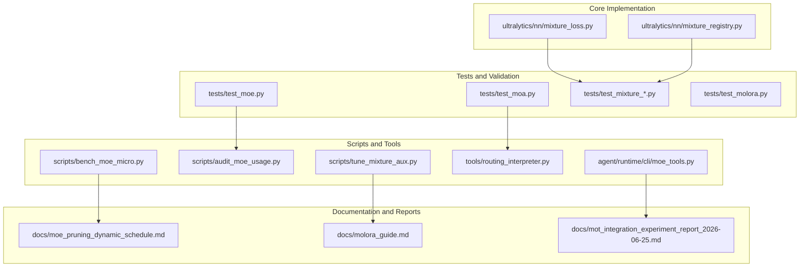
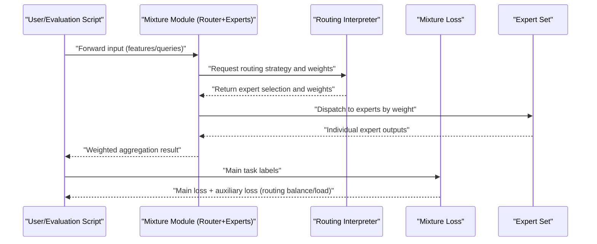
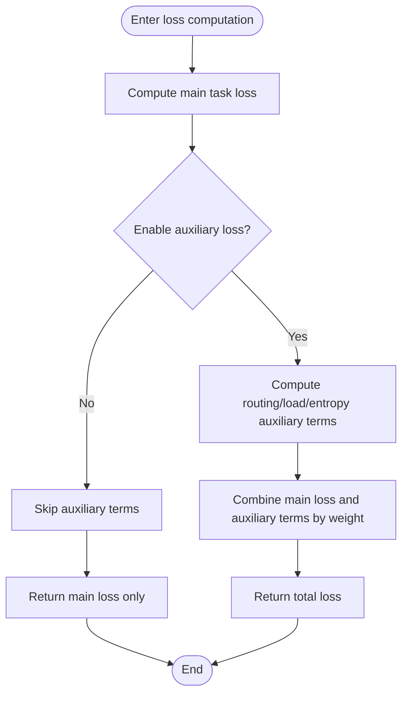
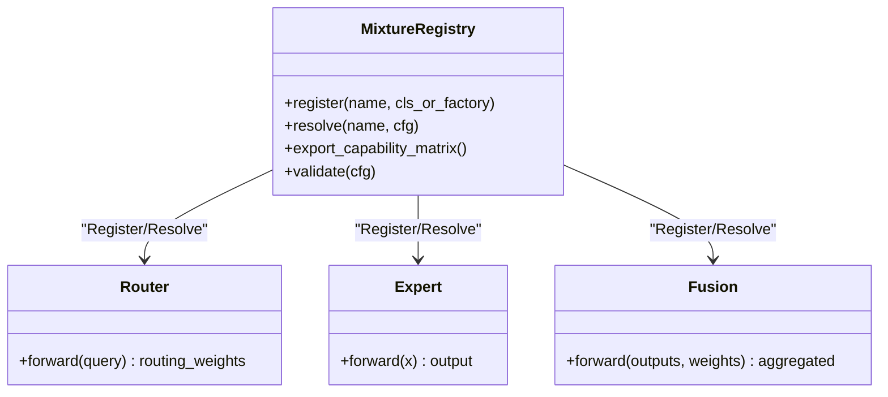
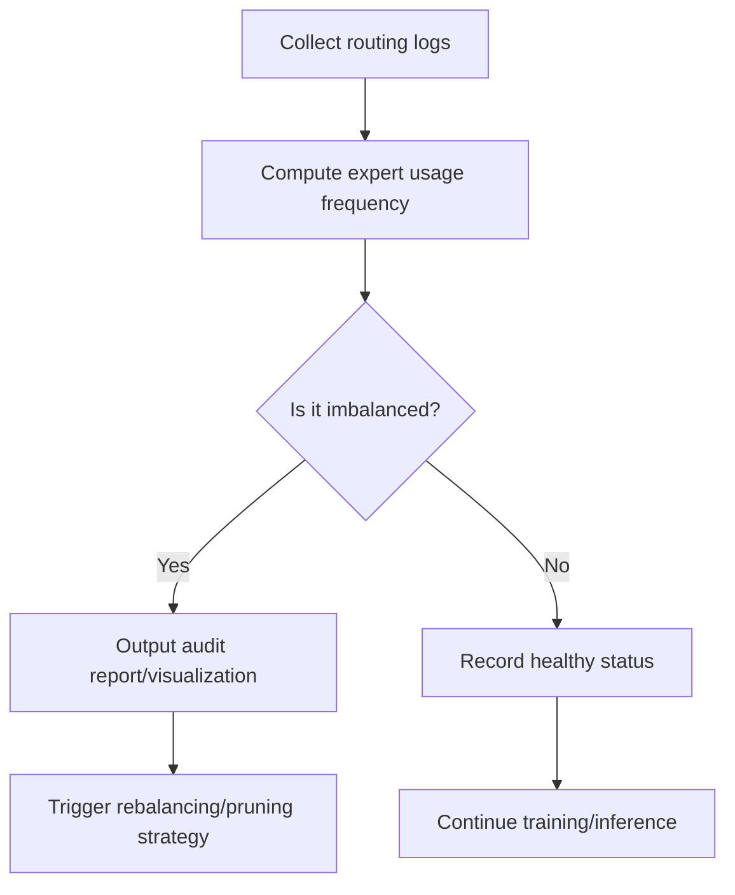
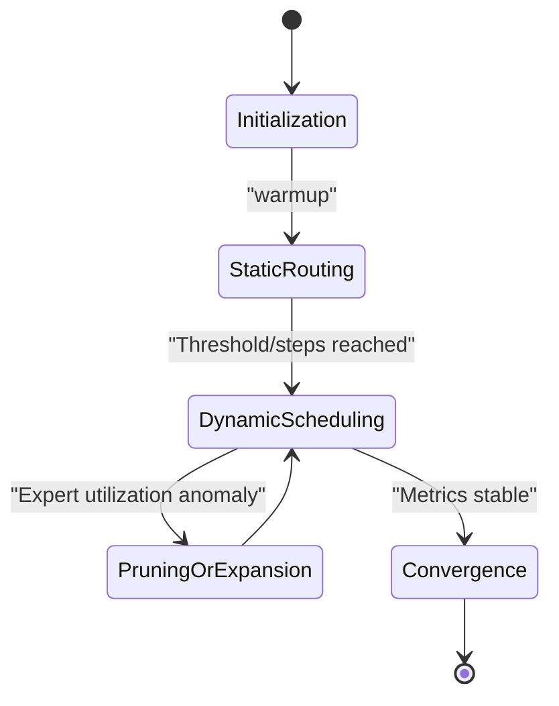
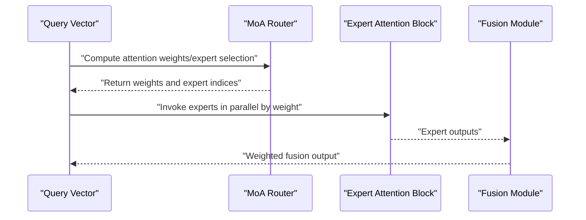
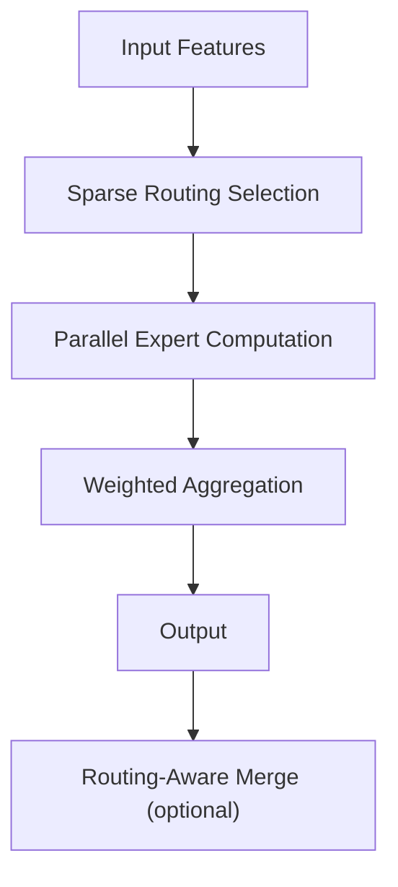
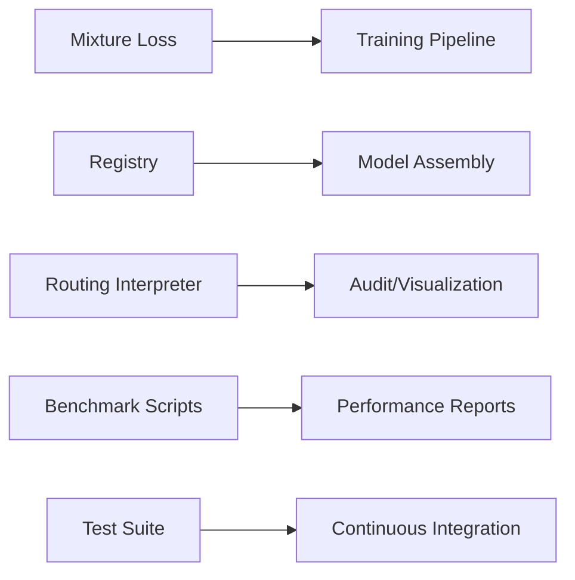

# Mixture of Experts Application Examples

<cite>
**Files referenced in this document**
- [mixture_loss.py](file://ultralytics/nn/mixture_loss.py)
- [mixture_registry.py](file://ultralytics/nn/mixture_registry.py)
- [moe_tools.py](file://agent/runtime/cli/moe_tools.py)
- [test_moa.py](file://tests/test_moa.py)
- [test_moe.py](file://tests/test_moe.py)
- [test_mixture_config_resolution.py](file://tests/test_mixture_config_resolution.py)
- [test_mixture_numeric.py](file://tests/test_mixture_numeric.py)
- [test_mixture_export.py](file://tests/test_mixture_export.py)
- [test_mixture_model_registry.py](file://tests/test_mixture_model_registry.py)
- [test_mixture_aux_loss.py](file://tests/test_mixture_aux_loss.py)
- [test_mixture_compile.py](file://tests/test_mixture_compile.py)
- [test_mixture_loss_composition.py](file://tests/test_mixture_loss_composition.py)
- [test_moe_dynamic_scheduler.py](file://tests/test_moe_dynamic_scheduler.py)
- [test_moe_router_boundaries.py](file://tests/test_moe_router_boundaries.py)
- [test_moe_ssot.py](file://tests/test_moe_ssot.py)
- [test_moe_usage_audit.py](file://tests/test_moe_usage_audit.py)
- [test_moe_validation_collectives.py](file://tests/test_moe_validation_collectives.py)
- [test_moe_variant_contract.py](file://tests/test_moe_variant_contract.py)
- [test_molora.py](file://tests/test_molora.py)
- [test_molora_sparse_dispatch.py](file://tests/test_molora_sparse_dispatch.py)
- [test_molora_routing_aware_merge.py](file://tests/test_molora_routing_aware_merge.py)
- [test_molora_dtype.py](file://tests/test_molora_dtype.py)
- [test_molora_merge_semantics.py](file://tests/test_molora_merge_semantics.py)
- [test_molora_supplementary.py](file://tests/test_molora_supplementary.py)
- [test_moa_mot_ddp_math.py](file://tests/test_moa_mot_ddp_math.py)
- [test_moa_mot_ssot.py](file://tests/test_moa_mot_ssot.py)
- [test_moe_amp_index_add.py](file://tests/test_moe_amp_index_add.py)
- [test_moe_ddp_fixes.py](file://tests/test_moe_ddp_fixes.py)
- [test_moe_aware_peft.py](file://tests/test_moe_aware_peft.py)
- [test_moe_dynamic_schedule.py](file://tests/test_moe_dynamic_schedule.py)
- [test_moe_usage_audit.py](file://tests/test_moe_usage_audit.py)
- [bench_moe_micro.py](file://scripts/bench_moe_micro.py)
- [bench_moe_mps.py](file://scripts/bench_moe_mps.py)
- [audit_moe_usage.py](file://scripts/audit_moe_usage.py)
- [check_moe_ssot.py](file://scripts/check_moe_ssot.py)
- [tune_mixture_aux.py](file://scripts/tune_mixture_aux.py)
- [compare_moe_coco128.py](file://scripts/compare_moe_coco128.py)
- [compare_moe_v0_12_voc.py](file://scripts/compare_moe_v0_12_voc.py)
- [compare_moe_v0_13_15_voc.py](file://scripts/compare_moe_v0_13_15_voc.py)
- [plot_moe_pruning_sweep.py](file://scripts/plot_moe_pruning_sweep.py)
- [run_moe_dynamic_schedule_ablation.py](file://scripts/run_moe_dynamic_schedule_ablation.py)
- [analyze_mot_routing.py](file://scripts/analyze_mot_routing.py)
- [diagnose_mot_routing.py](file://scripts/diagnose_mot_routing.py)
- [prepare_mot_routing_scenes.py](file://scripts/prepare_mot_routing_scenes.py)
- [routing_interpreter.py](file://tools/routing_interpreter.py)
- [moe_pruning_dynamic_schedule.md](file://docs/moe_pruning_dynamic_schedule.md)
- [molora_guide.md](file://docs/molora_guide.md)
- [mot_integration_experiment_report_2026-06-25.md](file://docs/mot_integration_experiment_report_2026-06-25.md)
- [YOLO-Master-v260721-MoA-MoE-MoT-PEFT-Planner-深度分析-v4.md](file://YOLO-Master-v260721-MoA-MoE-MoT-PEFT-Planner-深度分析-v4.md)
</cite>

## Table of Contents
1. [Introduction](#introduction)
2. [Project Structure](#project-structure)
3. [Core Components](#core-components)
4. [Architecture Overview](#architecture-overview)
5. [Detailed Component Analysis](#detailed-component-analysis)
6. [Dependency Analysis](#dependency-analysis)
7. [Performance and Tuning](#performance-and-tuning)
8. [Troubleshooting Guide](#troubleshooting-guide)
9. [Conclusion](#conclusion)
10. [Appendix: Training Configuration and Task Scenarios](#appendix-training-configuration-and-task-scenarios)

## Introduction
This document is intended for engineering practitioners looking to deploy Mixture of Experts (MoE) and Mixture of Attention (MoA) in vision tasks, providing a complete guide from architecture, configuration to training, evaluation, deployment, and debugging. The content covers:
- MoE/MoA configuration methods: routing strategies, load balancing, expert network scale and sparsity, and other key parameters
- MoA implementation essentials: attention weight allocation, dynamic routing algorithms, expert selection strategies
- Training configuration examples: loss function design, gradient update strategies, monitoring metrics
- Tuning experience for different tasks: object detection, segmentation, pose estimation, etc.
- Performance analysis and debugging: expert utilization monitoring, routing decision visualization, distributed training considerations

## Project Structure
The repository is organized in layers around "model definition - routing and mixing mechanisms - training and evaluation - tools and documentation". Core code related to MoE/MoA is concentrated in the nn module and directories such as tests, scripts, tools, and docs; the agent side provides CLI toolchains to support diagnostics and experiments.

Diagram source
- [mixture_loss.py](file://ultralytics/nn/mixture_loss.py)
- [mixture_registry.py](file://ultralytics/nn/mixture_registry.py)
- [test_moe.py](file://tests/test_moe.py)
- [test_moa.py](file://tests/test_moa.py)
- [bench_moe_micro.py](file://scripts/bench_moe_micro.py)
- [audit_moe_usage.py](file://scripts/audit_moe_usage.py)
- [tune_mixture_aux.py](file://scripts/tune_mixture_aux.py)
- [routing_interpreter.py](file://tools/routing_interpreter.py)
- [moe_tools.py](file://agent/runtime/cli/moe_tools.py)
- [moe_pruning_dynamic_schedule.md](file://docs/moe_pruning_dynamic_schedule.md)
- [molora_guide.md](file://docs/molora_guide.md)
- [mot_integration_experiment_report_2026-06-25.md](file://docs/mot_integration_experiment_report_2026-06-25.md)

Section source
- [mixture_loss.py](file://ultralytics/nn/mixture_loss.py)
- [mixture_registry.py](file://ultralytics/nn/mixture_registry.py)
- [test_moe.py](file://tests/test_moe.py)
- [test_moa.py](file://tests/test_moa.py)
- [bench_moe_micro.py](file://scripts/bench_moe_micro.py)
- [audit_moe_usage.py](file://scripts/audit_moe_usage.py)
- [tune_mixture_aux.py](file://scripts/tune_mixture_aux.py)
- [routing_interpreter.py](file://tools/routing_interpreter.py)
- [moe_tools.py](file://agent/runtime/cli/moe_tools.py)
- [moe_pruning_dynamic_schedule.md](file://docs/moe_pruning_dynamic_schedule.md)
- [molora_guide.md](file://docs/molora_guide.md)
- [mot_integration_experiment_report_2026-06-25.md](file://docs/mot_integration_experiment_report_2026-06-25.md)

## Core Components
- Mixture Loss and Auxiliary Terms
  - Responsible for computing the main task loss and MoE/MoA-related auxiliary losses (such as routing balance, load penalty, etc.), providing a composition interface for reuse across different tasks.
- Mixture Module Registry
  - Unified registration and management of various mixture modules (routers, experts, fusion), providing name-based resolution, version compatibility, and export capability matrix validation.
- Routing Interpreter and Audit Tools
  - Performs interpretability analysis on routing decisions, tracks expert utilization statistics, generates routing heatmaps, and outputs audit reports for identifying imbalance issues.
- Benchmarks and Fine-tuning Scripts
  - Provides micro-benchmarks (throughput/latency), MPS/CPU behavior consistency checks, auxiliary loss tuning, cross-dataset comparisons, and dynamic scheduling ablation studies.

Section source
- [mixture_loss.py](file://ultralytics/nn/mixture_loss.py)
- [mixture_registry.py](file://ultralytics/nn/mixture_registry.py)
- [routing_interpreter.py](file://tools/routing_interpreter.py)
- [audit_moe_usage.py](file://scripts/audit_moe_usage.py)
- [bench_moe_micro.py](file://scripts/bench_moe_micro.py)
- [tune_mixture_aux.py](file://scripts/tune_mixture_aux.py)

## Architecture Overview
The following diagram shows the end-to-end workflow of MoE/MoA in inference and training, including data input, routing decisions, parallel expert execution, result aggregation, and loss backpropagation.

Diagram source
- [mixture_loss.py](file://ultralytics/nn/mixture_loss.py)
- [routing_interpreter.py](file://tools/routing_interpreter.py)
- [test_moe.py](file://tests/test_moe.py)
- [test_moa.py](file://tests/test_moa.py)

## Detailed Component Analysis

### Mixture Loss and Auxiliary Terms (Loss & Aux)
- Key features
  - Composition interface for main task loss and MoE/MoA auxiliary losses
  - Supports multiple auxiliary terms: routing entropy regularization, expert load balancing, gating stability constraints, etc.
  - Provides pluggable loss weight scheduling and switches
- Complexity and performance
  - Auxiliary term computation is typically O(N_experts) or O(batch*topk); it is recommended to control topk and batch size with sparse routing
- Error handling and numerical stability
  - Protection against zero weights, NaN/Inf to avoid backpropagation anomalies
- Reference paths
  - [mixture_loss.py](file://ultralytics/nn/mixture_loss.py)
  - [test_mixture_loss_composition.py](file://tests/test_mixture_loss_composition.py)
  - [test_mixture_aux_loss.py](file://tests/test_mixture_aux_loss.py)

Diagram source
- [mixture_loss.py](file://ultralytics/nn/mixture_loss.py)
- [test_mixture_loss_composition.py](file://tests/test_mixture_loss_composition.py)
- [test_mixture_aux_loss.py](file://tests/test_mixture_aux_loss.py)

Section source
- [mixture_loss.py](file://ultralytics/nn/mixture_loss.py)
- [test_mixture_loss_composition.py](file://tests/test_mixture_loss_composition.py)
- [test_mixture_aux_loss.py](file://tests/test_mixture_aux_loss.py)

### Mixture Module Registry (Registry)
- Key features
  - Centralized management of registration and resolution for routers, experts, and fusion modules
  - Provides version compatibility, default parameter merging, and export capability matrix validation
- Extension methods
  - Add custom routers/experts via decorators or explicit registration API
- Reference paths
  - [mixture_registry.py](file://ultralytics/nn/mixture_registry.py)
  - [test_mixture_model_registry.py](file://tests/test_mixture_model_registry.py)
  - [test_mixture_config_resolution.py](file://tests/test_mixture_config_resolution.py)

Diagram source
- [mixture_registry.py](file://ultralytics/nn/mixture_registry.py)
- [test_mixture_model_registry.py](file://tests/test_mixture_model_registry.py)
- [test_mixture_config_resolution.py](file://tests/test_mixture_config_resolution.py)

Section source
- [mixture_registry.py](file://ultralytics/nn/mixture_registry.py)
- [test_mixture_model_registry.py](file://tests/test_mixture_model_registry.py)
- [test_mixture_config_resolution.py](file://tests/test_mixture_config_resolution.py)

### Routing Interpreter and Audit (Routing Interpreter & Audit)
- Key features
  - Tracks routing distribution per layer/step, expert utilization, Gini coefficient, etc.
  - Generates visualizations (heatmaps, time-series curves) and audit reports
  - Helps identify "hot experts" and "cold experts" to guide pruning and rebalancing
- Reference paths
  - [routing_interpreter.py](file://tools/routing_interpreter.py)
  - [audit_moe_usage.py](file://scripts/audit_moe_usage.py)
  - [test_moe_usage_audit.py](file://tests/test_moe_usage_audit.py)

Diagram source
- [routing_interpreter.py](file://tools/routing_interpreter.py)
- [audit_moe_usage.py](file://scripts/audit_moe_usage.py)
- [test_moe_usage_audit.py](file://tests/test_moe_usage_audit.py)

Section source
- [routing_interpreter.py](file://tools/routing_interpreter.py)
- [audit_moe_usage.py](file://scripts/audit_moe_usage.py)
- [test_moe_usage_audit.py](file://tests/test_moe_usage_audit.py)

### MoE Dynamic Scheduler and Boundaries (Dynamic Scheduler & Boundaries)
- Key features
  - Dynamically adjusts top-k, routing temperature, load balancing weights, etc. based on training stage
  - Maintains routing boundaries and capacity limits to prevent overload
- Reference paths
  - [test_moe_dynamic_scheduler.py](file://tests/test_moe_dynamic_scheduler.py)
  - [test_moe_router_boundaries.py](file://tests/test_moe_router_boundaries.py)
  - [run_moe_dynamic_schedule_ablation.py](file://scripts/run_moe_dynamic_schedule_ablation.py)
  - [moe_pruning_dynamic_schedule.md](file://docs/moe_pruning_dynamic_schedule.md)

Diagram source
- [test_moe_dynamic_scheduler.py](file://tests/test_moe_dynamic_scheduler.py)
- [test_moe_router_boundaries.py](file://tests/test_moe_router_boundaries.py)
- [run_moe_dynamic_schedule_ablation.py](file://scripts/run_moe_dynamic_schedule_ablation.py)
- [moe_pruning_dynamic_schedule.md](file://docs/moe_pruning_dynamic_schedule.md)

Section source
- [test_moe_dynamic_scheduler.py](file://tests/test_moe_dynamic_scheduler.py)
- [test_moe_router_boundaries.py](file://tests/test_moe_router_boundaries.py)
- [run_moe_dynamic_schedule_ablation.py](file://scripts/run_moe_dynamic_schedule_ablation.py)
- [moe_pruning_dynamic_schedule.md](file://docs/moe_pruning_dynamic_schedule.md)

### MoA (Mixture of Attention) and MOT Integration
- Key features
  - Introduces multi-expert branches in attention layers, dynamically selecting expert subsets per query
  - Integrates with Multi-Object Tracking (MOT) scenarios to improve robustness and accuracy in complex scenes
- Reference paths
  - [test_moa.py](file://tests/test_moa.py)
  - [test_moa_mot_ddp_math.py](file://tests/test_moa_mot_ddp_math.py)
  - [test_moa_mot_ssot.py](file://tests/test_moa_mot_ssot.py)
  - [analyze_mot_routing.py](file://scripts/analyze_mot_routing.py)
  - [diagnose_mot_routing.py](file://scripts/diagnose_mot_routing.py)
  - [prepare_mot_routing_scenes.py](file://scripts/prepare_mot_routing_scenes.py)
  - [mot_integration_experiment_report_2026-06-25.md](file://docs/mot_integration_experiment_report_2026-06-25.md)

Diagram source
- [test_moa.py](file://tests/test_moa.py)
- [test_moa_mot_ddp_math.py](file://tests/test_moa_mot_ddp_math.py)
- [test_moa_mot_ssot.py](file://tests/test_moa_mot_ssot.py)
- [analyze_mot_routing.py](file://scripts/analyze_mot_routing.py)
- [diagnose_mot_routing.py](file://scripts/diagnose_mot_routing.py)
- [prepare_mot_routing_scenes.py](file://scripts/prepare_mot_routing_scenes.py)
- [mot_integration_experiment_report_2026-06-25.md](file://docs/mot_integration_experiment_report_2026-06-25.md)

Section source
- [test_moa.py](file://tests/test_moa.py)
- [test_moa_mot_ddp_math.py](file://tests/test_moa_mot_ddp_math.py)
- [test_moa_mot_ssot.py](file://tests/test_moa_mot_ssot.py)
- [analyze_mot_routing.py](file://scripts/analyze_mot_routing.py)
- [diagnose_mot_routing.py](file://scripts/diagnose_mot_routing.py)
- [prepare_mot_routing_scenes.py](file://scripts/prepare_mot_routing_scenes.py)
- [mot_integration_experiment_report_2026-06-25.md](file://docs/mot_integration_experiment_report_2026-06-25.md)

### MolORA (Sparse Routing and Routing-Aware Merge)
- Key features
  - Sparse routing: Reduces the number of activated experts to lower computation
  - Routing-aware merge: Considers routing weights during LoRA/PEFT merging to maintain performance
- Reference paths
  - [test_molora.py](file://tests/test_molora.py)
  - [test_molora_sparse_dispatch.py](file://tests/test_molora_sparse_dispatch.py)
  - [test_molora_routing_aware_merge.py](file://tests/test_molora_routing_aware_merge.py)
  - [test_molora_dtype.py](file://tests/test_molora_dtype.py)
  - [test_molora_merge_semantics.py](file://tests/test_molora_merge_semantics.py)
  - [test_molora_supplementary.py](file://tests/test_molora_supplementary.py)
  - [molora_guide.md](file://docs/molora_guide.md)

Diagram source
- [test_molora.py](file://tests/test_molora.py)
- [test_molora_sparse_dispatch.py](file://tests/test_molora_sparse_dispatch.py)
- [test_molora_routing_aware_merge.py](file://tests/test_molora_routing_aware_merge.py)
- [test_molora_dtype.py](file://tests/test_molora_dtype.py)
- [test_molora_merge_semantics.py](file://tests/test_molora_merge_semantics.py)
- [test_molora_supplementary.py](file://tests/test_molora_supplementary.py)
- [molora_guide.md](file://docs/molora_guide.md)

Section source
- [test_molora.py](file://tests/test_molora.py)
- [test_molora_sparse_dispatch.py](file://tests/test_molora_sparse_dispatch.py)
- [test_molora_routing_aware_merge.py](file://tests/test_molora_routing_aware_merge.py)
- [test_molora_dtype.py](file://tests/test_molora_dtype.py)
- [test_molora_merge_semantics.py](file://tests/test_molora_merge_semantics.py)
- [test_molora_supplementary.py](file://tests/test_molora_supplementary.py)
- [molora_guide.md](file://docs/molora_guide.md)

## Dependency Analysis
- Component coupling
  - Mixture loss and registry provide stable interfaces for upper-level training/inference
  - Routing interpreter and audit tools depend on runtime logs and intermediate tensors
  - Benchmark scripts and test cases jointly ensure numerical correctness and performance regression
- External dependencies
  - Distributed communication (DDP), Automatic Mixed Precision (AMP), export backends (ONNX/TensorRT, etc.)
- Potential circular dependencies
  - The registry should depend unidirectionally on concrete implementations to avoid reverse references

Diagram source
- [mixture_loss.py](file://ultralytics/nn/mixture_loss.py)
- [mixture_registry.py](file://ultralytics/nn/mixture_registry.py)
- [routing_interpreter.py](file://tools/routing_interpreter.py)
- [bench_moe_micro.py](file://scripts/bench_moe_micro.py)
- [test_moe.py](file://tests/test_moe.py)
- [test_moa.py](file://tests/test_moa.py)

Section source
- [mixture_loss.py](file://ultralytics/nn/mixture_loss.py)
- [mixture_registry.py](file://ultralytics/nn/mixture_registry.py)
- [routing_interpreter.py](file://tools/routing_interpreter.py)
- [bench_moe_micro.py](file://scripts/bench_moe_micro.py)
- [test_moe.py](file://tests/test_moe.py)
- [test_moa.py](file://tests/test_moa.py)

## Performance and Tuning
- Routing strategy and load balancing
  - It is recommended to enable routing entropy regularization and load penalty, combined with dynamic scheduling to gradually increase top-k or decrease temperature
  - Monitor the Gini coefficient of expert utilization, targeting < 0.6 (task-dependent)
- Expert scale and sparsity
  - Small models should prefer sparse routing (MolORA) to reduce peak memory and latency
  - Large models can moderately increase the number of experts, but must be combined with capacity limits and rebalancing
- Training stability
  - Under AMP, pay attention to numerical stability of index_add (see related tests)
  - Implement early detection and fallback strategies for NaN/Inf
- Monitoring and visualization
  - Use the routing interpreter and audit scripts to generate reports periodically
  - Combine with benchmark scripts to observe throughput/latency changes
- Reference paths
  - [bench_moe_micro.py](file://scripts/bench_moe_micro.py)
  - [bench_moe_mps.py](file://scripts/bench_moe_mps.py)
  - [audit_moe_usage.py](file://scripts/audit_moe_usage.py)
  - [tune_mixture_aux.py](file://scripts/tune_mixture_aux.py)
  - [test_moe_amp_index_add.py](file://tests/test_moe_amp_index_add.py)
  - [test_moe_ddp_fixes.py](file://tests/test_moe_ddp_fixes.py)
  - [test_moe_ssot.py](file://tests/test_moe_ssot.py)
  - [test_moe_validation_collectives.py](file://tests/test_moe_validation_collectives.py)
  - [test_moe_variant_contract.py](file://tests/test_moe_variant_contract.py)
  - [test_mixture_compile.py](file://tests/test_mixture_compile.py)
  - [test_mixture_export.py](file://tests/test_mixture_export.py)

Section source
- [bench_moe_micro.py](file://scripts/bench_moe_micro.py)
- [bench_moe_mps.py](file://scripts/bench_moe_mps.py)
- [audit_moe_usage.py](file://scripts/audit_moe_usage.py)
- [tune_mixture_aux.py](file://scripts/tune_mixture_aux.py)
- [test_moe_amp_index_add.py](file://tests/test_moe_amp_index_add.py)
- [test_moe_ddp_fixes.py](file://tests/test_moe_ddp_fixes.py)
- [test_moe_ssot.py](file://tests/test_moe_ssot.py)
- [test_moe_validation_collectives.py](file://tests/test_moe_validation_collectives.py)
- [test_moe_variant_contract.py](file://tests/test_moe_variant_contract.py)
- [test_mixture_compile.py](file://tests/test_mixture_compile.py)
- [test_mixture_export.py](file://tests/test_mixture_export.py)

## Troubleshooting Guide
- Common issues
  - Routing collapse/NaN: Check auxiliary loss weights and numerical stability settings
  - Expert imbalance: Review audit reports; adjust routing temperature or capacity limits if necessary
  - Export failure: Verify consistency between the registry's export capability matrix and configuration
- Quick diagnosis
  - Use the routing interpreter and audit scripts to generate reports
  - Run micro-benchmarks and MPS/CPU consistency checks
  - Use dedicated diagnostic scripts for MOT scenarios
- Reference paths
  - [routing_interpreter.py](file://tools/routing_interpreter.py)
  - [audit_moe_usage.py](file://scripts/audit_moe_usage.py)
  - [check_moe_ssot.py](file://scripts/check_moe_ssot.py)
  - [analyze_mot_routing.py](file://scripts/analyze_mot_routing.py)
  - [diagnose_mot_routing.py](file://scripts/diagnose_mot_routing.py)
  - [prepare_mot_routing_scenes.py](file://scripts/prepare_mot_routing_scenes.py)
  - [moe_tools.py](file://agent/runtime/cli/moe_tools.py)

Section source
- [routing_interpreter.py](file://tools/routing_interpreter.py)
- [audit_moe_usage.py](file://scripts/audit_moe_usage.py)
- [check_moe_ssot.py](file://scripts/check_moe_ssot.py)
- [analyze_mot_routing.py](file://scripts/analyze_mot_routing.py)
- [diagnose_mot_routing.py](file://scripts/diagnose_mot_routing.py)
- [prepare_mot_routing_scenes.py](file://scripts/prepare_mot_routing_scenes.py)
- [moe_tools.py](file://agent/runtime/cli/moe_tools.py)

## Conclusion
This project provides complete MoE/MoA engineering capabilities: from registry and loss composition, to routing interpretation and audit, dynamic scheduling and sparse routing, as well as MOT scenario integration. With comprehensive tests and scripts, it achieves good scalability and observability while ensuring numerical stability. It is recommended to follow the "stability first, speed second" principle in real tasks: first ensure routing balance and numerical stability, then optimize performance through sparse routing and dynamic scheduling.

## Appendix: Training Configuration and Task Scenarios
- General training configuration recommendations
  - Loss composition: Main loss + routing entropy regularization + load penalty, with small initial weights gradually increased during training
  - Routing strategy: Top-k sparse routing + temperature scaling, fixed routing during warmup phase, then dynamic adjustment
  - Expert scale: 4-8 experts for small models, 8-16 experts for large models, pruned as needed
  - Monitoring metrics: Main task metrics, expert utilization, Gini coefficient, routing entropy, auxiliary loss proportion
- Task scenarios and specific configurations
  - Object detection: Appropriately increase top-k to enhance multi-scale feature routing; monitor small object expert utilization
  - Instance segmentation: Introduce spatial-aware routing priors to improve mask quality
  - Pose estimation: Strengthen expert selection diversity for joint-dense regions
  - MOT: Combine scene-aware routing with trajectory consistency to mitigate occlusion and long-tail scenarios
- Reference paths
  - [compare_moe_coco128.py](file://scripts/compare_moe_coco128.py)
  - [compare_moe_v0_12_voc.py](file://scripts/compare_moe_v0_12_voc.py)
  - [compare_moe_v0_13_15_voc.py](file://scripts/compare_moe_v0_13_15_voc.py)
  - [plot_moe_pruning_sweep.py](file://scripts/plot_moe_pruning_sweep.py)
  - [molora_guide.md](file://docs/molora_guide.md)
  - [moe_pruning_dynamic_schedule.md](file://docs/moe_pruning_dynamic_schedule.md)
  - [mot_integration_experiment_report_2026-06-25.md](file://docs/mot_integration_experiment_report_2026-06-25.md)
  - [YOLO-Master-v260721-MoA-MoE-MoT-PEFT-Planner-深度分析-v4.md](file://YOLO-Master-v260721-MoA-MoE-MoT-PEFT-Planner-深度分析-v4.md)

Section source
- [compare_moe_coco128.py](file://scripts/compare_moe_coco128.py)
- [compare_moe_v0_12_voc.py](file://scripts/compare_moe_v0_12_voc.py)
- [compare_moe_v0_13_15_voc.py](file://scripts/compare_moe_v0_13_15_voc.py)
- [plot_moe_pruning_sweep.py](file://scripts/plot_moe_pruning_sweep.py)
- [molora_guide.md](file://docs/molora_guide.md)
- [moe_pruning_dynamic_schedule.md](file://docs/moe_pruning_dynamic_schedule.md)
- [mot_integration_experiment_report_2026-06-25.md](file://docs/mot_integration_experiment_report_2026-06-25.md)
- [YOLO-Master-v260721-MoA-MoE-MoT-PEFT-Planner-深度分析-v4.md](file://YOLO-Master-v260721-MoA-MoE-MoT-PEFT-Planner-深度分析-v4.md)
