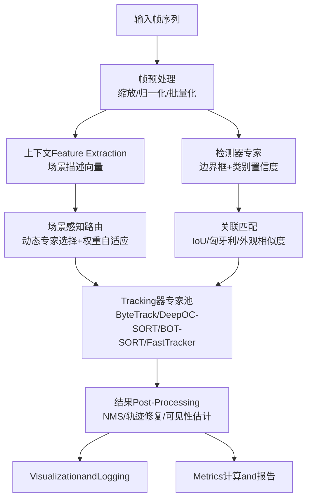
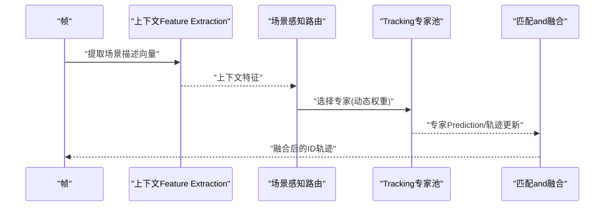
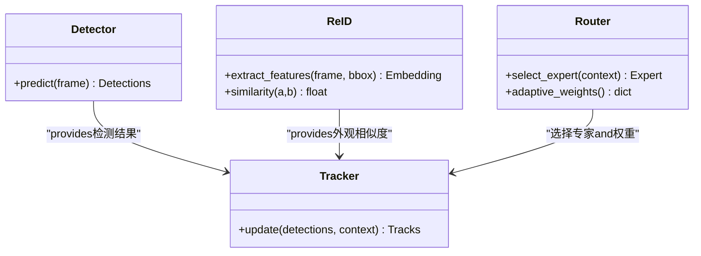
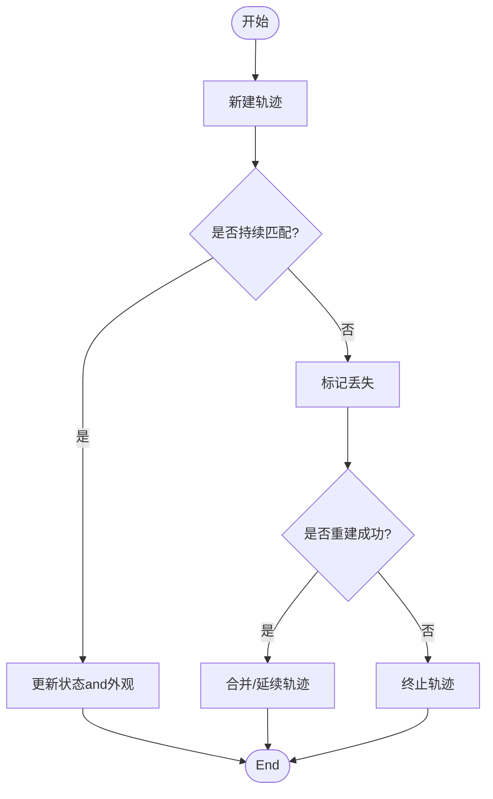
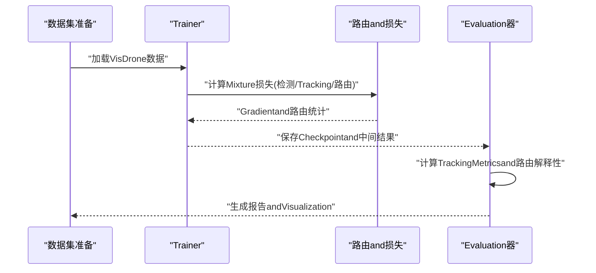
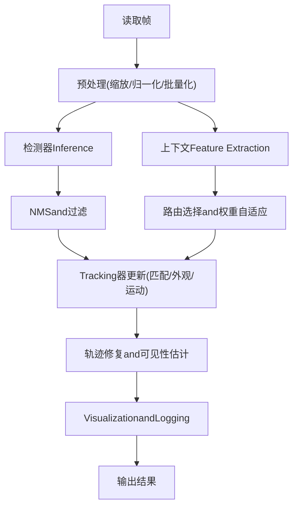
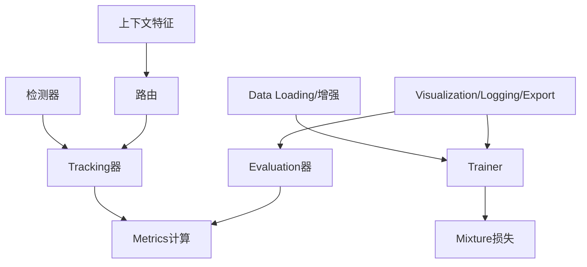

# Multi-Object TrackingMixture架构Examples

<cite>
**Files Referenced in This Document**
- [mot-hybrid-architecture.md](file://docs/plans/mot-hybrid-architecture.md)
- [2026-07-17-mot-scene-aware-router.md](file://docs/plans/2026-07-17-mot-scene-aware-router.md)
- [routing-interpreter-toolkit.md](file://docs/plans/routing-interpreter-toolkit.md)
- [mixture-preservation-manifest.yaml](file://docs/governance/mixture-preservation-manifest.yaml)
- [performance-gates.md](file://docs/governance/performance-gates.md)
- [benchmark_mmot_dispatch.py](file://benchmarks/benchmark_mot_dispatch.py)
- [suite.py](file://benchmarks/suite.py)
- [run.py](file://benchmarks/run.py)
- [test_mot_scene_aware_router.py](file://tests/test_mot_scene_aware_router.py)
- [test_mot_routing_diagnostics.py](file://tests/test_mot_routing_diagnostics.py)
- [analyze_mot_routing.py](file://scripts/analyze_mot_routing.py)
- [diagnose_mot_routing.py](file://scripts/diagnose_mot_routing.py)
- [prepare_mot_routing_scenes.py](file://scripts/prepare_mot_routing_scenes.py)
- [download_visdrone_dataset.sh](file://scripts/download_visdrone_dataset.sh)
- [reproduce_visdrone.py](file://scripts/reproduce_visdrone.py)
- [compare_mot_ablation.py](file://scripts/compare_mot_ablation.py)
- [mot_integration_experiment_report_2026-06-25.md](file://docs/mot_integration_experiment_report_2026-06-25.md)
- [yolo_master_mot_moa_visdrone_report_20260702.md](file://reports/yolo_master_mot_moa_visdrone_report_20260702.md)
- [technical_summary.md](file://examples/mot_hybrid_architecture/technical_summary.md)
- [plot_mot_results.py](file://examples/mot_hybrid_architecture/plot_mot_results.py)
- [run_visdrone_mot_ablation.sh](file://examples/mot_hybrid_architecture/run_visdrone_mot_ablation.sh)
- [README.md](file://examples/mot_hybrid_architecture/README.md)
- [track.py](file://ultralytics/trackers/track.py)
- [basetrack.py](file://ultralytics/trackers/basetrack.py)
- [byte_tracker.py](file://ultralytics/trackers/byte_tracker.py)
- [deep_oc_sort.py](file://ultralytics/trackers/deep_oc_sort.py)
- [oc_sort.py](file://ultralytics/trackers/oc_sort.py)
- [bot_sort.py](file://ultralytics/trackers/bot_sort.py)
- [fast_tracker.py](file://ultralytics/trackers/fast_tracker.py)
- [track_tracker.py](file://ultralytics/trackers/track_tracker.py)
- [__init__.py](file://ultralytics/trackers/__init__.py)
- [metrics.py](file://ultralytics/utils/metrics.py)
- [predictor.py](file://ultralytics/engine/predictor.py)
- [results.py](file://ultralytics/engine/results.py)
- [trainer.py](file://ultralytics/engine/trainer.py)
- [validator.py](file://ultralytics/engine/validator.py)
- [exporter.py](file://ultralytics/engine/exporter.py)
- [autobackend.py](file://ultralytics/nn/autobackend.py)
- [mixture_loss.py](file://ultralytics/nn/mixture_loss.py)
- [mixture_registry.py](file://ultralytics/nn/mixture_registry.py)
- [tasks.py](file://ultralytics/nn/tasks.py)
- [utils.py](file://ultralytics/data/utils.py)
- [build.py](file://ultralytics/data/build.py)
- [dataset.py](file://ultralytics/data/dataset.py)
- [loaders.py](file://ultralytics/data/loaders.py)
- [augment.py](file://ultralytics/data/augment.py)
- [callbacks](file://ultralytics/utils/callbacks/)
- [plotting.py](file://ultralytics/utils/plotting.py)
- [events.py](file://ultralytics/utils/events.py)
- [logger.py](file://ultralytics/utils/logger.py)
- [nms.py](file://ultralytics/utils/nms.py)
- [ops.py](file://ultralytics/utils/ops.py)
- [torch_utils.py](file://ultralytics/utils/torch_utils.py)
- [tuner.py](file://ultralytics/utils/tuner.py)
- [export_capabilities.py](file://ultralytics/utils/export_capabilities.py)
- [export_preflight.py](file://ultralytics/utils/export_preflight.py)
- [export_validation.py](file://ultralytics/utils/export_validation.py)
</cite>

## Table of Contents
1. [Introduction](#Introduction)
2. [Project Structure](#Project Structure)
3. [Core Components](#Core Components)
4. [Architecture Overview](#Architecture Overview)
5. [Detailed Component Analysis](#Detailed Component Analysis)
6. [Dependency Analysis](#Dependency Analysis)
7. [性能考量](#性能考量)
8. [Troubleshooting Guide](#Troubleshooting Guide)
9. [Conclusion](#Conclusion)
10. [Appendix](#Appendix)

## Introduction
本文件targeting希望构建“检测器andTracking器解耦、IDRe-Identification增强、场景感知路由”的Multi-Object Tracking（MoT）Mixture架构的EngineersandResearchers。Documentation从设计理念出发，系统讲解动态专家选择、上下文Feature Extractionand自适应路由权重etc.关键机制；随后给出完整的TrainingandEvaluation流程（含VisDrone数据集Uses、评价Metrics计算and对比分析），并展示实时视频处理管道（帧预处理、Batch Inference、结果Post-Processing）。最后provides精度Optimization、ID切换抑制、遮挡处理etc.实用技巧，Centered onandVisualizationand调试工具链的Uses说明。

## Project Structure
仓库围绕YOLO生态扩展了MoA/MoE/MoTcapabilities，并whileExamples、基准、测试and脚本中provides了端to端的工作流。andMoTMixture架构直接相关的Table of Contentsand文件包括：
- 设计规划and治理：plansandgovernance下的MoTand路由相关Documentation
- 基准and评测：benchmarks下针对MoTRouting and Scheduling的Benchmark Suite
- 测试：tests下对场景感知路由and诊断的单元测试
- 脚本：scripts下Data Preparation、复现、消融and诊断脚本
- Examples：examples/mot_hybrid_architecture下可运行的Examples and Reports
- 核心implementing：ultralytics下tracker、engine、nn、data、utilsetc.Modules

```mermaid
graph TB
subgraph "设计and治理"
P1["plans/mot-hybrid-architecture.md"]
P2["plans/2026-07-17-mot-scene-aware-router.md"]
P3["plans/routing-interpreter-toolkit.md"]
G1["governance/mixture-preservation-manifest.yaml"]
G2["governance/performance-gates.md"]
end
subgraph "基准and评测"
B1["benchmarks/benchmark_mot_dispatch.py"]
B2["benchmarks/suite.py"]
B3["benchmarks/run.py"]
end
subgraph "测试"
T1["tests/test_mot_scene_aware_router.py"]
T2["tests/test_mot_routing_diagnostics.py"]
end
subgraph "脚本"
S1["scripts/analyze_mot_routing.py"]
S2["scripts/diagnose_mot_routing.py"]
S3["scripts/prepare_mot_routing_scenes.py"]
S4["scripts/download_visdrone_dataset.sh"]
S5["scripts/reproduce_visdrone.py"]
S6["scripts/compare_mot_ablation.py"]
end
subgraph "Examples"
E1["examples/mot_hybrid_architecture/README.md"]
E2["examples/mot_hybrid_architecture/technical_summary.md"]
E3["examples/mot_hybrid_architecture/plot_mot_results.py"]
E4["examples/mot_hybrid_architecture/run_visdrone_mot_ablation.sh"]
end
subgraph "核心implementing"
C1["ultralytics/trackers/*"]
C2["ultralytics/engine/*"]
C3["ultralytics/nn/*"]
C4["ultralytics/data/*"]
C5["ultralytics/utils/*"]
end
P1 --> C1
P2 --> C1
P3 --> C1
G1 --> C3
G2 --> C2
B1 --> C1
B2 --> C1
B3 --> C1
T1 --> C1
T2 --> C1
S1 --> C1
S2 --> C1
S3 --> C1
S4 --> C4
S5 --> C4
S6 --> C2
E1 --> C1
E2 --> C1
E3 --> C2
E4 --> C2
```

Figure Source
- [mot-hybrid-architecture.md:1-200](file://docs/plans/mot-hybrid-architecture.md#L1-L200)
- [2026-07-17-mot-scene-aware-router.md:1-200](file://docs/plans/2026-07-17-mot-scene-aware-router.md#L1-L200)
- [routing-interpreter-toolkit.md:1-200](file://docs/plans/routing-interpreter-toolkit.md#L1-L200)
- [mixture-preservation-manifest.yaml:1-200](file://docs/governance/mixture-preservation-manifest.yaml#L1-L200)
- [performance-gates.md:1-200](file://docs/governance/performance-gates.md#L1-L200)
- [benchmark_mmot_dispatch.py:1-200](file://benchmarks/benchmark_mot_dispatch.py#L1-L200)
- [suite.py:1-200](file://benchmarks/suite.py#L1-L200)
- [run.py:1-200](file://benchmarks/run.py#L1-L200)
- [test_mot_scene_aware_router.py:1-200](file://tests/test_mot_scene_aware_router.py#L1-L200)
- [test_mot_routing_diagnostics.py:1-200](file://tests/test_mot_routing_diagnostics.py#L1-L200)
- [analyze_mot_routing.py:1-200](file://scripts/analyze_mot_routing.py#L1-L200)
- [diagnose_mot_routing.py:1-200](file://scripts/diagnose_mot_routing.py#L1-L200)
- [prepare_mot_routing_scenes.py:1-200](file://scripts/prepare_mot_routing_scenes.py#L1-L200)
- [download_visdrone_dataset.sh:1-200](file://scripts/download_visdrone_dataset.sh#L1-L200)
- [reproduce_visdrone.py:1-200](file://scripts/reproduce_visdrone.py#L1-L200)
- [compare_mot_ablation.py:1-200](file://scripts/compare_mot_ablation.py#L1-L200)
- [technical_summary.md:1-200](file://examples/mot_hybrid_architecture/technical_summary.md#L1-L200)
- [plot_mot_results.py:1-200](file://examples/mot_hybrid_architecture/plot_mot_results.py#L1-L200)
- [run_visdrone_mot_ablation.sh:1-200](file://examples/mot_hybrid_architecture/run_visdrone_mot_ablation.sh#L1-L200)
- [README.md:1-200](file://examples/mot_hybrid_architecture/README.md#L1-L200)

Section Source
- [mot-hybrid-architecture.md:1-200](file://docs/plans/mot-hybrid-architecture.md#L1-L200)
- [2026-07-17-mot-scene-aware-router.md:1-200](file://docs/plans/2026-07-17-mot-scene-aware-router.md#L1-L200)
- [routing-interpreter-toolkit.md:1-200](file://docs/plans/routing-interpreter-toolkit.md#L1-L200)
- [mixture-preservation-manifest.yaml:1-200](file://docs/governance/mixture-preservation-manifest.yaml#L1-L200)
- [performance-gates.md:1-200](file://docs/governance/performance-gates.md#L1-L200)
- [benchmark_mmot_dispatch.py:1-200](file://benchmarks/benchmark_mot_dispatch.py#L1-L200)
- [suite.py:1-200](file://benchmarks/suite.py#L1-L200)
- [run.py:1-200](file://benchmarks/run.py#1-L200)
- [test_mot_scene_aware_router.py:1-200](file://tests/test_mot_scene_aware_router.py#L1-L200)
- [test_mot_routing_diagnostics.py:1-200](file://tests/test_mot_routing_diagnostics.py#L1-L200)
- [analyze_mot_routing.py:1-200](file://scripts/analyze_mot_routing.py#L1-L200)
- [diagnose_mot_routing.py:1-200](file://scripts/diagnose_mot_routing.py#L1-L200)
- [prepare_mot_routing_scenes.py:1-200](file://scripts/prepare_mot_routing_scenes.py#L1-L200)
- [download_visdrone_dataset.sh:1-200](file://scripts/download_visdrone_dataset.sh#L1-L200)
- [reproduce_visdrone.py:1-200](file://scripts/reproduce_visdrone.py#L1-L200)
- [compare_mot_ablation.py:1-200](file://scripts/compare_mot_ablation.py#L1-L200)
- [technical_summary.md:1-200](file://examples/mot_hybrid_architecture/technical_summary.md#L1-L200)
- [plot_mot_results.py:1-200](file://examples/mot_hybrid_architecture/plot_mot_results.py#L1-L200)
- [run_visdrone_mot_ablation.sh:1-200](file://examples/mot_hybrid_architecture/run_visdrone_mot_ablation.sh#L1-L200)
- [README.md:1-200](file://examples/mot_hybrid_architecture/README.md#L1-L200)

## Core Components
- 检测器andTracking器解耦：ViaUnified Interface将检测结果and轨迹状态分离，便于独立替换and组合不同专家模型。
- IDRe-Identification增强：while匹配阶段引入Appearance Features相似度，降低长时遮挡and密集场景中的ID切换。
- 轨迹管理策略：维护轨迹生命周期、可见性估计、丢失恢复and跨帧一致性校验。
- 场景感知路由：基于场景上下文特征动态选择专家（such as运动主导、外观主导、遮挡鲁棒etc.），并自适应调整路由权重。
- TrainingandEvaluation：Supporting多TasksLoss combination、路由Auxiliary Loss、校准and门控约束，并provides标准Metricsand对比基线。
- 实时管道：帧预处理、Batch Inference、结果Post-Processing、VisualizationandLogging一体化。

Section Source
- [mot-hybrid-architecture.md:1-200](file://docs/plans/mot-hybrid-architecture.md#L1-L200)
- [2026-07-17-mot-scene-aware-router.md:1-200](file://docs/plans/2026-07-17-mot-scene-aware-router.md#L1-L200)
- [routing-interpreter-toolkit.md:1-200](file://docs/plans/routing-interpreter-toolkit.md#L1-L200)
- [mixture-preservation-manifest.yaml:1-200](file://docs/governance/mixture-preservation-manifest.yaml#L1-L200)
- [performance-gates.md:1-200](file://docs/governance/performance-gates.md#L1-L200)

## Architecture Overview
下图展示了MoTMixture架构的系统级交互：输入帧经预处理后进入检测器，得to边界框and类别；同时提取上下文特征用于场景感知路由，动态选择Tracking专家；Tracking器Combining运动模型and外观相似度完成ID分配and轨迹更新；最终输出带ID的检测结果andVisualization。

Figure Source
- [2026-07-17-mot-scene-aware-router.md:1-200](file://docs/plans/2026-07-17-mot-scene-aware-router.md#L1-L200)
- [test_mot_scene_aware_router.py:1-200](file://tests/test_mot_scene_aware_router.py#L1-L200)
- [track.py:1-200](file://ultralytics/trackers/track.py#L1-L200)
- [byte_tracker.py:1-200](file://ultralytics/trackers/byte_tracker.py#L1-L200)
- [deep_oc_sort.py:1-200](file://ultralytics/trackers/deep_oc_sort.py#L1-L200)
- [oc_sort.py:1-200](file://ultralytics/trackers/oc_sort.py#L1-L200)
- [bot_sort.py:1-200](file://ultralytics/trackers/bot_sort.py#L1-L200)
- [fast_tracker.py:1-200](file://ultralytics/trackers/fast_tracker.py#L1-L200)
- [predictor.py:1-200](file://ultralytics/engine/predictor.py#L1-L200)
- [results.py:1-200](file://ultralytics/engine/results.py#L1-L200)
- [metrics.py:1-200](file://ultralytics/utils/metrics.py#L1-L200)

## Detailed Component Analysis

### 场景感知路由and动态专家选择
- 设计要点
  - 上下文特征：从当前帧或局部时序窗口提取场景描述向量，表征光照、密度、遮挡程度、运动强度etc.。
  - 动态选择：根据上下文特征and历史路由统计，选择最合适的Tracking专家（例such as高遮挡用DeepOC-SORT，低遮挡且高速用ByteTrack）。
  - 自适应权重：while融合阶段按场景置信度加权各专家输出，避免单一专家while复杂场景失效。
- implementing路径
  - 路由逻辑and诊断：参见测试and脚本中对路由行forand解释性的Validationand分析。
  - 基准调度：whileBenchmark Suite中Evaluation不同routing strategies的性能and开销。

Figure Source
- [2026-07-17-mot-scene-aware-router.md:1-200](file://docs/plans/2026-07-17-mot-scene-aware-router.md#L1-L200)
- [test_mot_scene_aware_router.py:1-200](file://tests/test_mot_scene_aware_router.py#L1-L200)
- [benchmark_mmot_dispatch.py:1-200](file://benchmarks/benchmark_mot_dispatch.py#L1-L200)
- [suite.py:1-200](file://benchmarks/suite.py#L1-L200)
- [run.py:1-200](file://benchmarks/run.py#L1-L200)

Section Source
- [2026-07-17-mot-scene-aware-router.md:1-200](file://docs/plans/2026-07-17-mot-scene-aware-router.md#L1-L200)
- [test_mot_scene_aware_router.py:1-200](file://tests/test_mot_scene_aware_router.py#L1-L200)
- [benchmark_mmot_dispatch.py:1-200](file://benchmarks/benchmark_mot_dispatch.py#L1-L200)
- [suite.py:1-200](file://benchmarks/suite.py#L1-L200)
- [run.py:1-200](file://benchmarks/run.py#L1-L200)

### 检测器andTracking器解耦andIDRe-Identification增强
- 解耦接口
  - 检测器输出标准化for边界框、类别and置信度；Tracking器Centered on这些结果for输入进行ID分配and轨迹更新。
  - through a unified数据结构and回调机制，允许替换不同的检测器andTracking器而不影响整体流程。
- IDRe-Identification
  - while匹配阶段引入外观相似度（Re-ID），Combining运动先验（速度/加速度）提升长时遮挡and密集场景的稳定性。
  - Via路由权重控制外观and运动的相对贡献，适应不同场景。

Figure Source
- [track.py:1-200](file://ultralytics/trackers/track.py#L1-L200)
- [basetrack.py:1-200](file://ultralytics/trackers/basetrack.py#L1-L200)
- [byte_tracker.py:1-200](file://ultralytics/trackers/byte_tracker.py#L1-L200)
- [deep_oc_sort.py:1-200](file://ultralytics/trackers/deep_oc_sort.py#L1-L200)
- [oc_sort.py:1-200](file://ultralytics/trackers/oc_sort.py#L1-L200)
- [bot_sort.py:1-200](file://ultralytics/trackers/bot_sort.py#L1-L200)
- [fast_tracker.py:1-200](file://ultralytics/trackers/fast_tracker.py#L1-L200)
- [predictor.py:1-200](file://ultralytics/engine/predictor.py#L1-L200)
- [results.py:1-200](file://ultralytics/engine/results.py#L1-L200)

Section Source
- [track.py:1-200](file://ultralytics/trackers/track.py#L1-L200)
- [basetrack.py:1-200](file://ultralytics/trackers/basetrack.py#L1-L200)
- [byte_tracker.py:1-200](file://ultralytics/trackers/byte_tracker.py#L1-L200)
- [deep_oc_sort.py:1-200](file://ultralytics/trackers/deep_oc_sort.py#L1-L200)
- [oc_sort.py:1-200](file://ultralytics/trackers/oc_sort.py#L1-L200)
- [bot_sort.py:1-200](file://ultralytics/trackers/bot_sort.py#L1-L200)
- [fast_tracker.py:1-200](file://ultralytics/trackers/fast_tracker.py#L1-L200)
- [predictor.py:1-200](file://ultralytics/engine/predictor.py#L1-L200)
- [results.py:1-200](file://ultralytics/engine/results.py#L1-L200)

### 轨迹管理and生命周期
- 轨迹状态：新建、活跃、丢失、重建、终止。
- 可见性估计：基于连续未匹配帧数、遮挡比例and外观一致性判断。
- 丢失恢复：当目标重新出现时，利用Re-IDand运动先验进行跨帧关联。
- 一致性校验：跨帧平滑、异常值剔除and轨迹分段合并。

Figure Source
- [basetrack.py:1-200](file://ultralytics/trackers/basetrack.py#L1-L200)
- [track.py:1-200](file://ultralytics/trackers/track.py#L1-L200)
- [deep_oc_sort.py:1-200](file://ultralytics/trackers/deep_oc_sort.py#L1-L200)
- [oc_sort.py:1-200](file://ultralytics/trackers/oc_sort.py#L1-L200)
- [bot_sort.py:1-200](file://ultralytics/trackers/bot_sort.py#L1-L200)
- [fast_tracker.py:1-200](file://ultralytics/trackers/fast_tracker.py#L1-L200)

Section Source
- [basetrack.py:1-200](file://ultralytics/trackers/basetrack.py#L1-L200)
- [track.py:1-200](file://ultralytics/trackers/track.py#L1-L200)
- [deep_oc_sort.py:1-200](file://ultralytics/trackers/deep_oc_sort.py#L1-L200)
- [oc_sort.py:1-200](file://ultralytics/trackers/oc_sort.py#L1-L200)
- [bot_sort.py:1-200](file://ultralytics/trackers/bot_sort.py#L1-L200)
- [fast_tracker.py:1-200](file://ultralytics/trackers/fast_tracker.py#L1-L200)

### TrainingandEvaluation流程（含VisDrone）
- Data Preparation
  - Uses脚本下载and准备VisDrone数据集，确保标签格式and路径正确。
- Training Configuration
  - 启用Mixture损失（检测+Tracking+路由辅助），设置Routing Regularizationand门控约束，保证专家Load Balancingand数值稳定。
- EvaluationMetrics
  - 采用标准TrackingMetrics（such asMOTA、IDF1、MT/ML/Fragetc.），并Combining路由解释性Metrics（专家Uses分布、权重方差）。
- 对比分析
  - Via消融实验比较不同routing strategies、专家组合andRe-ID权重的影响。

Figure Source
- [download_visdrone_dataset.sh:1-200](file://scripts/download_visdrone_dataset.sh#L1-L200)
- [reproduce_visdrone.py:1-200](file://scripts/reproduce_visdrone.py#L1-L200)
- [compare_mot_ablation.py:1-200](file://scripts/compare_mot_ablation.py#L1-L200)
- [trainer.py:1-200](file://ultralytics/engine/trainer.py#L1-L200)
- [validator.py:1-200](file://ultralytics/engine/validator.py#L1-L200)
- [mixture_loss.py:1-200](file://ultralytics/nn/mixture_loss.py#L1-L200)
- [mixture_registry.py:1-200](file://ultralytics/nn/mixture_registry.py#L1-L200)
- [metrics.py:1-200](file://ultralytics/utils/metrics.py#L1-L200)

Section Source
- [download_visdrone_dataset.sh:1-200](file://scripts/download_visdrone_dataset.sh#L1-L200)
- [reproduce_visdrone.py:1-200](file://scripts/reproduce_visdrone.py#L1-L200)
- [compare_mot_ablation.py:1-200](file://scripts/compare_mot_ablation.py#L1-L200)
- [trainer.py:1-200](file://ultralytics/engine/trainer.py#L1-L200)
- [validator.py:1-200](file://ultralytics/engine/validator.py#L1-L200)
- [mixture_loss.py:1-200](file://ultralytics/nn/mixture_loss.py#L1-L200)
- [mixture_registry.py:1-200](file://ultralytics/nn/mixture_registry.py#L1-L200)
- [metrics.py:1-200](file://ultralytics/utils/metrics.py#L1-L200)

### 实时视频处理管道
- 帧预处理：缩放、归一化、批量化，适配GPU/边缘设备。
- Batch Inference：检测器and上下文特征并行执行，减少延迟。
- 结果Post-Processing：NMS、轨迹修复、可见性估计、VisualizationandLogging。
- 资源管理：自动后端选择、Exportcapabilities检查and预检。

Figure Source
- [predictor.py:1-200](file://ultralytics/engine/predictor.py#L1-L200)
- [results.py:1-200](file://ultralytics/engine/results.py#L1-L200)
- [autobackend.py:1-200](file://ultralytics/nn/autobackend.py#L1-L200)
- [export_capabilities.py:1-200](file://ultralytics/utils/export_capabilities.py#L1-L200)
- [export_preflight.py:1-200](file://ultralytics/utils/export_preflight.py#L1-L200)
- [export_validation.py:1-200](file://ultralytics/utils/export_validation.py#L1-L200)
- [plotting.py:1-200](file://ultralytics/utils/plotting.py#L1-L200)
- [events.py:1-200](file://ultralytics/utils/events.py#L1-L200)
- [logger.py:1-200](file://ultralytics/utils/logger.py#L1-L200)

Section Source
- [predictor.py:1-200](file://ultralytics/engine/predictor.py#L1-L200)
- [results.py:1-200](file://ultralytics/engine/results.py#L1-L200)
- [autobackend.py:1-200](file://ultralytics/nn/autobackend.py#L1-L200)
- [export_capabilities.py:1-200](file://ultralytics/utils/export_capabilities.py#L1-L200)
- [export_preflight.py:1-200](file://ultralytics/utils/export_preflight.py#L1-L200)
- [export_validation.py:1-200](file://ultralytics/utils/export_validation.py#L1-L200)
- [plotting.py:1-200](file://ultralytics/utils/plotting.py#L1-L200)
- [events.py:1-200](file://ultralytics/utils/events.py#L1-L200)
- [logger.py:1-200](file://ultralytics/utils/logger.py#L1-L200)

## Dependency Analysis
- Modules耦合
  - 路由andTracking器强耦合于上下文特征and匹配逻辑；检测器andTracking器Via统一数据结构解耦。
  - TrainerandEvaluation器依赖Mixture损失and路由Auxiliary Loss，确保路由可学习and稳定。
- External Dependencies
  - Data Loadingand增强依赖dataModules；Visualizationand事件Logging依赖utilsModules；Exportand后端依赖nnandutils。
- Potential Cycles依赖
  - Via分层and接口抽象避免循环；路由andTracking器之间仅Via函数Callsand数据结构交互。

Figure Source
- [mixture_loss.py:1-200](file://ultralytics/nn/mixture_loss.py#L1-L200)
- [mixture_registry.py:1-200](file://ultralytics/nn/mixture_registry.py#L1-L200)
- [metrics.py:1-200](file://ultralytics/utils/metrics.py#L1-L200)
- [predictor.py:1-200](file://ultralytics/engine/predictor.py#L1-L200)
- [trainer.py:1-200](file://ultralytics/engine/trainer.py#L1-L200)
- [validator.py:1-200](file://ultralytics/engine/validator.py#L1-L200)
- [build.py:1-200](file://ultralytics/data/build.py#L1-L200)
- [dataset.py:1-200](file://ultralytics/data/dataset.py#L1-L200)
- [loaders.py:1-200](file://ultralytics/data/loaders.py#L1-L200)
- [augment.py:1-200](file://ultralytics/data/augment.py#L1-L200)
- [plotting.py:1-200](file://ultralytics/utils/plotting.py#L1-L200)
- [events.py:1-200](file://ultralytics/utils/events.py#L1-L200)
- [logger.py:1-200](file://ultralytics/utils/logger.py#L1-L200)

Section Source
- [mixture_loss.py:1-200](file://ultralytics/nn/mixture_loss.py#L1-L200)
- [mixture_registry.py:1-200](file://ultralytics/nn/mixture_registry.py#L1-L200)
- [metrics.py:1-200](file://ultralytics/utils/metrics.py#L1-L200)
- [predictor.py:1-200](file://ultralytics/engine/predictor.py#L1-L200)
- [trainer.py:1-200](file://ultralytics/engine/trainer.py#L1-L200)
- [validator.py:1-200](file://ultralytics/engine/validator.py#L1-L200)
- [build.py:1-200](file://ultralytics/data/build.py#L1-L200)
- [dataset.py:1-200](file://ultralytics/data/dataset.py#L1-L200)
- [loaders.py:1-200](file://ultralytics/data/loaders.py#L1-L200)
- [augment.py:1-200](file://ultralytics/data/augment.py#L1-L200)
- [plotting.py:1-200](file://ultralytics/utils/plotting.py#L1-L200)
- [events.py:1-200](file://ultralytics/utils/events.py#L1-L200)
- [logger.py:1-200](file://ultralytics/utils/logger.py#L1-L200)

## 性能考量
- 路由开销：上下文Feature Extractionand路由决策应轻量，避免成forbottlenecks。
- 专家选择：while高密度and遮挡场景中优先选择鲁棒专家，while简单场景选择高效专家。
- 批处理and流水线：最大化GPU利用率，减少内存拷贝and同步。
- Exportand部署：UsesExportcapabilities矩阵and预检工具，确保while不同后端上的性能and兼容性。

[This section provides general guidance and does not directly analyze specific files]

## Troubleshooting Guide
- 路由不稳定
  - Uses路由解释性工具and诊断脚本分析专家Uses分布and权重方差，定位异常场景。
- Metrics异常
  - 检查Data Loadingand标签格式，确认EvaluationMetrics计算路径and阈值设置。
- Visualization问题
  - 检查绘图and事件LoggingModules，确认输出路径and格式。
- Export Failure
  - UsesExport预检andValidation工具，检查后端兼容性andcapabilities矩阵。

Section Source
- [routing-interpreter-toolkit.md:1-200](file://docs/plans/routing-interpreter-toolkit.md#L1-L200)
- [analyze_mot_routing.py:1-200](file://scripts/analyze_mot_routing.py#L1-L200)
- [diagnose_mot_routing.py:1-200](file://scripts/diagnose_mot_routing.py#L1-L200)
- [metrics.py:1-200](file://ultralytics/utils/metrics.py#L1-L200)
- [plotting.py:1-200](file://ultralytics/utils/plotting.py#L1-L200)
- [events.py:1-200](file://ultralytics/utils/events.py#L1-L200)
- [logger.py:1-200](file://ultralytics/utils/logger.py#L1-L200)
- [export_capabilities.py:1-200](file://ultralytics/utils/export_capabilities.py#L1-L200)
- [export_preflight.py:1-200](file://ultralytics/utils/export_preflight.py#L1-L200)
- [export_validation.py:1-200](file://ultralytics/utils/export_validation.py#L1-L200)

## Conclusion
本ExamplesDocumentation系统化阐述了MoTMixture架构的设计理念andimplementing路径，涵盖场景感知路由、IDRe-Identification增强、轨迹管理、TrainingandEvaluation、实时管道and调试工具链。ViaBenchmark Suiteand测试用例，可快速ValidationandOptimizationrouting strategiesand专家组合，获得更稳健的Tracking性能and更好的可解释性。

[本节for总结，不直接分析具体文件]

## Appendix
- Examples运行
  - Refer toExamplesTable of Contents的READMEand技术摘要，了解such as何运行消融实验and绘制结果图。
- 报告and基准
  - 集成实验报告andBenchmark Suite可用于对比不同配置and专家组合的效果。

Section Source
- [README.md:1-200](file://examples/mot_hybrid_architecture/README.md#L1-L200)
- [technical_summary.md:1-200](file://examples/mot_hybrid_architecture/technical_summary.md#L1-L200)
- [plot_mot_results.py:1-200](file://examples/mot_hybrid_architecture/plot_mot_results.py#L1-L200)
- [run_visdrone_mot_ablation.sh:1-200](file://examples/mot_hybrid_architecture/run_visdrone_mot_ablation.sh#L1-L200)
- [mot_integration_experiment_report_2026-06-25.md:1-200](file://docs/mot_integration_experiment_report_2026-06-25.md#L1-L200)
- [yolo_master_mot_moa_visdrone_report_20260702.md:1-200](file://reports/yolo_master_mot_moa_visdrone_report_20260702.md#L1-L200)