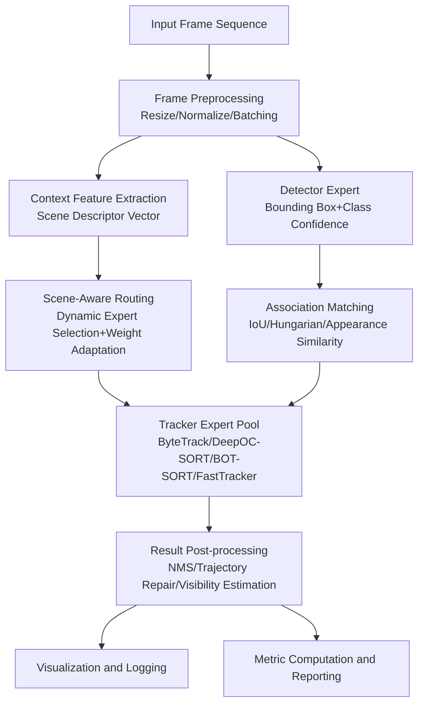
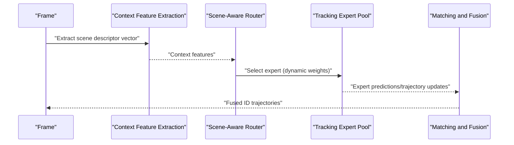
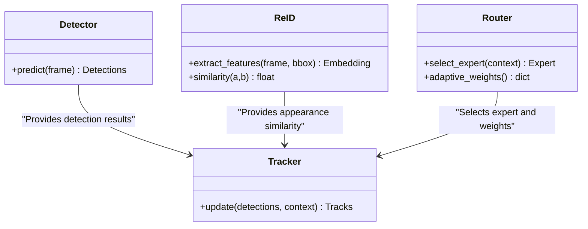
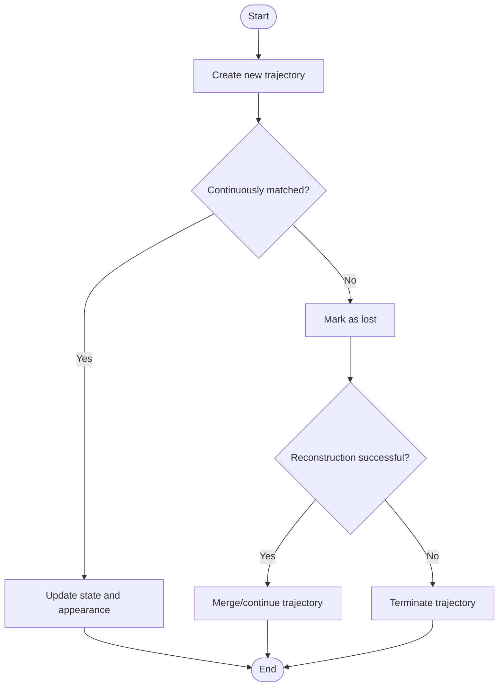
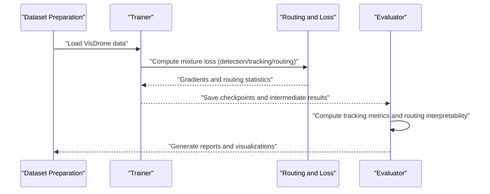
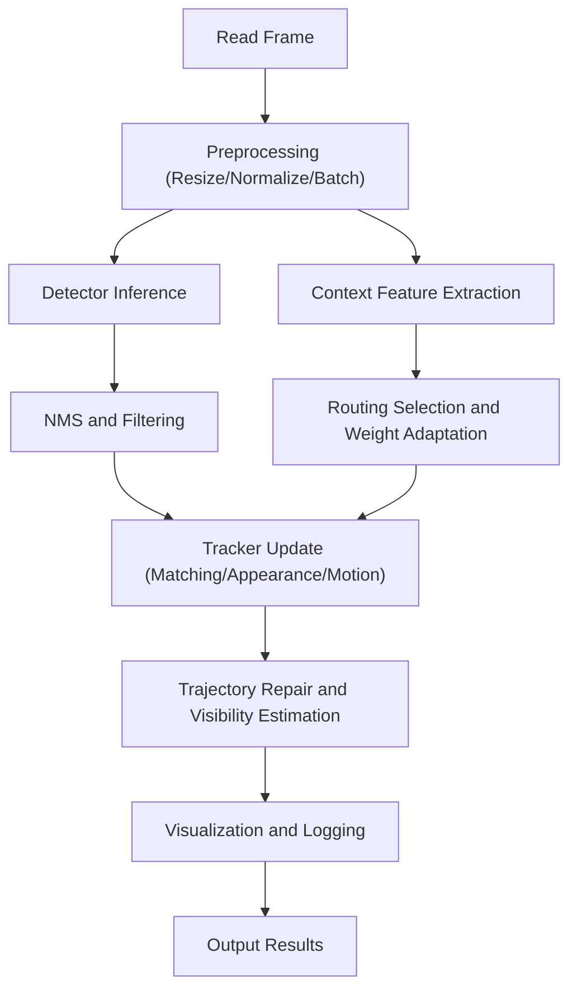
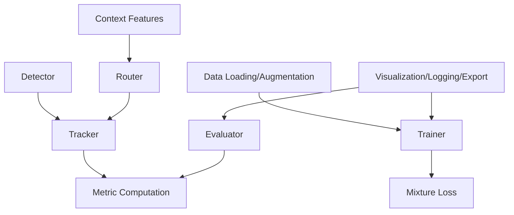

# Multi-Object Tracking Hybrid Architecture Examples

<cite>
**Files referenced in this document**
- [mot-hybrid-architecture.md](file://docs/plans/mot-hybrid-architecture.md)
- [2026-07-17-mot-scene-aware-router.md](file://docs/plans/2026-07-17-mot-scene-aware-router.md)
- [routing-interpreter-toolkit.md](file://docs/plans/routing-interpreter-toolkit.md)
- [mixture-preservation-manifest.yaml](file://docs/governance/mixture-preservation-manifest.yaml)
- [performance-gates.md](file://docs/governance/performance-gates.md)
- [benchmark_mmot_dispatch.py](file://benchmarks/benchmark_mot_dispatch.py)
- [suite.py](file://benchmarks/suite.py)
- [run.py](file://benchmarks/run.py)
- [test_mot_scene_aware_router.py](file://tests/test_mot_scene_aware_router.py)
- [test_mot_routing_diagnostics.py](file://tests/test_mot_routing_diagnostics.py)
- [analyze_mot_routing.py](file://scripts/analyze_mot_routing.py)
- [diagnose_mot_routing.py](file://scripts/diagnose_mot_routing.py)
- [prepare_mot_routing_scenes.py](file://scripts/prepare_mot_routing_scenes.py)
- [download_visdrone_dataset.sh](file://scripts/download_visdrone_dataset.sh)
- [reproduce_visdrone.py](file://scripts/reproduce_visdrone.py)
- [compare_mot_ablation.py](file://scripts/compare_mot_ablation.py)
- [mot_integration_experiment_report_2026-06-25.md](file://docs/mot_integration_experiment_report_2026-06-25.md)
- [yolo_master_mot_moa_visdrone_report_20260702.md](file://reports/yolo_master_mot_moa_visdrone_report_20260702.md)
- [technical_summary.md](file://examples/mot_hybrid_architecture/technical_summary.md)
- [plot_mot_results.py](file://examples/mot_hybrid_architecture/plot_mot_results.py)
- [run_visdrone_mot_ablation.sh](file://examples/mot_hybrid_architecture/run_visdrone_mot_ablation.sh)
- [README.md](file://examples/mot_hybrid_architecture/README.md)
- [track.py](file://ultralytics/trackers/track.py)
- [basetrack.py](file://ultralytics/trackers/basetrack.py)
- [byte_tracker.py](file://ultralytics/trackers/byte_tracker.py)
- [deep_oc_sort.py](file://ultralytics/trackers/deep_oc_sort.py)
- [oc_sort.py](file://ultralytics/trackers/oc_sort.py)
- [bot_sort.py](file://ultralytics/trackers/bot_sort.py)
- [fast_tracker.py](file://ultralytics/trackers/fast_tracker.py)
- [track_tracker.py](file://ultralytics/trackers/track_tracker.py)
- [__init__.py](file://ultralytics/trackers/__init__.py)
- [metrics.py](file://ultralytics/utils/metrics.py)
- [predictor.py](file://ultralytics/engine/predictor.py)
- [results.py](file://ultralytics/engine/results.py)
- [trainer.py](file://ultralytics/engine/trainer.py)
- [validator.py](file://ultralytics/engine/validator.py)
- [exporter.py](file://ultralytics/engine/exporter.py)
- [autobackend.py](file://ultralytics/nn/autobackend.py)
- [mixture_loss.py](file://ultralytics/nn/mixture_loss.py)
- [mixture_registry.py](file://ultralytics/nn/mixture_registry.py)
- [tasks.py](file://ultralytics/nn/tasks.py)
- [utils.py](file://ultralytics/data/utils.py)
- [build.py](file://ultralytics/data/build.py)
- [dataset.py](file://ultralytics/data/dataset.py)
- [loaders.py](file://ultralytics/data/loaders.py)
- [augment.py](file://ultralytics/data/augment.py)
- [callbacks](file://ultralytics/utils/callbacks/)
- [plotting.py](file://ultralytics/utils/plotting.py)
- [events.py](file://ultralytics/utils/events.py)
- [logger.py](file://ultralytics/utils/logger.py)
- [nms.py](file://ultralytics/utils/nms.py)
- [ops.py](file://ultralytics/utils/ops.py)
- [torch_utils.py](file://ultralytics/utils/torch_utils.py)
- [tuner.py](file://ultralytics/utils/tuner.py)
- [export_capabilities.py](file://ultralytics/utils/export_capabilities.py)
- [export_preflight.py](file://ultralytics/utils/export_preflight.py)
- [export_validation.py](file://ultralytics/utils/export_validation.py)
</cite>

## Table of Contents
1. [Introduction](#introduction)
2. [Project Structure](#project-structure)
3. [Core Components](#core-components)
4. [Architecture Overview](#architecture-overview)
5. [Detailed Component Analysis](#detailed-component-analysis)
6. [Dependency Analysis](#dependency-analysis)
7. [Performance Considerations](#performance-considerations)
8. [Troubleshooting Guide](#troubleshooting-guide)
9. [Conclusion](#conclusion)
10. [Appendix](#appendix)

## Introduction
This document is intended for engineers and researchers looking to build a Multi-Object Tracking (MoT) hybrid architecture with "detector-tracker decoupling, ID re-identification enhancement, and scene-aware routing". Starting from design principles, the document systematically explains key mechanisms such as dynamic expert selection, context feature extraction, and adaptive routing weights; then presents the complete training and evaluation workflow (including VisDrone dataset usage, metric computation, and comparative analysis), and demonstrates the real-time video processing pipeline (frame preprocessing, batch inference, result post-processing). Finally, it provides practical tips for accuracy optimization, ID switch suppression, and occlusion handling, along with usage instructions for visualization and debugging toolchains.

## Project Structure
The repository extends MoA/MoE/MoT capabilities around the YOLO ecosystem, providing end-to-end workflows in examples, benchmarks, tests, and scripts. Directories and files directly related to the MoT hybrid architecture include:
- Design planning and governance: MoT and routing-related documents under plans and governance
- Benchmarks and evaluation: Benchmark suites for MoT routing and scheduling under benchmarks
- Tests: Unit tests for scene-aware routing and diagnostics under tests
- Scripts: Data preparation, reproduction, ablation, and diagnostic scripts under scripts
- Examples: Runnable examples and reports under examples/mot_hybrid_architecture
- Core implementation: tracker, engine, nn, data, utils, and other modules under ultralytics

```mermaid
graph TB
subgraph "Design and Governance"
P1["plans/mot-hybrid-architecture.md"]
P2["plans/2026-07-17-mot-scene-aware-router.md"]
P3["plans/routing-interpreter-toolkit.md"]
G1["governance/mixture-preservation-manifest.yaml"]
G2["governance/performance-gates.md"]
end
subgraph "Benchmarks and Evaluation"
B1["benchmarks/benchmark_mot_dispatch.py"]
B2["benchmarks/suite.py"]
B3["benchmarks/run.py"]
end
subgraph "Tests"
T1["tests/test_mot_scene_aware_router.py"]
T2["tests/test_mot_routing_diagnostics.py"]
end
subgraph "Scripts"
S1["scripts/analyze_mot_routing.py"]
S2["scripts/diagnose_mot_routing.py"]
S3["scripts/prepare_mot_routing_scenes.py"]
S4["scripts/download_visdrone_dataset.sh"]
S5["scripts/reproduce_visdrone.py"]
S6["scripts/compare_mot_ablation.py"]
end
subgraph "Examples"
E1["examples/mot_hybrid_architecture/README.md"]
E2["examples/mot_hybrid_architecture/technical_summary.md"]
E3["examples/mot_hybrid_architecture/plot_mot_results.py"]
E4["examples/mot_hybrid_architecture/run_visdrone_mot_ablation.sh"]
end
subgraph "Core Implementation"
C1["ultralytics/trackers/*"]
C2["ultralytics/engine/*"]
C3["ultralytics/nn/*"]
C4["ultralytics/data/*"]
C5["ultralytics/utils/*"]
end
P1 --> C1
P2 --> C1
P3 --> C1
G1 --> C3
G2 --> C2
B1 --> C1
B2 --> C1
B3 --> C1
T1 --> C1
T2 --> C1
S1 --> C1
S2 --> C1
S3 --> C1
S4 --> C4
S5 --> C4
S6 --> C2
E1 --> C1
E2 --> C1
E3 --> C2
E4 --> C2
```

Diagram source
- [mot-hybrid-architecture.md:1-200](file://docs/plans/mot-hybrid-architecture.md#L1-L200)
- [2026-07-17-mot-scene-aware-router.md:1-200](file://docs/plans/2026-07-17-mot-scene-aware-router.md#L1-L200)
- [routing-interpreter-toolkit.md:1-200](file://docs/plans/routing-interpreter-toolkit.md#L1-L200)
- [mixture-preservation-manifest.yaml:1-200](file://docs/governance/mixture-preservation-manifest.yaml#L1-L200)
- [performance-gates.md:1-200](file://docs/governance/performance-gates.md#L1-L200)
- [benchmark_mmot_dispatch.py:1-200](file://benchmarks/benchmark_mot_dispatch.py#L1-L200)
- [suite.py:1-200](file://benchmarks/suite.py#L1-L200)
- [run.py:1-200](file://benchmarks/run.py#L1-L200)
- [test_mot_scene_aware_router.py:1-200](file://tests/test_mot_scene_aware_router.py#L1-L200)
- [test_mot_routing_diagnostics.py:1-200](file://tests/test_mot_routing_diagnostics.py#L1-L200)
- [analyze_mot_routing.py:1-200](file://scripts/analyze_mot_routing.py#L1-L200)
- [diagnose_mot_routing.py:1-200](file://scripts/diagnose_mot_routing.py#L1-L200)
- [prepare_mot_routing_scenes.py:1-200](file://scripts/prepare_mot_routing_scenes.py#L1-L200)
- [download_visdrone_dataset.sh:1-200](file://scripts/download_visdrone_dataset.sh#L1-L200)
- [reproduce_visdrone.py:1-200](file://scripts/reproduce_visdrone.py#L1-L200)
- [compare_mot_ablation.py:1-200](file://scripts/compare_mot_ablation.py#L1-L200)
- [technical_summary.md:1-200](file://examples/mot_hybrid_architecture/technical_summary.md#L1-L200)
- [plot_mot_results.py:1-200](file://examples/mot_hybrid_architecture/plot_mot_results.py#L1-L200)
- [run_visdrone_mot_ablation.sh:1-200](file://examples/mot_hybrid_architecture/run_visdrone_mot_ablation.sh#L1-L200)
- [README.md:1-200](file://examples/mot_hybrid_architecture/README.md#L1-L200)

Section source
- [mot-hybrid-architecture.md:1-200](file://docs/plans/mot-hybrid-architecture.md#L1-L200)
- [2026-07-17-mot-scene-aware-router.md:1-200](file://docs/plans/2026-07-17-mot-scene-aware-router.md#L1-L200)
- [routing-interpreter-toolkit.md:1-200](file://docs/plans/routing-interpreter-toolkit.md#L1-L200)
- [mixture-preservation-manifest.yaml:1-200](file://docs/governance/mixture-preservation-manifest.yaml#L1-L200)
- [performance-gates.md:1-200](file://docs/governance/performance-gates.md#L1-L200)
- [benchmark_mmot_dispatch.py:1-200](file://benchmarks/benchmark_mot_dispatch.py#L1-L200)
- [suite.py:1-200](file://benchmarks/suite.py#L1-L200)
- [run.py:1-200](file://benchmarks/run.py#L1-L200)
- [test_mot_scene_aware_router.py:1-200](file://tests/test_mot_scene_aware_router.py#L1-L200)
- [test_mot_routing_diagnostics.py:1-200](file://tests/test_mot_routing_diagnostics.py#L1-L200)
- [analyze_mot_routing.py:1-200](file://scripts/analyze_mot_routing.py#L1-L200)
- [diagnose_mot_routing.py:1-200](file://scripts/diagnose_mot_routing.py#L1-L200)
- [prepare_mot_routing_scenes.py:1-200](file://scripts/prepare_mot_routing_scenes.py#L1-L200)
- [download_visdrone_dataset.sh:1-200](file://scripts/download_visdrone_dataset.sh#L1-L200)
- [reproduce_visdrone.py:1-200](file://scripts/reproduce_visdrone.py#L1-L200)
- [compare_mot_ablation.py:1-200](file://scripts/compare_mot_ablation.py#L1-L200)
- [technical_summary.md:1-200](file://examples/mot_hybrid_architecture/technical_summary.md#L1-L200)
- [plot_mot_results.py:1-200](file://examples/mot_hybrid_architecture/plot_mot_results.py#L1-L200)
- [run_visdrone_mot_ablation.sh:1-200](file://examples/mot_hybrid_architecture/run_visdrone_mot_ablation.sh#L1-L200)
- [README.md:1-200](file://examples/mot_hybrid_architecture/README.md#L1-L200)

## Core Components
- Detector-tracker decoupling: Separates detection results from trajectory states through a unified interface, facilitating independent replacement and combination of different expert models.
- ID re-identification enhancement: Introduces appearance feature similarity during the matching phase to reduce ID switches in long-term occlusion and dense scenes.
- Trajectory management strategy: Maintains trajectory lifecycle, visibility estimation, lost recovery, and cross-frame consistency verification.
- Scene-aware routing: Dynamically selects experts based on scene context features (e.g., motion-dominant, appearance-dominant, occlusion-robust), and adaptively adjusts routing weights.
- Training and evaluation: Supports multi-task loss composition, routing auxiliary loss, calibration and gating constraints, and provides standard metrics and comparison baselines.
- Real-time pipeline: Integrates frame preprocessing, batch inference, result post-processing, visualization, and logging.

Section source
- [mot-hybrid-architecture.md:1-200](file://docs/plans/mot-hybrid-architecture.md#L1-L200)
- [2026-07-17-mot-scene-aware-router.md:1-200](file://docs/plans/2026-07-17-mot-scene-aware-router.md#L1-L200)
- [routing-interpreter-toolkit.md:1-200](file://docs/plans/routing-interpreter-toolkit.md#L1-L200)
- [mixture-preservation-manifest.yaml:1-200](file://docs/governance/mixture-preservation-manifest.yaml#L1-L200)
- [performance-gates.md:1-200](file://docs/governance/performance-gates.md#L1-L200)

## Architecture Overview
The following diagram shows the system-level interactions of the MoT hybrid architecture: input frames undergo preprocessing then enter the detector to obtain bounding boxes and classes; simultaneously, context features are extracted for scene-aware routing to dynamically select tracking experts; the tracker combines motion models and appearance similarity to complete ID assignment and trajectory updates; finally outputting detection results with IDs and visualizations.

Diagram source
- [2026-07-17-mot-scene-aware-router.md:1-200](file://docs/plans/2026-07-17-mot-scene-aware-router.md#L1-L200)
- [test_mot_scene_aware_router.py:1-200](file://tests/test_mot_scene_aware_router.py#L1-L200)
- [track.py:1-200](file://ultralytics/trackers/track.py#L1-L200)
- [byte_tracker.py:1-200](file://ultralytics/trackers/byte_tracker.py#L1-L200)
- [deep_oc_sort.py:1-200](file://ultralytics/trackers/deep_oc_sort.py#L1-L200)
- [oc_sort.py:1-200](file://ultralytics/trackers/oc_sort.py#L1-L200)
- [bot_sort.py:1-200](file://ultralytics/trackers/bot_sort.py#L1-L200)
- [fast_tracker.py:1-200](file://ultralytics/trackers/fast_tracker.py#L1-L200)
- [predictor.py:1-200](file://ultralytics/engine/predictor.py#L1-L200)
- [results.py:1-200](file://ultralytics/engine/results.py#L1-L200)
- [metrics.py:1-200](file://ultralytics/utils/metrics.py#L1-L200)

## Detailed Component Analysis

### Scene-Aware Routing and Dynamic Expert Selection
- Design essentials
  - Context features: Extract scene descriptor vectors from the current frame or local temporal window, characterizing lighting, density, occlusion level, motion intensity, etc.
  - Dynamic selection: Select the most suitable tracking expert based on context features and historical routing statistics (e.g., DeepOC-SORT for high occlusion, ByteTrack for low occlusion and high speed).
  - Adaptive weights: Weight each expert's output by scene confidence during the fusion phase to prevent a single expert from failing in complex scenes.
- Implementation paths
  - Routing logic and diagnostics: See tests and scripts for verification and analysis of routing behavior and interpretability.
  - Benchmark scheduling: Evaluate performance and overhead of different routing strategies in the benchmark suite.

Diagram source
- [2026-07-17-mot-scene-aware-router.md:1-200](file://docs/plans/2026-07-17-mot-scene-aware-router.md#L1-L200)
- [test_mot_scene_aware_router.py:1-200](file://tests/test_mot_scene_aware_router.py#L1-L200)
- [benchmark_mmot_dispatch.py:1-200](file://benchmarks/benchmark_mot_dispatch.py#L1-L200)
- [suite.py:1-200](file://benchmarks/suite.py#L1-L200)
- [run.py:1-200](file://benchmarks/run.py#L1-L200)

Section source
- [2026-07-17-mot-scene-aware-router.md:1-200](file://docs/plans/2026-07-17-mot-scene-aware-router.md#L1-L200)
- [test_mot_scene_aware_router.py:1-200](file://tests/test_mot_scene_aware_router.py#L1-L200)
- [benchmark_mmot_dispatch.py:1-200](file://benchmarks/benchmark_mot_dispatch.py#L1-L200)
- [suite.py:1-200](file://benchmarks/suite.py#L1-L200)
- [run.py:1-200](file://benchmarks/run.py#L1-L200)

### Detector-Tracker Decoupling and ID Re-identification Enhancement
- Decoupling interface
  - Detector output is standardized to bounding boxes, classes, and confidence; the tracker takes these results as input for ID assignment and trajectory updates.
  - Through unified data structures and callback mechanisms, different detectors and trackers can be replaced without affecting the overall workflow.
- ID re-identification
  - Introduces appearance similarity (Re-ID) during the matching phase, combined with motion priors (velocity/acceleration) to improve stability in long-term occlusion and dense scenes.
  - Controls the relative contribution of appearance and motion through routing weights to adapt to different scenarios.

Diagram source
- [track.py:1-200](file://ultralytics/trackers/track.py#L1-L200)
- [basetrack.py:1-200](file://ultralytics/trackers/basetrack.py#L1-L200)
- [byte_tracker.py:1-200](file://ultralytics/trackers/byte_tracker.py#L1-L200)
- [deep_oc_sort.py:1-200](file://ultralytics/trackers/deep_oc_sort.py#L1-L200)
- [oc_sort.py:1-200](file://ultralytics/trackers/oc_sort.py#L1-L200)
- [bot_sort.py:1-200](file://ultralytics/trackers/bot_sort.py#L1-L200)
- [fast_tracker.py:1-200](file://ultralytics/trackers/fast_tracker.py#L1-L200)
- [predictor.py:1-200](file://ultralytics/engine/predictor.py#L1-L200)
- [results.py:1-200](file://ultralytics/engine/results.py#L1-L200)

Section source
- [track.py:1-200](file://ultralytics/trackers/track.py#L1-L200)
- [basetrack.py:1-200](file://ultralytics/trackers/basetrack.py#L1-L200)
- [byte_tracker.py:1-200](file://ultralytics/trackers/byte_tracker.py#L1-L200)
- [deep_oc_sort.py:1-200](file://ultralytics/trackers/deep_oc_sort.py#L1-L200)
- [oc_sort.py:1-200](file://ultralytics/trackers/oc_sort.py#L1-L200)
- [bot_sort.py:1-200](file://ultralytics/trackers/bot_sort.py#L1-L200)
- [fast_tracker.py:1-200](file://ultralytics/trackers/fast_tracker.py#L1-L200)
- [predictor.py:1-200](file://ultralytics/engine/predictor.py#L1-L200)
- [results.py:1-200](file://ultralytics/engine/results.py#L1-L200)

### Trajectory Management and Lifecycle
- Trajectory states: New, active, lost, reconstructed, terminated.
- Visibility estimation: Based on consecutive unmatched frame count, occlusion ratio, and appearance consistency.
- Lost recovery: When a target reappears, uses Re-ID and motion priors for cross-frame association.
- Consistency verification: Cross-frame smoothing, outlier removal, and trajectory segment merging.

Diagram source
- [basetrack.py:1-200](file://ultralytics/trackers/basetrack.py#L1-L200)
- [track.py:1-200](file://ultralytics/trackers/track.py#L1-L200)
- [deep_oc_sort.py:1-200](file://ultralytics/trackers/deep_oc_sort.py#L1-L200)
- [oc_sort.py:1-200](file://ultralytics/trackers/oc_sort.py#L1-L200)
- [bot_sort.py:1-200](file://ultralytics/trackers/bot_sort.py#L1-L200)
- [fast_tracker.py:1-200](file://ultralytics/trackers/fast_tracker.py#L1-L200)

Section source
- [basetrack.py:1-200](file://ultralytics/trackers/basetrack.py#L1-L200)
- [track.py:1-200](file://ultralytics/trackers/track.py#L1-L200)
- [deep_oc_sort.py:1-200](file://ultralytics/trackers/deep_oc_sort.py#L1-L200)
- [oc_sort.py:1-200](file://ultralytics/trackers/oc_sort.py#L1-L200)
- [bot_sort.py:1-200](file://ultralytics/trackers/bot_sort.py#L1-L200)
- [fast_tracker.py:1-200](file://ultralytics/trackers/fast_tracker.py#L1-L200)

### Training and Evaluation Workflow (including VisDrone)
- Data preparation
  - Use scripts to download and prepare the VisDrone dataset, ensuring correct label formats and paths.
- Training configuration
  - Enable mixture loss (detection + tracking + routing auxiliary), set routing regularization and gating constraints to ensure expert load balance and numerical stability.
- Evaluation metrics
  - Use standard tracking metrics (e.g., MOTA, IDF1, MT/ML/Frag), combined with routing interpretability metrics (expert usage distribution, weight variance).
- Comparative analysis
  - Compare the impact of different routing strategies, expert combinations, and Re-ID weights through ablation experiments.

Diagram source
- [download_visdrone_dataset.sh:1-200](file://scripts/download_visdrone_dataset.sh#L1-L200)
- [reproduce_visdrone.py:1-200](file://scripts/reproduce_visdrone.py#L1-L200)
- [compare_mot_ablation.py:1-200](file://scripts/compare_mot_ablation.py#L1-L200)
- [trainer.py:1-200](file://ultralytics/engine/trainer.py#L1-L200)
- [validator.py:1-200](file://ultralytics/engine/validator.py#L1-L200)
- [mixture_loss.py:1-200](file://ultralytics/nn/mixture_loss.py#L1-L200)
- [mixture_registry.py:1-200](file://ultralytics/nn/mixture_registry.py#L1-L200)
- [metrics.py:1-200](file://ultralytics/utils/metrics.py#L1-L200)

Section source
- [download_visdrone_dataset.sh:1-200](file://scripts/download_visdrone_dataset.sh#L1-L200)
- [reproduce_visdrone.py:1-200](file://scripts/reproduce_visdrone.py#L1-L200)
- [compare_mot_ablation.py:1-200](file://scripts/compare_mot_ablation.py#L1-L200)
- [trainer.py:1-200](file://ultralytics/engine/trainer.py#L1-L200)
- [validator.py:1-200](file://ultralytics/engine/validator.py#L1-L200)
- [mixture_loss.py:1-200](file://ultralytics/nn/mixture_loss.py#L1-L200)
- [mixture_registry.py:1-200](file://ultralytics/nn/mixture_registry.py#L1-L200)
- [metrics.py:1-200](file://ultralytics/utils/metrics.py#L1-L200)

### Real-Time Video Processing Pipeline
- Frame preprocessing: Resize, normalize, batch, adapting to GPU/edge devices.
- Batch inference: Detector and context feature extraction run in parallel to reduce latency.
- Result post-processing: NMS, trajectory repair, visibility estimation, visualization, and logging.
- Resource management: Automatic backend selection, export capability checks, and preflight validation.

Diagram source
- [predictor.py:1-200](file://ultralytics/engine/predictor.py#L1-L200)
- [results.py:1-200](file://ultralytics/engine/results.py#L1-L200)
- [autobackend.py:1-200](file://ultralytics/nn/autobackend.py#L1-L200)
- [export_capabilities.py:1-200](file://ultralytics/utils/export_capabilities.py#L1-L200)
- [export_preflight.py:1-200](file://ultralytics/utils/export_preflight.py#L1-L200)
- [export_validation.py:1-200](file://ultralytics/utils/export_validation.py#L1-L200)
- [plotting.py:1-200](file://ultralytics/utils/plotting.py#L1-L200)
- [events.py:1-200](file://ultralytics/utils/events.py#L1-L200)
- [logger.py:1-200](file://ultralytics/utils/logger.py#L1-L200)

Section source
- [predictor.py:1-200](file://ultralytics/engine/predictor.py#L1-L200)
- [results.py:1-200](file://ultralytics/engine/results.py#L1-L200)
- [autobackend.py:1-200](file://ultralytics/nn/autobackend.py#L1-L200)
- [export_capabilities.py:1-200](file://ultralytics/utils/export_capabilities.py#L1-L200)
- [export_preflight.py:1-200](file://ultralytics/utils/export_preflight.py#L1-L200)
- [export_validation.py:1-200](file://ultralytics/utils/export_validation.py#L1-L200)
- [plotting.py:1-200](file://ultralytics/utils/plotting.py#L1-L200)
- [events.py:1-200](file://ultralytics/utils/events.py#L1-L200)
- [logger.py:1-200](file://ultralytics/utils/logger.py#L1-L200)

## Dependency Analysis
- Module coupling
  - Routing and tracker are tightly coupled with context features and matching logic; detector and tracker are decoupled through unified data structures.
  - Trainer and evaluator depend on mixture loss and routing auxiliary loss to ensure routing is learnable and stable.
- External dependencies
  - Data loading and augmentation depend on the data module; visualization and event logging depend on the utils module; export and backends depend on nn and utils.
- Potential circular dependencies
  - Avoided through layering and interface abstraction; routing and tracker interact only through function calls and data structures.

Diagram source
- [mixture_loss.py:1-200](file://ultralytics/nn/mixture_loss.py#L1-L200)
- [mixture_registry.py:1-200](file://ultralytics/nn/mixture_registry.py#L1-L200)
- [metrics.py:1-200](file://ultralytics/utils/metrics.py#L1-L200)
- [predictor.py:1-200](file://ultralytics/engine/predictor.py#L1-L200)
- [trainer.py:1-200](file://ultralytics/engine/trainer.py#L1-L200)
- [validator.py:1-200](file://ultralytics/engine/validator.py#L1-L200)
- [build.py:1-200](file://ultralytics/data/build.py#L1-L200)
- [dataset.py:1-200](file://ultralytics/data/dataset.py#L1-L200)
- [loaders.py:1-200](file://ultralytics/data/loaders.py#L1-L200)
- [augment.py:1-200](file://ultralytics/data/augment.py#L1-L200)
- [plotting.py:1-200](file://ultralytics/utils/plotting.py#L1-L200)
- [events.py:1-200](file://ultralytics/utils/events.py#L1-L200)
- [logger.py:1-200](file://ultralytics/utils/logger.py#L1-L200)

Section source
- [mixture_loss.py:1-200](file://ultralytics/nn/mixture_loss.py#L1-L200)
- [mixture_registry.py:1-200](file://ultralytics/nn/mixture_registry.py#L1-L200)
- [metrics.py:1-200](file://ultralytics/utils/metrics.py#L1-L200)
- [predictor.py:1-200](file://ultralytics/engine/predictor.py#L1-L200)
- [trainer.py:1-200](file://ultralytics/engine/trainer.py#L1-L200)
- [validator.py:1-200](file://ultralytics/engine/validator.py#L1-L200)
- [build.py:1-200](file://ultralytics/data/build.py#L1-L200)
- [dataset.py:1-200](file://ultralytics/data/dataset.py#L1-L200)
- [loaders.py:1-200](file://ultralytics/data/loaders.py#L1-L200)
- [augment.py:1-200](file://ultralytics/data/augment.py#L1-L200)
- [plotting.py:1-200](file://ultralytics/utils/plotting.py#L1-L200)
- [events.py:1-200](file://ultralytics/utils/events.py#L1-L200)
- [logger.py:1-200](file://ultralytics/utils/logger.py#L1-L200)

## Performance Considerations
- Routing overhead: Context feature extraction and routing decisions should be lightweight to avoid becoming a bottleneck.
- Expert selection: Prioritize robust experts in high-density and occlusion scenarios; select efficient experts in simple scenarios.
- Batching and pipelining: Maximize GPU utilization, reduce memory copies and synchronization.
- Export and deployment: Use the export capability matrix and preflight tools to ensure performance and compatibility across different backends.

[This section provides general guidance and does not directly analyze specific files]

## Troubleshooting Guide
- Routing instability
  - Use routing interpretability tools and diagnostic scripts to analyze expert usage distribution and weight variance, identifying anomalous scenarios.
- Metric anomalies
  - Check data loading and label formats, verify evaluation metric computation paths and threshold settings.
- Visualization issues
  - Check plotting and event logging modules, verify output paths and formats.
- Export failures
  - Use export preflight and validation tools to check backend compatibility and capability matrix.

Section source
- [routing-interpreter-toolkit.md:1-200](file://docs/plans/routing-interpreter-toolkit.md#L1-L200)
- [analyze_mot_routing.py:1-200](file://scripts/analyze_mot_routing.py#L1-L200)
- [diagnose_mot_routing.py:1-200](file://scripts/diagnose_mot_routing.py#L1-L200)
- [metrics.py:1-200](file://ultralytics/utils/metrics.py#L1-L200)
- [plotting.py:1-200](file://ultralytics/utils/plotting.py#L1-L200)
- [events.py:1-200](file://ultralytics/utils/events.py#L1-L200)
- [logger.py:1-200](file://ultralytics/utils/logger.py#L1-L200)
- [export_capabilities.py:1-200](file://ultralytics/utils/export_capabilities.py#L1-L200)
- [export_preflight.py:1-200](file://ultralytics/utils/export_preflight.py#L1-L200)
- [export_validation.py:1-200](file://ultralytics/utils/export_validation.py#L1-L200)

## Conclusion
This example document systematically elaborates the design principles and implementation paths of the MoT hybrid architecture, covering scene-aware routing, ID re-identification enhancement, trajectory management, training and evaluation, real-time pipeline, and debugging toolchains. Through the benchmark suite and test cases, routing strategies and expert combinations can be quickly validated and optimized, achieving more robust tracking performance and better interpretability.

[This section is a summary and does not directly analyze specific files]

## Appendix
- Example execution
  - Refer to the README and technical summary in the examples directory to learn how to run ablation experiments and plot result charts.
- Reports and benchmarks
  - Integration experiment reports and benchmark suites can be used to compare the effects of different configurations and expert combinations.

Section source
- [README.md:1-200](file://examples/mot_hybrid_architecture/README.md#L1-L200)
- [technical_summary.md:1-200](file://examples/mot_hybrid_architecture/technical_summary.md#L1-L200)
- [plot_mot_results.py:1-200](file://examples/mot_hybrid_architecture/plot_mot_results.py#L1-L200)
- [run_visdrone_mot_ablation.sh:1-200](file://examples/mot_hybrid_architecture/run_visdrone_mot_ablation.sh#L1-L200)
- [mot_integration_experiment_report_2026-06-25.md:1-200](file://docs/mot_integration_experiment_report_2026-06-25.md#L1-L200)
- [yolo_master_mot_moa_visdrone_report_20260702.md:1-200](file://reports/yolo_master_mot_moa_visdrone_report_20260702.md#L1-L200)
