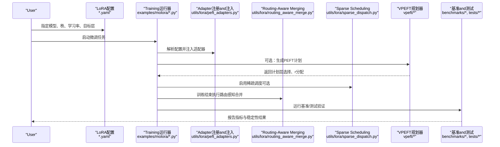
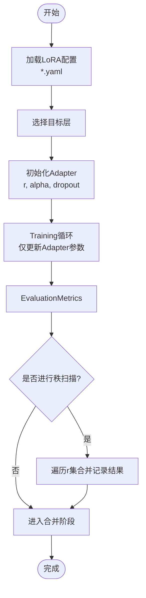
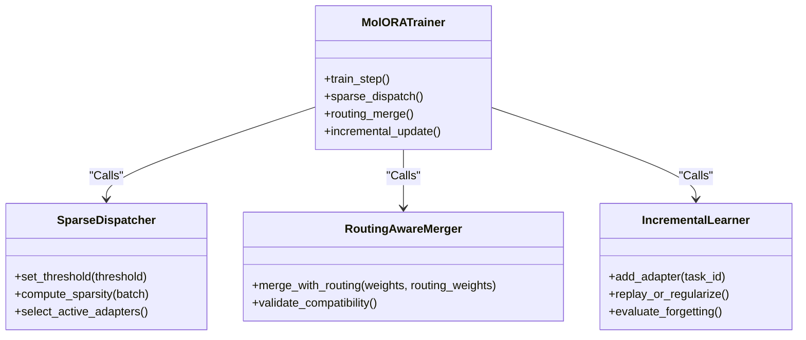
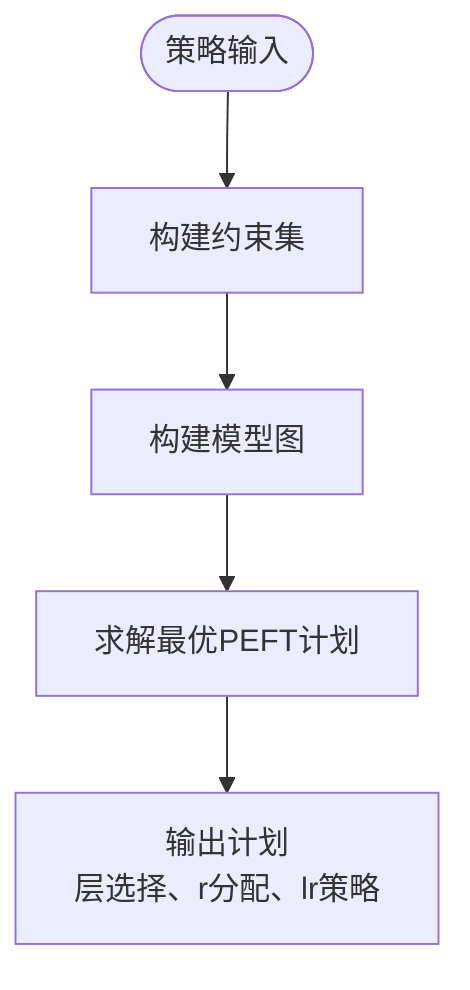
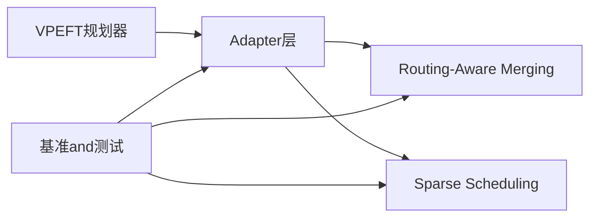

# Parameter-Efficient Fine-TuningExamples

<cite>
**Files Referenced in This Document**
- [examples/lora_examples/yolo_master_lora_README.md](file://examples/lora_examples/yolo_master_lora_README.md)
- [examples/lora_examples/yolo11_lora.yaml](file://examples/lora_examples/yolo11_lora.yaml)
- [examples/lora_examples/yolo12_lora.yaml](file://examples/lora_examples/yolo12_lora.yaml)
- [examples/lora_examples/yolov8_lora.yaml](file://examples/lora_examples/yolov8_lora.yaml)
- [examples/lora_examples/yolo_master_visdrone_lora.yaml](file://examples/lora_examples/yolo_master_visdrone_lora.yaml)
- [examples/lora_examples/run_yolo_master_lora_rank_sweep.py](file://examples/lora_examples/run_yolo_master_lora_rank_sweep.py)
- [examples/molora/basic_finetune.py](file://examples/molora/basic_finetune.py)
- [examples/molora/compare_coco128.py](file://examples/molora/compare_coco128.py)
- [examples/molora/compare_lora_molora.py](file://examples/molora/compare_lora_molora.py)
- [examples/molora/continual_learning.py](file://examples/molora/continual_learning.py)
- [ultralytics/utils/lora/__init__.py](file://ultralytics/utils/lora/__init__.py)
- [ultralytics/utils/lora/peft_adapters.py](file://ultralytics/utils/lora/peft_adapters.py)
- [ultralytics/utils/lora/routing_aware_merge.py](file://ultralytics/utils/lora/routing_aware_merge.py)
- [ultralytics/utils/lora/sparse_dispatch.py](file://ultralytics/utils/lora/sparse_dispatch.py)
- [ultralytics/vpeft/policy.py](file://ultralytics/vpeft/policy.py)
- [ultralytics/vpeft/constraints.py](file://ultralytics/vpeft/constraints.py)
- [ultralytics/vpeft/graph.py](file://ultralytics/vpeft/graph.py)
- [ultralytics/vpeft/solver.py](file://ultralytics/vpeft/solver.py)
- [benchmarks/benchmark_molora_dispatch.py](file://benchmarks/benchmark_molora_dispatch.py)
- [scripts/ablation_suite/ablation_peft_coco128.py](file://scripts/ablation_suite/ablation_peft_coco128.py)
- [scripts/ablation_suite/ablation_molora_full.py](file://scripts/ablation_suite/ablation_molora_full.py)
- [tests/test_molora.py](file://tests/test_molora.py)
- [tests/test_molora_routing_aware_merge.py](file://tests/test_molora_routing_aware_merge.py)
- [tests/test_molora_sparse_dispatch.py](file://tests/test_molora_sparse_dispatch.py)
- [tests/test_vpeft.py](file://tests/test_vpeft.py)
</cite>

## Table of Contents
1. [Introduction](#Introduction)
2. [Project Structure](#Project Structure)
3. [Core Components](#Core Components)
4. [Architecture Overview](#Architecture Overview)
5. [Detailed Component Analysis](#Detailed Component Analysis)
6. [Dependency Analysis](#Dependency Analysis)
7. [性能and部署Optimization](#性能and部署Optimization)
8. [Troubleshooting Guide](#Troubleshooting Guide)
9. [Conclusion](#Conclusion)
10. [Appendix](#Appendix)

## Introduction
本文件targeting希望while实际视觉Tasks中落地LoRA、DoRAandMolORAetc.Parameter-Efficient Fine-Tuning(PEFT)技术的EngineersandResearchers。Documentation围绕Centered on下目标unfold：
- LoRAimplementing原理and配置要点：秩选择、Learning Rate策略、Adapter合并策略
- DoRA技术优势andApplicable Scenarios：权重分解、方向Optimization
- MolORA完整Uses指南：Sparse Scheduling、Routing-Aware Merging、增量学习
- whileCOCO、VisDroneetc.基准上的微调实践and调优经验
- Model Compression、内存OptimizationandInference加速的部署前准备
- 性能对比分析and最佳实践建议

## Project Structure
仓库中andPEFT相关的代码主要分布whileCentered on下位置：
- Examplesand脚本
  - examples/lora_examples：LoRA配置文件and秩扫描脚本
  - examples/molora：MolORA基础微调、对比实验and持续学习脚本
- 核心implementing
  - ultralytics/utils/lora：LoRA/DoRA/MolORA相关适配and工具
  - ultralytics/vpeft：可微PEFT规划器（策略、约束、图构建and求解）
- 基准and测试
  - benchmarks/benchmark_molora_dispatch.py：MolORASparse Scheduling基准
  - scripts/ablation_suite：消融and回归Validation脚本
  - tests/*：针对MolORA、VPEFTetc.的单元测试

```mermaid
graph TB
subgraph "Examples"
LORAYAML["LoRA配置<br/>yolo11_lora.yaml / yolo12_lora.yaml / yolov8_lora.yaml"]
VISDRONEYAML["VisDrone LoRA配置<br/>yolo_master_visdrone_lora.yaml"]
RANKSWEEP["秩扫描脚本<br/>run_yolo_master_lora_rank_sweep.py"]
MOLORA_BF["MolORA基础微调<br/>basic_finetune.py"]
MOLORA_COMP["对比实验<br/>compare_coco128.py / compare_lora_molora.py"]
MOLORA_CL["持续学习<br/>continual_learning.py"]
end
subgraph "核心implementing"
LORA_INIT["LoRA入口<br/>utils/lora/__init__.py"]
ADAPTERS["Adapterimplementing<br/>utils/lora/peft_adapters.py"]
ROUTING_MERGE["Routing-Aware Merging<br/>utils/lora/routing_aware_merge.py"]
SPARSE_D["Sparse Scheduling<br/>utils/lora/sparse_dispatch.py"]
VPEFT_POL["策略<br/>vpeft/policy.py"]
VPEFT_CON["约束<br/>vpeft/constraints.py"]
VPEFT_G["图构建<br/>vpeft/graph.py"]
VPEFT_SOL["求解器<br/>vpeft/solver.py"]
end
subgraph "基准and测试"
BM_MOL["MolORA基准<br/>benchmark_molora_dispatch.py"]
ABL_COCO["COCO128消融<br/>ablation_peft_coco128.py"]
ABL_MOL["MolORA消融<br/>ablation_molora_full.py"]
T_MOL["MolORA测试<br/>test_molora.py"]
T_RM["Routing-Aware Merging测试<br/>test_molora_routing_aware_merge.py"]
T_SD["Sparse Scheduling测试<br/>test_molora_sparse_dispatch.py"]
T_VP["VPEFT测试<br/>test_vpeft.py"]
end
LORAYAML --> ADAPTERS
VISDRONEYAML --> ADAPTERS
RANKSWEEP --> ADAPTERS
MOLORA_BF --> ADAPTERS
MOLORA_COMP --> ADAPTERS
MOLORA_CL --> ADAPTERS
ADAPTERS --> ROUTING_MERGE
ADAPTERS --> SPARSE_D
ADAPTERS --> LORA_INIT
ROUTING_MERGE --> VPEFT_POL
ROUTING_MERGE --> VPEFT_CON
ROUTING_MERGE --> VPEFT_G
ROUTING_MERGE --> VPEFT_SOL
BM_MOL --> SPARSE_D
ABL_COCO --> ADAPTERS
ABL_MOL --> ROUTING_MERGE
T_MOL --> ADAPTERS
T_RM --> ROUTING_MERGE
T_SD --> SPARSE_D
T_VP --> VPEFT_SOL
```

Figure Source
- [examples/lora_examples/yolo11_lora.yaml](file://examples/lora_examples/yolo11_lora.yaml)
- [examples/lora_examples/yolo12_lora.yaml](file://examples/lora_examples/yolo12_lora.yaml)
- [examples/lora_examples/yolov8_lora.yaml](file://examples/lora_examples/yolov8_lora.yaml)
- [examples/lora_examples/yolo_master_visdrone_lora.yaml](file://examples/lora_examples/yolo_master_visdrone_lora.yaml)
- [examples/lora_examples/run_yolo_master_lora_rank_sweep.py](file://examples/lora_examples/run_yolo_master_lora_rank_sweep.py)
- [examples/molora/basic_finetune.py](file://examples/molora/basic_finetune.py)
- [examples/molora/compare_coco128.py](file://examples/molora/compare_coco128.py)
- [examples/molora/compare_lora_molora.py](file://examples/molora/compare_lora_molora.py)
- [examples/molora/continual_learning.py](file://examples/molora/continual_learning.py)
- [ultralytics/utils/lora/__init__.py](file://ultralytics/utils/lora/__init__.py)
- [ultralytics/utils/lora/peft_adapters.py](file://ultralytics/utils/lora/peft_adapters.py)
- [ultralytics/utils/lora/routing_aware_merge.py](file://ultralytics/utils/lora/routing_aware_merge.py)
- [ultralytics/utils/lora/sparse_dispatch.py](file://ultralytics/utils/lora/sparse_dispatch.py)
- [ultralytics/vpeft/policy.py](file://ultralytics/vpeft/policy.py)
- [ultralytics/vpeft/constraints.py](file://ultralytics/vpeft/constraints.py)
- [ultralytics/vpeft/graph.py](file://ultralytics/vpeft/graph.py)
- [ultralytics/vpeft/solver.py](file://ultralytics/vpeft/solver.py)
- [benchmarks/benchmark_molora_dispatch.py](file://benchmarks/benchmark_molora_dispatch.py)
- [scripts/ablation_suite/ablation_peft_coco128.py](file://scripts/ablation_suite/ablation_peft_coco128.py)
- [scripts/ablation_suite/ablation_molora_full.py](file://scripts/ablation_suite/ablation_molora_full.py)
- [tests/test_molora.py](file://tests/test_molora.py)
- [tests/test_molora_routing_aware_merge.py](file://tests/test_molora_routing_aware_merge.py)
- [tests/test_molora_sparse_dispatch.py](file://tests/test_molora_sparse_dispatch.py)
- [tests/test_vpeft.py](file://tests/test_vpeft.py)

Section Source
- [examples/lora_examples/yolo11_lora.yaml](file://examples/lora_examples/yolo11_lora.yaml)
- [examples/lora_examples/yolo12_lora.yaml](file://examples/lora_examples/yolo12_lora.yaml)
- [examples/lora_examples/yolov8_lora.yaml](file://examples/lora_examples/yolov8_lora.yaml)
- [examples/lora_examples/yolo_master_visdrone_lora.yaml](file://examples/lora_examples/yolo_master_visdrone_lora.yaml)
- [examples/lora_examples/run_yolo_master_lora_rank_sweep.py](file://examples/lora_examples/run_yolo_master_lora_rank_sweep.py)
- [examples/molora/basic_finetune.py](file://examples/molora/basic_finetune.py)
- [examples/molora/compare_coco128.py](file://examples/molora/compare_coco128.py)
- [examples/molora/compare_lora_molora.py](file://examples/molora/compare_lora_molora.py)
- [examples/molora/continual_learning.py](file://examples/molora/continual_learning.py)
- [ultralytics/utils/lora/__init__.py](file://ultralytics/utils/lora/__init__.py)
- [ultralytics/utils/lora/peft_adapters.py](file://ultralytics/utils/lora/peft_adapters.py)
- [ultralytics/utils/lora/routing_aware_merge.py](file://ultralytics/utils/lora/routing_aware_merge.py)
- [ultralytics/utils/lora/sparse_dispatch.py](file://ultralytics/utils/lora/sparse_dispatch.py)
- [ultralytics/vpeft/policy.py](file://ultralytics/vpeft/policy.py)
- [ultralytics/vpeft/constraints.py](file://ultralytics/vpeft/constraints.py)
- [ultralytics/vpeft/graph.py](file://ultralytics/vpeft/graph.py)
- [ultralytics/vpeft/solver.py](file://ultralytics/vpeft/solver.py)
- [benchmarks/benchmark_molora_dispatch.py](file://benchmarks/benchmark_molora_dispatch.py)
- [scripts/ablation_suite/ablation_peft_coco128.py](file://scripts/ablation_suite/ablation_peft_coco128.py)
- [scripts/ablation_suite/ablation_molora_full.py](file://scripts/ablation_suite/ablation_molora_full.py)
- [tests/test_molora.py](file://tests/test_molora.py)
- [tests/test_molora_routing_aware_merge.py](file://tests/test_molora_routing_aware_merge.py)
- [tests/test_molora_sparse_dispatch.py](file://tests/test_molora_sparse_dispatch.py)
- [tests/test_vpeft.py](file://tests/test_vpeft.py)

## Core Components
本节聚焦LoRA、DoRAandMolORA的关键implementingModulesand其职责边界。

- LoRA/DoRAAdapter层
  - 负责将低秩矩阵或方向-幅度分解注入to目标层，SupportingTraining时仅更新少量参数
  - provides不同秩r的选择、缩放因子alpha、dropoutand初始化策略
  - Supporting多目标层批量插入and按层开关控制
- Routing-Aware Merging
  - whileMoE/Mixture专家或多Tasks场景中，依据路由权重对多个Adapter输出进行加权融合
  - 保证合并后权重and原模型兼容，便于ExportandInference
- Sparse Scheduling
  - 动态激活/停用部分Adapter或专家，降低显存占用并提升吞吐
  - Combining门控阈值and批内稀疏度控制，implementing按需计算
- VPEFT规划器
  - 基于策略、约束and图构建，自动搜索最优的PEFT方案（such as哪些层插LoRA、r值分配）
  - Via求解器输出可执行的微调计划

Section Source
- [ultralytics/utils/lora/peft_adapters.py](file://ultralytics/utils/lora/peft_adapters.py)
- [ultralytics/utils/lora/routing_aware_merge.py](file://ultralytics/utils/lora/routing_aware_merge.py)
- [ultralytics/utils/lora/sparse_dispatch.py](file://ultralytics/utils/lora/sparse_dispatch.py)
- [ultralytics/vpeft/policy.py](file://ultralytics/vpeft/policy.py)
- [ultralytics/vpeft/constraints.py](file://ultralytics/vpeft/constraints.py)
- [ultralytics/vpeft/graph.py](file://ultralytics/vpeft/graph.py)
- [ultralytics/vpeft/solver.py](file://ultralytics/vpeft/solver.py)

## Architecture Overview
下图展示了从配置toTraining、合并andInference的整体流程，Centered onand各Modules之间的交互关系。

Figure Source
- [examples/lora_examples/yolo11_lora.yaml](file://examples/lora_examples/yolo11_lora.yaml)
- [examples/molora/basic_finetune.py](file://examples/molora/basic_finetune.py)
- [ultralytics/utils/lora/peft_adapters.py](file://ultralytics/utils/lora/peft_adapters.py)
- [ultralytics/utils/lora/routing_aware_merge.py](file://ultralytics/utils/lora/routing_aware_merge.py)
- [ultralytics/utils/lora/sparse_dispatch.py](file://ultralytics/utils/lora/sparse_dispatch.py)
- [ultralytics/vpeft/policy.py](file://ultralytics/vpeft/policy.py)
- [ultralytics/vpeft/constraints.py](file://ultralytics/vpeft/constraints.py)
- [ultralytics/vpeft/graph.py](file://ultralytics/vpeft/graph.py)
- [ultralytics/vpeft/solver.py](file://ultralytics/vpeft/solver.py)
- [benchmarks/benchmark_molora_dispatch.py](file://benchmarks/benchmark_molora_dispatch.py)
- [tests/test_molora.py](file://tests/test_molora.py)

## Detailed Component Analysis

### LoRAimplementingand配置
- 关键capabilities
  - 秩rand缩放alpha：影响表达capabilitiesand参数量；通常r∈{1,2,4,8,16}，alpha常取r或2r
  - Learning Rate设置：AdapterLearning Rate通常高于主干冻结时的默认Learning Rate，需Combined withwarmupand衰减
  - 目标层选择：卷积/线性/注意力etc.不同层的插入策略会影响收敛速度and最终精度
  - 初始化and正则：零初始化或高斯初始化、dropout比例对稳定性有显著影响
- 配置ExamplesRefer to
  - YOLO11/12/v8的LoRA配置模板位于examples/lora_examples下，可直接修改r、alpha、lr、target_layersetc.字段
  - VisDrone专用配置用于小目标密集场景，建议更小的rand更强的Data Augmentation
- 秩扫描and自动化
  - run_yolo_master_lora_rank_sweep.pyprovides秩扫描流水线，便于while给定数据集上快速定位最优r

Figure Source
- [examples/lora_examples/yolo11_lora.yaml](file://examples/lora_examples/yolo11_lora.yaml)
- [examples/lora_examples/yolo12_lora.yaml](file://examples/lora_examples/yolo12_lora.yaml)
- [examples/lora_examples/yolov8_lora.yaml](file://examples/lora_examples/yolov8_lora.yaml)
- [examples/lora_examples/yolo_master_visdrone_lora.yaml](file://examples/lora_examples/yolo_master_visdrone_lora.yaml)
- [examples/lora_examples/run_yolo_master_lora_rank_sweep.py](file://examples/lora_examples/run_yolo_master_lora_rank_sweep.py)
- [ultralytics/utils/lora/peft_adapters.py](file://ultralytics/utils/lora/peft_adapters.py)

Section Source
- [examples/lora_examples/yolo11_lora.yaml](file://examples/lora_examples/yolo11_lora.yaml)
- [examples/lora_examples/yolo12_lora.yaml](file://examples/lora_examples/yolo12_lora.yaml)
- [examples/lora_examples/yolov8_lora.yaml](file://examples/lora_examples/yolov8_lora.yaml)
- [examples/lora_examples/yolo_master_visdrone_lora.yaml](file://examples/lora_examples/yolo_master_visdrone_lora.yaml)
- [examples/lora_examples/run_yolo_master_lora_rank_sweep.py](file://examples/lora_examples/run_yolo_master_lora_rank_sweep.py)
- [ultralytics/utils/lora/peft_adapters.py](file://ultralytics/utils/lora/peft_adapters.py)

### DoRA：权重分解and方向Optimization
- 技术要点
  - 将权重分解for“方向向量+幅度标量”，仅while方向上进行低秩更新，有助于稳定Gradientand减少过拟合
  - 适用于对数值稳定性敏感的Tasks（such as长尾分布、小Object Detection）
- Applicable Scenarios
  - 数据规模有限但需要较高泛化capabilities的场景
  - andLoRA组合Uses时，可while关键层采用DoRACentered on增强鲁棒性
- implementingRefer to
  - Adapter层内部providesDoRA分支，可Via配置开关切换LoRA/DoRA模式

Section Source
- [ultralytics/utils/lora/peft_adapters.py](file://ultralytics/utils/lora/peft_adapters.py)

### MolORA：Sparse Scheduling、Routing-Aware Mergingand增量学习
- Sparse Scheduling
  - 根据门控阈值and批内稀疏度控制，动态激活部分Adapter/专家，降低计算and显存开销
  - Supporting动态阈值调整and早停策略，避免过度稀疏导致性能退化
- Routing-Aware Merging
  - while多Tasks或Mixture专家场景，依据路由权重对多个Adapter输出进行加权融合，确保合并后的权重and原模型兼容
  - 合并过程考虑路由分布，避免某些专家被长期忽略
- 增量学习
  - Supportingwhile新Tasks上逐步添加Adapter，同时保持旧Tasks性能
  - Combining回放或正则项抑制灾难性遗忘
- Uses指南
  - basic_finetune.py：最小可用Examples，展示such as何开启Sparse SchedulingandRouting-Aware Merging
  - compare_coco128.py / compare_lora_molora.py：whileCOCO128上对比LoRAandMolORA的性能差异
  - continual_learning.py：演示增量学习流程andEvaluation方法

Figure Source
- [examples/molora/basic_finetune.py](file://examples/molora/basic_finetune.py)
- [examples/molora/compare_coco128.py](file://examples/molora/compare_coco128.py)
- [examples/molora/compare_lora_molora.py](file://examples/molora/compare_lora_molora.py)
- [examples/molora/continual_learning.py](file://examples/molora/continual_learning.py)
- [ultralytics/utils/lora/sparse_dispatch.py](file://ultralytics/utils/lora/sparse_dispatch.py)
- [ultralytics/utils/lora/routing_aware_merge.py](file://ultralytics/utils/lora/routing_aware_merge.py)

Section Source
- [examples/molora/basic_finetune.py](file://examples/molora/basic_finetune.py)
- [examples/molora/compare_coco128.py](file://examples/molora/compare_coco128.py)
- [examples/molora/compare_lora_molora.py](file://examples/molora/compare_lora_molora.py)
- [examples/molora/continual_learning.py](file://examples/molora/continual_learning.py)
- [ultralytics/utils/lora/sparse_dispatch.py](file://ultralytics/utils/lora/sparse_dispatch.py)
- [ultralytics/utils/lora/routing_aware_merge.py](file://ultralytics/utils/lora/routing_aware_merge.py)

### VPEFT规划器：策略、约束、图构建and求解
- 策略(policy)：定义可插层的候选集、r值范围、Learning Rate上限etc.
- 约束(constraints)：显存预算、参数量上限、层间相关性限制
- 图(graph)：将模型结构andPEFT选项建模for图，便于搜索and剪枝
- 求解器(solver)：基于启发式或Optimization算法输出最优PEFT计划

Figure Source
- [ultralytics/vpeft/policy.py](file://ultralytics/vpeft/policy.py)
- [ultralytics/vpeft/constraints.py](file://ultralytics/vpeft/constraints.py)
- [ultralytics/vpeft/graph.py](file://ultralytics/vpeft/graph.py)
- [ultralytics/vpeft/solver.py](file://ultralytics/vpeft/solver.py)

Section Source
- [ultralytics/vpeft/policy.py](file://ultralytics/vpeft/policy.py)
- [ultralytics/vpeft/constraints.py](file://ultralytics/vpeft/constraints.py)
- [ultralytics/vpeft/graph.py](file://ultralytics/vpeft/graph.py)
- [ultralytics/vpeft/solver.py](file://ultralytics/vpeft/solver.py)

## Dependency Analysis
- Modules耦合
  - Adapter层依赖Routing-Aware MergingandSparse Scheduling，形成“Training时稀疏+合并时融合”的闭环
  - VPEFT规划器独立于具体Adapterimplementing，Via策略and约束drivers are installed通用PEFT计划
- External Dependencies
  - 基准and测试覆盖MolORA、Sparse SchedulingandVPEFT，确保功能正确性and数值稳定性
- 潜while风险
  - 路由权重分布不均可能导致某些专家长期不活跃，需while合并阶段引入公平性约束
  - 稀疏阈值过高会破坏性能，应CombiningValidation集监控and自适应调整

Figure Source
- [ultralytics/utils/lora/peft_adapters.py](file://ultralytics/utils/lora/peft_adapters.py)
- [ultralytics/utils/lora/routing_aware_merge.py](file://ultralytics/utils/lora/routing_aware_merge.py)
- [ultralytics/utils/lora/sparse_dispatch.py](file://ultralytics/utils/lora/sparse_dispatch.py)
- [ultralytics/vpeft/policy.py](file://ultralytics/vpeft/policy.py)
- [ultralytics/vpeft/constraints.py](file://ultralytics/vpeft/constraints.py)
- [ultralytics/vpeft/graph.py](file://ultralytics/vpeft/graph.py)
- [ultralytics/vpeft/solver.py](file://ultralytics/vpeft/solver.py)
- [benchmarks/benchmark_molora_dispatch.py](file://benchmarks/benchmark_molora_dispatch.py)
- [tests/test_molora.py](file://tests/test_molora.py)
- [tests/test_molora_routing_aware_merge.py](file://tests/test_molora_routing_aware_merge.py)
- [tests/test_molora_sparse_dispatch.py](file://tests/test_molora_sparse_dispatch.py)
- [tests/test_vpeft.py](file://tests/test_vpeft.py)

Section Source
- [ultralytics/utils/lora/peft_adapters.py](file://ultralytics/utils/lora/peft_adapters.py)
- [ultralytics/utils/lora/routing_aware_merge.py](file://ultralytics/utils/lora/routing_aware_merge.py)
- [ultralytics/utils/lora/sparse_dispatch.py](file://ultralytics/utils/lora/sparse_dispatch.py)
- [ultralytics/vpeft/policy.py](file://ultralytics/vpeft/policy.py)
- [ultralytics/vpeft/constraints.py](file://ultralytics/vpeft/constraints.py)
- [ultralytics/vpeft/graph.py](file://ultralytics/vpeft/graph.py)
- [ultralytics/vpeft/solver.py](file://ultralytics/vpeft/solver.py)
- [benchmarks/benchmark_molora_dispatch.py](file://benchmarks/benchmark_molora_dispatch.py)
- [tests/test_molora.py](file://tests/test_molora.py)
- [tests/test_molora_routing_aware_merge.py](file://tests/test_molora_routing_aware_merge.py)
- [tests/test_molora_sparse_dispatch.py](file://tests/test_molora_sparse_dispatch.py)
- [tests/test_vpeft.py](file://tests/test_vpeft.py)

## 性能and部署Optimization
- Model Compression
  - 利用Sparse Scheduling减少激活路径，Combining量化and剪枝进一步压缩体积
  - Routing-Aware Merging后可直接Exporting to单权重模型，避免运行时融合开销
- 内存Optimization
  - 冻结主干、仅TrainingAdapter；Set appropriatelyrandbatch size，避免显存峰值过高
  - UsesGradientCheckpointandMixture精度Training降低内存占用
- Inference加速
  - 合并后模型可直接部署至ONNX/TensorRT/OpenVINOetc.后端
  - 针对边缘设备，优先选择较小rand适度稀疏度，平衡精度and延迟

[本节for通用指导，无需特定文件引用]

## Troubleshooting Guide
- 常见问题
  - Training不稳定：检查DoRA/LoRA初始化andLearning Rate；适当增大warmup步数
  - 路由权重异常：监控路由分布，必要时引入Load Balancing损失或重校准
  - 稀疏度过高：逐步提高阈值，观察Validation集Metrics变化
- 调试建议
  - Uses基准脚本and单元测试复现问题，定位是Sparse Scheduling还是合并逻辑导致
  - while小型数据集上快速Validation配置有效性，再扩展to全量数据

Section Source
- [benchmarks/benchmark_molora_dispatch.py](file://benchmarks/benchmark_molora_dispatch.py)
- [tests/test_molora.py](file://tests/test_molora.py)
- [tests/test_molora_routing_aware_merge.py](file://tests/test_molora_routing_aware_merge.py)
- [tests/test_molora_sparse_dispatch.py](file://tests/test_molora_sparse_dispatch.py)
- [tests/test_vpeft.py](file://tests/test_vpeft.py)

## Conclusion
- LoRAwhile多数视觉Tasks中能Centered on极低参数成本获得良好效果，关键while于合理的randLearning Rate策略
- DoRAwhile数值稳定性and泛化方面具备优势，适合小样本and长尾场景
- MolORAViaSparse SchedulingandRouting-Aware Merging，while资源受限环境下implementing高效微调and增量学习
- 借助VPEFT规划器，可系统化地搜索最优PEFT方案，提升工程效率and可重复性

[本节for总结性内容，无需特定文件引用]

## Appendix
- 数据集and基准
  - COCO/COCO128：标准Object Detection基准，适合ValidationLoRA/MolORA的通用性
  - VisDrone：无人机视角小目标密集场景，适合ValidationDoRAandSparse Scheduling的鲁棒性
- Refer to脚本and配置
  - LoRA配置模板and秩扫描脚本位于examples/lora_examples
  - MolORA基础微调and对比实验位于examples/molora
  - 消融and回归Validation位于scripts/ablation_suite

Section Source
- [examples/lora_examples/yolo_master_lora_README.md](file://examples/lora_examples/yolo_master_lora_README.md)
- [examples/lora_examples/yolo11_lora.yaml](file://examples/lora_examples/yolo11_lora.yaml)
- [examples/lora_examples/yolo12_lora.yaml](file://examples/lora_examples/yolo12_lora.yaml)
- [examples/lora_examples/yolov8_lora.yaml](file://examples/lora_examples/yolov8_lora.yaml)
- [examples/lora_examples/yolo_master_visdrone_lora.yaml](file://examples/lora_examples/yolo_master_visdrone_lora.yaml)
- [examples/lora_examples/run_yolo_master_lora_rank_sweep.py](file://examples/lora_examples/run_yolo_master_lora_rank_sweep.py)
- [examples/molora/basic_finetune.py](file://examples/molora/basic_finetune.py)
- [examples/molora/compare_coco128.py](file://examples/molora/compare_coco128.py)
- [examples/molora/compare_lora_molora.py](file://examples/molora/compare_lora_molora.py)
- [examples/molora/continual_learning.py](file://examples/molora/continual_learning.py)
- [scripts/ablation_suite/ablation_peft_coco128.py](file://scripts/ablation_suite/ablation_peft_coco128.py)
- [scripts/ablation_suite/ablation_molora_full.py](file://scripts/ablation_suite/ablation_molora_full.py)