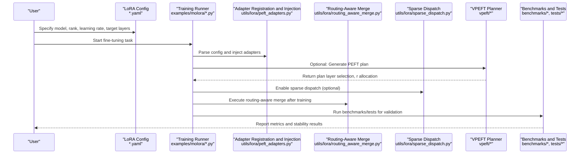
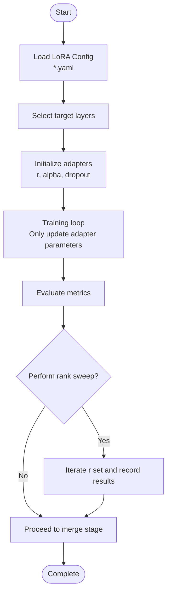
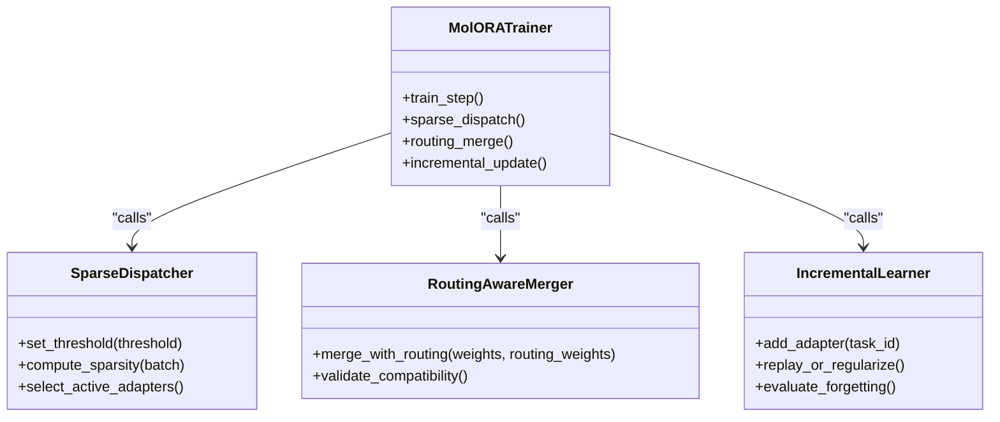
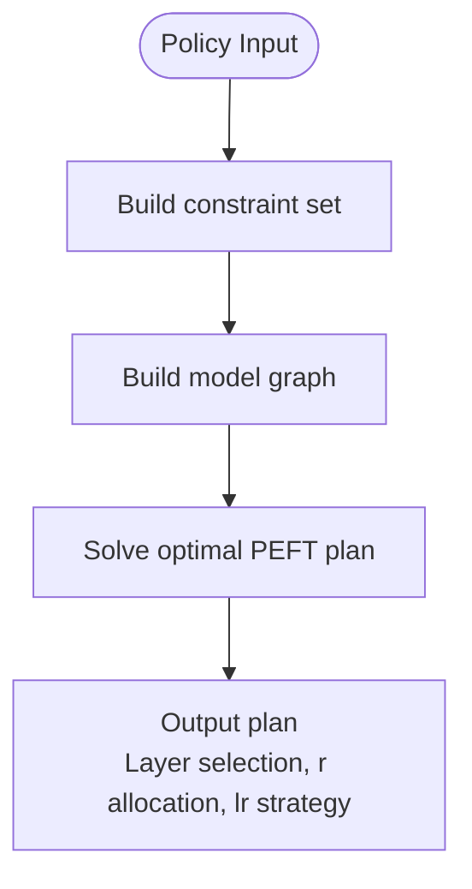
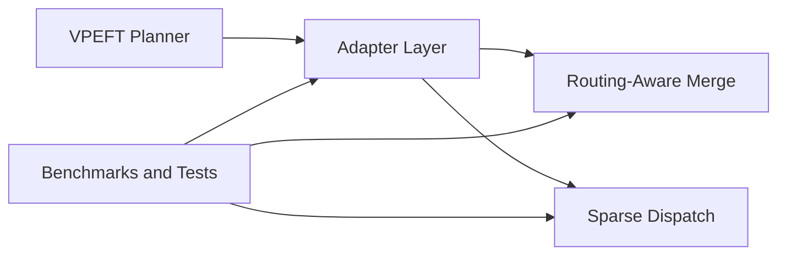

# Parameter-Efficient Fine-Tuning Examples

<cite>
**Files referenced in this document**
- [examples/lora_examples/yolo_master_lora_README.md](file://examples/lora_examples/yolo_master_lora_README.md)
- [examples/lora_examples/yolo11_lora.yaml](file://examples/lora_examples/yolo11_lora.yaml)
- [examples/lora_examples/yolo12_lora.yaml](file://examples/lora_examples/yolo12_lora.yaml)
- [examples/lora_examples/yolov8_lora.yaml](file://examples/lora_examples/yolov8_lora.yaml)
- [examples/lora_examples/yolo_master_visdrone_lora.yaml](file://examples/lora_examples/yolo_master_visdrone_lora.yaml)
- [examples/lora_examples/run_yolo_master_lora_rank_sweep.py](file://examples/lora_examples/run_yolo_master_lora_rank_sweep.py)
- [examples/molora/basic_finetune.py](file://examples/molora/basic_finetune.py)
- [examples/molora/compare_coco128.py](file://examples/molora/compare_coco128.py)
- [examples/molora/compare_lora_molora.py](file://examples/molora/compare_lora_molora.py)
- [examples/molora/continual_learning.py](file://examples/molora/continual_learning.py)
- [ultralytics/utils/lora/__init__.py](file://ultralytics/utils/lora/__init__.py)
- [ultralytics/utils/lora/peft_adapters.py](file://ultralytics/utils/lora/peft_adapters.py)
- [ultralytics/utils/lora/routing_aware_merge.py](file://ultralytics/utils/lora/routing_aware_merge.py)
- [ultralytics/utils/lora/sparse_dispatch.py](file://ultralytics/utils/lora/sparse_dispatch.py)
- [ultralytics/vpeft/policy.py](file://ultralytics/vpeft/policy.py)
- [ultralytics/vpeft/constraints.py](file://ultralytics/vpeft/constraints.py)
- [ultralytics/vpeft/graph.py](file://ultralytics/vpeft/graph.py)
- [ultralytics/vpeft/solver.py](file://ultralytics/vpeft/solver.py)
- [benchmarks/benchmark_molora_dispatch.py](file://benchmarks/benchmark_molora_dispatch.py)
- [scripts/ablation_suite/ablation_peft_coco128.py](file://scripts/ablation_suite/ablation_peft_coco128.py)
- [scripts/ablation_suite/ablation_molora_full.py](file://scripts/ablation_suite/ablation_molora_full.py)
- [tests/test_molora.py](file://tests/test_molora.py)
- [tests/test_molora_routing_aware_merge.py](file://tests/test_molora_routing_aware_merge.py)
- [tests/test_molora_sparse_dispatch.py](file://tests/test_molora_sparse_dispatch.py)
- [tests/test_vpeft.py](file://tests/test_vpeft.py)
</cite>

## Table of Contents
1. [Introduction](#introduction)
2. [Project Structure](#project-structure)
3. [Core Components](#core-components)
4. [Architecture Overview](#architecture-overview)
5. [Detailed Component Analysis](#detailed-component-analysis)
6. [Dependency Analysis](#dependency-analysis)
7. [Performance and Deployment Optimization](#performance-and-deployment-optimization)
8. [Troubleshooting Guide](#troubleshooting-guide)
9. [Conclusion](#conclusion)
10. [Appendix](#appendix)

## Introduction
This document is intended for engineers and researchers looking to deploy Parameter-Efficient Fine-Tuning (PEFT) techniques such as LoRA, DoRA, and MolORA in practical vision tasks. The document covers the following objectives:
- LoRA implementation principles and configuration essentials: rank selection, learning rate strategies, adapter merging strategies
- DoRA technical advantages and applicable scenarios: weight decomposition, directional optimization
- MolORA complete usage guide: sparse dispatch, routing-aware merging, incremental learning
- Fine-tuning practices and tuning experience on COCO, VisDrone, and other benchmarks
- Pre-deployment preparation for model compression, memory optimization, and inference acceleration
- Performance comparison analysis and best practice recommendations

## Project Structure
PEFT-related code in the repository is primarily distributed in the following locations:
- Examples and scripts
  - examples/lora_examples: LoRA configuration files and rank sweep scripts
  - examples/molora: MolORA basic fine-tuning, comparison experiments, and continual learning scripts
- Core implementation
  - ultralytics/utils/lora: LoRA/DoRA/MolORA adapters and utilities
  - ultralytics/vpeft: Differentiable PEFT planner (policy, constraints, graph construction, and solver)
- Benchmarks and tests
  - benchmarks/benchmark_molora_dispatch.py: MolORA sparse dispatch benchmark
  - scripts/ablation_suite: Ablation and regression validation scripts
  - tests/*: Unit tests for MolORA, VPEFT, etc.

```mermaid
graph TB
subgraph "Examples"
LORAYAML["LoRA Config<br/>yolo11_lora.yaml / yolo12_lora.yaml / yolov8_lora.yaml"]
VISDRONEYAML["VisDrone LoRA Config<br/>yolo_master_visdrone_lora.yaml"]
RANKSWEEP["Rank Sweep Script<br/>run_yolo_master_lora_rank_sweep.py"]
MOLORA_BF["MolORA Basic Fine-tune<br/>basic_finetune.py"]
MOLORA_COMP["Comparison Experiments<br/>compare_coco128.py / compare_lora_molora.py"]
MOLORA_CL["Continual Learning<br/>continual_learning.py"]
end
subgraph "Core Implementation"
LORA_INIT["LoRA Entry<br/>utils/lora/__init__.py"]
ADAPTERS["Adapter Implementation<br/>utils/lora/peft_adapters.py"]
ROUTING_MERGE["Routing-Aware Merge<br/>utils/lora/routing_aware_merge.py"]
SPARSE_D["Sparse Dispatch<br/>utils/lora/sparse_dispatch.py"]
VPEFT_POL["Policy<br/>vpeft/policy.py"]
VPEFT_CON["Constraints<br/>vpeft/constraints.py"]
VPEFT_G["Graph Construction<br/>vpeft/graph.py"]
VPEFT_SOL["Solver<br/>vpeft/solver.py"]
end
subgraph "Benchmarks and Tests"
BM_MOL["MolORA Benchmark<br/>benchmark_molora_dispatch.py"]
ABL_COCO["COCO128 Ablation<br/>ablation_peft_coco128.py"]
ABL_MOL["MolORA Ablation<br/>ablation_molora_full.py"]
T_MOL["MolORA Tests<br/>test_molora.py"]
T_RM["Routing-Aware Merge Tests<br/>test_molora_routing_aware_merge.py"]
T_SD["Sparse Dispatch Tests<br/>test_molora_sparse_dispatch.py"]
T_VP["VPEFT Tests<br/>test_vpeft.py"]
end
LORAYAML --> ADAPTERS
VISDRONEYAML --> ADAPTERS
RANKSWEEP --> ADAPTERS
MOLORA_BF --> ADAPTERS
MOLORA_COMP --> ADAPTERS
MOLORA_CL --> ADAPTERS
ADAPTERS --> ROUTING_MERGE
ADAPTERS --> SPARSE_D
ADAPTERS --> LORA_INIT
ROUTING_MERGE --> VPEFT_POL
ROUTING_MERGE --> VPEFT_CON
ROUTING_MERGE --> VPEFT_G
ROUTING_MERGE --> VPEFT_SOL
BM_MOL --> SPARSE_D
ABL_COCO --> ADAPTERS
ABL_MOL --> ROUTING_MERGE
T_MOL --> ADAPTERS
T_RM --> ROUTING_MERGE
T_SD --> SPARSE_D
T_VP --> VPEFT_SOL
```

Diagram source
- [examples/lora_examples/yolo11_lora.yaml](file://examples/lora_examples/yolo11_lora.yaml)
- [examples/lora_examples/yolo12_lora.yaml](file://examples/lora_examples/yolo12_lora.yaml)
- [examples/lora_examples/yolov8_lora.yaml](file://examples/lora_examples/yolov8_lora.yaml)
- [examples/lora_examples/yolo_master_visdrone_lora.yaml](file://examples/lora_examples/yolo_master_visdrone_lora.yaml)
- [examples/lora_examples/run_yolo_master_lora_rank_sweep.py](file://examples/lora_examples/run_yolo_master_lora_rank_sweep.py)
- [examples/molora/basic_finetune.py](file://examples/molora/basic_finetune.py)
- [examples/molora/compare_coco128.py](file://examples/molora/compare_coco128.py)
- [examples/molora/compare_lora_molora.py](file://examples/molora/compare_lora_molora.py)
- [examples/molora/continual_learning.py](file://examples/molora/continual_learning.py)
- [ultralytics/utils/lora/__init__.py](file://ultralytics/utils/lora/__init__.py)
- [ultralytics/utils/lora/peft_adapters.py](file://ultralytics/utils/lora/peft_adapters.py)
- [ultralytics/utils/lora/routing_aware_merge.py](file://ultralytics/utils/lora/routing_aware_merge.py)
- [ultralytics/utils/lora/sparse_dispatch.py](file://ultralytics/utils/lora/sparse_dispatch.py)
- [ultralytics/vpeft/policy.py](file://ultralytics/vpeft/policy.py)
- [ultralytics/vpeft/constraints.py](file://ultralytics/vpeft/constraints.py)
- [ultralytics/vpeft/graph.py](file://ultralytics/vpeft/graph.py)
- [ultralytics/vpeft/solver.py](file://ultralytics/vpeft/solver.py)
- [benchmarks/benchmark_molora_dispatch.py](file://benchmarks/benchmark_molora_dispatch.py)
- [scripts/ablation_suite/ablation_peft_coco128.py](file://scripts/ablation_suite/ablation_peft_coco128.py)
- [scripts/ablation_suite/ablation_molora_full.py](file://scripts/ablation_suite/ablation_molora_full.py)
- [tests/test_molora.py](file://tests/test_molora.py)
- [tests/test_molora_routing_aware_merge.py](file://tests/test_molora_routing_aware_merge.py)
- [tests/test_molora_sparse_dispatch.py](file://tests/test_molora_sparse_dispatch.py)
- [tests/test_vpeft.py](file://tests/test_vpeft.py)

Section source
- [examples/lora_examples/yolo11_lora.yaml](file://examples/lora_examples/yolo11_lora.yaml)
- [examples/lora_examples/yolo12_lora.yaml](file://examples/lora_examples/yolo12_lora.yaml)
- [examples/lora_examples/yolov8_lora.yaml](file://examples/lora_examples/yolov8_lora.yaml)
- [examples/lora_examples/yolo_master_visdrone_lora.yaml](file://examples/lora_examples/yolo_master_visdrone_lora.yaml)
- [examples/lora_examples/run_yolo_master_lora_rank_sweep.py](file://examples/lora_examples/run_yolo_master_lora_rank_sweep.py)
- [examples/molora/basic_finetune.py](file://examples/molora/basic_finetune.py)
- [examples/molora/compare_coco128.py](file://examples/molora/compare_coco128.py)
- [examples/molora/compare_lora_molora.py](file://examples/molora/compare_lora_molora.py)
- [examples/molora/continual_learning.py](file://examples/molora/continual_learning.py)
- [ultralytics/utils/lora/__init__.py](file://ultralytics/utils/lora/__init__.py)
- [ultralytics/utils/lora/peft_adapters.py](file://ultralytics/utils/lora/peft_adapters.py)
- [ultralytics/utils/lora/routing_aware_merge.py](file://ultralytics/utils/lora/routing_aware_merge.py)
- [ultralytics/utils/lora/sparse_dispatch.py](file://ultralytics/utils/lora/sparse_dispatch.py)
- [ultralytics/vpeft/policy.py](file://ultralytics/vpeft/policy.py)
- [ultralytics/vpeft/constraints.py](file://ultralytics/vpeft/constraints.py)
- [ultralytics/vpeft/graph.py](file://ultralytics/vpeft/graph.py)
- [ultralytics/vpeft/solver.py](file://ultralytics/vpeft/solver.py)
- [benchmarks/benchmark_molora_dispatch.py](file://benchmarks/benchmark_molora_dispatch.py)
- [scripts/ablation_suite/ablation_peft_coco128.py](file://scripts/ablation_suite/ablation_peft_coco128.py)
- [scripts/ablation_suite/ablation_molora_full.py](file://scripts/ablation_suite/ablation_molora_full.py)
- [tests/test_molora.py](file://tests/test_molora.py)
- [tests/test_molora_routing_aware_merge.py](file://tests/test_molora_routing_aware_merge.py)
- [tests/test_molora_sparse_dispatch.py](file://tests/test_molora_sparse_dispatch.py)
- [tests/test_vpeft.py](file://tests/test_vpeft.py)

## Core Components
This section focuses on the key implementation modules of LoRA, DoRA, and MolORA and their responsibility boundaries.

- LoRA/DoRA Adapter Layer
  - Responsible for injecting low-rank matrices or direction-magnitude decomposition into target layers, supporting training with only a small number of parameter updates
  - Provides different rank r selections, scaling factor alpha, dropout, and initialization strategies
  - Supports batch insertion across multiple target layers and per-layer enable/disable control
- Routing-Aware Merge
  - In MoE/mixture-of-experts or multi-task scenarios, performs weighted fusion of multiple adapter outputs based on routing weights
  - Ensures merged weights are compatible with the original model for easy export and inference
- Sparse Dispatch
  - Dynamically activates/deactivates some adapters or experts to reduce memory usage and improve throughput
  - Combines gating thresholds with intra-batch sparsity control for on-demand computation
- VPEFT Planner
  - Based on policy, constraints, and graph construction, automatically searches for the optimal PEFT plan (e.g., which layers to insert LoRA, r value allocation)
  - Outputs executable fine-tuning plans through the solver

Section source
- [ultralytics/utils/lora/peft_adapters.py](file://ultralytics/utils/lora/peft_adapters.py)
- [ultralytics/utils/lora/routing_aware_merge.py](file://ultralytics/utils/lora/routing_aware_merge.py)
- [ultralytics/utils/lora/sparse_dispatch.py](file://ultralytics/utils/lora/sparse_dispatch.py)
- [ultralytics/vpeft/policy.py](file://ultralytics/vpeft/policy.py)
- [ultralytics/vpeft/constraints.py](file://ultralytics/vpeft/constraints.py)
- [ultralytics/vpeft/graph.py](file://ultralytics/vpeft/graph.py)
- [ultralytics/vpeft/solver.py](file://ultralytics/vpeft/solver.py)

## Architecture Overview
The following diagram shows the overall workflow from configuration to training, merging, and inference, as well as the interaction relationships between modules.

Diagram source
- [examples/lora_examples/yolo11_lora.yaml](file://examples/lora_examples/yolo11_lora.yaml)
- [examples/molora/basic_finetune.py](file://examples/molora/basic_finetune.py)
- [ultralytics/utils/lora/peft_adapters.py](file://ultralytics/utils/lora/peft_adapters.py)
- [ultralytics/utils/lora/routing_aware_merge.py](file://ultralytics/utils/lora/routing_aware_merge.py)
- [ultralytics/utils/lora/sparse_dispatch.py](file://ultralytics/utils/lora/sparse_dispatch.py)
- [ultralytics/vpeft/policy.py](file://ultralytics/vpeft/policy.py)
- [ultralytics/vpeft/constraints.py](file://ultralytics/vpeft/constraints.py)
- [ultralytics/vpeft/graph.py](file://ultralytics/vpeft/graph.py)
- [ultralytics/vpeft/solver.py](file://ultralytics/vpeft/solver.py)
- [benchmarks/benchmark_molora_dispatch.py](file://benchmarks/benchmark_molora_dispatch.py)
- [tests/test_molora.py](file://tests/test_molora.py)

## Detailed Component Analysis

### LoRA Implementation and Configuration
- Key capabilities
  - Rank r and scaling alpha: Affect expressiveness and parameter count; typically r∈{1,2,4,8,16}, alpha is often r or 2r
  - Learning rate settings: Adapter learning rate is typically higher than the default when backbone is frozen; requires warmup and decay
  - Target layer selection: Insertion strategies for different layers (conv/linear/attention) affect convergence speed and final accuracy
  - Initialization and regularization: Zero initialization or Gaussian initialization, dropout ratio significantly impacts stability
- Configuration example reference
  - LoRA configuration templates for YOLO11/12/v8 are located in examples/lora_examples; fields like r, alpha, lr, target_layers can be directly modified
  - VisDrone-specific configuration for small object dense scenarios recommends smaller r and stronger data augmentation
- Rank sweep and automation
  - run_yolo_master_lora_rank_sweep.py provides a rank sweep pipeline for quickly identifying the optimal r on a given dataset

Diagram source
- [examples/lora_examples/yolo11_lora.yaml](file://examples/lora_examples/yolo11_lora.yaml)
- [examples/lora_examples/yolo12_lora.yaml](file://examples/lora_examples/yolo12_lora.yaml)
- [examples/lora_examples/yolov8_lora.yaml](file://examples/lora_examples/yolov8_lora.yaml)
- [examples/lora_examples/yolo_master_visdrone_lora.yaml](file://examples/lora_examples/yolo_master_visdrone_lora.yaml)
- [examples/lora_examples/run_yolo_master_lora_rank_sweep.py](file://examples/lora_examples/run_yolo_master_lora_rank_sweep.py)
- [ultralytics/utils/lora/peft_adapters.py](file://ultralytics/utils/lora/peft_adapters.py)

Section source
- [examples/lora_examples/yolo11_lora.yaml](file://examples/lora_examples/yolo11_lora.yaml)
- [examples/lora_examples/yolo12_lora.yaml](file://examples/lora_examples/yolo12_lora.yaml)
- [examples/lora_examples/yolov8_lora.yaml](file://examples/lora_examples/yolov8_lora.yaml)
- [examples/lora_examples/yolo_master_visdrone_lora.yaml](file://examples/lora_examples/yolo_master_visdrone_lora.yaml)
- [examples/lora_examples/run_yolo_master_lora_rank_sweep.py](file://examples/lora_examples/run_yolo_master_lora_rank_sweep.py)
- [ultralytics/utils/lora/peft_adapters.py](file://ultralytics/utils/lora/peft_adapters.py)

### DoRA: Weight Decomposition and Directional Optimization
- Technical highlights
  - Decomposes weights into "direction vector + magnitude scalar", performing low-rank updates only on direction, helping stabilize gradients and reduce overfitting
  - Suitable for tasks sensitive to numerical stability (e.g., long-tail distributions, small object detection)
- Applicable scenarios
  - Scenarios with limited data scale but requiring high generalization capability
  - When combined with LoRA, DoRA can be applied to key layers to enhance robustness
- Implementation reference
  - The adapter layer internally provides a DoRA branch; LoRA/DoRA mode can be switched via configuration

Section source
- [ultralytics/utils/lora/peft_adapters.py](file://ultralytics/utils/lora/peft_adapters.py)

### MolORA: Sparse Dispatch, Routing-Aware Merge, and Incremental Learning
- Sparse dispatch
  - Dynamically activates some adapters/experts based on gating thresholds and intra-batch sparsity control, reducing computation and memory overhead
  - Supports dynamic threshold adjustment and early stopping strategies to avoid performance degradation from excessive sparsity
- Routing-aware merge
  - In multi-task or mixture-of-experts scenarios, performs weighted fusion of multiple adapter outputs based on routing weights, ensuring merged weights are compatible with the original model
  - The merge process considers routing distribution to avoid certain experts being ignored long-term
- Incremental learning
  - Supports gradually adding adapters on new tasks while maintaining old task performance
  - Combines replay or regularization terms to suppress catastrophic forgetting
- Usage guide
  - basic_finetune.py: Minimal viable example showing how to enable sparse dispatch and routing-aware merge
  - compare_coco128.py / compare_lora_molora.py: Compare performance differences between LoRA and MolORA on COCO128
  - continual_learning.py: Demonstrates incremental learning workflow and evaluation methods

Diagram source
- [examples/molora/basic_finetune.py](file://examples/molora/basic_finetune.py)
- [examples/molora/compare_coco128.py](file://examples/molora/compare_coco128.py)
- [examples/molora/compare_lora_molora.py](file://examples/molora/compare_lora_molora.py)
- [examples/molora/continual_learning.py](file://examples/molora/continual_learning.py)
- [ultralytics/utils/lora/sparse_dispatch.py](file://ultralytics/utils/lora/sparse_dispatch.py)
- [ultralytics/utils/lora/routing_aware_merge.py](file://ultralytics/utils/lora/routing_aware_merge.py)

Section source
- [examples/molora/basic_finetune.py](file://examples/molora/basic_finetune.py)
- [examples/molora/compare_coco128.py](file://examples/molora/compare_coco128.py)
- [examples/molora/compare_lora_molora.py](file://examples/molora/compare_lora_molora.py)
- [examples/molora/continual_learning.py](file://examples/molora/continual_learning.py)
- [ultralytics/utils/lora/sparse_dispatch.py](file://ultralytics/utils/lora/sparse_dispatch.py)
- [ultralytics/utils/lora/routing_aware_merge.py](file://ultralytics/utils/lora/routing_aware_merge.py)

### VPEFT Planner: Policy, Constraints, Graph Construction, and Solver
- Policy: Defines candidate set of insertable layers, r value range, learning rate upper bound, etc.
- Constraints: Memory budget, parameter count upper limit, inter-layer correlation restrictions
- Graph: Models model structure and PEFT options as a graph for search and pruning
- Solver: Outputs optimal PEFT plan based on heuristics or optimization algorithms

Diagram source
- [ultralytics/vpeft/policy.py](file://ultralytics/vpeft/policy.py)
- [ultralytics/vpeft/constraints.py](file://ultralytics/vpeft/constraints.py)
- [ultralytics/vpeft/graph.py](file://ultralytics/vpeft/graph.py)
- [ultralytics/vpeft/solver.py](file://ultralytics/vpeft/solver.py)

Section source
- [ultralytics/vpeft/policy.py](file://ultralytics/vpeft/policy.py)
- [ultralytics/vpeft/constraints.py](file://ultralytics/vpeft/constraints.py)
- [ultralytics/vpeft/graph.py](file://ultralytics/vpeft/graph.py)
- [ultralytics/vpeft/solver.py](file://ultralytics/vpeft/solver.py)

## Dependency Analysis
- Module coupling
  - The adapter layer depends on routing-aware merge and sparse dispatch, forming a closed loop of "sparse during training + fusion during merging"
  - The VPEFT planner is independent of specific adapter implementations, driving generic PEFT plans through policy and constraints
- External dependencies
  - Benchmarks and tests cover MolORA, sparse dispatch, and VPEFT, ensuring functional correctness and numerical stability
- Potential risks
  - Uneven routing weight distribution may cause certain experts to be inactive long-term; fairness constraints should be introduced during the merge stage
  - Excessively high sparsity thresholds will degrade performance; should be combined with validation set monitoring and adaptive adjustment

Diagram source
- [ultralytics/utils/lora/peft_adapters.py](file://ultralytics/utils/lora/peft_adapters.py)
- [ultralytics/utils/lora/routing_aware_merge.py](file://ultralytics/utils/lora/routing_aware_merge.py)
- [ultralytics/utils/lora/sparse_dispatch.py](file://ultralytics/utils/lora/sparse_dispatch.py)
- [ultralytics/vpeft/policy.py](file://ultralytics/vpeft/policy.py)
- [ultralytics/vpeft/constraints.py](file://ultralytics/vpeft/constraints.py)
- [ultralytics/vpeft/graph.py](file://ultralytics/vpeft/graph.py)
- [ultralytics/vpeft/solver.py](file://ultralytics/vpeft/solver.py)
- [benchmarks/benchmark_molora_dispatch.py](file://benchmarks/benchmark_molora_dispatch.py)
- [tests/test_molora.py](file://tests/test_molora.py)
- [tests/test_molora_routing_aware_merge.py](file://tests/test_molora_routing_aware_merge.py)
- [tests/test_molora_sparse_dispatch.py](file://tests/test_molora_sparse_dispatch.py)
- [tests/test_vpeft.py](file://tests/test_vpeft.py)

Section source
- [ultralytics/utils/lora/peft_adapters.py](file://ultralytics/utils/lora/peft_adapters.py)
- [ultralytics/utils/lora/routing_aware_merge.py](file://ultralytics/utils/lora/routing_aware_merge.py)
- [ultralytics/utils/lora/sparse_dispatch.py](file://ultralytics/utils/lora/sparse_dispatch.py)
- [ultralytics/vpeft/policy.py](file://ultralytics/vpeft/policy.py)
- [ultralytics/vpeft/constraints.py](file://ultralytics/vpeft/constraints.py)
- [ultralytics/vpeft/graph.py](file://ultralytics/vpeft/graph.py)
- [ultralytics/vpeft/solver.py](file://ultralytics/vpeft/solver.py)
- [benchmarks/benchmark_molora_dispatch.py](file://benchmarks/benchmark_molora_dispatch.py)
- [tests/test_molora.py](file://tests/test_molora.py)
- [tests/test_molora_routing_aware_merge.py](file://tests/test_molora_routing_aware_merge.py)
- [tests/test_molora_sparse_dispatch.py](file://tests/test_molora_sparse_dispatch.py)
- [tests/test_vpeft.py](file://tests/test_vpeft.py)

## Performance and Deployment Optimization
- Model compression
  - Use sparse dispatch to reduce activation paths, combined with quantization and pruning for further size reduction
  - After routing-aware merge, can directly export as a single-weight model, avoiding runtime fusion overhead
- Memory optimization
  - Freeze backbone, train only adapters; properly set r and batch size to avoid excessive peak memory
  - Use gradient checkpointing and mixed precision training to reduce memory usage
- Inference acceleration
  - Merged models can be directly deployed to ONNX/TensorRT/OpenVINO and other backends
  - For edge devices, prefer smaller r and moderate sparsity to balance accuracy and latency

[This section is general guidance, no specific file references required]

## Troubleshooting Guide
- Common issues
  - Training instability: Check DoRA/LoRA initialization and learning rate; appropriately increase warmup steps
  - Routing weight anomalies: Monitor routing distribution; introduce load balancing loss or recalibration when necessary
  - Excessive sparsity: Gradually increase threshold and observe validation set metric changes
- Debugging suggestions
  - Use benchmark scripts and unit tests to reproduce issues, identifying whether sparse dispatch or merge logic is the cause
  - Quickly validate configuration effectiveness on small datasets before scaling to full data

Section source
- [benchmarks/benchmark_molora_dispatch.py](file://benchmarks/benchmark_molora_dispatch.py)
- [tests/test_molora.py](file://tests/test_molora.py)
- [tests/test_molora_routing_aware_merge.py](file://tests/test_molora_routing_aware_merge.py)
- [tests/test_molora_sparse_dispatch.py](file://tests/test_molora_sparse_dispatch.py)
- [tests/test_vpeft.py](file://tests/test_vpeft.py)

## Conclusion
- LoRA can achieve good results with extremely low parameter cost in most vision tasks; the key is appropriate r and learning rate strategies
- DoRA has advantages in numerical stability and generalization, suitable for few-shot and long-tail scenarios
- MolORA achieves efficient fine-tuning and incremental learning in resource-constrained environments through sparse dispatch and routing-aware merge
- With the VPEFT planner, optimal PEFT plans can be systematically searched, improving engineering efficiency and reproducibility

[This section is summary content, no specific file references required]

## Appendix
- Datasets and benchmarks
  - COCO/COCO128: Standard object detection benchmark, suitable for validating LoRA/MolORA generality
  - VisDrone: Drone-perspective small object dense scenario, suitable for validating DoRA and sparse dispatch robustness
- Reference scripts and configurations
  - LoRA configuration templates and rank sweep scripts are in examples/lora_examples
  - MolORA basic fine-tuning and comparison experiments are in examples/molora
  - Ablation and regression validation are in scripts/ablation_suite

Section source
- [examples/lora_examples/yolo_master_lora_README.md](file://examples/lora_examples/yolo_master_lora_README.md)
- [examples/lora_examples/yolo11_lora.yaml](file://examples/lora_examples/yolo11_lora.yaml)
- [examples/lora_examples/yolo12_lora.yaml](file://examples/lora_examples/yolo12_lora.yaml)
- [examples/lora_examples/yolov8_lora.yaml](file://examples/lora_examples/yolov8_lora.yaml)
- [examples/lora_examples/yolo_master_visdrone_lora.yaml](file://examples/lora_examples/yolo_master_visdrone_lora.yaml)
- [examples/lora_examples/run_yolo_master_lora_rank_sweep.py](file://examples/lora_examples/run_yolo_master_lora_rank_sweep.py)
- [examples/molora/basic_finetune.py](file://examples/molora/basic_finetune.py)
- [examples/molora/compare_coco128.py](file://examples/molora/compare_coco128.py)
- [examples/molora/compare_lora_molora.py](file://examples/molora/compare_lora_molora.py)
- [examples/molora/continual_learning.py](file://examples/molora/continual_learning.py)
- [scripts/ablation_suite/ablation_peft_coco128.py](file://scripts/ablation_suite/ablation_peft_coco128.py)
- [scripts/ablation_suite/ablation_molora_full.py](file://scripts/ablation_suite/ablation_molora_full.py)
