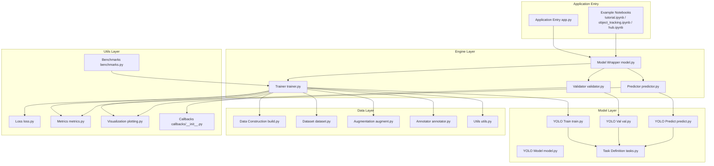
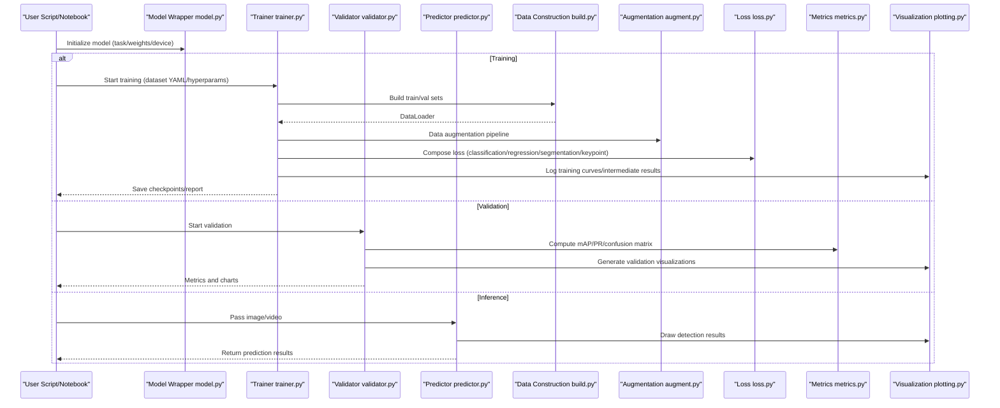
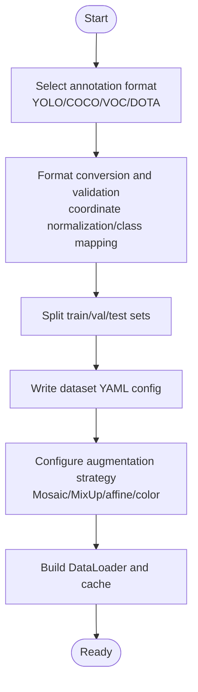
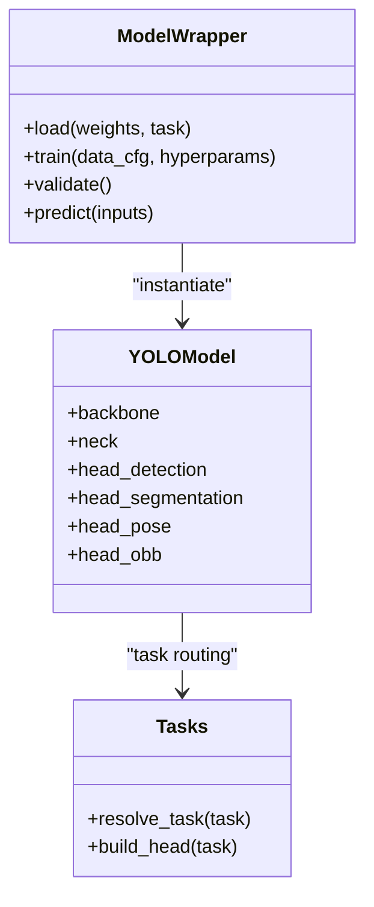
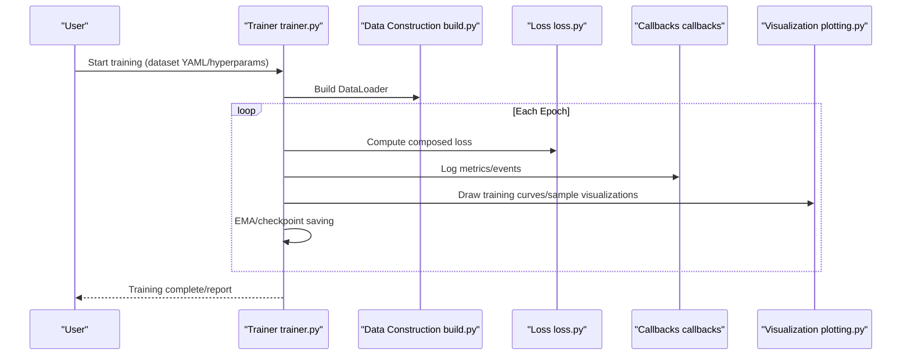
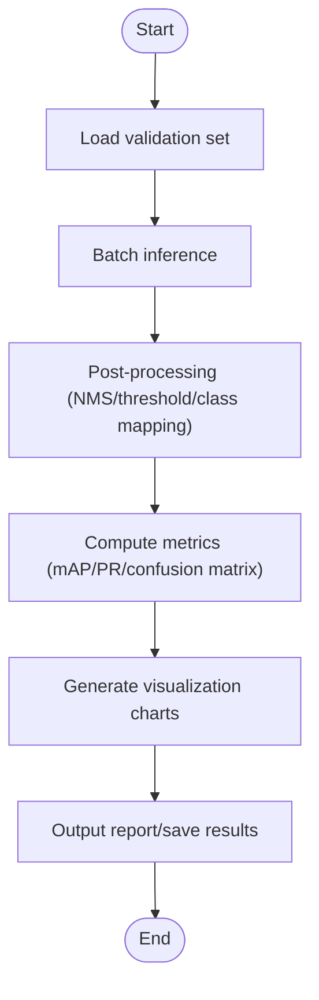
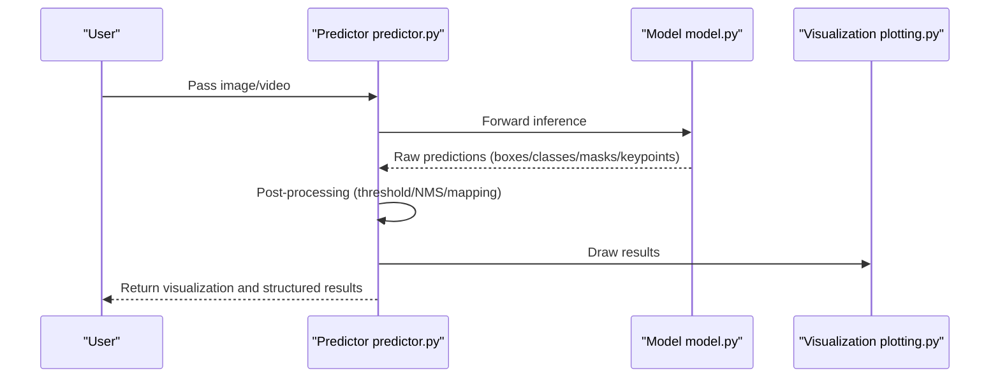
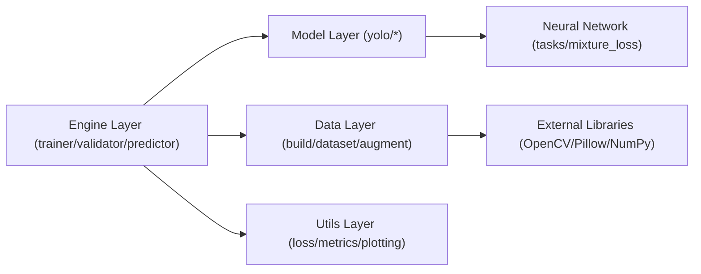

# Basic Tutorials

<cite>
**Files referenced in this document**
- [README.md](file://README.md)
- [app.py](file://app.py)
- [ultralytics/__init__.py](file://ultralytics/__init__.py)
- [ultralytics/engine/trainer.py](file://ultralytics/engine/trainer.py)
- [ultralytics/engine/validator.py](file://ultralytics/engine/validator.py)
- [ultralytics/engine/predictor.py](file://ultralytics/engine/predictor.py)
- [ultralytics/engine/model.py](file://ultralytics/engine/model.py)
- [ultralytics/data/build.py](file://ultralytics/data/build.py)
- [ultralytics/data/dataset.py](file://ultralytics/data/dataset.py)
- [ultralytics/data/augment.py](file://ultralytics/data/augment.py)
- [ultralytics/data/annotator.py](file://ultralytics/data/annotator.py)
- [ultralytics/data/utils.py](file://ultralytics/data/utils.py)
- [ultralytics/models/yolo/model.py](file://ultralytics/models/yolo/model.py)
- [ultralytics/models/yolo/train.py](file://ultralytics/models/yolo/train.py)
- [ultralytics/models/yolo/val.py](file://ultralytics/models/yolo/val.py)
- [ultralytics/models/yolo/predict.py](file://ultralytics/models/yolo/predict.py)
- [ultralytics/nn/tasks.py](file://ultralytics/nn/tasks.py)
- [ultralytics/nn/mixture_loss.py](file://ultralytics/nn/mixture_loss.py)
- [ultralytics/utils/loss.py](file://ultralytics/utils/loss.py)
- [ultralytics/utils/metrics.py](file://ultralytics/utils/metrics.py)
- [ultralytics/utils/plotting.py](file://ultralytics/utils/plotting.py)
- [ultralytics/utils/callbacks/__init__.py](file://ultralytics/utils/callbacks/__init__.py)
- [ultralytics/utils/benchmarks.py](file://ultralytics/utils/benchmarks.py)
- [ultralytics/cfg/default.yaml](file://ultralytics/cfg/default.yaml)
- [examples/tutorial.ipynb](file://examples/tutorial.ipynb)
- [examples/object_tracking.ipynb](file://examples/object_tracking.ipynb)
- [examples/hub.ipynb](file://examples/hub.ipynb)
- [scripts/smoke_test_coco2017.py](file://scripts/smoke_test_coco2017.py)
- [scripts/quick_train_verify.py](file://scripts/quick_train_verify.py)
</cite>

## Table of Contents
1. [Introduction](#introduction)
2. [Project Structure](#project-structure)
3. [Core Components](#core-components)
4. [Architecture Overview](#architecture-overview)
5. [Detailed Component Analysis](#detailed-component-analysis)
6. [Dependency Analysis](#dependency-analysis)
7. [Performance and Training Monitoring](#performance-and-training-monitoring)
8. [Common Issue Troubleshooting](#common-issue-troubleshooting)
9. [Conclusion](#conclusion)
10. [Appendix: Task and Data Format Quick Reference](#appendix-task-and-data-format-quick-reference)

## Introduction
This tutorial is designed for beginners and engineering practitioners, systematically explaining the end-to-end workflow for completing object detection, instance segmentation, pose estimation, oriented object detection, and other tasks in YOLO-Master. Content covers data preparation, model selection, training configuration, result evaluation, visualization and debugging, performance monitoring and training process analysis, as well as hyperparameter tuning strategies and best practices. Readers can quickly get started and build stable, reliable vision task pipelines based on this guide.

## Project Structure
YOLO-Master adopts a layered organization of "engine + models + data + utils":
- Engine Layer: Trainer, validator, and predictor uniformly encapsulate inference and optimization workflows
- Model Layer: Task-specific implementations (detection, segmentation, pose, oriented)
- Data Layer: Dataset loading, augmentation, annotation parsing and conversion
- Utils Layer: Metric computation, visualization, benchmarking, callbacks and logging

Diagram Sources
- [app.py:1-200](file://app.py#L1-L200)
- [ultralytics/engine/trainer.py:1-200](file://ultralytics/engine/trainer.py#L1-L200)
- [ultralytics/engine/validator.py:1-200](file://ultralytics/engine/validator.py#L1-L200)
- [ultralytics/engine/predictor.py:1-200](file://ultralytics/engine/predictor.py#L1-L200)
- [ultralytics/engine/model.py:1-200](file://ultralytics/engine/model.py#L1-L200)
- [ultralytics/models/yolo/model.py:1-200](file://ultralytics/models/yolo/model.py#L1-L200)
- [ultralytics/models/yolo/train.py:1-200](file://ultralytics/models/yolo/train.py#L1-L200)
- [ultralytics/models/yolo/val.py:1-200](file://ultralytics/models/yolo/val.py#L1-L200)
- [ultralytics/models/yolo/predict.py:1-200](file://ultralytics/models/yolo/predict.py#L1-L200)
- [ultralytics/nn/tasks.py:1-200](file://ultralytics/nn/tasks.py#L1-L200)
- [ultralytics/data/build.py:1-200](file://ultralytics/data/build.py#L1-L200)
- [ultralytics/data/dataset.py:1-200](file://ultralytics/data/dataset.py#L1-L200)
- [ultralytics/data/augment.py:1-200](file://ultralytics/data/augment.py#L1-L200)
- [ultralytics/data/annotator.py:1-200](file://ultralytics/data/annotator.py#L1-L200)
- [ultralytics/data/utils.py:1-200](file://ultralytics/data/utils.py#L1-L200)
- [ultralytics/utils/loss.py:1-200](file://ultralytics/utils/loss.py#L1-L200)
- [ultralytics/utils/metrics.py:1-200](file://ultralytics/utils/metrics.py#L1-L200)
- [ultralytics/utils/plotting.py:1-200](file://ultralytics/utils/plotting.py#L1-L200)
- [ultralytics/utils/callbacks/__init__.py:1-200](file://ultralytics/utils/callbacks/__init__.py#L1-L200)
- [ultralytics/utils/benchmarks.py:1-200](file://ultralytics/utils/benchmarks.py#L1-L200)

Section Sources
- [README.md:1-200](file://README.md#L1-L200)
- [app.py:1-200](file://app.py#L1-L200)
- [ultralytics/__init__.py:1-200](file://ultralytics/__init__.py#L1-L200)

## Core Components
- Model Wrapper and Task Routing
  - Automatically identifies task type (detection, segmentation, pose, oriented) via high-level API and loads corresponding model and head structure
  - Supports multi-backend and export capabilities for deployment
- Trainer and Validator
  - Trainer handles data construction, optimizer and learning rate scheduling, loss composition, EMA, checkpoints and callbacks
  - Validator handles metric statistics, confusion matrix, PR curves and visualization output
- Predictor
  - Unified inference interface supporting images, video, batch input and post-processing (NMS, confidence threshold, class mapping)
- Data Pipeline
  - Supports multiple annotation formats and dataset YAML configurations; built-in common augmentations (Mosaic, MixUp, random affine, color jitter, etc.)
- Metrics and Visualization
  - Provides mAP, precision, recall, F1, keypoint alignment error metrics; supports result plots, heatmaps and training curve export

Section Sources
- [ultralytics/engine/model.py:1-200](file://ultralytics/engine/model.py#L1-L200)
- [ultralytics/engine/trainer.py:1-200](file://ultralytics/engine/trainer.py#L1-L200)
- [ultralytics/engine/validator.py:1-200](file://ultralytics/engine/validator.py#L1-L200)
- [ultralytics/engine/predictor.py:1-200](file://ultralytics/engine/predictor.py#L1-L200)
- [ultralytics/data/build.py:1-200](file://ultralytics/data/build.py#L1-L200)
- [ultralytics/data/dataset.py:1-200](file://ultralytics/data/dataset.py#L1-L200)
- [ultralytics/data/augment.py:1-200](file://ultralytics/data/augment.py#L1-L200)
- [ultralytics/utils/metrics.py:1-200](file://ultralytics/utils/metrics.py#L1-L200)
- [ultralytics/utils/plotting.py:1-200](file://ultralytics/utils/plotting.py#L1-L200)

## Architecture Overview
The following diagram shows the complete call chain and module interactions from user invocation to training/validation/inference.

Diagram Sources
- [ultralytics/engine/model.py:1-200](file://ultralytics/engine/model.py#L1-L200)
- [ultralytics/engine/trainer.py:1-200](file://ultralytics/engine/trainer.py#L1-L200)
- [ultralytics/engine/validator.py:1-200](file://ultralytics/engine/validator.py#L1-L200)
- [ultralytics/engine/predictor.py:1-200](file://ultralytics/engine/predictor.py#L1-L200)
- [ultralytics/data/build.py:1-200](file://ultralytics/data/build.py#L1-L200)
- [ultralytics/data/augment.py:1-200](file://ultralytics/data/augment.py#L1-L200)
- [ultralytics/utils/loss.py:1-200](file://ultralytics/utils/loss.py#L1-L200)
- [ultralytics/utils/metrics.py:1-200](file://ultralytics/utils/metrics.py#L1-L200)
- [ultralytics/utils/plotting.py:1-200](file://ultralytics/utils/plotting.py#L1-L200)

## Detailed Component Analysis

### Data Preparation and Annotation Formats
- Supported Annotation Formats
  - YOLO text format (per line: class x_center y_center width height)
  - COCO JSON (containing images, annotations, categories)
  - VOC XML (with bounding box or segmentation)
  - DOTA/ICDAR and other oriented object formats (with angle or polygon)
- Dataset YAML Configuration
  - Specify paths, number of classes, class name list, train/val/test splits
  - Optional: augmentation parameters, caching, multi-scale, mixed precision switches
- Data Loading and Augmentation
  - Construction phase handles annotation parsing, coordinate normalization, sampling strategies
  - Augmentation pipeline includes geometric transforms, color space changes, mosaic, MixUp, random crop/scale/flip, etc.
- Annotation Tool Recommendations
  - Label Studio, CVAT, Roboflow, LabelImg, Doccano, etc.
  - After exporting to YOLO/COCO/VOC, use data conversion scripts for format alignment

Section Sources
- [ultralytics/data/build.py:1-200](file://ultralytics/data/build.py#L1-L200)
- [ultralytics/data/dataset.py:1-200](file://ultralytics/data/dataset.py#L1-L200)
- [ultralytics/data/augment.py:1-200](file://ultralytics/data/augment.py#L1-L200)
- [ultralytics/data/annotator.py:1-200](file://ultralytics/data/annotator.py#L1-L200)
- [ultralytics/data/utils.py:1-200](file://ultralytics/data/utils.py#L1-L200)

### Model Selection and Task Adaptation
- Tasks and Model Heads
  - Detection: Bounding box regression + classification head
  - Instance Segmentation: Mask branch + bounding box/classification
  - Pose Estimation: Keypoint regression + visibility
  - Oriented Object Detection: Angle encoding + bounding box regression
- Model Registration and Loading
  - Automatically selects network structure and head based on task and weights
  - Supports pretrained weights and transfer learning
- Mixed Loss and Multi-task
  - For multi-task scenarios, losses can be weighted and combined by task
  - Supports custom loss weights and regularization terms

Diagram Sources
- [ultralytics/engine/model.py:1-200](file://ultralytics/engine/model.py#L1-L200)
- [ultralytics/models/yolo/model.py:1-200](file://ultralytics/models/yolo/model.py#L1-L200)
- [ultralytics/nn/tasks.py:1-200](file://ultralytics/nn/tasks.py#L1-L200)

Section Sources
- [ultralytics/models/yolo/model.py:1-200](file://ultralytics/models/yolo/model.py#L1-L200)
- [ultralytics/nn/tasks.py:1-200](file://ultralytics/nn/tasks.py#L1-L200)
- [ultralytics/nn/mixture_loss.py:1-200](file://ultralytics/nn/mixture_loss.py#L1-L200)

### Training Workflow and Configuration
- Trainer Responsibilities
  - Read YAML config, build data pipeline
  - Initialize optimizer, learning rate scheduling, mixed precision, distributed training
  - Execute forward/backward propagation, EMA updates, checkpoint saving
  - Trigger callbacks (logging, visualization, early stopping, resume training)
- Loss Function Configuration
  - Classification loss, bounding box regression loss, segmentation mask loss, keypoint loss
  - Weights and hyperparameters adjustable via config files
- Training Monitoring
  - Log loss, metrics, learning rate, VRAM usage, throughput
  - Export training curves and intermediate visualizations

Diagram Sources
- [ultralytics/engine/trainer.py:1-200](file://ultralytics/engine/trainer.py#L1-L200)
- [ultralytics/data/build.py:1-200](file://ultralytics/data/build.py#L1-L200)
- [ultralytics/utils/loss.py:1-200](file://ultralytics/utils/loss.py#L1-L200)
- [ultralytics/utils/callbacks/__init__.py:1-200](file://ultralytics/utils/callbacks/__init__.py#L1-L200)
- [ultralytics/utils/plotting.py:1-200](file://ultralytics/utils/plotting.py#L1-L200)

Section Sources
- [ultralytics/engine/trainer.py:1-200](file://ultralytics/engine/trainer.py#L1-L200)
- [ultralytics/models/yolo/train.py:1-200](file://ultralytics/models/yolo/train.py#L1-L200)
- [ultralytics/utils/loss.py:1-200](file://ultralytics/utils/loss.py#L1-L200)
- [ultralytics/utils/callbacks/__init__.py:1-200](file://ultralytics/utils/callbacks/__init__.py#L1-L200)

### Validation and Evaluation
- Validator Responsibilities
  - Iterate validation set, compute mAP, PR curves, confusion matrix, IoU distribution
  - Output task-specific metrics (e.g., keypoint average precision, mask IoU)
- Result Visualization
  - Generate validation set prediction plots, error samples, class distribution
- Benchmarking
  - Throughput, latency, VRAM usage, quantization/export before/after comparison

Diagram Sources
- [ultralytics/engine/validator.py:1-200](file://ultralytics/engine/validator.py#L1-L200)
- [ultralytics/models/yolo/val.py:1-200](file://ultralytics/models/yolo/val.py#L1-L200)
- [ultralytics/utils/metrics.py:1-200](file://ultralytics/utils/metrics.py#L1-L200)
- [ultralytics/utils/plotting.py:1-200](file://ultralytics/utils/plotting.py#L1-L200)
- [ultralytics/utils/benchmarks.py:1-200](file://ultralytics/utils/benchmarks.py#L1-L200)

Section Sources
- [ultralytics/engine/validator.py:1-200](file://ultralytics/engine/validator.py#L1-L200)
- [ultralytics/models/yolo/val.py:1-200](file://ultralytics/models/yolo/val.py#L1-L200)
- [ultralytics/utils/metrics.py:1-200](file://ultralytics/utils/metrics.py#L1-L200)
- [ultralytics/utils/benchmarks.py:1-200](file://ultralytics/utils/benchmarks.py#L1-L200)

### Inference and Visualization
- Predictor Responsibilities
  - Accept image/video/batch input, execute forward inference
  - Post-processing: confidence filtering, NMS, class mapping, keypoint/mask rendering
- Visualization
  - Draw bounding boxes, masks, keypoints, trajectories (tracking)
  - Export images/video/JSON results

Diagram Sources
- [ultralytics/engine/predictor.py:1-200](file://ultralytics/engine/predictor.py#L1-L200)
- [ultralytics/models/yolo/predict.py:1-200](file://ultralytics/models/yolo/predict.py#L1-L200)
- [ultralytics/utils/plotting.py:1-200](file://ultralytics/utils/plotting.py#L1-L200)

Section Sources
- [ultralytics/engine/predictor.py:1-200](file://ultralytics/engine/predictor.py#L1-L200)
- [ultralytics/models/yolo/predict.py:1-200](file://ultralytics/models/yolo/predict.py#L1-L200)
- [ultralytics/utils/plotting.py:1-200](file://ultralytics/utils/plotting.py#L1-L200)

### Hyperparameter Tuning and Best Practices
- Basic Strategies
  - First fix data and model scale, then gradually adjust learning rate, batch size, augmentation intensity
  - Use validation set metrics as primary criteria to avoid overfitting
- Recommended Ranges
  - Learning rate: Scale linearly with batch size; Warmup helps stabilize early training
  - Augmentation: Prioritize Mosaic/MixUp for small data; moderately increase geometric and color perturbations for large data
  - Regularization: Weight decay, Dropout, label smoothing
- Automated Search
  - Grid/random/Bayesian search; combined with early stopping and resource limits
- Rules of Thumb
  - Dense small object scenarios: Increase resolution, lower NMS threshold, add small object augmentation
  - Heavy occlusion: Introduce MixUp/Mosaic, adjust classification/regression loss weights
  - Pose/segmentation: Focus on keypoint visibility and mask IoU thresholds

Section Sources
- [ultralytics/cfg/default.yaml:1-200](file://ultralytics/cfg/default.yaml#L1-L200)
- [ultralytics/utils/tuner.py:1-200](file://ultralytics/utils/tuner.py#L1-L200)

## Dependency Analysis
- Module Coupling
  - Model wrapper decouples from trainer/validator/predictor for independent extension
  - Data layer and task layer connect through unified interfaces, reducing code duplication
- External Dependencies
  - PyTorch, NumPy, OpenCV, Pillow, Matplotlib, TensorBoard/Weights & Biases (optional)
- Potential Circular Dependencies
  - Resolved through task routing and factory patterns, avoiding direct mutual references

Diagram Sources
- [ultralytics/engine/trainer.py:1-200](file://ultralytics/engine/trainer.py#L1-L200)
- [ultralytics/engine/validator.py:1-200](file://ultralytics/engine/validator.py#L1-L200)
- [ultralytics/engine/predictor.py:1-200](file://ultralytics/engine/predictor.py#L1-L200)
- [ultralytics/models/yolo/train.py:1-200](file://ultralytics/models/yolo/train.py#L1-L200)
- [ultralytics/models/yolo/val.py:1-200](file://ultralytics/models/yolo/val.py#L1-L200)
- [ultralytics/models/yolo/predict.py:1-200](file://ultralytics/models/yolo/predict.py#L1-L200)
- [ultralytics/nn/tasks.py:1-200](file://ultralytics/nn/tasks.py#L1-L200)
- [ultralytics/nn/mixture_loss.py:1-200](file://ultralytics/nn/mixture_loss.py#L1-L200)
- [ultralytics/data/build.py:1-200](file://ultralytics/data/build.py#L1-L200)
- [ultralytics/data/dataset.py:1-200](file://ultralytics/data/dataset.py#L1-L200)
- [ultralytics/data/augment.py:1-200](file://ultralytics/data/augment.py#L1-L200)

## Performance and Training Monitoring
- Training Process Monitoring
  - Log loss, metrics, learning rate, VRAM, throughput; supports TensorBoard/W&B integration
  - Use callback mechanisms to insert custom monitoring logic (e.g., gradient norms, activation distributions)
- Inference Performance
  - Benchmark throughput and latency; compare different backends (ONNX/TensorRT/OpenVINO)
- Diagnostics and Visualization
  - Training curves, confusion matrix, PR curves, error sample visualization
  - Keyframe/keypoint visualization and export

Section Sources
- [ultralytics/utils/callbacks/__init__.py:1-200](file://ultralytics/utils/callbacks/__init__.py#L1-L200)
- [ultralytics/utils/plotting.py:1-200](file://ultralytics/utils/plotting.py#L1-L200)
- [ultralytics/utils/benchmarks.py:1-200](file://ultralytics/utils/benchmarks.py#L1-L200)

## Common Issue Troubleshooting
- Data Issues
  - Missing/out-of-bounds annotations: Check coordinate normalization and class mapping; use data validation scripts
  - Class imbalance: Adjust loss weights or sampling strategies
- Training Instability
  - Learning rate too high causing divergence: Lower initial learning rate, enable Warmup
  - NaN/Inf: Check numerical stability, gradient clipping, mixed precision settings
- Inference Anomalies
  - Missed/false detections: Adjust confidence threshold, NMS IoU, augmentation intensity
  - Out of memory: Reduce batch size, resolution, or use half precision

Section Sources
- [ultralytics/data/utils.py:1-200](file://ultralytics/data/utils.py#L1-L200)
- [ultralytics/utils/loss.py:1-200](file://ultralytics/utils/loss.py#L1-L200)
- [ultralytics/utils/metrics.py:1-200](file://ultralytics/utils/metrics.py#L1-L200)

## Conclusion
Through this tutorial, readers can master the standardized workflow for completing object detection, instance segmentation, pose estimation, and oriented object detection in YOLO-Master. From data preparation, model selection, training configuration to result evaluation and visualization, and then to performance monitoring and hyperparameter tuning, clear steps and practical recommendations are provided. It is recommended to quickly reproduce using example Notebooks and scripts, and iteratively optimize in real business scenarios.

## Appendix: Task and Data Format Quick Reference
- Object Detection
  - Annotation: YOLO/COCO/VOC
  - Metrics: mAP@0.5, mAP@[0.5:0.95], PR curves
- Instance Segmentation
  - Annotation: COCO polygon/mask
  - Metrics: mAP_mask, IoU distribution
- Pose Estimation
  - Annotation: Keypoints (x,y,v)
  - Metrics: AP_kp, OKS
- Oriented Object Detection
  - Annotation: DOTA/ICDAR (with angle)
  - Metrics: mAP_rot, angle error

Section Sources
- [ultralytics/utils/metrics.py:1-200](file://ultralytics/utils/metrics.py#L1-L200)
- [ultralytics/data/annotator.py:1-200](file://ultralytics/data/annotator.py#L1-L200)
- [ultralytics/data/utils.py:1-200](file://ultralytics/data/utils.py#L1-L200)

## Quick Start Reference
- Getting Started Tutorial Notebook
  - [examples/tutorial.ipynb](file://examples/tutorial.ipynb)
- Object Tracking Example
  - [examples/object_tracking.ipynb](file://examples/object_tracking.ipynb)
- Hub Integration Example
  - [examples/hub.ipynb](file://examples/hub.ipynb)
- Quick Verification Scripts
  - [scripts/smoke_test_coco2017.py](file://scripts/smoke_test_coco2017.py)
  - [scripts/quick_train_verify.py](file://scripts/quick_train_verify.py)

Section Sources
- [examples/tutorial.ipynb:1-200](file://examples/tutorial.ipynb#L1-L200)
- [examples/object_tracking.ipynb:1-200](file://examples/object_tracking.ipynb#L1-L200)
- [examples/hub.ipynb:1-200](file://examples/hub.ipynb#L1-L200)
- [scripts/smoke_test_coco2017.py:1-200](file://scripts/smoke_test_coco2017.py#L1-L200)
- [scripts/quick_train_verify.py:1-200](file://scripts/quick_train_verify.py#L1-L200)
