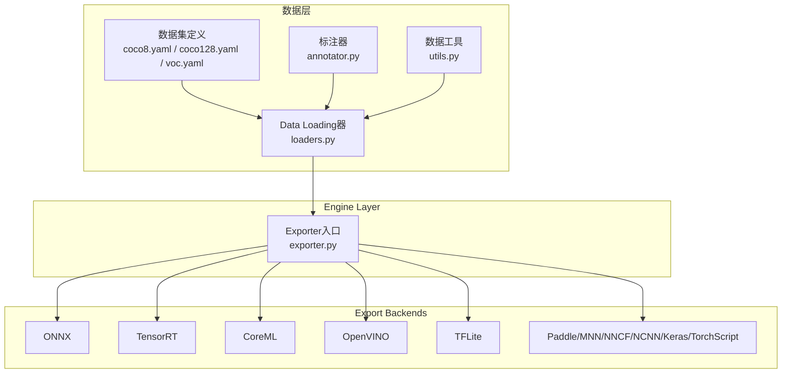
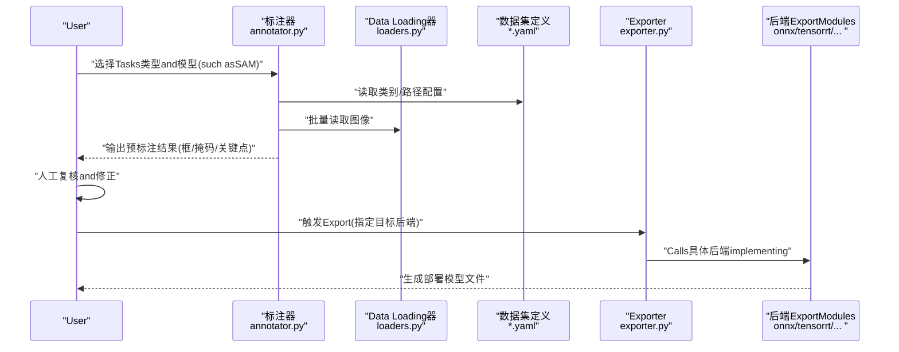
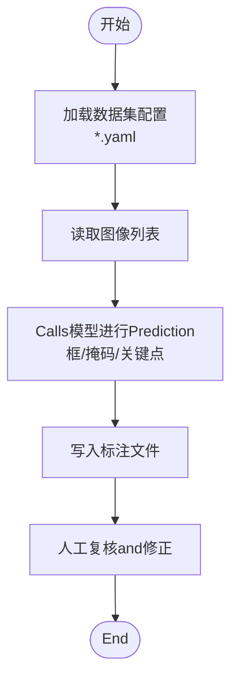
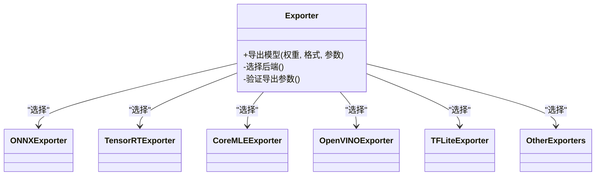
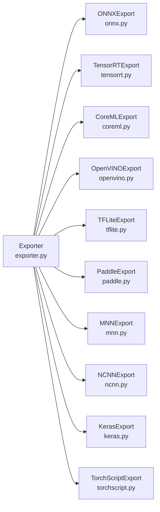

# 数据标注工具and技巧

<cite>
**Files Referenced in This Document**
- [README.md](file://README.md)
- [data/annotator.py](file://ultralytics/data/annotator.py)
- [data/dataset.py](file://ultralytics/data/dataset.py)
- [data/loaders.py](file://ultralytics/data/loaders.py)
- [data/utils.py](file://ultralytics/data/utils.py)
- [data/scripts/coco8.yaml](file://ultralytics/cfg/datasets/coco8.yaml)
- [data/scripts/coco128.yaml](file://ultralytics/cfg/datasets/coco128.yaml)
- [data/scripts/voc.yaml](file://ultralytics/cfg/datasets/voc.yaml)
- [data/scripts/objects365.yaml](file://ultralytics/cfg/datasets/objects365.yaml)
- [data/scripts/openimages.yaml](file://ultralytics/cfg/datasets/openimages.yaml)
- [data/scripts/sam_auto_annotate.md](file://docs/macros/sam_auto_annotate.md)
- [data/scripts/preprocessing_annotated_data.md](file://docs/en/guides/preprocessing_annotated_data.md)
- [data/scripts/yolo-data-augmentation.md](file://docs/en/guides/yolo-data-augmentation.md)
- [data/scripts/export-capability-matrix.yaml](file://ultralytics/cfg/export-capability-matrix.yaml)
- [engine/exporter.py](file://ultralytics/engine/exporter.py)
- [utils/export/__init__.py](file://ultralytics/utils/export/__init__.py)
- [utils/export/onnx.py](file://ultralytics/utils/export/onnx.py)
- [utils/export/tensorrt.py](file://ultralytics/utils/export/tensorrt.py)
- [utils/export/coreml.py](file://ultralytics/utils/export/coreml.py)
- [utils/export/openvino.py](file://ultralytics/utils/export/openvino.py)
- [utils/export/tflite.py](file://ultralytics/utils/export/tflite.py)
- [utils/export/paddle.py](file://ultralytics/utils/export/paddle.py)
- [utils/export/mnn.py](file://ultralytics/utils/export/mnn.py)
- [utils/export/nncf.py](file://ultralytics/utils/export/nncf.py)
- [utils/export/ncnn.py](file://ultralytics/utils/export/ncnn.py)
- [utils/export/keras.py](file://ultralytics/utils/export/keras.py)
- [utils/export/torchscript.py](file://ultralytics/utils/export/torchscript.py)
- [utils/export/trt.py](file://ultralytics/utils/export/trt.py)
- [utils/export/bn.py](file://ultralytics/utils/export/bn.py)
- [utils/export/quantize.py](file://ultralytics/utils/export/quantize.py)
- [utils/export/shape.py](file://ultralytics/utils/export/shape.py)
- [utils/export/validate.py](file://ultralytics/utils/export/validate.py)
</cite>

## Table of Contents
1. [Introduction](#Introduction)
2. [Project Structure](#Project Structure)
3. [Core Components](#Core Components)
4. [Architecture Overview](#Architecture Overview)
5. [Detailed Component Analysis](#Detailed Component Analysis)
6. [Dependency Analysis](#Dependency Analysis)
7. [性能考量](#性能考量)
8. [Troubleshooting Guide](#Troubleshooting Guide)
9. [Conclusion](#Conclusion)
10. [Appendix](#Appendix)

## Introduction
本指南聚焦于“数据标注工具and技巧”，Combining仓库中已有的Data Loading、自动标注andExportcapabilities，provides从标注toTraining再to部署的完整实践路径。内容覆盖：
- 常用标注工具（LabelImg、CVAT、Roboflowetc.）的安装配置andUses要点
- 检测、分割、Pose Estimationand other tasks的标注方法and注意事项
- 批量标注and半自动标注的高级技巧
- 标注质量检查and一致性Validation方法
- 标注数据的Exportand格式转换流程
- 效率提升最佳实践and常见问题解决方案

## Project Structure
本项目围绕YOLO生态的数据andExport管线构建，关键Table of Contentsand职责such as下：
- ultralytics/data：Data Loading、数据集定义、标注器and增强etc.
- ultralytics/engine：模型Training/Validation/Prediction/Exportetc.引擎
- ultralytics/utils/export：多后端Exportimplementing（ONNX、TensorRT、CoreML、OpenVINO、TFLiteetc.）
- docs：Documentationand宏说明，包含自动标注and预处理指南
- cfg/datasets：常见数据集的YAML配置Examples

Figure Source
- [data/dataset.py:1-200](file://ultralytics/data/dataset.py#L1-L200)
- [data/loaders.py:1-200](file://ultralytics/data/loaders.py#L1-L200)
- [data/annotator.py:1-200](file://ultralytics/data/annotator.py#L1-L200)
- [engine/exporter.py:1-200](file://ultralytics/engine/exporter.py#L1-L200)

Section Source
- [README.md:1-200](file://README.md#L1-L200)
- [data/dataset.py:1-200](file://ultralytics/data/dataset.py#L1-L200)
- [data/loaders.py:1-200](file://ultralytics/data/loaders.py#L1-L200)
- [data/annotator.py:1-200](file://ultralytics/data/annotator.py#L1-L200)
- [engine/exporter.py:1-200](file://ultralytics/engine/exporter.py#L1-L200)

## Core Components
- 数据集and加载器
  - ViaYAML配置描述图像and标签路径、类别映射etc.；加载器负责读取图像and标注并生成Training批次。
  - Refer to：[coco8.yaml](file://ultralytics/cfg/datasets/coco8.yaml)、[coco128.yaml](file://ultralytics/cfg/datasets/coco128.yaml)、[voc.yaml](file://ultralytics/cfg/datasets/voc.yaml)、[objects365.yaml](file://ultralytics/cfg/datasets/objects365.yaml)、[openimages.yaml](file://ultralytics/cfg/datasets/openimages.yaml)
- 标注器
  - provides自动或半自动标注capabilities，可CombiningSAMetc.模型进行快速初标，再人工精修。
  - Refer to：[annotator.py](file://ultralytics/data/annotator.py)
- 数据工具
  - provides标注格式校验、统计、Visualization辅助etc.通用功能。
  - Refer to：[utils.py](file://ultralytics/data/utils.py)
- Exporter
  - 统一Export接口，Supporting多种Inference后端，便于将Training好的模型转换for部署格式。
  - Refer to：[exporter.py](file://ultralytics/engine/exporter.py)

Section Source
- [data/dataset.py:1-200](file://ultralytics/data/dataset.py#L1-L200)
- [data/loaders.py:1-200](file://ultralytics/data/loaders.py#L1-L200)
- [data/annotator.py:1-200](file://ultralytics/data/annotator.py#L1-L200)
- [data/utils.py:1-200](file://ultralytics/data/utils.py#L1-L200)
- [engine/exporter.py:1-200](file://ultralytics/engine/exporter.py#L1-L200)

## Architecture Overview
下图展示从“标注数据”to“Export部署”的整体流程，强调标注器andExporter的协作关系。

Figure Source
- [data/annotator.py:1-200](file://ultralytics/data/annotator.py#L1-L200)
- [data/loaders.py:1-200](file://ultralytics/data/loaders.py#L1-L200)
- [engine/exporter.py:1-200](file://ultralytics/engine/exporter.py#L1-L200)

## Detailed Component Analysis

### 标注器组件分析
标注器是半自动标注的核心，通常Combining基础模型（such asSAM）对图像进行快速初标，再由人工修正。其典型流程包括：
- 读取数据集配置and图像列表
- Calls模型进行Prediction（框/掩码/关键点）
- 将Prediction结果写入标准标注格式
- providesVisualizationand批量处理接口

Figure Source
- [data/annotator.py:1-200](file://ultralytics/data/annotator.py#L1-L200)
- [data/dataset.py:1-200](file://ultralytics/data/dataset.py#L1-L200)
- [data/loaders.py:1-200](file://ultralytics/data/loaders.py#L1-L200)

Section Source
- [data/annotator.py:1-200](file://ultralytics/data/annotator.py#L1-L200)
- [data/dataset.py:1-200](file://ultralytics/data/dataset.py#L1-L200)
- [data/loaders.py:1-200](file://ultralytics/data/loaders.py#L1-L200)

### Exporter组件分析
Exporterprovides统一的Export入口，内部根据目标后端选择相应implementing。典型流程：
- 解析Export参数（格式、精度、输入尺寸etc.）
- 加载已Training权重
- Calls具体后端Modules完成转换
- 输出部署所需文件

Figure Source
- [engine/exporter.py:1-200](file://ultralytics/engine/exporter.py#L1-L200)
- [utils/export/onnx.py:1-200](file://ultralytics/utils/export/onnx.py#L1-L200)
- [utils/export/tensorrt.py:1-200](file://ultralytics/utils/export/tensorrt.py#L1-L200)
- [utils/export/coreml.py:1-200](file://ultralytics/utils/export/coreml.py#L1-L200)
- [utils/export/openvino.py:1-200](file://ultralytics/utils/export/openvino.py#L1-L200)
- [utils/export/tflite.py:1-200](file://ultralytics/utils/export/tflite.py#L1-L200)

Section Source
- [engine/exporter.py:1-200](file://ultralytics/engine/exporter.py#L1-L200)
- [utils/export/onnx.py:1-200](file://ultralytics/utils/export/onnx.py#L1-L200)
- [utils/export/tensorrt.py:1-200](file://ultralytics/utils/export/tensorrt.py#L1-L200)
- [utils/export/coreml.py:1-200](file://ultralytics/utils/export/coreml.py#L1-L200)
- [utils/export/openvino.py:1-200](file://ultralytics/utils/export/openvino.py#L1-L200)
- [utils/export/tflite.py:1-200](file://ultralytics/utils/export/tflite.py#L1-L200)

### 标注工具安装andUses要点（外部工具）
- LabelImg
  - Applicable Scenarios：矩形框标注（检测Tasks）
  - Installation Recommendations：Prefer官方包管理器或虚拟环境安装，避免系统级污染
  - Uses技巧：快捷键加速绘制、批量导入图像、ExportCOCO/VOC/YOLO格式
- CVAT
  - Applicable Scenarios：团队协作、视频Tracking、复杂Tasks（分割/关键点/多边形）
  - 部署方式：Docker一键启动，SupportingWeb端协作
  - Uses技巧：模板化类别、插值标注、自动Tracking、Export多格式
- Roboflow
  - Applicable Scenarios：云端标注、版本管理、一键Exporting toYOLO/COCOetc.
  - Uses技巧：创建数据集版本、应用增强策略、直接下载Training集

注意：Centered on上for通用实践建议，具体安装命令and界面操作请Refer to各工具的官方Documentation。

### 不同Tasks的标注方法and注意事项
- 检测（Bounding Box）
  - 标注要点：边界贴合、遮挡处理、小目标不漏标
  - 格式：YOLO txt、COCO json、VOC xml
- Instance Segmentation（Polygon/Mask）
  - 标注要点：轮廓精细度、重叠区域处理、类别一致
  - 格式：COCO segmentation、YOLO segment
- Pose Estimation（Keypoints）
  - 标注要点：关键点语义一致、可见性标记、对称部位区分
  - 格式：COCO keypoints、YOLO pose

### 批量标注and半自动标注高级技巧
- 批量初标
  - Uses标注器批量生成初标结果，减少重复劳动
  - CombiningSAMetc.模型进行快速掩码/框Prediction
- 半自动标注
  - 先粗后精：先生成候选框/掩码，再人工微调
  - 模板复用：将高质量样本作for模板，应用to相似图像
- 自动化脚本
  - 基于Data Loading器遍历图像，Calls标注器批量处理
  - 输出标准化标注文件，便于后续TrainingandEvaluation

Section Source
- [data/annotator.py:1-200](file://ultralytics/data/annotator.py#L1-L200)
- [data/loaders.py:1-200](file://ultralytics/data/loaders.py#L1-L200)
- [data/dataset.py:1-200](file://ultralytics/data/dataset.py#L1-L200)

### 标注质量检查and一致性Validation
- 基本检查
  - 类别完整性：确保所有类别均有标注且命名一致
  - 坐标合法性：边界框不越界、掩码非空、关键点数量正确
- 统计andVisualization
  - 利用数据工具进行分布统计and异常检测
  - 抽样Visualization确认标注质量
- 一致性Validation
  - 多人交叉校验，记录差异并统一规范
  - 建立标注规范Documentation，定期培训and复盘

Section Source
- [data/utils.py:1-200](file://ultralytics/data/utils.py#L1-L200)
- [data/loaders.py:1-200](file://ultralytics/data/loaders.py#L1-L200)

### 标注数据Exportand格式转换流程
- Export目标
  - YOLO txt：适合YOLO系列Training
  - COCO json：通用格式，兼容多种框架
  - VOC xml：传统格式，适用于特定流水线
- 转换步骤
  - 准备原始标注（任意格式）
  - Uses数据工具或脚本转换for目标格式
  - 校验转换结果（类别、坐标、文件结构）
- andExporter联动
  - Training完成后，ViaExporter将模型转换for部署格式（ONNX/TensorRT/CoreML/OpenVINO/TFLiteetc.）

Section Source
- [data/utils.py:1-200](file://ultralytics/data/utils.py#L1-L200)
- [engine/exporter.py:1-200](file://ultralytics/engine/exporter.py#L1-L200)
- [utils/export/onnx.py:1-200](file://ultralytics/utils/export/onnx.py#L1-L200)
- [utils/export/tensorrt.py:1-200](file://ultralytics/utils/export/tensorrt.py#L1-L200)
- [utils/export/coreml.py:1-200](file://ultralytics/utils/export/coreml.py#L1-L200)
- [utils/export/openvino.py:1-200](file://ultralytics/utils/export/openvino.py#L1-L200)
- [utils/export/tflite.py:1-200](file://ultralytics/utils/export/tflite.py#L1-L200)

### 效率提升最佳实践
- 标注前规划
  - 明确Tasks目标and类别体系，制定标注规范
  - 设计合理的图像采集策略，覆盖长尾场景
- 标注过程Optimization
  - Uses半自动标注减少重复劳动
  - 建立模板库and快捷键方案
- 质量控制
  - 引入抽检机制and双人复核
  - Uses统计Metrics监控数据分布变化
- 持续迭代
  - 基于模型反馈定位难例，针对性补充标注
  - 定期更新标注规范and培训材料

### 常见问题解决方案
- 标注不一致
  - 统一类别命名and语义定义，建立对照表
  - Uses模板and规则约束，减少主观差异
- 小目标漏标
  - 放大查看、分层标注、增加正样本比例
- 遮挡and重叠
  - 明确遮挡处理策略，必要时拆分标注
- 格式转换错误
  - 校验源文件格式and字段完整性
  - Uses工具链provides的校验and修复功能

## Dependency Analysis
Exporterand各后端Modules之间的依赖关系such as下：

Figure Source
- [engine/exporter.py:1-200](file://ultralytics/engine/exporter.py#L1-L200)
- [utils/export/onnx.py:1-200](file://ultralytics/utils/export/onnx.py#L1-L200)
- [utils/export/tensorrt.py:1-200](file://ultralytics/utils/export/tensorrt.py#L1-L200)
- [utils/export/coreml.py:1-200](file://ultralytics/utils/export/coreml.py#L1-L200)
- [utils/export/openvino.py:1-200](file://ultralytics/utils/export/openvino.py#L1-L200)
- [utils/export/tflite.py:1-200](file://ultralytics/utils/export/tflite.py#L1-L200)
- [utils/export/paddle.py:1-200](file://ultralytics/utils/export/paddle.py#L1-L200)
- [utils/export/mnn.py:1-200](file://ultralytics/utils/export/mnn.py#L1-L200)
- [utils/export/ncnn.py:1-200](file://ultralytics/utils/export/ncnn.py#L1-L200)
- [utils/export/keras.py:1-200](file://ultralytics/utils/export/keras.py#L1-L200)
- [utils/export/torchscript.py:1-200](file://ultralytics/utils/export/torchscript.py#L1-L200)

Section Source
- [engine/exporter.py:1-200](file://ultralytics/engine/exporter.py#L1-L200)
- [utils/export/onnx.py:1-200](file://ultralytics/utils/export/onnx.py#L1-L200)
- [utils/export/tensorrt.py:1-200](file://ultralytics/utils/export/tensorrt.py#L1-L200)
- [utils/export/coreml.py:1-200](file://ultralytics/utils/export/coreml.py#L1-L200)
- [utils/export/openvino.py:1-200](file://ultralytics/utils/export/openvino.py#L1-L200)
- [utils/export/tflite.py:1-200](file://ultralytics/utils/export/tflite.py#L1-L200)

## 性能考量
- 标注阶段
  - 合理划分图像分辨率andBatch Size，避免内存溢出
  - Uses缓存and并行读取提升I/O吞吐
- Export阶段
  - 选择合适的后端and精度（FP32/INT8），平衡速度and精度
  - 针对目标平台Optimization输入尺寸and算子Supporting

## Troubleshooting Guide
- 标注器报错
  - 检查数据集配置路径and类别映射是否正确
  - 确认模型权重and依赖库版本匹配
- Export Failure
  - 核对目标后端的环境要求（CUDA、drivers are installed、依赖）
  - 检查模型图结构and算子兼容性
- Data Loading异常
  - Validation图像and标签文件存while性and格式一致性
  - Uses数据工具进行统计andVisualization定位问题

Section Source
- [data/annotator.py:1-200](file://ultralytics/data/annotator.py#L1-L200)
- [data/loaders.py:1-200](file://ultralytics/data/loaders.py#L1-L200)
- [engine/exporter.py:1-200](file://ultralytics/engine/exporter.py#L1-L200)

## Conclusion
ViaCombining标注器andExporter，本项目provides了从“标注—Training—Export”的Integrated Capabilities。遵循本指南的最佳实践and排障建议，可显著提升标注效率and数据质量，并顺利将模型部署至多类Inference后端。

## Appendix
- 自动标注and预处理Refer to
  - SAM自动标注宏说明：[sam_auto_annotate.md](file://docs/macros/sam_auto_annotate.md)
  - 标注数据预处理指南：[preprocessing_annotated_data.md](file://docs/en/guides/preprocessing_annotated_data.md)
  - Data Augmentation指南：[yolo-data-augmentation.md](file://docs/en/guides/yolo-data-augmentation.md)
- Exportcapabilities矩阵
  - Exportcapabilities清单：[export-capability-matrix.yaml](file://ultralytics/cfg/export-capability-matrix.yaml)