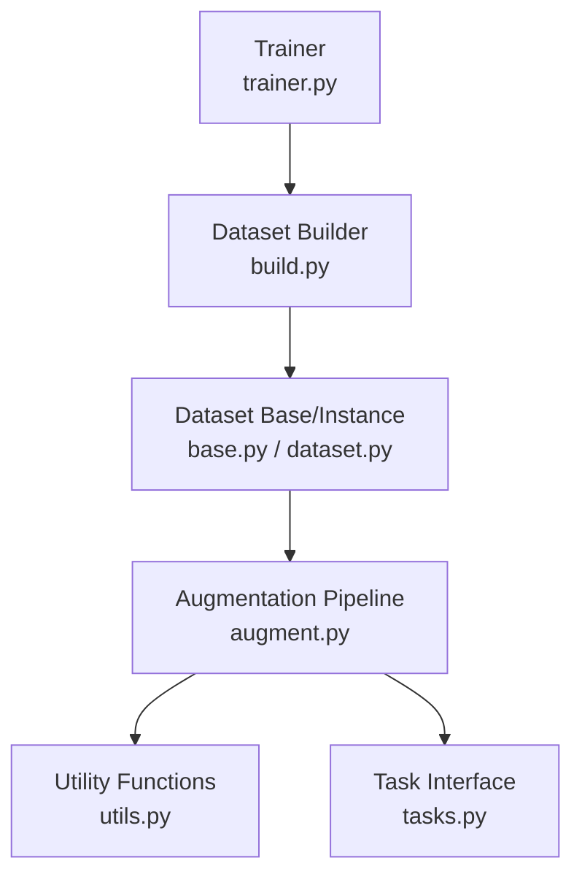
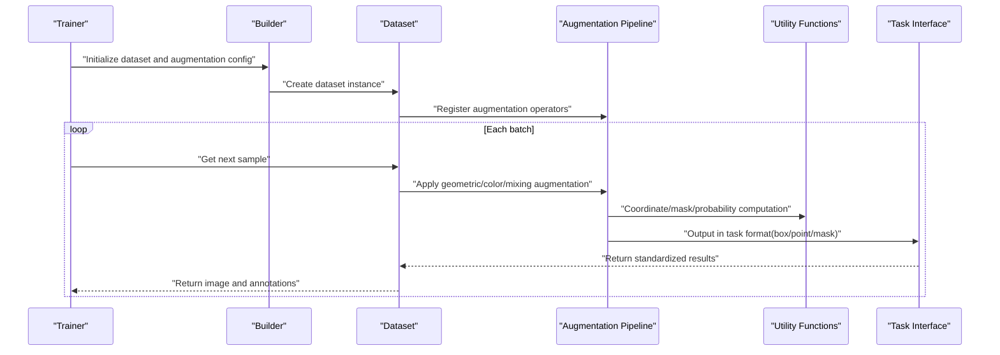
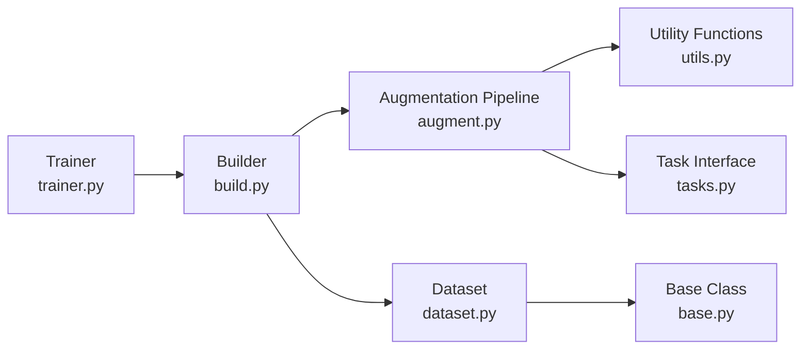

# Data Augmentation Techniques

<cite>
**Files referenced in this document**
- [ultralytics/data/augment.py](file://ultralytics/data/augment.py)
- [ultralytics/data/dataset.py](file://ultralytics/data/dataset.py)
- [ultralytics/data/build.py](file://ultralytics/data/build.py)
- [ultralytics/data/base.py](file://ultralytics/data/base.py)
- [ultralytics/data/utils.py](file://ultralytics/data/utils.py)
- [ultralytics/nn/tasks.py](file://ultralytics/nn/tasks.py)
- [ultralytics/engine/trainer.py](file://ultralytics/engine/trainer.py)
- [docs/en/guides/yolo-data-augmentation.md](file://docs/en/guides/yolo-data-augmentation.md)
- [docs/macros/augmentation-args.md](file://docs/macros/augmentation-args.md)
</cite>

## Table of Contents
1. [Introduction](#introduction)
2. [Project Structure](#project-structure)
3. [Core Components](#core-components)
4. [Architecture Overview](#architecture-overview)
5. [Detailed Component Analysis](#detailed-component-analysis)
6. [Dependency Analysis](#dependency-analysis)
7. [Performance Considerations](#performance-considerations)
8. [Troubleshooting Guide](#troubleshooting-guide)
9. [Conclusion](#conclusion)
10. [Appendix](#appendix)

## Introduction
This technical document focuses on the data augmentation system for the YOLO series, systematically covering geometric transforms (rotation, scaling, cropping, flipping), color augmentation (brightness, contrast, saturation adjustment), and advanced mixing augmentation (MixUp, CutMix) strategies. The document also provides parameter configuration and tuning recommendations, differentiated strategies for detection/segmentation/classification tasks, implementation and integration methods for custom augmentations, visualization and evaluation approaches, and performance optimization and memory management practices for large datasets. The content is summarized from the data loading and augmentation source code and documentation in the repository, aiming to provide actionable guidance for engineering implementation.

## Project Structure
This project concentrates data augmentation capabilities in the data layer. The training workflow assembles datasets and augmentation pipelines through the builder, while the model side only consumes standardized tensors. Key paths are as follows:
- Data augmentation implementation: Located in the augmentation file of the data module, centrally defining various geometric and color augmentation operators and combination strategies.
- Dataset assembly: The builder assembles augmentation pipelines based on task type and configuration, connecting to data loaders.
- Training entry: The trainer invokes the data pipeline during iteration to perform online augmentation of images and annotations.
- Documentation and macros: User guides and macro files describe and summarize augmentation parameters for easy reference and reuse.

**Diagram Sources**
- [ultralytics/engine/trainer.py](file://ultralytics/engine/trainer.py)
- [ultralytics/data/build.py](file://ultralytics/data/build.py)
- [ultralytics/data/base.py](file://ultralytics/data/base.py)
- [ultralytics/data/dataset.py](file://ultralytics/data/dataset.py)
- [ultralytics/data/augment.py](file://ultralytics/data/augment.py)
- [ultralytics/data/utils.py](file://ultralytics/data/utils.py)
- [ultralytics/nn/tasks.py](file://ultralytics/nn/tasks.py)

**Section Sources**
- [ultralytics/data/augment.py](file://ultralytics/data/augment.py)
- [ultralytics/data/dataset.py](file://ultralytics/data/dataset.py)
- [ultralytics/data/build.py](file://ultralytics/data/build.py)
- [ultralytics/data/base.py](file://ultralytics/data/base.py)
- [ultralytics/data/utils.py](file://ultralytics/data/utils.py)
- [ultralytics/nn/tasks.py](file://ultralytics/nn/tasks.py)
- [ultralytics/engine/trainer.py](file://ultralytics/engine/trainer.py)
- [docs/en/guides/yolo-data-augmentation.md](file://docs/en/guides/yolo-data-augmentation.md)
- [docs/macros/augmentation-args.md](file://docs/macros/augmentation-args.md)

## Core Components
- Augmentation Pipeline and Operators
  - Geometric transforms: Include affine transforms (translation, scaling, rotation, shear), random cropping, horizontal/vertical flipping, etc., to improve model robustness to scale, pose, and occlusion.
  - Color augmentation: Channel-level perturbations of brightness, contrast, saturation, hue, etc., to improve generalization under lighting and color variations.
  - Advanced mixing: Sample-level mixing strategies such as MixUp and CutMix to promote feature space smoothing and boundary learning.
- Dataset Assembly
  - The builder selects and chains augmentation operators based on task type (detection, segmentation, classification, etc.) and configuration items, forming an end-to-end online augmentation pipeline.
  - The dataset class is responsible for reading raw images and annotations, applying augmentation during iteration, ensuring consistent updates of images and annotations.
- Task Adaptation
  - Different tasks have different requirements for annotation format and coordinate normalization; after augmentation, bounding boxes, keypoints, or masks must be synchronously updated.
- Utilities and Assistance
  - Provides coordinate transformation, mask processing, probability sampling, random seed management, and other general utilities to ensure reproducibility and stability of the augmentation process.

**Section Sources**
- [ultralytics/data/augment.py](file://ultralytics/data/augment.py)
- [ultralytics/data/dataset.py](file://ultralytics/data/dataset.py)
- [ultralytics/data/build.py](file://ultralytics/data/build.py)
- [ultralytics/data/base.py](file://ultralytics/data/base.py)
- [ultralytics/data/utils.py](file://ultralytics/data/utils.py)
- [ultralytics/nn/tasks.py](file://ultralytics/nn/tasks.py)

## Architecture Overview
The following diagram shows the overall interaction flow from the trainer to the data augmentation pipeline, emphasizing the "configuration-driven" assembly approach and "task-aware" augmentation strategies.

**Diagram Sources**
- [ultralytics/engine/trainer.py](file://ultralytics/engine/trainer.py)
- [ultralytics/data/build.py](file://ultralytics/data/build.py)
- [ultralytics/data/dataset.py](file://ultralytics/data/dataset.py)
- [ultralytics/data/augment.py](file://ultralytics/data/augment.py)
- [ultralytics/data/utils.py](file://ultralytics/data/utils.py)
- [ultralytics/nn/tasks.py](file://ultralytics/nn/tasks.py)

## Detailed Component Analysis

### Geometric Transform Components
- Key features
  - Affine transforms: Unified handling of translation, scaling, rotation, shear while maintaining geometric consistency between images and annotations.
  - Random cropping: Supports cropping by ratio or absolute size, commonly used for multi-scale training and small object augmentation.
  - Flipping: Horizontal/vertical flipping to improve symmetry invariance.
- Parameters and effects
  - Scale range controls small object and background proportion; rotation angle affects pose robustness; crop ratio affects context and localization accuracy.
- Applicable tasks
  - Detection: Prefer moderate scaling and cropping with bounding box reprojection.
  - Segmentation: Pay attention to synchronous mask transformation to avoid edge artifacts.
  - Classification: Can increase rotation and crop magnitude to enhance viewpoint diversity.

**Section Sources**
- [ultralytics/data/augment.py](file://ultralytics/data/augment.py)
- [ultralytics/data/utils.py](file://ultralytics/data/utils.py)
- [docs/en/guides/yolo-data-augmentation.md](file://docs/en/guides/yolo-data-augmentation.md)
- [docs/macros/augmentation-args.md](file://docs/macros/augmentation-args.md)

### Color Augmentation Components
- Key features
  - Brightness, contrast, saturation, hue adjustment to simulate different lighting and imaging conditions.
  - Typically uses random interval sampling to avoid excessive distortion causing label noise.
- Parameters and effects
  - Intensity thresholds determine perturbation magnitude; order and stacking count affect final distribution.
- Applicable tasks
  - Classification: Color augmentation yields significant benefits, especially in cross-domain transfer scenarios.
  - Detection/Segmentation: Intensity must be carefully controlled to avoid destroying object appearance and boundary details.

**Section Sources**
- [ultralytics/data/augment.py](file://ultralytics/data/augment.py)
- [docs/en/guides/yolo-data-augmentation.md](file://docs/en/guides/yolo-data-augmentation.md)
- [docs/macros/augmentation-args.md](file://docs/macros/augmentation-args.md)

### Advanced Mixing Augmentation (MixUp/CutMix)
- Key features
  - MixUp: Linearly interpolates two images and their labels, encouraging the model to learn soft decision boundaries.
  - CutMix: Randomly crops a region and pastes it onto another image, adjusting label weights and positions accordingly.
- Parameters and effects
  - Mixing probability and intensity are key hyperparameters; too high may introduce excessive noise, too low yields limited benefit.
- Applicable tasks
  - Classification: MixUp/CutMix are generally effective and can significantly improve generalization.
  - Detection/Segmentation: Requires careful handling of bounding box/mask fusion rules and validity filtering.

**Section Sources**
- [ultralytics/data/augment.py](file://ultralytics/data/augment.py)
- [docs/en/guides/yolo-data-augmentation.md](file://docs/en/guides/yolo-data-augmentation.md)
- [docs/macros/augmentation-args.md](file://docs/macros/augmentation-args.md)

### Dataset Assembly and Task Adaptation
- Assembly flow
  - The builder selects augmentation strategies based on task type and configuration files, chaining them into a pipeline.
  - Dataset instances execute augmentation during iteration, ensuring synchronous updates of images and annotations.
- Task differences
  - Detection: Focus on bounding box reprojection and validity verification.
  - Segmentation: Focus on pixel-level mask transformation and connectivity maintenance.
  - Classification: Only image augmentation needed, simplified pipeline.
- Reference implementation
  - Dataset base class and specific implementations define data reading, caching, and augmentation invocation interfaces.
  - Task interfaces provide unified input/output specifications for direct model input after augmentation.

**Section Sources**
- [ultralytics/data/build.py](file://ultralytics/data/build.py)
- [ultralytics/data/dataset.py](file://ultralytics/data/dataset.py)
- [ultralytics/data/base.py](file://ultralytics/data/base.py)
- [ultralytics/nn/tasks.py](file://ultralytics/nn/tasks.py)

### Custom Augmentation Algorithm Implementation and Integration
- Design principles
  - Follow unified input/output contracts: input is image and annotations, output is augmented image and annotations.
  - Maintain configurability and composability: control intensity and probability through parameters, support chaining with other operators.
- Integration steps
  - Register custom operators in the augmentation pipeline, ensuring they are called at the correct stage (e.g., geometric → color → mixing).
  - Verify annotation consistency: bounding boxes, keypoints, masks must be synchronously transformed with images.
  - Unit test coverage: test edge cases (empty annotations, extremely small targets, all-black images).
- Best practices
  - Use deterministic random seeds to ensure reproducibility.
  - Batch or vectorize time-consuming operators for optimization.
  - Provide visualization callbacks for quick anomaly diagnosis.

**Section Sources**
- [ultralytics/data/augment.py](file://ultralytics/data/augment.py)
- [ultralytics/data/utils.py](file://ultralytics/data/utils.py)
- [ultralytics/data/dataset.py](file://ultralytics/data/dataset.py)

### Augmentation Effect Visualization and Evaluation
- Visualization methods
  - Sample replay: Save images and annotations before and after augmentation for several batches, manually check reasonableness.
  - Statistical distribution: Plot trends of key metrics (e.g., box area distribution, color histograms).
- Evaluation methods
  - Offline metrics: Compare mAP, mIoU, Top-1 accuracy, etc., on the validation set with specific augmentation enabled/disabled.
  - Ablation experiments: Incrementally add/remove augmentation strategies, observe performance fluctuations and convergence speed changes.
- Tool recommendations
  - Combine logging and callbacks to record augmentation parameters and results for traceability and analysis.

**Section Sources**
- [docs/en/guides/yolo-data-augmentation.md](file://docs/en/guides/yolo-data-augmentation.md)
- [ultralytics/data/augment.py](file://ultralytics/data/augment.py)

## Dependency Analysis
The dependency relationships between the augmentation module and data assembly, task interfaces are as follows:

**Diagram Sources**
- [ultralytics/data/augment.py](file://ultralytics/data/augment.py)
- [ultralytics/data/utils.py](file://ultralytics/data/utils.py)
- [ultralytics/nn/tasks.py](file://ultralytics/nn/tasks.py)
- [ultralytics/data/build.py](file://ultralytics/data/build.py)
- [ultralytics/data/dataset.py](file://ultralytics/data/dataset.py)
- [ultralytics/data/base.py](file://ultralytics/data/base.py)
- [ultralytics/engine/trainer.py](file://ultralytics/engine/trainer.py)

**Section Sources**
- [ultralytics/data/augment.py](file://ultralytics/data/augment.py)
- [ultralytics/data/build.py](file://ultralytics/data/build.py)
- [ultralytics/data/dataset.py](file://ultralytics/data/dataset.py)
- [ultralytics/data/base.py](file://ultralytics/data/base.py)
- [ultralytics/data/utils.py](file://ultralytics/data/utils.py)
- [ultralytics/nn/tasks.py](file://ultralytics/nn/tasks.py)
- [ultralytics/engine/trainer.py](file://ultralytics/engine/trainer.py)

## Performance Considerations
- Parallelism and I/O
  - Set data loading thread count and buffer size appropriately to avoid CPU becoming a bottleneck.
  - Use prefetching and caching mechanisms to reduce disk IO jitter.
- Computation optimization
  - Vectorize common augmentations to reduce Python loop overhead.
  - Execute GPU-friendly augmentations on device when possible to reduce host-device transfer costs.
- Memory management
  - Control batch size and image resolution to prevent VRAM overflow.
  - Release intermediate tensors promptly to avoid accumulation references causing leaks.
- Reproducibility
  - Fix random seeds to ensure augmentation strategies are consistent across different runs.

[This section provides general performance recommendations and does not directly analyze specific files]

## Troubleshooting Guide
- Common issues
  - Annotation inconsistency: Bounding boxes out of bounds or mask misalignment after augmentation; check coordinate transformation and validity filtering logic.
  - Performance degradation: Overly strong augmentation introduces noise; gradually reduce intensity or adjust probability.
  - Insufficient memory: Increasing batch or resolution causes OOM; reduce scale or enable gradient checkpointing.
- Debugging tips
  - Enable visualization callbacks to check augmentation results batch by batch.
  - Print key intermediate variables (e.g., transformation matrices, probability sampling values) to locate anomalous branches.
  - Use minimal reproducible examples to isolate issues, gradually adding augmentation operators for verification.

**Section Sources**
- [ultralytics/data/augment.py](file://ultralytics/data/augment.py)
- [ultralytics/data/utils.py](file://ultralytics/data/utils.py)
- [docs/en/guides/yolo-data-augmentation.md](file://docs/en/guides/yolo-data-augmentation.md)

## Conclusion
The data augmentation system in this repository is centered on modularity and task adaptation, assembling augmentation pipelines through the builder to achieve efficient and stable online augmentation during training. For different tasks and dataset characteristics, selecting appropriate geometric and color augmentation strategies combined with advanced mixing methods like MixUp/CutMix can significantly improve model generalization. In engineering practice, attention should be paid to parameter tuning, visualization evaluation, and performance optimization to ensure that augmentation benefits are stable and reproducible.

[This section is summary content and does not directly analyze specific files]

## Appendix
- Parameter quick reference
  - Geometric transforms: scale range, rotation angle, translation ratio, crop ratio, flip probability.
  - Color augmentation: brightness, contrast, saturation, hue adjustment intensity and probability.
  - Mixing augmentation: MixUp/CutMix mixing probability and intensity coefficients.
- Task recommendations
  - Detection: Moderate scaling + cropping + flipping, cautious color augmentation; introduce small object augmentation when necessary.
  - Segmentation: Strictly synchronize mask transformation to avoid edge artifacts; moderate geometric perturbation.
  - Classification: Stronger color and geometric perturbation, combined with MixUp/CutMix to improve robustness.
- Reference documentation
  - User guides and macro files provide detailed descriptions and examples of augmentation parameters for quick start and tuning.

**Section Sources**
- [docs/en/guides/yolo-data-augmentation.md](file://docs/en/guides/yolo-data-augmentation.md)
- [docs/macros/augmentation-args.md](file://docs/macros/augmentation-args.md)
