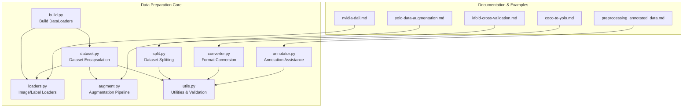
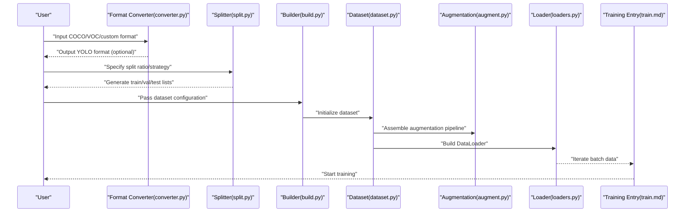
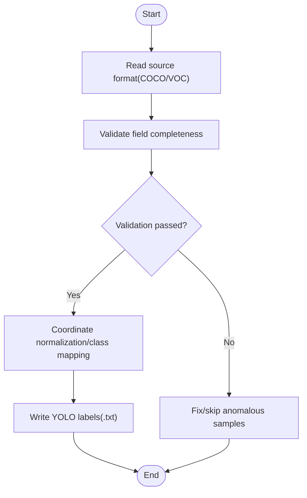
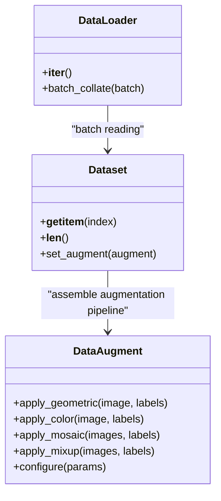
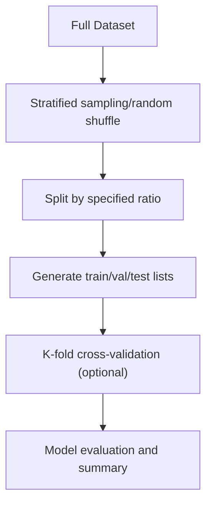
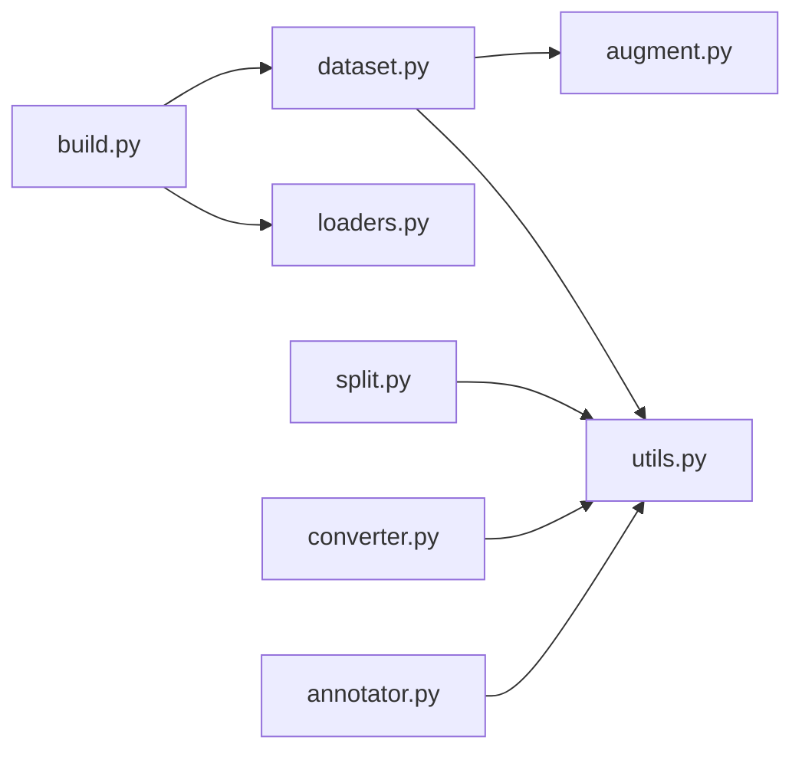

# Data Preparation Guide

<cite>
**Files referenced in this document**
- [ultralytics/data/dataset.py](file://ultralytics/data/dataset.py)
- [ultralytics/data/build.py](file://ultralytics/data/build.py)
- [ultralytics/data/augment.py](file://ultralytics/data/augment.py)
- [ultralytics/data/split.py](file://ultralytics/data/split.py)
- [ultralytics/data/utils.py](file://ultralytics/data/utils.py)
- [ultralytics/data/annotator.py](file://ultralytics/data/annotator.py)
- [ultralytics/data/loaders.py](file://ultralytics/data/loaders.py)
- [ultralytics/data/converter.py](file://ultralytics/data/converter.py)
- [scripts/convert_voc.py](file://scripts/convert_voc.py)
- [docs/en/guides/coco-to-yolo.md](file://docs/en/guides/coco-to-yolo.md)
- [docs/en/guides/yolo-data-augmentation.md](file://docs/en/guides/yolo-data-augmentation.md)
- [docs/en/guides/kfold-cross-validation.md](file://docs/en/guides/kfold-cross-validation.md)
- [docs/en/guides/preprocessing_annotated_data.md](file://docs/en/guides/preprocessing_annotated_data.md)
- [docs/en/guides/data-collection-and-annotation.md](file://docs/en/guides/data-collection-and-annotation.md)
- [docs/en/guides/nvidia-dali.md](file://docs/en/guides/nvidia-dali.md)
- [docs/en/modes/train.md](file://docs/en/modes/train.md)
- [docs/en/reference/data/index.md](file://docs/en/reference/data/index.md)
- [docs/en/reference/data/dataset.md](file://docs/en/reference/data/dataset.md)
- [docs/en/reference/data/augment.md](file://docs/en/reference/data/augment.md)
- [docs/en/reference/data/split.md](file://docs/en/reference/data/split.md)
- [docs/en/reference/data/utils.md](file://docs/en/reference/data/utils.md)
- [docs/en/reference/data/loaders.md](file://docs/en/reference/data/loaders.md)
- [docs/en/reference/data/converter.md](file://docs/en/reference/data/converter.md)
- [docs/en/reference/data/base.md](file://docs/en/reference/data/base.md)
- [docs/en/reference/data/build.md](file://docs/en/reference/data/build.md)
</cite>

## Table of Contents
1. [Introduction](#introduction)
2. [Project Structure](#project-structure)
3. [Core Components](#core-components)
4. [Architecture Overview](#architecture-overview)
5. [Detailed Component Analysis](#detailed-component-analysis)
6. [Dependency Analysis](#dependency-analysis)
7. [Performance Considerations](#performance-considerations)
8. [Troubleshooting Guide](#troubleshooting-guide)
9. [Conclusion](#conclusion)
10. [Appendix](#appendix)

## Introduction
This guide covers the complete data preparation workflow for YOLO-Master, addressing the following topics:
- Dataset format specifications and conversion (COCO, VOC, YOLO)
- Annotation tool usage tips and best practices
- Automated script approaches for data cleaning, deduplication, and format validation
- Data augmentation techniques and configuration (geometric transforms, color augmentation, MixUp, etc.)
- Data splitting strategies (train/val/test) and cross-validation
- Large dataset handling and optimization (caching, parallel loading, memory management)
- Data quality assessment and anomaly detection

## Project Structure
YOLO-Master's data preparation code is concentrated in the ultralytics/data module, with supporting documentation under docs/en. Key paths are as follows:
- Data building and loading: ultralytics/data/build.py, ultralytics/data/loaders.py
- Dataset encapsulation and access: ultralytics/data/dataset.py
- Data augmentation pipeline: ultralytics/data/augment.py
- Dataset splitting: ultralytics/data/split.py
- General utilities and validation: ultralytics/data/utils.py
- Annotation assistance and visualization: ultralytics/data/annotator.py
- Format conversion: ultralytics/data/converter.py and scripts/convert_voc.py
- Official documentation: docs/en/guides/* and docs/en/reference/data/*

**Diagram Sources**
- [ultralytics/data/build.py](file://ultralytics/data/build.py)
- [ultralytics/data/dataset.py](file://ultralytics/data/dataset.py)
- [ultralytics/data/augment.py](file://ultralytics/data/augment.py)
- [ultralytics/data/split.py](file://ultralytics/data/split.py)
- [ultralytics/data/utils.py](file://ultralytics/data/utils.py)
- [ultralytics/data/annotator.py](file://ultralytics/data/annotator.py)
- [ultralytics/data/converter.py](file://ultralytics/data/converter.py)
- [docs/en/guides/yolo-data-augmentation.md](file://docs/en/guides/yolo-data-augmentation.md)
- [docs/en/guides/kfold-cross-validation.md](file://docs/en/guides/kfold-cross-validation.md)
- [docs/en/guides/coco-to-yolo.md](file://docs/en/guides/coco-to-yolo.md)
- [docs/en/guides/preprocessing_annotated_data.md](file://docs/en/guides/preprocessing_annotated_data.md)
- [docs/en/guides/nvidia-dali.md](file://docs/en/guides/nvidia-dali.md)

**Section Sources**
- [ultralytics/data/build.py](file://ultralytics/data/build.py)
- [ultralytics/data/dataset.py](file://ultralytics/data/dataset.py)
- [ultralytics/data/augment.py](file://ultralytics/data/augment.py)
- [ultralytics/data/split.py](file://ultralytics/data/split.py)
- [ultralytics/data/utils.py](file://ultralytics/data/utils.py)
- [ultralytics/data/annotator.py](file://ultralytics/data/annotator.py)
- [ultralytics/data/converter.py](file://ultralytics/data/converter.py)
- [docs/en/guides/yolo-data-augmentation.md](file://docs/en/guides/yolo-data-augmentation.md)
- [docs/en/guides/kfold-cross-validation.md](file://docs/en/guides/kfold-cross-validation.md)
- [docs/en/guides/coco-to-yolo.md](file://docs/en/guides/coco-to-yolo.md)
- [docs/en/guides/preprocessing_annotated_data.md](file://docs/en/guides/preprocessing_annotated_data.md)
- [docs/en/guides/nvidia-dali.md](file://docs/en/guides/nvidia-dali.md)

## Core Components
- Data Building and Loading
  - Build train/val/test DataLoaders through a unified entry point, responsible for parsing dataset configuration, creating Dataset instances, and assembling augmentation and batching pipelines.
  - Reference: [ultralytics/data/build.py](file://ultralytics/data/build.py), [docs/en/reference/data/build.md](file://docs/en/reference/data/build.md)
- Dataset Encapsulation
  - Provides a unified Dataset interface supporting multiple tasks (detection, segmentation, pose, etc.), internally maintaining image indices, label mappings, and batch reading logic.
  - Reference: [ultralytics/data/dataset.py](file://ultralytics/data/dataset.py), [docs/en/reference/data/dataset.md](file://docs/en/reference/data/dataset.md)
- Data Augmentation
  - Implements geometric transforms, color space augmentation, random cropping, Mosaic/MixUp, and other advanced augmentations with configurable augmentation parameter macros.
  - Reference: [ultralytics/data/augment.py](file://ultralytics/data/augment.py), [docs/en/guides/yolo-data-augmentation.md](file://docs/en/guides/yolo-data-augmentation.md), [docs/en/reference/data/augment.md](file://docs/en/reference/data/augment.md)
- Dataset Splitting
  - Provides train/val/test splitting by ratio or stratified strategy, supporting K-fold cross-validation workflows.
  - Reference: [ultralytics/data/split.py](file://ultralytics/data/split.py), [docs/en/guides/kfold-cross-validation.md](file://docs/en/guides/kfold-cross-validation.md), [docs/en/reference/data/split.md](file://docs/en/reference/data/split.md)
- Utilities and Validation
  - Includes path resolution, format validation, statistical summaries, visualization assistance, and other general capabilities.
  - Reference: [ultralytics/data/utils.py](file://ultralytics/data/utils.py), [docs/en/reference/data/utils.md](file://docs/en/reference/data/utils.md)
- Annotation Assistance
  - Provides annotation checking, visualization, auto-annotation assistance, and other tools.
  - Reference: [ultralytics/data/annotator.py](file://ultralytics/data/annotator.py), [docs/en/guides/data-collection-and-annotation.md](file://docs/en/guides/data-collection-and-annotation.md)
- Format Conversion
  - Supports mutual conversion between COCO/VOC/YOLO formats with built-in conversion scripts and documentation.
  - Reference: [ultralytics/data/converter.py](file://ultralytics/data/converter.py), [scripts/convert_voc.py](file://scripts/convert_voc.py), [docs/en/guides/coco-to-yolo.md](file://docs/en/guides/coco-to-yolo.md), [docs/en/reference/data/converter.md](file://docs/en/reference/data/converter.md)

**Section Sources**
- [ultralytics/data/build.py](file://ultralytics/data/build.py)
- [ultralytics/data/dataset.py](file://ultralytics/data/dataset.py)
- [ultralytics/data/augment.py](file://ultralytics/data/augment.py)
- [ultralytics/data/split.py](file://ultralytics/data/split.py)
- [ultralytics/data/utils.py](file://ultralytics/data/utils.py)
- [ultralytics/data/annotator.py](file://ultralytics/data/annotator.py)
- [ultralytics/data/converter.py](file://ultralytics/data/converter.py)
- [scripts/convert_voc.py](file://scripts/convert_voc.py)
- [docs/en/guides/yolo-data-augmentation.md](file://docs/en/guides/yolo-data-augmentation.md)
- [docs/en/guides/kfold-cross-validation.md](file://docs/en/guides/kfold-cross-validation.md)
- [docs/en/guides/coco-to-yolo.md](file://docs/en/guides/coco-to-yolo.md)
- [docs/en/guides/data-collection-and-annotation.md](file://docs/en/guides/data-collection-and-annotation.md)
- [docs/en/reference/data/build.md](file://docs/en/reference/data/build.md)
- [docs/en/reference/data/dataset.md](file://docs/en/reference/data/dataset.md)
- [docs/en/reference/data/augment.md](file://docs/en/reference/data/augment.md)
- [docs/en/reference/data/split.md](file://docs/en/reference/data/split.md)
- [docs/en/reference/data/utils.md](file://docs/en/reference/data/utils.md)
- [docs/en/reference/data/converter.md](file://docs/en/reference/data/converter.md)

## Architecture Overview
The following diagram shows the overall data preparation architecture from raw data to the training pipeline, including format conversion, splitting, augmentation, loading, and training entry.

**Diagram Sources**
- [ultralytics/data/converter.py](file://ultralytics/data/converter.py)
- [ultralytics/data/split.py](file://ultralytics/data/split.py)
- [ultralytics/data/build.py](file://ultralytics/data/build.py)
- [ultralytics/data/dataset.py](file://ultralytics/data/dataset.py)
- [ultralytics/data/augment.py](file://ultralytics/data/augment.py)
- [ultralytics/data/loaders.py](file://ultralytics/data/loaders.py)
- [docs/en/modes/train.md](file://docs/en/modes/train.md)

## Detailed Component Analysis

### Data Format Specifications and Conversion (COCO, VOC, YOLO)
- COCO format essentials
  - Image metadata, class mapping, target box/mask/keypoint field organization.
  - Recommended to convert to YOLO format first to simplify subsequent processing.
- VOC format essentials
  - XML annotation structure and image directory organization; batch conversion via dedicated scripts.
- YOLO format essentials
  - One .txt file per class, line-level annotations as class x_center y_center width height (normalized).
- Conversion methods
  - Use built-in converters and scripts for batch COCO/VOC to YOLO conversion.
  - Reference:
    - [ultralytics/data/converter.py](file://ultralytics/data/converter.py)
    - [scripts/convert_voc.py](file://scripts/convert_voc.py)
    - [docs/en/guides/coco-to-yolo.md](file://docs/en/guides/coco-to-yolo.md)
    - [docs/en/reference/data/converter.md](file://docs/en/reference/data/converter.md)

**Diagram Sources**
- [ultralytics/data/converter.py](file://ultralytics/data/converter.py)
- [scripts/convert_voc.py](file://scripts/convert_voc.py)
- [docs/en/guides/coco-to-yolo.md](file://docs/en/guides/coco-to-yolo.md)

**Section Sources**
- [ultralytics/data/converter.py](file://ultralytics/data/converter.py)
- [scripts/convert_voc.py](file://scripts/convert_voc.py)
- [docs/en/guides/coco-to-yolo.md](file://docs/en/guides/coco-to-yolo.md)
- [docs/en/reference/data/converter.md](file://docs/en/reference/data/converter.md)

### Annotation Tool Usage Tips and Best Practices
- Annotation consistency
  - Unify class naming, bounding box precision, occlusion and truncation marking strategies.
- Quality control
  - Use annotation assistance tools for visual inspection and anomaly detection.
- Automated assistance
  - Combine pre-annotation with manual review to improve efficiency.
- Reference:
  - [docs/en/guides/data-collection-and-annotation.md](file://docs/en/guides/data-collection-and-annotation.md)
  - [ultralytics/data/annotator.py](file://ultralytics/data/annotator.py)

**Section Sources**
- [docs/en/guides/data-collection-and-annotation.md](file://docs/en/guides/data-collection-and-annotation.md)
- [ultralytics/data/annotator.py](file://ultralytics/data/annotator.py)

### Automated Scripts for Data Cleaning, Deduplication, and Format Validation
- Cleaning and deduplication
  - Deduplicate based on image fingerprints/hashes; remove empty annotations, out-of-bounds boxes, and duplicate samples.
- Format validation
  - Verify label-to-image correspondence, class ID ranges, and coordinate validity.
- Recommended workflow
  - Scan directory -> compute hashes -> merge duplicates -> validate labels -> output report.
- Reference:
  - [ultralytics/data/utils.py](file://ultralytics/data/utils.py)
  - [docs/en/guides/preprocessing_annotated_data.md](file://docs/en/guides/preprocessing_annotated_data.md)

**Section Sources**
- [ultralytics/data/utils.py](file://ultralytics/data/utils.py)
- [docs/en/guides/preprocessing_annotated_data.md](file://docs/en/guides/preprocessing_annotated_data.md)

### Data Augmentation Techniques and Configuration Methods
- Geometric transforms
  - Rotation, scaling, translation, affine, random cropping, etc.
- Color augmentation
  - Brightness, contrast, saturation, hue, noise injection.
- Advanced augmentation
  - Mosaic, MixUp, CutMix, and other mixing strategies.
- Configuration methods
  - Control intensity and probability through augmentation parameter macros and configuration files.
- Reference:
  - [ultralytics/data/augment.py](file://ultralytics/data/augment.py)
  - [docs/en/guides/yolo-data-augmentation.md](file://docs/en/guides/yolo-data-augmentation.md)
  - [docs/en/reference/data/augment.md](file://docs/en/reference/data/augment.md)

**Diagram Sources**
- [ultralytics/data/augment.py](file://ultralytics/data/augment.py)
- [ultralytics/data/dataset.py](file://ultralytics/data/dataset.py)
- [ultralytics/data/loaders.py](file://ultralytics/data/loaders.py)

**Section Sources**
- [ultralytics/data/augment.py](file://ultralytics/data/augment.py)
- [docs/en/guides/yolo-data-augmentation.md](file://docs/en/guides/yolo-data-augmentation.md)
- [docs/en/reference/data/augment.md](file://docs/en/reference/data/augment.md)

### Data Splitting Strategies and Cross-Validation
- Splitting strategies
  - Split by ratio (e.g., 80/10/10); stratified sampling ensures balanced class distribution.
- Cross-validation
  - K-fold cross-validation for robust evaluation and hyperparameter search.
- Reference:
  - [ultralytics/data/split.py](file://ultralytics/data/split.py)
  - [docs/en/guides/kfold-cross-validation.md](file://docs/en/guides/kfold-cross-validation.md)
  - [docs/en/reference/data/split.md](file://docs/en/reference/data/split.md)

**Diagram Sources**
- [ultralytics/data/split.py](file://ultralytics/data/split.py)
- [docs/en/guides/kfold-cross-validation.md](file://docs/en/guides/kfold-cross-validation.md)

**Section Sources**
- [ultralytics/data/split.py](file://ultralytics/data/split.py)
- [docs/en/guides/kfold-cross-validation.md](file://docs/en/guides/kfold-cross-validation.md)
- [docs/en/reference/data/split.md](file://docs/en/reference/data/split.md)

### Large Dataset Handling and Optimization
- Data caching
  - Cache preprocessing results or indices to reduce redundant IO and computation.
- Parallel loading
  - Use multi-process/multi-thread to accelerate image and label reading.
- Memory management
  - Set batch size and prefetch queue length appropriately to avoid peak memory overflow.
- GPU acceleration
  - Use DALI for end-to-end acceleration on NVIDIA platforms.
- Reference:
  - [ultralytics/data/build.py](file://ultralytics/data/build.py)
  - [ultralytics/data/loaders.py](file://ultralytics/data/loaders.py)
  - [docs/en/guides/nvidia-dali.md](file://docs/en/guides/nvidia-dali.md)
  - [docs/en/reference/data/build.md](file://docs/en/reference/data/build.md)
  - [docs/en/reference/data/loaders.md](file://docs/en/reference/data/loaders.md)

**Section Sources**
- [ultralytics/data/build.py](file://ultralytics/data/build.py)
- [ultralytics/data/loaders.py](file://ultralytics/data/loaders.py)
- [docs/en/guides/nvidia-dali.md](file://docs/en/guides/nvidia-dali.md)
- [docs/en/reference/data/build.md](file://docs/en/reference/data/build.md)
- [docs/en/reference/data/loaders.md](file://docs/en/reference/data/loaders.md)

### Data Quality Assessment and Anomaly Detection
- Metrics and statistics
  - Class distribution, box size distribution, missing/out-of-bounds annotation statistics.
- Anomaly detection
  - Filter anomalous samples based on thresholds and rules; visualize to locate problem areas.
- Reference:
  - [ultralytics/data/utils.py](file://ultralytics/data/utils.py)
  - [ultralytics/data/annotator.py](file://ultralytics/data/annotator.py)
  - [docs/en/guides/preprocessing_annotated_data.md](file://docs/en/guides/preprocessing_annotated_data.md)

**Section Sources**
- [ultralytics/data/utils.py](file://ultralytics/data/utils.py)
- [ultralytics/data/annotator.py](file://ultralytics/data/annotator.py)
- [docs/en/guides/preprocessing_annotated_data.md](file://docs/en/guides/preprocessing_annotated_data.md)

## Dependency Analysis
The dependency relationships between data preparation modules are as follows:

**Diagram Sources**
- [ultralytics/data/build.py](file://ultralytics/data/build.py)
- [ultralytics/data/dataset.py](file://ultralytics/data/dataset.py)
- [ultralytics/data/augment.py](file://ultralytics/data/augment.py)
- [ultralytics/data/split.py](file://ultralytics/data/split.py)
- [ultralytics/data/utils.py](file://ultralytics/data/utils.py)
- [ultralytics/data/annotator.py](file://ultralytics/data/annotator.py)
- [ultralytics/data/converter.py](file://ultralytics/data/converter.py)

**Section Sources**
- [ultralytics/data/build.py](file://ultralytics/data/build.py)
- [ultralytics/data/dataset.py](file://ultralytics/data/dataset.py)
- [ultralytics/data/augment.py](file://ultralytics/data/augment.py)
- [ultralytics/data/split.py](file://ultralytics/data/split.py)
- [ultralytics/data/utils.py](file://ultralytics/data/utils.py)
- [ultralytics/data/annotator.py](file://ultralytics/data/annotator.py)
- [ultralytics/data/converter.py](file://ultralytics/data/converter.py)

## Performance Considerations
- Prefer converting data to YOLO format to reduce parsing overhead.
- Enable data caching and prefetching to reduce disk IO bottlenecks.
- Set batch size and num_workers appropriately to balance throughput and memory usage.
- Use DALI for end-to-end acceleration on GPU platforms to reduce CPU-GPU transfers.
- Use stratified sampling and incremental processing strategies for large-scale datasets.

## Troubleshooting Guide
- Common issues
  - Labels don't match images: Check path and filename consistency.
  - Class ID out of range: Verify class mapping and count.
  - Coordinates out of bounds or negative: Check normalization and bounding box validity.
  - Augmentation causes black images/distortion: Adjust augmentation intensity and probability.
- Diagnostic methods
  - Use utility functions to print statistics and visualize anomalous samples.
  - Gradually disable augmentation items to locate the problematic step.
- Reference:
  - [ultralytics/data/utils.py](file://ultralytics/data/utils.py)
  - [ultralytics/data/annotator.py](file://ultralytics/data/annotator.py)
  - [docs/en/guides/preprocessing_annotated_data.md](file://docs/en/guides/preprocessing_annotated_data.md)

**Section Sources**
- [ultralytics/data/utils.py](file://ultralytics/data/utils.py)
- [ultralytics/data/annotator.py](file://ultralytics/data/annotator.py)
- [docs/en/guides/preprocessing_annotated_data.md](file://docs/en/guides/preprocessing_annotated_data.md)

## Conclusion
Through standardized format conversion, strict annotation quality control, reasonable augmentation and splitting strategies, and caching and parallel optimization for large datasets, YOLO-Master's training efficiency and model performance can be significantly improved. It is recommended to establish standardized data pipelines and automated validation mechanisms in engineering practice to ensure data consistency and reproducibility.

## Appendix
- Training mode entry and data flow description
  - [docs/en/modes/train.md](file://docs/en/modes/train.md)
- Data module reference documentation
  - [docs/en/reference/data/index.md](file://docs/en/reference/data/index.md)
  - [docs/en/reference/data/base.md](file://docs/en/reference/data/base.md)
  - [docs/en/reference/data/build.md](file://docs/en/reference/data/build.md)
  - [docs/en/reference/data/dataset.md](file://docs/en/reference/data/dataset.md)
  - [docs/en/reference/data/augment.md](file://docs/en/reference/data/augment.md)
  - [docs/en/reference/data/split.md](file://docs/en/reference/data/split.md)
  - [docs/en/reference/data/utils.md](file://docs/en/reference/data/utils.md)
  - [docs/en/reference/data/loaders.md](file://docs/en/reference/data/loaders.md)
  - [docs/en/reference/data/converter.md](file://docs/en/reference/data/converter.md)
