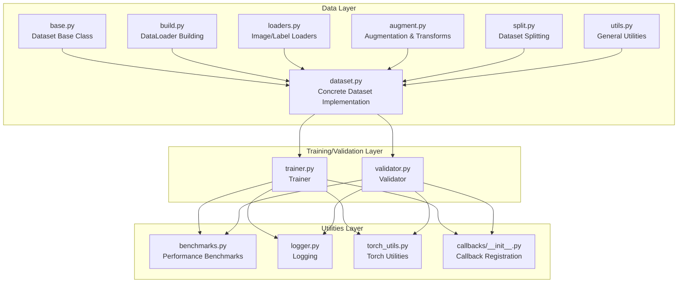
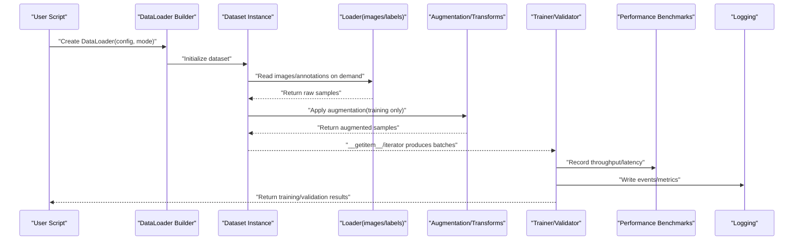
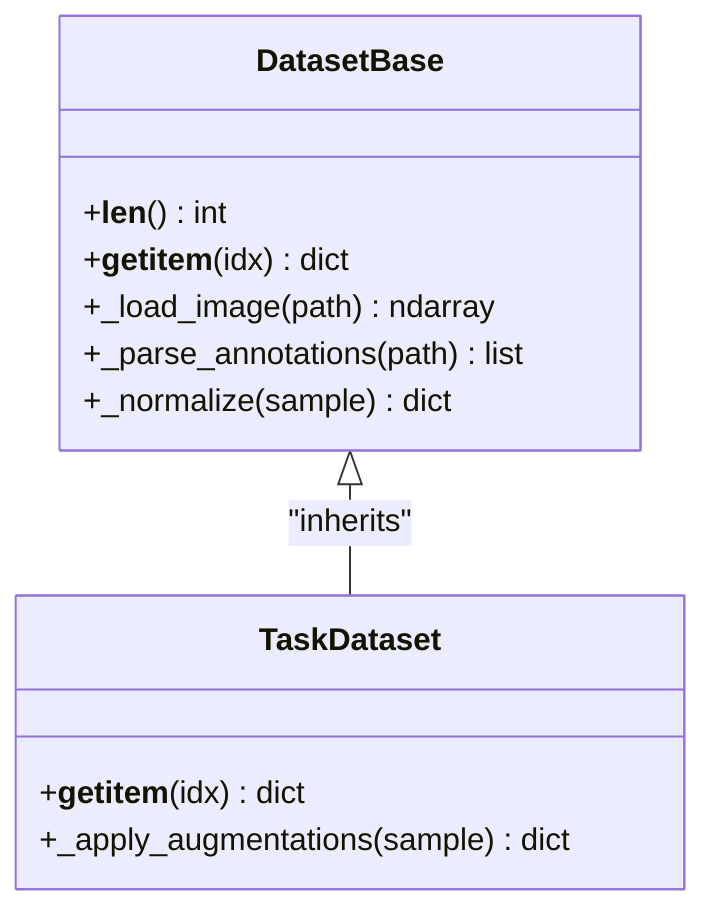
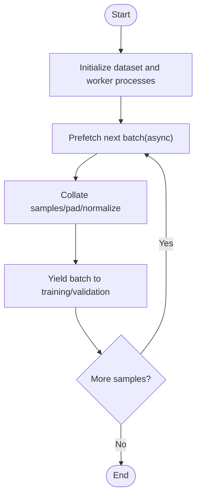
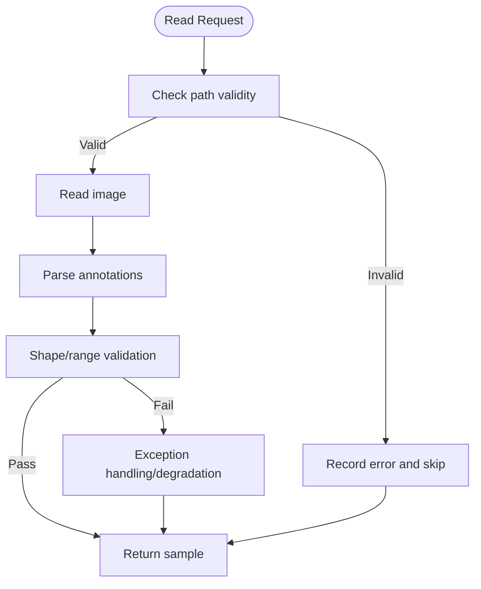
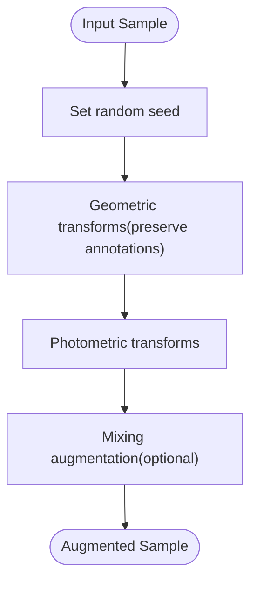
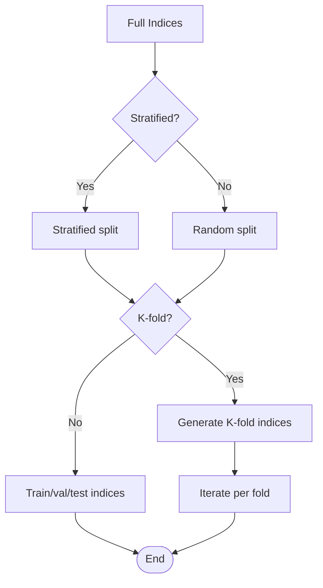
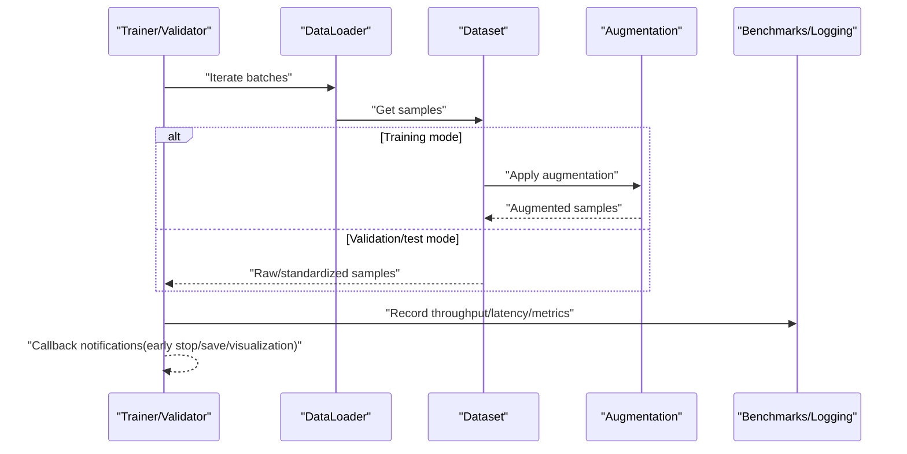
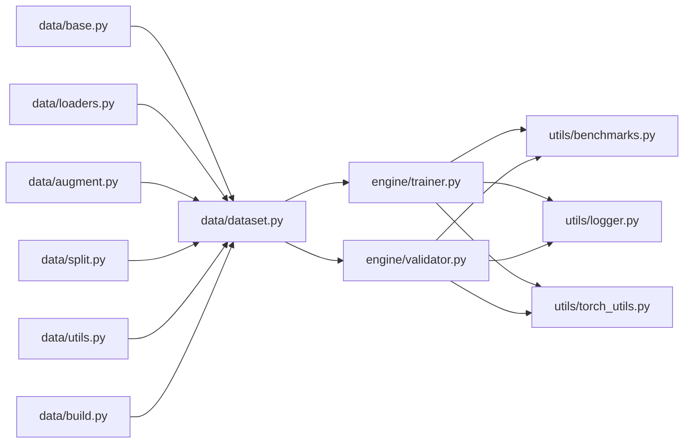

# Data Processing Pipeline

<cite>
**Files referenced in this document**
- [ultralytics/data/base.py](file://ultralytics/data/base.py)
- [ultralytics/data/build.py](file://ultralytics/data/build.py)
- [ultralytics/data/dataset.py](file://ultralytics/data/dataset.py)
- [ultralytics/data/loaders.py](file://ultralytics/data/loaders.py)
- [ultralytics/data/augment.py](file://ultralytics/data/augment.py)
- [ultralytics/data/split.py](file://ultralytics/data/split.py)
- [ultralytics/data/utils.py](file://ultralytics/data/utils.py)
- [ultralytics/engine/trainer.py](file://ultralytics/engine/trainer.py)
- [ultralytics/engine/validator.py](file://ultralytics/engine/validator.py)
- [ultralytics/utils/benchmarks.py](file://ultralytics/utils/benchmarks.py)
- [ultralytics/utils/logger.py](file://ultralytics/utils/logger.py)
- [ultralytics/utils/torch_utils.py](file://ultralytics/utils/torch_utils.py)
- [ultralytics/utils/callbacks/__init__.py](file://ultralytics/utils/callbacks/__init__.py)
</cite>

## Table of Contents
1. [Introduction](#introduction)
2. [Project Structure](#project-structure)
3. [Core Components](#core-components)
4. [Architecture Overview](#architecture-overview)
5. [Detailed Component Analysis](#detailed-component-analysis)
6. [Dependency Analysis](#dependency-analysis)
7. [Performance Considerations](#performance-considerations)
8. [Troubleshooting Guide](#troubleshooting-guide)
9. [Conclusion](#conclusion)
10. [Appendix](#appendix)

## Introduction
This guide is designed for engineers and researchers who need to build high-performance, scalable data processing pipelines. It provides systematic explanations covering data loading, preprocessing, batching, caching, parallelism, memory management, cleaning and deduplication, anomaly detection, dataset splitting and cross-validation, big data and distributed solutions, and performance monitoring and debugging tools. The content is based on the implementation of the data module and training/validation engine in the repository, providing a complete path from concepts to code implementation.

## Project Structure
This project concentrates data processing capabilities in the ultralytics/data subpackage, connecting end-to-end workflows through the trainer and validator in ultralytics/engine; cross-cutting capabilities like performance and logging are in ultralytics/utils.

**Diagram Sources**
- [ultralytics/data/base.py](file://ultralytics/data/base.py)
- [ultralytics/data/build.py](file://ultralytics/data/build.py)
- [ultralytics/data/dataset.py](file://ultralytics/data/dataset.py)
- [ultralytics/data/loaders.py](file://ultralytics/data/loaders.py)
- [ultralytics/data/augment.py](file://ultralytics/data/augment.py)
- [ultralytics/data/split.py](file://ultralytics/data/split.py)
- [ultralytics/data/utils.py](file://ultralytics/data/utils.py)
- [ultralytics/engine/trainer.py](file://ultralytics/engine/trainer.py)
- [ultralytics/engine/validator.py](file://ultralytics/engine/validator.py)
- [ultralytics/utils/benchmarks.py](file://ultralytics/utils/benchmarks.py)
- [ultralytics/utils/logger.py](file://ultralytics/utils/logger.py)
- [ultralytics/utils/torch_utils.py](file://ultralytics/utils/torch_utils.py)
- [ultralytics/utils/callbacks/__init__.py](file://ultralytics/utils/callbacks/__init__.py)

**Section Sources**
- [ultralytics/data/base.py](file://ultralytics/data/base.py)
- [ultralytics/data/build.py](file://ultralytics/data/build.py)
- [ultralytics/data/dataset.py](file://ultralytics/data/dataset.py)
- [ultralytics/data/loaders.py](file://ultralytics/data/loaders.py)
- [ultralytics/data/augment.py](file://ultralytics/data/augment.py)
- [ultralytics/data/split.py](file://ultralytics/data/split.py)
- [ultralytics/data/utils.py](file://ultralytics/data/utils.py)
- [ultralytics/engine/trainer.py](file://ultralytics/engine/trainer.py)
- [ultralytics/engine/validator.py](file://ultralytics/engine/validator.py)
- [ultralytics/utils/benchmarks.py](file://ultralytics/utils/benchmarks.py)
- [ultralytics/utils/logger.py](file://ultralytics/utils/logger.py)
- [ultralytics/utils/torch_utils.py](file://ultralytics/utils/torch_utils.py)
- [ultralytics/utils/callbacks/__init__.py](file://ultralytics/utils/callbacks/__init__.py)

## Core Components
- Data base class and abstract interface: Defines a unified data access protocol (indexing, length, sample retrieval), providing a consistent experience for multi-task/multi-format datasets.
- DataLoader builder: Responsible for creating iterable data pipelines, integrating thread pools, prefetching, batch collation, auto batch size, and other strategies.
- Dataset implementation: Encapsulates image and annotation reading, parsing, validation, and standardized output.
- Augmentation and transforms: Performs randomized augmentation on images and annotations during training to improve model generalization.
- Dataset splitting: Provides tools for generating train/val/test set indices by fixed ratio or stratified strategy.
- Training/validation engine: Drives data flow, organizes batch iteration, forward computation, metric statistics, and result recording.
- Performance and logging: Provides throughput/latency benchmarks, GPU/CPU resource observation, structured logging, and callback hooks.

**Section Sources**
- [ultralytics/data/base.py](file://ultralytics/data/base.py)
- [ultralytics/data/build.py](file://ultralytics/data/build.py)
- [ultralytics/data/dataset.py](file://ultralytics/data/dataset.py)
- [ultralytics/data/augment.py](file://ultralytics/data/augment.py)
- [ultralytics/data/split.py](file://ultralytics/data/split.py)
- [ultralytics/engine/trainer.py](file://ultralytics/engine/trainer.py)
- [ultralytics/engine/validator.py](file://ultralytics/engine/validator.py)

## Architecture Overview
The following diagram shows the end-to-end call chain from configuration to data loading, augmentation, batching, and training/validation.

**Diagram Sources**
- [ultralytics/data/build.py](file://ultralytics/data/build.py)
- [ultralytics/data/dataset.py](file://ultralytics/data/dataset.py)
- [ultralytics/data/loaders.py](file://ultralytics/data/loaders.py)
- [ultralytics/data/augment.py](file://ultralytics/data/augment.py)
- [ultralytics/engine/trainer.py](file://ultralytics/engine/trainer.py)
- [ultralytics/engine/validator.py](file://ultralytics/engine/validator.py)
- [ultralytics/utils/benchmarks.py](file://ultralytics/utils/benchmarks.py)
- [ultralytics/utils/logger.py](file://ultralytics/utils/logger.py)

## Detailed Component Analysis

### Data Base Class and Dataset Implementation
- Responsibilities
  - Defines unified __len__, __getitem__ interfaces, abstracting away differences between data sources.
  - Maintains metadata (class mapping, path lists, annotation indices).
  - Provides methods for data validation and standardized output.
- Key design
  - Selects concrete dataset implementations based on task type through factory/builder patterns.
  - Supports lazy loading and on-demand parsing to reduce first-frame latency and peak memory.
- Optimization points
  - Use memory mapping or read-only caching to reduce redundant I/O.
  - Apply chunking/scaling strategies for large objects (e.g., high-resolution images).

**Diagram Sources**
- [ultralytics/data/base.py](file://ultralytics/data/base.py)
- [ultralytics/data/dataset.py](file://ultralytics/data/dataset.py)

**Section Sources**
- [ultralytics/data/base.py](file://ultralytics/data/base.py)
- [ultralytics/data/dataset.py](file://ultralytics/data/dataset.py)

### DataLoader Building and Batching
- Responsibilities
  - Wraps datasets into iterable objects, supporting multi-thread/multi-process prefetching, dynamic batch size, sorting/shuffling.
  - Aggregates multiple samples into a batch with tensor alignment and padding.
- Key parameters
  - Number of worker processes, prefetch multiplier, whether to shuffle, whether to auto batch size, whether to enable memory mapping.
- Typical flow
  - Build indices -> start worker processes -> prefetch next batch -> main process collation and transformation -> yield batch.

**Diagram Sources**
- [ultralytics/data/build.py](file://ultralytics/data/build.py)
- [ultralytics/data/dataset.py](file://ultralytics/data/dataset.py)

**Section Sources**
- [ultralytics/data/build.py](file://ultralytics/data/build.py)
- [ultralytics/data/dataset.py](file://ultralytics/data/dataset.py)

### Image and Annotation Loaders
- Responsibilities
  - Safely read image files, handle corrupted/missing cases, return unified format arrays and size information.
  - Parse multiple annotation formats (coordinates, masks, keypoints, etc.) with consistency validation.
- Robustness
  - Exception catching and degradation strategies (skip bad samples, record error counts).
  - Optional grayscale/color space conversion and channel order adjustment.

**Diagram Sources**
- [ultralytics/data/loaders.py](file://ultralytics/data/loaders.py)
- [ultralytics/data/utils.py](file://ultralytics/data/utils.py)

**Section Sources**
- [ultralytics/data/loaders.py](file://ultralytics/data/loaders.py)
- [ultralytics/data/utils.py](file://ultralytics/data/utils.py)

### Data Augmentation and Transforms
- Responsibilities
  - Performs random geometric/photometric transforms, mixing strategies, etc., on images and annotations during training to improve robustness.
  - Ensures augmentation operations synchronously update annotations (e.g., affine transforms must synchronously update bounding boxes/keypoints).
- Common strategies
  - Random cropping, flipping, rotation, scaling, Mosaic/CutMix, and other combination augmentations.
  - Color jitter, blur, noise injection, etc.

**Diagram Sources**
- [ultralytics/data/augment.py](file://ultralytics/data/augment.py)

**Section Sources**
- [ultralytics/data/augment.py](file://ultralytics/data/augment.py)

### Dataset Splitting and Cross-Validation
- Responsibilities
  - Splits full data into train/val/test subsets, supporting stratified sampling and fixed random seeds for reproducibility.
  - Provides K-fold cross-validation index generators for robust model evaluation.
- Strategies
  - Split by ratio, stratified split by scene/class, grouped split by time/device.
  - Ensure approximately consistent distribution across folds during cross-validation.

**Diagram Sources**
- [ultralytics/data/split.py](file://ultralytics/data/split.py)

**Section Sources**
- [ultralytics/data/split.py](file://ultralytics/data/split.py)

### Data Flow in Training/Validation Engine
- Responsibilities
  - Organizes data iteration, batch scheduling, metric accumulation, logging, and callback triggering.
  - Enables augmentation and gradient updates in training mode; disables augmentation and turns off gradients in validation/test mode.
- Key flow
  - Initialize data pipeline -> loop batches -> forward/loss computation -> metric statistics -> callbacks/logging -> save/export.

**Diagram Sources**
- [ultralytics/engine/trainer.py](file://ultralytics/engine/trainer.py)
- [ultralytics/engine/validator.py](file://ultralytics/engine/validator.py)
- [ultralytics/utils/benchmarks.py](file://ultralytics/utils/benchmarks.py)
- [ultralytics/utils/logger.py](file://ultralytics/utils/logger.py)

**Section Sources**
- [ultralytics/engine/trainer.py](file://ultralytics/engine/trainer.py)
- [ultralytics/engine/validator.py](file://ultralytics/engine/validator.py)
- [ultralytics/utils/benchmarks.py](file://ultralytics/utils/benchmarks.py)
- [ultralytics/utils/logger.py](file://ultralytics/utils/logger.py)

## Dependency Analysis
- Cohesion and coupling
  - High cohesion within the data subpackage: base/dataset/loaders/augment/split/utils have clear responsibilities, assembled into DataLoader through build.
  - Engine decoupled from data: Interacts through standard iteration protocol, avoiding tight coupling.
- External dependencies
  - Torch tensor and device management provided through a unified entry via torch_utils.
  - Logging and callback mechanisms span the training/validation lifecycle.

**Diagram Sources**
- [ultralytics/data/base.py](file://ultralytics/data/base.py)
- [ultralytics/data/build.py](file://ultralytics/data/build.py)
- [ultralytics/data/dataset.py](file://ultralytics/data/dataset.py)
- [ultralytics/data/loaders.py](file://ultralytics/data/loaders.py)
- [ultralytics/data/augment.py](file://ultralytics/data/augment.py)
- [ultralytics/data/split.py](file://ultralytics/data/split.py)
- [ultralytics/data/utils.py](file://ultralytics/data/utils.py)
- [ultralytics/engine/trainer.py](file://ultralytics/engine/trainer.py)
- [ultralytics/engine/validator.py](file://ultralytics/engine/validator.py)
- [ultralytics/utils/benchmarks.py](file://ultralytics/utils/benchmarks.py)
- [ultralytics/utils/logger.py](file://ultralytics/utils/logger.py)
- [ultralytics/utils/torch_utils.py](file://ultralytics/utils/torch_utils.py)

**Section Sources**
- [ultralytics/data/base.py](file://ultralytics/data/base.py)
- [ultralytics/data/build.py](file://ultralytics/data/build.py)
- [ultralytics/data/dataset.py](file://ultralytics/data/dataset.py)
- [ultralytics/data/loaders.py](file://ultralytics/data/loaders.py)
- [ultralytics/data/augment.py](file://ultralytics/data/augment.py)
- [ultralytics/data/split.py](file://ultralytics/data/split.py)
- [ultralytics/data/utils.py](file://ultralytics/data/utils.py)
- [ultralytics/engine/trainer.py](file://ultralytics/engine/trainer.py)
- [ultralytics/engine/validator.py](file://ultralytics/engine/validator.py)
- [ultralytics/utils/benchmarks.py](file://ultralytics/utils/benchmarks.py)
- [ultralytics/utils/logger.py](file://ultralytics/utils/logger.py)
- [ultralytics/utils/torch_utils.py](file://ultralytics/utils/torch_utils.py)

## Performance Considerations
- Parallelism and prefetching
  - Set worker process count and prefetch multiplier appropriately to balance CPU/GPU utilization and memory usage.
  - For disk IO bottlenecks, prioritize increasing prefetch and process count; for GPU bottlenecks, focus on batch size and model operator efficiency.
- Memory management
  - Use read-only caching, memory mapping, and lazy loading to avoid loading all data at once.
  - Control intermediate tensor lifecycles, release large objects promptly to avoid fragmentation.
- Batching optimization
  - Dynamic batch size and auto batch size strategies, adaptively adjusted based on target VRAM limits.
  - Use efficient padding and packing strategies for variable-length sequences/masks.
- Monitoring and diagnostics
  - Use benchmark modules to collect throughput, latency, GPU utilization, CPU usage, IO wait, and other metrics.
  - Insert breakpoints and visualization at key nodes through callbacks to locate hotspot steps.

**Section Sources**
- [ultralytics/utils/benchmarks.py](file://ultralytics/utils/benchmarks.py)
- [ultralytics/utils/logger.py](file://ultralytics/utils/logger.py)
- [ultralytics/utils/torch_utils.py](file://ultralytics/utils/torch_utils.py)

## Troubleshooting Guide
- Common issues
  - Data corruption or missing: Loaders should catch exceptions and record error counts while training continues.
  - Annotations out of bounds or inconsistent: Perform range validation after parsing; discard or repair if necessary.
  - Memory overflow: Reduce batch size, decrease prefetch, enable memory mapping or chunked loading.
  - Performance degradation: Check worker process count, prefetch multiplier, disk IO, and GPU utilization.
- Diagnostic methods
  - Enable structured logging to record time consumption and error stacks at each stage.
  - Use callbacks to instrument before/after data loading, augmentation, and batch collation; plot timing diagrams.
  - Use benchmark modules to compare throughput/latency changes across different configurations.

**Section Sources**
- [ultralytics/data/loaders.py](file://ultralytics/data/loaders.py)
- [ultralytics/data/utils.py](file://ultralytics/data/utils.py)
- [ultralytics/utils/logger.py](file://ultralytics/utils/logger.py)
- [ultralytics/utils/callbacks/__init__.py](file://ultralytics/utils/callbacks/__init__.py)

## Conclusion
By decoupling data loading, augmentation, batching, and training/validation engines, connected through a unified iteration protocol, this pipeline achieves good extensibility and maintainability. Combined with appropriate parallelism and memory strategies, comprehensive exception handling and monitoring tools, it can stably and efficiently handle large-scale data in both single-machine and distributed environments. It is recommended to continuously collect performance metrics in production environments, tune parameters based on business characteristics, and form a closed-loop optimization.

## Appendix
- Best practices checklist
  - Always set random seeds for data pipelines to ensure reproducibility.
  - Enable augmentation during training; disable augmentation during validation/testing.
  - Use a "fail fast + log" strategy for anomalous samples to avoid polluting overall statistics.
  - Use stratified splitting and cross-validation to ensure evaluation result stability.
  - Regularly regress performance benchmarks to prevent data pipeline degradation.
