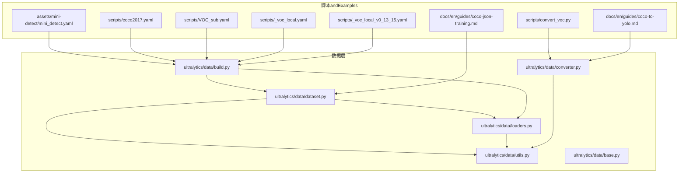
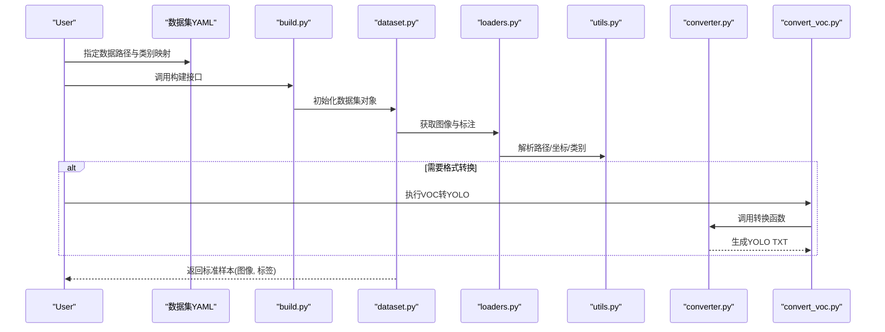
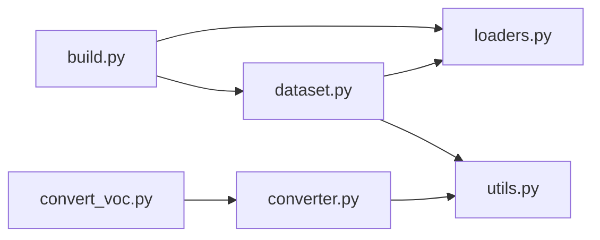

# 数据集格式规范

<cite>
**Files Referenced in This Document**
- [ultralytics/data/dataset.py](file://ultralytics/data/dataset.py)
- [ultralytics/data/loaders.py](file://ultralytics/data/loaders.py)
- [ultralytics/data/converter.py](file://ultralytics/data/converter.py)
- [ultralytics/data/utils.py](file://ultralytics/data/utils.py)
- [ultralytics/data/base.py](file://ultralytics/data/base.py)
- [ultralytics/data/build.py](file://ultralytics/data/build.py)
- [scripts/convert_voc.py](file://scripts/convert_voc.py)
- [docs/en/guides/coco-to-yolo.md](file://docs/en/guides/coco-to-yolo.md)
- [docs/en/guides/coco-json-training.md](file://docs/en/guides/coco-json-training.md)
- [assets/mini-detect/mini_detect.yaml](file://assets/mini-detect/mini_detect.yaml)
- [scripts/coco2017.yaml](file://scripts/coco2017.yaml)
- [scripts/VOC_sub.yaml](file://scripts/VOC_sub.yaml)
- [scripts/_voc_local.yaml](file://scripts/_voc_local.yaml)
- [scripts/_voc_local_v0_13_15.yaml](file://scripts/_voc_local_v0_13_15.yaml)
</cite>

## Table of Contents
1. [Introduction](#Introduction)
2. [Project Structure](#Project Structure)
3. [Core Components](#Core Components)
4. [Architecture Overview](#Architecture Overview)
5. [Detailed Component Analysis](#Detailed Component Analysis)
6. [Dependency Analysis](#Dependency Analysis)
7. [Performance Considerations](#Performance Considerations)
8. [Troubleshooting Guide](#Troubleshooting Guide)
9. [Conclusion](#Conclusion)
10. [Appendix](#Appendix)

## Introduction
本文件targetingYOLO-Master的数据集准备andUses，系统梳理COCO、VOC、YOLOetc.主流Object Detection数据集格式的Table of Contents组织、命名约定and标注文件格式（JSON/XML/TXT），并给出从其他格式toYOLO格式的转换方法、数据Validationand完整性检查流程、Examplesand最佳实践。Documentation同时Combining仓库中的数据集加载器、转换器andExamples配置，帮助读者快速搭建可Training的数据集工程。

## Project Structure
YOLO-Master对数据集的读取and处理集中whileultralytics/data子Modules中，并provides若干脚本andExamples配置文件用于常见Tasks（such asCOCO转YOLO、VOC本地化配置）。典型Table of Contentsand职责such as下：
- ultralytics/data：数据集构建、加载、格式解析and工具函数
- scripts：包含VOC转YOLO脚本and若干数据集YAMLExamples
- docs/en/guides：官方指南，含COCO转YOLOandCOCO JSONTraining说明
- assets/mini-detect：最小可运行检测数据集Examplesand其YAML配置

Figure Source
- [ultralytics/data/dataset.py](file://ultralytics/data/dataset.py)
- [ultralytics/data/loaders.py](file://ultralytics/data/loaders.py)
- [ultralytics/data/converter.py](file://ultralytics/data/converter.py)
- [ultralytics/data/utils.py](file://ultralytics/data/utils.py)
- [ultralytics/data/base.py](file://ultralytics/data/base.py)
- [ultralytics/data/build.py](file://ultralytics/data/build.py)
- [scripts/convert_voc.py](file://scripts/convert_voc.py)
- [docs/en/guides/coco-to-yolo.md](file://docs/en/guides/coco-to-yolo.md)
- [docs/en/guides/coco-json-training.md](file://docs/en/guides/coco-json-training.md)
- [assets/mini-detect/mini_detect.yaml](file://assets/mini-detect/mini_detect.yaml)
- [scripts/coco2017.yaml](file://scripts/coco2017.yaml)
- [scripts/VOC_sub.yaml](file://scripts/VOC_sub.yaml)
- [scripts/_voc_local.yaml](file://scripts/_voc_local.yaml)
- [scripts/_voc_local_v0_13_15.yaml](file://scripts/_voc_local_v0_13_15.yaml)

Section Source
- [ultralytics/data/dataset.py](file://ultralytics/data/dataset.py)
- [ultralytics/data/loaders.py](file://ultralytics/data/loaders.py)
- [ultralytics/data/converter.py](file://ultralytics/data/converter.py)
- [ultralytics/data/utils.py](file://ultralytics/data/utils.py)
- [ultralytics/data/base.py](file://ultralytics/data/base.py)
- [ultralytics/data/build.py](file://ultralytics/data/build.py)
- [scripts/convert_voc.py](file://scripts/convert_voc.py)
- [docs/en/guides/coco-to-yolo.md](file://docs/en/guides/coco-to-yolo.md)
- [docs/en/guides/coco-json-training.md](file://docs/en/guides/coco-json-training.md)
- [assets/mini-detect/mini_detect.yaml](file://assets/mini-detect/mini_detect.yaml)
- [scripts/coco2017.yaml](file://scripts/coco2017.yaml)
- [scripts/VOC_sub.yaml](file://scripts/VOC_sub.yaml)
- [scripts/_voc_local.yaml](file://scripts/_voc_local.yaml)
- [scripts/_voc_local_v0_13_15.yaml](file://scripts/_voc_local_v0_13_15.yaml)

## Core Components
- 数据集构建and加载
  - dataset.py：定义统一的数据集接口and迭代逻辑，负责将不同源格式转换for内部一致表示
  - loaders.py：图像and标注的底层加载器，provides路径解析、图像解码、归一化etc.capabilities
  - build.py：根据YAML配置组装数据集对象，管理train/val/test划分and缓存
  - base.py：通用基类and公共数据结构
  - utils.py：路径、索引、类别映射、边界框坐标变换etc.工具函数
- 格式转换
  - converter.py：implementingCOCO/VOC/YOLOetc.格式之间的相互转换
  - convert_voc.py：命令行脚本，批量将VOC XML标注转forYOLO TXT标注
- Examplesand指南
  - coco-to-yolo.md / coco-json-training.md：COCO转YOLOandCOCO JSONTraining的官方指南
  - mini_detect.yaml / coco2017.yaml / VOC_sub.yaml / _voc_local*.yaml：数据集YAML模板andExamples

Section Source
- [ultralytics/data/dataset.py](file://ultralytics/data/dataset.py)
- [ultralytics/data/loaders.py](file://ultralytics/data/loaders.py)
- [ultralytics/data/build.py](file://ultralytics/data/build.py)
- [ultralytics/data/base.py](file://ultralytics/data/base.py)
- [ultralytics/data/utils.py](file://ultralytics/data/utils.py)
- [ultralytics/data/converter.py](file://ultralytics/data/converter.py)
- [scripts/convert_voc.py](file://scripts/convert_voc.py)
- [docs/en/guides/coco-to-yolo.md](file://docs/en/guides/coco-to-yolo.md)
- [docs/en/guides/coco-json-training.md](file://docs/en/guides/coco-json-training.md)
- [assets/mini-detect/mini_detect.yaml](file://assets/mini-detect/mini_detect.yaml)
- [scripts/coco2017.yaml](file://scripts/coco2017.yaml)
- [scripts/VOC_sub.yaml](file://scripts/VOC_sub.yaml)
- [scripts/_voc_local.yaml](file://scripts/_voc_local.yaml)
- [scripts/_voc_local_v0_13_15.yaml](file://scripts/_voc_local_v0_13_15.yaml)

## Architecture Overview
下图展示从“原始数据+YAML配置”to“Training可用数据集”的整体流程，包括格式解析、转换、构建and加载的关键环节。

Figure Source
- [ultralytics/data/build.py](file://ultralytics/data/build.py)
- [ultralytics/data/dataset.py](file://ultralytics/data/dataset.py)
- [ultralytics/data/loaders.py](file://ultralytics/data/loaders.py)
- [ultralytics/data/utils.py](file://ultralytics/data/utils.py)
- [ultralytics/data/converter.py](file://ultralytics/data/converter.py)
- [scripts/convert_voc.py](file://scripts/convert_voc.py)

## Detailed Component Analysis

### YOLO格式规范（TXT）
- Table of Contents组织
  - images：存放所有图像文件（Supportingjpg/pngetc.）
  - labels：andimages同名的TXT标注文件，按相同子Table of Contents结构组织
  - data.yaml：描述数据集根路径、类别数、类别名称列表Centered onandtrain/val/test划分
- 标注文件命名约定
  - 图像文件名and对应标注文件名完全一致，仅扩展名不同（例such asa.jpg ↔ a.txt）
- 标注文件格式（TXT）
  - 每行一个目标，字段顺序for：类别ID 中心x 中心y 宽度w 高度h
  - 坐标均for相对值，范围[0,1]，基于图像的宽和高进行归一化
  - 类别ID从0开始，连续且anddata.yaml中的类别顺序严格对应
- ExamplesRefer to
  - 最小Examples数据集andYAML配置见assets/mini-detect

Section Source
- [assets/mini-detect/mini_detect.yaml](file://assets/mini-detect/mini_detect.yaml)
- [ultralytics/data/dataset.py](file://ultralytics/data/dataset.py)
- [ultralytics/data/loaders.py](file://ultralytics/data/loaders.py)
- [ultralytics/data/utils.py](file://ultralytics/data/utils.py)

### COCO格式规范（JSON）
- Table of Contents组织
  - images：存放图像
  - annotations：存放COCO JSON标注文件（such asinstances_train2017.json）
  - data.yaml：Optional，用于whileYOLO侧声明COCO路径and类别信息
- 标注文件格式（JSON）
  - 顶层字段通常包含images、annotations、categoriesetc.
  - categories定义idandname映射；annotations包含bbox、segmentation、iscrowdetc.
- Trainingand转换
  - 可直接UsesCOCO JSON进行Training或先转换forYOLO TXT
  - 官方指南provides了COCO转YOLOandCOCO JSONTrainingworkflow说明

Section Source
- [docs/en/guides/coco-json-training.md](file://docs/en/guides/coco-json-training.md)
- [docs/en/guides/coco-to-yolo.md](file://docs/en/guides/coco-to-yolo.md)
- [ultralytics/data/converter.py](file://ultralytics/data/converter.py)
- [ultralytics/data/dataset.py](file://ultralytics/data/dataset.py)

### VOC格式规范（XML）
- Table of Contents组织
  - JPEGImages：存放图像
  - Annotations：存放VOC XML标注
  - ImageSets/Main：存放train/val/test分割列表（Optional）
  - data.yaml：Optional，用于whileYOLO侧声明VOC路径and类别信息
- 标注文件格式（XML）
  - 每个图像对应一个同名XML文件，包含object列表，每个object有name、bndboxetc.
- 转换建议
  - 推荐Usesconvert_voc.py将VOC XML批量转换forYOLO TXT，便于后续Training

Section Source
- [scripts/convert_voc.py](file://scripts/convert_voc.py)
- [ultralytics/data/converter.py](file://ultralytics/data/converter.py)
- [scripts/VOC_sub.yaml](file://scripts/VOC_sub.yaml)
- [scripts/_voc_local.yaml](file://scripts/_voc_local_v0_13_15.yaml)

### 数据集YAML配置
- 关键字段
  - path：数据集Root Directory
  - train/val/test：各集合的相对路径或glob模式
  - names：类别名称列表（顺序决定类别ID）
  - nc：类别数量（可由names推导）
- Examples
  - 检测TasksExamples：assets/mini-detect/mini_detect.yaml
  - COCO2017Examples：scripts/coco2017.yaml
  - VOC本地化Examples：scripts/_voc_local.yaml、scripts/_voc_local_v0_13_15.yaml、scripts/VOC_sub.yaml

Section Source
- [assets/mini-detect/mini_detect.yaml](file://assets/mini-detect/mini_detect.yaml)
- [scripts/coco2017.yaml](file://scripts/coco2017.yaml)
- [scripts/VOC_sub.yaml](file://scripts/VOC_sub.yaml)
- [scripts/_voc_local.yaml](file://scripts/_voc_local.yaml)
- [scripts/_voc_local_v0_13_15.yaml](file://scripts/_voc_local_v0_13_15.yaml)

### 格式转换工具and脚本
- 自动转换
  - converter.py：providesCOCO↔YOLO、VOC↔YOLOetc.转换函数
  - convert_voc.py：命令行入口，遍历VOCTable of Contents，解析XML并输出YOLO TXT
- Uses方式
  - Via命令行参数指定输入VOCRoot Directory、输出YOLORoot Directory、类别映射etc.
  - 转换后需确保labelsandimagesTable of Contents结构一致，且TXT命名and图像一致

Section Source
- [ultralytics/data/converter.py](file://ultralytics/data/converter.py)
- [scripts/convert_voc.py](file://scripts/convert_voc.py)
- [docs/en/guides/coco-to-yolo.md](file://docs/en/guides/coco-to-yolo.md)

### 数据Validationand完整性检查
- 基本检查项
  - 图像存while性：imagesTable of Contents下文件是否完整
  - 标注一致性：每个图像是否有同名TXT，且TXT行数≥0
  - 坐标有效性：YOLO TXT的xywh均while[0,1]范围内
  - 类别合法性：类别ID小于nc且whilenames中存while
  - 路径正确性：YAML中path/train/val/test指向真实路径
- 推荐流程
  - while构建数据集前，先运行一次轻量级校验（统计缺失、越界、非法类别etc.）
  - 对异常样本输出Logging并跳过，保证Training稳定性

Section Source
- [ultralytics/data/utils.py](file://ultralytics/data/utils.py)
- [ultralytics/data/dataset.py](file://ultralytics/data/dataset.py)
- [ultralytics/data/loaders.py](file://ultralytics/data/loaders.py)

### 实际Examplesand最佳实践
- 最小可运行Examples
  - Usesassets/mini-detect作for模板，复制imagesandlabels，修改mini_detect.yaml中的pathandnames
- 多集合划分
  - whileYAML中分别设置train/val/test路径，确保无重复图像
- 类别管理
  - 保持names顺序稳定，避免Training中途类别映射漂移
- 转换流水线
  - 优先将外部标注统一转换forYOLO TXT，减少运行时解析开销
- 版本兼容
  - 注意不同VOC版本的Table of Contents差异，必要时Uses对应的本地化YAML模板

Section Source
- [assets/mini-detect/mini_detect.yaml](file://assets/mini-detect/mini_detect.yaml)
- [scripts/_voc_local.yaml](file://scripts/_voc_local.yaml)
- [scripts/_voc_local_v0_13_15.yaml](file://scripts/_voc_local_v0_13_15.yaml)
- [scripts/VOC_sub.yaml](file://scripts/VOC_sub.yaml)

## Dependency Analysis
- 组件耦合
  - build.py依赖dataset.pyandloaders.py完成数据集装配
  - dataset.py依赖loaders.pyandutils.py完成图像and标注解析
  - converter.py依赖utils.py进行坐标and类别映射
- External Dependencies
  - 文件系统访问、图像解码库、JSON/XML解析库
- Potential Cycles依赖
  - 当前设计分层清晰，未见明显循环依赖

Figure Source
- [ultralytics/data/build.py](file://ultralytics/data/build.py)
- [ultralytics/data/dataset.py](file://ultralytics/data/dataset.py)
- [ultralytics/data/loaders.py](file://ultralytics/data/loaders.py)
- [ultralytics/data/utils.py](file://ultralytics/data/utils.py)
- [ultralytics/data/converter.py](file://ultralytics/data/converter.py)
- [scripts/convert_voc.py](file://scripts/convert_voc.py)

Section Source
- [ultralytics/data/build.py](file://ultralytics/data/build.py)
- [ultralytics/data/dataset.py](file://ultralytics/data/dataset.py)
- [ultralytics/data/loaders.py](file://ultralytics/data/loaders.py)
- [ultralytics/data/utils.py](file://ultralytics/data/utils.py)
- [ultralytics/data/converter.py](file://ultralytics/data/converter.py)
- [scripts/convert_voc.py](file://scripts/convert_voc.py)

## Performance Considerations
- 预处理and缓存
  - 建议while首次构建时启用缓存，避免重复解析and解码
- 并行I/O
  - Uses多线程或多进程加载图像and标注，提升吞吐
- 坐标归一化
  - 尽量while转换阶段完成归一化，减少Training时的计算负担
- 类别映射
  - 预构建类别字典，避免运行时查找开销

## Troubleshooting Guide
- 常见问题
  - 找不to图像或标注：检查YAML路径and文件名一致性
  - 标注越界或类别非法：检查坐标范围and类别ID映射
  - 转换失败：确认VOCTable of Contents结构andXML字段完整
- 定位步骤
  - 打印数据集统计信息（图像数量、标注总数、类别分布）
  - 针对异常样本输出具体错误原因（缺失、越界、类型不匹配）
  - 逐步缩小问题范围（单图单标Validation）

Section Source
- [ultralytics/data/utils.py](file://ultralytics/data/utils.py)
- [ultralytics/data/dataset.py](file://ultralytics/data/dataset.py)
- [ultralytics/data/loaders.py](file://ultralytics/data/loaders.py)

## Conclusion
YOLO-Masterthrough a unified构建and加载接口，兼容COCO、VOCandYOLO三种主流格式。借助converterandconvert_voc.py，可将外部标注高效转换forYOLO TXT，Combined withYAML配置and校验流程，形成稳健的数据集工程。遵循本文的Table of Contents组织、命名约定and最佳实践，可显著提升Data Preparation效率andTraining稳定性。

## Appendix
- 常用命令and路径
  - VOC转YOLO：Refer toscripts/convert_voc.py的Uses说明
  - COCO转YOLO：Refer todocs/en/guides/coco-to-yolo.md
  - ExamplesYAML：assets/mini-detect/mini_detect.yaml、scripts/coco2017.yaml、scripts/_voc_local*.yaml、scripts/VOC_sub.yaml