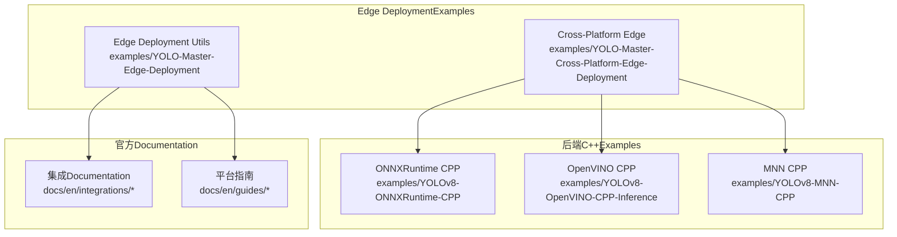
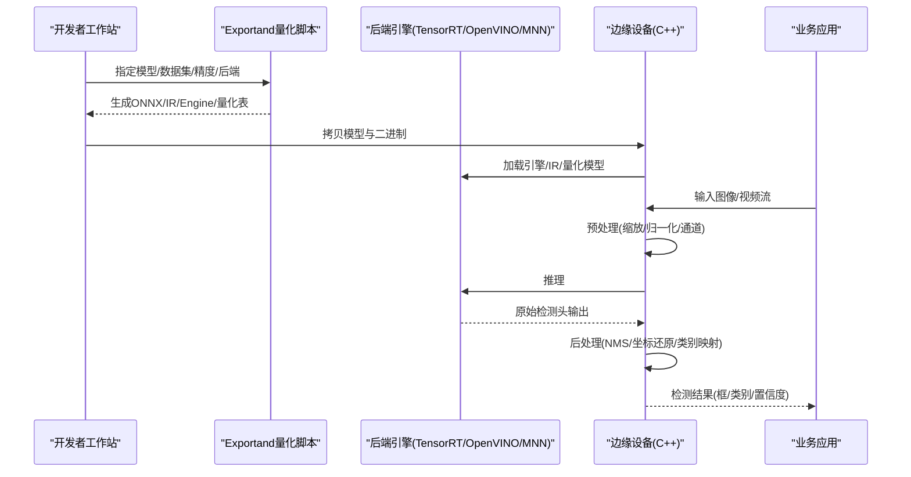
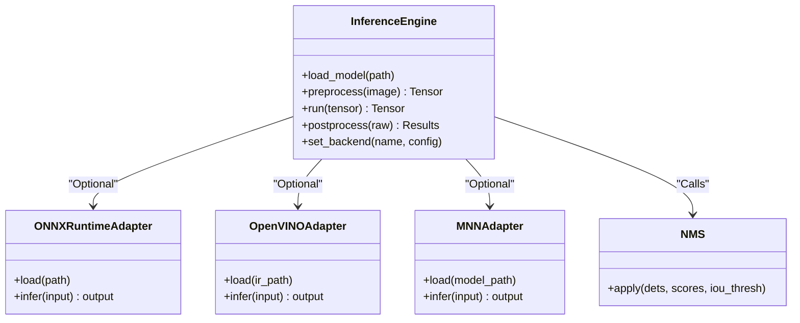
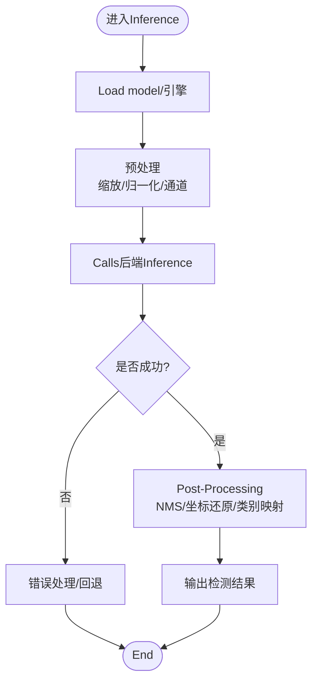
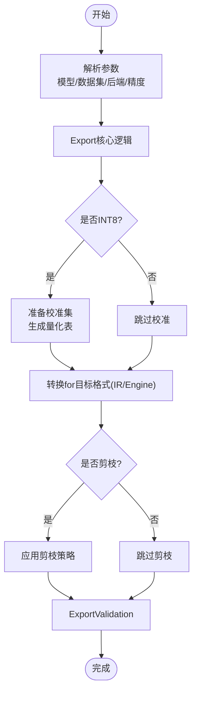
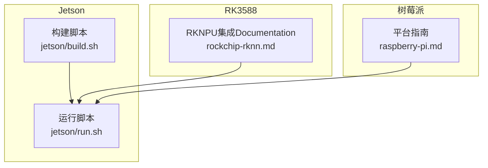
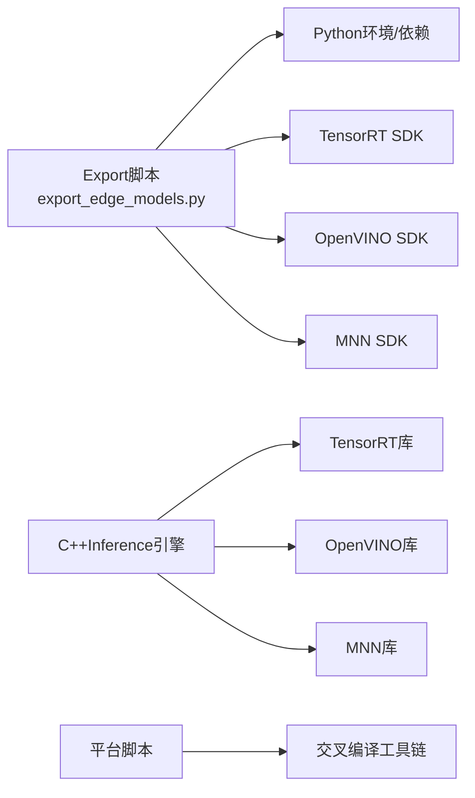

# Edge Device Deployment

<cite>
**Files Referenced in This Document**
- [README.md](file://examples/YOLO-Master-Cross-Platform-Edge-Deployment/README.md)
- [TECHNICAL_REPORT.md](file://examples/YOLO-Master-Cross-Platform-Edge-Deployment/TECHNICAL_REPORT.md)
- [CMakeLists.txt](file://examples/YOLO-Master-Cross-Platform-Edge-Deployment/cpp/CMakeLists.txt)
- [inference.cpp](file://examples/YOLO-Master-Cross-Platform-Edge-Deployment/cpp/inference.cpp)
- [inference.h](file://examples/YOLO-Master-Cross-Platform-Edge-Deployment/cpp/inference.h)
- [main.cpp](file://examples/YOLO-Master-Cross-Platform-Edge-Deployment/cpp/main.cpp)
- [jetson_build.sh](file://examples/YOLO-Master-Cross-Platform-Edge-Deployment/jetson/build.sh)
- [jetson_run.sh](file://examples/YOLO-Master-Cross-Platform-Edge-Deployment/jetson/run.sh)
- [export_edge_models.py](file://examples/YOLO-Master-Edge-Deployment/export_edge_models.py)
- [edge_utils.py](file://examples/YOLO-Master-Edge-Deployment/edge_utils.py)
- [validate_edge_outputs.py](file://examples/YOLO-Master-Edge-Deployment/validate_edge_outputs.py)
- [CMakeLists.txt](file://examples/YOLOv8-ONNXRuntime-CPP/CMakeLists.txt)
- [inference.cpp](file://examples/YOLOv8-ONNXRuntime-CPP/inference.cpp)
- [inference.h](file://examples/YOLOv8-ONNXRuntime-CPP/inference.h)
- [main.cpp](file://examples/YOLOv8-ONNXRuntime-CPP/main.cpp)
- [CMakeLists.txt](file://examples/YOLOv8-OpenVINO-CPP-Inference/CMakeLists.txt)
- [inference.cc](file://examples/YOLOv8-OpenVINO-CPP-Inference/inference.cc)
- [inference.h](file://examples/YOLOv8-OpenVINO-CPP-Inference/inference.h)
- [main.cc](file://examples/YOLOv8-OpenVINO-CPP-Inference/main.cc)
- [CMakeLists.txt](file://examples/YOLOv8-MNN-CPP/CMakeLists.txt)
- [main.cpp](file://examples/YOLOv8-MNN-CPP/main.cpp)
- [main_interpreter.cpp](file://examples/YOLOv8-MNN-CPP/main_interpreter.cpp)
- [mnn.md](file://docs/en/integrations/mnn.md)
- [ncnn.md](file://docs/en/integrations/ncnn.md)
- [openvino.md](file://docs/en/integrations/openvino.md)
- [tensorrt.md](file://docs/en/integrations/tensorrt.md)
- [rockchip-rknn.md](file://docs/en/integrations/rockchip-rknn.md)
- [raspberry-pi.md](file://docs/en/guides/raspberry-pi.md)
- [nvidia-jetson.md](file://docs/en/guides/nvidia-jetson.md)
- [model-deployment-options.md](file://docs/en/guides/model-deployment-options.md)
- [model-deployment-practices.md](file://docs/en/guides/model-deployment-practices.md)
</cite>

## Table of Contents
1. [Introduction](#Introduction)
2. [Project Structure](#Project Structure)
3. [Core Components](#Core Components)
4. [Architecture Overview](#Architecture Overview)
5. [Detailed Component Analysis](#Detailed Component Analysis)
6. [Dependency Analysis](#Dependency Analysis)
7. [性能and功耗Optimization](#性能and功耗Optimization)
8. [Troubleshooting Guide](#Troubleshooting Guide)
9. [Conclusion](#Conclusion)
10. [Appendix：跨平台编译and交叉编译](#Appendix跨平台编译and交叉编译)

## Introduction
本教程targetingwhile边缘设备上部署YOLO-Master的工程实践，覆盖Jetson系列、树莓派、RK3588etc.平台的Model Export、量化（INT8/FP16）、剪枝、C++Inference引擎implementing（预处理-Inference-Post-Processing全流程Optimization），Centered onandTensorRT、OpenVINO、NCNN、MNNetc.加速后端的配置andUses。Documentation同时provides内存Optimization、实时性保障策略、跨平台编译and交叉编译方案，并给出性能调优and功耗Optimization技巧。

## Project Structure
仓库中andEdge Deployment直接相关的ExamplesandDocumentation主要分布whileCentered on下位置：
- 跨平台Edge DeploymentExamples：examples/YOLO-Master-Cross-Platform-Edge-Deployment
- 通用Edge Deployment脚本and工具：examples/YOLO-Master-Edge-Deployment
- 各后端C++InferenceExamples：examples/YOLOv8-ONNXRuntime-CPP、examples/YOLOv8-OpenVINO-CPP-Inference、examples/YOLOv8-MNN-CPP
- 官方集成Documentation：docs/en/integrations/* and docs/en/guides/*

Figure Source
- [README.md](file://examples/YOLO-Master-Cross-Platform-Edge-Deployment/README.md)
- [TECHNICAL_REPORT.md](file://examples/YOLO-Master-Cross-Platform-Edge-Deployment/TECHNICAL_REPORT.md)
- [export_edge_models.py](file://examples/YOLO-Master-Edge-Deployment/export_edge_models.py)
- [edge_utils.py](file://examples/YOLO-Master-Edge-Deployment/edge_utils.py)
- [validate_edge_outputs.py](file://examples/YOLO-Master-Edge-Deployment/validate_edge_outputs.py)
- [mnn.md](file://docs/en/integrations/mnn.md)
- [ncnn.md](file://docs/en/integrations/ncnn.md)
- [openvino.md](file://docs/en/integrations/openvino.md)
- [tensorrt.md](file://docs/en/integrations/tensorrt.md)
- [raspberry-pi.md](file://docs/en/guides/raspberry-pi.md)
- [nvidia-jetson.md](file://docs/en/guides/nvidia-jetson.md)

Section Source
- [README.md](file://examples/YOLO-Master-Cross-Platform-Edge-Deployment/README.md)
- [TECHNICAL_REPORT.md](file://examples/YOLO-Master-Cross-Platform-Edge-Deployment/TECHNICAL_REPORT.md)
- [export_edge_models.py](file://examples/YOLO-Master-Edge-Deployment/export_edge_models.py)
- [edge_utils.py](file://examples/YOLO-Master-Edge-Deployment/edge_utils.py)
- [validate_edge_outputs.py](file://examples/YOLO-Master-Edge-Deployment/validate_edge_outputs.py)

## Core Components
- Model Exportand量化
  - ViaPython脚本完成从Training权重to边缘可执行格式（such asONNX、TensorRT、OpenVINO IR、MNN）的转换，SupportingFP16/INT8量化andOptional剪枝流程。
  - 关键入口and工具函数集中whileEdge Deployment脚本中，负责参数解析、数据校准（INT8）、目标后端选择and输出产物管理。
- C++Inference引擎
  - 统一Encapsulates预处理（缩放、归一化、通道重排）、InferenceCalls（后端API）、Post-Processing（NMS、坐标还原、类别映射）。
  - provides多后端适配层，按运行时动态加载对应库或IR/Engine文件。
- 平台构建and运行脚本
  - Jetson/RK3588/树莓派etc.平台provides专用构建and运行脚本，自动探测硬件capabilities、设置环境变量、选择最优精度and线程数。
- Validationand回归测试
  - provides端to端校验脚本，对比不同后端/精度的输出一致性，确保部署正确性and稳定性。

Section Source
- [export_edge_models.py](file://examples/YOLO-Master-Edge-Deployment/export_edge_models.py)
- [edge_utils.py](file://examples/YOLO-Master-Edge-Deployment/edge_utils.py)
- [validate_edge_outputs.py](file://examples/YOLO-Master-Edge-Deployment/validate_edge_outputs.py)
- [inference.cpp](file://examples/YOLO-Master-Cross-Platform-Edge-Deployment/cpp/inference.cpp)
- [inference.h](file://examples/YOLO-Master-Cross-Platform-Edge-Deployment/cpp/inference.h)
- [main.cpp](file://examples/YOLO-Master-Cross-Platform-Edge-Deployment/cpp/main.cpp)

## Architecture Overview
下图展示了从Training权重to边缘设备运行的整体流程，包括Export、量化/剪枝、C++Inferenceand多后端适配。

Figure Source
- [export_edge_models.py](file://examples/YOLO-Master-Edge-Deployment/export_edge_models.py)
- [edge_utils.py](file://examples/YOLO-Master-Edge-Deployment/edge_utils.py)
- [inference.cpp](file://examples/YOLO-Master-Cross-Platform-Edge-Deployment/cpp/inference.cpp)
- [inference.h](file://examples/YOLO-Master-Cross-Platform-Edge-Deployment/cpp/inference.h)
- [main.cpp](file://examples/YOLO-Master-Cross-Platform-Edge-Deployment/cpp/main.cpp)
- [mnn.md](file://docs/en/integrations/mnn.md)
- [openvino.md](file://docs/en/integrations/openvino.md)
- [tensorrt.md](file://docs/en/integrations/tensorrt.md)

## Detailed Component Analysis

### 组件A：C++Inference引擎（预处理-Inference-Post-Processing）
该组件将输入图像转换for模型期望的张量，Calls后端进行Inference，并对原始输出进行解码andNMS得to最终结果。

Figure Source
- [inference.cpp](file://examples/YOLO-Master-Cross-Platform-Edge-Deployment/cpp/inference.cpp)
- [inference.h](file://examples/YOLO-Master-Cross-Platform-Edge-Deployment/cpp/inference.h)
- [main.cpp](file://examples/YOLO-Master-Cross-Platform-Edge-Deployment/cpp/main.cpp)
- [inference.cpp](file://examples/YOLOv8-ONNXRuntime-CPP/inference.cpp)
- [inference.h](file://examples/YOLOv8-ONNXRuntime-CPP/inference.h)
- [inference.cc](file://examples/YOLOv8-OpenVINO-CPP-Inference/inference.cc)
- [inference.h](file://examples/YOLOv8-OpenVINO-CPP-Inference/inference.h)
- [main.cpp](file://examples/YOLOv8-MNN-CPP/main.cpp)
- [main_interpreter.cpp](file://examples/YOLOv8-MNN-CPP/main_interpreter.cpp)

Section Source
- [inference.cpp](file://examples/YOLO-Master-Cross-Platform-Edge-Deployment/cpp/inference.cpp)
- [inference.h](file://examples/YOLO-Master-Cross-Platform-Edge-Deployment/cpp/inference.h)
- [main.cpp](file://examples/YOLO-Master-Cross-Platform-Edge-Deployment/cpp/main.cpp)
- [CMakeLists.txt](file://examples/YOLO-Master-Cross-Platform-Edge-Deployment/cpp/CMakeLists.txt)
- [CMakeLists.txt](file://examples/YOLOv8-ONNXRuntime-CPP/CMakeLists.txt)
- [CMakeLists.txt](file://examples/YOLOv8-OpenVINO-CPP-Inference/CMakeLists.txt)
- [CMakeLists.txt](file://examples/YOLOv8-MNN-CPP/CMakeLists.txt)

#### Inference流程图（算法级）

Figure Source
- [inference.cpp](file://examples/YOLO-Master-Cross-Platform-Edge-Deployment/cpp/inference.cpp)
- [inference.h](file://examples/YOLO-Master-Cross-Platform-Edge-Deployment/cpp/inference.h)

### 组件B：Model Exportand量化（INT8/FP16）and剪枝
- Export流程
  - 输入：Training权重、数据集路径、目标后端and精度。
  - 过程：生成中间表示（such asONNX），根据后端要求进一步转换forIR/Engine；若选择INT8，则基于校准集生成量化表。
  - 输出：后端可执行模型and必要元数据。
- 量化and剪枝
  - FP16：whileSupporting半精度的后端上启用，减少显存占用并提升吞吐。
  - INT8：需校准数据，平衡精度and速度；对卷积/激活层进行权重量化and激活量化。
  - 剪枝：Optional稀疏化或结构化剪枝，降低计算量，Combined with量化获得更佳能效比。

Figure Source
- [export_edge_models.py](file://examples/YOLO-Master-Edge-Deployment/export_edge_models.py)
- [edge_utils.py](file://examples/YOLO-Master-Edge-Deployment/edge_utils.py)
- [validate_edge_outputs.py](file://examples/YOLO-Master-Edge-Deployment/validate_edge_outputs.py)

Section Source
- [export_edge_models.py](file://examples/YOLO-Master-Edge-Deployment/export_edge_models.py)
- [edge_utils.py](file://examples/YOLO-Master-Edge-Deployment/edge_utils.py)
- [validate_edge_outputs.py](file://examples/YOLO-Master-Edge-Deployment/validate_edge_outputs.py)

### 组件C：平台构建and运行脚本（Jetson/RK3588/树莓派）
- Jetson
  - 构建脚本用于Installing Dependencies、选择CUDA/TensorRT版本、编译C++工程and生成Inference二进制。
  - 运行脚本设置GPU/NVMM内存、线程数、精度模式and模型路径。
- RK3588
  - Refer toRockchip RKNPU生态andDocumentation，CombiningRKNPU SDK完成模型转换and部署。
- 树莓派
  - 针对ARM CPU/GPUOptimization，PreferOpenVINO/ONNXRuntime轻量后端，必要时启用NEON/SVE指令集。

Figure Source
- [jetson_build.sh](file://examples/YOLO-Master-Cross-Platform-Edge-Deployment/jetson/build.sh)
- [jetson_run.sh](file://examples/YOLO-Master-Cross-Platform-Edge-Deployment/jetson/run.sh)
- [rockchip-rknn.md](file://docs/en/integrations/rockchip-rknn.md)
- [raspberry-pi.md](file://docs/en/guides/raspberry-pi.md)

Section Source
- [jetson_build.sh](file://examples/YOLO-Master-Cross-Platform-Edge-Deployment/jetson/build.sh)
- [jetson_run.sh](file://examples/YOLO-Master-Cross-Platform-Edge-Deployment/jetson/run.sh)
- [rockchip-rknn.md](file://docs/en/integrations/rockchip-rknn.md)
- [raspberry-pi.md](file://docs/en/guides/raspberry-pi.md)

### 组件D：后端集成Documentation（TensorRT、OpenVINO、NCNN、MNN）
- TensorRT
  - 适用于NVIDIA GPU/Jetson，SupportingFP16/INT8，推荐开启Layer FusionandTacticOptimization。
- OpenVINO
  - 适用于Intel CPU/NPUand部分ARM平台，SupportingFP16/INT8，注意I/O布局and线程数配置。
- NCNN
  - 移动端/嵌入式友好，SupportingFP16/INT8，关注内存池and多线程并行。
- MNN
  - 阿里开源Inference框架，Supporting多后端and量化，适合Cross-Platform Deployment。

Section Source
- [tensorrt.md](file://docs/en/integrations/tensorrt.md)
- [openvino.md](file://docs/en/integrations/openvino.md)
- [ncnn.md](file://docs/en/integrations/ncnn.md)
- [mnn.md](file://docs/en/integrations/mnn.md)

## Dependency Analysis
- Exportand量化Modules依赖Python环境and目标后端SDK（such asTensorRT、OpenVINO、MNN）。
- C++Inference引擎依赖对应后端的C/C++接口and静态/动态库。
- 平台脚本依赖系统包管理器and交叉编译工具链。

Figure Source
- [export_edge_models.py](file://examples/YOLO-Master-Edge-Deployment/export_edge_models.py)
- [inference.cpp](file://examples/YOLO-Master-Cross-Platform-Edge-Deployment/cpp/inference.cpp)
- [CMakeLists.txt](file://examples/YOLO-Master-Cross-Platform-Edge-Deployment/cpp/CMakeLists.txt)

Section Source
- [export_edge_models.py](file://examples/YOLO-Master-Edge-Deployment/export_edge_models.py)
- [inference.cpp](file://examples/YOLO-Master-Cross-Platform-Edge-Deployment/cpp/inference.cpp)
- [CMakeLists.txt](file://examples/YOLO-Master-Cross-Platform-Edge-Deployment/cpp/CMakeLists.txt)

## 性能and功耗Optimization
- 精度选择
  - FP16whileGPU/NPU上通常带来显著提速and降功耗；CPU场景需谨慎Evaluation数值稳定性。
  - INT8需充分校准，建议采用代表性数据集and分层量化策略。
- 批大小and流水线
  - 合理增大批大小Centered on提升吞吐；视频流可采用异步流水线and双缓冲。
- 内存管理
  - 复用输入/输出缓冲区，避免频繁分配；Uses内存池and零拷贝（such asNVMM）。
- 线程and调度
  - 根据核心数设置Inference线程；I/OandInference分离，避免阻塞。
- 后端特定Optimization
  - TensorRT：启用Fusion、Optimization Profiles、Tactic搜索。
  - OpenVINO：设置线程数、缓存IR、禁用不必要的Logging。
  - MNN/NCNN：调整线程and内存池大小，启用SIMDOptimization。
- 功耗控制
  - 动态频率调节、限制最大帧率、按需唤醒传感器and显示。

Section Source
- [model-deployment-options.md](file://docs/en/guides/model-deployment-options.md)
- [model-deployment-practices.md](file://docs/en/guides/model-deployment-practices.md)
- [nvidia-jetson.md](file://docs/en/guides/nvidia-jetson.md)
- [raspberry-pi.md](file://docs/en/guides/raspberry-pi.md)

## Troubleshooting Guide
- Export Failure
  - 检查模型图兼容性、算子Supporting列表and输入形状；确认校准集路径and权限。
- Inference崩溃
  - 核对后端库版本andABI兼容；检查内存越界and缓冲区尺寸。
- 精度下降
  - 扩大校准集、调整量化阈值、逐层检查异常节点；对比FP16基线。
- 性能不达预期
  - 检查线程数、批大小、I/Obottlenecks；启用后端ProfileandProfiler定位热点。
- 平台差异
  - 针对不同SoC调整精度and线程策略；确认drivers are installedand固件版本。

Section Source
- [validate_edge_outputs.py](file://examples/YOLO-Master-Edge-Deployment/validate_edge_outputs.py)
- [edge_utils.py](file://examples/YOLO-Master-Edge-Deployment/edge_utils.py)
- [inference.cpp](file://examples/YOLO-Master-Cross-Platform-Edge-Deployment/cpp/inference.cpp)

## Conclusion
Viawhile边缘设备上系统化地应用Model Export、量化and剪枝，并CombiningC++Inference引擎and多后端适配，可whileJetson、树莓派、RK3588etc.平台implementing高吞吐、低延迟and低功耗的YOLO-Master部署。建议while真实场景下持续进行端to端Validationand性能回归，依据平台特性微调精度、线程and内存策略，Centered on获得最佳综合收益。

## Appendix：跨平台编译and交叉编译
- 构建系统
  - UsesCMake统一管理多后端依赖and平台差异；for每个后端provides独立Targetand链接选项。
- 交叉编译
  - forARM64/ARMHF准备工具链andSDK；while主机上生成目标平台二进制and依赖包。
- 依赖管理
  - 锁定后端库版本，避免ABI漂移；whileCI中自动化构建and回归测试。
- 打包and分发
  - 生成平台特定的安装包and镜像，包含模型、运行时and启动脚本。

Section Source
- [CMakeLists.txt](file://examples/YOLO-Master-Cross-Platform-Edge-Deployment/cpp/CMakeLists.txt)
- [CMakeLists.txt](file://examples/YOLOv8-ONNXRuntime-CPP/CMakeLists.txt)
- [CMakeLists.txt](file://examples/YOLOv8-OpenVINO-CPP-Inference/CMakeLists.txt)
- [CMakeLists.txt](file://examples/YOLOv8-MNN-CPP/CMakeLists.txt)