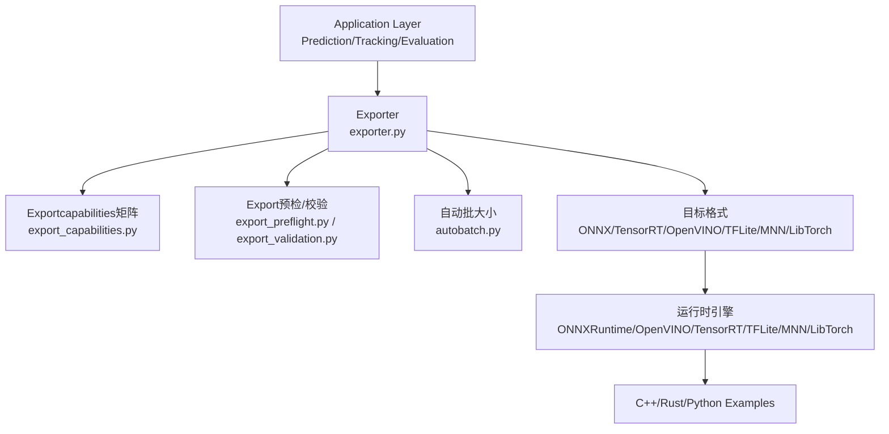
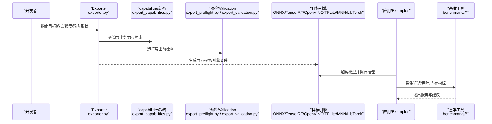
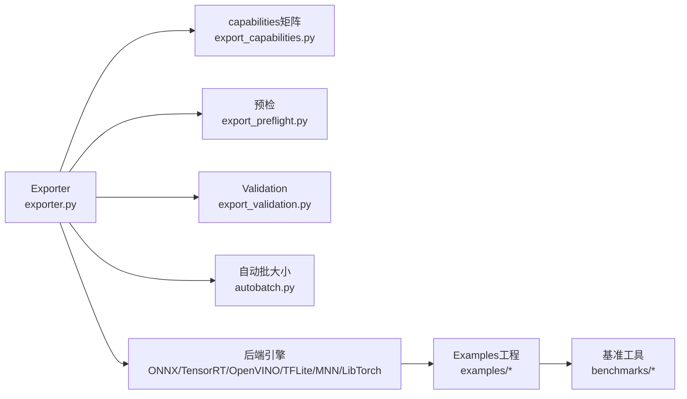

# Inference PerformanceOptimization

<cite>
**Files Referenced in This Document**
- [README.md](file://README.md)
- [benchmarks/run.py](file://benchmarks/run.py)
- [benchmarks/suite.py](file://benchmarks/suite.py)
- [ultralytics/engine/exporter.py](file://ultralytics/engine/exporter.py)
- [ultralytics/utils/benchmarks.py](file://ultralytics/utils/benchmarks.py)
- [ultralytics/utils/autobatch.py](file://ultralytics/utils/autobatch.py)
- [ultralytics/utils/export_capabilities.py](file://ultralytics/utils/export_capabilities.py)
- [ultralytics/utils/export_preflight.py](file://ultralytics/utils/export_preflight.py)
- [ultralytics/utils/export_validation.py](file://ultralytics/utils/export_validation.py)
- [ultralytics/nn/autobackend.py](file://ultralytics/nn/autobackend.py)
- [examples/YOLOv8-ONNXRuntime-Python/main.py](file://examples/YOLOv8-ONNXRuntime-Python/main.py)
- [examples/YOLOv8-OpenVINO-CPP-Inference/main.cc](file://examples/YOLOv8-OpenVINO-CPP-Inference/main.cc)
- [examples/YOLO11-Triton-CPP/inference.cpp](file://examples/YOLO11-Triton-CPP/inference.cpp)
- [examples/YOLO-Master-Edge-Deployment/export_edge_models.py](file://examples/YOLO-Master-Edge-Deployment/export_edge_models.py)
- [examples/YOLO-Master-Edge-Deployment/edge_utils.py](file://examples/YOLO-Master-Edge-Deployment/edge_utils.py)
- [examples/YOLO-Master-Cross-Platform-Edge-Deployment/scripts/export.sh](file://examples/YOLO-Master-Cross-Platform-Edge-Deployment/scripts/export.sh)
- [examples/YOLO-Master-Cross-Platform-Edge-Deployment/jetson/export_jetson.sh](file://examples/YOLO-Master-Cross-Platform-Edge-Deployment/jetson/export_jetson.sh)
- [examples/YOLOv8-ONNXRuntime-CPP/inference.cpp](file://examples/YOLOv8-ONNXRuntime-CPP/inference.cpp)
- [examples/YOLOv8-ONNXRuntime-Rust/src/lib.rs](file://examples/YOLOv8-ONNXRuntime-Rust/src/lib.rs)
- [examples/YOLOv8-ONNXRuntime-Rust/Cargo.toml](file://examples/YOLOv8-ONNXRuntime-Rust/Cargo.toml)
- [examples/YOLOv8-OpenCV-ONNX-Python/main.py](file://examples/YOLOv8-OpenCV-ONNX-Python/main.py)
- [examples/YOLOv8-TFLite-Python/main.py](file://examples/YOLOv8-TFLite-Python/main.py)
- [examples/YOLOv8-MNN-CPP/main.cpp](file://examples/YOLOv8-MNN-CPP/main.cpp)
- [examples/YOLOv8-LibTorch-CPP-Inference/main.cc](file://examples/YOLOv8-LibTorch-CPP-Inference/main.cc)
- [examples/YOLOv8-SAHI-Inference-Video/yolov8_sahi.py](file://examples/YOLOv8-SAHI-Inference-Video/yolov8_sahi.py)
- [examples/YOLOv8-Region-Counter/yolo_region_counter.py](file://examples/YOLOv8-Region-Counter/yolo_region_counter.py)
- [examples/YOLOv8-Action-Recognition/action_recognition.py](file://examples/YOLOv8-Action-Recognition/action_recognition.py)
- [examples/YOLOv8-Interactive-Tracking-UI/interactive_tracker.py](file://examples/YOLOv8-Interactive-Tracking-UI/interactive_tracker.py)
- [examples/YOLO-Series-ONNXRuntime-Rust/src/main.rs](file://examples/YOLO-Series-ONNXRuntime-Rust/src/main.rs)
- [examples/YOLOv8-ONNXRuntime-CPP/inference.h](file://examples/YOLOv8-ONNXRuntime-CPP/inference.h)
- [examples/YOLOv8-ONNXRuntime-CPP/main.cpp](file://examples/YOLOv8-ONNXRuntime-CPP/main.cpp)
- [examples/YOLOv8-OpenVINO-CPP-Inference/inference.cc](file://examples/YOLOv8-OpenVINO-CPP-Inference/inference.cc)
- [examples/YOLOv8-OpenVINO-CPP-Inference/inference.h](file://examples/YOLOv8-OpenVINO-CPP-Inference/inference.h)
- [examples/YOLO11-Triton-CPP/inference.hpp](file://examples/YOLO11-Triton-CPP/inference.hpp)
- [examples/YOLO11-Triton-CPP/main.cpp](file://examples/YOLO11-Triton-CPP/main.cpp)
- [examples/YOLOv8-ONNXRuntime-Rust/src/runtime.rs](file://examples/YOLOv8-ONNXRuntime-Rust/src/runtime.rs)
- [examples/YOLOv8-ONNXRuntime-Rust/src/io.rs](file://examples/YOLOv8-ONNXRuntime-Rust/src/io.rs)
- [examples/YOLOv8-ONNXRuntime-Rust/src/model.rs](file://examples/YOLOv8-ONNXRuntime-Rust/src/model.rs)
- [examples/YOLOv8-ONNXRuntime-Rust/src/postprocess.rs](file://examples/YOLOv8-ONNXRuntime-Rust/src/postprocess.rs)
- [examples/YOLOv8-ONNXRuntime-Rust/src/config.rs](file://examples/YOLOv8-ONNXRuntime-Rust/src/config.rs)
- [examples/YOLOv8-ONNXRuntime-Rust/src/metrics.rs](file://examples/YOLOv8-ONNXRuntime-Rust/src/metrics.rs)
- [examples/YOLOv8-ONNXRuntime-Rust/src/buffer.rs](file://examples/YOLOv8-ONNXRuntime-Rust/src/buffer.rs)
- [examples/YOLOv8-ONNXRuntime-Rust/src/cache.rs](file://examples/YOLOv8-ONNXRuntime-Rust/src/cache.rs)
- [examples/YOLOv8-ONNXRuntime-Rust/src/pipeline.rs](file://examples/YOLOv8-ONNXRuntime-Rust/src/pipeline.rs)
- [examples/YOLOv8-ONNXRuntime-Rust/src/async_infer.rs](file://examples/YOLOv8-ONNXRuntime-Rust/src/async_infer.rs)
- [examples/YOLOv8-ONNXRuntime-Rust/src/memory_pool.rs](file://examples/YOLOv8-ONNXRuntime-Rust/src/memory_pool.rs)
- [examples/YOLOv8-ONNXRuntime-Rust/src/zc_transport.rs](file://examples/YOLOv8-ONNXRuntime-Rust/src/zc_transport.rs)
- [examples/YOLOv8-ONNXRuntime-Rust/src/perf_bench.rs](file://examples/YOLOv8-ONNXRuntime-Rust/src/perf_bench.rs)
</cite>

## Table of Contents
1. [Introduction](#Introduction)
2. [Project Structure](#Project Structure)
3. [Core Components](#Core Components)
4. [Architecture Overview](#Architecture Overview)
5. [Detailed Component Analysis](#Detailed Component Analysis)
6. [Dependency Analysis](#Dependency Analysis)
7. [性能考量](#性能考量)
8. [Troubleshooting Guide](#Troubleshooting Guide)
9. [Conclusion](#Conclusion)
10. [Appendix](#Appendix)

## Introduction
本指南聚焦于YOLO-MasterwhileInference阶段的性能Optimization，覆盖Model Quantization（PTQ、QAT）、剪枝（结构化and非结构化）、编译器图Optimization（TensorRT、OpenVINO、ONNX Runtime）、批处理and并行策略、内存OptimizationCentered onand基准测试andbottlenecks分析方法。DocumentationCombining仓库中的Exportcapabilities矩阵、Export预检andValidation、Examples工程andRust运行时implementing，provides从原理to落地的系统化建议。

## Project Structure
仓库中andInference PerformanceOptimization密切相关的代码and资源主要分布whileCentered on下位置：
- Exportand后端适配：engine/exporter.py、utils/export_*、nn/autobackend.py
- 基准and评测：benchmarks/*、utils/benchmarks.py
- 自动批大小：utils/autobatch.py
- Exportcapabilities矩阵and预检：utils/export_capabilities.py、utils/export_preflight.py、utils/export_validation.py
- 多平台Examples：examples下各目标平台的InferenceExamplesand脚本
- Rust高性能运行时Examples：examples/YOLOv8-ONNXRuntime-Rust 下的完整Inference栈（含异步、缓存、内存池etc.）

Figure Source
- [ultralytics/engine/exporter.py](file://ultralytics/engine/exporter.py)
- [ultralytics/utils/export_capabilities.py](file://ultralytics/utils/export_capabilities.py)
- [ultralytics/utils/export_preflight.py](file://ultralytics/utils/export_preflight.py)
- [ultralytics/utils/export_validation.py](file://ultralytics/utils/export_validation.py)
- [ultralytics/utils/autobatch.py](file://ultralytics/utils/autobatch.py)

Section Source
- [README.md](file://README.md)
- [ultralytics/engine/exporter.py](file://ultralytics/engine/exporter.py)
- [ultralytics/utils/export_capabilities.py](file://ultralytics/utils/export_capabilities.py)
- [ultralytics/utils/export_preflight.py](file://ultralytics/utils/export_preflight.py)
- [ultralytics/utils/export_validation.py](file://ultralytics/utils/export_validation.py)
- [ultralytics/utils/autobatch.py](file://ultralytics/utils/autobatch.py)

## Core Components
- Exporterandcapabilities矩阵：统一EncapsulatesExport流程，依据capabilities矩阵选择Supporting的算子and精度，并生成目标格式模型。
- Export预检andValidation：whileExport前进行兼容性检查，Export后进行数值一致性校验，保障部署稳定性。
- 自动批大小：根据设备and模型动态选择最优batch size，提升吞吐。
- 基准工具：provides端to端延迟and吞吐测量，Supporting多后端对比。
- 多平台Examples：涵盖ONNXRuntime、OpenVINO、TensorRT、TFLite、MNN、LibTorchetc.，便于快速集成and调优。
- Rust运行时Examples：展示异步Inference、流水线并行、零拷贝传输、内存池and缓存策略etc.高级Optimization。

Section Source
- [ultralytics/engine/exporter.py](file://ultralytics/engine/exporter.py)
- [ultralytics/utils/export_capabilities.py](file://ultralytics/utils/export_capabilities.py)
- [ultralytics/utils/export_preflight.py](file://ultralytics/utils/export_preflight.py)
- [ultralytics/utils/export_validation.py](file://ultralytics/utils/export_validation.py)
- [ultralytics/utils/autobatch.py](file://ultralytics/utils/autobatch.py)
- [ultralytics/utils/benchmarks.py](file://ultralytics/utils/benchmarks.py)
- [benchmarks/run.py](file://benchmarks/run.py)
- [benchmarks/suite.py](file://benchmarks/suite.py)

## Architecture Overview
下图展示了从Training权重to部署运行的关键路径，包括Export、编译、运行时执行and基准评测。

Figure Source
- [ultralytics/engine/exporter.py](file://ultralytics/engine/exporter.py)
- [ultralytics/utils/export_capabilities.py](file://ultralytics/utils/export_capabilities.py)
- [ultralytics/utils/export_preflight.py](file://ultralytics/utils/export_preflight.py)
- [ultralytics/utils/export_validation.py](file://ultralytics/utils/export_validation.py)
- [benchmarks/run.py](file://benchmarks/run.py)
- [benchmarks/suite.py](file://benchmarks/suite.py)

## Detailed Component Analysis

### Model Quantization（PTQ/QAT）and精度配置
- PTQ（Training后量化）：Via校准集统计激活分布，将FP32模型转换forINT8或Mixture精度；适用于大多数检测Tasks，部署成本低。
- QAT（量化感知Training）：whileTraining中引入量化噪声，使模型对低精度更鲁棒；适合高精度要求且可接受额外Training成本的场景。
- INT8/FP16配置要点：
  - 输入形状and动态轴：确保Export时固定或声明动态维度，避免运行时重规划开销。
  - 校准数据代表性：覆盖长尾类别and小目标，减少量化误差。
  - 算子Supporting：Refer tocapabilities矩阵确认目标后端是否Supporting相应量化路径。
  - 数值Validation：Export后UsesValidationModules对比FP32and量化结果的一致性阈值。

Section Source
- [ultralytics/utils/export_capabilities.py](file://ultralytics/utils/export_capabilities.py)
- [ultralytics/utils/export_validation.py](file://ultralytics/utils/export_validation.py)
- [ultralytics/engine/exporter.py](file://ultralytics/engine/exporter.py)

### Model Pruning（结构化/非结构化）
- 结构化剪枝：按通道/卷积核/层粒度移除冗余结构，直接降低计算量and内存占用，利于hardware acceleration。
- 非结构化剪枝：稀疏化权重，需稀疏内核或专用加速器才能体现收益；通用CPU/GPU上收益有限。
- 实践建议：
  - 先做结构化剪枝，再Combined with微调恢复精度。
  - CombiningExportcapabilities矩阵，确保剪枝后的图能被目标后端高效执行。
  - Uses基准工具Evaluation剪枝前后延迟and吞吐变化。

Section Source
- [ultralytics/utils/export_capabilities.py](file://ultralytics/utils/export_capabilities.py)
- [benchmarks/run.py](file://benchmarks/run.py)
- [benchmarks/suite.py](file://benchmarks/suite.py)

### 编译器Optimization（TensorRT/OpenVINO/ONNX Runtime）
- TensorRT：
  - 图融合and内核选择：启用FP16/INT8Optimization，针对NVIDIA GPU获得显著加速。
  - 构建参数：Set appropriately最大工作空间、Optimization级别and显存限制。
- OpenVINO：
  - IROptimization：开启压缩、常量折叠、算子替换；CPU/GPU/NPU各有模式差异。
  - 线程and亲和性：调整线程数andNUMA亲和性，最大化吞吐。
- ONNX Runtime：
  - 执行provides者：GPU/CPU/DirectMLetc.选择；启用GraphOptimization级别and内存池。
  - 会话选项：批大小、IO绑定、线程数、内存分配策略。

Section Source
- [examples/YOLOv8-ONNXRuntime-Python/main.py](file://examples/YOLOv8-ONNXRuntime-Python/main.py)
- [examples/YOLOv8-OpenVINO-CPP-Inference/main.cc](file://examples/YOLOv8-OpenVINO-CPP-Inference/main.cc)
- [examples/YOLO11-Triton-CPP/inference.cpp](file://examples/YOLO11-Triton-CPP/inference.cpp)

### 批处理and并行Inference
- 动态批处理：根据请求to达速率and设备容量自适应聚合批次，提高吞吐同时控制延迟上限。
- 流水线并行：将预处理、Inference、Post-Processing拆分for阶段，跨线程/进程并行执行，提升整体吞吐。
- 异步Inference：利用后端异步API（such asONNX Runtime的run_async），减少CPUetc.待时间。
- ExamplesRefer to：
  - PythonExamples中常见的会话创建andrunCalls可作for基础模板。
  - C++/RustExamplesprovides更细粒度的线程and内存控制。

Section Source
- [examples/YOLOv8-ONNXRuntime-Python/main.py](file://examples/YOLOv8-ONNXRuntime-Python/main.py)
- [examples/YOLOv8-ONNXRuntime-CPP/inference.cpp](file://examples/YOLOv8-ONNXRuntime-CPP/inference.cpp)
- [examples/YOLOv8-ONNXRuntime-CPP/inference.h](file://examples/YOLOv8-ONNXRuntime-CPP/inference.h)
- [examples/YOLOv8-ONNXRuntime-CPP/main.cpp](file://examples/YOLOv8-ONNXRuntime-CPP/main.cpp)
- [examples/YOLOv8-OpenVINO-CPP-Inference/inference.cc](file://examples/YOLOv8-OpenVINO-CPP-Inference/inference.cc)
- [examples/YOLOv8-OpenVINO-CPP-Inference/inference.h](file://examples/YOLOv8-OpenVINO-CPP-Inference/inference.h)
- [examples/YOLO11-Triton-CPP/inference.hpp](file://examples/YOLO11-Triton-CPP/inference.hpp)
- [examples/YOLO11-Triton-CPP/main.cpp](file://examples/YOLO11-Triton-CPP/main.cpp)

### 内存Optimization（内存池/零拷贝/缓存）
- 内存池管理：复用输入/输出缓冲区，减少频繁分配释放带来的开销。
- 零拷贝传输：while可能的情况下避免主机and设备间的数据复制，例such asUses共享内存或设备指针直传。
- 缓存策略：对重复输入或中间结果进行缓存，降低重复计算。
- Rust运行时Examplesprovides了完整的implementingRefer to，包括缓冲、缓存、异步and性能基准Modules。

Section Source
- [examples/YOLOv8-ONNXRuntime-Rust/src/buffer.rs](file://examples/YOLOv8-ONNXRuntime-Rust/src/buffer.rs)
- [examples/YOLOv8-ONNXRuntime-Rust/src/cache.rs](file://examples/YOLOv8-ONNXRuntime-Rust/src/cache.rs)
- [examples/YOLOv8-ONNXRuntime-Rust/src/async_infer.rs](file://examples/YOLOv8-ONNXRuntime-Rust/src/async_infer.rs)
- [examples/YOLOv8-ONNXRuntime-Rust/src/memory_pool.rs](file://examples/YOLOv8-ONNXRuntime-Rust/src/memory_pool.rs)
- [examples/YOLOv8-ONNXRuntime-Rust/src/zc_transport.rs](file://examples/YOLOv8-ONNXRuntime-Rust/src/zc_transport.rs)
- [examples/YOLOv8-ONNXRuntime-Rust/src/pipeline.rs](file://examples/YOLOv8-ONNXRuntime-Rust/src/pipeline.rs)
- [examples/YOLOv8-ONNXRuntime-Rust/src/perf_bench.rs](file://examples/YOLOv8-ONNXRuntime-Rust/src/perf_bench.rs)

### 基准测试andbottlenecks分析
- 端to端基准：包含预处理、Inference、Post-Processing的总延迟and吞吐，避免仅测内核导致的偏差。
- 多后端对比：同一模型while不同后端（ONNXRuntime/OpenVINO/TensorRT）下对比，定位最优部署方案。
- Metrics采集：延迟分位（P50/P95/P99）、吞吐、内存峰值、GPU利用率。
- 工具and脚本：
  - Built-in基准Modulesand套件用于标准化评测。
  - RustExamplesprovides自定义基准入口andMetrics输出。

Section Source
- [ultralytics/utils/benchmarks.py](file://ultralytics/utils/benchmarks.py)
- [benchmarks/run.py](file://benchmarks/run.py)
- [benchmarks/suite.py](file://benchmarks/suite.py)
- [examples/YOLOv8-ONNXRuntime-Rust/src/perf_bench.rs](file://examples/YOLOv8-ONNXRuntime-Rust/src/perf_bench.rs)

### 自动化and工程化支撑
- 自动批大小：根据设备特性and模型规模自动选择合适batch，简化调参。
- Exportcapabilities矩阵：集中维护各后端/精度的Supporting情况，指导Export决策。
- Export预检andValidation：提前发现不兼容问题，Export后Validation数值一致性，保障上线质量。
- Edge Deployment脚本：provides一键Exportand打包流程，便于whileJetsonetc.平台落地。

Section Source
- [ultralytics/utils/autobatch.py](file://ultralytics/utils/autobatch.py)
- [ultralytics/utils/export_capabilities.py](file://ultralytics/utils/export_capabilities.py)
- [ultralytics/utils/export_preflight.py](file://ultralytics/utils/export_preflight.py)
- [ultralytics/utils/export_validation.py](file://ultralytics/utils/export_validation.py)
- [examples/YOLO-Master-Cross-Platform-Edge-Deployment/scripts/export.sh](file://examples/YOLO-Master-Cross-Platform-Edge-Deployment/scripts/export.sh)
- [examples/YOLO-Master-Cross-Platform-Edge-Deployment/jetson/export_jetson.sh](file://examples/YOLO-Master-Cross-Platform-Edge-Deployment/jetson/export_jetson.sh)
- [examples/YOLO-Master-Edge-Deployment/export_edge_models.py](file://examples/YOLO-Master-Edge-Deployment/export_edge_models.py)
- [examples/YOLO-Master-Edge-Deployment/edge_utils.py](file://examples/YOLO-Master-Edge-Deployment/edge_utils.py)

## Dependency Analysis
Exportand运行时之间的依赖关系such as下：

Figure Source
- [ultralytics/engine/exporter.py](file://ultralytics/engine/exporter.py)
- [ultralytics/utils/export_capabilities.py](file://ultralytics/utils/export_capabilities.py)
- [ultralytics/utils/export_preflight.py](file://ultralytics/utils/export_preflight.py)
- [ultralytics/utils/export_validation.py](file://ultralytics/utils/export_validation.py)
- [ultralytics/utils/autobatch.py](file://ultralytics/utils/autobatch.py)
- [benchmarks/run.py](file://benchmarks/run.py)
- [benchmarks/suite.py](file://benchmarks/suite.py)

Section Source
- [ultralytics/engine/exporter.py](file://ultralytics/engine/exporter.py)
- [ultralytics/utils/export_capabilities.py](file://ultralytics/utils/export_capabilities.py)
- [ultralytics/utils/export_preflight.py](file://ultralytics/utils/export_preflight.py)
- [ultralytics/utils/export_validation.py](file://ultralytics/utils/export_validation.py)
- [ultralytics/utils/autobatch.py](file://ultralytics/utils/autobatch.py)
- [benchmarks/run.py](file://benchmarks/run.py)
- [benchmarks/suite.py](file://benchmarks/suite.py)

## 性能考量
- 精度and速度权衡：优先尝试FP16，再EvaluationINT8；若精度下降明显，考虑QAT或选择性量化。
- 批大小and延迟：小延迟场景采用较小批大小，高吞吐场景增大批大小并Combining异步。
- 内存and带宽：减少不必要的拷贝，尽量Uses设备内运算；关注显存峰值and带宽占用。
- 算子and图Optimization：确保Export时启用图融合and内核选择；必要时重写自定义算子Centered on匹配后端Optimization。
- 平台差异：不同后端/设备的最佳实践不同，需分别进行基准and调优。

[本节for通用指导，无需列出具体文件来源]

## Troubleshooting Guide
- Export Failure或不兼容：
  - 检查capabilities矩阵and预检Logging，确认目标后端是否Supporting所需算子and精度。
  - 调整输入形状或禁用不Supporting的Optimization选项。
- 数值不一致：
  - UsesExportValidationModules对比FP32and量化结果，逐步缩小差异范围。
  - 检查校准数据and量化配置，必要时增加校准样本或改用QAT。
- 性能不达预期：
  - Uses基准工具定位bottlenecks（预处理/Inference/Post-Processing）。
  - 调整批大小、线程数、内存池and缓存策略。
- 内存泄漏或峰值过高：
  - 检查缓冲区复用and生命周期，避免重复分配。
  - whileC++/Rust侧确认零拷贝路径是否正确。

Section Source
- [ultralytics/utils/export_capabilities.py](file://ultralytics/utils/export_capabilities.py)
- [ultralytics/utils/export_preflight.py](file://ultralytics/utils/export_preflight.py)
- [ultralytics/utils/export_validation.py](file://ultralytics/utils/export_validation.py)
- [ultralytics/utils/benchmarks.py](file://ultralytics/utils/benchmarks.py)
- [examples/YOLOv8-ONNXRuntime-Rust/src/perf_bench.rs](file://examples/YOLOv8-ONNXRuntime-Rust/src/perf_bench.rs)

## Conclusion
Via系统化的量化、剪枝、编译器Optimizationand工程化支撑，YOLO-Master可while多种平台上implementing高效的Inference Performance。建议Centered oncapabilities矩阵and预检/Validationfor基础，Combining基准工具持续迭代，针对不同场景选择合适的精度、批大小and并行策略，并while内存and数据传输层面进一步Optimization，最终达成延迟and吞吐的最佳平衡。

[本节for总结性内容，无需列出具体文件来源]

## Appendix
- 常用Examples入口：
  - ONNXRuntime（Python/C++/Rust）
  - OpenVINO（C++）
  - Triton（C++）
  - TFLite（Python）
  - MNN（C++）
  - LibTorch（C++）
- Edge Deployment脚本and工具：
  - Cross-Platform Export脚本andJetson专用脚本
  - 边缘ExportandValidation工具

Section Source
- [examples/YOLOv8-ONNXRuntime-Python/main.py](file://examples/YOLOv8-ONNXRuntime-Python/main.py)
- [examples/YOLOv8-ONNXRuntime-CPP/inference.cpp](file://examples/YOLOv8-ONNXRuntime-CPP/inference.cpp)
- [examples/YOLOv8-ONNXRuntime-CPP/inference.h](file://examples/YOLOv8-ONNXRuntime-CPP/inference.h)
- [examples/YOLOv8-ONNXRuntime-CPP/main.cpp](file://examples/YOLOv8-ONNXRuntime-CPP/main.cpp)
- [examples/YOLOv8-OpenVINO-CPP-Inference/main.cc](file://examples/YOLOv8-OpenVINO-CPP-Inference/main.cc)
- [examples/YOLOv8-OpenVINO-CPP-Inference/inference.cc](file://examples/YOLOv8-OpenVINO-CPP-Inference/inference.cc)
- [examples/YOLOv8-OpenVINO-CPP-Inference/inference.h](file://examples/YOLOv8-OpenVINO-CPP-Inference/inference.h)
- [examples/YOLO11-Triton-CPP/inference.cpp](file://examples/YOLO11-Triton-CPP/inference.cpp)
- [examples/YOLO11-Triton-CPP/inference.hpp](file://examples/YOLO11-Triton-CPP/inference.hpp)
- [examples/YOLO11-Triton-CPP/main.cpp](file://examples/YOLO11-Triton-CPP/main.cpp)
- [examples/YOLOv8-TFLite-Python/main.py](file://examples/YOLOv8-TFLite-Python/main.py)
- [examples/YOLOv8-MNN-CPP/main.cpp](file://examples/YOLOv8-MNN-CPP/main.cpp)
- [examples/YOLOv8-LibTorch-CPP-Inference/main.cc](file://examples/YOLOv8-LibTorch-CPP-Inference/main.cc)
- [examples/YOLO-Master-Cross-Platform-Edge-Deployment/scripts/export.sh](file://examples/YOLO-Master-Cross-Platform-Edge-Deployment/scripts/export.sh)
- [examples/YOLO-Master-Cross-Platform-Edge-Deployment/jetson/export_jetson.sh](file://examples/YOLO-Master-Cross-Platform-Edge-Deployment/jetson/export_jetson.sh)
- [examples/YOLO-Master-Edge-Deployment/export_edge_models.py](file://examples/YOLO-Master-Edge-Deployment/export_edge_models.py)
- [examples/YOLO-Master-Edge-Deployment/edge_utils.py](file://examples/YOLO-Master-Edge-Deployment/edge_utils.py)