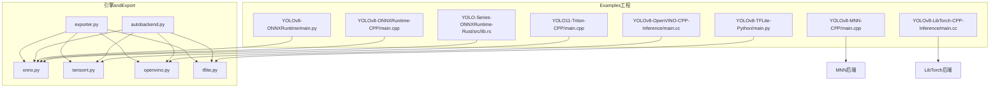
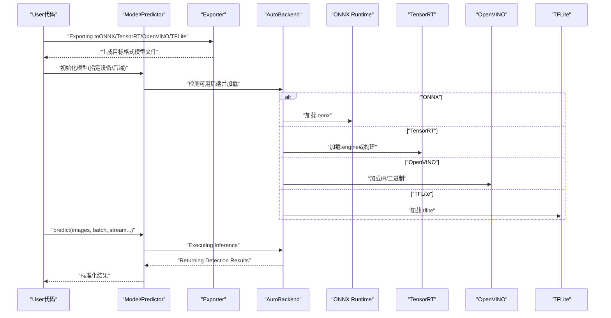
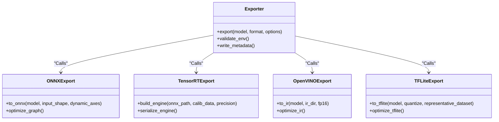
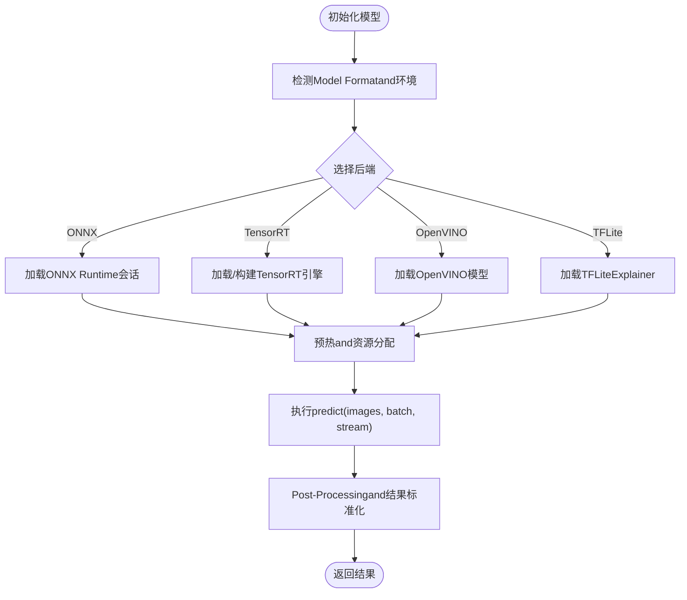
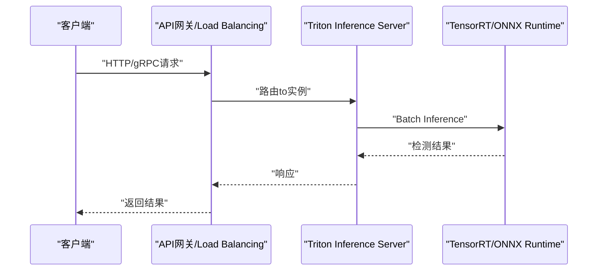
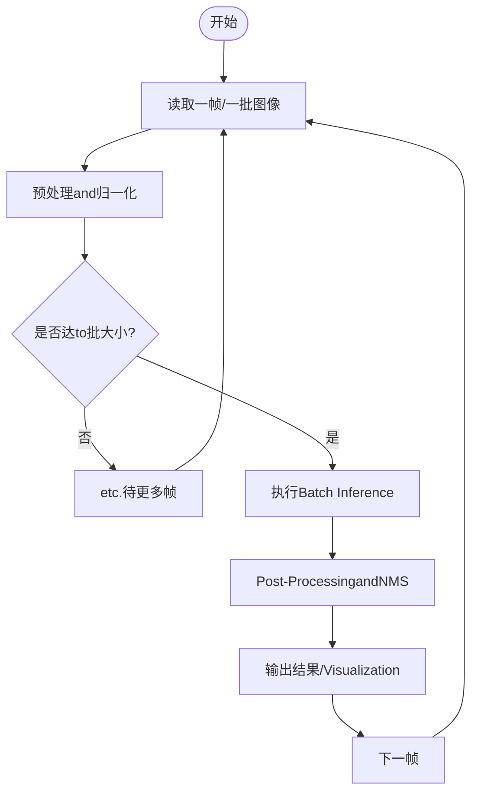
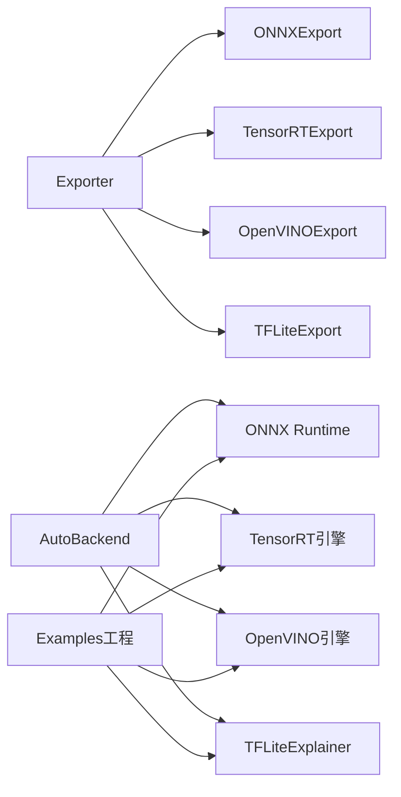

# Inference and Deployment Tutorial

<cite>
**Files Referenced in This Document**
- [README.md](file://README.md)
- [pyproject.toml](file://pyproject.toml)
- [ultralytics/engine/exporter.py](file://ultralytics/engine/exporter.py)
- [ultralytics/utils/export/__init__.py](file://ultralytics/utils/export/__init__.py)
- [ultralytics/utils/export/onnx.py](file://ultralytics/utils/export/onnx.py)
- [ultralytics/utils/export/tensorrt.py](file://ultralytics/utils/export/tensorrt.py)
- [ultralytics/utils/export/openvino.py](file://ultralytics/utils/export/openvino.py)
- [ultralytics/utils/export/tflite.py](file://ultralytics/utils/export/tflite.py)
- [ultralytics/nn/autobackend.py](file://ultralytics/nn/autobackend.py)
- [ultralytics/engine/predictor.py](file://ultralytics/engine/predictor.py)
- [ultralytics/engine/model.py](file://ultralytics/engine/model.py)
- [examples/YOLO-Master-Cross-Platform-Edge-Deployment/TECHNICAL_REPORT.md](file://examples/YOLO-Master-Cross-Platform-Edge-Deployment/TECHNICAL_REPORT.md)
- [examples/YOLO-Master-Edge-Deployment/export_edge_models.py](file://examples/YOLO-Master-Edge-Deployment/export_edge_models.py)
- [examples/YOLOv8-TFLite-Python/main.py](file://examples/YOLOv8-TFLite-Python/main.py)
- [examples/YOLOv8-OpenVINO-CPP-Inference/main.cc](file://examples/YOLOv8-OpenVINO-CPP-Inference/main.cc)
- [examples/YOLO11-Triton-CPP/inference.cpp](file://examples/YOLO11-Triton-CPP/inference.cpp)
- [examples/YOLOv8-ONNXRuntime/main.py](file://examples/YOLOv8-ONNXRuntime/main.py)
- [examples/YOLOv8-ONNXRuntime-CPP/inference.h](file://examples/YOLOv8-ONNXRuntime-CPP/inference.h)
- [examples/YOLOv8-ONNXRuntime-Rust/src/lib.rs](file://examples/YOLOv8-ONNXRuntime-Rust/src/lib.rs)
- [examples/YOLOv8-OpenCV-ONNX-Python/main.py](file://examples/YOLOv8-OpenCV-ONNX-Python/main.py)
- [examples/YOLOv8-MNN-CPP/main.cpp](file://examples/YOLOv8-MNN-CPP/main.cpp)
- [examples/YOLOv8-LibTorch-CPP-Inference/main.cc](file://examples/YOLOv8-LibTorch-CPP-Inference/main.cc)
- [examples/YOLO-Series-ONNXRuntime-Rust/src/lib.rs](file://examples/YOLO-Series-ONNXRuntime-Rust/src/lib.rs)
- [examples/YOLO-Axelera-Python/yolo26-pose-tracker.py](file://examples/YOLO-Axelera-Python/yolo26-pose-tracker.py)
- [examples/YOLOv8-SAHI-Inference-Video/yolov8_sahi.py](file://examples/YOLOv8-SAHI-Inference-Video/yolov8_sahi.py)
- [examples/YOLOv8-Action-Recognition/action_recognition.py](file://examples/YOLOv8-Action-Recognition/action_recognition.py)
- [examples/YOLOv8-Region-Counter/yolov8_region_counter.py](file://examples/YOLOv8-Region-Counter/yolov8_region_counter.py)
- [examples/YOLOv8-Segmentation-ONNXRuntime-Python/main.py](file://examples/YOLOv8-Segmentation-ONNXRuntime-Python/main.py)
- [examples/YOLOv8-CPP-Inference/inference.h](file://examples/YOLOv8-CPP-Inference/inference.h)
- [examples/YOLOv8-CPP-Inference/main.cpp](file://examples/YOLOv8-CPP-Inference/main.cpp)
- [examples/YOLOv8-LibTorch-CPP-Inference/CMakeLists.txt](file://examples/YOLOv8-LibTorch-CPP-Inference/CMakeLists.txt)
- [examples/YOLOv8-OpenVINO-CPP-Inference/inference.h](file://examples/YOLOv8-OpenVINO-CPP-Inference/inference.h)
- [examples/YOLOv8-OpenVINO-CPP-Inference/inference.cc](file://examples/YOLOv8-OpenVINO-CPP-Inference/inference.cc)
- [examples/YOLOv8-ONNXRuntime-CPP/inference.cpp](file://examples/YOLOv8-ONNXRuntime-CPP/inference.cpp)
- [examples/YOLOv8-ONNXRuntime-CPP/main.cpp](file://examples/YOLOv8-ONNXRuntime-CPP/main.cpp)
- [examples/YOLOv8-ONNXRuntime-Rust/Cargo.toml](file://examples/YOLOv8-ONNXRuntime-Rust/Cargo.toml)
- [examples/YOLO-Series-ONNXRuntime-Rust/Cargo.toml](file://examples/YOLO-Series-ONNXRuntime-Rust/Cargo.toml)
- [examples/YOLOv8-MNN-CPP/CMakeLists.txt](file://examples/YOLOv8-MNN-CPP/CMakeLists.txt)
- [examples/YOLOv8-LibTorch-CPP-Inference/README.md](file://examples/YOLOv8-LibTorch-CPP-Inference/README.md)
- [examples/YOLOv8-OpenVINO-CPP-Inference/README.md](file://examples/YOLOv8-OpenVINO-CPP-Inference/README.md)
- [examples/YOLOv8-ONNXRuntime-CPP/README.md](file://examples/YOLOv8-ONNXRuntime-CPP/README.md)
- [examples/YOLOv8-ONNXRuntime-Rust/README.md](file://examples/YOLOv8-ONNXRuntime-Rust/README.md)
- [examples/YOLOv8-MNN-CPP/README.md](file://examples/YOLOv8-MNN-CPP/README.md)
- [examples/YOLO11-Triton-CPP/README.md](file://examples/YOLO11-Triton-CPP/README.md)
- [examples/YOLO11-Triton-CPP/CMakeLists.txt](file://examples/YOLO11-Triton-CPP/CMakeLists.txt)
- [examples/YOLO11-Triton-CPP/main.cpp](file://examples/YOLO11-Triton-CPP/main.cpp)
- [examples/YOLOv8-ONNXRuntime/README.md](file://examples/YOLOv8-ONNXRuntime/README.md)
- [examples/YOLOv8-OpenCV-ONNX-Python/README.md](file://examples/YOLOv8-OpenCV-ONNX-Python/README.md)
- [examples/YOLOv8-TFLite-Python/README.md](file://examples/YOLOv8-TFLite-Python/README.md)
- [examples/YOLOv8-SAHI-Inference-Video/README.md](file://examples/YOLOv8-SAHI-Inference-Video/README.md)
- [examples/YOLOv8-Action-Recognition/README.md](file://examples/YOLOv8-Action-Recognition/README.md)
- [examples/YOLOv8-Region-Counter/README.md](file://examples/YOLOv8-Region-Counter/README.md)
- [examples/YOLOv8-Segmentation-ONNXRuntime-Python/README.md](file://examples/YOLOv8-Segmentation-ONNXRuntime-Python/README.md)
- [examples/YOLOv8-CPP-Inference/README.md](file://examples/YOLOv8-CPP-Inference/README.md)
- [examples/YOLO-Axelera-Python/README.md](file://examples/YOLO-Axelera-Python/README.md)
- [examples/YOLO-Master-Edge-Deployment/README.md](file://examples/YOLO-Master-Edge-Deployment/README.md)
- [examples/YOLO-Master-Cross-Platform-Edge-Deployment/README.md](file://examples/YOLO-Master-Cross-Platform-Edge-Deployment/README.md)
- [examples/YOLOv8-LibTorch-CPP-Inference/main.cc](file://examples/YOLOv8-LibTorch-CPP-Inference/main.cc)
</cite>

## Table of Contents
1. [Introduction](#Introduction)
2. [Project Structure](#Project Structure)
3. [Core Components](#Core Components)
4. [Architecture Overview](#Architecture Overview)
5. [Detailed Component Analysis](#Detailed Component Analysis)
6. [Dependency Analysis](#Dependency Analysis)
7. [Performance Considerations](#Performance Considerations)
8. [Troubleshooting Guide](#Troubleshooting Guide)
9. [Conclusion](#Conclusion)
10. [Appendix](#Appendix)

## Introduction
本教程targeting需要while多平台、多后端上高效部署YOLO-Master的Engineers，系统讲解Model Export（ONNX、TensorRT、OpenVINO、TFLiteetc.）、不同平台的部署策略（服务器、边缘、移动端）、InferenceOptimization（量化、剪枝、编译Optimization）、批量and流式处理、API服务化andLoad Balancing、结果缓存and内存管理，Centered onand生产监控and维护。内容基于仓库中的Exportcapabilities、Examples工程andDocumentation进行归纳总结，帮助读者快速落地从Trainingto生产的完整链路。

## Project Structure
仓库围绕“Training-Export-Inference-部署”的全流程组织：
- 引擎andExport：Export入口统一whileEngine Layer，具体后端implementing位于utils/export子Modules；自动后端加载器负责运行时选择最优执行器。
- Examples工程：provides多种语言/框架的Inferenceand部署Examples，覆盖Python、C++、Rust、Triton、OpenVINO、MNN、LibTorch、ONNX Runtime、TFLiteetc.。
- Documentationand指南：包含Cross-Platform Deployment、性能Optimization、监控维护etc.实践指南。

Figure Source
- [ultralytics/engine/exporter.py](file://ultralytics/engine/exporter.py)
- [ultralytics/utils/export/onnx.py](file://ultralytics/utils/export/onnx.py)
- [ultralytics/utils/export/tensorrt.py](file://ultralytics/utils/export/tensorrt.py)
- [ultralytics/utils/export/openvino.py](file://ultralytics/utils/export/openvino.py)
- [ultralytics/utils/export/tflite.py](file://ultralytics/utils/export/tflite.py)
- [ultralytics/nn/autobackend.py](file://ultralytics/nn/autobackend.py)
- [examples/YOLOv8-ONNXRuntime/main.py](file://examples/YOLOv8-ONNXRuntime/main.py)
- [examples/YOLOv8-ONNXRuntime-CPP/main.cpp](file://examples/YOLOv8-ONNXRuntime-CPP/main.cpp)
- [examples/YOLO-Series-ONNXRuntime-Rust/src/lib.rs](file://examples/YOLO-Series-ONNXRuntime-Rust/src/lib.rs)
- [examples/YOLO11-Triton-CPP/main.cpp](file://examples/YOLO11-Triton-CPP/main.cpp)
- [examples/YOLOv8-OpenVINO-CPP-Inference/main.cc](file://examples/YOLOv8-OpenVINO-CPP-Inference/main.cc)
- [examples/YOLOv8-TFLite-Python/main.py](file://examples/YOLOv8-TFLite-Python/main.py)
- [examples/YOLOv8-MNN-CPP/main.cpp](file://examples/YOLOv8-MNN-CPP/main.cpp)
- [examples/YOLOv8-LibTorch-CPP-Inference/main.cc](file://examples/YOLOv8-LibTorch-CPP-Inference/main.cc)

Section Source
- [README.md](file://README.md)
- [pyproject.toml](file://pyproject.toml)

## Core Components
- Exporter（Exporter）：统一EncapsulatesModel Export流程，Supporting多种目标格式and参数配置，是Exportcapabilities的中心入口。
- 自动后端（AutoBackend）：根据可用环境andModel Format，动态选择并加载合适的Inference后端（such asONNX Runtime、TensorRT、OpenVINO、TFLiteetc.）。
- Predictor（Predictor）：Encapsulates预处理、Inference、Post-Processing的流水线，适配不同后端andTasks类型。
- Examples工程：provides各后端的具体用法and集成方式，便于快速上手and二次开发。

Section Source
- [ultralytics/engine/exporter.py](file://ultralytics/engine/exporter.py)
- [ultralytics/nn/autobackend.py](file://ultralytics/nn/autobackend.py)
- [ultralytics/engine/predictor.py](file://ultralytics/engine/predictor.py)

## Architecture Overview
下图展示了从Model Exportto多后端Inference的整体架构，包括Export流程、自动后端选择、典型ExamplesCalls路径。

Figure Source
- [ultralytics/engine/exporter.py](file://ultralytics/engine/exporter.py)
- [ultralytics/nn/autobackend.py](file://ultralytics/nn/autobackend.py)
- [ultralytics/engine/predictor.py](file://ultralytics/engine/predictor.py)
- [examples/YOLOv8-ONNXRuntime/main.py](file://examples/YOLOv8-ONNXRuntime/main.py)
- [examples/YOLO11-Triton-CPP/main.cpp](file://examples/YOLO11-Triton-CPP/main.cpp)
- [examples/YOLOv8-OpenVINO-CPP-Inference/main.cc](file://examples/YOLOv8-OpenVINO-CPP-Inference/main.cc)
- [examples/YOLOv8-TFLite-Python/main.py](file://examples/YOLOv8-TFLite-Python/main.py)

## Detailed Component Analysis

### Exporterand后端implementing
- Exporter职责：解析Export参数、校验环境、Calls具体后端Export逻辑、输出产物and元数据。
- 后端implementing要点：
  - ONNX：图转换、算子兼容、动态形状、输入输出规范。
  - TensorRT：精度校准、布局Optimization、插件扩展、引擎序列化。
  - OpenVINO：IRExport、Optimization选项、CPU/GPU/NPU加速。
  - TFLite：量化、算子映射、Android/iOS部署。

Figure Source
- [ultralytics/engine/exporter.py](file://ultralytics/engine/exporter.py)
- [ultralytics/utils/export/onnx.py](file://ultralytics/utils/export/onnx.py)
- [ultralytics/utils/export/tensorrt.py](file://ultralytics/utils/export/tensorrt.py)
- [ultralytics/utils/export/openvino.py](file://ultralytics/utils/export/openvino.py)
- [ultralytics/utils/export/tflite.py](file://ultralytics/utils/export/tflite.py)

Section Source
- [ultralytics/engine/exporter.py](file://ultralytics/engine/exporter.py)
- [ultralytics/utils/export/__init__.py](file://ultralytics/utils/export/__init__.py)
- [ultralytics/utils/export/onnx.py](file://ultralytics/utils/export/onnx.py)
- [ultralytics/utils/export/tensorrt.py](file://ultralytics/utils/export/tensorrt.py)
- [ultralytics/utils/export/openvino.py](file://ultralytics/utils/export/openvino.py)
- [ultralytics/utils/export/tflite.py](file://ultralytics/utils/export/tflite.py)

### 自动后端andPredictor
- 自动后端：根据运行环境andModel Format选择最佳执行器，Encapsulates加载、预热、会话管理etc.细节。
- Predictor：Unified InterfaceEncapsulates预处理、Inference、Post-Processing，Supporting批量、流式、Tracking、分割etc.多种Tasks。

Figure Source
- [ultralytics/nn/autobackend.py](file://ultralytics/nn/autobackend.py)
- [ultralytics/engine/predictor.py](file://ultralytics/engine/predictor.py)

Section Source
- [ultralytics/nn/autobackend.py](file://ultralytics/nn/autobackend.py)
- [ultralytics/engine/predictor.py](file://ultralytics/engine/predictor.py)

### 多平台部署方案

#### 服务器端（GPU/多卡）
- 推荐后端：TensorRT（NVIDIA GPU）、ONNX Runtime（跨平台GPU/CPU）、OpenVINO（Intel CPU/GPU/NPU）。
- 关键Optimization：
  - UsesFP16/INT8精度and校准数据集提升吞吐。
  - 批处理and异步InferenceCombining，提高GPU利用率。
  - UsesTriton Inference Server进行服务化andLoad Balancing。

Figure Source
- [examples/YOLO11-Triton-CPP/main.cpp](file://examples/YOLO11-Triton-CPP/main.cpp)
- [examples/YOLO11-Triton-CPP/inference.cpp](file://examples/YOLO11-Triton-CPP/inference.cpp)
- [examples/YOLO11-Triton-CPP/CMakeLists.txt](file://examples/YOLO11-Triton-CPP/CMakeLists.txt)
- [examples/YOLO11-Triton-CPP/README.md](file://examples/YOLO11-Triton-CPP/README.md)

Section Source
- [examples/YOLO11-Triton-CPP/README.md](file://examples/YOLO11-Triton-CPP/README.md)
- [examples/YOLO11-Triton-CPP/main.cpp](file://examples/YOLO11-Triton-CPP/main.cpp)
- [examples/YOLO11-Triton-CPP/inference.cpp](file://examples/YOLO11-Triton-CPP/inference.cpp)
- [examples/YOLO11-Triton-CPP/CMakeLists.txt](file://examples/YOLO11-Triton-CPP/CMakeLists.txt)

#### 边缘设备（Jetson/RKNN/MNN）
- 推荐后端：TensorRT（Jetson）、RKNN（Rockchip）、MNN（通用边缘）。
- 关键Optimization：
  - INT8量化and静态形状减少内存占用。
  - Uses专用工具链（such asJetPack、rknn-toolkit）构建Optimization引擎。
  - 控制并发and线程数，避免抢占系统资源。

Section Source
- [examples/YOLO-Master-Edge-Deployment/README.md](file://examples/YOLO-Master-Edge-Deployment/README.md)
- [examples/YOLO-Master-Edge-Deployment/export_edge_models.py](file://examples/YOLO-Master-Edge-Deployment/export_edge_models.py)
- [examples/YOLOv8-MNN-CPP/README.md](file://examples/YOLOv8-MNN-CPP/README.md)
- [examples/YOLOv8-MNN-CPP/main.cpp](file://examples/YOLOv8-MNN-CPP/main.cpp)
- [examples/YOLOv8-MNN-CPP/CMakeLists.txt](file://examples/YOLOv8-MNN-CPP/CMakeLists.txt)

#### 移动端（iOS/Android）
- 推荐后端：CoreML（iOS）、TFLite（Android/iOS）。
- 关键Optimization：
  - Uses代表性数据集进行量化校准。
  - 限制输入分辨率and类别数量，降低计算量。
  - 利用平台原生库（Core ML、MediaPipe）加速。

Section Source
- [examples/YOLOv8-TFLite-Python/README.md](file://examples/YOLOv8-TFLite-Python/README.md)
- [examples/YOLOv8-TFLite-Python/main.py](file://examples/YOLOv8-TFLite-Python/main.py)
- [examples/YOLO-Master-Cross-Platform-Edge-Deployment/README.md](file://examples/YOLO-Master-Cross-Platform-Edge-Deployment/README.md)
- [examples/YOLO-Master-Cross-Platform-Edge-Deployment/TECHNICAL_REPORT.md](file://examples/YOLO-Master-Cross-Platform-Edge-Deployment/TECHNICAL_REPORT.md)

### Inference PerformanceOptimization技术
- Model Quantization：INT8/FP16显著降低延迟and内存占用，需准备校准数据集保证精度。
- 剪枝and稀疏化：针对MoE/Mixture专家场景，可Combining路由器and专家裁剪策略。
- 编译Optimization：TensorRT/ONNX Runtime/OpenVINO的图Optimization、内核融合、内存复用。
- 动态形状and批处理：Set appropriately动态轴and批大小，平衡吞吐and延迟。

Section Source
- [ultralytics/utils/export/tensorrt.py](file://ultralytics/utils/export/tensorrt.py)
- [ultralytics/utils/export/onnx.py](file://ultralytics/utils/export/onnx.py)
- [ultralytics/utils/export/openvino.py](file://ultralytics/utils/export/openvino.py)
- [ultralytics/utils/export/tflite.py](file://ultralytics/utils/export/tflite.py)

### Batch Inferenceand流式处理
- Batch Inference：将多帧或多图像合并for批次，提升GPU利用率；注意内存峰值and超时控制。
- 流式处理：视频流逐帧Inference，CombiningSAHI切片Inference提升小Object Detection效果。

Figure Source
- [examples/YOLOv8-SAHI-Inference-Video/yolov8_sahi.py](file://examples/YOLOv8-SAHI-Inference-Video/yolov8_sahi.py)
- [examples/YOLOv8-Action-Recognition/action_recognition.py](file://examples/YOLOv8-Action-Recognition/action_recognition.py)
- [examples/YOLOv8-Region-Counter/yolov8_region_counter.py](file://examples/YOLOv8-Region-Counter/yolov8_region_counter.py)

Section Source
- [examples/YOLOv8-SAHI-Inference-Video/README.md](file://examples/YOLOv8-SAHI-Inference-Video/README.md)
- [examples/YOLOv8-SAHI-Inference-Video/yolov8_sahi.py](file://examples/YOLOv8-SAHI-Inference-Video/yolov8_sahi.py)
- [examples/YOLOv8-Action-Recognition/README.md](file://examples/YOLOv8-Action-Recognition/README.md)
- [examples/YOLOv8-Action-Recognition/action_recognition.py](file://examples/YOLOv8-Action-Recognition/action_recognition.py)
- [examples/YOLOv8-Region-Counter/README.md](file://examples/YOLOv8-Region-Counter/README.md)
- [examples/YOLOv8-Region-Counter/yolov8_region_counter.py](file://examples/YOLOv8-Region-Counter/yolov8_region_counter.py)

### API服务化andLoad Balancing
- 服务化：UsesFastAPI/Flask或Triton Inference Server暴露REST/gRPC接口。
- Load Balancing：多实例部署+反向代理（Nginx/Kong），按QPS/延迟自适应扩缩容。
- 健康检查and灰度发布：Via探针and健康检查保障稳定性。

Section Source
- [examples/YOLO11-Triton-CPP/README.md](file://examples/YOLO11-Triton-CPP/README.md)
- [examples/YOLO11-Triton-CPP/main.cpp](file://examples/YOLO11-Triton-CPP/main.cpp)

### Inference结果缓存and内存管理
- 结果缓存：对重复输入或相似帧采用哈希键缓存，减少重复计算。
- 内存管理：对象池复用输入缓冲区，避免频繁分配；and时释放中间张量。
- 监控Metrics：记录P95/P99延迟、吞吐、内存峰值、错误率。

Section Source
- [ultralytics/engine/predictor.py](file://ultralytics/engine/predictor.py)
- [ultralytics/nn/autobackend.py](file://ultralytics/nn/autobackend.py)

### 生产环境的监控and维护
- 监控：Prometheus+Grafana采集延迟、吞吐、资源Uses；Logging集中收集。
- 告警：阈值告警（延迟、错误率、OOM）and自动恢复。
- 版本管理：模型and配置版本化，Supporting回滚andA/B测试。

Section Source
- [examples/YOLO-Master-Cross-Platform-Edge-Deployment/TECHNICAL_REPORT.md](file://examples/YOLO-Master-Cross-Platform-Edge-Deployment/TECHNICAL_REPORT.md)

## Dependency Analysis
- Exporter依赖各后端Exportimplementing，自动后端依赖运行时环境探测and加载逻辑。
- Examples工程直接依赖对应后端SDK（ONNX Runtime、TensorRT、OpenVINO、TFLite、MNN、LibTorch）。

Figure Source
- [ultralytics/engine/exporter.py](file://ultralytics/engine/exporter.py)
- [ultralytics/nn/autobackend.py](file://ultralytics/nn/autobackend.py)
- [examples/YOLOv8-ONNXRuntime/main.py](file://examples/YOLOv8-ONNXRuntime/main.py)
- [examples/YOLO11-Triton-CPP/main.cpp](file://examples/YOLO11-Triton-CPP/main.cpp)
- [examples/YOLOv8-OpenVINO-CPP-Inference/main.cc](file://examples/YOLOv8-OpenVINO-CPP-Inference/main.cc)
- [examples/YOLOv8-TFLite-Python/main.py](file://examples/YOLOv8-TFLite-Python/main.py)

Section Source
- [ultralytics/engine/exporter.py](file://ultralytics/engine/exporter.py)
- [ultralytics/nn/autobackend.py](file://ultralytics/nn/autobackend.py)

## Performance Considerations
- 选择合适的后端and精度：GPU优先TensorRT，CPU优先OpenVINO/ONNX Runtime，移动端优先TFLite/CoreML。
- 批大小and动态形状：根据硬件特性调整，避免内存溢出and抖动。
- 量化and剪枝：while保证精度的前提下最大化压缩and加速收益。
- I/Oand预处理：Uses零拷贝、并行解码and预取，减少端to端延迟。

[This section provides general guidance and does not directly analyze specific files]

## Troubleshooting Guide
- Export Failure：检查算子兼容性、动态轴设置、环境依赖（CUDA/cuDNN、TensorRT版本）。
- 运行时崩溃：确认模型and后端版本匹配，核对输入形状and数据类型。
- 性能不达预期：启用预热、增大批大小、开启内核融合and内存复用。
- 内存泄漏：检查中间张量释放、对象池回收、循环引用。

Section Source
- [ultralytics/utils/export/onnx.py](file://ultralytics/utils/export/onnx.py)
- [ultralytics/utils/export/tensorrt.py](file://ultralytics/utils/export/tensorrt.py)
- [ultralytics/utils/export/openvino.py](file://ultralytics/utils/export/openvino.py)
- [ultralytics/utils/export/tflite.py](file://ultralytics/utils/export/tflite.py)
- [ultralytics/nn/autobackend.py](file://ultralytics/nn/autobackend.py)

## Conclusion
through a unifiedExporterand自动后端机制，YOLO-Master能够while多平台and多后端上高效部署。Combining量化、剪枝and编译Optimization，可while服务器、边缘and移动端取得良好的性能and成本平衡。Combined with批量and流式处理、API服务化and监控维护，可implementing稳定可靠的生产级Inference服务。

[This section is summary content and does not directly analyze specific files]

## Appendix

### 常用ExamplesandRefer to
- ONNX Runtime（Python/C++/Rust）
  - PythonExamples：[examples/YOLOv8-ONNXRuntime/main.py](file://examples/YOLOv8-ONNXRuntime/main.py)
  - C++Examples：[examples/YOLOv8-ONNXRuntime-CPP/main.cpp](file://examples/YOLOv8-ONNXRuntime-CPP/main.cpp)、[examples/YOLOv8-ONNXRuntime-CPP/inference.h](file://examples/YOLOv8-ONNXRuntime-CPP/inference.h)
  - RustExamples：[examples/YOLO-Series-ONNXRuntime-Rust/src/lib.rs](file://examples/YOLO-Series-ONNXRuntime-Rust/src/lib.rs)、[examples/YOLOv8-ONNXRuntime-Rust/Cargo.toml](file://examples/YOLOv8-ONNXRuntime-Rust/Cargo.toml)
- TensorRT（C++/Triton）
  - TritonExamples：[examples/YOLO11-Triton-CPP/main.cpp](file://examples/YOLO11-Triton-CPP/main.cpp)、[examples/YOLO11-Triton-CPP/inference.cpp](file://examples/YOLO11-Triton-CPP/inference.cpp)
- OpenVINO（C++）
  - Examples：[examples/YOLOv8-OpenVINO-CPP-Inference/main.cc](file://examples/YOLOv8-OpenVINO-CPP-Inference/main.cc)、[examples/YOLOv8-OpenVINO-CPP-Inference/inference.h](file://examples/YOLOv8-OpenVINO-CPP-Inference/inference.h)
- TFLite（Python）
  - Examples：[examples/YOLOv8-TFLite-Python/main.py](file://examples/YOLOv8-TFLite-Python/main.py)
- MNN（C++）
  - Examples：[examples/YOLOv8-MNN-CPP/main.cpp](file://examples/YOLOv8-MNN-CPP/main.cpp)
- LibTorch（C++）
  - Examples：[examples/YOLOv8-LibTorch-CPP-Inference/main.cc](file://examples/YOLOv8-LibTorch-CPP-Inference/main.cc)
- 其他实用Examples
  - SAHI切片Inference：[examples/YOLOv8-SAHI-Inference-Video/yolov8_sahi.py](file://examples/YOLOv8-SAHI-Inference-Video/yolov8_sahi.py)
  - 动作识别：[examples/YOLOv8-Action-Recognition/action_recognition.py](file://examples/YOLOv8-Action-Recognition/action_recognition.py)
  - 区域计数：[examples/YOLOv8-Region-Counter/yolov8_region_counter.py](file://examples/YOLOv8-Region-Counter/yolov8_region_counter.py)
  - 分割Inference（ONNX）：[examples/YOLOv8-Segmentation-ONNXRuntime-Python/main.py](file://examples/YOLOv8-Segmentation-ONNXRuntime-Python/main.py)
  - Edge Deployment脚本：[examples/YOLO-Master-Edge-Deployment/export_edge_models.py](file://examples/YOLO-Master-Edge-Deployment/export_edge_models.py)

Section Source
- [examples/YOLOv8-ONNXRuntime/README.md](file://examples/YOLOv8-ONNXRuntime/README.md)
- [examples/YOLOv8-ONNXRuntime-CPP/README.md](file://examples/YOLOv8-ONNXRuntime-CPP/README.md)
- [examples/YOLOv8-ONNXRuntime-Rust/README.md](file://examples/YOLOv8-ONNXRuntime-Rust/README.md)
- [examples/YOLO11-Triton-CPP/README.md](file://examples/YOLO11-Triton-CPP/README.md)
- [examples/YOLOv8-OpenVINO-CPP-Inference/README.md](file://examples/YOLOv8-OpenVINO-CPP-Inference/README.md)
- [examples/YOLOv8-TFLite-Python/README.md](file://examples/YOLOv8-TFLite-Python/README.md)
- [examples/YOLOv8-MNN-CPP/README.md](file://examples/YOLOv8-MNN-CPP/README.md)
- [examples/YOLOv8-LibTorch-CPP-Inference/README.md](file://examples/YOLOv8-LibTorch-CPP-Inference/README.md)
- [examples/YOLOv8-SAHI-Inference-Video/README.md](file://examples/YOLOv8-SAHI-Inference-Video/README.md)
- [examples/YOLOv8-Action-Recognition/README.md](file://examples/YOLOv8-Action-Recognition/README.md)
- [examples/YOLOv8-Region-Counter/README.md](file://examples/YOLOv8-Region-Counter/README.md)
- [examples/YOLOv8-Segmentation-ONNXRuntime-Python/README.md](file://examples/YOLOv8-Segmentation-ONNXRuntime-Python/README.md)
- [examples/YOLO-Master-Edge-Deployment/README.md](file://examples/YOLO-Master-Edge-Deployment/README.md)
- [examples/YOLO-Master-Cross-Platform-Edge-Deployment/README.md](file://examples/YOLO-Master-Cross-Platform-Edge-Deployment/README.md)