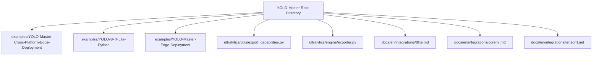
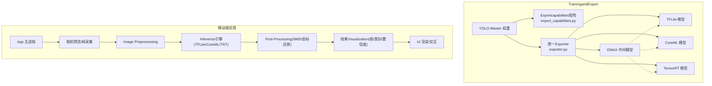
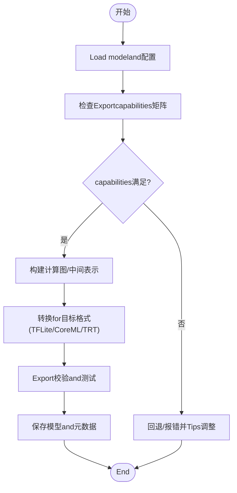
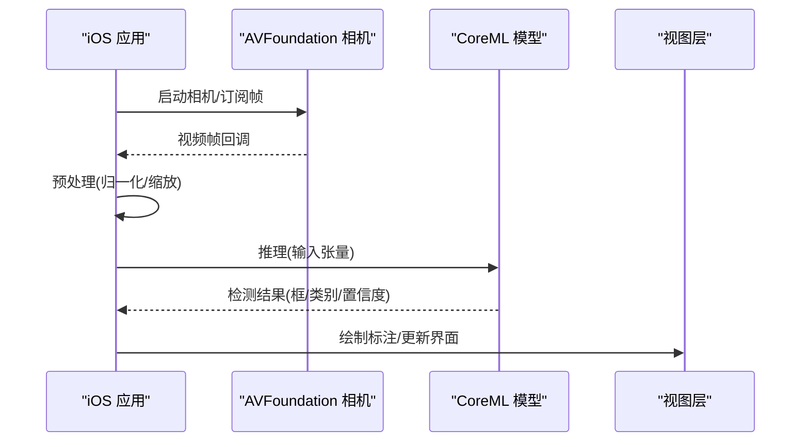
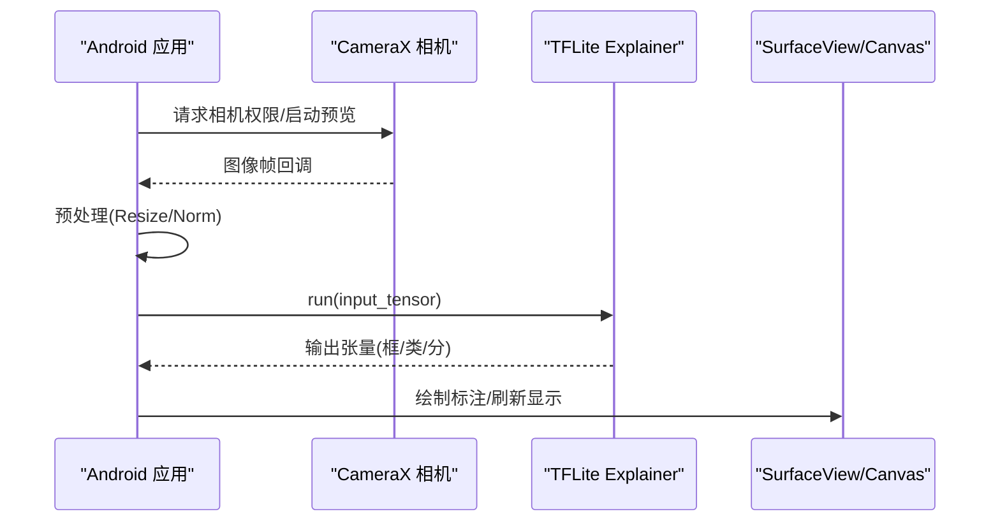
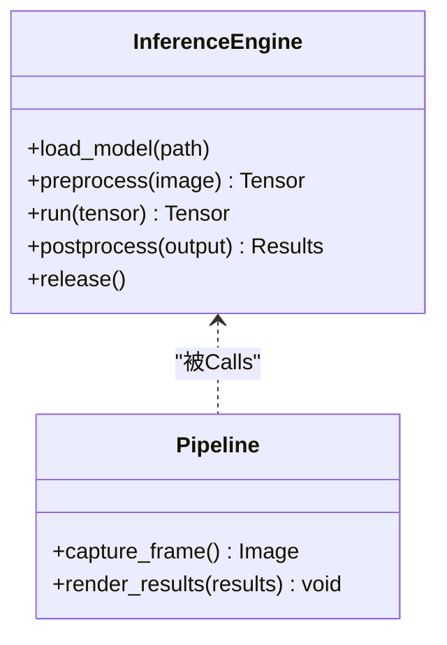
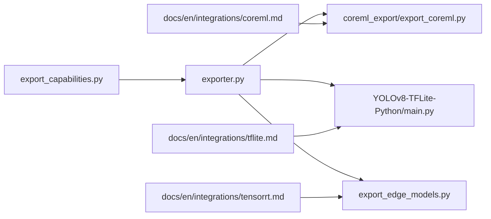

# Mobile Deployment

<cite>
**Files Referenced in This Document**
- [README.md](file://README.md)
- [examples/YOLO-Master-Cross-Platform-Edge-Deployment/README.md](file://examples/YOLO-Master-Cross-Platform-Edge-Deployment/README.md)
- [examples/YOLO-Master-Cross-Platform-Edge-Deployment/TECHNICAL_REPORT.md](file://examples/YOLO-Master-Cross-Platform-Edge-Deployment/TECHNICAL_REPORT.md)
- [examples/YOLO-Master-Cross-Platform-Edge-Deployment/coreml_export/export_coreml.py](file://examples/YOLO-Master-Cross-Platform-Edge-Deployment/coreml_export/export_coreml.py)
- [examples/YOLO-Master-Cross-Platform-Edge-Deployment/cpp/main.cpp](file://examples/YOLO-Master-Cross-Platform-Edge-Deployment/cpp/main.cpp)
- [examples/YOLO-Master-Cross-Platform-Edge-Deployment/cpp/inference.h](file://examples/YOLO-Master-Cross-Platform-Edge-Deployment/cpp/inference.h)
- [examples/YOLOv8-TFLite-Python/README.md](file://examples/YOLOv8-TFLite-Python/README.md)
- [examples/YOLOv8-TFLite-Python/main.py](file://examples/YOLOv8-TFLite-Python/main.py)
- [examples/YOLO-Master-Edge-Deployment/README.md](file://examples/YOLO-Master-Edge-Deployment/README.md)
- [examples/YOLO-Master-Edge-Deployment/export_edge_models.py](file://examples/YOLO-Master-Edge-Deployment/export_edge_models.py)
- [ultralytics/utils/export_capabilities.py](file://ultralytics/utils/export_capabilities.py)
- [ultralytics/engine/exporter.py](file://ultralytics/engine/exporter.py)
- [docs/en/integrations/tflite.md](file://docs/en/integrations/tflite.md)
- [docs/en/integrations/coreml.md](file://docs/en/integrations/coreml.md)
- [docs/en/integrations/tensorrt.md](file://docs/en/integrations/tensorrt.md)
</cite>

## Table of Contents
1. [Introduction](#Introduction)
2. [Project Structure](#Project Structure)
3. [Core Components](#Core Components)
4. [Architecture Overview](#Architecture Overview)
5. [Detailed Component Analysis](#Detailed Component Analysis)
6. [Dependency Analysis](#Dependency Analysis)
7. [性能andOptimization](#性能andOptimization)
8. [Troubleshooting Guide](#Troubleshooting Guide)
9. [Conclusion](#Conclusion)
10. [Appendix](#Appendix)

## Introduction
本指南聚焦于将 YOLO-Master 模型部署to移动端的完整流程，覆盖 iOS and Android 平台，包括 CoreML、TFLite、TensorRT Mobile etc.格式的Uses。Documentationprovides从Export、集成to运行时Inference的端to端说明，并给出相机预览、实时检测、结果Visualizationetc.典型功能的implementing思路。同时总结移动端特有的Optimization技术（Model Compression、内存管理、电池续航Optimization）、调试and性能分析工具，Centered onand跨平台框架（Flutter、React Native）的集成方案andUser体验Optimization最佳实践。

## Project Structure
仓库中andMobile Deployment相关的资源主要分布whileCentered on下位置：
- Examples工程：跨平台Edge DeploymentExamples、TFLite Python Examples、通用Edge Deployment脚本
- Exportcapabilitiesand引擎：Exportcapabilities矩阵、统一Exporter
- 官方Documentation：TFLite、CoreML、TensorRT 集成Documentation

Figure Source
- [examples/YOLO-Master-Cross-Platform-Edge-Deployment/README.md](file://examples/YOLO-Master-Cross-Platform-Edge-Deployment/README.md)
- [examples/YOLOv8-TFLite-Python/README.md](file://examples/YOLOv8-TFLite-Python/README.md)
- [examples/YOLO-Master-Edge-Deployment/README.md](file://examples/YOLO-Master-Edge-Deployment/README.md)
- [ultralytics/utils/export_capabilities.py](file://ultralytics/utils/export_capabilities.py)
- [ultralytics/engine/exporter.py](file://ultralytics/engine/exporter.py)
- [docs/en/integrations/tflite.md](file://docs/en/integrations/tflite.md)
- [docs/en/integrations/coreml.md](file://docs/en/integrations/coreml.md)
- [docs/en/integrations/tensorrt.md](file://docs/en/integrations/tensorrt.md)

Section Source
- [README.md](file://README.md)
- [examples/YOLO-Master-Cross-Platform-Edge-Deployment/README.md](file://examples/YOLO-Master-Cross-Platform-Edge-Deployment/README.md)
- [examples/YOLO-Master-Cross-Platform-Edge-Deployment/TECHNICAL_REPORT.md](file://examples/YOLO-Master-Cross-Platform-Edge-Deployment/TECHNICAL_REPORT.md)
- [examples/YOLO-Master-Edge-Deployment/README.md](file://examples/YOLO-Master-Edge-Deployment/README.md)
- [examples/YOLOv8-TFLite-Python/README.md](file://examples/YOLOv8-TFLite-Python/README.md)
- [ultralytics/utils/export_capabilities.py](file://ultralytics/utils/export_capabilities.py)
- [ultralytics/engine/exporter.py](file://ultralytics/engine/exporter.py)
- [docs/en/integrations/tflite.md](file://docs/en/integrations/tflite.md)
- [docs/en/integrations/coreml.md](file://docs/en/integrations/coreml.md)
- [docs/en/integrations/tensorrt.md](file://docs/en/integrations/tensorrt.md)

## Core Components
- Exportcapabilities矩阵and统一Exporter
  - export_capabilities.py：维护各后端/格式的Exportcapabilities矩阵，用于判断目标平台是否Supporting某格式Export。
  - exporter.py：统一的Export入口，Encapsulates ONNX/TFLite/CoreML/TensorRT etc.Export流程，供上层Calls。
- 跨平台Edge DeploymentExamples
  - coreml_export/export_coreml.py：演示such as何Exporting to CoreML 模型，便于while iOS/macOS Uses Core ML 运行。
  - cpp/main.cpp、cpp/inference.h：C++ InferenceExamples，展示Load model、预处理、Inference、Post-Processing的典型流程，可作for移动端原生集成的Refer to。
- TFLite Examples
  - examples/YOLOv8-TFLite-Python：包含 README and main.py，演示 TFLite 模型的加载andInference流程，可Migration至 Android/iOS 的 TFLite 运行时。
- 通用Edge Deployment脚本
  - examples/YOLO-Master-Edge-Deployment/export_edge_models.py：批量Export边缘友好格式（such as TFLite、ONNX），并providesValidation脚本。
- 官方集成Documentation
  - docs/en/integrations/tflite.md、coreml.md、tensorrt.md：分别介绍对应格式的Export、部署and注意事项。

Section Source
- [ultralytics/utils/export_capabilities.py](file://ultralytics/utils/export_capabilities.py)
- [ultralytics/engine/exporter.py](file://ultralytics/engine/exporter.py)
- [examples/YOLO-Master-Cross-Platform-Edge-Deployment/coreml_export/export_coreml.py](file://examples/YOLO-Master-Cross-Platform-Edge-Deployment/coreml_export/export_coreml.py)
- [examples/YOLO-Master-Cross-Platform-Edge-Deployment/cpp/main.cpp](file://examples/YOLO-Master-Cross-Platform-Edge-Deployment/cpp/main.cpp)
- [examples/YOLO-Master-Cross-Platform-Edge-Deployment/cpp/inference.h](file://examples/YOLO-Master-Cross-Platform-Edge-Deployment/cpp/inference.h)
- [examples/YOLOv8-TFLite-Python/README.md](file://examples/YOLOv8-TFLite-Python/README.md)
- [examples/YOLOv8-TFLite-Python/main.py](file://examples/YOLOv8-TFLite-Python/main.py)
- [examples/YOLO-Master-Edge-Deployment/export_edge_models.py](file://examples/YOLO-Master-Edge-Deployment/export_edge_models.py)
- [docs/en/integrations/tflite.md](file://docs/en/integrations/tflite.md)
- [docs/en/integrations/coreml.md](file://docs/en/integrations/coreml.md)
- [docs/en/integrations/tensorrt.md](file://docs/en/integrations/tensorrt.md)

## Architecture Overview
下图展示了从Training好的 YOLO-Master 模型to移动端Inference的整体流程，包括Export、打包、集成and运行阶段。

Figure Source
- [ultralytics/utils/export_capabilities.py](file://ultralytics/utils/export_capabilities.py)
- [ultralytics/engine/exporter.py](file://ultralytics/engine/exporter.py)
- [examples/YOLO-Master-Cross-Platform-Edge-Deployment/coreml_export/export_coreml.py](file://examples/YOLO-Master-Cross-Platform-Edge-Deployment/coreml_export/export_coreml.py)
- [examples/YOLO-Master-Cross-Platform-Edge-Deployment/cpp/main.cpp](file://examples/YOLO-Master-Cross-Platform-Edge-Deployment/cpp/main.cpp)
- [examples/YOLOv8-TFLite-Python/main.py](file://examples/YOLOv8-TFLite-Python/main.py)
- [docs/en/integrations/tflite.md](file://docs/en/integrations/tflite.md)
- [docs/en/integrations/coreml.md](file://docs/en/integrations/coreml.md)
- [docs/en/integrations/tensorrt.md](file://docs/en/integrations/tensorrt.md)

## Detailed Component Analysis

### 组件A：Export管线（统一Exporterandcapabilities矩阵）
- 职责
  - export_capabilities.py：定义各后端/格式的capabilities矩阵，辅助选择目标平台Supporting的Export格式。
  - exporter.py：Encapsulates多后端Export逻辑，统一输入输出规范，Supporting ONNX/TFLite/CoreML/TensorRT etc.。
- 关键流程
  - 读取模型and配置 → 校验Exportcapabilities → 生成中间表示（such as ONNX）→ 转换for目标格式 → 保存and校验。
- 复杂度andOptimization
  - Export过程通常受图规模、算子Supportingand量化策略影响；建议优先Export轻量模型（s/n 系列）并Combining INT8/FP16 量化。
- 错误处理
  - 对不Supporting的算子或平台进行预检，失败is available, fall back to兼容路径或Tips调整配置。

Figure Source
- [ultralytics/utils/export_capabilities.py](file://ultralytics/utils/export_capabilities.py)
- [ultralytics/engine/exporter.py](file://ultralytics/engine/exporter.py)

Section Source
- [ultralytics/utils/export_capabilities.py](file://ultralytics/utils/export_capabilities.py)
- [ultralytics/engine/exporter.py](file://ultralytics/engine/exporter.py)

### 组件B：iOS 集成（CoreML）
- Export
  - Via coreml_export/export_coreml.py 将Model Exportfor .mlmodel，便于while Xcode 中直接集成。
- 运行时
  - Uses Core ML 框架Load model，Combining AVFoundation 完成相机预览and逐帧Inference。
- Visualization
  - while UIView/CALayer 上绘制边界框and类别标签，注意坐标系变换and缩放。
- Optimization要点
  - 启用 FP16/INT8 量化（若可用），减少内存占用and功耗；Set appropriately分辨率and批大小。

Figure Source
- [examples/YOLO-Master-Cross-Platform-Edge-Deployment/coreml_export/export_coreml.py](file://examples/YOLO-Master-Cross-Platform-Edge-Deployment/coreml_export/export_coreml.py)
- [docs/en/integrations/coreml.md](file://docs/en/integrations/coreml.md)

Section Source
- [examples/YOLO-Master-Cross-Platform-Edge-Deployment/coreml_export/export_coreml.py](file://examples/YOLO-Master-Cross-Platform-Edge-Deployment/coreml_export/export_coreml.py)
- [docs/en/integrations/coreml.md](file://docs/en/integrations/coreml.md)

### 组件C：Android 集成（TFLite）
- Export
  - Uses exporter.py 或 edge 脚本Exporting to .tflite，必要时开启量化Centered on减小体积。
- 运行时
  - while Android 上Uses TensorFlow Lite Java/Kotlin API Load model，Combined with CameraX 获取预览帧。
- Visualization
  - while自定义 SurfaceView/TextureView 上叠加检测结果，注意屏幕and图像坐标映射。
- Optimization要点
  - Uses NNAPI/GPU Delegate 加速；控制输入尺寸and帧率；避免频繁对象分配。

Figure Source
- [examples/YOLOv8-TFLite-Python/main.py](file://examples/YOLOv8-TFLite-Python/main.py)
- [examples/YOLOv8-TFLite-Python/README.md](file://examples/YOLOv8-TFLite-Python/README.md)
- [docs/en/integrations/tflite.md](file://docs/en/integrations/tflite.md)

Section Source
- [examples/YOLOv8-TFLite-Python/main.py](file://examples/YOLOv8-TFLite-Python/main.py)
- [examples/YOLOv8-TFLite-Python/README.md](file://examples/YOLOv8-TFLite-Python/README.md)
- [docs/en/integrations/tflite.md](file://docs/en/integrations/tflite.md)

### 组件D：跨平台原生Examples（C++）
- 作用
  - provides通用的Inference流程Refer to，适用于 iOS/Android 原生层集成，也可作for Flutter/RN 的桥接基础。
- 关键点
  - 模型加载、预处理、Inference、Post-ProcessingandVisualization的解耦设计，便于移植to不同平台。
- Applicable Scenarios
  - 需要极致性能或深度定制的场景，例such as自定义 NMS、多线程流水线、GPU acceleration。

Figure Source
- [examples/YOLO-Master-Cross-Platform-Edge-Deployment/cpp/main.cpp](file://examples/YOLO-Master-Cross-Platform-Edge-Deployment/cpp/main.cpp)
- [examples/YOLO-Master-Cross-Platform-Edge-Deployment/cpp/inference.h](file://examples/YOLO-Master-Cross-Platform-Edge-Deployment/cpp/inference.h)

Section Source
- [examples/YOLO-Master-Cross-Platform-Edge-Deployment/cpp/main.cpp](file://examples/YOLO-Master-Cross-Platform-Edge-Deployment/cpp/main.cpp)
- [examples/YOLO-Master-Cross-Platform-Edge-Deployment/cpp/inference.h](file://examples/YOLO-Master-Cross-Platform-Edge-Deployment/cpp/inference.h)

### 组件E：TensorRT Mobile（Jetson/Android GPU）
- 说明
  - TensorRT 主要用于 NVIDIA Jetson etc.平台；Android 侧可Via第三方库或厂商 SDK 尝试 GPU acceleration。
- Exportand部署
  - Uses exporter.py Export TensorRT 引擎，或while目标设备上离线构建；注意精度校准and算子Supporting。
- 性能权衡
  - 高吞吐低延迟，但需考虑设备发热and功耗；建议按需启用and动态切换。

Section Source
- [docs/en/integrations/tensorrt.md](file://docs/en/integrations/tensorrt.md)
- [ultralytics/engine/exporter.py](file://ultralytics/engine/exporter.py)

### 组件F：跨平台框架集成（Flutter / React Native）
- 总体思路
  - while原生层implementingInference（TFLite/CoreML），Via平台通道暴露给 Flutter/RN Calls。
- Flutter
  - Uses platform channels Calls Android/iOS 原生方法；while原生侧执行相机采集andInference，返回结构化结果并while UI 层绘制。
- React Native
  - Via原生Modules桥接，复用相同Inference流程；注意线程and内存管理，避免阻塞 JS 线程。
- 最佳实践
  - 将重Tasks放while后台线程；限制帧率and分辨率；结果增量更新 UI。

[本节for概念性内容，不直接分析具体源码文件]

## Dependency Analysis
- Exportcapabilities矩阵andExporter之间的耦合
  - exporter.py 依赖 export_capabilities.py provides的capabilities信息，决定可用的Export路径。
- ExamplesandDocumentation的引用关系
  - 跨平台Examplesand官方Documentation相互印证，确保Exportand部署步骤一致。

Figure Source
- [ultralytics/utils/export_capabilities.py](file://ultralytics/utils/export_capabilities.py)
- [ultralytics/engine/exporter.py](file://ultralytics/engine/exporter.py)
- [examples/YOLO-Master-Cross-Platform-Edge-Deployment/coreml_export/export_coreml.py](file://examples/YOLO-Master-Cross-Platform-Edge-Deployment/coreml_export/export_coreml.py)
- [examples/YOLOv8-TFLite-Python/main.py](file://examples/YOLOv8-TFLite-Python/main.py)
- [examples/YOLO-Master-Edge-Deployment/export_edge_models.py](file://examples/YOLO-Master-Edge-Deployment/export_edge_models.py)
- [docs/en/integrations/tflite.md](file://docs/en/integrations/tflite.md)
- [docs/en/integrations/coreml.md](file://docs/en/integrations/coreml.md)
- [docs/en/integrations/tensorrt.md](file://docs/en/integrations/tensorrt.md)

Section Source
- [ultralytics/utils/export_capabilities.py](file://ultralytics/utils/export_capabilities.py)
- [ultralytics/engine/exporter.py](file://ultralytics/engine/exporter.py)
- [examples/YOLO-Master-Cross-Platform-Edge-Deployment/coreml_export/export_coreml.py](file://examples/YOLO-Master-Cross-Platform-Edge-Deployment/coreml_export/export_coreml.py)
- [examples/YOLOv8-TFLite-Python/main.py](file://examples/YOLOv8-TFLite-Python/main.py)
- [examples/YOLO-Master-Edge-Deployment/export_edge_models.py](file://examples/YOLO-Master-Edge-Deployment/export_edge_models.py)
- [docs/en/integrations/tflite.md](file://docs/en/integrations/tflite.md)
- [docs/en/integrations/coreml.md](file://docs/en/integrations/coreml.md)
- [docs/en/integrations/tensorrt.md](file://docs/en/integrations/tensorrt.md)

## 性能andOptimization
- Model Compression
  - 量化（INT8/FP16）：显著降低内存and功耗，提升速度；需Evaluation精度损失。
  - 剪枝/蒸馏：While maintaining精度的前提下减小模型规模。
- 内存管理
  - 复用张量and缓冲区，避免每帧分配；控制输入分辨率and批大小。
- 电池续航
  - 降低帧率and分辨率；仅while必要时启用高精度模式；利用hardware acceleration（NNAPI/Core ML）。
- Inference流水线
  - 异步处理：相机采集、预处理、Inference、Post-Processing并行；采用双缓冲/环形队列。
- 平台特性
  - iOS：Core ML Optimization选项and Metal 加速；Android：TFLite GPU/NNAPI Delegate。

[本节for通用指导，不直接分析具体源码文件]

## Troubleshooting Guide
- Export Failure
  - 检查Exportcapabilities矩阵and目标平台Supporting；确认算子兼容性；查看ExportLogging定位问题。
- 运行时崩溃
  - 核对输入形状and数据类型；确保预处理andExport一致；检查内存不足and线程安全。
- 性能不达预期
  - 对比不同量化and分辨率组合；启用hardware acceleration；分析热点函数andbottlenecks。
- Visualization错位
  - 校正坐标映射and缩放比例；确认图像方向and裁剪区域。

Section Source
- [examples/YOLO-Master-Cross-Platform-Edge-Deployment/TECHNICAL_REPORT.md](file://examples/YOLO-Master-Cross-Platform-Edge-Deployment/TECHNICAL_REPORT.md)
- [examples/YOLO-Master-Edge-Deployment/README.md](file://examples/YOLO-Master-Edge-Deployment/README.md)

## Conclusion
Via将 YOLO-Master Model Exportfor移动端友好的格式（TFLite/CoreML/TensorRT），并Combining原生或跨平台框架进行集成，可while iOS and Android 上implementing高效的实时检测。合理的Model Compression、内存管理andhardware acceleration策略，能显著提升性能and续航表现。借助Examples工程and官方Documentation，开发者可Centered on快速搭建从Exportto部署的完整链路，并Via持续的性能分析and调优获得稳定可靠的移动端体验。

## Appendix
- 快速上手清单
  - 选择目标平台and格式（TFLite/CoreML/TensorRT）
  - Uses exporter.py andcapabilities矩阵进行Export
  - while原生层implementing相机采集、预处理、InferenceandVisualization
  - 针对设备进行量化and加速Optimization
  - 进行端to端测试and性能分析

[本节for概览性内容，不直接分析具体源码文件]