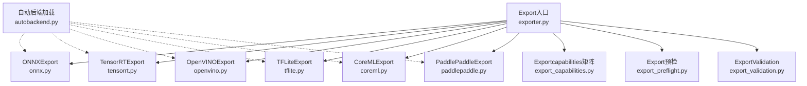
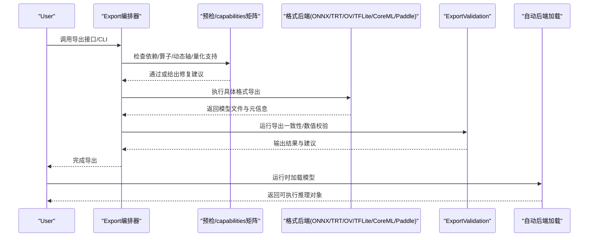
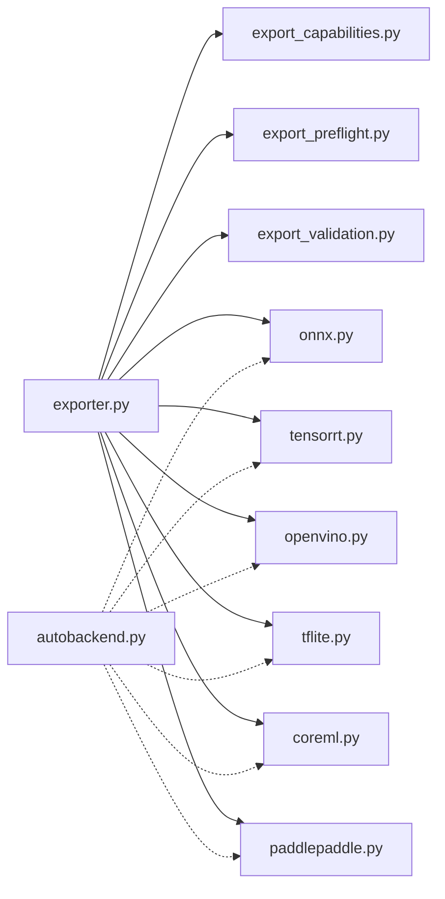

# Model Export格式详解

<cite>
**Files Referenced in This Document**
- [ultralytics/engine/exporter.py](file://ultralytics/engine/exporter.py)
- [ultralytics/utils/export/__init__.py](file://ultralytics/utils/export/__init__.py)
- [ultralytics/utils/export/onnx.py](file://ultralytics/utils/export/onnx.py)
- [ultralytics/utils/export/tensorrt.py](file://ultralytics/utils/export/tensorrt.py)
- [ultralytics/utils/export/openvino.py](file://ultralytics/utils/export/openvino.py)
- [ultralytics/utils/export/tflite.py](file://ultralytics/utils/export/tflite.py)
- [ultralytics/utils/export/coreml.py](file://ultralytics/utils/export/coreml.py)
- [ultralytics/utils/export/paddlepaddle.py](file://ultralytics/utils/export/paddlepaddle.py)
- [ultralytics/utils/export_capabilities.py](file://ultralytics/utils/export_capabilities.py)
- [ultralytics/utils/export_preflight.py](file://ultralytics/utils/export_preflight.py)
- [ultralytics/utils/export_validation.py](file://ultralytics/utils/export_validation.py)
- [ultralytics/nn/autobackend.py](file://ultralytics/nn/autobackend.py)
- [examples/YOLO-Master-Cross-Platform-Edge-Deployment/coreml_export/export_coreml.py](file://examples/YOLO-Master-Cross-Platform-Edge-Deployment/coreml_export/export_coreml.py)
- [examples/YOLO-Master-Edge-Deployment/export_edge_models.py](file://examples/YOLO-Master-Edge-Deployment/export_edge_models.py)
- [tests/test_exports.py](file://tests/test_exports.py)
- [tests/test_export_roundtrip.py](file://tests/test_export_roundtrip.py)
- [tests/test_export_preflight.py](file://tests/test_export_preflight.py)
- [benchmarks/suite.py](file://benchmarks/suite.py)
- [docs/en/guides/model-deployment-options.md](file://docs/en/guides/model-deployment-options.md)
- [docs/en/integrations/onnx.md](file://docs/en/integrations/onnx.md)
- [docs/en/integrations/tensorrt.md](file://docs/en/integrations/tensorrt.md)
- [docs/en/integrations/openvino.md](file://docs/en/integrations/openvino.md)
- [docs/en/integrations/tflite.md](file://docs/en/integrations/tflite.md)
- [docs/en/integrations/coreml.md](file://docs/en/integrations/coreml.md)
- [docs/en/integrations/paddlepaddle.md](file://docs/en/integrations/paddlepaddle.md)
</cite>

## Table of Contents
1. [Introduction](#Introduction)
2. [Project Structure](#Project Structure)
3. [Core Components](#Core Components)
4. [Architecture Overview](#Architecture Overview)
5. [Detailed Component Analysis](#Detailed Component Analysis)
6. [Dependency Analysis](#Dependency Analysis)
7. [性能and基准](#性能and基准)
8. [Troubleshooting Guide](#Troubleshooting Guide)
9. [Conclusion](#Conclusion)
10. [Appendix：APIandCLIUsesExamples](#AppendixapiandcliUsesExamples)

## Introduction
本文件targetingYOLO-Master模型的部署and工程化，系统性梳理并对比Supporting的Export格式（ONNX、TensorRT、OpenVINO、TFLite、CoreML、PaddlePaddleetc.），涵盖各格式的特点、优势、Applicable Scenarios、Export参数配置、Optimization选项（动态轴、量化、算子Supporting）、兼容性要求、Inference速度and内存占用对比思路，Centered onand常见问题诊断and解决方案。Documentation同时providesPython APIandCLI的完整Uses路径指引，帮助读者while不同平台快速落地部署。

## Project Structure
本项目将“Export”capabilities集中whileEngine Layerand工具层：
- 引擎入口：统一Export编排and流程控制
- 后端implementing：按目标格式拆分的具体Export逻辑
- 前置检查andcapabilities矩阵：环境探测、算子Supporting、兼容性校验
- 自动加载器：运行时根据扩展名自动选择后端
- Examplesand测试：Cross-Platform ExportExamplesand回归Test Suite
- Documentation：集成指南and部署实践

Figure Source
- [ultralytics/engine/exporter.py](file://ultralytics/engine/exporter.py)
- [ultralytics/utils/export/onnx.py](file://ultralytics/utils/export/onnx.py)
- [ultralytics/utils/export/tensorrt.py](file://ultralytics/utils/export/tensorrt.py)
- [ultralytics/utils/export/openvino.py](file://ultralytics/utils/export/openvino.py)
- [ultralytics/utils/export/tflite.py](file://ultralytics/utils/export/tflite.py)
- [ultralytics/utils/export/coreml.py](file://ultralytics/utils/export/coreml.py)
- [ultralytics/utils/export/paddlepaddle.py](file://ultralytics/utils/export/paddlepaddle.py)
- [ultralytics/utils/export_capabilities.py](file://ultralytics/utils/export_capabilities.py)
- [ultralytics/utils/export_preflight.py](file://ultralytics/utils/export_preflight.py)
- [ultralytics/utils/export_validation.py](file://ultralytics/utils/export_validation.py)
- [ultralytics/nn/autobackend.py](file://ultralytics/nn/autobackend.py)

Section Source
- [ultralytics/engine/exporter.py](file://ultralytics/engine/exporter.py)
- [ultralytics/utils/export/__init__.py](file://ultralytics/utils/export/__init__.py)
- [ultralytics/utils/export_capabilities.py](file://ultralytics/utils/export_capabilities.py)
- [ultralytics/utils/export_preflight.py](file://ultralytics/utils/export_preflight.py)
- [ultralytics/utils/export_validation.py](file://ultralytics/utils/export_validation.py)
- [ultralytics/nn/autobackend.py](file://ultralytics/nn/autobackend.py)

## Core Components
- Export编排器（Engine Exporter）
  - 负责解析Export参数、Calls具体后端、生成产物and元数据、执行Export后Validation。
- 格式后端（Format Backends）
  - ONNX/TensorRT/OpenVINO/TFLite/CoreML/PaddlePaddle各自implementingExport细节andOptimization开关。
- capabilities矩阵and预检（Capabilities & Preflight）
  - 汇总各格式对Tasks类型、输入尺寸、动态轴、量化、算子的Supporting情况；whileExport前进行环境and依赖检查。
- 自动后端加载（AutoBackend）
  - 运行时根据模型扩展名自动选择对应Inference后端，屏蔽多格式差异。
- ExportValidation（Export Validation）
  - Export后一致性校验（精度/数值稳定性/形状匹配）。

Section Source
- [ultralytics/engine/exporter.py](file://ultralytics/engine/exporter.py)
- [ultralytics/utils/export/onnx.py](file://ultralytics/utils/export/onnx.py)
- [ultralytics/utils/export/tensorrt.py](file://ultralytics/utils/export/tensorrt.py)
- [ultralytics/utils/export/openvino.py](file://ultralytics/utils/export/openvino.py)
- [ultralytics/utils/export/tflite.py](file://ultralytics/utils/export/tflite.py)
- [ultralytics/utils/export/coreml.py](file://ultralytics/utils/export/coreml.py)
- [ultralytics/utils/export/paddlepaddle.py](file://ultralytics/utils/export/paddlepaddle.py)
- [ultralytics/utils/export_capabilities.py](file://ultralytics/utils/export_capabilities.py)
- [ultralytics/utils/export_preflight.py](file://ultralytics/utils/export_preflight.py)
- [ultralytics/utils/export_validation.py](file://ultralytics/utils/export_validation.py)
- [ultralytics/nn/autobackend.py](file://ultralytics/nn/autobackend.py)

## Architecture Overview
下图展示从UserCallsto最终产物的端to端流程，包括预检、Export、Validationand自动加载。

Figure Source
- [ultralytics/engine/exporter.py](file://ultralytics/engine/exporter.py)
- [ultralytics/utils/export_capabilities.py](file://ultralytics/utils/export_capabilities.py)
- [ultralytics/utils/export_preflight.py](file://ultralytics/utils/export_preflight.py)
- [ultralytics/utils/export_validation.py](file://ultralytics/utils/export_validation.py)
- [ultralytics/nn/autobackend.py](file://ultralytics/nn/autobackend.py)

## Detailed Component Analysis

### ONNXExport
- 特点and优势
  - 通用中间表示，生态完善，便于后续转换for其他格式。
  - Supporting动态轴、Mixture精度、常见NMS/激活/卷积etc.算子。
- Applicable Scenarios
  - 跨框架/跨设备交换；作forTensorRT/OpenVINO/TFLiteetc.的上游。
- 关键Export参数（概念性说明）
  - 输入形状and动态轴：固定或维度可变（such asbatch、width、height）。
  - 算子版本andOptimization：opset版本、常量折叠、图Optimization级别。
  - 精度and数据类型：FP32/FP16/BF16（取决于后端）。
  - NMSandPost-Processing：是否内嵌NMS、类别数、Confidence Threshold、IOU阈值。
- 兼容性and限制
  - 需关注自定义算子映射and动态形状表达。
- Optimization选项
  - 动态轴设置、算子融合、常量传播、图Optimization。
- Refer toimplementing位置
  - [ultralytics/utils/export/onnx.py](file://ultralytics/utils/export/onnx.py)

Section Source
- [ultralytics/utils/export/onnx.py](file://ultralytics/utils/export/onnx.py)
- [docs/en/integrations/onnx.md](file://docs/en/integrations/onnx.md)

### TensorRTExport
- 特点and优势
  - NVIDIA GPU上极致Inference加速，SupportingFP16/INT8量化、内核融合、插件扩展。
- Applicable Scenarios
  - 数据中心/边缘GPU（Jetson/RTX系列）高性能部署。
- 关键Export参数（概念性说明）
  - 精度模式：FP32/FP16/INT8（需校准集）。
  - 最大工作空间、构建时间、Optimization级别。
  - 动态输入：最小/典型/最大形状范围。
  - 插件and算子：自定义算子注册、NMS插件。
- 兼容性and限制
  - 需要匹配的CUDA/cuDNN/TensorRT版本；部分算子需插件或回退。
- Optimization选项
  - INT8量化、层融合、内核自动选择、线程/流并行。
- Refer toimplementing位置
  - [ultralytics/utils/export/tensorrt.py](file://ultralytics/utils/export/tensorrt.py)

Section Source
- [ultralytics/utils/export/tensorrt.py](file://ultralytics/utils/export/tensorrt.py)
- [docs/en/integrations/tensorrt.md](file://docs/en/integrations/tensorrt.md)

### OpenVINOExport
- 特点and优势
  - Intel CPU/GPU/VPU/NPUetc.多硬件后端，IR中间表示，SupportingI/OOptimizationand多线程。
- Applicable Scenarios
  - Intel平台CPU/核显/UPX/NPU部署，低延迟高吞吐。
- 关键Export参数（概念性说明）
  - 精度：FP32/FP16（含压缩）。
  - 输入形状：静态或动态（批/宽高）。
  - Optimization：压缩、图Optimization、缓存。
- 兼容性and限制
  - 依赖OpenVINO运行时anddrivers are installed；某些算子需转换适配。
- Optimization选项
  - FP16压缩、多线程Inference、异步I/O、模型缓存。
- Refer toimplementing位置
  - [ultralytics/utils/export/openvino.py](file://ultralytics/utils/export/openvino.py)

Section Source
- [ultralytics/utils/export/openvino.py](file://ultralytics/utils/export/openvino.py)
- [docs/en/integrations/openvino.md](file://docs/en/integrations/openvino.md)

### TFLiteExport
- 特点and优势
  - 移动端/嵌入式友好，SupportingCPU/GPU/NPU/Hexagon/DSPetc.加速器。
- Applicable Scenarios
  - Android/iOS/微控制器etc.低功耗设备。
- 关键Export参数（概念性说明）
  - 量化：INT8/Float16/动态范围量化。
  - 输入形状：静态或动态（受平台限制）。
  - 算子白名单and降级策略。
- 兼容性and限制
  - 不同设备/协处理器Supporting差异较大，需Validation算子覆盖。
- Optimization选项
  - 量化、算子替换、图Optimization、资源裁剪。
- Refer toimplementing位置
  - [ultralytics/utils/export/tflite.py](file://ultralytics/utils/export/tflite.py)

Section Source
- [ultralytics/utils/export/tflite.py](file://ultralytics/utils/export/tflite.py)
- [docs/en/integrations/tflite.md](file://docs/en/integrations/tflite.md)

### CoreMLExport
- 特点and优势
  - Apple生态原生Optimization，iOS/macOS/watchOS高效Inference。
- Applicable Scenarios
  - Apple设备端部署，CombiningMetal/ANE加速。
- 关键Export参数（概念性说明）
  - 精度：FP32/FP16。
  - 输入形状：静态或受限动态。
  - MLProgram/旧版描述符选择。
- 兼容性and限制
  - 依赖macOSandXcode工具链；部分算子需AppleSupporting。
- Optimization选项
  - 量化、图Optimization、Model Compression。
- Refer toimplementing位置
  - [ultralytics/utils/export/coreml.py](file://ultralytics/utils/export/coreml.py)

Section Source
- [ultralytics/utils/export/coreml.py](file://ultralytics/utils/export/coreml.py)
- [docs/en/integrations/coreml.md](file://docs/en/integrations/coreml.md)

### PaddlePaddleExport
- 特点and优势
  - 百度飞桨生态，服务端/端侧均有良好Supporting，算子丰富。
- Applicable Scenarios
  - 国内生态部署、PaddleInference/PaddleLite。
- 关键Export参数（概念性说明）
  - 精度：FP32/FP16。
  - 输入形状：静态for主，部分动态Supporting。
  - 算子映射andOptimization。
- 兼容性and限制
  - 依赖PaddlePaddle版本and平台；部分算子需适配。
- Optimization选项
  - 图Optimization、算子融合、量化（视版本）。
- Refer toimplementing位置
  - [ultralytics/utils/export/paddlepaddle.py](file://ultralytics/utils/export/paddlepaddle.py)

Section Source
- [ultralytics/utils/export/paddlepaddle.py](file://ultralytics/utils/export/paddlepaddle.py)
- [docs/en/integrations/paddlepaddle.md](file://docs/en/integrations/paddlepaddle.md)

### Exportcapabilities矩阵and预检
- capabilities矩阵
  - 汇总各格式对Tasks类型（检测/分割/姿态/Trackingetc.）、输入尺寸、动态轴、量化、算子Supporting情况。
- 预检流程
  - 检查依赖库版本、可用硬件、算子Supporting、动态形状合法性、量化可行性。
- Refer toimplementing位置
  - [ultralytics/utils/export_capabilities.py](file://ultralytics/utils/export_capabilities.py)
  - [ultralytics/utils/export_preflight.py](file://ultralytics/utils/export_preflight.py)

Section Source
- [ultralytics/utils/export_capabilities.py](file://ultralytics/utils/export_capabilities.py)
- [ultralytics/utils/export_preflight.py](file://ultralytics/utils/export_preflight.py)

### ExportValidationand一致性检查
- 目标
  - 确保Export前后Inference结果一致（数值误差范围内），形状/类型正确。
- 方法
  - 随机/代表性样本比对、边界条件测试、异常路径覆盖。
- Refer toimplementing位置
  - [ultralytics/utils/export_validation.py](file://ultralytics/utils/export_validation.py)

Section Source
- [ultralytics/utils/export_validation.py](file://ultralytics/utils/export_validation.py)

### 自动后端加载（运行时）
- 功能
  - 根据模型扩展名自动选择对应后端，屏蔽多格式差异，简化部署代码。
- Refer toimplementing位置
  - [ultralytics/nn/autobackend.py](file://ultralytics/nn/autobackend.py)

Section Source
- [ultralytics/nn/autobackend.py](file://ultralytics/nn/autobackend.py)

## Dependency Analysis
- 耦合and内聚
  - Export编排器集中管理流程，各后端Modules职责单一，内聚度高。
  - capabilities矩阵and预检for所有后端provides统一支撑，降低重复检查成本。
- External Dependencies
  - ONNXRuntime、TensorRT、OpenVINO、TFLite、CoreML、PaddlePaddleetc.运行时and工具链。
- Potential Cycles依赖
  - 采用分层设计避免循环；后端不反向依赖编排器。
- 接口契约
  - 统一的Export函数签名and返回值约定，便于扩展新格式。

Figure Source
- [ultralytics/engine/exporter.py](file://ultralytics/engine/exporter.py)
- [ultralytics/utils/export_capabilities.py](file://ultralytics/utils/export_capabilities.py)
- [ultralytics/utils/export_preflight.py](file://ultralytics/utils/export_preflight.py)
- [ultralytics/utils/export_validation.py](file://ultralytics/utils/export_validation.py)
- [ultralytics/utils/export/onnx.py](file://ultralytics/utils/export/onnx.py)
- [ultralytics/utils/export/tensorrt.py](file://ultralytics/utils/export/tensorrt.py)
- [ultralytics/utils/export/openvino.py](file://ultralytics/utils/export/openvino.py)
- [ultralytics/utils/export/tflite.py](file://ultralytics/utils/export/tflite.py)
- [ultralytics/utils/export/coreml.py](file://ultralytics/utils/export/coreml.py)
- [ultralytics/utils/export/paddlepaddle.py](file://ultralytics/utils/export/paddlepaddle.py)
- [ultralytics/nn/autobackend.py](file://ultralytics/nn/autobackend.py)

Section Source
- [ultralytics/engine/exporter.py](file://ultralytics/engine/exporter.py)
- [ultralytics/nn/autobackend.py](file://ultralytics/nn/autobackend.py)

## 性能and基准
- 对比维度
  - Inference速度（单帧时延/吞吐）、内存占用、精度保持、部署复杂度。
- 推荐做法
  - UsesBuilt-inBenchmark Suite或第三方工具while目标设备上测量。
  - 固定输入形状and批量大小，预热后统计稳定Metrics。
- Refer to位置
  - Benchmark Suite入口and用例组织
    - [benchmarks/suite.py](file://benchmarks/suite.py)
  - Export相关测试（可用于复现实验）
    - [tests/test_exports.py](file://tests/test_exports.py)
    - [tests/test_export_roundtrip.py](file://tests/test_export_roundtrip.py)

Section Source
- [benchmarks/suite.py](file://benchmarks/suite.py)
- [tests/test_exports.py](file://tests/test_exports.py)
- [tests/test_export_roundtrip.py](file://tests/test_export_roundtrip.py)

## Troubleshooting Guide
- 常见错误and定位
  - 依赖缺失或版本不匹配：查看预检输出andLogging，安装/升级对应运行时。
  - 算子不Supporting：对照capabilities矩阵，启用回退或替换算子。
  - 动态形状失败：调整动态轴范围或改for静态形状。
  - 量化失败：检查校准集质量and数据分布，降低量化强度。
  - Export后精度下降：关闭部分Optimization或回退to更高精度。
- 调试建议
  - 开启ExportValidation，逐步缩小问题范围。
  - Uses最小可复现样例and固定随机种子。
- Refer to位置
  - 预检andcapabilities矩阵
    - [ultralytics/utils/export_preflight.py](file://ultralytics/utils/export_preflight.py)
    - [ultralytics/utils/export_capabilities.py](file://ultralytics/utils/export_capabilities.py)
  - ExportValidation
    - [ultralytics/utils/export_validation.py](file://ultralytics/utils/export_validation.py)
  - 相关测试用例
    - [tests/test_export_preflight.py](file://tests/test_export_preflight.py)
    - [tests/test_export_roundtrip.py](file://tests/test_export_roundtrip.py)

Section Source
- [ultralytics/utils/export_preflight.py](file://ultralytics/utils/export_preflight.py)
- [ultralytics/utils/export_capabilities.py](file://ultralytics/utils/export_capabilities.py)
- [ultralytics/utils/export_validation.py](file://ultralytics/utils/export_validation.py)
- [tests/test_export_preflight.py](file://tests/test_export_preflight.py)
- [tests/test_export_roundtrip.py](file://tests/test_export_roundtrip.py)

## Conclusion
YOLO-Masterwhile多格式Export方面provides了统一编排、完备预检andValidation机制，覆盖主流Inference后端。Via合理选择Export格式andOptimization选项，可while不同平台上取得良好的性能and精度平衡。建议while目标设备上Centered onBenchmark Suite进行实测，并Combiningcapabilities矩阵and预检结果进行调优。

## Appendix：APIandCLIUsesExamples
- Python API（概念步骤）
  - 加载已Training模型
  - CallsExport接口，指定目标格式and参数（such as动态轴、精度、NMSetc.）
  - 读取Export产物并进行Inference
  - Refer toimplementing位置
    - [ultralytics/engine/exporter.py](file://ultralytics/engine/exporter.py)
    - [ultralytics/nn/autobackend.py](file://ultralytics/nn/autobackend.py)
- CLI（概念步骤）
  - Uses命令行工具执行Export，指定模型路径、目标格式and参数
  - Refer toDocumentation
    - [docs/en/modes/export.md](file://docs/en/modes/export.md)
- 跨平台Examples
  - CoreMLExportExamples脚本
    - [examples/YOLO-Master-Cross-Platform-Edge-Deployment/coreml_export/export_coreml.py](file://examples/YOLO-Master-Cross-Platform-Edge-Deployment/coreml_export/export_coreml.py)
  - 边缘设备批量ExportExamples
    - [examples/YOLO-Master-Edge-Deployment/export_edge_models.py](file://examples/YOLO-Master-Edge-Deployment/export_edge_models.py)
- 集成Documentation
  - ONNX/TensorRT/OpenVINO/TFLite/CoreML/PaddlePaddle集成指南
    - [docs/en/integrations/onnx.md](file://docs/en/integrations/onnx.md)
    - [docs/en/integrations/tensorrt.md](file://docs/en/integrations/tensorrt.md)
    - [docs/en/integrations/openvino.md](file://docs/en/integrations/openvino.md)
    - [docs/en/integrations/tflite.md](file://docs/en/integrations/tflite.md)
    - [docs/en/integrations/coreml.md](file://docs/en/integrations/coreml.md)
    - [docs/en/integrations/paddlepaddle.md](file://docs/en/integrations/paddlepaddle.md)
- 部署实践
  - 部署选项and实践建议
    - [docs/en/guides/model-deployment-options.md](file://docs/en/guides/model-deployment-options.md)

Section Source
- [ultralytics/engine/exporter.py](file://ultralytics/engine/exporter.py)
- [ultralytics/nn/autobackend.py](file://ultralytics/nn/autobackend.py)
- [docs/en/modes/export.md](file://docs/en/modes/export.md)
- [examples/YOLO-Master-Cross-Platform-Edge-Deployment/coreml_export/export_coreml.py](file://examples/YOLO-Master-Cross-Platform-Edge-Deployment/coreml_export/export_coreml.py)
- [examples/YOLO-Master-Edge-Deployment/export_edge_models.py](file://examples/YOLO-Master-Edge-Deployment/export_edge_models.py)
- [docs/en/integrations/onnx.md](file://docs/en/integrations/onnx.md)
- [docs/en/integrations/tensorrt.md](file://docs/en/integrations/tensorrt.md)
- [docs/en/integrations/openvino.md](file://docs/en/integrations/openvino.md)
- [docs/en/integrations/tflite.md](file://docs/en/integrations/tflite.md)
- [docs/en/integrations/coreml.md](file://docs/en/integrations/coreml.md)
- [docs/en/integrations/paddlepaddle.md](file://docs/en/integrations/paddlepaddle.md)
- [docs/en/guides/model-deployment-options.md](file://docs/en/guides/model-deployment-options.md)