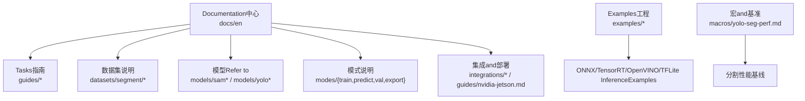
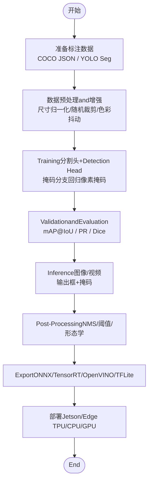
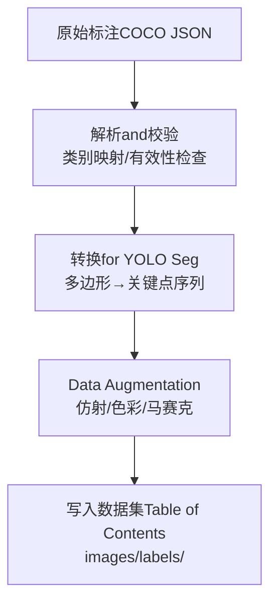
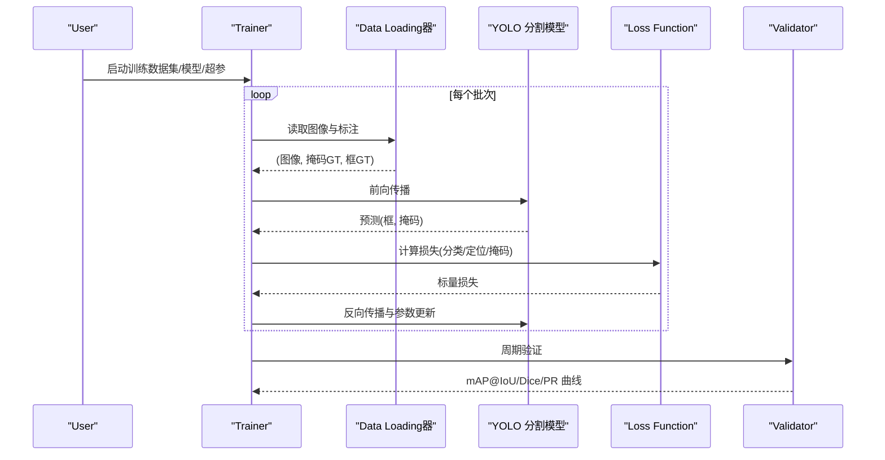
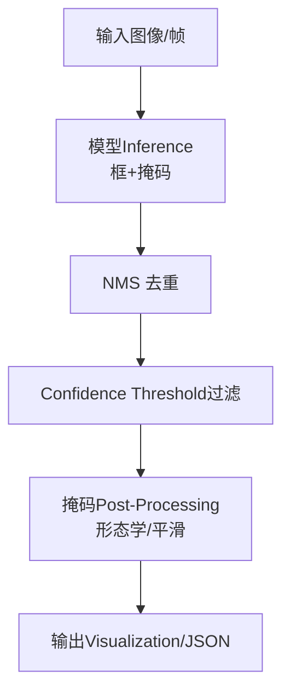
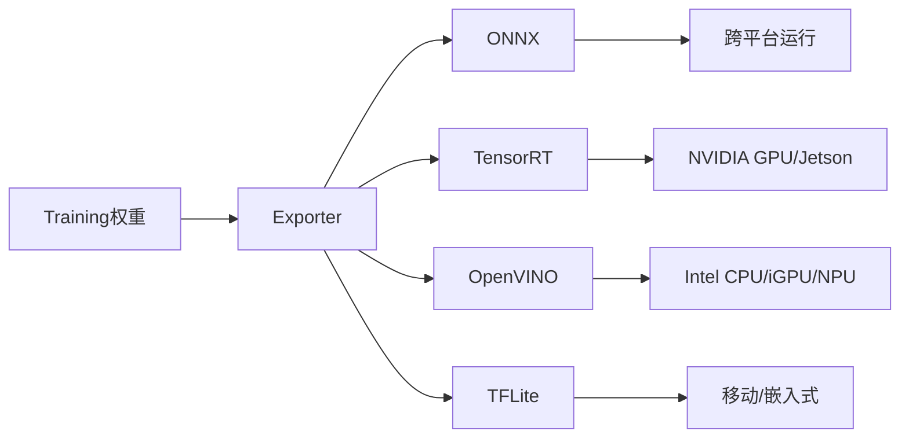
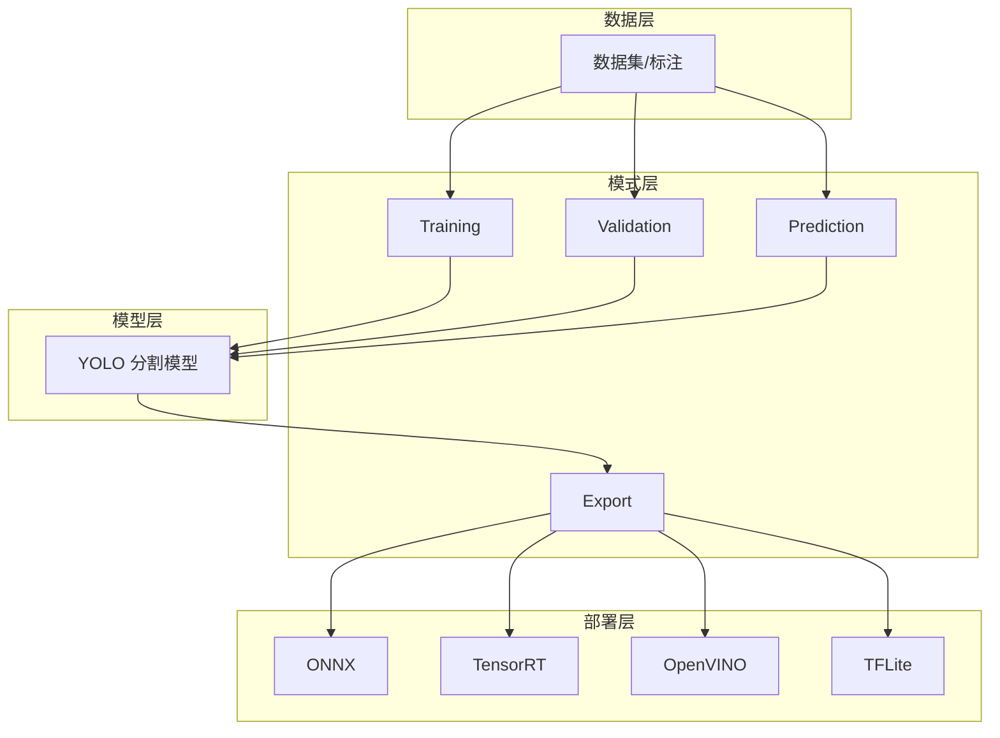

# Instance Segmentation Tutorial

<cite>
**Files Referenced in This Document**
- [README.md](file://README.md)
- [yolo-seg-perf.md](file://docs/en/macros/yolo-seg-perf.md)
- [instance-segmentation-and-tracking.md](file://docs/en/guides/instance-segmentation-and-tracking.md)
- [sam.md](file://docs/en/models/sam.md)
- [fast-sam.md](file://docs/en/models/fast-sam.md)
- [mobile-sam.md](file://docs/en/models/mobile-sam.md)
- [sam-2.md](file://docs/en/models/sam-2.md)
- [segment/index.md](file://docs/en/datasets/segment/index.md)
- [coco-to-yolo.md](file://docs/en/guides/coco-to-yolo.md)
- [preprocessing_annotated_data.md](file://docs/en/guides/preprocessing_annotated_data.md)
- [train.md](file://docs/en/modes/train.md)
- [predict.md](file://docs/en/modes/predict.md)
- [val.md](file://docs/en/modes/val.md)
- [yolo-performance-metrics.md](file://docs/en/guides/yolo-performance-metrics.md)
- [yolo-data-augmentation.md](file://docs/en/guides/yolo-data-augmentation.md)
- [sahi-tiled-inference.md](file://docs/en/guides/sahi-tiled-inference.md)
- [model-deployment-options.md](file://docs/en/guides/model-deployment-options.md)
- [nvidia-jetson.md](file://docs/en/guides/nvidia-jetson.md)
- [edge-tpu.md](file://docs/en/integrations/edge-tpu.md)
- [openvino.md](file://docs/en/integrations/openvino.md)
- [tensorrt.md](file://docs/en/integrations/tensorrt.md)
- [tflite.md](file://docs/en/integrations/tflite.md)
- [onnx.md](file://docs/en/integrations/onnx.md)
- [export.md](file://docs/en/modes/export.md)
- [yolo-architecture.md](file://docs/en/guides/yolo-architecture.md)
- [yolo-common-issues.md](file://docs/en/guides/yolo-common-issues.md)
- [yolo26-training-recipe.md](file://docs/en/guides/yolo26-training-recipe.md)
- [yolo_master_risk_remediation_plan.md](file://YOLO-Master-v260721-MoA-MoE-MoT-PEFT-Planner-深度分析-v4.md)
</cite>

## Table of Contents
1. [引言](#引言)
2. [Project Structure](#Project Structure)
3. [Core Components](#Core Components)
4. [Architecture Overview](#Architecture Overview)
5. [Detailed Component Analysis](#Detailed Component Analysis)
6. [Dependency Analysis](#Dependency Analysis)
7. [Performance Considerations](#Performance Considerations)
8. [Troubleshooting Guide](#Troubleshooting Guide)
9. [Conclusion](#Conclusion)
10. [Appendix](#Appendix)

## 引言
本教程targeting希望Uses YOLO-Master 完成Instance SegmentationTasks的EngineersandResearchers，系统讲解：
- Instance SegmentationandSemantic Segmentation的区别、典型应用场景
- 分割数据标注格式and预处理流程
- YOLO 分割模型and SAM 系列模型的对比and选型建议
- 完整Training流程：分割头配置、掩码生成、边界框Optimizationetc.关键技术细节
- 分割质量EvaluationMetrics（mAP@IoU、Dice 系数etc.）
- 结果Visualization and Post-Processing方法
- 边缘设备InferenceOptimization方案（TensorRT、OpenVINO、Edge TPU、TFLite etc.）

## Project Structure
仓库围绕“Documentation + Examples + 工具链”组织，and本教程相关的资料主要分布while docs and examples Table of Contents。下图给出and本教程直接相关的知识Modules关系。

Figure Source
- [yolo-seg-perf.md:1-200](file://docs/en/macros/yolo-seg-perf.md#L1-L200)
- [instance-segmentation-and-tracking.md:1-200](file://docs/en/guides/instance-segmentation-and-tracking.md#L1-L200)
- [segment/index.md:1-200](file://docs/en/datasets/segment/index.md#L1-L200)
- [train.md:1-200](file://docs/en/modes/train.md#L1-L200)
- [predict.md:1-200](file://docs/en/modes/predict.md#L1-L200)
- [val.md:1-200](file://docs/en/modes/val.md#L1-L200)
- [export.md:1-200](file://docs/en/modes/export.md#L1-L200)
- [nvidia-jetson.md:1-200](file://docs/en/guides/nvidia-jetson.md#L1-L200)
- [edge-tpu.md:1-200](file://docs/en/integrations/edge-tpu.md#L1-L200)
- [openvino.md:1-200](file://docs/en/integrations/openvino.md#L1-L200)
- [tensorrt.md:1-200](file://docs/en/integrations/tensorrt.md#L1-L200)
- [tflite.md:1-200](file://docs/en/integrations/tflite.md#L1-L200)
- [onnx.md:1-200](file://docs/en/integrations/onnx.md#L1-L200)

Section Source
- [README.md:1-200](file://README.md#L1-L200)
- [yolo-seg-perf.md:1-200](file://docs/en/macros/yolo-seg-perf.md#L1-L200)

## Core Components
- Tasksand模式
  - Training：定义数据集路径、类别数、增强策略、损失权重、Learning Rate调度etc.
  - Validation：计算 mAP@IoU、精度/召回、混淆矩阵etc.
  - Prediction：单图/视频流Inference，输出边界框and掩码
  - Export：Exporting to ONNX/TensorRT/OpenVINO/TFLite etc.目标格式
- 数据and标注
  - Supporting COCO JSON and YOLO Seg 格式；provides转换脚本and预处理指南
- 模型and架构
  - YOLO 分割头and检测分支共享Backbone Network，掩码分支while特征图上回归像素级掩码
  - SAM 系列（SAM、Fast-SAM、Mobile-SAM、SAM-2）强调Tips式/零样本capabilities，适合开放词汇场景
- EvaluationandVisualization
  - Metrics：mAP@IoU、PR 曲线、混淆矩阵、Dice 系数etc.
  - Visualization：掩码叠加、轮廓绘制、热力图etc.
- 部署andOptimization
  - 多后端Exportand运行时加速，适配 Jetson、Edge TPU、CPU/GPU etc.多种平台

Section Source
- [train.md:1-200](file://docs/en/modes/train.md#L1-L200)
- [val.md:1-200](file://docs/en/modes/val.md#L1-L200)
- [predict.md:1-200](file://docs/en/modes/predict.md#L1-L200)
- [export.md:1-200](file://docs/en/modes/export.md#L1-L200)
- [segment/index.md:1-200](file://docs/en/datasets/segment/index.md#L1-L200)
- [coco-to-yolo.md:1-200](file://docs/en/guides/coco-to-yolo.md#L1-L200)
- [preprocessing_annotated_data.md:1-200](file://docs/en/guides/preprocessing_annotated_data.md#L1-L200)
- [yolo-performance-metrics.md:1-200](file://docs/en/guides/yolo-performance-metrics.md#L1-L200)
- [yolo-architecture.md:1-200](file://docs/en/guides/yolo-architecture.md#L1-L200)

## Architecture Overview
下图展示从数据toTraining、Validation、InferenceandExport的端to端流程，并标注关键Documentation入口。

Figure Source
- [train.md:1-200](file://docs/en/modes/train.md#L1-L200)
- [val.md:1-200](file://docs/en/modes/val.md#L1-L200)
- [predict.md:1-200](file://docs/en/modes/predict.md#L1-L200)
- [export.md:1-200](file://docs/en/modes/export.md#L1-L200)
- [segment/index.md:1-200](file://docs/en/datasets/segment/index.md#L1-L200)
- [coco-to-yolo.md:1-200](file://docs/en/guides/coco-to-yolo.md#L1-L200)
- [preprocessing_annotated_data.md:1-200](file://docs/en/guides/preprocessing_annotated_data.md#L1-L200)
- [yolo-performance-metrics.md:1-200](file://docs/en/guides/yolo-performance-metrics.md#L1-L200)
- [nvidia-jetson.md:1-200](file://docs/en/guides/nvidia-jetson.md#L1-L200)
- [edge-tpu.md:1-200](file://docs/en/integrations/edge-tpu.md#L1-L200)
- [openvino.md:1-200](file://docs/en/integrations/openvino.md#L1-L200)
- [tensorrt.md:1-200](file://docs/en/integrations/tensorrt.md#L1-L200)
- [tflite.md:1-200](file://docs/en/integrations/tflite.md#L1-L200)
- [onnx.md:1-200](file://docs/en/integrations/onnx.md#L1-L200)

## Detailed Component Analysis

### 概念and差异：Instance Segmentation vs Semantic Segmentation
- Instance Segmentation：对每个目标实例分别生成独立掩码，区分同类不同对象，适用于计数、Tracking、精细交互etc.
- Semantic Segmentation：将像素划分for若干语义类别，不区分同一类的不同实例，适用于场景理解、地图构建etc.
- 选择建议：需要“逐实例”的下游Tasks（such as统计、Tracking、抠图）优先Instance Segmentation；仅需“像素级类别”则选Semantic Segmentation

Section Source
- [instance-segmentation-and-tracking.md:1-200](file://docs/en/guides/instance-segmentation-and-tracking.md#L1-L200)

### 数据标注格式and预处理
- 标注格式
  - COCO JSON：包含图像信息、类别字典、目标列表（bbox、segmentation 多边形或 RLE）、图像尺寸etc.
  - YOLO Seg：每行一个目标，格式for class x_center y_center width height 后接按顺时针顺序排列的归一化关键点坐标序列
- 数据转换
  - provides COCO JSON 转 YOLO Seg 的工具and说明
- 预处理and增强
  - 常见步骤：尺寸缩放/填充、随机翻转/旋转、色彩抖动、马赛克/Mixture增强、Mosaic etc.
  - 注意：掩码需and几何变换同步更新，保持像素对齐

Figure Source
- [segment/index.md:1-200](file://docs/en/datasets/segment/index.md#L1-L200)
- [coco-to-yolo.md:1-200](file://docs/en/guides/coco-to-yolo.md#L1-L200)
- [preprocessing_annotated_data.md:1-200](file://docs/en/guides/preprocessing_annotated_data.md#L1-L200)
- [yolo-data-augmentation.md:1-200](file://docs/en/guides/yolo-data-augmentation.md#L1-L200)

Section Source
- [segment/index.md:1-200](file://docs/en/datasets/segment/index.md#L1-L200)
- [coco-to-yolo.md:1-200](file://docs/en/guides/coco-to-yolo.md#L1-L200)
- [preprocessing_annotated_data.md:1-200](file://docs/en/guides/preprocessing_annotated_data.md#L1-L200)
- [yolo-data-augmentation.md:1-200](file://docs/en/guides/yolo-data-augmentation.md#L1-L200)

### 模型对比：YOLO 分割 vs SAM 系列
- YOLO 分割
  - 特点：端to端Training、速度快、易于部署，适合大规模工业落地
  - 适用：固定类别集、高吞吐实时场景、资源受限环境
- SAM 系列（SAM、Fast-SAM、Mobile-SAM、SAM-2）
  - 特点：Tips式/零样本capabilities强，泛化性佳，适合开放词汇and少样本场景
  - 适用：交互式标注、跨域Migration、复杂背景下的通用分割
- 选型建议
  - 若类别稳定且追求极致速度：优先 YOLO 分割
  - 若需灵活Tips/零样本/跨域Migration：优先 SAM 系列

Section Source
- [sam.md:1-200](file://docs/en/models/sam.md#L1-L200)
- [fast-sam.md:1-200](file://docs/en/models/fast-sam.md#L1-L200)
- [mobile-sam.md:1-200](file://docs/en/models/mobile-sam.md#L1-L200)
- [sam-2.md:1-200](file://docs/en/models/sam-2.md#L1-L200)
- [yolo-architecture.md:1-200](file://docs/en/guides/yolo-architecture.md#L1-L200)

### Training流程and技术细节
- Training入口and参数
  - ViaTraining模式指定数据集 YAML、模型配置、Batch Size、迭代次数、Learning Rate策略etc.
- 分割头and掩码生成
  - 分割头while高层特征图上回归每目标的像素级掩码；掩码通常and检测分支共享骨干特征
  - 掩码标签由标注多边形经栅格化得to，需and图像增强同步变换
- 边界框Optimization
  - 检测分支同时Optimization bbox，掩码and bbox 联合Optimization有助于提升定位and分割一致性
- 损失and正则
  - 常用损失包括分类、定位、掩码交叉熵/二值交叉熵、Dice 类损失etc.；可Combining正则and早停策略
- 超参调优
  - Refer toTraining配方and性能基线，进行网格搜索或贝叶斯Optimization

Figure Source
- [train.md:1-200](file://docs/en/modes/train.md#L1-L200)
- [val.md:1-200](file://docs/en/modes/val.md#L1-L200)
- [yolo-performance-metrics.md:1-200](file://docs/en/guides/yolo-performance-metrics.md#L1-L200)
- [yolo26-training-recipe.md:1-200](file://docs/en/guides/yolo26-training-recipe.md#L1-L200)

Section Source
- [train.md:1-200](file://docs/en/modes/train.md#L1-L200)
- [val.md:1-200](file://docs/en/modes/val.md#L1-L200)
- [yolo-performance-metrics.md:1-200](file://docs/en/guides/yolo-performance-metrics.md#L1-L200)
- [yolo26-training-recipe.md:1-200](file://docs/en/guides/yolo26-training-recipe.md#L1-L200)

### EvaluationMetricsandVisualization
- Metrics
  - mAP@IoU：不同 IoU 阈值下的平均精度，衡量定位and分割综合质量
  - PR 曲线and AUC：反映while不同Confidence Threshold下的精度-召回权衡
  - Dice 系数：衡量掩码and GT 的重叠程度，常用于医学/细粒度场景
- Visualization
  - 掩码叠加、轮廓描边、热力图、类别颜色映射
  - 批量结果汇总and趋势图

Section Source
- [yolo-performance-metrics.md:1-200](file://docs/en/guides/yolo-performance-metrics.md#L1-L200)
- [predict.md:1-200](file://docs/en/modes/predict.md#L1-L200)

### InferenceandPost-Processing
- Inference模式
  - Supporting图像/视频流Inference，输出类别、置信度、边界框and掩码
- Post-Processing
  - NMS/软 NMS 抑制重复框
  - Confidence Threshold过滤
  - 掩码形态学操作（开闭运算、孔洞填充）
  - 大图分块Inference（SAHI）降低显存压力并提升小目标召回

Figure Source
- [predict.md:1-200](file://docs/en/modes/predict.md#L1-L200)
- [sahi-tiled-inference.md:1-200](file://docs/en/guides/sahi-tiled-inference.md#L1-L200)

Section Source
- [predict.md:1-200](file://docs/en/modes/predict.md#L1-L200)
- [sahi-tiled-inference.md:1-200](file://docs/en/guides/sahi-tiled-inference.md#L1-L200)

### Exportand部署（边缘设备Optimization）
- Export目标
  - ONNX：跨框架通用中间表示
  - TensorRT：NVIDIA GPU 高性能Inference
  - OpenVINO：Intel CPU/iGPU/NPU Optimization
  - TFLite：移动端/嵌入式部署
- 部署平台
  - NVIDIA Jetson：利用 TensorRT/DeepStream Optimization
  - Edge TPU：低功耗边缘Inference
  - 其他：CoreML、NCNN、MNN、RKNN etc.（见集成Documentation）

Figure Source
- [export.md:1-200](file://docs/en/modes/export.md#L1-L200)
- [onnx.md:1-200](file://docs/en/integrations/onnx.md#L1-L200)
- [tensorrt.md:1-200](file://docs/en/integrations/tensorrt.md#L1-L200)
- [openvino.md:1-200](file://docs/en/integrations/openvino.md#L1-L200)
- [tflite.md:1-200](file://docs/en/integrations/tflite.md#L1-L200)
- [nvidia-jetson.md:1-200](file://docs/en/guides/nvidia-jetson.md#L1-L200)
- [edge-tpu.md:1-200](file://docs/en/integrations/edge-tpu.md#L1-L200)
- [model-deployment-options.md:1-200](file://docs/en/guides/model-deployment-options.md#L1-L200)

Section Source
- [export.md:1-200](file://docs/en/modes/export.md#L1-L200)
- [onnx.md:1-200](file://docs/en/integrations/onnx.md#L1-L200)
- [tensorrt.md:1-200](file://docs/en/integrations/tensorrt.md#L1-L200)
- [openvino.md:1-200](file://docs/en/integrations/openvino.md#L1-L200)
- [tflite.md:1-200](file://docs/en/integrations/tflite.md#L1-L200)
- [nvidia-jetson.md:1-200](file://docs/en/guides/nvidia-jetson.md#L1-L200)
- [edge-tpu.md:1-200](file://docs/en/integrations/edge-tpu.md#L1-L200)
- [model-deployment-options.md:1-200](file://docs/en/guides/model-deployment-options.md#L1-L200)

## Dependency Analysis
- DocumentationCohesion and Coupling
  - Training/Validation/Prediction/Export四大模式相互解耦，through a unified数据接口and模型接口协作
  - 数据集and标注格式while多个环节复用（Training、Validation、Inference）
- External Dependencies
  - Exportand部署依赖各后端 SDK（TensorRT、OpenVINO、TFLite etc.）
  - Visualizationand评测依赖绘图andMetrics库（见性能andMetricsDocumentation）

Figure Source
- [train.md:1-200](file://docs/en/modes/train.md#L1-L200)
- [val.md:1-200](file://docs/en/modes/val.md#L1-L200)
- [predict.md:1-200](file://docs/en/modes/predict.md#L1-L200)
- [export.md:1-200](file://docs/en/modes/export.md#L1-L200)
- [segment/index.md:1-200](file://docs/en/datasets/segment/index.md#L1-L200)
- [onnx.md:1-200](file://docs/en/integrations/onnx.md#L1-L200)
- [tensorrt.md:1-200](file://docs/en/integrations/tensorrt.md#L1-L200)
- [openvino.md:1-200](file://docs/en/integrations/openvino.md#L1-L200)
- [tflite.md:1-200](file://docs/en/integrations/tflite.md#L1-L200)

## Performance Considerations
- Training阶段
  - Set appropriatelyBatch Size、Learning Rateand warmup，避免Gradient爆炸/消失
  - Uses数据并行/Mixture精度提升吞吐
  - 针对小目标增加高分辨率分支或切片Inference（SAHI）
- Inference阶段
  - 选择合适后端（GPU 用 TensorRT，CPU/iGPU 用 OpenVINO，移动端用 TFLite）
  - 量化and算子融合（INT8/FP16），减少内存带宽bottlenecks
  - 动态形状and批处理Optimization，Combining流水线并行
- 部署阶段
  - 模型瘦身（剪枝/蒸馏），按需加载专家/路由（参见 MoE/LoRA 相关Documentation）
  - 监控and回滚机制，保障线上稳定性

Section Source
- [yolo-seg-perf.md:1-200](file://docs/en/macros/yolo-seg-perf.md#L1-L200)
- [yolo26-training-recipe.md:1-200](file://docs/en/guides/yolo26-training-recipe.md#L1-L200)
- [model-deployment-options.md:1-200](file://docs/en/guides/model-deployment-options.md#L1-L200)

## Troubleshooting Guide
- 常见问题
  - 标注错误：类别越界、掩码for空、坐标越界
  - Training不稳定：损失震荡、NaN、过拟合/欠拟合
  - Inference异常：低召回、误检、掩码破碎
- 排查要点
  - 数据侧：检查标注完整性and一致性，抽样Visualization确认增强效果
  - 模型侧：调整Learning Rate/正则/损失权重，观察 PR 曲线and混淆矩阵
  - 部署侧：核对Export选项and运行时版本，复现实验环境and依赖

Section Source
- [yolo-common-issues.md:1-200](file://docs/en/guides/yolo-common-issues.md#L1-L200)
- [yolo-performance-metrics.md:1-200](file://docs/en/guides/yolo-performance-metrics.md#L1-L200)

## Conclusion
- 对于固定类别、追求速度and部署便利性的场景，YOLO 分割是首选
- 对于开放词汇、Tips式或跨域Migration需求，SAM 系列更具优势
- Centered on数据质量for核心，Combined with合理的增强、Training配方andPost-Processing，可显著提升分割质量
- 借助多后端Exportand量化Optimization，可while边缘设备上implementing高效稳定的Inference

## Appendix
- 快速上手清单
  - 准备数据 → 转换标注 → 配置Training → TrainingandValidation → InferenceandVisualization → Exportand部署
- Refer toDocumentation索引
  - Tasksand模式：[train.md](file://docs/en/modes/train.md)、[val.md](file://docs/en/modes/val.md)、[predict.md](file://docs/en/modes/predict.md)、[export.md](file://docs/en/modes/export.md)
  - 数据and标注：[segment/index.md](file://docs/en/datasets/segment/index.md)、[coco-to-yolo.md](file://docs/en/guides/coco-to-yolo.md)、[preprocessing_annotated_data.md](file://docs/en/guides/preprocessing_annotated_data.md)
  - 模型and架构：[yolo-architecture.md](file://docs/en/guides/yolo-architecture.md)、[sam.md](file://docs/en/models/sam.md)、[fast-sam.md](file://docs/en/models/fast-sam.md)、[mobile-sam.md](file://docs/en/models/mobile-sam.md)、[sam-2.md](file://docs/en/models/sam-2.md)
  - EvaluationandVisualization：[yolo-performance-metrics.md](file://docs/en/guides/yolo-performance-metrics.md)
  - 部署and集成：[nvidia-jetson.md](file://docs/en/guides/nvidia-jetson.md)、[edge-tpu.md](file://docs/en/integrations/edge-tpu.md)、[openvino.md](file://docs/en/integrations/openvino.md)、[tensorrt.md](file://docs/en/integrations/tensorrt.md)、[tflite.md](file://docs/en/integrations/tflite.md)、[onnx.md](file://docs/en/integrations/onnx.md)
  - 高级主题：[yolo26-training-recipe.md](file://docs/en/guides/yolo26-training-recipe.md)、[yolo_master_risk_remediation_plan.md](file://YOLO-Master-v260721-MoA-MoE-MoT-PEFT-Planner-深度分析-v4.md)