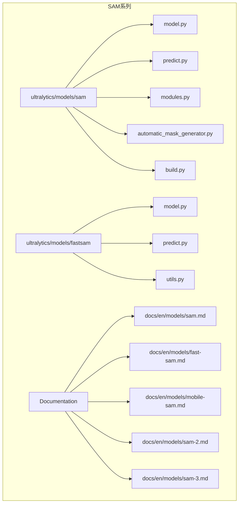
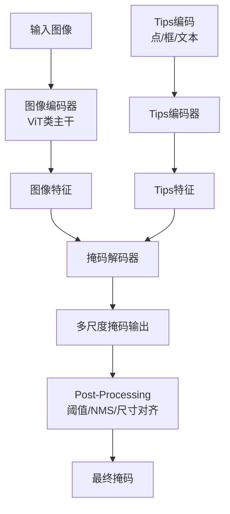
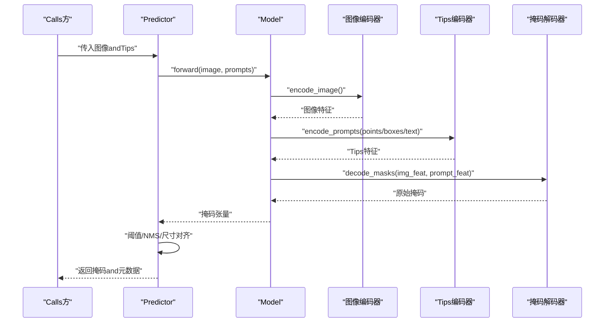
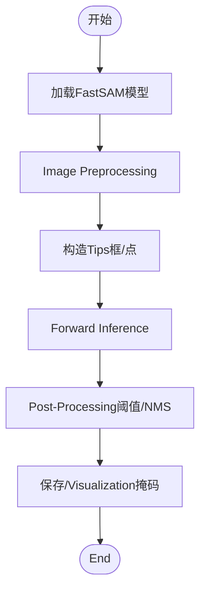
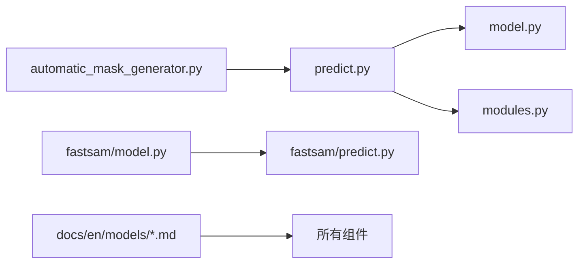

# SAM系列分割模型

<cite>
**Files Referenced in This Document**
- [ultralytics/models/sam/__init__.py](file://ultralytics/models/sam/__init__.py)
- [ultralytics/models/sam/model.py](file://ultralytics/models/sam/model.py)
- [ultralytics/models/sam/predict.py](file://ultralytics/models/sam/predict.py)
- [ultralytics/models/sam/automatic_mask_generator.py](file://ultralytics/models/sam/automatic_mask_generator.py)
- [ultralytics/models/sam/build.py](file://ultralytics/models/sam/build.py)
- [ultralytics/models/sam/modules.py](file://ultralytics/models/sam/modules.py)
- [ultralytics/models/fastsam/__init__.py](file://ultralytics/models/fastsam/__init__.py)
- [ultralytics/models/fastsam/model.py](file://ultralytics/models/fastsam/model.py)
- [ultralytics/models/fastsam/predict.py](file://ultralytics/models/fastsam/predict.py)
- [ultralytics/models/fastsam/utils.py](file://ultralytics/models/fastsam/utils.py)
- [docs/en/models/sam.md](file://docs/en/models/sam.md)
- [docs/en/models/fast-sam.md](file://docs/en/models/fast-sam.md)
- [docs/en/models/mobile-sam.md](file://docs/en/models/mobile-sam.md)
- [docs/en/models/sam-2.md](file://docs/en/models/sam-2.md)
- [docs/en/models/sam-3.md](file://docs/en/models/sam-3.md)
- [examples/YOLOv8-Segmentation-ONNXRuntime-Python/main.py](file://examples/YOLOv8-Segmentation-ONNXRuntime-Python/main.py)
</cite>

## Table of Contents
1. [Introduction](#Introduction)
2. [Project Structure](#Project Structure)
3. [Core Components](#Core Components)
4. [Architecture Overview](#Architecture Overview)
5. [Detailed Component Analysis](#Detailed Component Analysis)
6. [Dependency Analysis](#Dependency Analysis)
7. [性能and部署考量](#性能and部署考量)
8. [Tips工程（Prompt Engineering）指南](#Tips工程prompt-engineering指南)
9. [微调and领域适配](#微调and领域适配)
10. [故障排查](#故障排查)
11. [Conclusion](#Conclusion)
12. [Appendix：Refer toimplementing路径](#AppendixRefer toimplementing路径)

## Introduction
本指南targeting希望系统掌握并落地SAM系列分割模型的EngineersandResearchers，围绕Centered on下目标unfold：
- 深入解析Segment Anything Model（SAM）的架构设计and零样本分割capabilities
- 对比SAM、FastSAM、MobileSAMetc.变体的特点、性能差异andApplicable Scenarios
- 说明点Tips、框Tips、文本Tipsetc.Tips工程方法whileSAM中的应用
- provides可操作的微调策略and领域适配方案
- 给出实际应用场景的代码Examplesand最佳实践

## Project Structure
本项目whileultralytics框架内对SAM系列进行了集成，包含标准SAM、FastSAMCentered onandDocumentation中提and的MobileSAM、SAM-2、SAM-3etc.。核心代码位于ultralytics/models/samandultralytics/models/fastsam两个子包，配套Documentation位于docs/en/models下。

Figure Source
- [ultralytics/models/sam/model.py](file://ultralytics/models/sam/model.py)
- [ultralytics/models/sam/predict.py](file://ultralytics/models/sam/predict.py)
- [ultralytics/models/sam/modules.py](file://ultralytics/models/sam/modules.py)
- [ultralytics/models/sam/automatic_mask_generator.py](file://ultralytics/models/sam/automatic_mask_generator.py)
- [ultralytics/models/sam/build.py](file://ultralytics/models/sam/build.py)
- [ultralytics/models/fastsam/model.py](file://ultralytics/models/fastsam/model.py)
- [ultralytics/models/fastsam/predict.py](file://ultralytics/models/fastsam/predict.py)
- [ultralytics/models/fastsam/utils.py](file://ultralytics/models/fastsam/utils.py)
- [docs/en/models/sam.md](file://docs/en/models/sam.md)
- [docs/en/models/fast-sam.md](file://docs/en/models/fast-sam.md)
- [docs/en/models/mobile-sam.md](file://docs/en/models/mobile-sam.md)
- [docs/en/models/sam-2.md](file://docs/en/models/sam-2.md)
- [docs/en/models/sam-3.md](file://docs/en/models/sam-3.md)

Section Source
- [ultralytics/models/sam/__init__.py](file://ultralytics/models/sam/__init__.py)
- [ultralytics/models/fastsam/__init__.py](file://ultralytics/models/fastsam/__init__.py)
- [docs/en/models/sam.md](file://docs/en/models/sam.md)
- [docs/en/models/fast-sam.md](file://docs/en/models/fast-sam.md)
- [docs/en/models/mobile-sam.md](file://docs/en/models/mobile-sam.md)
- [docs/en/models/sam-2.md](file://docs/en/models/sam-2.md)
- [docs/en/models/sam-3.md](file://docs/en/models/sam-3.md)

## Core Components
- SAM主模型andPredictor
  - model.py：定义SAM模型结构and加载逻辑
  - predict.py：EncapsulatesInference流程，Supporting点/框/文本etc.MultimodalTips
  - modules.py：图像编码器、Tips编码器、掩码解码器etc.关键Modules
  - automatic_mask_generator.py：无Tips自动掩码生成（such as网格采样+NMS）
  - build.py：构建and注册模型入口
- FastSAM
  - model.py/predict.py：targeting实时分割的高效implementing
  - utils.py：工具函数andPost-Processing
- Documentation
  - docs/en/models/*.md：各变体特性、参数andUses指引

Section Source
- [ultralytics/models/sam/model.py](file://ultralytics/models/sam/model.py)
- [ultralytics/models/sam/predict.py](file://ultralytics/models/sam/predict.py)
- [ultralytics/models/sam/modules.py](file://ultralytics/models/sam/modules.py)
- [ultralytics/models/sam/automatic_mask_generator.py](file://ultralytics/models/sam/automatic_mask_generator.py)
- [ultralytics/models/sam/build.py](file://ultralytics/models/sam/build.py)
- [ultralytics/models/fastsam/model.py](file://ultralytics/models/fastsam/model.py)
- [ultralytics/models/fastsam/predict.py](file://ultralytics/models/fastsam/predict.py)
- [ultralytics/models/fastsam/utils.py](file://ultralytics/models/fastsam/utils.py)

## Architecture Overview
SAM采用“图像编码器 + Tips编码器 + 轻量掩码解码器”的三分支架构，具备强大的零样本泛化capabilities。FastSAMWhile maintaining交互capabilitiesOptimization了速度；MobileSAMVia轻量化主干提升移动端效率；SAM-2/SAM-3for后续演进版本，Documentation中provides了进一步特性说明。

Figure Source
- [ultralytics/models/sam/model.py](file://ultralytics/models/sam/model.py)
- [ultralytics/models/sam/modules.py](file://ultralytics/models/sam/modules.py)
- [ultralytics/models/sam/predict.py](file://ultralytics/models/sam/predict.py)

## Detailed Component Analysis

### SAM主模型andPredictor
- 模型结构
  - 图像编码器：基于视觉Transformer的主干，提取多尺度特征
  - Tips编码器：将点、框、文本etc.Tips映射to统一空间
  - 掩码解码器：融合图像andTips特征，输出高质量掩码
- Inference流程
  - 预处理：图像归一化、尺寸调整
  - Tips构造：点坐标、边界框、文本描述
  - 前向传播：编码器→Tips编码→解码器
  - Post-Processing：阈值过滤、Non-Maximum Suppression、掩码上采样
- 自动掩码生成
  - 网格采样Tips点，Batch Inference后合并结果

Figure Source
- [ultralytics/models/sam/predict.py](file://ultralytics/models/sam/predict.py)
- [ultralytics/models/sam/model.py](file://ultralytics/models/sam/model.py)
- [ultralytics/models/sam/modules.py](file://ultralytics/models/sam/modules.py)

Section Source
- [ultralytics/models/sam/model.py](file://ultralytics/models/sam/model.py)
- [ultralytics/models/sam/predict.py](file://ultralytics/models/sam/predict.py)
- [ultralytics/models/sam/modules.py](file://ultralytics/models/sam/modules.py)
- [ultralytics/models/sam/automatic_mask_generator.py](file://ultralytics/models/sam/automatic_mask_generator.py)

### FastSAM
- 设计要点
  - 针对实时场景Optimization的分割管线
  - 更轻量的Tips处理and解码策略
- Typical Usage
  - Centered on框或点Tips进行快速Instance Segmentation
  - 适合视频流and边缘设备

Figure Source
- [ultralytics/models/fastsam/model.py](file://ultralytics/models/fastsam/model.py)
- [ultralytics/models/fastsam/predict.py](file://ultralytics/models/fastsam/predict.py)
- [ultralytics/models/fastsam/utils.py](file://ultralytics/models/fastsam/utils.py)

Section Source
- [ultralytics/models/fastsam/model.py](file://ultralytics/models/fastsam/model.py)
- [ultralytics/models/fastsam/predict.py](file://ultralytics/models/fastsam/predict.py)
- [ultralytics/models/fastsam/utils.py](file://ultralytics/models/fastsam/utils.py)

### MobileSAM、SAM-2、SAM-3（概念性概览）
- MobileSAM：targeting移动端的轻量化变体，强调低延迟and小体积
- SAM-2/SAM-3：whileDocumentation中作for后续版本介绍，通常包含更强的Tips建模、时序扩展或更高效的结构
- 选择建议
  - 资源受限/移动端：优先MobileSAM
  - 通用零样本分割：SAM
  - 实时需求：FastSAM

Section Source
- [docs/en/models/mobile-sam.md](file://docs/en/models/mobile-sam.md)
- [docs/en/models/sam-2.md](file://docs/en/models/sam-2.md)
- [docs/en/models/sam-3.md](file://docs/en/models/sam-3.md)

## Dependency Analysis
- Modules耦合
  - predict.py依赖model.pyandmodules.py完成端to端Inference
  - automatic_mask_generator.py复用predict接口进行批量Tips生成
  - fastsam子包独立于sam，但遵循相似的Tips-解码范式
- External Dependencies
  - 图像处理and张量操作由底层框架provides
  - Exportand部署可ViaONNX/TensorRTetc.后端（见Examples）

Figure Source
- [ultralytics/models/sam/predict.py](file://ultralytics/models/sam/predict.py)
- [ultralytics/models/sam/model.py](file://ultralytics/models/sam/model.py)
- [ultralytics/models/sam/modules.py](file://ultralytics/models/sam/modules.py)
- [ultralytics/models/sam/automatic_mask_generator.py](file://ultralytics/models/sam/automatic_mask_generator.py)
- [ultralytics/models/fastsam/model.py](file://ultralytics/models/fastsam/model.py)
- [ultralytics/models/fastsam/predict.py](file://ultralytics/models/fastsam/predict.py)
- [docs/en/models/sam.md](file://docs/en/models/sam.md)
- [docs/en/models/fast-sam.md](file://docs/en/models/fast-sam.md)

Section Source
- [ultralytics/models/sam/build.py](file://ultralytics/models/sam/build.py)
- [ultralytics/models/fastsam/__init__.py](file://ultralytics/models/fastsam/__init__.py)

## 性能and部署考量
- Inference加速
  - UsesONNXExportand运行时（Examples见YOLOv8 Segmentation ONNXRuntime）
  - 批处理and内存池减少重复分配
- 精度-速度权衡
  - SAM：高精度、较高算力
  - FastSAM：更快、略降精度
  - MobileSAM：移动端友好
- 部署建议
  - 服务端：TensorRT/ONNX Runtime
  - 边缘端：量化and算子融合
  - 视频流：滑动窗口andTips复用

Section Source
- [examples/YOLOv8-Segmentation-ONNXRuntime-Python/main.py](file://examples/YOLOv8-Segmentation-ONNXRuntime-Python/main.py)
- [docs/en/models/sam.md](file://docs/en/models/sam.md)
- [docs/en/models/fast-sam.md](file://docs/en/models/fast-sam.md)
- [docs/en/models/mobile-sam.md](file://docs/en/models/mobile-sam.md)

## Tips工程（Prompt Engineering）指南
- 点Tips
  - 单点定位前景/背景
  - 多点组合细化复杂对象
- 框Tips
  - 矩形框快速圈定目标区域
  - Combining点Tips提高边界贴合度
- 文本Tips
  - 自然语言描述目标属性（颜色、材质、类别）
  - 适用于开放词汇场景
- 最佳实践
  - 先粗后精：先用框定位，再用点修正
  - 多Tips融合：叠加多个点/框提升鲁棒性
  - 文本Tips简洁明确，避免歧义

Section Source
- [docs/en/models/sam.md](file://docs/en/models/sam.md)
- [docs/en/models/fast-sam.md](file://docs/en/models/fast-sam.md)
- [ultralytics/models/sam/predict.py](file://ultralytics/models/sam/predict.py)

## 微调and领域适配
- 全量微调
  - 适用于大规模领域数据，注意过拟合and计算成本
- 部分微调
  - 冻结主干，仅TrainingTips编码器或解码器
- Parameter-Efficient Fine-Tuning（PEFT）
  - LoRA/Adapteretc.方法降低显存占用andTraining时长
- Data Preparation
  - 标注格式统一（掩码/边界框/点）
  - Data Augmentation（裁剪、翻转、色彩抖动）
- Evaluationand迭代
  - 划分Validation集，监控IoU/APetc.Metrics
  - 错误分析drivers are installedTips策略and数据改进

Section Source
- [docs/en/models/sam.md](file://docs/en/models/sam.md)
- [docs/en/models/fast-sam.md](file://docs/en/models/fast-sam.md)

## 故障排查
- 常见问题
  - Tips越界或尺寸不匹配：检查坐标范围and图像尺寸
  - 掩码空洞或碎片：调整阈值andNMS参数
  - 文本Tips无效：确认文本编码是否启用且模型Supporting
- 调试建议
  - 逐步打印中间特征维度
  - VisualizationTipsand中间掩码定位问题
  - Uses自动掩码生成器辅助定位困难样本

Section Source
- [ultralytics/models/sam/automatic_mask_generator.py](file://ultralytics/models/sam/automatic_mask_generator.py)
- [ultralytics/models/sam/predict.py](file://ultralytics/models/sam/predict.py)

## Conclusion
SAM系列for开放词汇and零样本分割provides了强大基座。根据Tasks需求选择合适的变体（SAM/FastSAM/MobileSAM），Combined with合理的Tips工程and微调策略，可while多种场景中取得良好效果。CombiningExportand部署Optimization，可implementing从云端to边缘的全链路落地。

## Appendix：Refer toimplementing路径
- SAM主模型andPredictor
  - [ultralytics/models/sam/model.py](file://ultralytics/models/sam/model.py)
  - [ultralytics/models/sam/predict.py](file://ultralytics/models/sam/predict.py)
  - [ultralytics/models/sam/modules.py](file://ultralytics/models/sam/modules.py)
  - [ultralytics/models/sam/automatic_mask_generator.py](file://ultralytics/models/sam/automatic_mask_generator.py)
  - [ultralytics/models/sam/build.py](file://ultralytics/models/sam/build.py)
- FastSAM
  - [ultralytics/models/fastsam/model.py](file://ultralytics/models/fastsam/model.py)
  - [ultralytics/models/fastsam/predict.py](file://ultralytics/models/fastsam/predict.py)
  - [ultralytics/models/fastsam/utils.py](file://ultralytics/models/fastsam/utils.py)
- Documentationand变体说明
  - [docs/en/models/sam.md](file://docs/en/models/sam.md)
  - [docs/en/models/fast-sam.md](file://docs/en/models/fast-sam.md)
  - [docs/en/models/mobile-sam.md](file://docs/en/models/mobile-sam.md)
  - [docs/en/models/sam-2.md](file://docs/en/models/sam-2.md)
  - [docs/en/models/sam-3.md](file://docs/en/models/sam-3.md)
- 部署Examples（ONNXRuntime）
  - [examples/YOLOv8-Segmentation-ONNXRuntime-Python/main.py](file://examples/YOLOv8-Segmentation-ONNXRuntime-Python/main.py)