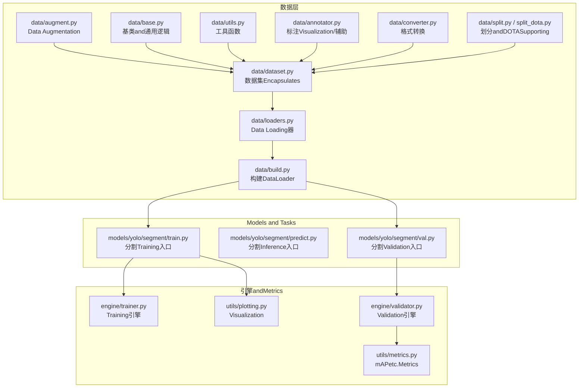
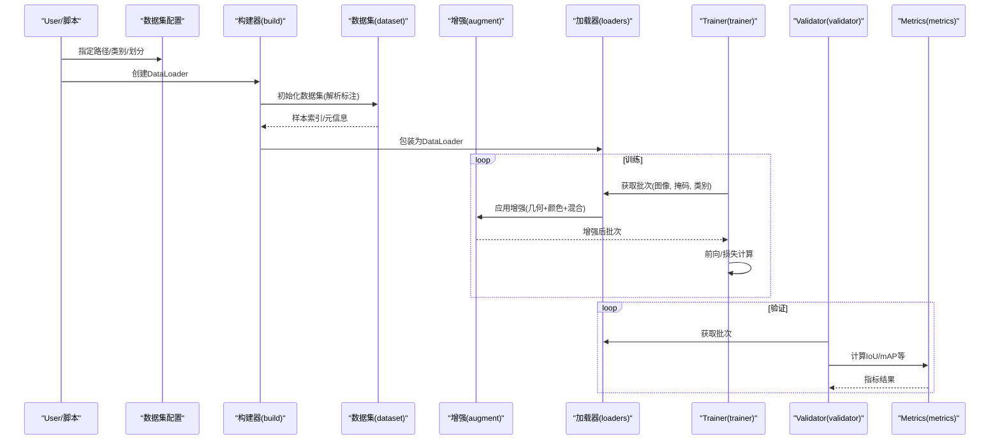
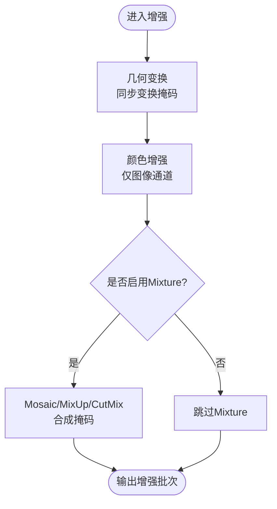
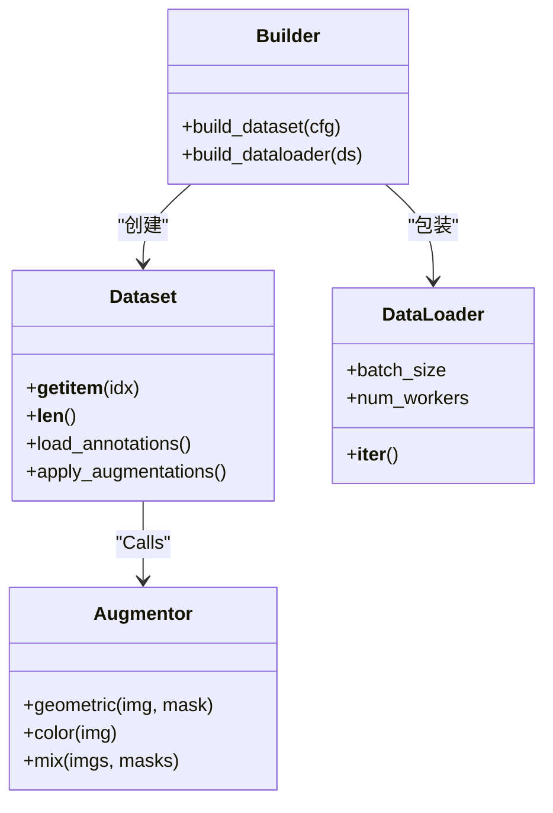
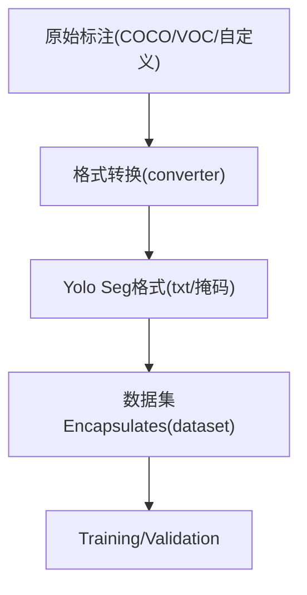
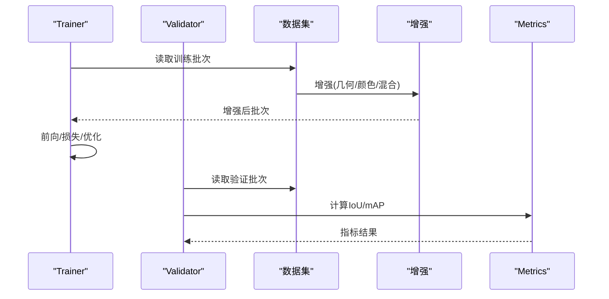
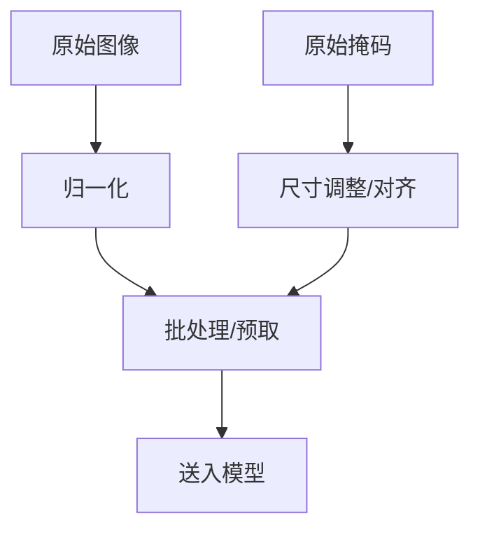
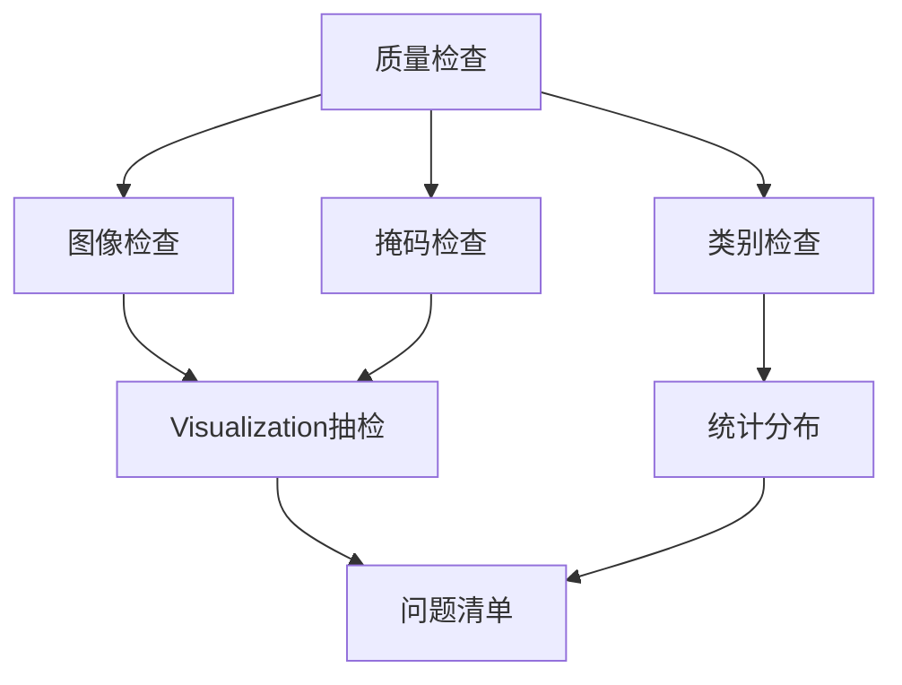
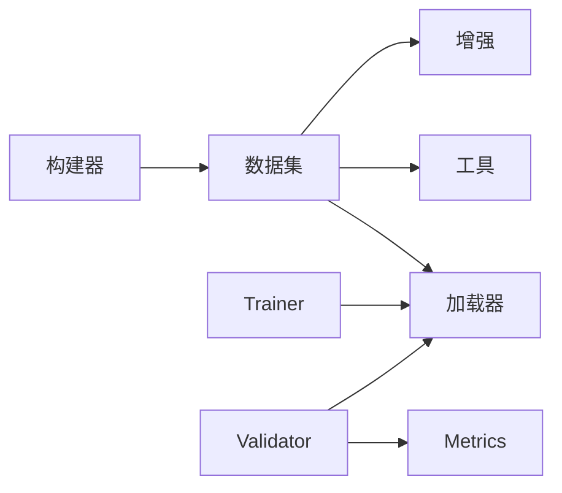

# 分割Data Preparationand标注

<cite>
**Files Referenced in This Document**
- [ultralytics/data/augment.py](file://ultralytics/data/augment.py)
- [ultralytics/data/dataset.py](file://ultralytics/data/dataset.py)
- [ultralytics/data/loaders.py](file://ultralytics/data/loaders.py)
- [ultralytics/data/base.py](file://ultralytics/data/base.py)
- [ultralytics/data/utils.py](file://ultralytics/data/utils.py)
- [ultralytics/data/annotator.py](file://ultralytics/data/annotator.py)
- [ultralytics/data/build.py](file://ultralytics/data/build.py)
- [ultralytics/data/converter.py](file://ultralytics/data/converter.py)
- [ultralytics/data/split.py](file://ultralytics/data/split.py)
- [ultralytics/data/split_dota.py](file://ultralytics/data/split_dota.py)
- [ultralytics/models/yolo/segment/train.py](file://ultralytics/models/yolo/segment/train.py)
- [ultralytics/models/yolo/segment/predict.py](file://ultralytics/models/yolo/segment/predict.py)
- [ultralytics/models/yolo/segment/val.py](file://ultralytics/models/yolo/segment/val.py)
- [ultralytics/engine/trainer.py](file://ultralytics/engine/trainer.py)
- [ultralytics/engine/validator.py](file://ultralytics/engine/validator.py)
- [ultralytics/utils/plotting.py](file://ultralytics/utils/plotting.py)
- [ultralytics/utils/metrics.py](file://ultralytics/utils/metrics.py)
- [scripts/convert_voc.py](file://scripts/convert_voc.py)
- [scripts/VOC_sub.yaml](file://scripts/VOC_sub.yaml)
- [scripts/_voc_local.yaml](file://scripts/_voc_local.yaml)
- [scripts/_voc_local_v0_13_15.yaml](file://scripts/_voc_local_v0_13_15.yaml)
- [docs/en/guides/coco-to-yolo.md](file://docs/en/guides/coco-to-yolo.md)
- [docs/en/guides/preprocessing-annotated-data.md](file://docs/en/guides/preprocessing-annotated-data.md)
- [docs/en/guides/yolo-data-augmentation.md](file://docs/en/guides/yolo-data-augmentation.md)
- [docs/en/guides/data-collection-and-annotation.md](file://docs/en/guides/data-collection-and-annotation.md)
- [docs/en/datasets/segment/index.md](file://docs/en/datasets/segment/index.md)
- [docs/en/datasets/segment/coco8-seg.md](file://docs/en/datasets/segment/coco8-seg.md)
- [docs/en/datasets/segment/voc-seg.md](file://docs/en/datasets/segment/voc-seg.md)
- [docs/en/datasets/segment/custom-seg.md](file://docs/en/datasets/segment/custom-seg.md)
</cite>

## Table of Contents
1. [Introduction](#Introduction)
2. [Project Structure](#Project Structure)
3. [Core Components](#Core Components)
4. [Architecture Overview](#Architecture Overview)
5. [Detailed Component Analysis](#Detailed Component Analysis)
6. [Dependency Analysis](#Dependency Analysis)
7. [Performance Considerations](#Performance Considerations)
8. [Troubleshooting Guide](#Troubleshooting Guide)
9. [Conclusion](#Conclusion)
10. [Appendix](#Appendix)

## Introduction
本指南聚焦于Instance SegmentationTasks的Data Preparationand标注，覆盖Centered on下主题：
- 常见分割数据集格式规范（COCO Segmentation、PASCAL VOC、自定义数据集）
- 图像分割标注工具Uses建议and标注标准
- Data Augmentationwhile分割Tasks中的应用（几何变换、颜色增强、Mixture策略）
- 数据预处理流程（归一化、尺寸调整、批量处理Optimization）
- 数据质量检查andValidation方法

本指南同时Combining代码仓库中的Data processing管线、增强implementing、Training/Validation入口Centered onandDocumentation说明，provides从“标注toTraining”的端to端实践路径。

## Project Structure
and分割Data Preparation相关的核心Modules主要位于 ultralytics/data and ultralytics/models/yolo/segment，配套脚本andDocumentation分别位于 scripts and docs。

Figure Source
- [ultralytics/data/augment.py](file://ultralytics/data/augment.py)
- [ultralytics/data/dataset.py](file://ultralytics/data/dataset.py)
- [ultralytics/data/loaders.py](file://ultralytics/data/loaders.py)
- [ultralytics/data/base.py](file://ultralytics/data/base.py)
- [ultralytics/data/utils.py](file://ultralytics/data/utils.py)
- [ultralytics/data/annotator.py](file://ultralytics/data/annotator.py)
- [ultralytics/data/build.py](file://ultralytics/data/build.py)
- [ultralytics/data/converter.py](file://ultralytics/data/converter.py)
- [ultralytics/data/split.py](file://ultralytics/data/split.py)
- [ultralytics/data/split_dota.py](file://ultralytics/data/split_dota.py)
- [ultralytics/models/yolo/segment/train.py](file://ultralytics/models/yolo/segment/train.py)
- [ultralytics/models/yolo/segment/predict.py](file://ultralytics/models/yolo/segment/predict.py)
- [ultralytics/models/yolo/segment/val.py](file://ultralytics/models/yolo/segment/val.py)
- [ultralytics/engine/trainer.py](file://ultralytics/engine/trainer.py)
- [ultralytics/engine/validator.py](file://ultralytics/engine/validator.py)
- [ultralytics/utils/metrics.py](file://ultralytics/utils/metrics.py)
- [ultralytics/utils/plotting.py](file://ultralytics/utils/plotting.py)

Section Source
- [ultralytics/data/augment.py](file://ultralytics/data/augment.py)
- [ultralytics/data/dataset.py](file://ultralytics/data/dataset.py)
- [ultralytics/data/build.py](file://ultralytics/data/build.py)
- [ultralytics/models/yolo/segment/train.py](file://ultralytics/models/yolo/segment/train.py)
- [ultralytics/models/yolo/segment/val.py](file://ultralytics/models/yolo/segment/val.py)

## Core Components
- Data Augmentation：统一Encapsulates几何and颜色增强、Mosaic/MixUpetc.Mixture策略，并保证掩码同步变换。
- 数据集Encapsulates：抽象读取、解析、缓存、索引and批处理，适配多种标注格式。
- Data Loading器：基于PyTorch DataLoader，provides多进程、预取and内存映射Optimization。
- 构建器：根据配置自动组装DatasetandDataLoader，管理类别映射and标签路径。
- 转换器：将外部格式（such asVOC、COCO JSON）转换for内部Yolo格式或目标格式。
- 划分工具：按Tasks需求进行随机/分层划分，SupportingDOTAetc.旋转框场景。
- Training/Validation入口：分割Tasks的TrainingandValidation流程，集成增强、损失计算andMetrics统计。

Section Source
- [ultralytics/data/augment.py](file://ultralytics/data/augment.py)
- [ultralytics/data/dataset.py](file://ultralytics/data/dataset.py)
- [ultralytics/data/loaders.py](file://ultralytics/data/loaders.py)
- [ultralytics/data/build.py](file://ultralytics/data/build.py)
- [ultralytics/data/converter.py](file://ultralytics/data/converter.py)
- [ultralytics/data/split.py](file://ultralytics/data/split.py)
- [ultralytics/models/yolo/segment/train.py](file://ultralytics/models/yolo/segment/train.py)
- [ultralytics/models/yolo/segment/val.py](file://ultralytics/models/yolo/segment/val.py)

## Architecture Overview
下图展示从“原始标注”to“Training/Validation”的关键数据流and组件交互。

Figure Source
- [ultralytics/data/build.py](file://ultralytics/data/build.py)
- [ultralytics/data/dataset.py](file://ultralytics/data/dataset.py)
- [ultralytics/data/augment.py](file://ultralytics/data/augment.py)
- [ultralytics/data/loaders.py](file://ultralytics/data/loaders.py)
- [ultralytics/engine/trainer.py](file://ultralytics/engine/trainer.py)
- [ultralytics/engine/validator.py](file://ultralytics/engine/validator.py)
- [ultralytics/utils/metrics.py](file://ultralytics/utils/metrics.py)

## Detailed Component Analysis

### Data Augmentation（几何/颜色/Mixture）
- 几何变换：缩放、平移、仿射、翻转、裁剪etc.，需对掩码执行相同空间变换，保持像素级对齐。
- 颜色增强：亮度、对比度、饱和度、色调、噪声etc.，仅作用于图像通道，不改变掩码。
- Mixture策略：Mosaic、MixUp/CutMixetc.，while拼接/融合时需要对掩码做对应合成，确保边界一致。
- 概率and强度：Via参数控制增强概率and强度范围，避免过度破坏小目标或细粒度边界。

Figure Source
- [ultralytics/data/augment.py](file://ultralytics/data/augment.py)

Section Source
- [ultralytics/data/augment.py](file://ultralytics/data/augment.py)
- [docs/en/guides/yolo-data-augmentation.md](file://docs/en/guides/yolo-data-augmentation.md)

### 数据集Encapsulatesand加载
- 数据集Encapsulates：负责解析不同格式的标注（COCO JSON、VOC XML/YAML、YOLO txt），建立图像-掩码-类别映射，并provides索引访问。
- Data Loading器：基于PyTorch DataLoader，Supporting多进程、预取、pin_memoryetc.，提升吞吐。
- 构建器：根据配置文件自动选择数据集类型、类别映射、路径解析and批处理策略。

Figure Source
- [ultralytics/data/dataset.py](file://ultralytics/data/dataset.py)
- [ultralytics/data/loaders.py](file://ultralytics/data/loaders.py)
- [ultralytics/data/build.py](file://ultralytics/data/build.py)
- [ultralytics/data/augment.py](file://ultralytics/data/augment.py)

Section Source
- [ultralytics/data/dataset.py](file://ultralytics/data/dataset.py)
- [ultralytics/data/loaders.py](file://ultralytics/data/loaders.py)
- [ultralytics/data/build.py](file://ultralytics/data/build.py)

### 格式转换and标注工具
- 转换器：provides将外部格式（such asVOC、COCO JSON）转换for内部Yolo格式或目标格式的capabilities，便于统一Training管线。
- 标注工具建议：
  - 官方推荐工具：Roboflow、CVAT、Label Studio、MakeSense.aietc.，Exporting toCOCO JSON或VOC XML/YAML。
  - 标注标准：
    - COCO Segmentation：对象级多边形/轮廓点集，包含类别id、bbox、segmentation坐标etc.字段。
    - PASCAL VOC：XML中定义polygon/contour或rle编码；也可用YAML描述类别and路径。
    - 自定义数据集：建议遵循COCO或YOLO Seg格式，明确类别映射and坐标约定（归一化或像素）。
- 转换脚本：仓库providesVOC转YoloExamples脚本and相关配置，便于Migration历史数据。

Figure Source
- [ultralytics/data/converter.py](file://ultralytics/data/converter.py)
- [scripts/convert_voc.py](file://scripts/convert_voc.py)
- [docs/en/guides/coco-to-yolo.md](file://docs/en/guides/coco-to-yolo.md)

Section Source
- [ultralytics/data/converter.py](file://ultralytics/data/converter.py)
- [scripts/convert_voc.py](file://scripts/convert_voc.py)
- [docs/en/guides/coco-to-yolo.md](file://docs/en/guides/coco-to-yolo.md)
- [docs/en/datasets/segment/coco8-seg.md](file://docs/en/datasets/segment/coco8-seg.md)
- [docs/en/datasets/segment/voc-seg.md](file://docs/en/datasets/segment/voc-seg.md)
- [docs/en/datasets/segment/custom-seg.md](file://docs/en/datasets/segment/custom-seg.md)

### TrainingandValidation流程（分割）
- Training入口：加载数据集and增强，执行前向传播、损失计算andBackpropagation，记录Loggingand权重保存。
- Validation入口：whileValidation集上计算IoU、mAPetc.Metrics，生成Visualization结果and报告。
- MetricsandVisualization：Usesmetrics计算精度and召回，plotting生成掩码叠加图and曲线。

Figure Source
- [ultralytics/models/yolo/segment/train.py](file://ultralytics/models/yolo/segment/train.py)
- [ultralytics/models/yolo/segment/val.py](file://ultralytics/models/yolo/segment/val.py)
- [ultralytics/engine/trainer.py](file://ultralytics/engine/trainer.py)
- [ultralytics/engine/validator.py](file://ultralytics/engine/validator.py)
- [ultralytics/utils/metrics.py](file://ultralytics/utils/metrics.py)

Section Source
- [ultralytics/models/yolo/segment/train.py](file://ultralytics/models/yolo/segment/train.py)
- [ultralytics/models/yolo/segment/val.py](file://ultralytics/models/yolo/segment/val.py)
- [ultralytics/engine/trainer.py](file://ultralytics/engine/trainer.py)
- [ultralytics/engine/validator.py](file://ultralytics/engine/validator.py)
- [ultralytics/utils/metrics.py](file://ultralytics/utils/metrics.py)

### 数据预处理流程
- 图像归一化：按通道均值and方差标准化，稳定Training收敛。
- 尺寸调整：Resize/Pad/Letterboxetc.，保持纵横比适配模型输入尺寸。
- 批量处理Optimization：多进程加载、预取、pin_memory、内存映射，减少IObottlenecks。
- 掩码处理：and图像同步缩放and裁剪，必要时二值化and形态学清理。

Figure Source
- [ultralytics/data/augment.py](file://ultralytics/data/augment.py)
- [ultralytics/data/dataset.py](file://ultralytics/data/dataset.py)
- [ultralytics/data/loaders.py](file://ultralytics/data/loaders.py)

Section Source
- [ultralytics/data/augment.py](file://ultralytics/data/augment.py)
- [ultralytics/data/dataset.py](file://ultralytics/data/dataset.py)
- [ultralytics/data/loaders.py](file://ultralytics/data/loaders.py)
- [docs/en/guides/preprocessing-annotated-data.md](file://docs/en/guides/preprocessing-annotated-data.md)

### 数据质量检查andValidation
- 基本检查：
  - 图像完整性：存while性、可读性、分辨率一致性。
  - 掩码有效性：非空区域比例、连通域数量、边界合理性。
  - 类别一致性：类别IDand类别表匹配，无越界。
- 统计andVisualization：
  - 类别分布直方图、目标大小分布、长宽比分布。
  - 掩码叠加Visualization，人工抽检异常样本。
- 自动化校验：
  - 利用annotatorandplotting进行批量Visualizationand错误定位。
  - UsesmetricswhileValidation集上进行快速Evaluation，发现系统性偏差。

Figure Source
- [ultralytics/data/annotator.py](file://ultralytics/data/annotator.py)
- [ultralytics/utils/plotting.py](file://ultralytics/utils/plotting.py)
- [ultralytics/utils/metrics.py](file://ultralytics/utils/metrics.py)

Section Source
- [ultralytics/data/annotator.py](file://ultralytics/data/annotator.py)
- [ultralytics/utils/plotting.py](file://ultralytics/utils/plotting.py)
- [ultralytics/utils/metrics.py](file://ultralytics/utils/metrics.py)
- [docs/en/guides/data-collection-and-annotation.md](file://docs/en/guides/data-collection-and-annotation.md)

## Dependency Analysis
- 组件耦合：
  - 构建器依赖数据集and加载器，数据集依赖增强and工具函数。
  - Training/Validation入口依赖数据集andMetrics，形成闭环。
- External Dependencies：
  - PyTorch DataLoader、NumPy/OpenCV用于图像处理。
  - Optional：多进程、GPU加速、内存映射。
- Potential Cycles依赖：
  - 应避免while增强Modules中直接导入Training/ValidationModules，保持单向依赖。

Figure Source
- [ultralytics/data/build.py](file://ultralytics/data/build.py)
- [ultralytics/data/dataset.py](file://ultralytics/data/dataset.py)
- [ultralytics/data/augment.py](file://ultralytics/data/augment.py)
- [ultralytics/data/loaders.py](file://ultralytics/data/loaders.py)
- [ultralytics/engine/trainer.py](file://ultralytics/engine/trainer.py)
- [ultralytics/engine/validator.py](file://ultralytics/engine/validator.py)
- [ultralytics/utils/metrics.py](file://ultralytics/utils/metrics.py)

Section Source
- [ultralytics/data/build.py](file://ultralytics/data/build.py)
- [ultralytics/data/dataset.py](file://ultralytics/data/dataset.py)
- [ultralytics/data/augment.py](file://ultralytics/data/augment.py)
- [ultralytics/data/loaders.py](file://ultralytics/data/loaders.py)
- [ultralytics/engine/trainer.py](file://ultralytics/engine/trainer.py)
- [ultralytics/engine/validator.py](file://ultralytics/engine/validator.py)
- [ultralytics/utils/metrics.py](file://ultralytics/utils/metrics.py)

## Performance Considerations
- IOOptimization：多进程加载、预取、pin_memory、磁盘缓存and内存映射。
- 增强开销：Set appropriately增强概率and强度，避免过强导致Training不稳定。
- 批大小and尺寸：根据显存and目标精度权衡，优先保证掩码and图像对齐。
- Data Pipeline监控：记录每步耗时，定位bottlenecks（解码、增强、批组装）。

[本节for通用指导，无需特定文件引用]

## Troubleshooting Guide
- 常见问题：
  - 掩码and图像尺寸不一致：检查增强and尺寸调整步骤是否同步。
  - 类别ID越界：核对类别映射and标注文件。
  - 多进程崩溃：降低num_workers或检查数据路径权限。
  - Metrics异常：确认Validation集划分and类别一致性。
- 调试手段：
  - UsesannotatorandplottingVisualization关键样本。
  - 打印批次形状and数据类型，确保张量维度正确。
  - 逐步禁用增强Centered on定位问题来源。

Section Source
- [ultralytics/data/annotator.py](file://ultralytics/data/annotator.py)
- [ultralytics/utils/plotting.py](file://ultralytics/utils/plotting.py)
- [ultralytics/data/dataset.py](file://ultralytics/data/dataset.py)
- [ultralytics/data/augment.py](file://ultralytics/data/augment.py)

## Conclusion
through a unified增强、数据集Encapsulatesand加载器，Combined with严格的格式转换and质量检查，可高效完成分割Tasks的Data Preparation。建议while项目初期建立标准化的标注规范and自动化校验流程，并whileTraining中持续监控Data Pipeline性能andMetrics稳定性。

[本节for总结，无需特定文件引用]

## Appendix
- Refer toDocumentation：
  - 数据集格式andExamples：coco8-seg、voc-seg、custom-seg
  - Data Augmentationand预处理指南
  - 数据收集and标注最佳实践
  - COCOtoYolo转换指南

Section Source
- [docs/en/datasets/segment/coco8-seg.md](file://docs/en/datasets/segment/coco8-seg.md)
- [docs/en/datasets/segment/voc-seg.md](file://docs/en/datasets/segment/voc-seg.md)
- [docs/en/datasets/segment/custom-seg.md](file://docs/en/datasets/segment/custom-seg.md)
- [docs/en/guides/yolo-data-augmentation.md](file://docs/en/guides/yolo-data-augmentation.md)
- [docs/en/guides/preprocessing-annotated-data.md](file://docs/en/guides/preprocessing-annotated-data.md)
- [docs/en/guides/data-collection-and-annotation.md](file://docs/en/guides/data-collection-and-annotation.md)
- [docs/en/guides/coco-to-yolo.md](file://docs/en/guides/coco-to-yolo.md)