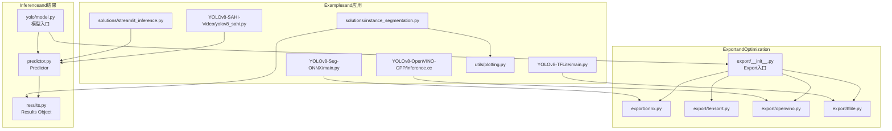
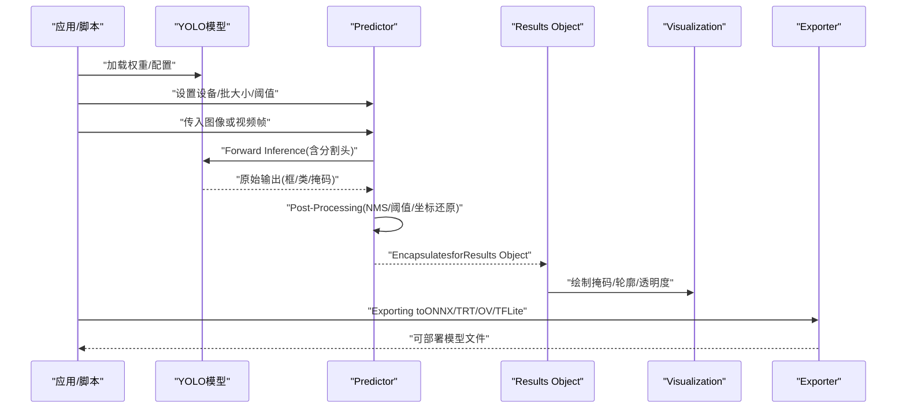
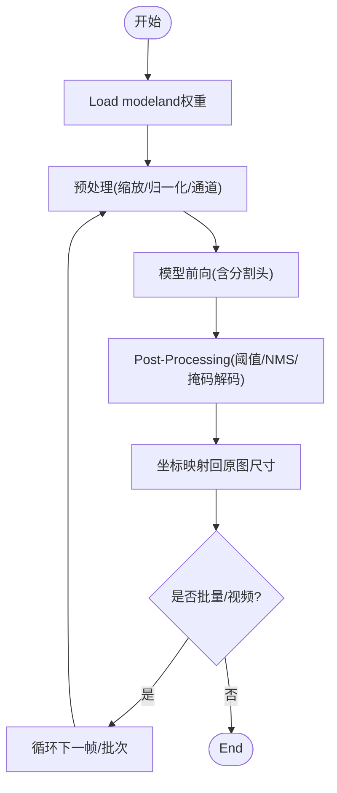
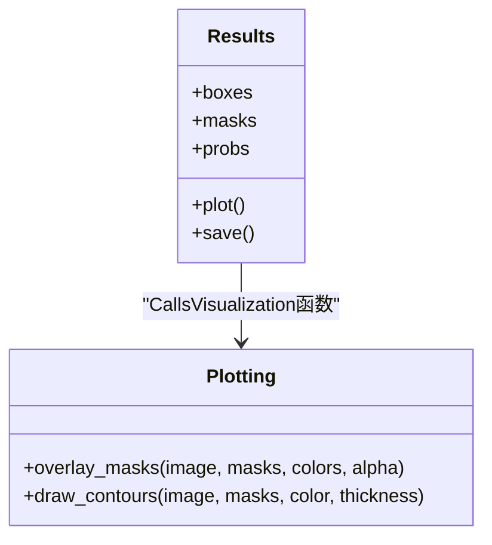
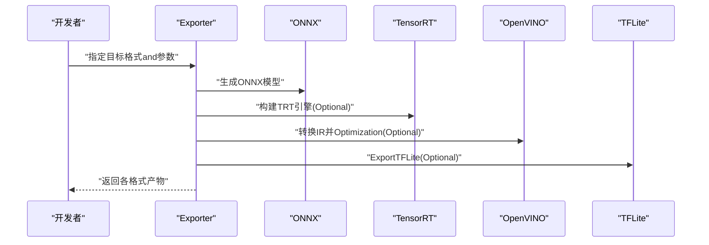
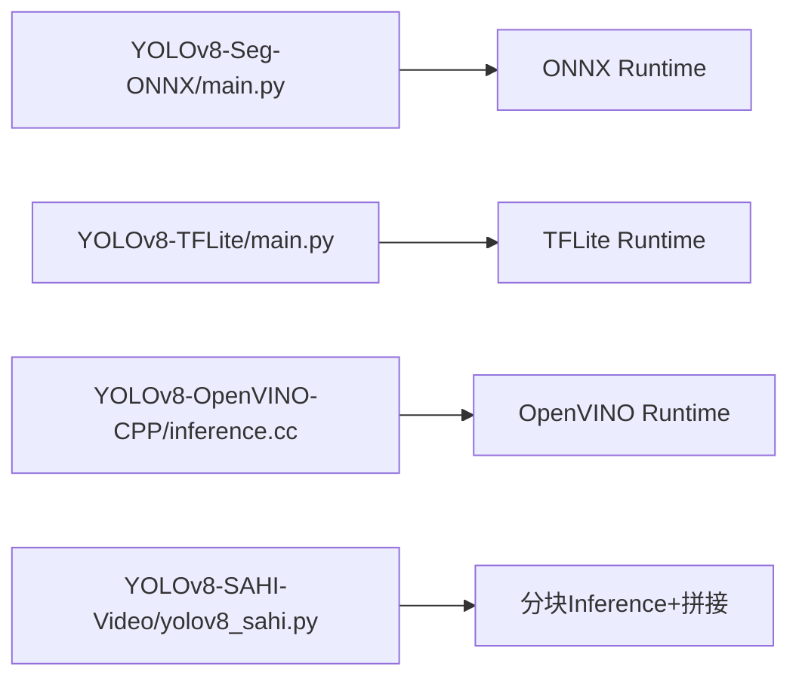
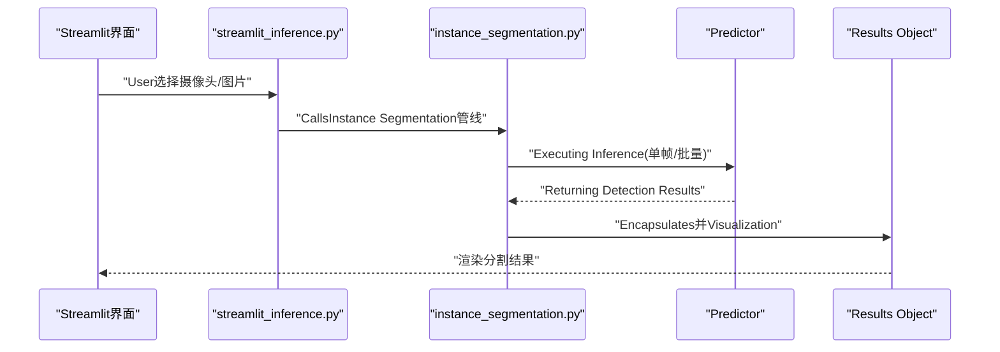
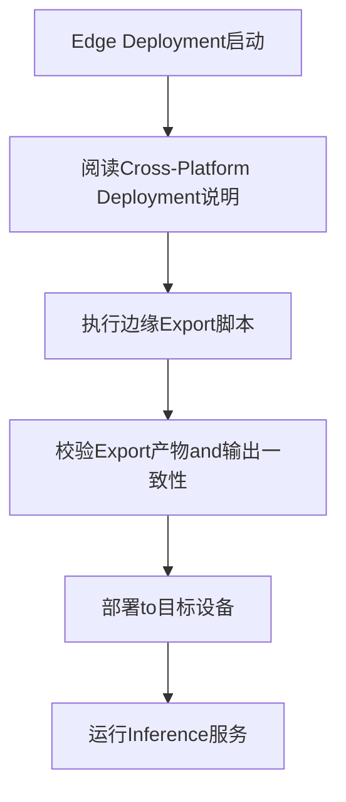
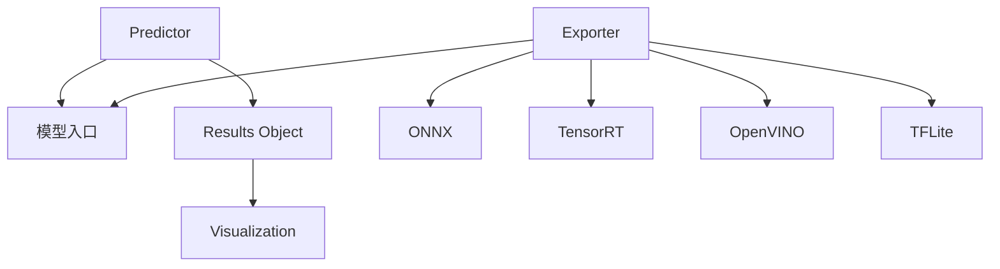

# 分割Inferenceand部署

<cite>
**Files Referenced in This Document**
- [ultralytics/engine/predictor.py](file://ultralytics/engine/predictor.py)
- [ultralytics/engine/results.py](file://ultralytics/engine/results.py)
- [ultralytics/models/yolo/model.py](file://ultralytics/models/yolo/model.py)
- [ultralytics/utils/export/__init__.py](file://ultralytics/utils/export/__init__.py)
- [ultralytics/utils/export/onnx.py](file://ultralytics/utils/export/onnx.py)
- [ultralytics/utils/export/tensorrt.py](file://ultralytics/utils/export/tensorrt.py)
- [ultralytics/utils/export/openvino.py](file://ultralytics/utils/export/openvino.py)
- [ultralytics/utils/export/tflite.py](file://ultralytics/utils/export/tflite.py)
- [examples/YOLOv8-Segmentation-ONNXRuntime-Python/main.py](file://examples/YOLOv8-Segmentation-ONNXRuntime-Python/main.py)
- [examples/YOLOv8-TFLite-Python/main.py](file://examples/YOLOv8-TFLite-Python/main.py)
- [examples/YOLOv8-OpenVINO-CPP-Inference/inference.cc](file://examples/YOLOv8-OpenVINO-CPP-Inference/inference.cc)
- [examples/YOLO-Master-Cross-Platform-Edge-Deployment/README.md](file://examples/YOLO-Master-Cross-Platform-Edge-Deployment/README.md)
- [examples/YOLO-Master-Edge-Deployment/export_edge_models.py](file://examples/YOLO-Master-Edge-Deployment/export_edge_models.py)
- [examples/YOLOv8-SAHI-Inference-Video/yolov8_sahi.py](file://examples/YOLOv8-SAHI-Inference-Video/yolov8_sahi.py)
- [ultralytics/solutions/streamlit_inference.py](file://ultralytics/solutions/streamlit_inference.py)
- [ultralytics/solutions/instance_segmentation.py](file://ultralytics/solutions/instance_segmentation.py)
- [ultralytics/utils/plotting.py](file://ultralytics/utils/plotting.py)
</cite>

## Table of Contents
1. [Introduction](#Introduction)
2. [Project Structure](#Project Structure)
3. [Core Components](#Core Components)
4. [Architecture Overview](#Architecture Overview)
5. [Detailed Component Analysis](#Detailed Component Analysis)
6. [Dependency Analysis](#Dependency Analysis)
7. [Performance Considerations](#Performance Considerations)
8. [Troubleshooting Guide](#Troubleshooting Guide)
9. [Conclusion](#Conclusion)
10. [Appendix](#Appendix)

## Introduction
本指南targeting需要while生产环境中落地“Instance Segmentation”的EngineersandResearchers，围绕Centered on下目标unfold：
- 分割Inferenceimplementing：单图、批量、视频流处理andOptimization策略
- 结果Visualization：掩码叠加、轮廓绘制、透明度控制
- 多格式ExportandOptimization：ONNX、TensorRT、OpenVINO、TFLite
- Edge Device Deployment：移动端、嵌入式设备的性能Optimization
- 实时分割应用案例：端to端工作流and最佳实践

## Project Structure
The repository adopts a modular organization，and分割Inference和部署相关的关键位置such as下：
- Inference引擎andResults Object：engine ModulesprovidesPredictorand结果Encapsulates
- 模型入口：models/yolo provides统一模型接口
- Export工具：utils/export provides多后端Exportcapabilities
- Examplesand方案：examples and solutions provides多种运行形态（ONNX/TFLite/OpenVINO/C++/Python）
- Visualization：utils/plotting provides绘图andVisualization辅助

Figure Source
- [ultralytics/engine/predictor.py](file://ultralytics/engine/predictor.py)
- [ultralytics/engine/results.py](file://ultralytics/engine/results.py)
- [ultralytics/models/yolo/model.py](file://ultralytics/models/yolo/model.py)
- [ultralytics/utils/export/__init__.py](file://ultralytics/utils/export/__init__.py)
- [ultralytics/utils/export/onnx.py](file://ultralytics/utils/export/onnx.py)
- [ultralytics/utils/export/tensorrt.py](file://ultralytics/utils/export/tensorrt.py)
- [ultralytics/utils/export/openvino.py](file://ultralytics/utils/export/openvino.py)
- [ultralytics/utils/export/tflite.py](file://ultralytics/utils/export/tflite.py)
- [examples/YOLOv8-Segmentation-ONNXRuntime-Python/main.py](file://examples/YOLOv8-Segmentation-ONNXRuntime-Python/main.py)
- [examples/YOLOv8-TFLite-Python/main.py](file://examples/YOLOv8-TFLite-Python/main.py)
- [examples/YOLOv8-OpenVINO-CPP-Inference/inference.cc](file://examples/YOLOv8-OpenVINO-CPP-Inference/inference.cc)
- [examples/YOLOv8-SAHI-Inference-Video/yolov8_sahi.py](file://examples/YOLOv8-SAHI-Inference-Video/yolov8_sahi.py)
- [ultralytics/solutions/streamlit_inference.py](file://ultralytics/solutions/streamlit_inference.py)
- [ultralytics/solutions/instance_segmentation.py](file://ultralytics/solutions/instance_segmentation.py)
- [ultralytics/utils/plotting.py](file://ultralytics/utils/plotting.py)

Section Source
- [ultralytics/engine/predictor.py](file://ultralytics/engine/predictor.py)
- [ultralytics/engine/results.py](file://ultralytics/engine/results.py)
- [ultralytics/models/yolo/model.py](file://ultralytics/models/yolo/model.py)
- [ultralytics/utils/export/__init__.py](file://ultralytics/utils/export/__init__.py)
- [ultralytics/utils/export/onnx.py](file://ultralytics/utils/export/onnx.py)
- [ultralytics/utils/export/tensorrt.py](file://ultralytics/utils/export/tensorrt.py)
- [ultralytics/utils/export/openvino.py](file://ultralytics/utils/export/openvino.py)
- [ultralytics/utils/export/tflite.py](file://ultralytics/utils/export/tflite.py)
- [examples/YOLOv8-Segmentation-ONNXRuntime-Python/main.py](file://examples/YOLOv8-Segmentation-ONNXRuntime-Python/main.py)
- [examples/YOLOv8-TFLite-Python/main.py](file://examples/YOLOv8-TFLite-Python/main.py)
- [examples/YOLOv8-OpenVINO-CPP-Inference/inference.cc](file://examples/YOLOv8-OpenVINO-CPP-Inference/inference.cc)
- [examples/YOLOv8-SAHI-Inference-Video/yolov8_sahi.py](file://examples/YOLOv8-SAHI-Inference-Video/yolov8_sahi.py)
- [ultralytics/solutions/streamlit_inference.py](file://ultralytics/solutions/streamlit_inference.py)
- [ultralytics/solutions/instance_segmentation.py](file://ultralytics/solutions/instance_segmentation.py)
- [ultralytics/utils/plotting.py](file://ultralytics/utils/plotting.py)

## Core Components
- Predictor（Predictor）
  - 负责输入预处理、模型前向、Post-Processingand结果组装。Supporting单张图像、批次图像and视频帧迭代。
  - 关键职责：Device Selection、批大小管理、NMS/阈值过滤、掩码生成and坐标还原。
- Results Object（Results）
  - Encapsulates检测框、类别、置信度、掩码etc.输出；providesVisualizationand序列化方法。
- 模型入口（YOLO Model）
  - 统一加载权重、构建Tasks头（含分割头）、ExportandInference的Unified Interface。
- Export子系统（Export）
  - 将Training好的 PyTorch 模型转换for ONNX、TensorRT、OpenVINO、TFLite etc.运行时格式，并执行Export前检查andValidation。

Section Source
- [ultralytics/engine/predictor.py](file://ultralytics/engine/predictor.py)
- [ultralytics/engine/results.py](file://ultralytics/engine/results.py)
- [ultralytics/models/yolo/model.py](file://ultralytics/models/yolo/model.py)
- [ultralytics/utils/export/__init__.py](file://ultralytics/utils/export/__init__.py)

## Architecture Overview
下图展示从模型toInference再toVisualization的整体流程，Centered onand多后端Export的路径。

Figure Source
- [ultralytics/models/yolo/model.py](file://ultralytics/models/yolo/model.py)
- [ultralytics/engine/predictor.py](file://ultralytics/engine/predictor.py)
- [ultralytics/engine/results.py](file://ultralytics/engine/results.py)
- [ultralytics/utils/export/__init__.py](file://ultralytics/utils/export/__init__.py)

## Detailed Component Analysis

### 组件A：分割Inference流水线（单图/批量/视频）
- 单图Inference
  - 输入预处理：缩放、归一化、通道顺序调整
  - 模型前向：获取分类、回归and分割分支输出
  - Post-Processing：Confidence Threshold、NMS、掩码解码、坐标映射回原图
- Batch Inference
  - 动态批大小and内存复用，减少重复初始化开销
  - 注意显存峰值and吞吐权衡
- 视频流处理
  - 帧级循环读取、Optional滑动窗口/分块（SAHI）提升小目标召回
  - 线程安全and队列缓冲避免丢帧

Figure Source
- [ultralytics/engine/predictor.py](file://ultralytics/engine/predictor.py)
- [ultralytics/engine/results.py](file://ultralytics/engine/results.py)

Section Source
- [ultralytics/engine/predictor.py](file://ultralytics/engine/predictor.py)
- [ultralytics/engine/results.py](file://ultralytics/engine/results.py)

### 组件B：结果Visualization（掩码叠加/轮廓/透明度）
- 掩码叠加：将每类的二值掩码按颜色Mixtureto原图上，Supporting透明度参数控制可见性
- 轮廓绘制：基于掩码提取边界，绘制轮廓线Centered on增强边缘感知
- 交互and保存：while Notebook/Web 中渲染，或写入磁盘用于离线分析

Figure Source
- [ultralytics/engine/results.py](file://ultralytics/engine/results.py)
- [ultralytics/utils/plotting.py](file://ultralytics/utils/plotting.py)

Section Source
- [ultralytics/engine/results.py](file://ultralytics/engine/results.py)
- [ultralytics/utils/plotting.py](file://ultralytics/utils/plotting.py)

### 组件C：多格式ExportandOptimization（ONNX/TensorRT/OpenVINO/TFLite）
- ONNX
  - Export静态/动态形状，Supporting算子兼容性and版本约束
  - 适合跨平台Inferenceand二次Optimization
- TensorRT
  - 针对 NVIDIA GPU 的极致Optimization，需校准数据and精度选择（FP16/INT8）
- OpenVINO
  - targeting CPU/Intel NPU 的Optimization，Supporting IR 中间表示and模型Optimizer
- TFLite
  - targeting移动端/嵌入式，量化and算子子图Optimization

Figure Source
- [ultralytics/utils/export/__init__.py](file://ultralytics/utils/export/__init__.py)
- [ultralytics/utils/export/onnx.py](file://ultralytics/utils/export/onnx.py)
- [ultralytics/utils/export/tensorrt.py](file://ultralytics/utils/export/tensorrt.py)
- [ultralytics/utils/export/openvino.py](file://ultralytics/utils/export/openvino.py)
- [ultralytics/utils/export/tflite.py](file://ultralytics/utils/export/tflite.py)

Section Source
- [ultralytics/utils/export/__init__.py](file://ultralytics/utils/export/__init__.py)
- [ultralytics/utils/export/onnx.py](file://ultralytics/utils/export/onnx.py)
- [ultralytics/utils/export/tensorrt.py](file://ultralytics/utils/export/tensorrt.py)
- [ultralytics/utils/export/openvino.py](file://ultralytics/utils/export/openvino.py)
- [ultralytics/utils/export/tflite.py](file://ultralytics/utils/export/tflite.py)

### 组件D：Examplesand实战（ONNX/TFLite/OpenVINO/C++/Python）
- ONNX Runtime（Python）
  - UsesExamples脚本加载 ONNX 模型进行Inference，演示输入准备and结果解析
- TFLite（Python）
  - UsesExamples脚本加载 TFLite 模型，适合移动端快速Validation
- OpenVINO（C++）
  - Uses C++ Examples加载 OpenVINO IR 模型，适合服务端/嵌入式部署
- 视频分块Inference（SAHI）
  - 对大图/高分辨率视频进行切片Inference，再拼接结果，提升小目标召回

Figure Source
- [examples/YOLOv8-Segmentation-ONNXRuntime-Python/main.py](file://examples/YOLOv8-Segmentation-ONNXRuntime-Python/main.py)
- [examples/YOLOv8-TFLite-Python/main.py](file://examples/YOLOv8-TFLite-Python/main.py)
- [examples/YOLOv8-OpenVINO-CPP-Inference/inference.cc](file://examples/YOLOv8-OpenVINO-CPP-Inference/inference.cc)
- [examples/YOLOv8-SAHI-Inference-Video/yolov8_sahi.py](file://examples/YOLOv8-SAHI-Inference-Video/yolov8_sahi.py)

Section Source
- [examples/YOLOv8-Segmentation-ONNXRuntime-Python/main.py](file://examples/YOLOv8-Segmentation-ONNXRuntime-Python/main.py)
- [examples/YOLOv8-TFLite-Python/main.py](file://examples/YOLOv8-TFLite-Python/main.py)
- [examples/YOLOv8-OpenVINO-CPP-Inference/inference.cc](file://examples/YOLOv8-OpenVINO-CPP-Inference/inference.cc)
- [examples/YOLOv8-SAHI-Inference-Video/yolov8_sahi.py](file://examples/YOLOv8-SAHI-Inference-Video/yolov8_sahi.py)

### 组件E：实时分割应用（Streamlit + Instance Segmentation）
- Streamlit Inference页面
  - provides摄像头/文件上传输入，实时显示分割结果
- Instance Segmentation解决方案
  - Encapsulates了常见Post-ProcessingandVisualization逻辑，便于快速搭建 Demo

Figure Source
- [ultralytics/solutions/streamlit_inference.py](file://ultralytics/solutions/streamlit_inference.py)
- [ultralytics/solutions/instance_segmentation.py](file://ultralytics/solutions/instance_segmentation.py)
- [ultralytics/engine/predictor.py](file://ultralytics/engine/predictor.py)
- [ultralytics/engine/results.py](file://ultralytics/engine/results.py)

Section Source
- [ultralytics/solutions/streamlit_inference.py](file://ultralytics/solutions/streamlit_inference.py)
- [ultralytics/solutions/instance_segmentation.py](file://ultralytics/solutions/instance_segmentation.py)
- [ultralytics/engine/predictor.py](file://ultralytics/engine/predictor.py)
- [ultralytics/engine/results.py](file://ultralytics/engine/results.py)

### 组件F：Edge Device Deployment（跨平台and嵌入式）
- Cross-Platform Deployment说明
  - Documentation介绍while不同平台（such as Jetson、macOS、ARM）上的部署要点and注意事项
- 边缘Model Export脚本
  - provides自动化Exportand校验流程，适配移动端/嵌入式环境

Figure Source
- [examples/YOLO-Master-Cross-Platform-Edge-Deployment/README.md](file://examples/YOLO-Master-Cross-Platform-Edge-Deployment/README.md)
- [examples/YOLO-Master-Edge-Deployment/export_edge_models.py](file://examples/YOLO-Master-Edge-Deployment/export_edge_models.py)

Section Source
- [examples/YOLO-Master-Cross-Platform-Edge-Deployment/README.md](file://examples/YOLO-Master-Cross-Platform-Edge-Deployment/README.md)
- [examples/YOLO-Master-Edge-Deployment/export_edge_models.py](file://examples/YOLO-Master-Edge-Deployment/export_edge_models.py)

## Dependency Analysis
- 组件耦合
  - Predictor依赖模型入口andResults Object；Results Object依赖VisualizationModules
  - Exporter独立于Inference链路，但共享模型结构and权重
- External Dependencies
  - ONNX Runtime、TensorRT、OpenVINO、TFLite 运行时库
  - Image processing and visualization库（such as OpenCV、Matplotlib）
- Potential Cycles依赖
  - ExportandInference解耦良好，未见明显循环依赖

Figure Source
- [ultralytics/engine/predictor.py](file://ultralytics/engine/predictor.py)
- [ultralytics/engine/results.py](file://ultralytics/engine/results.py)
- [ultralytics/models/yolo/model.py](file://ultralytics/models/yolo/model.py)
- [ultralytics/utils/export/__init__.py](file://ultralytics/utils/export/__init__.py)

Section Source
- [ultralytics/engine/predictor.py](file://ultralytics/engine/predictor.py)
- [ultralytics/engine/results.py](file://ultralytics/engine/results.py)
- [ultralytics/models/yolo/model.py](file://ultralytics/models/yolo/model.py)
- [ultralytics/utils/export/__init__.py](file://ultralytics/utils/export/__init__.py)

## Performance Considerations
- Inference阶段
  - Set appropriately batch size，平衡吞吐and延迟
  - Uses半精度（FP16）或 INT8 量化（whileSupporting的运行时上）
  - 预分配缓冲区and复用对象，减少 GC/内存抖动
- 视频流
  - Uses多线程/异步 I/O 读取帧，避免阻塞Inference
  - 对高分辨率场景采用分块Inference（SAHI），降低单次计算压力
- ExportOptimization
  - ONNX：固定输入形状或Uses动态形状时谨慎Evaluation兼容性
  - TensorRT：启用 FP16/INT8，必要时进行校准
  - OpenVINO：Uses模型Optimizerand IR 缓存
  - TFLite：启用量化and算子融合

[This section provides general guidance and does not directly analyze specific files]

## Troubleshooting Guide
- Export Failure
  - 检查算子Supportingand版本约束（ONNX opset）
  - 确认输入形状and动态维度是否符合目标运行时要求
- Inference异常
  - 核对预处理步骤（尺寸、归一化、通道顺序）
  - 检查阈值and NMS 参数是否导致漏检/误检
- Visualization问题
  - 掩码尺寸and原图不一致会导致叠加错位
  - 透明度参数过大可能使结果不可见

Section Source
- [ultralytics/utils/export/__init__.py](file://ultralytics/utils/export/__init__.py)
- [ultralytics/engine/predictor.py](file://ultralytics/engine/predictor.py)
- [ultralytics/engine/results.py](file://ultralytics/engine/results.py)
- [ultralytics/utils/plotting.py](file://ultralytics/utils/plotting.py)

## Conclusion
through a unified模型入口andPredictor，Combining多格式Exportand丰富的Examples，本项目provides了从开发to部署的完整分割Inference链路。建议while生产环境中：
- 优先完成 ONNX ExportandValidation，再根据目标平台选择 TensorRT/OpenVINO/TFLite
- while视频场景中引入分块Inferenceand线程化 I/O，确保稳定实时
- 利用VisualizationandResults Object简化调试and交付

[本节for总结，不直接分析具体文件]

## Appendix
- Refer toExamples路径
  - ONNX Runtime（Python）：[examples/YOLOv8-Segmentation-ONNXRuntime-Python/main.py](file://examples/YOLOv8-Segmentation-ONNXRuntime-Python/main.py)
  - TFLite（Python）：[examples/YOLOv8-TFLite-Python/main.py](file://examples/YOLOv8-TFLite-Python/main.py)
  - OpenVINO（C++）：[examples/YOLOv8-OpenVINO-CPP-Inference/inference.cc](file://examples/YOLOv8-OpenVINO-CPP-Inference/inference.cc)
  - 视频分块Inference（SAHI）：[examples/YOLOv8-SAHI-Inference-Video/yolov8_sahi.py](file://examples/YOLOv8-SAHI-Inference-Video/yolov8_sahi.py)
  - 实时分割（Streamlit）：[ultralytics/solutions/streamlit_inference.py](file://ultralytics/solutions/streamlit_inference.py)
  - Instance Segmentation解决方案：[ultralytics/solutions/instance_segmentation.py](file://ultralytics/solutions/instance_segmentation.py)
  - Edge Deployment说明and脚本：[examples/YOLO-Master-Cross-Platform-Edge-Deployment/README.md](file://examples/YOLO-Master-Cross-Platform-Edge-Deployment/README.md)、[examples/YOLO-Master-Edge-Deployment/export_edge_models.py](file://examples/YOLO-Master-Edge-Deployment/export_edge_models.py)