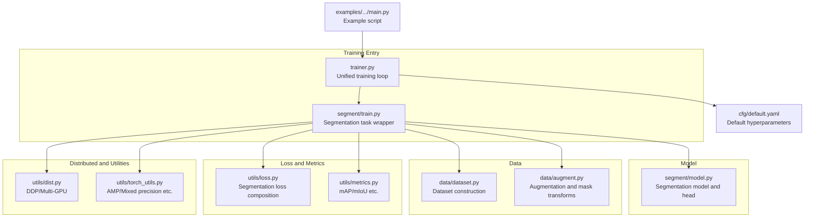
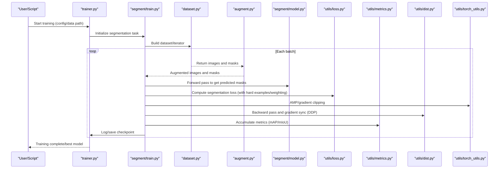
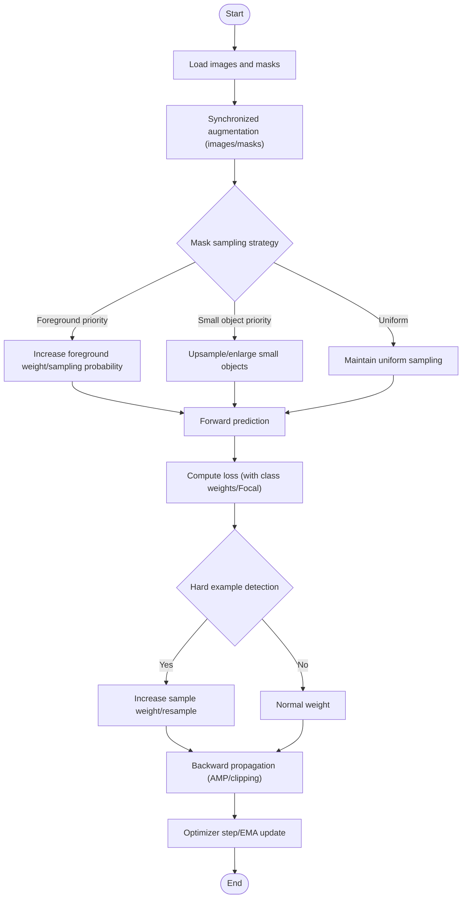
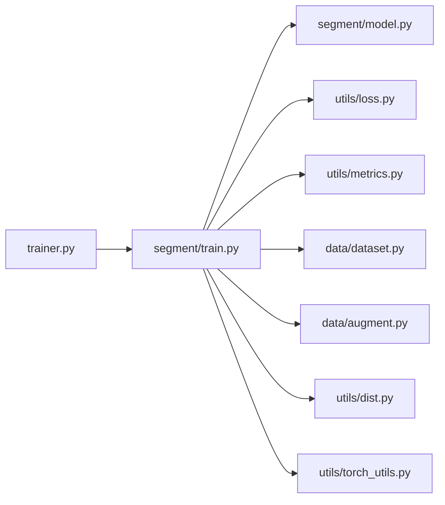

# Segmentation Model Training Workflow

<cite>
**Files referenced in this document**
- [ultralytics/engine/trainer.py](file://ultralytics/engine/trainer.py)
- [ultralytics/models/yolo/segment/train.py](file://ultralytics/models/yolo/segment/train.py)
- [ultralytics/models/yolo/segment/model.py](file://ultralytics/models/yolo/segment/model.py)
- [ultralytics/data/dataset.py](file://ultralytics/data/dataset.py)
- [ultralytics/data/augment.py](file://ultralytics/data/augment.py)
- [ultralytics/utils/loss.py](file://ultralytics/utils/loss.py)
- [ultralytics/utils/metrics.py](file://ultralytics/utils/metrics.py)
- [ultralytics/utils/dist.py](file://ultralytics/utils/dist.py)
- [ultralytics/utils/torch_utils.py](file://ultralytics/utils/torch_utils.py)
- [ultralytics/cfg/default.yaml](file://ultralytics/cfg/default.yaml)
- [examples/YOLOv8-Segmentation-ONNXRuntime-Python/main.py](file://examples/YOLOv8-Segmentation-ONNXRuntime-Python/main.py)
</cite>

## Table of Contents
1. [Introduction](#introduction)
2. [Project Structure](#project-structure)
3. [Core Components](#core-components)
4. [Architecture Overview](#architecture-overview)
5. [Detailed Component Analysis](#detailed-component-analysis)
6. [Dependency Analysis](#dependency-analysis)
7. [Performance Considerations](#performance-considerations)
8. [Troubleshooting Guide](#troubleshooting-guide)
9. [Conclusion](#conclusion)
10. [Appendix](#appendix)

## Introduction
This document is intended for engineers and research teams conducting instance segmentation and semantic segmentation training under the YOLO-Master framework. It systematically covers the full pipeline from data preparation, training configuration, optimizer and learning rate scheduling, mask sampling and hard example mining, class imbalance handling, to distributed training and monitoring metrics. The document also provides diagnostic methods and optimization suggestions for common issues, helping to quickly identify and resolve stability and efficiency problems during training.

## Project Structure
The key code related to segmentation training is primarily distributed across the following modules:
- Training engine and task wrapper: trainer and yolo/segment/train
- Model definition and head: yolo/segment/model
- Data loading and augmentation: data/dataset, data/augment
- Loss and metrics: utils/loss, utils/metrics
- Distributed and utilities: utils/dist, utils/torch_utils
- Default configuration: cfg/default.yaml
- Example script: examples/YOLOv8-Segmentation-ONNXRuntime-Python/main.py (for export inference, assisting end-to-end validation)

Diagram source
- [ultralytics/engine/trainer.py](file://ultralytics/engine/trainer.py)
- [ultralytics/models/yolo/segment/train.py](file://ultralytics/models/yolo/segment/train.py)
- [ultralytics/models/yolo/segment/model.py](file://ultralytics/models/yolo/segment/model.py)
- [ultralytics/data/dataset.py](file://ultralytics/data/dataset.py)
- [ultralytics/data/augment.py](file://ultralytics/data/augment.py)
- [ultralytics/utils/loss.py](file://ultralytics/utils/loss.py)
- [ultralytics/utils/metrics.py](file://ultralytics/utils/metrics.py)
- [ultralytics/utils/dist.py](file://ultralytics/utils/dist.py)
- [ultralytics/utils/torch_utils.py](file://ultralytics/utils/torch_utils.py)
- [ultralytics/cfg/default.yaml](file://ultralytics/cfg/default.yaml)
- [examples/YOLOv8-Segmentation-ONNXRuntime-Python/main.py](file://examples/YOLOv8-Segmentation-ONNXRuntime-Python/main.py)

Section source
- [ultralytics/engine/trainer.py](file://ultralytics/engine/trainer.py)
- [ultralytics/models/yolo/segment/train.py](file://ultralytics/models/yolo/segment/train.py)
- [ultralytics/models/yolo/segment/model.py](file://ultralytics/models/yolo/segment/model.py)
- [ultralytics/data/dataset.py](file://ultralytics/data/dataset.py)
- [ultralytics/data/augment.py](file://ultralytics/data/augment.py)
- [ultralytics/utils/loss.py](file://ultralytics/utils/loss.py)
- [ultralytics/utils/metrics.py](file://ultralytics/utils/metrics.py)
- [ultralytics/utils/dist.py](file://ultralytics/utils/dist.py)
- [ultralytics/utils/torch_utils.py](file://ultralytics/utils/torch_utils.py)
- [ultralytics/cfg/default.yaml](file://ultralytics/cfg/default.yaml)
- [examples/YOLOv8-Segmentation-ONNXRuntime-Python/main.py](file://examples/YOLOv8-Segmentation-ONNXRuntime-Python/main.py)

## Core Components
- Training engine trainer: Responsible for unified training lifecycle management, including data iteration, forward/backward pass, optimizer stepping, logging, checkpoint saving, and validation scheduling.
- Segmentation task wrapper segment/train: Injects segmentation-specific loss computation, mask post-processing, and evaluation logic on top of the generic training loop.
- Segmentation model segment/model: Contains backbone network, neck, and segmentation head, outputting pixel-level or instance-level mask predictions.
- Data pipeline data/dataset + data/augment: Provides synchronized reading of images and masks, geometric and color augmentation, random crop/scale, MixUp/Mosaic (if enabled).
- Loss and metrics utils/loss + utils/metrics: Implements segmentation-related losses (e.g., BCE/Dice/Focal combinations), as well as mAP, IoU, mIoU and other metric statistics.
- Distributed utils/dist: Encapsulates DDP initialization, gradient synchronization, inter-process communication, and error propagation.
- Utilities utils/torch_utils: Provides AMP mixed precision, gradient clipping, device management, and other common training tools.
- Default configuration cfg/default.yaml: Centrally stores batch size, learning rate, weight decay, EMA, early stopping, and other hyperparameters.

Section source
- [ultralytics/engine/trainer.py](file://ultralytics/engine/trainer.py)
- [ultralytics/models/yolo/segment/train.py](file://ultralytics/models/yolo/segment/train.py)
- [ultralytics/models/yolo/segment/model.py](file://ultralytics/models/yolo/segment/model.py)
- [ultralytics/data/dataset.py](file://ultralytics/data/dataset.py)
- [ultralytics/data/augment.py](file://ultralytics/data/augment.py)
- [ultralytics/utils/loss.py](file://ultralytics/utils/loss.py)
- [ultralytics/utils/metrics.py](file://ultralytics/utils/metrics.py)
- [ultralytics/utils/dist.py](file://ultralytics/utils/dist.py)
- [ultralytics/utils/torch_utils.py](file://ultralytics/utils/torch_utils.py)
- [ultralytics/cfg/default.yaml](file://ultralytics/cfg/default.yaml)

## Architecture Overview
The following diagram shows a typical iteration flow for segmentation training, covering data loading, augmentation, forward pass, loss computation, backward pass, and optimizer update.

Diagram source
- [ultralytics/engine/trainer.py](file://ultralytics/engine/trainer.py)
- [ultralytics/models/yolo/segment/train.py](file://ultralytics/models/yolo/segment/train.py)
- [ultralytics/data/dataset.py](file://ultralytics/data/dataset.py)
- [ultralytics/data/augment.py](file://ultralytics/data/augment.py)
- [ultralytics/models/yolo/segment/model.py](file://ultralytics/models/yolo/segment/model.py)
- [ultralytics/utils/loss.py](file://ultralytics/utils/loss.py)
- [ultralytics/utils/metrics.py](file://ultralytics/utils/metrics.py)
- [ultralytics/utils/dist.py](file://ultralytics/utils/dist.py)
- [ultralytics/utils/torch_utils.py](file://ultralytics/utils/torch_utils.py)

## Detailed Component Analysis

### Training Configuration and Hyperparameters
- Learning rate scheduling: Typically uses cosine annealing or multi-stage decay strategies, combined with warmup to improve initial stability. It is recommended to adjust the initial learning rate, warmup steps, and cycle length in the default configuration to match batch size and dataset scale.
- Batch size: Set per-device batch size based on GPU memory and number of GPUs, and equivalently expand the effective batch through gradient accumulation; note the memory consumption of mask resolution and channel count.
- Optimizer selection: AdamW is commonly used for segmentation tasks to achieve better generalization; SGD+Momentum with momentum warmup can also be tried. Weight decay needs to be tuned in conjunction with the learning rate.
- EMA: Exponential Moving Average helps stabilize convergence and improve validation metrics.
- Others: Label smoothing, random depth/width (if supported), mixed precision (AMP), etc.

Section source
- [ultralytics/cfg/default.yaml](file://ultralytics/cfg/default.yaml)
- [ultralytics/engine/trainer.py](file://ultralytics/engine/trainer.py)

### Data Pipeline and Augmentation
- Dataset construction: Organize images and mask annotations in YOLO format, ensuring class index consistency and bounding box/mask alignment.
- Augmentation strategies: Geometric transforms (flip, rotation, affine), color jitter, mosaic/mix augmentation (if enabled) must be applied synchronously to images and masks to avoid spatial misalignment.
- Mask sampling: Region sampling (foreground/background ratio control), small object priority sampling, and edge refinement sampling can be introduced to improve detail quality.
- Hard example mining: Sample reweighting or dynamic filtering based on current loss, focusing on difficult-to-segment regions (e.g., tiny objects, occluded boundaries).

Section source
- [ultralytics/data/dataset.py](file://ultralytics/data/dataset.py)
- [ultralytics/data/augment.py](file://ultralytics/data/augment.py)

### Loss Functions and Class Imbalance
- Base losses: Combinations of BCE, Dice, and Focal Loss can balance both boundary and overall IoU.
- Class imbalance: Mitigate long-tail distribution effects through class weights, Focal factors, or OHEM strategies.
- Hard example mining: Dynamically increase weights for difficult samples, or gradually reduce simple sample contributions in later training stages.
- Regularization terms: Auxiliary losses such as boundary consistency and connectivity constraints can be added (depending on specific implementation).

Section source
- [ultralytics/utils/loss.py](file://ultralytics/utils/loss.py)

### Metrics and Monitoring
- Convergence: Monitor whether training/validation loss curves decrease smoothly, and whether validation mAP/mIoU continuously improves.
- Gradient analysis: Monitor gradient norms and sparsity to prevent explosion/vanishing; use gradient clipping when necessary.
- Memory usage: Track peak GPU memory and fragmentation, optimize with AMP and gradient checkpointing.
- Visualization: Plot predicted masks vs. ground truth masks to observe boundary fitting and missed detections.

Section source
- [ultralytics/utils/metrics.py](file://ultralytics/utils/metrics.py)
- [ultralytics/utils/torch_utils.py](file://ultralytics/utils/torch_utils.py)

### Distributed Training
- Multi-GPU parallelism: Use DDP for gradient synchronization, ensuring all processes share the same data partition and random seed.
- Process communication: Properly configure NCCL backend and timeouts to avoid deadlocks caused by inter-node blocking.
- Load balancing: Enable data parallelism and thread pools to avoid I/O bottlenecks; use prefetching and caching when necessary.
- Fault tolerance and recovery: Checkpoint resumption, exception handling, and automatic restart strategies.

Section source
- [ultralytics/utils/dist.py](file://ultralytics/utils/dist.py)
- [ultralytics/engine/trainer.py](file://ultralytics/engine/trainer.py)

### Training Flowchart (Mask Sampling and Hard Example Mining)

Diagram source
- [ultralytics/data/augment.py](file://ultralytics/data/augment.py)
- [ultralytics/utils/loss.py](file://ultralytics/utils/loss.py)
- [ultralytics/engine/trainer.py](file://ultralytics/engine/trainer.py)

## Dependency Analysis
- Low coupling, high cohesion: trainer serves as the orchestration layer without directly implementing segmentation details; segment/train focuses on task logic; loss/metrics are independently replaceable.
- Key dependency chain: trainer → segment/train → model → loss/metrics; data side dataset → augment; distributed provided by dist.
- Potential circular dependencies: Avoid back-references from loss/metrics to trainer; no obvious cycles observed in the current design.

Diagram source
- [ultralytics/engine/trainer.py](file://ultralytics/engine/trainer.py)
- [ultralytics/models/yolo/segment/train.py](file://ultralytics/models/yolo/segment/train.py)
- [ultralytics/models/yolo/segment/model.py](file://ultralytics/models/yolo/segment/model.py)
- [ultralytics/utils/loss.py](file://ultralytics/utils/loss.py)
- [ultralytics/utils/metrics.py](file://ultralytics/utils/metrics.py)
- [ultralytics/data/dataset.py](file://ultralytics/data/dataset.py)
- [ultralytics/data/augment.py](file://ultralytics/data/augment.py)
- [ultralytics/utils/dist.py](file://ultralytics/utils/dist.py)
- [ultralytics/utils/torch_utils.py](file://ultralytics/utils/torch_utils.py)

## Performance Considerations
- Mixed precision (AMP): Significantly reduces memory usage and improves throughput; pay attention to numerical stability and loss scaling.
- Gradient accumulation: Simulates large batches on low-memory devices, improving convergence stability.
- Data I/O: Multi-threading/prefetching, disk caching, reducing redundant decoding; use memory mapping when necessary.
- Model level: Reduce mask resolution or use pyramid feature fusion; properly set channel counts and kernel sizes.
- Distributed: NCCL parameter tuning, topology awareness, avoiding cross-NUMA access.

[This section is general guidance, no specific file source required]

## Troubleshooting Guide
- Training divergence/NaN: Check if learning rate is too high, if there are unnormalized inputs or excessive label noise; enable gradient clipping and AMP safe mode.
- Metrics not improving or declining: Confirm data augmentation hasn't broken mask spatial consistency; check if class weights are overly biased toward minority classes; verify evaluation metric computation path.
- Out of memory: Reduce batch size, mask resolution, or enable gradient checkpointing; disable unnecessary logging and visualization.
- Distributed deadlock: Verify data loading thread count, random seeds, and process barriers; check NCCL timeout and network bandwidth.
- Slow convergence: Increase warmup steps, adjust cosine annealing cycle; introduce hard example mining and class balancing strategies.

Section source
- [ultralytics/utils/torch_utils.py](file://ultralytics/utils/torch_utils.py)
- [ultralytics/utils/dist.py](file://ultralytics/utils/dist.py)
- [ultralytics/utils/metrics.py](file://ultralytics/utils/metrics.py)

## Conclusion
By systematically configuring learning rate scheduling, batch size, and optimizer in the YOLO-Master framework, combined with mask sampling, hard example mining, and class imbalance handling, the convergence speed and final performance of segmentation models can be effectively improved. Coupled with distributed training and comprehensive monitoring metrics, stable and efficient training experiences can be achieved on large-scale data and complex scenarios. It is recommended to use the default configuration as a baseline in practice, gradually introduce the above techniques, and conduct ablation experiments to find the optimal solution for your own data.

[This section is summary content, no specific file source required]

## Appendix
- Reference example: Refer to the example script to understand the end-to-end workflow and how export inference connects, facilitating verification of training result deployability.

Section source
- [examples/YOLOv8-Segmentation-ONNXRuntime-Python/main.py](file://examples/YOLOv8-Segmentation-ONNXRuntime-Python/main.py)
