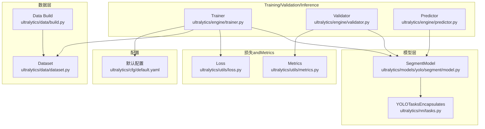
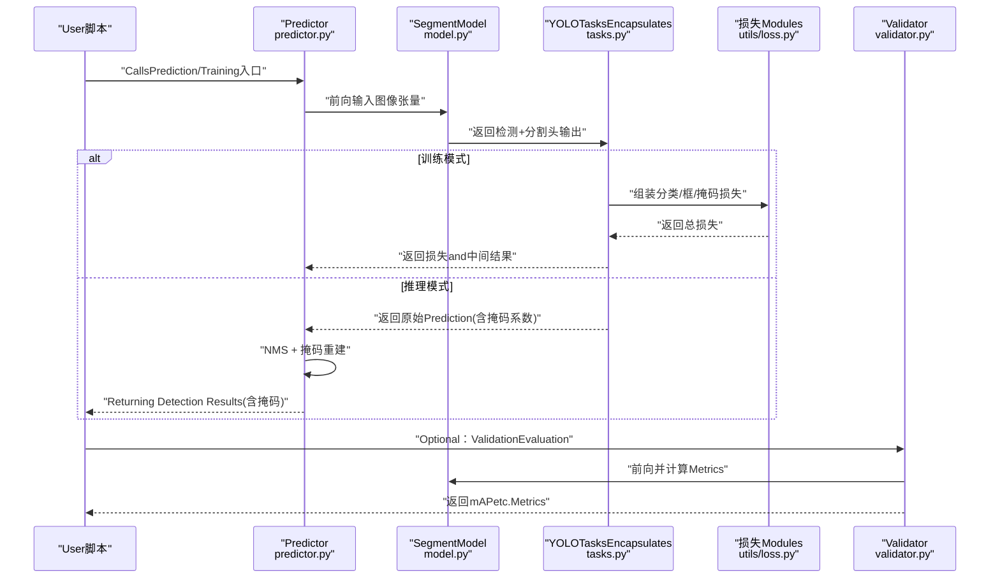
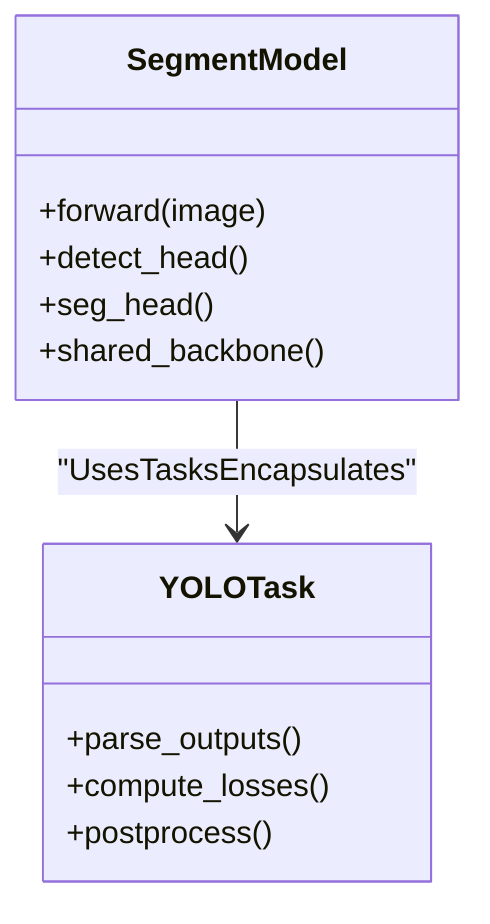
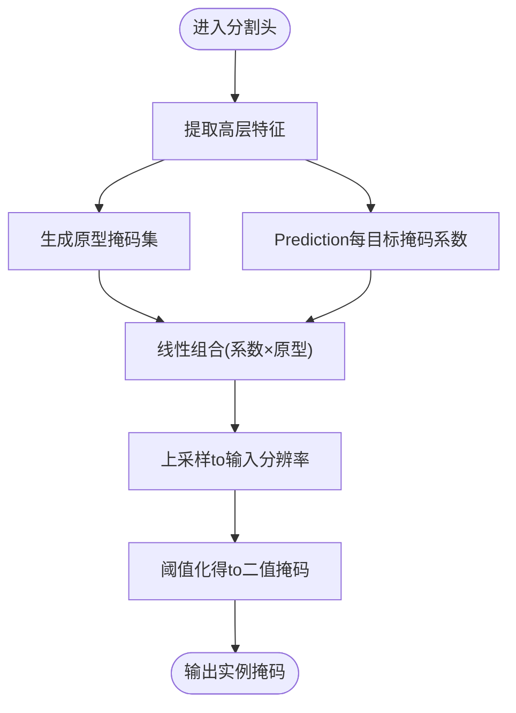
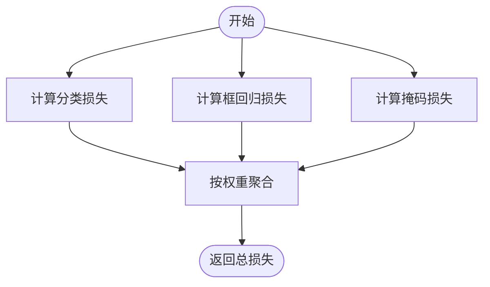
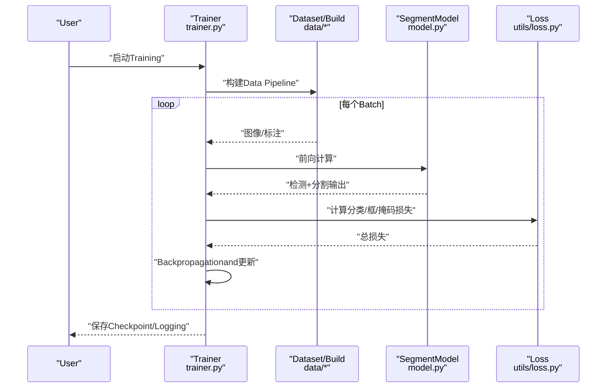
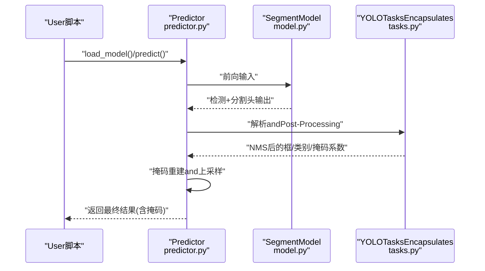
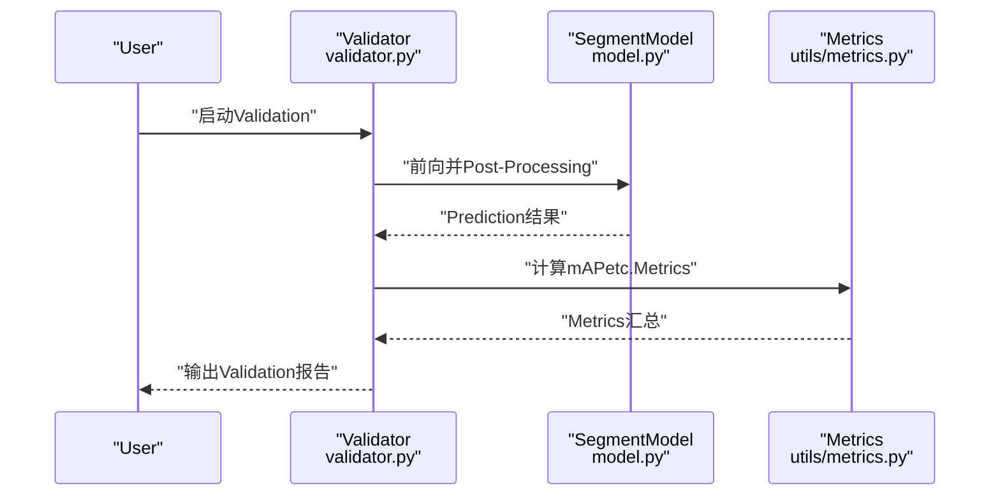
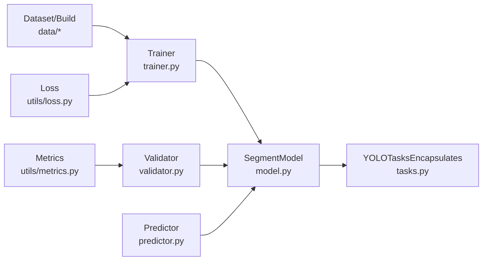

# YOLO分割模型基础

<cite>
**Files Referenced in This Document**
- [ultralytics/models/yolo/segment/model.py](file://ultralytics/models/yolo/segment/model.py)
- [ultralytics/models/yolo/segment/train.py](file://ultralytics/models/yolo/segment/train.py)
- [ultralytics/models/yolo/segment/predict.py](file://ultralytics/models/yolo/segment/predict.py)
- [ultralytics/models/yolo/segment/val.py](file://ultralytics/models/yolo/segment/val.py)
- [ultralytics/nn/tasks.py](file://ultralytics/nn/tasks.py)
- [ultralytics/utils/loss.py](file://ultralytics/utils/loss.py)
- [ultralytics/utils/metrics.py](file://ultralytics/utils/metrics.py)
- [ultralytics/engine/trainer.py](file://ultralytics/engine/trainer.py)
- [ultralytics/engine/validator.py](file://ultralytics/engine/validator.py)
- [ultralytics/engine/predictor.py](file://ultralytics/engine/predictor.py)
- [ultralytics/data/dataset.py](file://ultralytics/data/dataset.py)
- [ultralytics/data/build.py](file://ultralytics/data/build.py)
- [ultralytics/cfg/default.yaml](file://ultralytics/cfg/default.yaml)
- [examples/YOLOv8-Segmentation-ONNXRuntime-Python/main.py](file://examples/YOLOv8-Segmentation-ONNXRuntime-Python/main.py)
- [examples/YOLO11-Triton-CPP/inference.cpp](file://examples/YOLO11-Triton-CPP/inference.cpp)
- [docs/en/guides/instance-segmentation-and-tracking.md](file://docs/en/guides/instance-segmentation-and-tracking.md)
- [docs/en/guides/yolo-architecture.md](file://docs/en/guides/yolo-architecture.md)
- [docs/en/modes/predict.md](file://docs/en/modes/predict.md)
- [docs/en/modes/train.md](file://docs/en/modes/train.md)
- [docs/en/modes/val.md](file://docs/en/modes/val.md)
</cite>

## Table of Contents
1. [Introduction](#Introduction)
2. [Project Structure](#Project Structure)
3. [Core Components](#Core Components)
4. [Architecture Overview](#Architecture Overview)
5. [Detailed Component Analysis](#Detailed Component Analysis)
6. [Dependency Analysis](#Dependency Analysis)
7. [性能考量](#性能考量)
8. [Troubleshooting Guide](#Troubleshooting Guide)
9. [Conclusion](#Conclusion)
10. [Appendix](#Appendix)

## Introduction
本教程targeting希望系统掌握YOLOInstance Segmentation的EngineersandResearchers，围绕Centered on下目标unfold：
- 解释Instance Segmentation的基本概念、技术原理and应用场景
- 详解YOLO分割架构：Feature Extraction器、分割头设计、掩码生成机制
- 说明分割Tasks的Loss Function设计：分类损失、边界框回归损失、掩码损失
- provides完整的Training ConfigurationExamples：数据集格式要求、超参数调优建议
- 展示such as何UsesPython API进行分割Inference：结果解析andPost-Processing步骤

## Project Structure
The repository adopts a modular layered organization，andYOLO分割相关的核心代码主要分布whileCentered on下路径：
- 模型定义andTasksEncapsulates：ultralytics/models/yolo/segment、ultralytics/nn/tasks.py
- Training/Validation/Inference引擎：ultralytics/engine/{trainer,validator,predictor}.py
- Data Loadingand构建：ultralytics/data/{dataset,build}.py
- 损失andMetrics：ultralytics/utils/{loss,metrics}.py
- 默认配置：ultralytics/cfg/default.yaml
- DocumentationandExamples：docs/en/...、examples/...

Figure Source
- [ultralytics/models/yolo/segment/model.py](file://ultralytics/models/yolo/segment/model.py)
- [ultralytics/nn/tasks.py](file://ultralytics/nn/tasks.py)
- [ultralytics/engine/trainer.py](file://ultralytics/engine/trainer.py)
- [ultralytics/engine/validator.py](file://ultralytics/engine/validator.py)
- [ultralytics/engine/predictor.py](file://ultralytics/engine/predictor.py)
- [ultralytics/data/dataset.py](file://ultralytics/data/dataset.py)
- [ultralytics/data/build.py](file://ultralytics/data/build.py)
- [ultralytics/utils/loss.py](file://ultralytics/utils/loss.py)
- [ultralytics/utils/metrics.py](file://ultralytics/utils/metrics.py)
- [ultralytics/cfg/default.yaml](file://ultralytics/cfg/default.yaml)

Section Source
- [ultralytics/models/yolo/segment/model.py](file://ultralytics/models/yolo/segment/model.py)
- [ultralytics/nn/tasks.py](file://ultralytics/nn/tasks.py)
- [ultralytics/engine/trainer.py](file://ultralytics/engine/trainer.py)
- [ultralytics/engine/validator.py](file://ultralytics/engine/validator.py)
- [ultralytics/engine/predictor.py](file://ultralytics/engine/predictor.py)
- [ultralytics/data/dataset.py](file://ultralytics/data/dataset.py)
- [ultralytics/data/build.py](file://ultralytics/data/build.py)
- [ultralytics/utils/loss.py](file://ultralytics/utils/loss.py)
- [ultralytics/utils/metrics.py](file://ultralytics/utils/metrics.py)
- [ultralytics/cfg/default.yaml](file://ultralytics/cfg/default.yaml)

## Core Components
- SegmentModel：EncapsulatesYOLO分割模型的构建and前向逻辑，包含检测分支and分割分支。
- YOLOTasksEncapsulates：统一多Tasks（检测、分割、姿态etc.）接口，负责输出对齐and损失组装。
- Trainer/Validator/Predictor：分别负责Training循环、ValidationEvaluationandInference流程编排。
- Dataset/Build：负责YOLO格式数据的读取、增强and批构建。
- Loss/Metrics：implementing分类、边界框回归、掩码损失Centered onandmAPetc.Metrics计算。
- 默认配置：providesTraining、Inference、Exportetc.常用超参and路径约定。

Section Source
- [ultralytics/models/yolo/segment/model.py](file://ultralytics/models/yolo/segment/model.py)
- [ultralytics/nn/tasks.py](file://ultralytics/nn/tasks.py)
- [ultralytics/engine/trainer.py](file://ultralytics/engine/trainer.py)
- [ultralytics/engine/validator.py](file://ultralytics/engine/validator.py)
- [ultralytics/engine/predictor.py](file://ultralytics/engine/predictor.py)
- [ultralytics/data/dataset.py](file://ultralytics/data/dataset.py)
- [ultralytics/data/build.py](file://ultralytics/data/build.py)
- [ultralytics/utils/loss.py](file://ultralytics/utils/loss.py)
- [ultralytics/utils/metrics.py](file://ultralytics/utils/metrics.py)
- [ultralytics/cfg/default.yaml](file://ultralytics/cfg/default.yaml)

## Architecture Overview
YOLO分割while通用YOLO检测架构基础上增加“分割头”，共享主干特征，并行输出类别置信度、边界框and每目标的掩码系数。典型流程such as下：

Figure Source
- [ultralytics/engine/predictor.py](file://ultralytics/engine/predictor.py)
- [ultralytics/models/yolo/segment/model.py](file://ultralytics/models/yolo/segment/model.py)
- [ultralytics/nn/tasks.py](file://ultralytics/nn/tasks.py)
- [ultralytics/utils/loss.py](file://ultralytics/utils/loss.py)
- [ultralytics/engine/validator.py](file://ultralytics/engine/validator.py)

## Detailed Component Analysis

### Instance Segmentation基本概念and技术原理
- Instance Segmentation目标：对图像中每个目标实例给出类别、位置and像素级掩码。
- 主流范式：两阶段（such asMask R-CNN）and单阶段（such asYOLO系列）。YOLO分割Via共享主干and多Tasks头implementing端to端高效Inference。
- 掩码生成策略：常见for“掩码系数”方案，即对每个目标Prediction一组系数，and可学习的掩码原型线性组合得to实例掩码。

Section Source
- [docs/en/guides/instance-segmentation-and-tracking.md](file://docs/en/guides/instance-segmentation-and-tracking.md)
- [docs/en/guides/yolo-architecture.md](file://docs/en/guides/yolo-architecture.md)

### YOLO分割架构详解
- Feature Extraction器：共享主干网络（such asCSP/Darknet或现代变体），输出多尺度特征图。
- Detection Head：输出类别概率and边界框回归量。
- 分割头：对每个正样本输出掩码系数，Combining可学习原型生成高分辨率实例掩码。
- 输出对齐：TasksEncapsulates将不同头的输出按网格/锚点/DETR式匹配进行归一化，便于损失计算andPost-Processing。

Figure Source
- [ultralytics/models/yolo/segment/model.py](file://ultralytics/models/yolo/segment/model.py)
- [ultralytics/nn/tasks.py](file://ultralytics/nn/tasks.py)

Section Source
- [ultralytics/models/yolo/segment/model.py](file://ultralytics/models/yolo/segment/model.py)
- [ultralytics/nn/tasks.py](file://ultralytics/nn/tasks.py)

### 掩码生成机制
- 掩码系数：每个目标Prediction一组权重，用于线性组合可学习原型。
- 原型掩码：由分割头从高层特征中提取，尺寸通常小于输入分辨率，需上采样至原图。
- 合成掩码：将掩码系数and原型掩码相乘求和，再经阈值化得to二值掩码。

Figure Source
- [ultralytics/models/yolo/segment/model.py](file://ultralytics/models/yolo/segment/model.py)
- [ultralytics/nn/tasks.py](file://ultralytics/nn/tasks.py)

Section Source
- [ultralytics/models/yolo/segment/model.py](file://ultralytics/models/yolo/segment/model.py)
- [ultralytics/nn/tasks.py](file://ultralytics/nn/tasks.py)

### Loss Function设计
- 分类损失：针对类别Prediction的交叉熵类损失，常Combined with标签平滑或Focal思想Centered on缓解类别不平衡。
- 边界框回归损失：常用GIoU/CIoU/DIoU或其变体，Optimization框定位质量。
- 掩码损失：对每目标掩码andGT掩码计算逐像素损失（such asBCE或Dice类），并Combining分类置信度加权。
- 总损失：三者加权求和，权重可Via配置调整。

Figure Source
- [ultralytics/utils/loss.py](file://ultralytics/utils/loss.py)
- [ultralytics/nn/tasks.py](file://ultralytics/nn/tasks.py)

Section Source
- [ultralytics/utils/loss.py](file://ultralytics/utils/loss.py)
- [ultralytics/nn/tasks.py](file://ultralytics/nn/tasks.py)

### Training流程and配置
- Training入口：Trainer负责Data Loading、Optimizer调度、损失回传andLogging。
- 数据格式：遵循YOLO标注格式（类别索引、相对坐标或掩码路径），由Dataset/Build完成解析and增强。
- 关键超参：Learning Rate、Batch Size、轮次、Data Augmentation强度、损失权重、NMS阈值etc.，均可while配置中设置。

Figure Source
- [ultralytics/engine/trainer.py](file://ultralytics/engine/trainer.py)
- [ultralytics/data/dataset.py](file://ultralytics/data/dataset.py)
- [ultralytics/data/build.py](file://ultralytics/data/build.py)
- [ultralytics/models/yolo/segment/model.py](file://ultralytics/models/yolo/segment/model.py)
- [ultralytics/utils/loss.py](file://ultralytics/utils/loss.py)

Section Source
- [ultralytics/engine/trainer.py](file://ultralytics/engine/trainer.py)
- [ultralytics/data/dataset.py](file://ultralytics/data/dataset.py)
- [ultralytics/data/build.py](file://ultralytics/data/build.py)
- [ultralytics/models/yolo/segment/model.py](file://ultralytics/models/yolo/segment/model.py)
- [ultralytics/utils/loss.py](file://ultralytics/utils/loss.py)
- [ultralytics/cfg/default.yaml](file://ultralytics/cfg/default.yaml)

### Inference流程andPython API
- Inference入口：Predictor编排预处理、前向、NMSand掩码重建。
- 结果解析：类别、置信度、边界框and掩码系数；掩码Via系数and原型合成并上采样。
- Post-Processing：阈值过滤、NMS去重、掩码二值化andVisualization。

Figure Source
- [ultralytics/engine/predictor.py](file://ultralytics/engine/predictor.py)
- [ultralytics/models/yolo/segment/model.py](file://ultralytics/models/yolo/segment/model.py)
- [ultralytics/nn/tasks.py](file://ultralytics/nn/tasks.py)

Section Source
- [ultralytics/engine/predictor.py](file://ultralytics/engine/predictor.py)
- [ultralytics/models/yolo/segment/model.py](file://ultralytics/models/yolo/segment/model.py)
- [ultralytics/nn/tasks.py](file://ultralytics/nn/tasks.py)

### ValidationandMetrics
- Validation入口：Validator负责批量前向、PredictionPost-ProcessingandMetrics统计。
- Metrics体系：mAP@0.5:0.95、mAP@0.5、掩码相关Metricsetc.，依据TasksEncapsulatesandMetricsModules计算。

Figure Source
- [ultralytics/engine/validator.py](file://ultralytics/engine/validator.py)
- [ultralytics/models/yolo/segment/model.py](file://ultralytics/models/yolo/segment/model.py)
- [ultralytics/utils/metrics.py](file://ultralytics/utils/metrics.py)

Section Source
- [ultralytics/engine/validator.py](file://ultralytics/engine/validator.py)
- [ultralytics/utils/metrics.py](file://ultralytics/utils/metrics.py)

## Dependency Analysis
- 低耦合高内聚：模型定义andTasksEncapsulates解耦，Training/Validation/Inference各自专注职责。
- External Dependencies：PyTorch生态、数据IOandVisualization库；Exportand部署Examples覆盖ONNX/TensorRTetc.。
- 潜while环依赖：ViaTasksEncapsulatesand接口抽象避免直接循环引用。

Figure Source
- [ultralytics/models/yolo/segment/model.py](file://ultralytics/models/yolo/segment/model.py)
- [ultralytics/nn/tasks.py](file://ultralytics/nn/tasks.py)
- [ultralytics/engine/trainer.py](file://ultralytics/engine/trainer.py)
- [ultralytics/engine/validator.py](file://ultralytics/engine/validator.py)
- [ultralytics/engine/predictor.py](file://ultralytics/engine/predictor.py)
- [ultralytics/data/dataset.py](file://ultralytics/data/dataset.py)
- [ultralytics/data/build.py](file://ultralytics/data/build.py)
- [ultralytics/utils/loss.py](file://ultralytics/utils/loss.py)
- [ultralytics/utils/metrics.py](file://ultralytics/utils/metrics.py)

Section Source
- [ultralytics/models/yolo/segment/model.py](file://ultralytics/models/yolo/segment/model.py)
- [ultralytics/nn/tasks.py](file://ultralytics/nn/tasks.py)
- [ultralytics/engine/trainer.py](file://ultralytics/engine/trainer.py)
- [ultralytics/engine/validator.py](file://ultralytics/engine/validator.py)
- [ultralytics/engine/predictor.py](file://ultralytics/engine/predictor.py)
- [ultralytics/data/dataset.py](file://ultralytics/data/dataset.py)
- [ultralytics/data/build.py](file://ultralytics/data/build.py)
- [ultralytics/utils/loss.py](file://ultralytics/utils/loss.py)
- [ultralytics/utils/metrics.py](file://ultralytics/utils/metrics.py)

## 性能考量
- 数据侧：合理选择Data Augmentation强度and缓存策略，避免I/Obottlenecks。
- 模型侧：主干深度and通道数权衡；分割头原型数量and上采样步长影响精度and速度。
- Training侧：Learning Rate预热and余弦退火、Gradient累积、Mixture精度；损失权重随Tasks难度动态调整。
- Inference侧：NMS阈值andConfidence Threshold调优；掩码上采样and阈值化策略；Exporting toONNX/TensorRT加速。

[This section provides general guidance and does not directly analyze specific files]

## Troubleshooting Guide
- Training不收敛：检查Learning RateandBatch Size比例、损失权重是否失衡、数据标注是否正确。
- 掩码质量差：确认掩码系数and原型数量、上采样分辨率、阈值策略是否合适。
- Inference速度慢：尝试Exporting toONNX/TensorRT，减少Post-Processing开销，调整NMSand阈值。
- Metrics异常：核对类别映射、GT掩码路径and格式、Validation集划分一致性。

Section Source
- [ultralytics/utils/loss.py](file://ultralytics/utils/loss.py)
- [ultralytics/utils/metrics.py](file://ultralytics/utils/metrics.py)
- [ultralytics/engine/trainer.py](file://ultralytics/engine/trainer.py)
- [ultralytics/engine/validator.py](file://ultralytics/engine/validator.py)
- [ultralytics/engine/predictor.py](file://ultralytics/engine/predictor.py)

## Conclusion
YOLO分割Via共享主干and多Tasks头implementing高效的Instance Segmentation。理解其架构、损失设计andTraining/Inference流程是提升效果的关键。Combining合理的超参调优andExport部署策略，可while精度and速度间取得良好平衡。

[This section is summary content and does not directly analyze specific files]

## Appendix

### Training ConfigurationExamplesand超参建议
- 数据集格式：遵循YOLO标注规范（类别索引、相对坐标或掩码路径），Refer to数据构建and数据集Modules。
- 关键超参：Learning Rate、Batch Size、轮次、Data Augmentation强度、损失权重、NMS阈值etc.，可while默认配置中调整。
- Refer toDocumentation：Training模式and宏定义，帮助快速上手。

Section Source
- [ultralytics/data/dataset.py](file://ultralytics/data/dataset.py)
- [ultralytics/data/build.py](file://ultralytics/data/build.py)
- [ultralytics/cfg/default.yaml](file://ultralytics/cfg/default.yaml)
- [docs/en/modes/train.md](file://docs/en/modes/train.md)

### Python APIInferenceandPost-Processing
- Inference入口：UsesPredictor进行加载andPrediction，获取类别、置信度、框and掩码系数。
- 结果解析：掩码系数and原型合成，上采样至输入分辨率，阈值化得to二值掩码。
- ExamplesRefer to：ONNX RuntimeInferenceExamples可作forRefer to模板。

Section Source
- [ultralytics/engine/predictor.py](file://ultralytics/engine/predictor.py)
- [examples/YOLOv8-Segmentation-ONNXRuntime-Python/main.py](file://examples/YOLOv8-Segmentation-ONNXRuntime-Python/main.py)
- [docs/en/modes/predict.md](file://docs/en/modes/predict.md)

### 部署andExport
- Export格式：SupportingONNX、TensorRTetc.，便于Cross-Platform Deployment。
- ExamplesRefer to：C++/TritonInferenceExamples可用于服务端部署。

Section Source
- [examples/YOLO11-Triton-CPP/inference.cpp](file://examples/YOLO11-Triton-CPP/inference.cpp)
- [docs/en/modes/export.md](file://docs/en/modes/export.md)