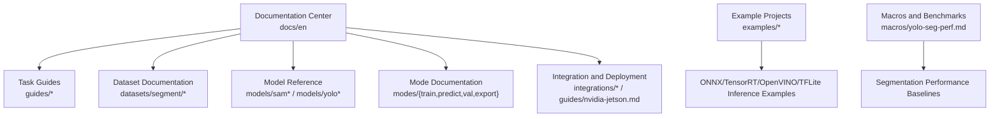
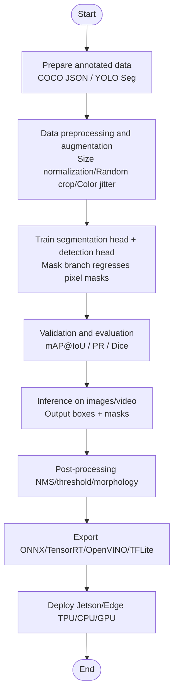
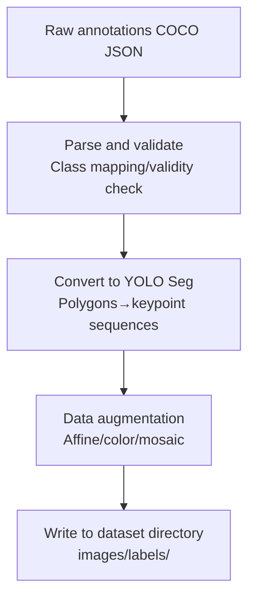
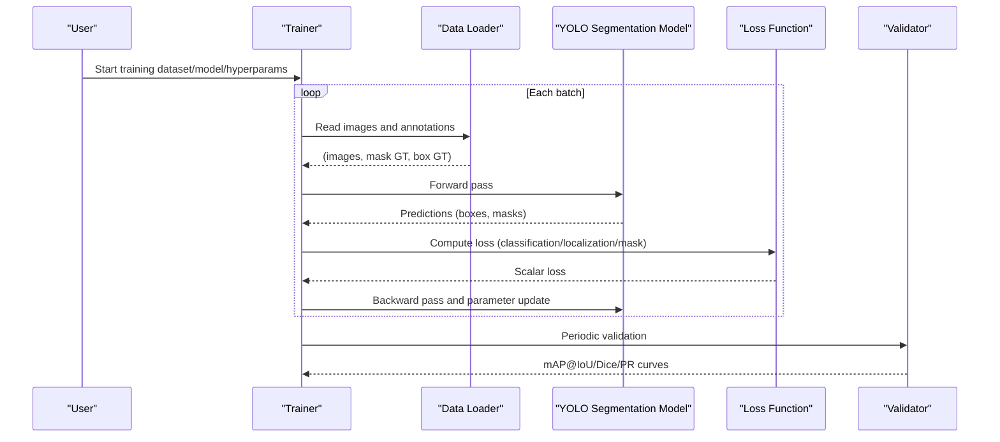
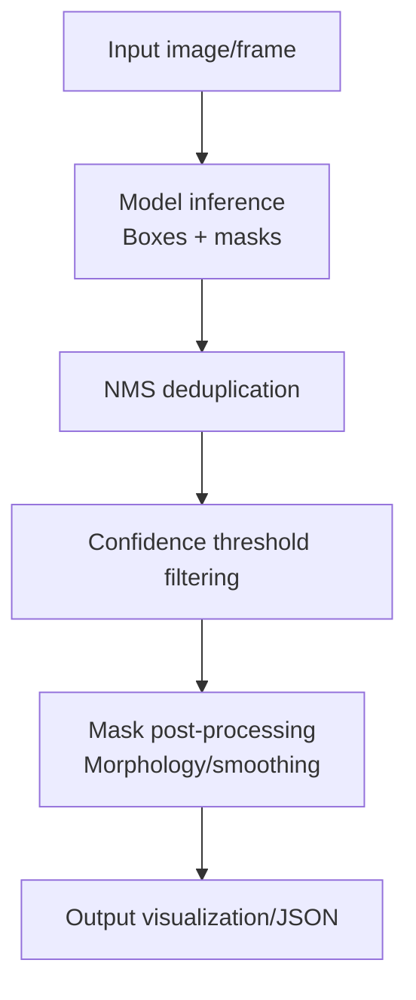
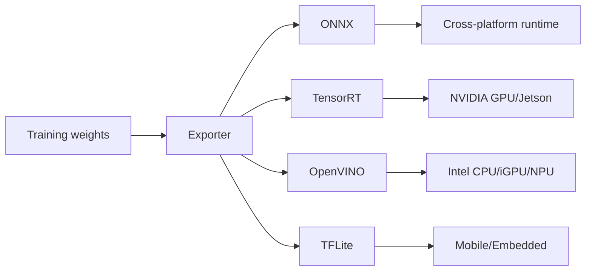
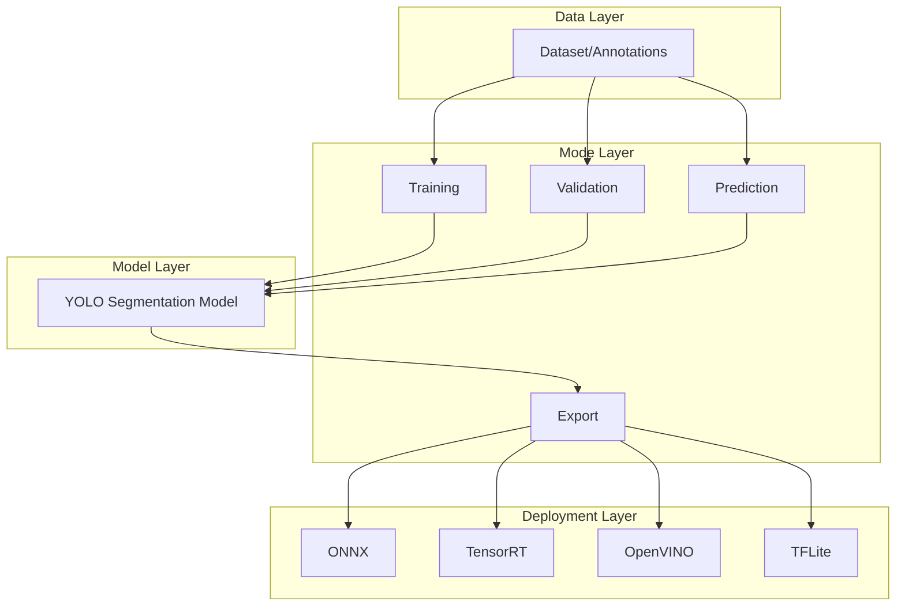

# Instance Segmentation Tutorial

<cite>
**Files referenced in this document**
- [README.md](file://README.md)
- [yolo-seg-perf.md](file://docs/en/macros/yolo-seg-perf.md)
- [instance-segmentation-and-tracking.md](file://docs/en/guides/instance-segmentation-and-tracking.md)
- [sam.md](file://docs/en/models/sam.md)
- [fast-sam.md](file://docs/en/models/fast-sam.md)
- [mobile-sam.md](file://docs/en/models/mobile-sam.md)
- [sam-2.md](file://docs/en/models/sam-2.md)
- [segment/index.md](file://docs/en/datasets/segment/index.md)
- [coco-to-yolo.md](file://docs/en/guides/coco-to-yolo.md)
- [preprocessing_annotated_data.md](file://docs/en/guides/preprocessing_annotated_data.md)
- [train.md](file://docs/en/modes/train.md)
- [predict.md](file://docs/en/modes/predict.md)
- [val.md](file://docs/en/modes/val.md)
- [yolo-performance-metrics.md](file://docs/en/guides/yolo-performance-metrics.md)
- [yolo-data-augmentation.md](file://docs/en/guides/yolo-data-augmentation.md)
- [sahi-tiled-inference.md](file://docs/en/guides/sahi-tiled-inference.md)
- [model-deployment-options.md](file://docs/en/guides/model-deployment-options.md)
- [nvidia-jetson.md](file://docs/en/guides/nvidia-jetson.md)
- [edge-tpu.md](file://docs/en/integrations/edge-tpu.md)
- [openvino.md](file://docs/en/integrations/openvino.md)
- [tensorrt.md](file://docs/en/integrations/tensorrt.md)
- [tflite.md](file://docs/en/integrations/tflite.md)
- [onnx.md](file://docs/en/integrations/onnx.md)
- [export.md](file://docs/en/modes/export.md)
- [yolo-architecture.md](file://docs/en/guides/yolo-architecture.md)
- [yolo-common-issues.md](file://docs/en/guides/yolo-common-issues.md)
- [yolo26-training-recipe.md](file://docs/en/guides/yolo26-training-recipe.md)
- [yolo_master_risk_remediation_plan.md](file://YOLO-Master-v260721-MoA-MoE-MoT-PEFT-Planner-深度分析-v4.md)
</cite>

## Table of Contents
1. [Introduction](#introduction)
2. [Project Structure](#project-structure)
3. [Core Components](#core-components)
4. [Architecture Overview](#architecture-overview)
5. [Detailed Component Analysis](#detailed-component-analysis)
6. [Dependency Analysis](#dependency-analysis)
7. [Performance Considerations](#performance-considerations)
8. [Troubleshooting Guide](#troubleshooting-guide)
9. [Conclusion](#conclusion)
10. [Appendix](#appendix)

## Introduction
This tutorial is intended for engineers and researchers who wish to use YOLO-Master for instance segmentation tasks. It systematically covers:
- Differences between instance segmentation and semantic segmentation, typical application scenarios
- Segmentation data annotation formats and preprocessing workflows
- Comparison and selection recommendations between YOLO segmentation models and SAM series models
- Complete training workflow: segmentation head configuration, mask generation, bounding box optimization, and other key technical details
- Segmentation quality evaluation metrics (mAP@IoU, Dice coefficient, etc.)
- Result visualization and post-processing methods
- Edge device inference optimization solutions (TensorRT, OpenVINO, Edge TPU, TFLite, etc.)

## Project Structure
The repository is organized around "documentation + examples + toolchain", with materials related to this tutorial primarily distributed in the docs and examples directories. The following diagram shows the knowledge module relationships directly relevant to this tutorial.

Diagram source
- [yolo-seg-perf.md:1-200](file://docs/en/macros/yolo-seg-perf.md#L1-L200)
- [instance-segmentation-and-tracking.md:1-200](file://docs/en/guides/instance-segmentation-and-tracking.md#L1-L200)
- [segment/index.md:1-200](file://docs/en/datasets/segment/index.md#L1-L200)
- [train.md:1-200](file://docs/en/modes/train.md#L1-L200)
- [predict.md:1-200](file://docs/en/modes/predict.md#L1-L200)
- [val.md:1-200](file://docs/en/modes/val.md#L1-L200)
- [export.md:1-200](file://docs/en/modes/export.md#L1-L200)
- [nvidia-jetson.md:1-200](file://docs/en/guides/nvidia-jetson.md#L1-L200)
- [edge-tpu.md:1-200](file://docs/en/integrations/edge-tpu.md#L1-L200)
- [openvino.md:1-200](file://docs/en/integrations/openvino.md#L1-L200)
- [tensorrt.md:1-200](file://docs/en/integrations/tensorrt.md#L1-L200)
- [tflite.md:1-200](file://docs/en/integrations/tflite.md#L1-L200)
- [onnx.md:1-200](file://docs/en/integrations/onnx.md#L1-L200)

Section source
- [README.md:1-200](file://README.md#L1-L200)
- [yolo-seg-perf.md:1-200](file://docs/en/macros/yolo-seg-perf.md#L1-L200)

## Core Components
- Tasks and Modes
  - Training: Define dataset path, number of classes, augmentation strategies, loss weights, learning rate scheduling, etc.
  - Validation: Compute mAP@IoU, precision/recall, confusion matrix, etc.
  - Prediction: Single image/video stream inference, outputting bounding boxes and masks
  - Export: Export to ONNX/TensorRT/OpenVINO/TFLite and other target formats
- Data and Annotation
  - Supports COCO JSON and YOLO Seg formats; provides conversion scripts and preprocessing guides
- Models and Architecture
  - YOLO segmentation head shares backbone with detection branch; mask branch regresses pixel-level masks on feature maps
  - SAM series (SAM, Fast-SAM, Mobile-SAM, SAM-2) emphasizes prompt-based/zero-shot capabilities, suitable for open-vocabulary scenarios
- Evaluation and Visualization
  - Metrics: mAP@IoU, PR curves, confusion matrix, Dice coefficient, etc.
  - Visualization: Mask overlay, contour drawing, heatmaps, etc.
- Deployment and Optimization
  - Multi-backend export and runtime acceleration, adapting to Jetson, Edge TPU, CPU/GPU, and various platforms

Section source
- [train.md:1-200](file://docs/en/modes/train.md#L1-L200)
- [val.md:1-200](file://docs/en/modes/val.md#L1-L200)
- [predict.md:1-200](file://docs/en/modes/predict.md#L1-L200)
- [export.md:1-200](file://docs/en/modes/export.md#L1-L200)
- [segment/index.md:1-200](file://docs/en/datasets/segment/index.md#L1-L200)
- [coco-to-yolo.md:1-200](file://docs/en/guides/coco-to-yolo.md#L1-L200)
- [preprocessing_annotated_data.md:1-200](file://docs/en/guides/preprocessing_annotated_data.md#L1-L200)
- [yolo-performance-metrics.md:1-200](file://docs/en/guides/yolo-performance-metrics.md#L1-L200)
- [yolo-architecture.md:1-200](file://docs/en/guides/yolo-architecture.md#L1-L200)

## Architecture Overview
The following diagram shows the end-to-end workflow from data to training, validation, inference, and export, with key documentation entry points annotated.

Diagram source
- [train.md:1-200](file://docs/en/modes/train.md#L1-L200)
- [val.md:1-200](file://docs/en/modes/val.md#L1-L200)
- [predict.md:1-200](file://docs/en/modes/predict.md#L1-L200)
- [export.md:1-200](file://docs/en/modes/export.md#L1-L200)
- [segment/index.md:1-200](file://docs/en/datasets/segment/index.md#L1-L200)
- [coco-to-yolo.md:1-200](file://docs/en/guides/coco-to-yolo.md#L1-L200)
- [preprocessing_annotated_data.md:1-200](file://docs/en/guides/preprocessing_annotated_data.md#L1-L200)
- [yolo-performance-metrics.md:1-200](file://docs/en/guides/yolo-performance-metrics.md#L1-L200)
- [nvidia-jetson.md:1-200](file://docs/en/guides/nvidia-jetson.md#L1-L200)
- [edge-tpu.md:1-200](file://docs/en/integrations/edge-tpu.md#L1-L200)
- [openvino.md:1-200](file://docs/en/integrations/openvino.md#L1-L200)
- [tensorrt.md:1-200](file://docs/en/integrations/tensorrt.md#L1-L200)
- [tflite.md:1-200](file://docs/en/integrations/tflite.md#L1-L200)
- [onnx.md:1-200](file://docs/en/integrations/onnx.md#L1-L200)

## Detailed Component Analysis

### Concepts and Differences: Instance Segmentation vs Semantic Segmentation
- Instance segmentation: Generates independent masks for each object instance, distinguishing different objects of the same class; suitable for counting, tracking, fine-grained interaction, etc.
- Semantic segmentation: Assigns pixels to semantic categories without distinguishing different instances of the same class; suitable for scene understanding, map building, etc.
- Selection recommendation: Downstream tasks requiring "per-instance" processing (e.g., statistics, tracking, matting) should prefer instance segmentation; tasks needing only "pixel-level classification" should choose semantic segmentation

Section source
- [instance-segmentation-and-tracking.md:1-200](file://docs/en/guides/instance-segmentation-and-tracking.md#L1-L200)

### Data Annotation Format and Preprocessing
- Annotation formats
  - COCO JSON: Contains image information, category dictionary, object list (bbox, segmentation polygons or RLE), image dimensions, etc.
  - YOLO Seg: One object per line, format is class x_center y_center width height followed by normalized keypoint coordinate sequences in clockwise order
- Data conversion
  - Provides tools and instructions for converting COCO JSON to YOLO Seg
- Preprocessing and augmentation
  - Common steps: Size scaling/padding, random flip/rotation, color jitter, mosaic/mix augmentation, Mosaic, etc.
  - Note: Masks must be updated synchronously with geometric transforms to maintain pixel alignment

Diagram source
- [segment/index.md:1-200](file://docs/en/datasets/segment/index.md#L1-L200)
- [coco-to-yolo.md:1-200](file://docs/en/guides/coco-to-yolo.md#L1-L200)
- [preprocessing_annotated_data.md:1-200](file://docs/en/guides/preprocessing_annotated_data.md#L1-L200)
- [yolo-data-augmentation.md:1-200](file://docs/en/guides/yolo-data-augmentation.md#L1-L200)

Section source
- [segment/index.md:1-200](file://docs/en/datasets/segment/index.md#L1-L200)
- [coco-to-yolo.md:1-200](file://docs/en/guides/coco-to-yolo.md#L1-L200)
- [preprocessing_annotated_data.md:1-200](file://docs/en/guides/preprocessing_annotated_data.md#L1-L200)
- [yolo-data-augmentation.md:1-200](file://docs/en/guides/yolo-data-augmentation.md#L1-L200)

### Model Comparison: YOLO Segmentation vs SAM Series
- YOLO Segmentation
  - Features: End-to-end training, fast speed, easy deployment, suitable for large-scale industrial applications
  - Suitable for: Fixed class sets, high-throughput real-time scenarios, resource-constrained environments
- SAM Series (SAM, Fast-SAM, Mobile-SAM, SAM-2)
  - Features: Strong prompt-based/zero-shot capabilities, excellent generalization, suitable for open-vocabulary and few-shot scenarios
  - Suitable for: Interactive annotation, cross-domain transfer, general segmentation in complex backgrounds
- Selection recommendations
  - If classes are stable and ultimate speed is required: Prefer YOLO segmentation
  - If flexible prompts/zero-shot/cross-domain transfer is needed: Prefer SAM series

Section source
- [sam.md:1-200](file://docs/en/models/sam.md#L1-L200)
- [fast-sam.md:1-200](file://docs/en/models/fast-sam.md#L1-L200)
- [mobile-sam.md:1-200](file://docs/en/models/mobile-sam.md#L1-L200)
- [sam-2.md:1-200](file://docs/en/models/sam-2.md#L1-L200)
- [yolo-architecture.md:1-200](file://docs/en/guides/yolo-architecture.md#L1-L200)

### Training Workflow and Technical Details
- Training entry and parameters
  - Specify dataset YAML, model configuration, batch size, iteration count, learning rate strategy, etc. through training mode
- Segmentation head and mask generation
  - The segmentation head regresses per-object pixel-level masks on high-level feature maps; masks typically share backbone features with the detection branch
  - Mask labels are obtained by rasterizing annotation polygons and must be transformed synchronously with image augmentation
- Bounding box optimization
  - The detection branch simultaneously optimizes bbox; joint optimization of masks and bbox helps improve localization and segmentation consistency
- Loss and regularization
  - Common losses include classification, localization, mask cross-entropy/binary cross-entropy, Dice-type losses, etc.; can be combined with regularization and early stopping strategies
- Hyperparameter tuning
  - Refer to training recipes and performance baselines, perform grid search or Bayesian optimization

Diagram source
- [train.md:1-200](file://docs/en/modes/train.md#L1-L200)
- [val.md:1-200](file://docs/en/modes/val.md#L1-L200)
- [yolo-performance-metrics.md:1-200](file://docs/en/guides/yolo-performance-metrics.md#L1-L200)
- [yolo26-training-recipe.md:1-200](file://docs/en/guides/yolo26-training-recipe.md#L1-L200)

Section source
- [train.md:1-200](file://docs/en/modes/train.md#L1-L200)
- [val.md:1-200](file://docs/en/modes/val.md#L1-L200)
- [yolo-performance-metrics.md:1-200](file://docs/en/guides/yolo-performance-metrics.md#L1-L200)
- [yolo26-training-recipe.md:1-200](file://docs/en/guides/yolo26-training-recipe.md#L1-L200)

### Evaluation Metrics and Visualization
- Metrics
  - mAP@IoU: Average precision at different IoU thresholds, measuring combined localization and segmentation quality
  - PR curves and AUC: Reflect precision-recall trade-offs at different confidence thresholds
  - Dice coefficient: Measures overlap between mask and GT, commonly used in medical/fine-grained scenarios
- Visualization
  - Mask overlay, contour tracing, heatmaps, class color mapping
  - Batch result summaries and trend charts

Section source
- [yolo-performance-metrics.md:1-200](file://docs/en/guides/yolo-performance-metrics.md#L1-L200)
- [predict.md:1-200](file://docs/en/modes/predict.md#L1-L200)

### Inference and Post-processing
- Inference modes
  - Supports image/video stream inference, outputting classes, confidence, bounding boxes, and masks
- Post-processing
  - NMS/Soft-NMS to suppress duplicate boxes
  - Confidence threshold filtering
  - Mask morphological operations (opening/closing, hole filling)
  - Large image tiled inference (SAHI) to reduce memory pressure and improve small object recall

Diagram source
- [predict.md:1-200](file://docs/en/modes/predict.md#L1-L200)
- [sahi-tiled-inference.md:1-200](file://docs/en/guides/sahi-tiled-inference.md#L1-L200)

Section source
- [predict.md:1-200](file://docs/en/modes/predict.md#L1-L200)
- [sahi-tiled-inference.md:1-200](file://docs/en/guides/sahi-tiled-inference.md#L1-L200)

### Export and Deployment (Edge Device Optimization)
- Export targets
  - ONNX: Cross-framework universal intermediate representation
  - TensorRT: NVIDIA GPU high-performance inference
  - OpenVINO: Intel CPU/iGPU/NPU optimization
  - TFLite: Mobile/embedded deployment
- Deployment platforms
  - NVIDIA Jetson: Optimized with TensorRT/DeepStream
  - Edge TPU: Low-power edge inference
  - Others: CoreML, NCNN, MNN, RKNN, etc. (see integration documentation)

Diagram source
- [export.md:1-200](file://docs/en/modes/export.md#L1-L200)
- [onnx.md:1-200](file://docs/en/integrations/onnx.md#L1-L200)
- [tensorrt.md:1-200](file://docs/en/integrations/tensorrt.md#L1-L200)
- [openvino.md:1-200](file://docs/en/integrations/openvino.md#L1-L200)
- [tflite.md:1-200](file://docs/en/integrations/tflite.md#L1-L200)
- [nvidia-jetson.md:1-200](file://docs/en/guides/nvidia-jetson.md#L1-L200)
- [edge-tpu.md:1-200](file://docs/en/integrations/edge-tpu.md#L1-L200)
- [model-deployment-options.md:1-200](file://docs/en/guides/model-deployment-options.md#L1-L200)

Section source
- [export.md:1-200](file://docs/en/modes/export.md#L1-L200)
- [onnx.md:1-200](file://docs/en/integrations/onnx.md#L1-L200)
- [tensorrt.md:1-200](file://docs/en/integrations/tensorrt.md#L1-L200)
- [openvino.md:1-200](file://docs/en/integrations/openvino.md#L1-L200)
- [tflite.md:1-200](file://docs/en/integrations/tflite.md#L1-L200)
- [nvidia-jetson.md:1-200](file://docs/en/guides/nvidia-jetson.md#L1-L200)
- [edge-tpu.md:1-200](file://docs/en/integrations/edge-tpu.md#L1-L200)
- [model-deployment-options.md:1-200](file://docs/en/guides/model-deployment-options.md#L1-L200)

## Dependency Analysis
- Documentation cohesion and coupling
  - The four major modes (training/validation/prediction/export) are decoupled from each other, collaborating through unified data interfaces and model interfaces
  - Dataset and annotation formats are reused across multiple stages (training, validation, inference)
- External dependencies
  - Export and deployment depend on respective backend SDKs (TensorRT, OpenVINO, TFLite, etc.)
  - Visualization and evaluation depend on plotting and metrics libraries (see performance and metrics documentation)

Diagram source
- [train.md:1-200](file://docs/en/modes/train.md#L1-L200)
- [val.md:1-200](file://docs/en/modes/val.md#L1-L200)
- [predict.md:1-200](file://docs/en/modes/predict.md#L1-L200)
- [export.md:1-200](file://docs/en/modes/export.md#L1-L200)
- [segment/index.md:1-200](file://docs/en/datasets/segment/index.md#L1-L200)
- [onnx.md:1-200](file://docs/en/integrations/onnx.md#L1-L200)
- [tensorrt.md:1-200](file://docs/en/integrations/tensorrt.md#L1-L200)
- [openvino.md:1-200](file://docs/en/integrations/openvino.md#L1-L200)
- [tflite.md:1-200](file://docs/en/integrations/tflite.md#L1-L200)

## Performance Considerations
- Training phase
  - Properly set batch size, learning rate, and warmup to avoid gradient explosion/vanishing
  - Use data parallelism/mixed precision to improve throughput
  - Add high-resolution branches or tiled inference (SAHI) for small objects
- Inference phase
  - Choose appropriate backend (TensorRT for GPU, OpenVINO for CPU/iGPU, TFLite for mobile)
  - Quantization and operator fusion (INT8/FP16) to reduce memory bandwidth bottlenecks
  - Dynamic shapes and batch processing optimization, combined with pipeline parallelism
- Deployment phase
  - Model slimming (pruning/distillation), on-demand expert/routing loading (see MoE/LoRA related documentation)
  - Monitoring and rollback mechanisms to ensure online stability

Section source
- [yolo-seg-perf.md:1-200](file://docs/en/macros/yolo-seg-perf.md#L1-L200)
- [yolo26-training-recipe.md:1-200](file://docs/en/guides/yolo26-training-recipe.md#L1-L200)
- [model-deployment-options.md:1-200](file://docs/en/guides/model-deployment-options.md#L1-L200)

## Troubleshooting Guide
- Common issues
  - Annotation errors: Class out of range, empty masks, coordinates out of bounds
  - Training instability: Loss oscillation, NaN, overfitting/underfitting
  - Inference anomalies: Low recall, false positives, fragmented masks
- Troubleshooting points
  - Data side: Check annotation completeness and consistency, sample visualization to confirm augmentation effects
  - Model side: Adjust learning rate/regularization/loss weights, observe PR curves and confusion matrix
  - Deployment side: Verify export options and runtime versions, reproduce experiment environment and dependencies

Section source
- [yolo-common-issues.md:1-200](file://docs/en/guides/yolo-common-issues.md#L1-L200)
- [yolo-performance-metrics.md:1-200](file://docs/en/guides/yolo-performance-metrics.md#L1-L200)

## Conclusion
- For fixed-class scenarios pursuing speed and deployment convenience, YOLO segmentation is the preferred choice
- For open-vocabulary, prompt-based, or cross-domain transfer needs, the SAM series is more advantageous
- With data quality as the core, combined with appropriate augmentation, training recipes, and post-processing, segmentation quality can be significantly improved
- With multi-backend export and quantization optimization, efficient and stable inference can be achieved on edge devices

## Appendix
- Quick start checklist
  - Prepare data → Convert annotations → Configure training → Train and validate → Inference and visualization → Export and deploy
- Reference documentation index
  - Tasks and modes: [train.md](file://docs/en/modes/train.md), [val.md](file://docs/en/modes/val.md), [predict.md](file://docs/en/modes/predict.md), [export.md](file://docs/en/modes/export.md)
  - Data and annotation: [segment/index.md](file://docs/en/datasets/segment/index.md), [coco-to-yolo.md](file://docs/en/guides/coco-to-yolo.md), [preprocessing_annotated_data.md](file://docs/en/guides/preprocessing_annotated_data.md)
  - Models and architecture: [yolo-architecture.md](file://docs/en/guides/yolo-architecture.md), [sam.md](file://docs/en/models/sam.md), [fast-sam.md](file://docs/en/models/fast-sam.md), [mobile-sam.md](file://docs/en/models/mobile-sam.md), [sam-2.md](file://docs/en/models/sam-2.md)
  - Evaluation and visualization: [yolo-performance-metrics.md](file://docs/en/guides/yolo-performance-metrics.md)
  - Deployment and integration: [nvidia-jetson.md](file://docs/en/guides/nvidia-jetson.md), [edge-tpu.md](file://docs/en/integrations/edge-tpu.md), [openvino.md](file://docs/en/integrations/openvino.md), [tensorrt.md](file://docs/en/integrations/tensorrt.md), [tflite.md](file://docs/en/integrations/tflite.md), [onnx.md](file://docs/en/integrations/onnx.md)
  - Advanced topics: [yolo26-training-recipe.md](file://docs/en/guides/yolo26-training-recipe.md), [yolo_master_risk_remediation_plan.md](file://YOLO-Master-v260721-MoA-MoE-MoT-PEFT-Planner-深度分析-v4.md)
