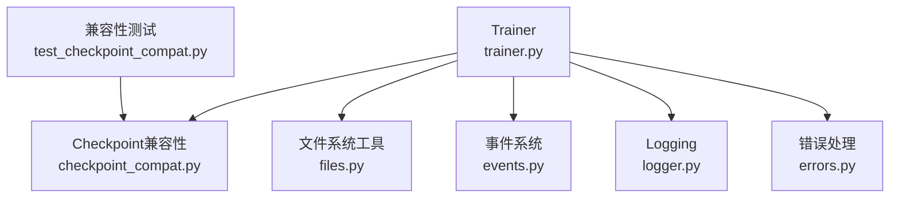
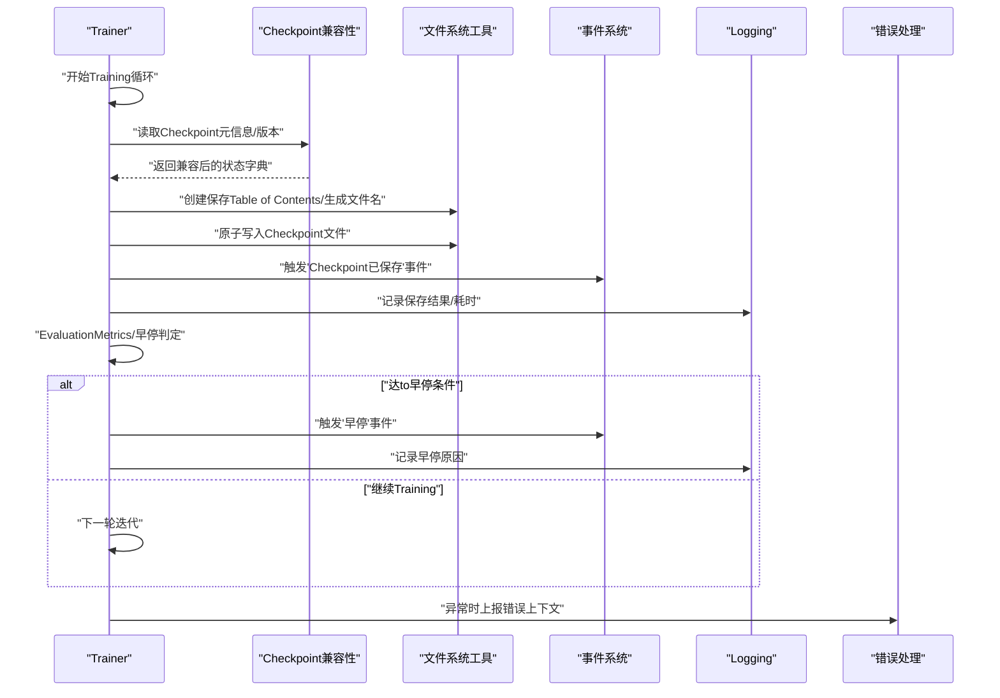
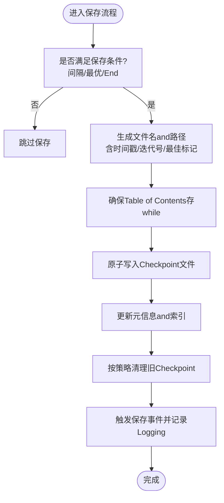
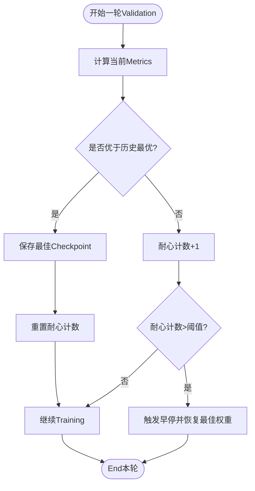
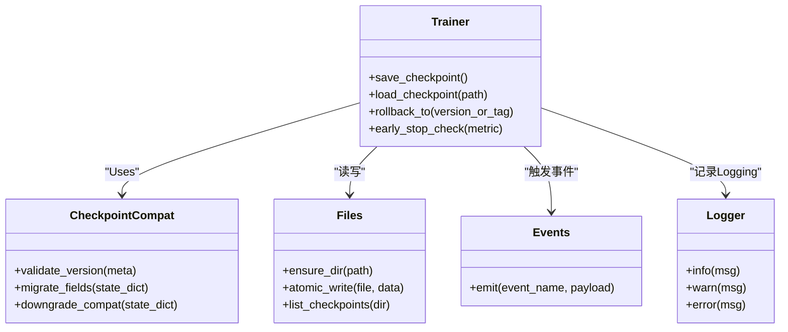
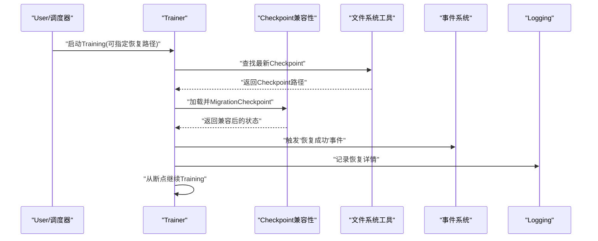
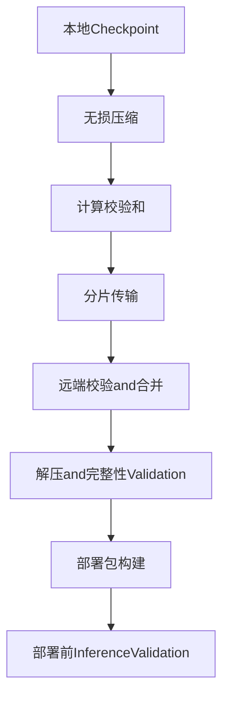
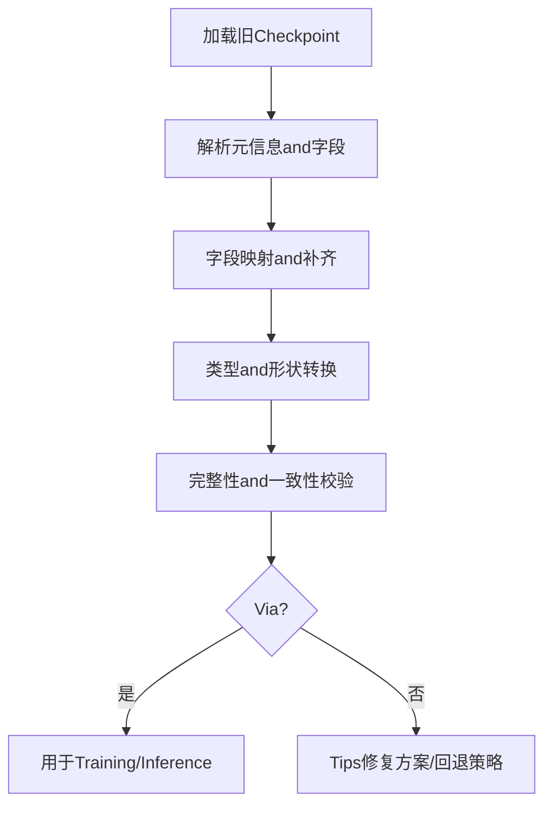
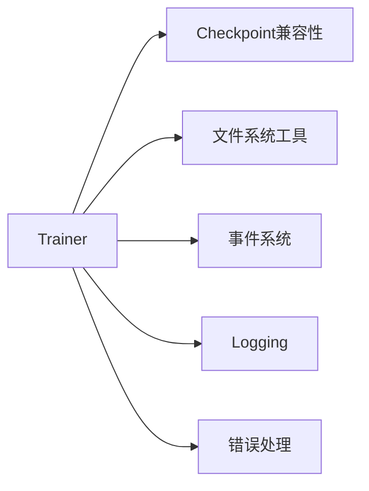

# Checkpoint管理

<cite>
**Files Referenced in This Document**
- [trainer.py](file://ultralytics/engine/trainer.py)
- [checkpoint_compat.py](file://ultralytics/utils/checkpoint_compat.py)
- [files.py](file://ultralytics/utils/files.py)
- [events.py](file://ultralytics/utils/events.py)
- [logger.py](file://ultralytics/utils/logger.py)
- [errors.py](file://ultralytics/utils/errors.py)
- [test_checkpoint_compat.py](file://tests/test_checkpoint_compat.py)
</cite>

## Table of Contents
1. [Introduction](#Introduction)
2. [Project Structure](#Project Structure)
3. [Core Components](#Core Components)
4. [Architecture Overview](#Architecture Overview)
5. [Detailed Component Analysis](#Detailed Component Analysis)
6. [Dependency Analysis](#Dependency Analysis)
7. [性能考量](#性能考量)
8. [Troubleshooting Guide](#Troubleshooting Guide)
9. [Conclusion](#Conclusion)
10. [Appendix](#Appendix)

## Introduction
本文件聚焦于 YOLO-Master 的Checkpoint（Checkpoint）管理capabilities，围绕Centered on下目标unfold：
- Checkpoint的保存策略and命名规则
- 早停机制的配置andimplementing原理
- 模型版本管理and回滚方法
- Training中断恢复机制and数据持久化策略
- Checkpoint压缩、传输and部署最佳实践
- Checkpoint兼容性andMigration处理方法

Documentationtargeting不同技术背景的读者，既provides高层概览，也给出代码级分析and图示。

## Project Structure
andCheckpoint管理直接相关的核心位置such as下：
- TrainerandCheckpoint生命周期：ultralytics/engine/trainer.py
- Checkpoint兼容性处理：ultralytics/utils/checkpoint_compat.py
- 文件系统工具（路径/Table of Contents/文件操作）：ultralytics/utils/files.py
- 事件回调andLogging：ultralytics/utils/events.py, ultralytics/utils/logger.py
- 错误定义and传播：ultralytics/utils/errors.py
- 兼容性测试用例：tests/test_checkpoint_compat.py

Figure Source
- [trainer.py](file://ultralytics/engine/trainer.py)
- [checkpoint_compat.py](file://ultralytics/utils/checkpoint_compat.py)
- [files.py](file://ultralytics/utils/files.py)
- [events.py](file://ultralytics/utils/events.py)
- [logger.py](file://ultralytics/utils/logger.py)
- [errors.py](file://ultralytics/utils/errors.py)
- [test_checkpoint_compat.py](file://tests/test_checkpoint_compat.py)

Section Source
- [trainer.py](file://ultralytics/engine/trainer.py)
- [checkpoint_compat.py](file://ultralytics/utils/checkpoint_compat.py)
- [files.py](file://ultralytics/utils/files.py)
- [events.py](file://ultralytics/utils/events.py)
- [logger.py](file://ultralytics/utils/logger.py)
- [errors.py](file://ultralytics/utils/errors.py)
- [test_checkpoint_compat.py](file://tests/test_checkpoint_compat.py)

## Core Components
- Trainer（Trainer）
  - 负责Training循环、Validation、Checkpoint保存and加载、早停判定、断点恢复etc.关键流程。
- Checkpoint兼容性Modules（Checkpoint Compatibility）
  - 负责旧版and新版Checkpoint之间的字段映射、缺失字段补齐、类型转换and校验。
- 文件系统工具（Files）
  - provides统一的Table of Contents创建、路径拼接、文件存while性判断、原子写入etc.capabilities。
- 事件andLogging（Events & Logger）
  - while关键节点触发事件（such as保存、加载、早停），并输出结构化Logging。
- 错误处理（Errors）
  - 定义Checkpoint相关异常类型and错误码，便于上层捕获andTips。
- 兼容性测试（Test Checkpoint Compat）
  - 覆盖多版本Checkpoint加载、字段对齐、降级/升级路径的回归测试。

Section Source
- [trainer.py](file://ultralytics/engine/trainer.py)
- [checkpoint_compat.py](file://ultralytics/utils/checkpoint_compat.py)
- [files.py](file://ultralytics/utils/files.py)
- [events.py](file://ultralytics/utils/events.py)
- [logger.py](file://ultralytics/utils/logger.py)
- [errors.py](file://ultralytics/utils/errors.py)
- [test_checkpoint_compat.py](file://tests/test_checkpoint_compat.py)

## Architecture Overview
下图展示了CheckpointwhileTraining过程中的关键交互：Trainerwhile合适时机Calls保存/加载逻辑，必要时进行兼容性处理；Via事件系统通知外部监听者；Uses文件系统工具完成持久化；遇to异常时统一上报。

Figure Source
- [trainer.py](file://ultralytics/engine/trainer.py)
- [checkpoint_compat.py](file://ultralytics/utils/checkpoint_compat.py)
- [files.py](file://ultralytics/utils/files.py)
- [events.py](file://ultralytics/utils/events.py)
- [logger.py](file://ultralytics/utils/logger.py)
- [errors.py](file://ultralytics/utils/errors.py)

## Detailed Component Analysis

### Checkpoint保存策略and命名规则
- 保存时机
  - 按固定步数/轮次间隔保存
  - 当ValidationMetrics优于历史最优时保存“最佳”Checkpoint
  - TrainingEnd或发生早停时保存最终Checkpoint
- 命名约定
  - 包含时间戳或迭代号，确保唯一性and可追溯性
  - “最佳”Checkpoint采用专用后缀或别名，便于快速定位
  - 临时文件采用原子写入策略，避免部分写入导致损坏
- 保留策略
  - 仅保留最近 N 个Checkpointand历史最佳
  - Supporting按大小阈值清理旧Checkpoint，释放磁盘空间

Figure Source
- [trainer.py](file://ultralytics/engine/trainer.py)
- [files.py](file://ultralytics/utils/files.py)
- [events.py](file://ultralytics/utils/events.py)
- [logger.py](file://ultralytics/utils/logger.py)

Section Source
- [trainer.py](file://ultralytics/engine/trainer.py)
- [files.py](file://ultralytics/utils/files.py)
- [events.py](file://ultralytics/utils/events.py)
- [logger.py](file://ultralytics/utils/logger.py)

### 早停机制的配置andimplementing原理
- 配置项
  - 早停耐心值（Patience）：允许ValidationMetrics不提升的最大连续轮数
  - 监控Metrics：such as mAP、Loss etc.
  - 最小提升阈值：防止微小波动触发早停
- implementing要点
  - 每轮Validation后比较当前Metricsand历史最优
  - 若未提升则增加耐心计数；超过阈值则触发早停
  - 早停时可自动恢复至历史最佳权重
- 事件andLogging
  - 触发“早停”事件，记录原因and最后Metrics
  - 输出建议：调整Learning Rate、增大耐心值或更换监控Metrics

Figure Source
- [trainer.py](file://ultralytics/engine/trainer.py)
- [events.py](file://ultralytics/utils/events.py)
- [logger.py](file://ultralytics/utils/logger.py)

Section Source
- [trainer.py](file://ultralytics/engine/trainer.py)
- [events.py](file://ultralytics/utils/events.py)
- [logger.py](file://ultralytics/utils/logger.py)

### 模型版本管理and回滚方法
- 版本标识
  - Checkpoint中记录模型版本、框架版本、关键配置摘要
  - for每次重要变更生成增量标签或快照名
- 回滚策略
  - 基于“最佳”Checkpoint一键回滚
  - Supporting指定版本号或时间戳进行精确回滚
  - 回滚前进行兼容性校验，失败则Tips修复方案
- 审计and追踪
  - 将回滚动作and原因记录toLoggingand事件流
  - provides回滚前后Metrics对比报告

Figure Source
- [trainer.py](file://ultralytics/engine/trainer.py)
- [checkpoint_compat.py](file://ultralytics/utils/checkpoint_compat.py)
- [files.py](file://ultralytics/utils/files.py)
- [events.py](file://ultralytics/utils/events.py)
- [logger.py](file://ultralytics/utils/logger.py)

Section Source
- [trainer.py](file://ultralytics/engine/trainer.py)
- [checkpoint_compat.py](file://ultralytics/utils/checkpoint_compat.py)
- [files.py](file://ultralytics/utils/files.py)
- [events.py](file://ultralytics/utils/events.py)
- [logger.py](file://ultralytics/utils/logger.py)

### Training中断恢复机制and数据持久化策略
- 断点内容
  - 模型权重、Optimizer状态、调度器状态、随机种子、Training进度
  - Validation集缓存、Metrics历史、早停计数器
- 恢复流程
  - 启动时检测是否存while最新Checkpoint
  - 加载并执行兼容性Migration，确保字段完整and类型正确
  - 从断点处继续Training，恢复事件andLogging上下文
- 持久化策略
  - Uses原子写入避免部分写入导致的损坏
  - 定期同步to远程存储（Optional）Centered on增强容灾
  - 对大张量进行分块写入and校验和校验

Figure Source
- [trainer.py](file://ultralytics/engine/trainer.py)
- [checkpoint_compat.py](file://ultralytics/utils/checkpoint_compat.py)
- [files.py](file://ultralytics/utils/files.py)
- [events.py](file://ultralytics/utils/events.py)
- [logger.py](file://ultralytics/utils/logger.py)

Section Source
- [trainer.py](file://ultralytics/engine/trainer.py)
- [checkpoint_compat.py](file://ultralytics/utils/checkpoint_compat.py)
- [files.py](file://ultralytics/utils/files.py)
- [events.py](file://ultralytics/utils/events.py)
- [logger.py](file://ultralytics/utils/logger.py)

### Checkpoint压缩、传输and部署最佳实践
- 压缩
  - 对Checkpoint文件进行无损压缩，减少体积and网络传输成本
  - 压缩前后进行完整性校验（such as哈希）
- 传输
  - Uses断点续传and并发分片传输，提高稳定性and速度
  - 传输过程中记录校验和and元数据
- 部署
  - 部署包包含模型权重、配置文件and兼容性元数据
  - 部署前进行轻量InferenceValidation，确保一致性
  - for生产环境provides只读访问and版本锁定

[本节for通用实践说明，无需源码引用]

### Checkpoint兼容性andMigration处理方法
- 兼容性维度
  - 模型结构变化：新增/删除层、参数名变更
  - 数据类型变化：精度、布局、设备映射
  - 元数据变化：版本、配置、Training超参
- Migration策略
  - 字段映射表：将旧字段名映射to新字段名
  - 缺失字段补齐：默认值或从其他源推断
  - 类型转换：such as dtype、device、形状对齐
  - 降级兼容：while新代码中加载旧格式Checkpoint
- 测试保障
  - 覆盖多版本Checkpoint加载andMigration的自动化测试
  - 对Migration前后数值一致性进行回归Validation

Figure Source
- [checkpoint_compat.py](file://ultralytics/utils/checkpoint_compat.py)
- [test_checkpoint_compat.py](file://tests/test_checkpoint_compat.py)

Section Source
- [checkpoint_compat.py](file://ultralytics/utils/checkpoint_compat.py)
- [test_checkpoint_compat.py](file://tests/test_checkpoint_compat.py)

## Dependency Analysis
- 内部依赖
  - Trainer依赖Checkpoint兼容性Modules进行版本and字段处理
  - Trainer依赖文件系统工具完成持久化and原子写入
  - TrainerVia事件系统andLoggingModules进行状态广播and记录
  - 错误处理Modules贯穿各层，provides一致的异常语义
- External Dependencies
  - Distributed Training框架（such as适用）的状态同步andCheckpoint聚合
  - 对象存储或共享文件系统（Optional）用于跨节点持久化

Figure Source
- [trainer.py](file://ultralytics/engine/trainer.py)
- [checkpoint_compat.py](file://ultralytics/utils/checkpoint_compat.py)
- [files.py](file://ultralytics/utils/files.py)
- [events.py](file://ultralytics/utils/events.py)
- [logger.py](file://ultralytics/utils/logger.py)
- [errors.py](file://ultralytics/utils/errors.py)

Section Source
- [trainer.py](file://ultralytics/engine/trainer.py)
- [checkpoint_compat.py](file://ultralytics/utils/checkpoint_compat.py)
- [files.py](file://ultralytics/utils/files.py)
- [events.py](file://ultralytics/utils/events.py)
- [logger.py](file://ultralytics/utils/logger.py)
- [errors.py](file://ultralytics/utils/errors.py)

## 性能考量
- I/O Optimization
  - Uses异步或后台线程进行保存，降低Training主循环阻塞
  - 批量写入and合并小文件，减少元数据开销
- 内存and带宽
  - 对大张量进行分块序列化，控制峰值内存
  - 启用压缩and去重，降低网络and磁盘占用
- 可靠性
  - 原子写入and校验和，避免损坏
  - 重试and断点续传，提高鲁棒性

[本节for通用指导，无需源码引用]

## Troubleshooting Guide
- 常见问题
  - Checkpoint加载失败：字段缺失、类型不匹配、版本不一致
  - 早停误触发：耐心值过小、监控Metrics噪声大
  - 磁盘空间不足：未and时清理旧Checkpoint
- 诊断步骤
  - 查看事件andLogging中的保存/加载/早停记录
  - Uses兼容性Modules的校验接口定位字段差异
  - 检查文件系统权限and可用空间
- 恢复建议
  - 回滚至最近稳定版本或最佳Checkpoint
  - 调整早停耐心值and监控Metrics
  - 开启更详细的Logging级别Centered on便复现问题

Section Source
- [events.py](file://ultralytics/utils/events.py)
- [logger.py](file://ultralytics/utils/logger.py)
- [errors.py](file://ultralytics/utils/errors.py)
- [checkpoint_compat.py](file://ultralytics/utils/checkpoint_compat.py)

## Conclusion
YOLO-Master 的Checkpoint管理围绕Trainerfor核心，Combining兼容性处理、文件系统工具、事件andLoggingCentered onand错误处理，形成完整的保存、恢复、回滚andMigration体系。Via合理的保存策略、早停机制and版本管理，Combined with压缩、传输and部署的最佳实践，可while保证可靠性提升效率and可维护性。

[本节for总结性内容，无需源码引用]

## Appendix
- 术语
  - Checkpoint：包含模型权重andTraining状态的持久化快照
  - 早停：当ValidationMetrics长时间不提升时提前终止Training
  - 原子写入：确保文件要么完全写入，要么完全不写入
- Refer to
  - 兼容性测试用例可作for行for契约and回归基线

[本节for补充信息，无需源码引用]