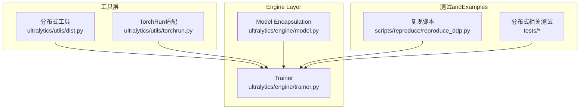
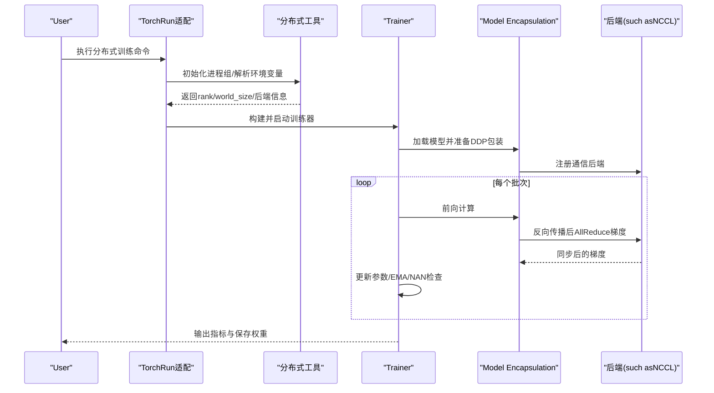
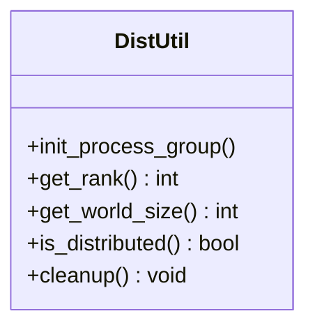
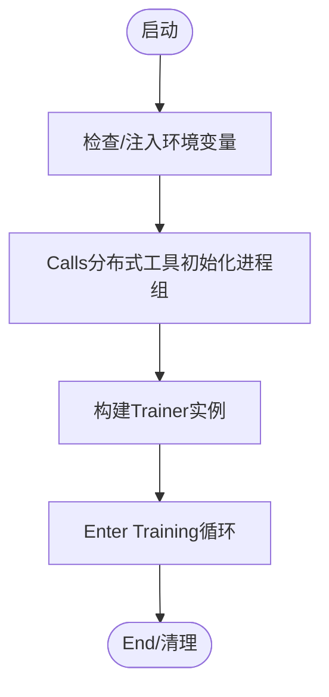
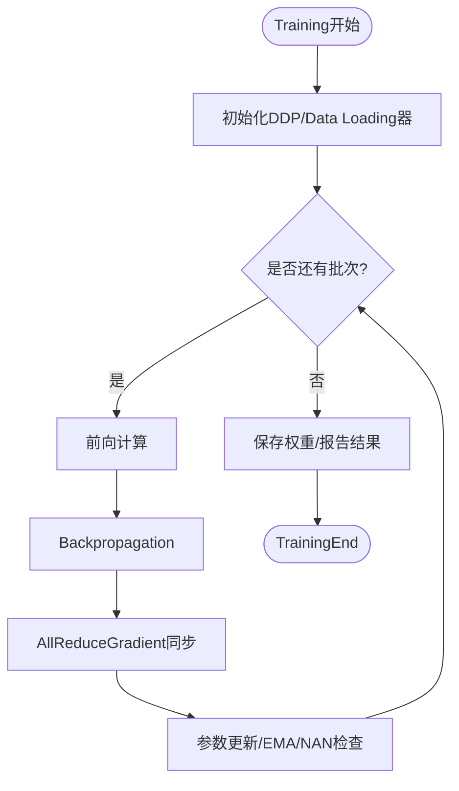
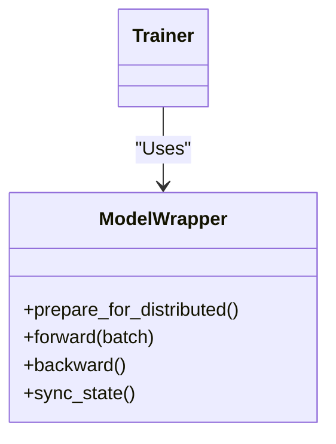
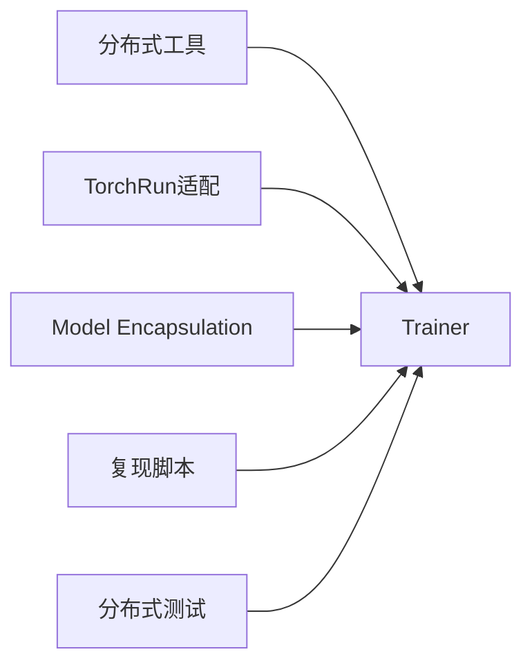

# Distributed Training

<cite>
**Files Referenced in This Document**
- [ultralytics/utils/dist.py](file://ultralytics/utils/dist.py)
- [ultralytics/utils/torchrun.py](file://ultralytics/utils/torchrun.py)
- [ultralytics/engine/trainer.py](file://ultralytics/engine/trainer.py)
- [ultralytics/engine/model.py](file://ultralytics/engine/model.py)
- [scripts/reproduce/reproduce_ddp.py](file://scripts/reproduce/reproduce_ddp.py)
- [tests/test_ddp_device_hardening.py](file://tests/test_ddp_device_hardening.py)
- [tests/test_ddp_error_propagation_e2e.py](file://tests/test_ddp_error_propagation_e2e.py)
- [tests/test_ddp_lifecycle_ema_nan.py](file://tests/test_ddp_lifecycle_ema_nan.py)
- [tests/test_ddp_root_cause_reporting.py](file://tests/test_ddp_root_cause_reporting.py)
- [tests/ddp_moa_mot_smoke.py](file://tests/ddp_moa_mot_smoke.py)
- [tests/ddp_moe_smoke.py](file://tests/ddp_moe_smoke.py)
- [tests/ddp_moe_validation_smoke.py](file://tests/ddp_moe_validation_smoke.py)
- [tests/test_moe_ddp_fixes.py](file://tests/test_moe_ddp_fixes.py)
- [tests/test_moe_validation_collectives.py](file://tests/test_moe_validation_collectives.py)
- [tests/test_autograd_allreduce.py](file://tests/test_autograd_allreduce.py)
- [tests/test_windows_torchrun.py](file://tests/test_windows_torchrun.py)
</cite>

## Table of Contents
1. [Introduction](#Introduction)
2. [Project Structure](#Project Structure)
3. [Core Components](#Core Components)
4. [Architecture Overview](#Architecture Overview)
5. [Detailed Component Analysis](#Detailed Component Analysis)
6. [Dependency Analysis](#Dependency Analysis)
7. [Performance Considerations](#Performance Considerations)
8. [Troubleshooting Guide](#Troubleshooting Guide)
9. [Conclusion](#Conclusion)
10. [Appendix](#Appendix)

## Introduction
本文件targetingYOLO-Master的Distributed Training，聚焦多GPUand多机多卡场景下的配置方法、通信机制andOptimization实践。内容涵盖：
- DDP（Distributed Data Parallel）初始化and参数设置
- Gradient同步andLoad Balancing策略
- 容错and错误传播机制
- 不同硬件环境（单机多卡/多机多卡）的最佳实践
- 性能监控and调试方法

## Project Structure
本项目whileDistributed Training方面采用“工具层 + Engine Layer + 测试Validation”的分层组织：
- 工具层：provides分布式初始化、进程组管理、torchrun适配etc.capabilities
- Engine Layer：Trainer负责DDP生命周期管理and数据并行调度
- 测试层：覆盖设备硬加固、错误传播、EMA/NAN处理、MoE/MoA集成etc.关键路径

**Figure Source**
- [ultralytics/utils/dist.py](file://ultralytics/utils/dist.py)
- [ultralytics/utils/torchrun.py](file://ultralytics/utils/torchrun.py)
- [ultralytics/engine/trainer.py](file://ultralytics/engine/trainer.py)
- [ultralytics/engine/model.py](file://ultralytics/engine/model.py)
- [scripts/reproduce/reproduce_ddp.py](file://scripts/reproduce/reproduce_ddp.py)

**Section Source**
- [ultralytics/utils/dist.py](file://ultralytics/utils/dist.py)
- [ultralytics/utils/torchrun.py](file://ultralytics/utils/torchrun.py)
- [ultralytics/engine/trainer.py](file://ultralytics/engine/trainer.py)
- [ultralytics/engine/model.py](file://ultralytics/engine/model.py)
- [scripts/reproduce/reproduce_ddp.py](file://scripts/reproduce/reproduce_ddp.py)

## Core Components
- 分布式工具Modules：Encapsulates进程组创建、后端选择、环境变量解析、rank/world_size获取etc.基础capabilities
- TorchRun适配：统一Viatorchrun启动，屏蔽平台差异（含Windows兼容）
- Trainer：负责DDP上下文、Data Loading分片、Gradient同步触发点、EMA/NAN防护、Loggingand回调
- Model Encapsulation：while分布式环境下进行必要的模型包装and状态一致性保障
- 复现脚本and测试：provides端to端可运行的Distributed Training入口and回归用例

**Section Source**
- [ultralytics/utils/dist.py](file://ultralytics/utils/dist.py)
- [ultralytics/utils/torchrun.py](file://ultralytics/utils/torchrun.py)
- [ultralytics/engine/trainer.py](file://ultralytics/engine/trainer.py)
- [ultralytics/engine/model.py](file://ultralytics/engine/model.py)
- [scripts/reproduce/reproduce_ddp.py](file://scripts/reproduce/reproduce_ddp.py)

## Architecture Overview
下图展示了从启动toTraining循环的关键流程，包括进程初始化、DDPEncapsulates、数据并行andGradient同步。

**Figure Source**
- [ultralytics/utils/torchrun.py](file://ultralytics/utils/torchrun.py)
- [ultralytics/utils/dist.py](file://ultralytics/utils/dist.py)
- [ultralytics/engine/trainer.py](file://ultralytics/engine/trainer.py)
- [ultralytics/engine/model.py](file://ultralytics/engine/model.py)

## Detailed Component Analysis

### 分布式工具（dist）
- 职责
  - 解析分布式环境变量（such as端口、地址、世界大小、进程ID）
  - 选择并初始化通信后端（例such asNCCL）
  - providesrank/world_size/local_ranketc.常用属性
  - Encapsulates进程组生命周期（初始化/销毁）
- 关键点
  - 对异常进行捕获and上报，便于上层统一处理
  - for不同平台provides兼容性逻辑（such asWindows）

**Figure Source**
- [ultralytics/utils/dist.py](file://ultralytics/utils/dist.py)

**Section Source**
- [ultralytics/utils/dist.py](file://ultralytics/utils/dist.py)

### TorchRun适配（torchrun）
- 职责
  - 统一Viatorchrun启动TrainingTasks
  - 自动注入或校验必要的环境变量
  - 屏蔽平台差异，提升跨平台可用性
- 关键点
  - Windows下特殊处理（见相关测试）
  - and分布式工具协作完成进程组初始化

**Figure Source**
- [ultralytics/utils/torchrun.py](file://ultralytics/utils/torchrun.py)

**Section Source**
- [ultralytics/utils/torchrun.py](file://ultralytics/utils/torchrun.py)
- [tests/test_windows_torchrun.py](file://tests/test_windows_torchrun.py)

### Trainer（trainer）
- 职责
  - 管理DDP生命周期：包装模型、分发数据、触发Gradient同步
  - 控制批内/批间行for：数据分片、采样、缓存
  - 集成EMA、NAN检测and恢复、Loggingand回调
- 关键点
  - whileBackpropagation后确保所有进程同步Gradient
  - 对MoE/MoAetc.特殊Modules进行兼容性处理（见相关测试）

**Figure Source**
- [ultralytics/engine/trainer.py](file://ultralytics/engine/trainer.py)

**Section Source**
- [ultralytics/engine/trainer.py](file://ultralytics/engine/trainer.py)
- [tests/test_ddp_lifecycle_ema_nan.py](file://tests/test_ddp_lifecycle_ema_nan.py)

### Model Encapsulation（model）
- 职责
  - while分布式环境中对模型进行必要的包装and状态一致性维护
  - andTrainer协同，确保DDP通信正确触发
- 关键点
  - 针对MoE/MoAetc.复杂结构的兼容性处理（见相关测试）

**Figure Source**
- [ultralytics/engine/model.py](file://ultralytics/engine/model.py)

**Section Source**
- [ultralytics/engine/model.py](file://ultralytics/engine/model.py)
- [tests/ddp_moa_mot_smoke.py](file://tests/ddp_moa_mot_smoke.py)
- [tests/ddp_moe_smoke.py](file://tests/ddp_moe_smoke.py)
- [tests/ddp_moe_validation_smoke.py](file://tests/ddp_moe_validation_smoke.py)
- [tests/test_moe_ddp_fixes.py](file://tests/test_moe_ddp_fixes.py)
- [tests/test_moe_validation_collectives.py](file://tests/test_moe_validation_collectives.py)

### 复现脚本（reproduce_ddp）
- 职责
  - provides端to端的Distributed Training入口，便于快速Validationand基准对比
- 关键点
  - Viatorchrundrivers are installed，复用分布式工具andTrainercapabilities

**Section Source**
- [scripts/reproduce/reproduce_ddp.py](file://scripts/reproduce/reproduce_ddp.py)

## Dependency Analysis
- 低耦合高内聚
  - 分布式工具独立于Trainer，仅暴露必要接口
  - Trainer依赖工具层完成进程组and通信后端管理
  - Model EncapsulationandTrainer解耦，便于扩展新Modules类型
- External Dependencies
  - 底层通信后端（such asNCCL）由工具层选择and初始化
  - torchrun作for统一启动入口，屏蔽平台差异

**Figure Source**
- [ultralytics/utils/dist.py](file://ultralytics/utils/dist.py)
- [ultralytics/utils/torchrun.py](file://ultralytics/utils/torchrun.py)
- [ultralytics/engine/trainer.py](file://ultralytics/engine/trainer.py)
- [ultralytics/engine/model.py](file://ultralytics/engine/model.py)
- [scripts/reproduce/reproduce_ddp.py](file://scripts/reproduce/reproduce_ddp.py)

**Section Source**
- [ultralytics/utils/dist.py](file://ultralytics/utils/dist.py)
- [ultralytics/utils/torchrun.py](file://ultralytics/utils/torchrun.py)
- [ultralytics/engine/trainer.py](file://ultralytics/engine/trainer.py)
- [ultralytics/engine/model.py](file://ultralytics/engine/model.py)
- [scripts/reproduce/reproduce_ddp.py](file://scripts/reproduce/reproduce_ddp.py)

## Performance Considerations
- 通信and带宽
  - Set appropriatelyworld_sizeandbatch size，避免通信成forbottlenecks
  - Prefer高性能后端（such asNCCL），并确保网络拓扑最优
- Data LoadingandI/O
  - 启用数据预取and并行加载，减少GPU空闲时间
  - 对大图像数据集进行分块and缓存策略Optimization
- 数值稳定性
  - 开启Mixture精度时注意Gradient缩放andNAN检测
  - EMA平滑有助于稳定收敛，但需权衡更新频率
- Load Balancing
  - 确保各进程数据分布均匀，避免长尾样本导致拖尾
  - 对于MoE/MoA，关注专家路由均衡and负载统计

[This section provides general guidance and does not directly analyze specific files]

## Troubleshooting Guide
- 常见错误and定位
  - 进程组初始化失败：检查环境变量、端口占用、后端可用性
  - Gradient不同步：确认Backpropagation后是否触发AllReduce，检查自定义Modules的钩子
  - NAN/NaN损失：启用EMA/NAN检测，定位不稳定算子或Learning Rate过大
  - 平台差异（Windows）：Usestorchrun适配and对应测试用例Validation
- 诊断and监控
  - 利用测试用例中的错误传播and根因上报逻辑，快速定位问题
  - CombiningLoggingand回调，监控各进程的进度and资源Uses
- 典型测试用例Refer to
  - 设备硬加固and错误传播
  - 生命周期andEMA/NAN处理
  - MoE/MoAwhileDDP下的通信andValidation

**Section Source**
- [tests/test_ddp_device_hardening.py](file://tests/test_ddp_device_hardening.py)
- [tests/test_ddp_error_propagation_e2e.py](file://tests/test_ddp_error_propagation_e2e.py)
- [tests/test_ddp_lifecycle_ema_nan.py](file://tests/test_ddp_lifecycle_ema_nan.py)
- [tests/test_ddp_root_cause_reporting.py](file://tests/test_ddp_root_cause_reporting.py)
- [tests/test_autograd_allreduce.py](file://tests/test_autograd_allreduce.py)
- [tests/test_windows_torchrun.py](file://tests/test_windows_torchrun.py)

## Conclusion
YOLO-Master的Distributed TrainingCentered on工具层for核心，Combined withTrainerandModel Encapsulation，形成清晰的分层架构。Viatorchrun统一启动、完善的错误传播and诊断capabilities，Centered onand针对MoE/MoA的兼容性处理，能够while单机多卡and多机多卡场景下implementing高效稳定的Training。建议while生产环境中Combining性能监控and调优策略，持续Optimization通信andI/O路径，确保大规模Training的可靠性and效率。

[This section is summary content and does not directly analyze specific files]

## Appendix
- 快速上手
  - Usestorchrun启动Distributed Training，Refer to复现脚本andDocumentation说明
  - 根据硬件环境选择合适的后端and参数
- 最佳实践清单
  - 明确rank/world_sizeand环境变量
  - Set appropriatelybatch sizeandData Loading并行度
  - 启用EMAandNAN检测，定期保存Checkpoint
  - 对MoE/MoA进行路由均衡and负载监控
- Refer to用例
  - 分布式Smoke测试andMoE/MoA集成测试
  - 设备硬加固and错误传播测试

[本节for补充信息，不直接分析具体文件]