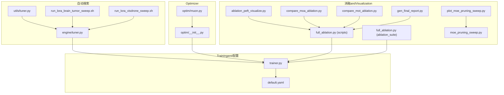
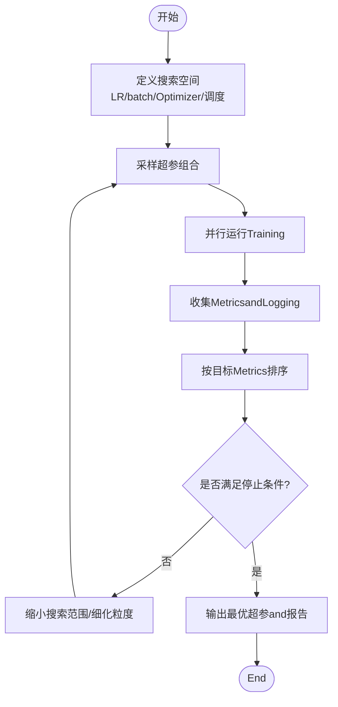
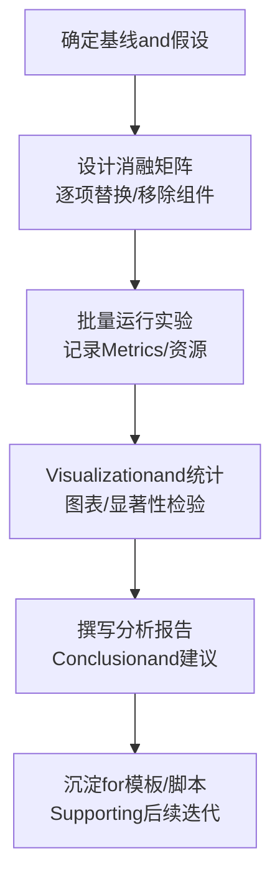
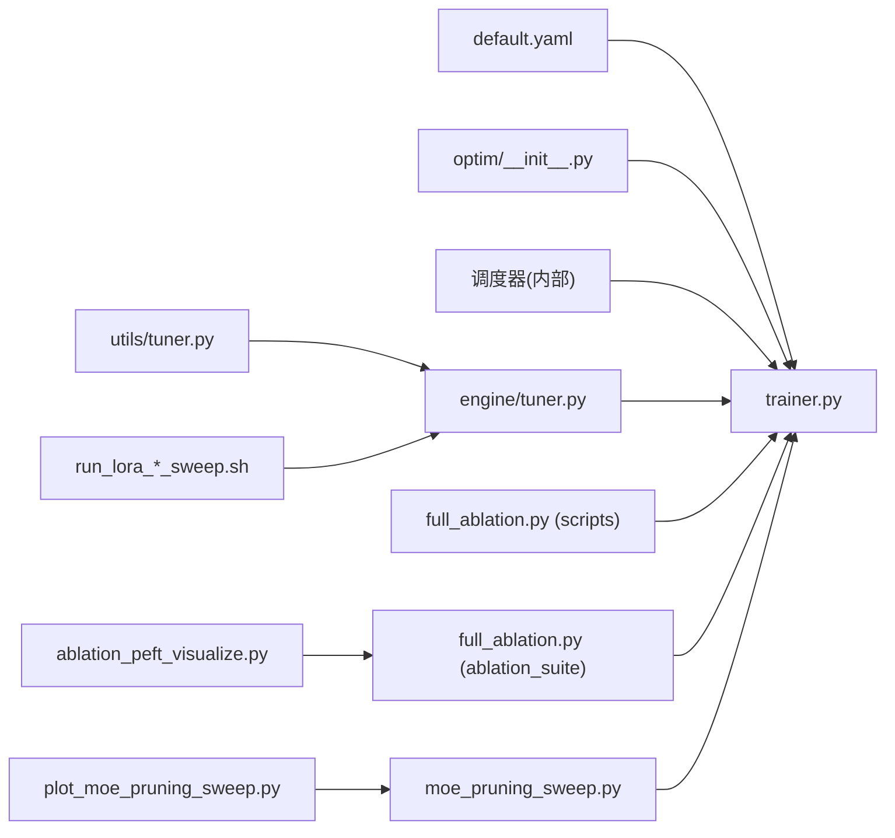

# 超参数调优

<cite>
**Files Referenced in This Document**
- [ultralytics/engine/trainer.py](file://ultralytics/engine/trainer.py)
- [ultralytics/engine/tuner.py](file://ultralytics/engine/tuner.py)
- [ultralytics/utils/tuner.py](file://ultralytics/utils/tuner.py)
- [ultralytics/optim/__init__.py](file://ultralytics/optim/__init__.py)
- [ultralytics/optim/muon.py](file://ultralytics/optim/muon.py)
- [ultralytics/cfg/default.yaml](file://ultralytics/cfg/default.yaml)
- [examples/lora_examples/run_lora_brain_tumor_sweep.sh](file://examples/lora_examples/run_lora_brain_tumor_sweep.sh)
- [examples/lora_examples/run_lora_visdrone_sweep.sh](file://examples/lora_examples/run_lora_visdrone_sweep.sh)
- [scripts/full_ablation.py](file://scripts/full_ablation.py)
- [scripts/ablation_suite/full_ablation.py](file://scripts/ablation_suite/full_ablation.py)
- [scripts/ablation_suite/ablation_peft_visualize.py](file://scripts/ablation_suite/ablation_peft_visualize.py)
- [scripts/plot_moe_pruning_sweep.py](file://scripts/plot_moe_pruning_sweep.py)
- [scripts/moe_pruning_sweep.py](file://scripts/moe_pruning_sweep.py)
- [scripts/compare_moa_ablation.py](file://scripts/compare_moa_ablation.py)
- [scripts/compare_mot_ablation.py](file://scripts/compare_mot_ablation.py)
- [scripts/gen_final_report.py](file://scripts/gen_final_report.py)
</cite>

## Table of Contents
1. [Introduction](#Introduction)
2. [Project Structure](#Project Structure)
3. [Core Components](#Core Components)
4. [Architecture Overview](#Architecture Overview)
5. [Detailed Component Analysis](#Detailed Component Analysis)
6. [Dependency Analysis](#Dependency Analysis)
7. [性能考量](#性能考量)
8. [Troubleshooting Guide](#Troubleshooting Guide)
9. [Conclusion](#Conclusion)
10. [Appendix](#Appendix)

## Introduction
本指南targetingUses YOLO-Master 进行Object Detectionand相关TasksTraining的EngineersandResearchers，聚焦“超参数调优”的完整实践路径。内容覆盖：
- Learning Rate调度策略（余弦退火、线性衰减、多阶段Learning Rate）
- 批量大小选择原则and其对Training效果的影响
- Optimizer配置最佳实践（AdamW、SGD etc.）
- 自动超参数搜索方法and工具Uses
- 消融实验设计and结果分析方法

目标是帮助读者while有限算力下高效定位最优超参数组合，并建立可复现、可对比的实验体系。

## Project Structure
围绕超参数调优，仓库中andTraining、Optimizer、自动搜索和消融实验相关的核心位置such as下：
- Training主循环and default configurations：ultralytics/engine/trainer.py、ultralytics/cfg/default.yaml
- 自动超参搜索：ultralytics/engine/tuner.py、ultralytics/utils/tuner.py
- Optimizerimplementingand注册：ultralytics/optim/__init__.py、ultralytics/optim/muon.py
- 自动化搜索脚本Examples：examples/lora_examples/*.sh
- 消融实验andVisualization：scripts/*_ablation*.py、scripts/ablation_suite/*、scripts/plot_*sweep*.py



Figure Source
- [ultralytics/engine/trainer.py](file://ultralytics/engine/trainer.py)
- [ultralytics/cfg/default.yaml](file://ultralytics/cfg/default.yaml)
- [ultralytics/engine/tuner.py](file://ultralytics/engine/tuner.py)
- [ultralytics/utils/tuner.py](file://ultralytics/utils/tuner.py)
- [ultralytics/optim/__init__.py](file://ultralytics/optim/__init__.py)
- [ultralytics/optim/muon.py](file://ultralytics/optim/muon.py)
- [examples/lora_examples/run_lora_brain_tumor_sweep.sh](file://examples/lora_examples/run_lora_brain_tumor_sweep.sh)
- [examples/lora_examples/run_lora_visdrone_sweep.sh](file://examples/lora_examples/run_lora_visdrone_sweep.sh)
- [scripts/full_ablation.py](file://scripts/full_ablation.py)
- [scripts/ablation_suite/full_ablation.py](file://scripts/ablation_suite/full_ablation.py)
- [scripts/ablation_suite/ablation_peft_visualize.py](file://scripts/ablation_suite/ablation_peft_visualize.py)
- [scripts/plot_moe_pruning_sweep.py](file://scripts/plot_moe_pruning_sweep.py)
- [scripts/moe_pruning_sweep.py](file://scripts/moe_pruning_sweep.py)
- [scripts/compare_moa_ablation.py](file://scripts/compare_moa_ablation.py)
- [scripts/compare_mot_ablation.py](file://scripts/compare_mot_ablation.py)
- [scripts/gen_final_report.py](file://scripts/gen_final_report.py)

Section Source
- [ultralytics/engine/trainer.py](file://ultralytics/engine/trainer.py)
- [ultralytics/cfg/default.yaml](file://ultralytics/cfg/default.yaml)
- [ultralytics/engine/tuner.py](file://ultralytics/engine/tuner.py)
- [ultralytics/utils/tuner.py](file://ultralytics/utils/tuner.py)
- [ultralytics/optim/__init__.py](file://ultralytics/optim/__init__.py)
- [ultralytics/optim/muon.py](file://ultralytics/optim/muon.py)
- [examples/lora_examples/run_lora_brain_tumor_sweep.sh](file://examples/lora_examples/run_lora_brain_tumor_sweep.sh)
- [examples/lora_examples/run_lora_visdrone_sweep.sh](file://examples/lora_examples/run_lora_visdrone_sweep.sh)
- [scripts/full_ablation.py](file://scripts/full_ablation.py)
- [scripts/ablation_suite/full_ablation.py](file://scripts/ablation_suite/full_ablation.py)
- [scripts/ablation_suite/ablation_peft_visualize.py](file://scripts/ablation_suite/ablation_peft_visualize.py)
- [scripts/plot_moe_pruning_sweep.py](file://scripts/plot_moe_pruning_sweep.py)
- [scripts/moe_pruning_sweep.py](file://scripts/moe_pruning_sweep.py)
- [scripts/compare_moa_ablation.py](file://scripts/compare_moa_ablation.py)
- [scripts/compare_mot_ablation.py](file://scripts/compare_mot_ablation.py)
- [scripts/gen_final_report.py](file://scripts/gen_final_report.py)

## Core Components
- Trainerand default configurations
  - trainer.py 负责Load model、数据、Optimizer、调度器andTraining循环；default.yaml provides默认超参andTasks级配置入口。
- 自动超参搜索
  - engine/tuner.py and utils/tuner.py Encapsulates了搜索空间定义、采样策略、并行执行and结果聚合。
- Optimizer
  - optim/__init__.py 暴露Unified Interface；muon.py provides特定Optimizerimplementing。
- 自动化搜索脚本
  - examples/lora_examples/*.sh 演示such as何Centered onCommand Line Approachdrivers are installed sweep。
- 消融andVisualization
  - scripts/*_ablation*.py and ablation_suite/* provides系统化消融流程and结果汇总、绘图capabilities。

Section Source
- [ultralytics/engine/trainer.py](file://ultralytics/engine/trainer.py)
- [ultralytics/cfg/default.yaml](file://ultralytics/cfg/default.yaml)
- [ultralytics/engine/tuner.py](file://ultralytics/engine/tuner.py)
- [ultralytics/utils/tuner.py](file://ultralytics/utils/tuner.py)
- [ultralytics/optim/__init__.py](file://ultralytics/optim/__init__.py)
- [ultralytics/optim/muon.py](file://ultralytics/optim/muon.py)
- [examples/lora_examples/run_lora_brain_tumor_sweep.sh](file://examples/lora_examples/run_lora_brain_tumor_sweep.sh)
- [examples/lora_examples/run_lora_visdrone_sweep.sh](file://examples/lora_examples/run_lora_visdrone_sweep.sh)
- [scripts/full_ablation.py](file://scripts/full_ablation.py)
- [scripts/ablation_suite/full_ablation.py](file://scripts/ablation_suite/full_ablation.py)
- [scripts/ablation_suite/ablation_peft_visualize.py](file://scripts/ablation_suite/ablation_peft_visualize.py)

## Architecture Overview
下图展示了从“User命令/脚本”to“Trainer执行”的关键Calls链，Centered onand自动搜索and消融实验such as何复用同一Training内核。

```mermaid
sequenceDiagram
participant U as "User/脚本"
participant S as "Sweep脚本(Shell)"
participant Tuner as "tuner(engine/utils)"
participant Trainer as "trainer.py"
participant Opt as "optim/__init__.py"
participant Sch as "调度器(由trainer内部构建)"
participant Eval as "Validation/Metrics"
U->>S : 指定数据集/模型/搜索空间
S->>Tuner : 启动一次或多次搜索任务
Tuner->>Trainer : 传入超参组合并触发训练
Trainer->>Opt : 实例化优化器(如AdamW/SGD/Muon)
Trainer->>Sch : 构建学习率调度(余弦/线性/多阶段)
loop 每个epoch
Trainer->>Trainer : 前向/损失/反向
Trainer->>Sch : 更新学习率
Trainer->>Eval : 周期评估与记录
end
Tuner-->>U : 输出最优超参与结果报告
```

Figure Source
- [ultralytics/engine/tuner.py](file://ultralytics/engine/tuner.py)
- [ultralytics/utils/tuner.py](file://ultralytics/utils/tuner.py)
- [ultralytics/engine/trainer.py](file://ultralytics/engine/trainer.py)
- [ultralytics/optim/__init__.py](file://ultralytics/optim/__init__.py)

## Detailed Component Analysis

### Learning Rate调度策略
- 常见策略
  - 余弦退火：适合稳定收敛and后期精细微调，常Combined with warmup Uses。
  - 线性衰减：简单直接，适合小数据集或快速基线。
  - 多阶段Learning Rate：按 epoch 或步数分段设置不同 LR，便于控制探索-利用平衡。
- while YOLO-Master 中的集成点
  - trainer.py 中根据配置构建Optimizerand调度器，并whileTraining循环内按步更新。
  - default.yaml provides默认调度相关字段，可whileTasks YAML 中覆盖。
- 建议
  - 先Centered on线性或余弦作for基线，再针对具体Tasks引入多阶段策略。
  - Combining warmup 提升初期稳定性，尤其while大批量或复杂Data Augmentation场景。

Section Source
- [ultralytics/engine/trainer.py](file://ultralytics/engine/trainer.py)
- [ultralytics/cfg/default.yaml](file://ultralytics/cfg/default.yaml)

### 批量大小选择原则
- 影响维度
  - 内存占用and吞吐：更大 batch 提高吞吐但增加显存压力。
  - 泛化and噪声：较小 batch 引入Gradient噪声，可能有助于跳出局部极小。
  - 批归一化行for：BN 统计量while小 batch 上不稳定，需权衡。
- 实践建议
  - Centered on设备显存for上限，尽量增大 batch 直至接近饱和。
  - 若出现 BN 不稳定，考虑减小 batch 或Uses替代归一化策略。
  - Combined withLearning Rate缩放规则（such as线性缩放）保持Training动态一致。

Section Source
- [ultralytics/engine/trainer.py](file://ultralytics/engine/trainer.py)
- [ultralytics/cfg/default.yaml](file://ultralytics/cfg/default.yaml)

### Optimizer配置最佳实践
- AdamW
  - 适用面广，对稀疏特征and大规模数据表现稳健；注意权重衰减and初始 LR 的协同。
- SGD
  - while部分视觉Tasks中可获得更好泛化，但需要更谨慎的 LR and动量设置。
- Muon（such as有）
  - 作forOptionalOptimizer，适用于特定场景或研究性实验，需单独Validation稳定性and收益。
- 配置要点
  - Via optim/__init__.py 的Unified Interface创建Optimizer实例。
  - while trainer.py 中将Optimizerand调度器绑定，确保 LR 更新路径正确。

Section Source
- [ultralytics/optim/__init__.py](file://ultralytics/optim/__init__.py)
- [ultralytics/optim/muon.py](file://ultralytics/optim/muon.py)
- [ultralytics/engine/trainer.py](file://ultralytics/engine/trainer.py)

### 自动超参数搜索方法and工具
- 搜索空间设计
  - 将关键超参（such as LR、batch size、Optimizer类型、warmup 比例、调度策略）纳入空间。
  - 采用离散/连续Mixture空间，合理限定范围避免无效区域。
- 执行and聚合
  - tuner(engine/utils) 负责采样、并发执行、Logging收集and结果排序。
  - Shell 脚本（examples/lora_examples/*.sh）可作for外部编排入口，drivers are installed多次 sweep。
- 推荐流程
  - 粗搜（大范围）→ 精搜（缩小范围）→ 固定其他变量做单因子Validation。
  - Uses统一Metrics（such as mAP@0.5:0.95）作forOptimization目标，保证可比性。



Section Source
- [ultralytics/engine/tuner.py](file://ultralytics/engine/tuner.py)
- [ultralytics/utils/tuner.py](file://ultralytics/utils/tuner.py)
- [examples/lora_examples/run_lora_brain_tumor_sweep.sh](file://examples/lora_examples/run_lora_brain_tumor_sweep.sh)
- [examples/lora_examples/run_lora_visdrone_sweep.sh](file://examples/lora_examples/run_lora_visdrone_sweep.sh)

### 消融实验设计and结果分析
- 设计原则
  - 单一变量控制：每次仅改变一个因素，确保因果清晰。
  - 基线先行：先建立稳定基线，再进行增量式改动。
  - Metrics对齐：所有实验Uses相同Validation集andEvaluation协议。
- 常用脚本
  - full_ablation.py（scripts and ablation_suite）用于批量运行不同变体。
  - ablation_peft_visualize.py 用于生成Visualization对比图。
  - moe_pruning_sweep.py and plot_moe_pruning_sweep.py 用于 MoE 相关消融and绘图。
  - compare_moa_ablation.py、compare_mot_ablation.py 用于特定Modules对比。
  - gen_final_report.py 汇总结果并生成最终报告。
- 分析方法
  - 表格+曲线双通道呈现：表格展示数值，曲线展示趋势。
  - 显著性and稳定性：重复实验取均值and方差，关注波动区间。
  - 资源消耗：记录Training时长and显存峰值，兼顾效率and效果。



Section Source
- [scripts/full_ablation.py](file://scripts/full_ablation.py)
- [scripts/ablation_suite/full_ablation.py](file://scripts/ablation_suite/full_ablation.py)
- [scripts/ablation_suite/ablation_peft_visualize.py](file://scripts/ablation_suite/ablation_peft_visualize.py)
- [scripts/moe_pruning_sweep.py](file://scripts/moe_pruning_sweep.py)
- [scripts/plot_moe_pruning_sweep.py](file://scripts/plot_moe_pruning_sweep.py)
- [scripts/compare_moa_ablation.py](file://scripts/compare_moa_ablation.py)
- [scripts/compare_mot_ablation.py](file://scripts/compare_mot_ablation.py)
- [scripts/gen_final_report.py](file://scripts/gen_final_report.py)

## Dependency Analysis
- Trainer依赖
  - trainer.py 依赖 default.yaml provides的默认超参，并Via optim/__init__.py 获取Optimizer。
  - 调度器while trainer.py 内部构建，随Training循环更新。
- 自动搜索依赖
  - engine/tuner.py and utils/tuner.py 共同完成搜索逻辑，外部脚本Via shell drivers are installed。
- 消融andVisualization依赖
  - 各 *_ablation*.py and *_sweep*.py 复用TrainerandMetrics计算，形成统一的实验流水线。



Figure Source
- [ultralytics/cfg/default.yaml](file://ultralytics/cfg/default.yaml)
- [ultralytics/engine/trainer.py](file://ultralytics/engine/trainer.py)
- [ultralytics/optim/__init__.py](file://ultralytics/optim/__init__.py)
- [ultralytics/engine/tuner.py](file://ultralytics/engine/tuner.py)
- [ultralytics/utils/tuner.py](file://ultralytics/utils/tuner.py)
- [examples/lora_examples/run_lora_brain_tumor_sweep.sh](file://examples/lora_examples/run_lora_brain_tumor_sweep.sh)
- [examples/lora_examples/run_lora_visdrone_sweep.sh](file://examples/lora_examples/run_lora_visdrone_sweep.sh)
- [scripts/full_ablation.py](file://scripts/full_ablation.py)
- [scripts/ablation_suite/full_ablation.py](file://scripts/ablation_suite/full_ablation.py)
- [scripts/ablation_suite/ablation_peft_visualize.py](file://scripts/ablation_suite/ablation_peft_visualize.py)
- [scripts/moe_pruning_sweep.py](file://scripts/moe_pruning_sweep.py)
- [scripts/plot_moe_pruning_sweep.py](file://scripts/plot_moe_pruning_sweep.py)

## 性能考量
- 吞吐and显存
  - 增大 batch 提升吞吐，但需监控显存and OOM 风险；必要时启用Gradient累积或Mixture精度。
- 分布式and并行
  - while多卡环境下，确保Data Loadingand通信开销可控，避免成forbottlenecks。
- 存储and I/O
  - 频繁读写Loggingand中间结果会影响整体效率，建议集中落盘and异步写入。
- 可复现性
  - 固定随机种子、锁定依赖版本，确保不同机器and时间点的结果一致。

[This section provides general guidance and does not directly analyze specific files]

## Troubleshooting Guide
- Training不收敛或震荡
  - 检查Learning Rate是否过大、warmup 是否缺失、调度策略是否andTasks匹配。
  - 确认 batch size and归一化层行for是否稳定。
- 显存不足
  - 降低 batch size、减少图像分辨率或关闭不必要的增强。
  - UsesGradient累积或Mixture精度。
- 自动搜索失败
  - 检查搜索空间边界是否合理，避免极端值导致崩溃。
  - 查看 tuner Logging，定位失败的超参组合。
- 消融结果不可比
  - 确保所有实验Uses相同的Validation集、Evaluation协议and随机种子。
  - 核对脚本Parameter Passing是否正确，避免遗漏关键配置。

Section Source
- [ultralytics/engine/trainer.py](file://ultralytics/engine/trainer.py)
- [ultralytics/engine/tuner.py](file://ultralytics/engine/tuner.py)
- [ultralytics/utils/tuner.py](file://ultralytics/utils/tuner.py)
- [scripts/full_ablation.py](file://scripts/full_ablation.py)
- [scripts/ablation_suite/full_ablation.py](file://scripts/ablation_suite/full_ablation.py)

## Conclusion
- Learning Rate调度应CombiningTasks特性and数据规模选择，优先Centered on余弦或线性for基线，再按需引入多阶段策略。
- 批量大小需while显存约束下尽可能大，同时关注 BN 稳定性and泛化表现。
- Optimizer选择Centered on AdamW for主流，SGD while特定Tasks中仍有优势；Muon 可用于探索性实验。
- 自动搜索应Centered on“粗搜→精搜→单因子Validation”workflow推进，并Centered on统一Metrics衡量优劣。
- 消融实验要遵循单一变量and可复现原则，配套完善的Visualizationand报告机制。

[This section is summary content and does not directly analyze specific files]

## Appendix
- 快速上手清单
  - 明确TasksandMetrics → 设定基线超参 → 启动自动搜索 → 分析结果 → 开展消融 → 产出报告。
- Refer to脚本
  - Uses examples/lora_examples/*.sh 作for外部编排入口，Combining tuner 进行批量实验。
  - Uses scripts/*_ablation*.py and ablation_suite/* 组织系统化消融andVisualization。

[本节for补充说明，不直接分析具体文件]