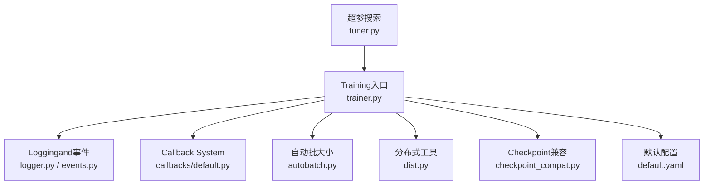
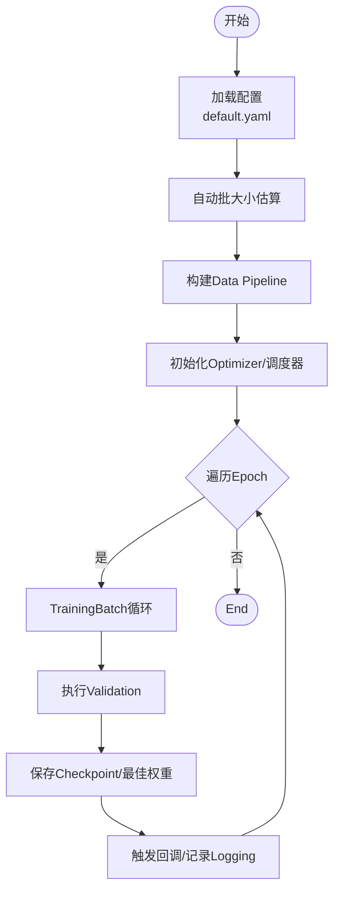
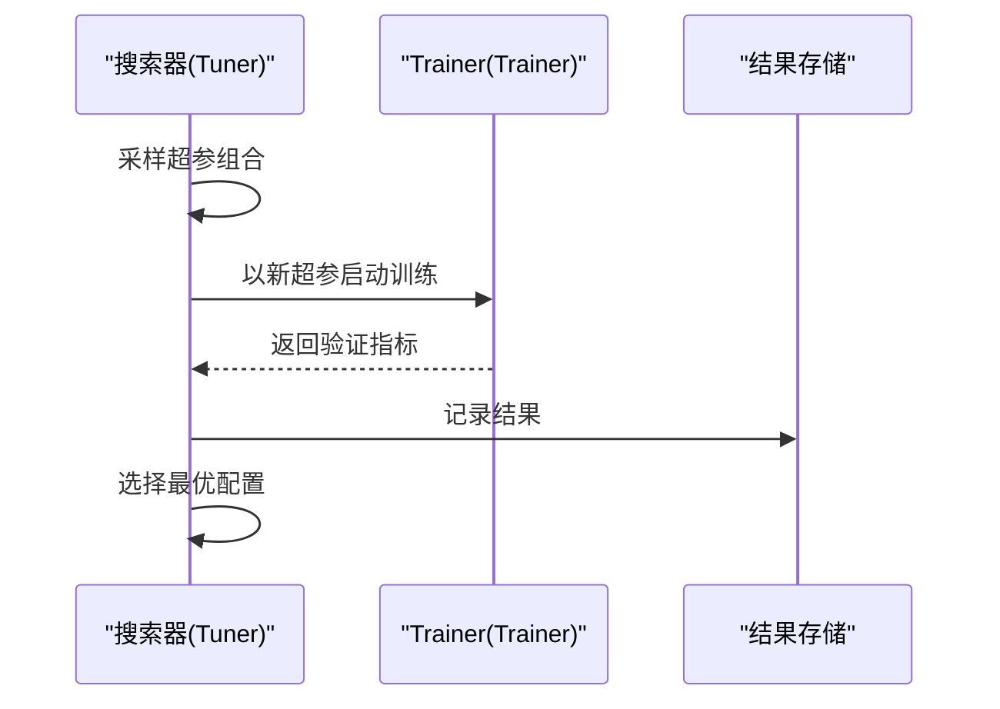
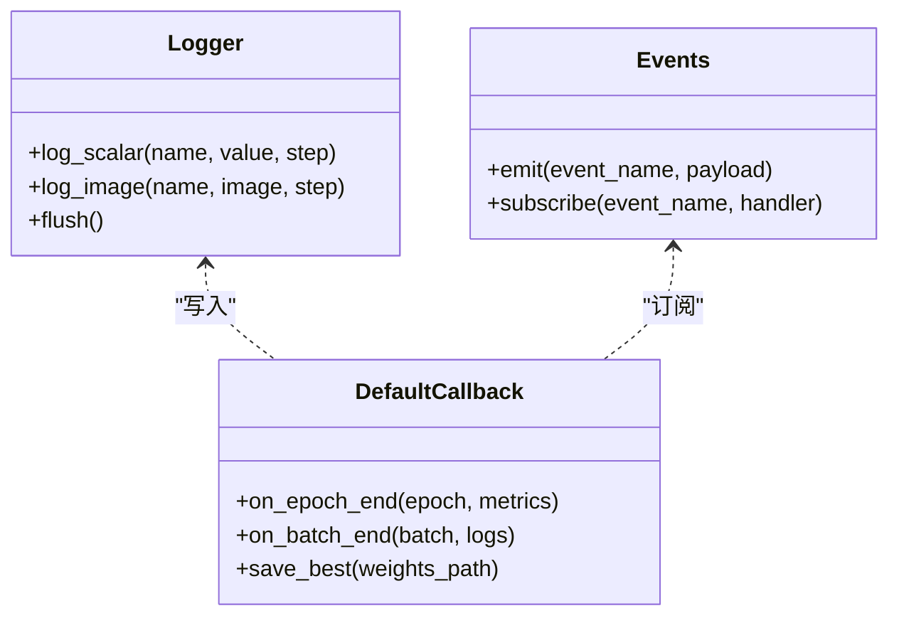
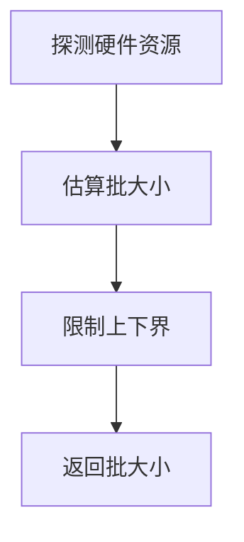
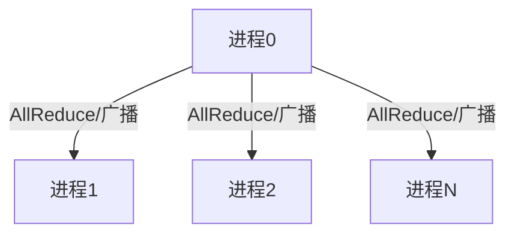
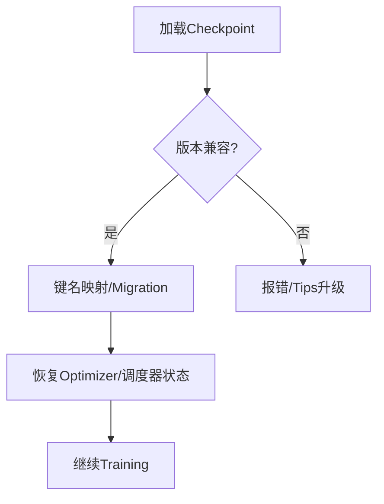
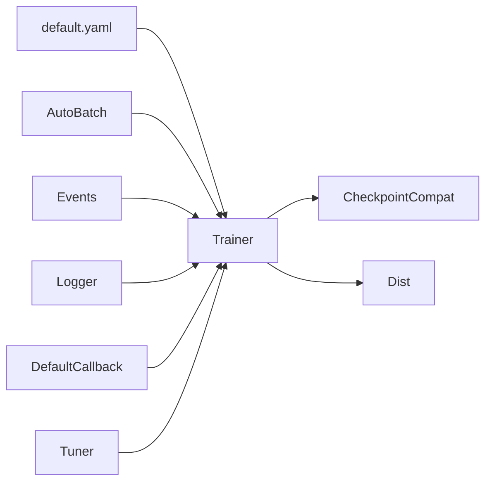

# Model Training Guide

<cite>
**Files Referenced in This Document**
- [ultralytics/engine/trainer.py](file://ultralytics/engine/trainer.py)
- [ultralytics/engine/tuner.py](file://ultralytics/engine/tuner.py)
- [ultralytics/utils/logger.py](file://ultralytics/utils/logger.py)
- [ultralytics/utils/events.py](file://ultralytics/utils/events.py)
- [ultralytics/utils/callbacks/default.py](file://ultralytics/utils/callbacks/default.py)
- [ultralytics/utils/autobatch.py](file://ultralytics/utils/autobatch.py)
- [ultralytics/utils/dist.py](file://ultralytics/utils/dist.py)
- [ultralytics/utils/checkpoint_compat.py](file://ultralytics/utils/checkpoint_compat.py)
- [ultralytics/cfg/default.yaml](file://ultralytics/cfg/default.yaml)
- [examples/YOLOv8-LibTorch-CPP-Inference/main.cc](file://examples/YOLOv8-LibTorch-CPP-Inference/main.cc)
</cite>

## Table of Contents
1. [Introduction](#Introduction)
2. [Project Structure](#Project Structure)
3. [Core Components](#Core Components)
4. [Architecture Overview](#Architecture Overview)
5. [Detailed Component Analysis](#Detailed Component Analysis)
6. [Dependency Analysis](#Dependency Analysis)
7. [Performance Considerations](#Performance Considerations)
8. [Troubleshooting Guide](#Troubleshooting Guide)
9. [Conclusion](#Conclusion)
10. [Appendix](#Appendix)

## Introduction
本指南targeting希望系统掌握 YOLO-Master 模型Training全流程的EngineersandResearchers，覆盖Training Configuration、超参数调优策略、分布式and多GPU最佳实践、监控andLogging（含TensorBoard集成）、早停andCheckpoint管理、中断恢复、消融实验设计and结果分析，Centered onandTraining过程的问题诊断and性能调优技巧。DocumentationCentered on代码仓库中的实际implementingfor依据，provides可追溯的来源定位，帮助读者快速落地并高效迭代。

## Project Structure
围绕Training相关capabilities，本项目whileCentered on下Modules中provides了关键implementing：
- Training引擎and流程控制：位于 ultralytics/engine/trainer.py
- 自动超参搜索：位于 ultralytics/engine/tuner.py
- Loggingand事件记录：位于 ultralytics/utils/logger.py、ultralytics/utils/events.py
- 回调机制（含默认回调）：位于 ultralytics/utils/callbacks/default.py
- 自动批大小选择：位于 ultralytics/utils/autobatch.py
- 分布式通信工具：位于 ultrynamics/utils/dist.py
- Checkpoint兼容andMigration：位于 ultralytics/utils/checkpoint_compat.py
- 默认Training Configuration：位于 ultralytics/cfg/default.yaml
- ExamplesInference入口（辅助理解Export/部署链路）：examples/YOLOv8-LibTorch-CPP-Inference/main.cc



Figure Source
- [ultralytics/engine/trainer.py](file://ultralytics/engine/trainer.py)
- [ultralytics/utils/logger.py](file://ultralytics/utils/logger.py)
- [ultralytics/utils/events.py](file://ultralytics/utils/events.py)
- [ultralytics/utils/callbacks/default.py](file://ultralytics/utils/callbacks/default.py)
- [ultralytics/utils/autobatch.py](file://ultralytics/utils/autobatch.py)
- [ultralytics/utils/dist.py](file://ultralytics/utils/dist.py)
- [ultralytics/utils/checkpoint_compat.py](file://ultralytics/utils/checkpoint_compat.py)
- [ultralytics/cfg/default.yaml](file://ultralytics/cfg/default.yaml)
- [ultralytics/engine/tuner.py](file://ultralytics/engine/tuner.py)

Section Source
- [ultralytics/engine/trainer.py](file://ultralytics/engine/trainer.py)
- [ultralytics/engine/tuner.py](file://ultralytics/engine/tuner.py)
- [ultralytics/utils/logger.py](file://ultralytics/utils/logger.py)
- [ultralytics/utils/events.py](file://ultralytics/utils/events.py)
- [ultralytics/utils/callbacks/default.py](file://ultralytics/utils/callbacks/default.py)
- [ultralytics/utils/autobatch.py](file://ultralytics/utils/autobatch.py)
- [ultralytics/utils/dist.py](file://ultralytics/utils/dist.py)
- [ultralytics/utils/checkpoint_compat.py](file://ultralytics/utils/checkpoint_compat.py)
- [ultralytics/cfg/default.yaml](file://ultralytics/cfg/default.yaml)

## Core Components
- Trainer（Trainer）
  - 负责加载配置、构建Data Pipeline、初始化OptimizerandLearning Rate调度器、执行Training循环、Validation、保存Checkpoint、触发回调and记录事件。
  - 典型职责包括：解析 default.yaml 或Tasks特定配置；根据设备and显存自适应批大小；管理分布式环境；处理异常and恢复。
- 超参搜索器（Tuner）
  - 基于 Trainer Encapsulates自动化搜索流程，Supporting网格/随机/贝叶斯etc.策略（具体由implementing决定），输出最优配置and对应Metrics。
- Loggingand事件系统
  - Logger 统一写入控制台、文件and第三方Visualization后端（such as TensorBoard）。
  - Events 定义Training生命周期事件（epoch/batch 开始/End、Validation、保存etc.），供回调订阅。
- Callback System
  - Default Callback provides默认行for：打印进度、保存最佳权重、记录曲线、生成报告etc.。
- 自动批大小（AutoBatch）
  - 依据硬件资源估算最大可用 batch size，避免 OOM 并提升吞吐。
- 分布式工具（Dist）
  - Encapsulates进程间通信、同步、广播、归约etc.操作，支撑多卡/多机Training。
- Checkpoint兼容（Checkpoint Compat）
  - provides旧版本权重格式to新版本的兼容映射andMigration逻辑，保障断点续训and跨版本复用。
- 默认配置（Default YAML）
  - 集中定义数据集路径、模型结构、Training超参、增强策略、Optimizerand调度器etc.。

Section Source
- [ultralytics/engine/trainer.py](file://ultralytics/engine/trainer.py)
- [ultralytics/engine/tuner.py](file://ultralytics/engine/tuner.py)
- [ultralytics/utils/logger.py](file://ultralytics/utils/logger.py)
- [ultralytics/utils/events.py](file://ultralytics/utils/events.py)
- [ultralytics/utils/callbacks/default.py](file://ultralytics/utils/callbacks/default.py)
- [ultralytics/utils/autobatch.py](file://ultralytics/utils/autobatch.py)
- [ultralytics/utils/dist.py](file://ultralytics/utils/dist.py)
- [ultralytics/utils/checkpoint_compat.py](file://ultralytics/utils/checkpoint_compat.py)
- [ultralytics/cfg/default.yaml](file://ultralytics/cfg/default.yaml)

## Architecture Overview
下图展示了Training主流程的关键交互：从配置加载toTraining循环、Validation、Checkpoint保存andLogging，Centered onand分布式and自动批大小的参and。

```mermaid
sequenceDiagram
participant U as "User脚本"
participant T as "Trainer(Trainer)"
participant CFG as "配置(default.yaml)"
participant AB as "自动批大小(AutoBatch)"
participant DS as "Data Pipeline"
participant OPT as "Optimizer/调度器"
participant VAL as "Validator"
participant CKPT as "Checkpoint/兼容层"
participant LOG as "Logging/事件"
participant CB as "回调(Default)"
participant DIST as "分布式(Dist)"
U->>T : 启动训练
T->>CFG : 读取训练配置
T->>AB : 估算批大小
AB-->>T : 返回批大小
T->>DS : 构建数据集/加载器
T->>OPT : 初始化优化器与调度器
loop 每个Epoch
T->>DIST : 同步/广播必要状态
T->>LOG : 触发 epoch_start 事件
loop 每个Batch
T->>LOG : 触发 batch_start 事件
T->>DS : 获取批次数据
T->>OPT : 前向/反向/更新
T->>LOG : 触发 batch_end 事件
end
T->>VAL : 执行验证
VAL-->>T : 返回指标
T->>CKPT : 保存检查点/最佳权重
T->>CB : 调用 on_epoch_end 回调
T->>LOG : 触发 epoch_end 事件
end
T->>LOG : 触发 train_end 事件
```

Figure Source
- [ultralytics/engine/trainer.py](file://ultralytics/engine/trainer.py)
- [ultralytics/utils/autobatch.py](file://ultralytics/utils/autobatch.py)
- [ultralytics/utils/events.py](file://ultralytics/utils/events.py)
- [ultralytics/utils/logger.py](file://ultralytics/utils/logger.py)
- [ultralytics/utils/callbacks/default.py](file://ultralytics/utils/callbacks/default.py)
- [ultralytics/utils/dist.py](file://ultralytics/utils/dist.py)
- [ultralytics/utils/checkpoint_compat.py](file://ultralytics/utils/checkpoint_compat.py)
- [ultralytics/cfg/default.yaml](file://ultralytics/cfg/default.yaml)

## Detailed Component Analysis

### Trainer（Trainer）andTraining流程
- 配置解析and合并
  - 从 default.yaml 或Tasks配置文件加载参数，合并运行时覆盖项。
- 数据and批大小
  - Via AutoBatch 估算最大批大小，CombiningData Loading器进行并行and缓存。
- OptimizerandLearning Rate调度
  - 根据配置创建Optimizerand调度器，Supporting余弦退火、线性预热etc.常见策略。
- Training循环andValidation
  - 按 Epoch/Batch 推进，周期性执行Validation并记录Metrics。
- Checkpointand恢复
  - 定期保存Checkpoint，Supporting断点续训and跨版本兼容。
- Distributed Training
  - Uses Dist 进行进程间同步、Gradient归约and广播。
- 回调andLogging
  - Via事件drivers are installed回调，默认回调负责保存最佳权重、绘制曲线、生成报告etc.。



Figure Source
- [ultralytics/engine/trainer.py](file://ultralytics/engine/trainer.py)
- [ultralytics/utils/autobatch.py](file://ultralytics/utils/autobatch.py)
- [ultralytics/cfg/default.yaml](file://ultralytics/cfg/default.yaml)

Section Source
- [ultralytics/engine/trainer.py](file://ultralytics/engine/trainer.py)
- [ultralytics/utils/autobatch.py](file://ultralytics/utils/autobatch.py)
- [ultralytics/cfg/default.yaml](file://ultralytics/cfg/default.yaml)

### 超参搜索器（Tuner）
- 目标
  - while给定搜索空间内自动Evaluation不同超参组合，输出最优配置andMetrics。
- 工作流
  - 读取基础配置 -> 采样超参 -> Calls Trainer 执行Training -> 收集Metrics -> 选择最优。
- Applicable Scenarios
  - Learning Rate、批量大小、Optimizer参数、正则化强度、Data Augmentation强度etc.。



Figure Source
- [ultralytics/engine/tuner.py](file://ultralytics/engine/tuner.py)
- [ultralytics/engine/trainer.py](file://ultralytics/engine/trainer.py)

Section Source
- [ultralytics/engine/tuner.py](file://ultralytics/engine/tuner.py)
- [ultralytics/engine/trainer.py](file://ultralytics/engine/trainer.py)

### Loggingand事件系统（Logger + Events）
- 事件类型
  - Training阶段事件：epoch_start、batch_start、batch_end、epoch_end、train_end etc.。
  - Validation事件：val_start、val_end、metrics etc.。
- Logging输出
  - 控制台、本地文件、第三方后端（such as TensorBoard）。
- 回调订阅
  - 默认回调订阅关键事件，完成保存、绘图、统计etc.。



Figure Source
- [ultralytics/utils/logger.py](file://ultralytics/utils/logger.py)
- [ultralytics/utils/events.py](file://ultralytics/utils/events.py)
- [ultralytics/utils/callbacks/default.py](file://ultralytics/utils/callbacks/default.py)

Section Source
- [ultralytics/utils/logger.py](file://ultralytics/utils/logger.py)
- [ultralytics/utils/events.py](file://ultralytics/utils/events.py)
- [ultralytics/utils/callbacks/default.py](file://ultralytics/utils/callbacks/default.py)

### 自动批大小（AutoBatch）
- 原理
  - 探测设备显存/内存，估算最大可容纳批大小，避免 OOM。
- Uses方式
  - Trainerwhile初始化阶段Calls，返回适合当前硬件的批大小。
- 注意事项
  - 若自定义Data Augmentation较重，建议保守设置上限或手动指定批大小。



Figure Source
- [ultralytics/utils/autobatch.py](file://ultralytics/utils/autobatch.py)

Section Source
- [ultralytics/utils/autobatch.py](file://ultralytics/utils/autobatch.py)

### Distributed Training（Dist）
- 功能
  - 进程间通信、Gradient同步、广播、归约、屏障etc.待etc.。
- Uses要点
  - 确保各进程正确初始化；Set appropriately全局批大小and每卡批大小；注意数据划分and洗牌。
- 常见问题
  - 进程死锁、NCCL 错误、显存不均衡etc.。



Figure Source
- [ultralytics/utils/dist.py](file://ultralytics/utils/dist.py)

Section Source
- [ultralytics/utils/dist.py](file://ultralytics/utils/dist.py)

### Checkpoint兼容and恢复（Checkpoint Compat）
- 兼容性
  - provides新旧权重格式映射，Supporting跨版本加载。
- 恢复Training
  - 从最近Checkpoint或指定步数恢复，继续Optimizer状态andTraining进度。
- 最佳权重
  - 根据ValidationMetrics保存最佳权重，便于后续Inference或Migration。



Figure Source
- [ultralytics/utils/checkpoint_compat.py](file://ultralytics/utils/checkpoint_compat.py)

Section Source
- [ultralytics/utils/checkpoint_compat.py](file://ultralytics/utils/checkpoint_compat.py)

### 默认配置（Default YAML）
- 内容范围
  - 数据集路径、类别信息、输入尺寸、模型结构、Training超参（Learning Rate、批量大小、Optimizer、调度器）、Data Augmentation、Validation频率、保存策略etc.。
- Uses建议
  - Centered on default.yaml for基线，针对Tasks微调；将Tasks特定参数放入独立配置文件并Via命令行覆盖。

Section Source
- [ultralytics/cfg/default.yaml](file://ultralytics/cfg/default.yaml)

### ExamplesInference入口（辅助理解Export/部署链路）
- 作用
  - 展示such as何加载Export后的模型并进行Inference，有助于理解Training后模型的部署路径。
- 关联
  - Training产出的权重/Export模型可用于该入口进行Validation。

Section Source
- [examples/YOLOv8-LibTorch-CPP-Inference/main.cc](file://examples/YOLOv8-LibTorch-CPP-Inference/main.cc)

## Dependency Analysis
- 耦合关系
  - Trainer 强依赖配置、事件、Logging、回调、自动批大小and分布式工具。
  - Tuner 依赖 Trainer 作for黑盒执行单元。
  - Logger/Events 被 Trainer and回调广泛Uses。
- 外部集成
  - 可Via Logger 接入 TensorBoard etc.第三方Visualization工具。
  - 分布式依赖底层通信库（such as NCCL）。



Figure Source
- [ultralytics/engine/trainer.py](file://ultralytics/engine/trainer.py)
- [ultralytics/engine/tuner.py](file://ultralytics/engine/tuner.py)
- [ultralytics/utils/autobatch.py](file://ultralytics/utils/autobatch.py)
- [ultralytics/utils/events.py](file://ultralytics/utils/events.py)
- [ultralytics/utils/logger.py](file://ultralytics/utils/logger.py)
- [ultralytics/utils/callbacks/default.py](file://ultralytics/utils/callbacks/default.py)
- [ultralytics/utils/checkpoint_compat.py](file://ultralytics/utils/checkpoint_compat.py)
- [ultralytics/utils/dist.py](file://ultralytics/utils/dist.py)
- [ultralytics/cfg/default.yaml](file://ultralytics/cfg/default.yaml)

Section Source
- [ultralytics/engine/trainer.py](file://ultralytics/engine/trainer.py)
- [ultralytics/engine/tuner.py](file://ultralytics/engine/tuner.py)
- [ultralytics/utils/autobatch.py](file://ultralytics/utils/autobatch.py)
- [ultralytics/utils/events.py](file://ultralytics/utils/events.py)
- [ultralytics/utils/logger.py](file://ultralytics/utils/logger.py)
- [ultralytics/utils/callbacks/default.py](file://ultralytics/utils/callbacks/default.py)
- [ultralytics/utils/checkpoint_compat.py](file://ultralytics/utils/checkpoint_compat.py)
- [ultralytics/utils/dist.py](file://ultralytics/utils/dist.py)
- [ultralytics/cfg/default.yaml](file://ultralytics/cfg/default.yaml)

## Performance Considerations
- 批大小and吞吐
  - Prefer AutoBatch 估算，再根据 GPU 利用率and显存占用微调。
- Data Pipeline
  - 启用预取and多线程加载，减少 I/O bottlenecks；对大图像采用分块或缩放策略。
- Mixture精度
  - 开启半精度TrainingCentered on提升吞吐and降低显存占用（需关注数值稳定性）。
- 分布式
  - Set appropriately全局批大小and每卡批大小；确保网络带宽and通信开销可控。
- Validation频率
  - 平衡Validation成本and监控粒度，避免频繁Validation拖慢Training。
- Checkpoint策略
  - 仅保存最佳权重and必要间隔的Checkpoint，节省磁盘andIO压力。

[本节for通用指导，无需源码引用]

## Troubleshooting Guide
- Training崩溃and异常
  - 查看Loggingand事件记录，定位失败阶段（Data Loading、前向、反向、Validation、保存）。
  - 检查分布式通信错误（such as NCCL 问题）and进程状态。
- 显存不足（OOM）
  - 降低批大小、关闭不必要的增强、启用Mixture精度、减小输入分辨率。
- 收敛缓慢或不稳定
  - 调整Learning Rateand调度器；检查数据质量and标签一致性；适当增加预热步数。
- Checkpoint无法恢复
  - 确认Checkpoint版本兼容性，必要时Uses兼容层进行Migration。
- Metrics异常
  - 核对Validation集划分andMetrics计算逻辑；检查回调是否正确保存最佳权重。

Section Source
- [ultralytics/utils/logger.py](file://ultralytics/utils/logger.py)
- [ultralytics/utils/events.py](file://ultralytics/utils/events.py)
- [ultralytics/utils/callbacks/default.py](file://ultralytics/utils/callbacks/default.py)
- [ultralytics/utils/dist.py](file://ultralytics/utils/dist.py)
- [ultralytics/utils/checkpoint_compat.py](file://ultralytics/utils/checkpoint_compat.py)

## Conclusion
YOLO-Master 的Training体系Centered on Trainer for核心，Combined with事件drivers are installed的Loggingand回调、自动批大小and分布式工具，形成可扩展、可观测、易恢复的Training平台。Via默认配置and超参搜索器，User可Centered on快速上手并系统化地进行超参调优。建议while真实Tasks中Combining监控and消融实验，持续迭代Centered on获得更稳健的性能。

[本节for总结性内容，无需源码引用]

## Appendix

### Training Configuration文件结构and参数含义（基于 default.yaml）
- 数据集andTasks
  - 数据集根路径、类别列表、Training/Validation集划分、输入尺寸etc.。
- 模型and结构
  - 模型名称/路径、骨干and头结构、通道数、深度/宽度系数etc.。
- Training超参
  - Learning Rate、批量大小、Optimizer类型and参数、Learning Rate调度器、权重衰减、动量etc.。
- Data Augmentation
  - 几何变换、色彩抖动、MixUp/Copy-Paste、Mosaic etc.开关and强度。
- Validationand保存
  - Validation频率、保存间隔、最佳权重保存策略、Checkpoint保留数量。
- LoggingandVisualization
  - Logging级别、是否启用 TensorBoard、输出Table of Contentsetc.。
- 分布式and环境
  - 进程数、Device Selection、通信后端、NCCL 相关参数etc.。

Section Source
- [ultralytics/cfg/default.yaml](file://ultralytics/cfg/default.yaml)

### 超参数调优策略and方法
- Learning Rate调度
  - 常用策略：线性预热+余弦退火；根据Tasks规模and数据量调整预热步数and最小Learning Rate。
- 批量大小
  - 先由 AutoBatch 估算，再根据ValidationMetricsand显存占用微调；分布式时注意全局批大小and每卡批大小的比例。
- Optimizer配置
  - AdamW/SGD 的选择and权重衰减、动量参数的搭配；小数据集倾向 AdamW，大数据集 SGD 常表现更稳。
- Data Augmentation强度
  - 过强增强可能导致标签噪声放大，需CombiningTasks特性and数据质量调节。
- 自动搜索
  - Uses Tuner while合理搜索空间内进行批量Evaluation，筛选最优配置。

Section Source
- [ultralytics/engine/tuner.py](file://ultralytics/engine/tuner.py)
- [ultralytics/utils/autobatch.py](file://ultralytics/utils/autobatch.py)
- [ultralytics/cfg/default.yaml](file://ultralytics/cfg/default.yaml)

### Distributed Trainingand多GPU最佳实践
- 进程初始化
  - 确保所有进程正确初始化分布式环境，设置正确的 rank/world_size。
- 数据划分
  - Uses分布式Data Loading器，保证每个进程的数据子集无重叠且均匀分布。
- 通信and同步
  - Set appropriately AllReduce 频率，避免过多同步导致通信bottlenecks。
- 显存andLoad Balancing
  - 监控各卡显存Uses，必要时调整批大小或Gradient累积。
- 容错and恢复
  - 定期Checkpoint保存，Supporting进程失败后从最近Checkpoint恢复。

Section Source
- [ultralytics/utils/dist.py](file://ultralytics/utils/dist.py)
- [ultralytics/utils/checkpoint_compat.py](file://ultralytics/utils/checkpoint_compat.py)

### 监控andLogging（含 TensorBoard 集成）
- 事件订阅
  - while关键阶段（epoch/batch/Validation）记录标量and图像，便于Visualization。
- TensorBoard 集成
  - Via Logger 将Metrics写入 TensorBoard，观察损失、Metrics随步数变化趋势。
- 报告生成
  - 默认回调可whileTrainingEnd后生成汇总报告，便于对比and归档。

Section Source
- [ultralytics/utils/logger.py](file://ultralytics/utils/logger.py)
- [ultralytics/utils/events.py](file://ultralytics/utils/events.py)
- [ultralytics/utils/callbacks/default.py](file://ultralytics/utils/callbacks/default.py)

### 早停机制、Checkpoint管理and中断恢复
- 早停
  - 基于ValidationMetrics（such as mAP）设定耐心值，当Metrics长时间不提升则停止Training。
- Checkpoint管理
  - 保存最佳权重and最近 N 个Checkpoint，避免磁盘膨胀。
- 中断恢复
  - 从最近Checkpoint恢复Training状态（Optimizer/调度器/随机种子），继续Training直至收敛。

Section Source
- [ultralytics/utils/callbacks/default.py](file://ultralytics/utils/callbacks/default.py)
- [ultralytics/utils/checkpoint_compat.py](file://ultralytics/utils/checkpoint_compat.py)

### 消融实验设计and结果分析方法
- 设计原则
  - 每次仅改变一个变量（such asLearning Rate、增强强度、MoE routing strategies），保持其他条件一致。
- Metrics选择
  - 主要Metrics（mAP、召回率、精确率）and效率Metrics（吞吐、延迟、显存占用）。
- 结果呈现
  - Uses表格and曲线图对比不同配置下的表现，标注显著差异。
- 复现and归档
  - 记录完整配置and随机种子，确保结果可复现。

[本节for方法论指导，无需源码引用]

### Training过程问题诊断and性能调优技巧
- 诊断步骤
  - 查看Loggingand事件，定位失败阶段；检查Data Loadingand预处理；Validation分布式通信。
- 性能调优
  - 调整批大小and数据并行度；启用Mixture精度；Optimization I/O and缓存；减少不必要的LoggingandVisualization。
- 稳定性提升
  - Gradient裁剪、数值稳定化、Learning Rate预热and回退策略。

Section Source
- [ultralytics/utils/logger.py](file://ultralytics/utils/logger.py)
- [ultralytics/utils/events.py](file://ultralytics/utils/events.py)
- [ultralytics/utils/autobatch.py](file://ultralytics/utils/autobatch.py)
- [ultralytics/utils/dist.py](file://ultralytics/utils/dist.py)