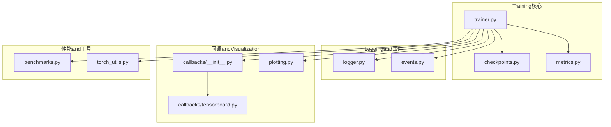
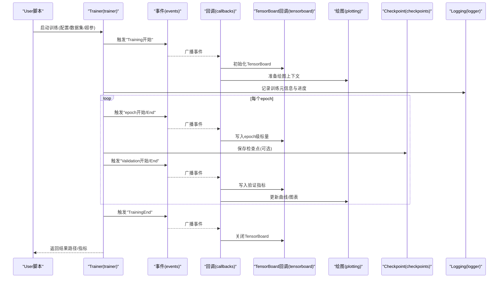
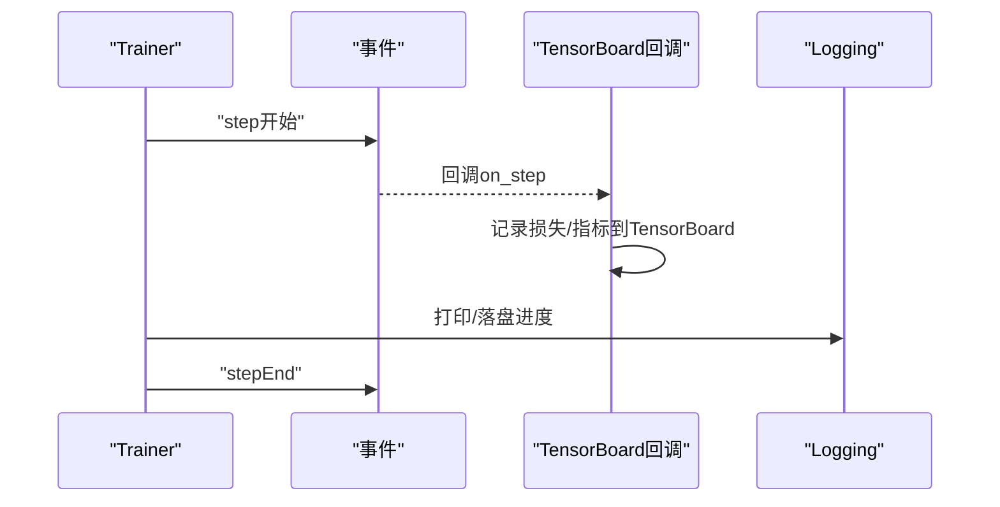
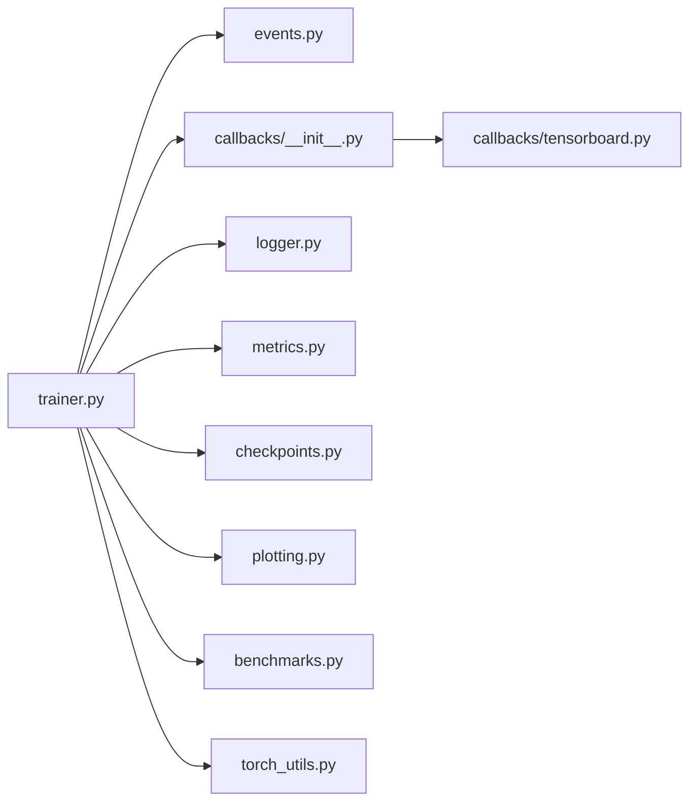

# 监控andLogging

<cite>
**Files Referenced in This Document**
- [ultralytics/utils/logger.py](file://ultralytics/utils/logger.py)
- [ultralytics/utils/events.py](file://ultralytics/utils/events.py)
- [ultralytics/engine/trainer.py](file://ultralytics/engine/trainer.py)
- [ultralytics/utils/callbacks/__init__.py](file://ultralytics/utils/callbacks/__init__.py)
- [ultralytics/utils/callbacks/tensorboard.py](file://ultralytics/utils/callbacks/tensorboard.py)
- [ultralytics/utils/plotting.py](file://ultralytics/utils/plotting.py)
- [ultralytics/utils/benchmarks.py](file://ultralytics/utils/benchmarks.py)
- [ultralytics/utils/checkpoints.py](file://ultralytics/utils/checkpoints.py)
- [ultralytics/utils/metrics.py](file://ultralytics/utils/metrics.py)
- [ultralytics/utils/torch_utils.py](file://ultralytics/utils/torch_utils.py)
- [examples/YOLOv8-ONNXRuntime-Python/main.py](file://examples/YOLOv8-ONNXRuntime-Python/main.py)
</cite>

## Table of Contents
1. [Introduction](#Introduction)
2. [Project Structure](#Project Structure)
3. [Core Components](#Core Components)
4. [Architecture Overview](#Architecture Overview)
5. [Detailed Component Analysis](#Detailed Component Analysis)
6. [Dependency Analysis](#Dependency Analysis)
7. [Performance Considerations](#Performance Considerations)
8. [Troubleshooting Guide](#Troubleshooting Guide)
9. [Conclusion](#Conclusion)
10. [Appendix](#Appendix)

## Introduction
本指南聚焦于YOLO-Master的Training监控andLogging，覆盖Centered on下主题：
- TensorBoard集成andVisualization方法
- Training曲线分析and解读（Loss Function变化、Metrics趋势）
- 性能监控工具and方法（GPU利用率、内存Uses、Training速度）
- 自定义回调函数的开发andTraining过程干预
- Logging格式规范and调试信息提取方法

目标是帮助读者whileTraining过程中高效观测模型收敛、定位问题并Optimization性能。

## Project Structure
and“监控andLogging”相关的代码主要分布whileCentered on下Modules：
- Loggingand事件系统：logger、events
- Training主循环：trainer
- 回调机制：callbacks（含TensorBoard回调）
- 绘图andVisualization：plotting
- 基准测试and性能统计：benchmarks
- CheckpointandMetrics：checkpoints、metrics
- 设备and张量工具：torch_utils

Figure Source
- [ultralytics/engine/trainer.py](file://ultralytics/engine/trainer.py)
- [ultralytics/utils/logger.py](file://ultralytics/utils/logger.py)
- [ultralytics/utils/events.py](file://ultralytics/utils/events.py)
- [ultralytics/utils/callbacks/__init__.py](file://ultralytics/utils/callbacks/__init__.py)
- [ultralytics/utils/callbacks/tensorboard.py](file://ultralytics/utils/callbacks/tensorboard.py)
- [ultralytics/utils/plotting.py](file://ultralytics/utils/plotting.py)
- [ultralytics/utils/benchmarks.py](file://ultralytics/utils/benchmarks.py)
- [ultralytics/utils/checkpoints.py](file://ultralytics/utils/checkpoints.py)
- [ultralytics/utils/metrics.py](file://ultralytics/utils/metrics.py)
- [ultralytics/utils/torch_utils.py](file://ultralytics/utils/torch_utils.py)

Section Source
- [ultralytics/engine/trainer.py](file://ultralytics/engine/trainer.py)
- [ultralytics/utils/logger.py](file://ultralytics/utils/logger.py)
- [ultralytics/utils/events.py](file://ultralytics/utils/events.py)
- [ultralytics/utils/callbacks/__init__.py](file://ultralytics/utils/callbacks/__init__.py)
- [ultralytics/utils/callbacks/tensorboard.py](file://ultralytics/utils/callbacks/tensorboard.py)
- [ultralytics/utils/plotting.py](file://ultralytics/utils/plotting.py)
- [ultralytics/utils/benchmarks.py](file://ultralytics/utils/benchmarks.py)
- [ultralytics/utils/checkpoints.py](file://ultralytics/utils/checkpoints.py)
- [ultralytics/utils/metrics.py](file://ultralytics/utils/metrics.py)
- [ultralytics/utils/torch_utils.py](file://ultralytics/utils/torch_utils.py)

## Core Components
- Logging器（logger）：统一输出控制台and文件Logging，provides结构化字段（such as阶段、步数、时间戳etc.），便于检索and分析。
- 事件系统（events）：定义Training生命周期事件（开始、End、每步、每轮Validationetc.），供回调订阅。
- Trainer（trainer）：drivers are installedTraining主循环，按阶段触发事件、记录Metrics、保存Checkpoint、Calls回调。
- 回调框架（callbacks）：解耦Training流程and横切关注点（such asTensorBoard写入、进度条、早停etc.）。
- TensorBoard回调（tensorboard）：将标量、图像、直方图、参数分布etc.写入TensorBoard。
- 绘图（plotting）：生成Training曲线、混淆矩阵、PR曲线etc.静态图或交互式图。
- 基准测试（benchmarks）：EvaluationInference速度and资源占用，辅助性能调优。
- Checkpoint（checkpoints）：保存/恢复权重and元数据，Supporting断点续训and最佳模型选择。
- Metrics（metrics）：计算mAP、精度、召回率、F1and other tasks相关Metrics。
- 设备工具（torch_utils）：EncapsulatesGPU/CPU设备查询、显存统计、AMPetc.工具。

Section Source
- [ultralytics/utils/logger.py](file://ultralytics/utils/logger.py)
- [ultralytics/utils/events.py](file://ultralytics/utils/events.py)
- [ultralytics/engine/trainer.py](file://ultralytics/engine/trainer.py)
- [ultralytics/utils/callbacks/__init__.py](file://ultralytics/utils/callbacks/__init__.py)
- [ultralytics/utils/callbacks/tensorboard.py](file://ultralytics/utils/callbacks/tensorboard.py)
- [ultralytics/utils/plotting.py](file://ultralytics/utils/plotting.py)
- [ultralytics/utils/benchmarks.py](file://ultralytics/utils/benchmarks.py)
- [ultralytics/utils/checkpoints.py](file://ultralytics/utils/checkpoints.py)
- [ultralytics/utils/metrics.py](file://ultralytics/utils/metrics.py)
- [ultralytics/utils/torch_utils.py](file://ultralytics/utils/torch_utils.py)

## Architecture Overview
下图展示了Training过程中的关键交互：TrainerVia事件系统分发信号，回调订阅事件并执行具体动作（such as写入TensorBoard、绘制曲线、保存Checkpointetc.）。

Figure Source
- [ultralytics/engine/trainer.py](file://ultralytics/engine/trainer.py)
- [ultralytics/utils/events.py](file://ultralytics/utils/events.py)
- [ultralytics/utils/callbacks/__init__.py](file://ultralytics/utils/callbacks/__init__.py)
- [ultralytics/utils/callbacks/tensorboard.py](file://ultralytics/utils/callbacks/tensorboard.py)
- [ultralytics/utils/plotting.py](file://ultralytics/utils/plotting.py)
- [ultralytics/utils/checkpoints.py](file://ultralytics/utils/checkpoints.py)
- [ultralytics/utils/logger.py](file://ultralytics/utils/logger.py)

## Detailed Component Analysis

### Logging系统and事件总线
- Logging器负责统一格式化输出，包含时间戳、级别、来源、上下文键值对；建议for每条关键Logging携带可检索的键（such as实验名、数据集、Batch Size、Learning Rateetc.）。
- 事件总线定义Training生命周期钩子，避免whileTrainer中硬编码副作用逻辑，提升可Extensibility。

Section Source
- [ultralytics/utils/logger.py](file://ultralytics/utils/logger.py)
- [ultralytics/utils/events.py](file://ultralytics/utils/events.py)

### Trainerand回调框架
- Trainer组织Data Loading、Forward/Backward Propagation、Optimizer步进、Validationand保存etc.步骤，并while关键节点触发事件。
- 回调框架Centered on插件方式接入，典型回调包括：TensorBoard写入、进度显示、模型保存、早停、Learning Rate调度etc.。

Section Source
- [ultralytics/engine/trainer.py](file://ultralytics/engine/trainer.py)
- [ultralytics/utils/callbacks/__init__.py](file://ultralytics/utils/callbacks/__init__.py)

### TensorBoard集成andVisualization
- TensorBoard回调whileTraining开始时初始化Writer，while每步/每轮Validation时写入标量（损失、Metrics）、图像（Prediction框、热力图etc.）、直方图（权重/Gradient分布）etc.。
- 建议while回调中合理控制写入频率，避免I/Obottlenecks；同时确保不同运行Uses独立LoggingTable of Contents，防止冲突。

Section Source
- [ultralytics/utils/callbacks/tensorboard.py](file://ultralytics/utils/callbacks/tensorboard.py)

#### Training期写入时序（Examples）

Figure Source
- [ultralytics/engine/trainer.py](file://ultralytics/engine/trainer.py)
- [ultralytics/utils/events.py](file://ultralytics/utils/events.py)
- [ultralytics/utils/callbacks/tensorboard.py](file://ultralytics/utils/callbacks/tensorboard.py)
- [ultralytics/utils/logger.py](file://ultralytics/utils/logger.py)

### Training曲线分析and解读
- 损失曲线：观察整体下降趋势and震荡幅度，CombiningLearning Rate策略判断是否过拟合或欠拟合。
- Metrics趋势：such asmAP@0.5、mAP@0.5:0.95、Precision、Recall、F1etc.，关注Validation集Metrics是否稳定上升或出现拐点。
- 对比多组实验：while同一TensorBoard面板叠加多条曲线，比较不同超参/Data Augmentation/模型变体的效果。

Section Source
- [ultralytics/utils/plotting.py](file://ultralytics/utils/plotting.py)
- [ultralytics/utils/metrics.py](file://ultralytics/utils/metrics.py)

### 性能监控工具and方法
- GPU利用率and显存：Via设备工具获取当前设备、显存占用、峰值显存etc.信息，可while回调中周期性采样并记录。
- Training速度：统计每步/每轮耗时，Combining批大小、Data Loading效率分析bottlenecks。
- 基准测试：Uses基准Modules进行Inference延迟and吞吐Evaluation，辅助Exportand部署前的性能基线建立。

Section Source
- [ultralytics/utils/torch_utils.py](file://ultralytics/utils/torch_utils.py)
- [ultralytics/utils/benchmarks.py](file://ultralytics/utils/benchmarks.py)

### 自定义回调andTraining干预
- 开发自定义回调需遵循回调接口约定，订阅相应事件（such asepoch开始/End、Validation后、保存前etc.），implementing所需逻辑（such as动态调整超参、条件早停、额外Metrics记录）。
- 建议while回调中避免阻塞性操作，必要时异步或降低写入频率，保证Training稳定性。

Section Source
- [ultralytics/utils/callbacks/__init__.py](file://ultralytics/utils/callbacks/__init__.py)
- [ultralytics/engine/trainer.py](file://ultralytics/engine/trainer.py)

### Logging格式规范and调试信息提取
- 推荐字段：时间戳、级别、来源Modules、实验标识、数据集名称、Batch Size、Learning Rate、步数/轮数、耗时、关键Metrics。
- 结构化输出：Prefer键值对形式，便于后续解析and聚合；避免纯文本长串难Centered on抽取的信息。
- 调试信息：while异常分支或关键路径插入高粒度Logging，附带必要上下文（输入形状、设备、dtype、随机种子etc.）。

Section Source
- [ultralytics/utils/logger.py](file://ultralytics/utils/logger.py)

## Dependency Analysis
- trainer强依赖eventsandcallbacks，间接依赖logger、metrics、checkpoints、plotting、benchmarks、torch_utils。
- tensorboard回调依赖eventsandlogger，并ViawriterandTensorBoard后端交互。
- plottingandmetrics用于离线分析and报告生成。

Figure Source
- [ultralytics/engine/trainer.py](file://ultralytics/engine/trainer.py)
- [ultralytics/utils/events.py](file://ultralytics/utils/events.py)
- [ultralytics/utils/callbacks/__init__.py](file://ultralytics/utils/callbacks/__init__.py)
- [ultralytics/utils/callbacks/tensorboard.py](file://ultralytics/utils/callbacks/tensorboard.py)
- [ultralytics/utils/logger.py](file://ultralytics/utils/logger.py)
- [ultralytics/utils/metrics.py](file://ultralytics/utils/metrics.py)
- [ultralytics/utils/checkpoints.py](file://ultralytics/utils/checkpoints.py)
- [ultralytics/utils/plotting.py](file://ultralytics/utils/plotting.py)
- [ultralytics/utils/benchmarks.py](file://ultralytics/utils/benchmarks.py)
- [ultralytics/utils/torch_utils.py](file://ultralytics/utils/torch_utils.py)

## Performance Considerations
- I/O节流：TensorBoard写入and绘图应控制频率，避免频繁磁盘访问影响Training速度。
- 批大小andData Loading：增大批大小可能提高吞吐但增加显存压力；OptimizationData Pipeline可减少CPUbottlenecks。
- AMPandMixture精度：合理Uses自动Mixture精度可降低显存占用并加速Training，注意数值稳定性。
- Distributed Training：while多卡环境下，确保事件andLogging写入具备进程安全，避免重复或竞争。

[This section provides general guidance and does not directly analyze specific files]

## Troubleshooting Guide
- Training中断或崩溃：查看Logging中的异常堆栈and最近一次成功保存的Checkpoint位置，确认是否因OOM、NaN损失或数据损坏导致。
- Metrics不降反升：检查Learning Rate策略、正则化强度、Data Augmentation强度and标签质量；对比Training/Validation曲线差异。
- TensorBoard无数据：确认LoggingTable of Contents正确且未被覆盖；检查回调是否被注册；确认写入频率and事件触发是否正常。
- 性能退化：采集GPU利用率、显存峰值、每步耗时，定位是计算密集还是I/Obottlenecks；尝试调整批大小、数据并行策略或启用AMP。

Section Source
- [ultralytics/utils/logger.py](file://ultralytics/utils/logger.py)
- [ultralytics/utils/callbacks/tensorboard.py](file://ultralytics/utils/callbacks/tensorboard.py)
- [ultralytics/utils/benchmarks.py](file://ultralytics/utils/benchmarks.py)
- [ultralytics/utils/torch_utils.py](file://ultralytics/utils/torch_utils.py)

## Conclusion
through a unifiedLoggingand事件系统、灵活的回调机制Centered onandTensorBoard集成，YOLO-Masterprovides了完善的Training监控andVisualizationcapabilities。Combining合理的Logging规范and性能监控手段，User可Centered on快速定位问题、Optimization超参andData Pipeline，并获得稳定的Training效果and高效的资源利用。

[This section is summary content and does not directly analyze specific files]

## Appendix
- Refer toExamples：可Refer toExamples脚本了解such as何启动Trainingand查看结果路径，Centered on便定位TensorBoardLoggingandCheckpoint。
- 常用命令：while终端启动TensorBoard并指向对应LoggingTable of Contents，即可while线查看Training曲线andVisualization结果。

Section Source
- [examples/YOLOv8-ONNXRuntime-Python/main.py](file://examples/YOLOv8-ONNXRuntime-Python/main.py)