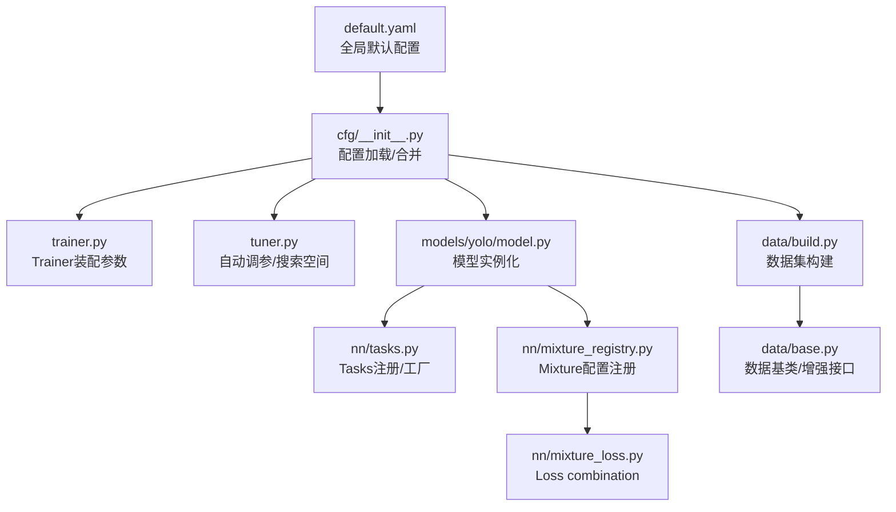
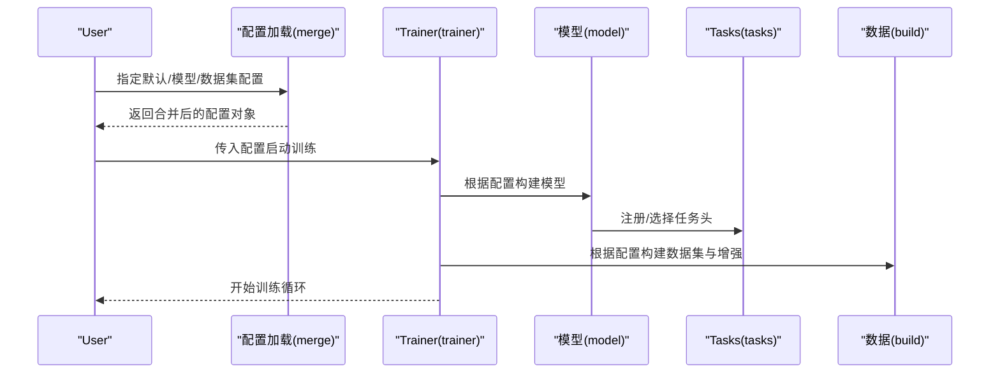
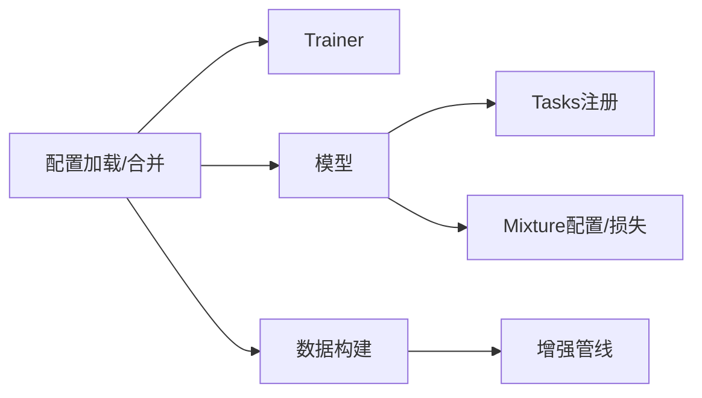

# Training Configuration管理

<cite>
**Files Referenced in This Document**
- [default.yaml](file://ultralytics/cfg/default.yaml)
- [__init__.py](file://ultralytics/cfg/__init__.py)
- [train.py](file://ultralytics/engine/trainer.py)
- [tuner.py](file://ultralytics/engine/tuner.py)
- [model.py](file://ultralytics/engine/model.py)
- [build.py](file://ultralytics/data/build.py)
- [base.py](file://ultralytics/data/base.py)
- [yolo.py](file://ultralytics/models/yolo/model.py)
- [tasks.py](file://ultralytics/nn/tasks.py)
- [mixture_registry.py](file://ultralytics/nn/mixture_registry.py)
- [mixture_loss.py](file://ultralytics/nn/mixture_loss.py)
- [test_default_config_integrity.py](file://tests/test_default_config_integrity.py)
- [test_mixture_config_resolution.py](file://tests/test_mixture_config_resolution.py)
- [test_master_model_configs.py](file://tests/test_master_model_configs.py)
</cite>

## Table of Contents
1. [Introduction](#Introduction)
2. [Project Structure](#Project Structure)
3. [Core Components](#Core Components)
4. [Architecture Overview](#Architecture Overview)
5. [Detailed Component Analysis](#Detailed Component Analysis)
6. [Dependency Analysis](#Dependency Analysis)
7. [性能考量](#性能考量)
8. [Troubleshooting Guide](#Troubleshooting Guide)
9. [Conclusion](#Conclusion)
10. [Appendix](#Appendix)

## Introduction
本文件targetingYOLO-Master的Training Configuration管理，系统性说明配置文件的结构and层次关系、默认配置and模型/数据集配置的继承机制、关键参数的含义and作用域（网络架构、Training超参、Data Augmentationetc.），并provides最佳实践and自定义配置开发指南。同时梳理配置解析andValidation流程、错误处理策略，帮助读者While maintaining可复现性的前提下高效定制Training流程。

## Project Structure
Training相关配置主要位于Centered on下位置：
- 默认全局配置：ultralytics/cfg/default.yaml
- 模型配置：ultralytics/cfg/models/*（按Tasks/系列组织）
- 数据集配置：ultralytics/cfg/datasets/*（按Tasks/数据集组织）
- 配置加载and合并逻辑：ultralytics/cfg/__init__.py
- Training入口and参数装配：ultralytics/engine/trainer.py
- 自动调参and配置搜索：ultralytics/engine/tuner.py
- 模型构建andTasks注册：ultralytics/models/yolo/model.py、ultralytics/nn/tasks.py
- Mixture专家/多Tasks配置and损失：ultralytics/nn/mixture_registry.py、ultralytics/nn/mixture_loss.py
- 数据构建and增强：ultralytics/data/build.py、ultralytics/data/base.py
- 配置完整性and解析测试：tests/test_default_config_integrity.py、tests/test_mixture_config_resolution.py、tests/test_master_model_configs.py

Figure Source
- [default.yaml](file://ultralytics/cfg/default.yaml)
- [__init__.py](file://ultralytics/cfg/__init__.py)
- [train.py](file://ultralytics/engine/trainer.py)
- [tuner.py](file://ultralytics/engine/tuner.py)
- [build.py](file://ultralytics/data/build.py)
- [base.py](file://ultralytics/data/base.py)
- [yolo.py](file://ultralytics/models/yolo/model.py)
- [tasks.py](file://ultralytics/nn/tasks.py)
- [mixture_registry.py](file://ultralytics/nn/mixture_registry.py)
- [mixture_loss.py](file://ultralytics/nn/mixture_loss.py)

Section Source
- [default.yaml](file://ultralytics/cfg/default.yaml)
- [__init__.py](file://ultralytics/cfg/__init__.py)
- [train.py](file://ultralytics/engine/trainer.py)
- [tuner.py](file://ultralytics/engine/tuner.py)
- [build.py](file://ultralytics/data/build.py)
- [base.py](file://ultralytics/data/base.py)
- [yolo.py](file://ultralytics/models/yolo/model.py)
- [tasks.py](file://ultralytics/nn/tasks.py)
- [mixture_registry.py](file://ultralytics/nn/mixture_registry.py)
- [mixture_loss.py](file://ultralytics/nn/mixture_loss.py)

## Core Components
- 默认配置中心：provides全局默认值，作for所有Tasks/模型的基准。
- 配置加载and合并：Supporting从YAML加载、字典覆盖、层级合并and引用解析。
- Trainer装配：将最终配置注入toTrainer、Optimizer、调度器、LoggingandExportModules。
- 自动调参：基于配置空间进行超参搜索，输出最优配置并回写。
- Models and Tasks注册：根据配置选择具体模型implementingandTasks头，必要时启用Mixture专家/多Taskscapabilities。
- 数据构建：依据数据集配置构建DataLoaderand增强管线。

Section Source
- [default.yaml](file://ultralytics/cfg/default.yaml)
- [__init__.py](file://ultralytics/cfg/__init__.py)
- [train.py](file://ultralytics/engine/trainer.py)
- [tuner.py](file://ultralytics/engine/tuner.py)
- [yolo.py](file://ultralytics/models/yolo/model.py)
- [tasks.py](file://ultralytics/nn/tasks.py)
- [build.py](file://ultralytics/data/build.py)

## Architecture Overview
下图展示从“配置文件”to“Training执行”的关键路径，包括默认配置、模型/数据集配置、合并策略Centered onandTrainer装配过程。

Figure Source
- [__init__.py](file://ultralytics/cfg/__init__.py)
- [train.py](file://ultralytics/engine/trainer.py)
- [yolo.py](file://ultralytics/models/yolo/model.py)
- [tasks.py](file://ultralytics/nn/tasks.py)
- [build.py](file://ultralytics/data/build.py)

## Detailed Component Analysis

### 配置加载and合并机制
- 职责
  - 读取默认配置andUserprovides的模型/数据集配置。
  - 执行深度合并（User覆盖默认）、解析相对/绝对路径、unfold引用。
  - 生成不可变或受保护的配置视图，避免运行时被意外修改。
- 关键点
  - 合并优先级：命令行 > User配置 > 模型配置 > 数据集配置 > 默认配置。
  - 类型校验and缺省补齐：对关键字段进行存while性and范围检查，缺失时回填默认值。
  - 路径规范化：统一for绝对路径，便于跨平台and分布式环境Uses。
- 建议
  - 尽量Via“最小差异”的覆盖方式定义新配置，减少重复字段。
  - 对敏感路径and外部资源Uses环境变量注入，避免硬编码。

Section Source
- [__init__.py](file://ultralytics/cfg/__init__.py)
- [default.yaml](file://ultralytics/cfg/default.yaml)

### Trainer装配and参数作用域
- 职责
  - 接收合并后的配置，初始化Trainer、Optimizer、Learning Rate调度器、Logging器、回调andExport选项。
  - 将配置分派to不同子系统（模型、数据、Evaluation、保存、Visualization）。
- 参数作用域
  - 全局：设备、精度、随机种子、Logging、保存策略etc.。
  - 模型：网络结构、Pre-trained Weights、冻结层、MoE/LoRA开关etc.。
  - 数据：输入尺寸、批大小、增强策略、缓存and并行。
  - Optimization：Learning Rate、权重衰减、动量、Gradient裁剪、早停etc.。
  - Tasks：损失权重、类别数、NMS阈值、Post-Processing选项etc.。
- 建议
  - 明确区分“可覆盖”和“固定”参数，避免while子配置中无意覆盖全局设置。
  - 对影响稳定性的参数（such aslr、warmup、ema）provides合理默认值and边界。

Section Source
- [train.py](file://ultralytics/engine/trainer.py)

### 自动调参and配置搜索
- 职责
  - 基于配置空间定义搜索范围，运行多次实验并EvaluationMetrics，输出最优配置。
- 关键点
  - 搜索空间：连续/离散/分类变量；约束条件（such asbatch_sizeand显存的关系）。
  - Evaluation协议：固定随机种子、交叉Validation、早停策略。
  - 结果持久化：将最优配置落盘，便于复现实验。
- 建议
  - 先while小规模数据上快速扫描，再while完整数据集上精调。
  - 记录每次运行的完整配置and环境信息，确保可追溯。

Section Source
- [tuner.py](file://ultralytics/engine/tuner.py)

### 模型构建andTasks注册
- 职责
  - 根据配置选择具体模型implementing，注册Tasks头，必要时启用Mixture专家或多Taskscapabilities。
- 关键点
  - TasksRegistry：Centered onTasks名映射to具体implementing，Supporting扩展。
  - Mixture配置：ViaRegistry动态组装损失androuting strategies。
- 建议
  - 新增Tasks或模型变体时，同步更新RegistryandDocumentation。
  - 对不兼容的配置组合进行前置校验，尽早失败。

Section Source
- [yolo.py](file://ultralytics/models/yolo/model.py)
- [tasks.py](file://ultralytics/nn/tasks.py)
- [mixture_registry.py](file://ultralytics/nn/mixture_registry.py)

### Mixture专家/多Tasks配置and损失
- 职责
  - 管理Mixture专家/多Tasks的配置项，动态组合Loss Function，协调路由and专家权重。
- 关键点
  - 配置项：专家数量、routing strategies、Load Balancing系数、激活阈值etc.。
  - Loss combination：主Tasks损失andAuxiliary Loss的权重and计算顺序。
- 建议
  - 逐步开启复杂特性（先单Tasks，再多Tasks，最后MoE），便于定位问题。
  - 监控路由分布and专家利用率，避免“塌缩”。

Section Source
- [mixture_registry.py](file://ultralytics/nn/mixture_registry.py)
- [mixture_loss.py](file://ultralytics/nn/mixture_loss.py)

### 数据构建and增强管线
- 职责
  - 根据数据集配置构建DataLoader、预处理and增强流水线，Supporting缓存and多进程。
- 关键点
  - 增强选项：几何变换、色彩抖动、MixUp/CutMix、Mosaicetc.。
  - 输入尺寸：固定或随机尺度，影响收敛速度and泛化。
  - 缓存：磁盘/内存缓存加速I/O密集场景。
- 建议
  - 针对小样本/长尾类别调整增强强度and采样策略。
  - whileValidation集禁用破坏性增强，保证Evaluation一致性。

Section Source
- [build.py](file://ultralytics/data/build.py)
- [base.py](file://ultralytics/data/base.py)

### 配置Validationand错误处理
- Validation阶段
  - 结构校验：必填字段、类型、取值范围、互斥/依赖关系。
  - 资源校验：路径存while性、权限、可用显存/内存估算。
  - 兼容性校验：模型/Tasks/损失之间的组合是否合法。
- 错误处理
  - 结构化错误消息：包含字段名、期望类型、上下文and建议修复。
  - 快速失败：whileTraining前尽可能捕获并Tips问题，避免中途崩溃。
  - 降级策略：当部分功能不可用时，给出安全降级配置。
- 测试保障
  - 默认配置完整性测试：确保默认配置可被正确加载and合并。
  - Mixture配置解析测试：ValidationRegistryand组合逻辑的正确性。
  - 模型配置回归测试：防止上游变更导致配置失效。

Section Source
- [test_default_config_integrity.py](file://tests/test_default_config_integrity.py)
- [test_mixture_config_resolution.py](file://tests/test_mixture_config_resolution.py)
- [test_master_model_configs.py](file://tests/test_master_model_configs.py)

## Dependency Analysis
- 组件耦合
  - 配置加载and合并是Trainer、模型、数据构建的共同依赖。
  - Models and Tasks注册强耦合于Tasks头andLoss combination。
  - 数据构建and增强管线独立性强，但受输入尺寸and批大小影响。
- External Dependencies
  - YAML解析、路径操作、分布式通信、GPU/内存管理etc.。
- 潜while风险
  - 循环依赖：应避免while配置加载时触发模型/数据构建。
  - 隐式状态：配置对象应尽量避免可变共享状态。

Figure Source
- [__init__.py](file://ultralytics/cfg/__init__.py)
- [train.py](file://ultralytics/engine/trainer.py)
- [yolo.py](file://ultralytics/models/yolo/model.py)
- [tasks.py](file://ultralytics/nn/tasks.py)
- [mixture_registry.py](file://ultralytics/nn/mixture_registry.py)
- [mixture_loss.py](file://ultralytics/nn/mixture_loss.py)
- [build.py](file://ultralytics/data/build.py)

## 性能考量
- 批大小and输入尺寸：增大批大小提升吞吐，但需关注显存；输入尺寸影响算力and精度权衡。
- 数据I/O：启用缓存and多进程读取，减少bottlenecks；注意磁盘空间and缓存清理。
- 精度and稳定性：Mixture精度可提速，但需Combined with数值稳定策略（such asEMA、Gradient裁剪）。
- 分布式：Set appropriately节点/进程数and通信后端，避免通信成forbottlenecks。
- 自动调参：采用分层搜索（粗扫+精调），Combining早停and占位Evaluation降低时间成本。

## Troubleshooting Guide
- 常见错误
  - 配置缺失或类型错误：检查必填字段and类型，Refer to默认配置补齐。
  - 路径不存while或无权限：确认数据集/权重路径，Uses绝对路径或环境变量。
  - 显存不足：减小输入尺寸/批大小，关闭不必要的增强或缓存。
  - Tasks/模型不兼容：核对TasksRegistryand模型implementing，避免非法组合。
- 诊断步骤
  - 打印最终合并后的配置，逐项比对预期。
  - while最小数据集上复现，隔离数据问题。
  - 逐步关闭高级特性（such asMoE、多Tasks、Mixture精度），定位不稳定因素。
- 工具and测试
  - 运行配置完整性and解析测试，确保环境一致。
  - 查看TrainingLoggingand中间Metrics，定位异常阶段。

Section Source
- [test_default_config_integrity.py](file://tests/test_default_config_integrity.py)
- [test_mixture_config_resolution.py](file://tests/test_mixture_config_resolution.py)
- [test_master_model_configs.py](file://tests/test_master_model_configs.py)

## Conclusion
through a unified默认配置中心and严格的合并/Validation流程，YOLO-Masterimplementing了灵活且稳健的Training Configuration管理。遵循最小覆盖原则、明确参数作用域、善用自动调参and测试保障，可while保证可复现性的前提下高效完成模型定制andOptimization。

## Appendix
- 最佳实践清单
  - 优先复用默认配置，仅覆盖必要字段。
  - 将路径and敏感信息外置for环境变量。
  - for每个重要实验固化最终配置and环境快照。
  - whileValidation集禁用破坏性增强，保持一致Evaluation。
  - 对复杂特性（多Tasks/MoE）采用渐进式启用and监控。
- 自定义配置开发指南
  - 新建数据集配置：参照现有数据集模板，补充路径、类别and划分。
  - 新建模型配置：while模型Table of Contents下添加配置，确保andTasksRegistry一致。
  - 新增增强：while数据构建中注册新的增强算子，并while配置中暴露开关and参数。
  - 新增Tasks/损失：更新TasksRegistryandLoss combination逻辑，完善配置校验。