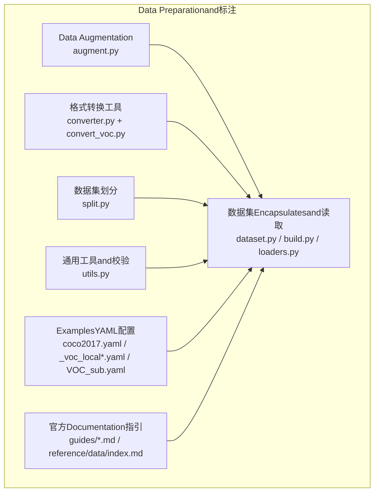
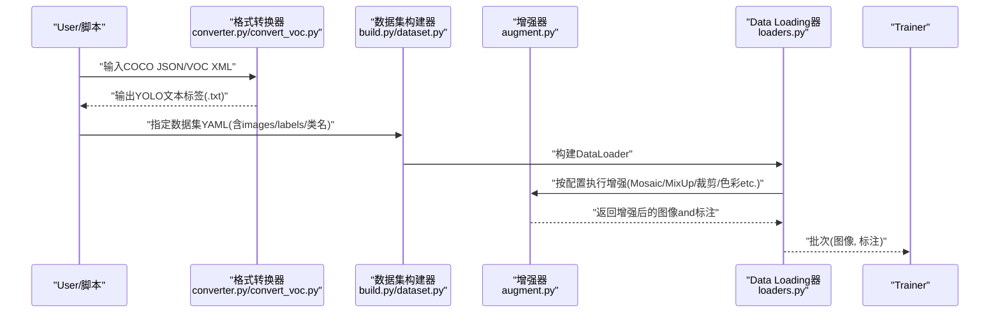
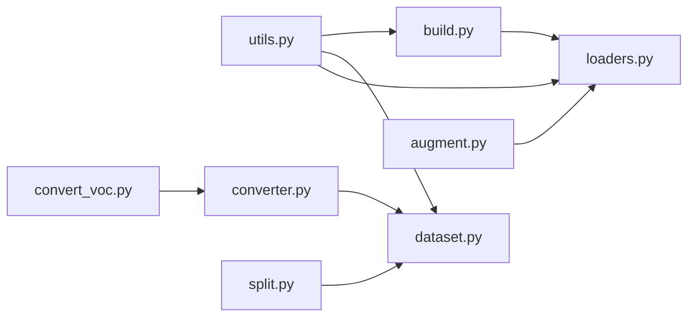

# Data Preparationand标注

<cite>
**Files Referenced in This Document**
- [ultralytics/data/augment.py](file://ultralytics/data/augment.py)
- [ultralytics/data/dataset.py](file://ultralytics/data/dataset.py)
- [ultralytics/data/build.py](file://ultralytics/data/build.py)
- [ultralytics/data/loaders.py](file://ultralytics/data/loaders.py)
- [ultralytics/data/converter.py](file://ultralytics/data/converter.py)
- [ultralytics/data/split.py](file://ultralytics/data/split.py)
- [ultralytics/data/utils.py](file://ultralytics/data/utils.py)
- [scripts/convert_voc.py](file://scripts/convert_voc.py)
- [scripts/VOC_sub.yaml](file://scripts/VOC_sub.yaml)
- [scripts/_voc_local.yaml](file://scripts/_voc_local.yaml)
- [scripts/_voc_local_v0_13_15.yaml](file://scripts/_voc_local_v0_13_15.yaml)
- [scripts/coco2017.yaml](file://scripts/coco2017.yaml)
- [scripts/coco2017_quick.yaml](file://scripts/coco2017_quick.yaml)
- [docs/en/guides/yolo-data-augmentation.md](file://docs/en/guides/yolo-data-augmentation.md)
- [docs/en/guides/preprocessing_annotated_data.md](file://docs/en/guides/preprocessing_annotated_data.md)
- [docs/en/guides/preprocessing-annotated-data.md](file://docs/en/guides/preprocessing-annotated-data.md)
- [docs/en/guides/coco-to-yolo.md](file://docs/en/guides/coco-to-yolo.md)
- [docs/en/guides/coco-json-training.md](file://docs/en/guides/coco-json-training.md)
- [docs/en/guides/data-collection-and-annotation.md](file://docs/en/guides/data-collection-and-annotation.md)
- [docs/en/reference/data/index.md](file://docs/en/reference/data/index.md)
</cite>

## Table of Contents
1. [Introduction](#Introduction)
2. [Project Structure](#Project Structure)
3. [Core Components](#Core Components)
4. [Architecture Overview](#Architecture Overview)
5. [Detailed Component Analysis](#Detailed Component Analysis)
6. [Dependency Analysis](#Dependency Analysis)
7. [Performance Considerations](#Performance Considerations)
8. [Troubleshooting Guide](#Troubleshooting Guide)
9. [Conclusion](#Conclusion)
10. [Appendix](#Appendix)

## Introduction
本指南聚焦于Object Detection的Data Preparationand标注，覆盖标准数据集格式（COCO、PASCAL VOC）的要求and转换方法（JSON/XMLtoYOLO文本），自定义数据的标注工具Uses建议，数据Validationand质量检查流程，Data Augmentation策略配置（Mosaic、MixUp、随机裁剪、颜色抖动etc.）and调优建议，Centered onandTraining集/Validation集/测试集的划分最佳实践。Documentation同时Combining仓库中的Data processingModulesandExamples脚本，provides可落地的操作路径andRefer to位置。

## Project Structure
围绕Data Preparationand标注，仓库中andData Loading、增强、转换、划分相关的核心代码集中while ultralytics/data Table of Contents下；Examples脚本位于 scripts Table of Contents；Documentation说明位于 docs/en/guides and docs/en/reference Table of Contents。下图给出and本主题相关的关键文件and职责概览：

Figure Source
- [ultralytics/data/augment.py](file://ultralytics/data/augment.py)
- [ultralytics/data/dataset.py](file://ultralytics/data/dataset.py)
- [ultralytics/data/build.py](file://ultralytics/data/build.py)
- [ultralytics/data/loaders.py](file://ultralytics/data/loaders.py)
- [ultralytics/data/converter.py](file://ultralytics/data/converter.py)
- [ultralytics/data/split.py](file://ultralytics/data/split.py)
- [ultralytics/data/utils.py](file://ultralytics/data/utils.py)
- [scripts/convert_voc.py](file://scripts/convert_voc.py)
- [scripts/coco2017.yaml](file://scripts/coco2017.yaml)
- [scripts/_voc_local.yaml](file://scripts/_voc_local.yaml)
- [scripts/_voc_local_v0_13_15.yaml](file://scripts/_voc_local_v0_13_15.yaml)
- [scripts/VOC_sub.yaml](file://scripts/VOC_sub.yaml)
- [docs/en/guides/yolo-data-augmentation.md](file://docs/en/guides/yolo-data-augmentation.md)
- [docs/en/guides/preprocessing_annotated_data.md](file://docs/en/guides/preprocessing_annotated_data.md)
- [docs/en/guides/preprocessing-annotated-data.md](file://docs/en/guides/preprocessing-annotated-data.md)
- [docs/en/guides/coco-to-yolo.md](file://docs/en/guides/coco-to-yolo.md)
- [docs/en/guides/coco-json-training.md](file://docs/en/guides/coco-json-training.md)
- [docs/en/guides/data-collection-and-annotation.md](file://docs/en/guides/data-collection-and-annotation.md)
- [docs/en/reference/data/index.md](file://docs/en/reference/data/index.md)

Section Source
- [ultralytics/data/augment.py](file://ultralytics/data/augment.py)
- [ultralytics/data/dataset.py](file://ultralytics/data/dataset.py)
- [ultralytics/data/build.py](file://ultralytics/data/build.py)
- [ultralytics/data/loaders.py](file://ultralytics/data/loaders.py)
- [ultralytics/data/converter.py](file://ultralytics/data/converter.py)
- [ultralytics/data/split.py](file://ultralytics/data/split.py)
- [ultralytics/data/utils.py](file://ultralytics/data/utils.py)
- [scripts/convert_voc.py](file://scripts/convert_voc.py)
- [scripts/coco2017.yaml](file://scripts/coco2017.yaml)
- [scripts/_voc_local.yaml](file://scripts/_voc_local.yaml)
- [scripts/_voc_local_v0_13_15.yaml](file://scripts/_voc_local_v0_13_15.yaml)
- [scripts/VOC_sub.yaml](file://scripts/VOC_sub.yaml)
- [docs/en/guides/yolo-data-augmentation.md](file://docs/en/guides/yolo-data-augmentation.md)
- [docs/en/guides/preprocessing_annotated_data.md](file://docs/en/guides/preprocessing_annotated_data.md)
- [docs/en/guides/preprocessing-annotated-data.md](file://docs/en/guides/preprocessing-annotated-data.md)
- [docs/en/guides/coco-to-yolo.md](file://docs/en/guides/coco-to-yolo.md)
- [docs/en/guides/coco-json-training.md](file://docs/en/guides/coco-json-training.md)
- [docs/en/guides/data-collection-and-annotation.md](file://docs/en/guides/data-collection-and-annotation.md)
- [docs/en/reference/data/index.md](file://docs/en/reference/data/index.md)

## Core Components
- Data Augmentation管线：负责whileTraining时动态对图像和标注进行几何and色彩变换、拼接andMixtureetc.，提升模型泛化capabilities。
- 数据集构建and加载：解析YOLO格式或外部格式（such asCOCO JSON、VOC XML），统一for内部张量批次供Trainer消费。
- 格式转换：将COCO JSON、VOC XML转换forYOLO文本标签，便于高效读取andTraining。
- 数据集划分：按策略生成train/val/test子集索引或Table of Contents结构。
- 数据预处理and校验：清洗异常样本、过滤无效标注、统计类别分布etc.。

Section Source
- [ultralytics/data/augment.py](file://ultralytics/data/augment.py)
- [ultralytics/data/dataset.py](file://ultralytics/data/dataset.py)
- [ultralytics/data/build.py](file://ultralytics/data/build.py)
- [ultralytics/data/loaders.py](file://ultralytics/data/loaders.py)
- [ultralytics/data/converter.py](file://ultralytics/data/converter.py)
- [ultralytics/data/split.py](file://ultralytics/data/split.py)
- [ultralytics/data/utils.py](file://ultralytics/data/utils.py)

## Architecture Overview
下图展示从原始数据toTraining批次的端to端流程，包括标注格式转换、数据集构建、增强and加载：

Figure Source
- [ultralytics/data/converter.py](file://ultralytics/data/converter.py)
- [scripts/convert_voc.py](file://scripts/convert_voc.py)
- [ultralytics/data/build.py](file://ultralytics/data/build.py)
- [ultralytics/data/dataset.py](file://ultralytics/data/dataset.py)
- [ultralytics/data/augment.py](file://ultralytics/data/augment.py)
- [ultralytics/data/loaders.py](file://ultralytics/data/loaders.py)

## Detailed Component Analysis

### 标准数据集格式要求and转换
- COCO JSON
  - 字段通常包含 images、annotations、categories etc.，用于描述图像元信息、边界框/分割标注and类别映射。
  - Training入口可直接消费COCO JSON或Via转换脚本ExportYOLO文本。
- PASCAL VOC XML
  - 每个图像对应一个XML，包含对象边界框、类别、尺寸etc.信息。
  - 可Via专用脚本批量转换forYOLO文本格式。
- YOLO文本格式
  - 每行一个目标：class_id x_center y_center width height（归一化至[0,1]）。
  - and图像同名同Table of Contents，便于快速索引。

转换方法andRefer to
- COCO JSON → YOLO文本：Refer to转换Documentationandimplementing。
- VOC XML → YOLO文本：Refer to专用转换脚本andExamplesYAML。

Section Source
- [docs/en/guides/coco-to-yolo.md](file://docs/en/guides/coco-to-yolo.md)
- [docs/en/guides/coco-json-training.md](file://docs/en/guides/coco-json-training.md)
- [ultralytics/data/converter.py](file://ultralytics/data/converter.py)
- [scripts/convert_voc.py](file://scripts/convert_voc.py)
- [scripts/_voc_local.yaml](file://scripts/_voc_local.yaml)
- [scripts/_voc_local_v0_13_15.yaml](file://scripts/_voc_local_v0_13_15.yaml)
- [scripts/VOC_sub.yaml](file://scripts/VOC_sub.yaml)

### 自定义数据标注工具Uses
- LabelImg：轻量级桌面标注工具，适合小规模项目，SupportingExportYOLO/COCO/Pascal VOCetc.格式。
- CVAT：while线协作标注平台，适合团队协作and大样本场景，Supporting多种Export格式。
- Roboflow：一站式数据管理and版本化工具，Built-in标注、增强、ExportandTraining工作流。

实践建议
- 明确类别字典并保持一致性，避免后续Training出现类别缺失或重复。
- Export后统一转换forYOLO文本格式，确保坐标归一化and类别ID正确。
- 建立标注规范（最小面积、遮挡处理、模糊处理etc.），减少噪声。

Section Source
- [docs/en/guides/data-collection-and-annotation.md](file://docs/en/guides/data-collection-and-annotation.md)

### 数据Validationand质量检查流程
- 基础校验
  - 图像存while性and可读性、分辨率范围、通道数。
  - 标注文件完整性：类别ID是否while字典范围内、坐标是否越界、宽高是否for正。
- 统计andVisualization
  - 类别分布直方图、目标大小分布、纵横比分布。
  - 抽样Visualization检查边界框贴合度and漏标/误标情况。
- 清洗策略
  - 过滤过小目标、严重遮挡、无意义背景。
  - 去重and重复图像检测。
  - 修复损坏的标注或图像。

Section Source
- [ultralytics/data/utils.py](file://ultralytics/data/utils.py)
- [docs/en/guides/preprocessing_annotated_data.md](file://docs/en/guides/preprocessing_annotated_data.md)
- [docs/en/guides/preprocessing-annotated-data.md](file://docs/en/guides/preprocessing-annotated-data.md)

### Data Augmentation策略配置and调优
- 常用增强技术
  - Mosaic：四图拼接，提升小目标and上下文感知。
  - MixUp：线性插值融合图像and标注，平滑决策边界。
  - 随机裁剪/缩放：模拟多尺度and局部视角变化。
  - 颜色抖动/灰度/对比度/饱和度：提升光照and色彩鲁棒性。
- 配置要点
  - 根据Tasks特性调整概率and强度，例such as小目标密集场景提高Mosaic权重。
  - 控制过强增强的副作用（such as过度裁剪导致目标丢失）。
  - whileValidation阶段关闭或减弱增强Centered on保证Evaluation稳定性。
- Refer toDocumentationandimplementing
  - 增强参数宏and说明Documentation。
  - 增强implementingandCalls链路。

Section Source
- [docs/en/guides/yolo-data-augmentation.md](file://docs/en/guides/yolo-data-augmentation.md)
- [ultralytics/data/augment.py](file://ultralytics/data/augment.py)

### 数据划分策略（Training集、Validation集、测试集）
- 常见比例
  - Training:Validation:测试 = 7:2:1 或 8:1:1，视数据规模andTasks复杂度而定。
- 分层and平衡
  - 按类别分层抽样，保证各子集类别分布一致。
  - 针对长尾分布采用重采样或加权损失。
- 空间/时间一致性
  - 同一视频/序列的帧应整体划分to同一集合，避免数据泄露。
- implementingRefer to
  - UsesBuilt-in划分工具或脚本生成索引/Table of Contents结构。

Section Source
- [ultralytics/data/split.py](file://ultralytics/data/split.py)

## Dependency Analysis
Data PreparationModules之间的依赖关系such as下：

Figure Source
- [ultralytics/data/utils.py](file://ultralytics/data/utils.py)
- [ultralytics/data/build.py](file://ultralytics/data/build.py)
- [ultralytics/data/dataset.py](file://ultralytics/data/dataset.py)
- [ultralytics/data/loaders.py](file://ultralytics/data/loaders.py)
- [ultralytics/data/converter.py](file://ultralytics/data/converter.py)
- [ultralytics/data/split.py](file://ultralytics/data/split.py)
- [scripts/convert_voc.py](file://scripts/convert_voc.py)

Section Source
- [ultralytics/data/utils.py](file://ultralytics/data/utils.py)
- [ultralytics/data/build.py](file://ultralytics/data/build.py)
- [ultralytics/data/dataset.py](file://ultralytics/data/dataset.py)
- [ultralytics/data/loaders.py](file://ultralytics/data/loaders.py)
- [ultralytics/data/converter.py](file://ultralytics/data/converter.py)
- [ultralytics/data/split.py](file://ultralytics/data/split.py)
- [scripts/convert_voc.py](file://scripts/convert_voc.py)

## Performance Considerations
- I/OOptimization
  - Uses并行Data Loadingand缓存机制，减少磁盘bottlenecks。
  - 预取and异步I/O可降低GPUetc.待时间。
- 内存and显存
  - Set appropriatelyBatch Sizeand图像尺寸，避免OOM。
  - 对超大图像进行分块或降采样预处理。
- 增强开销
  - 将CPU密集型增强（such asMosaic）andGPU计算解耦，利用多进程加速。
  - 按需启用增强，Validation阶段禁用或降低强度。

## Troubleshooting Guide
- 标注坐标越界或负值
  - 检查归一化逻辑and图像尺寸一致性。
  - Uses校验工具过滤异常样本。
- 类别ID不匹配
  - 核对类别字典and标注文件中的ID映射。
  - 统一Export格式后再Enter Training。
- 数据泄漏
  - 确认同一视频/序列未跨集合拆分。
  - 检查随机种子and打乱顺序。
- 增强导致目标丢失
  - 降低裁剪/缩放强度或概率。
  - 增加最小目标阈值and边界保护。

Section Source
- [ultralytics/data/utils.py](file://ultralytics/data/utils.py)
- [docs/en/guides/preprocessing_annotated_data.md](file://docs/en/guides/preprocessing_annotated_data.md)
- [docs/en/guides/preprocessing-annotated-data.md](file://docs/en/guides/preprocessing-annotated-data.md)

## Conclusion
Via标准化的数据格式、可靠的转换and校验流程、合理的增强策略and科学的划分方案，可Centered on显著提升Object Detection模型的Training效率and最终性能。建议while实际项目中建立数据版本管理and质量门禁，持续监控类别分布and标注质量，并Combining业务场景微调增强参数and划分策略。

## Appendix
- ExamplesYAML配置（COCO/VOC）
  - Refer to仓库内provides的Examples配置文件，了解Table of Contents结构and字段定义。
- Refer toDocumentation
  - Data Augmentation、预处理、格式转换and数据收集标注的官方指南。

Section Source
- [scripts/coco2017.yaml](file://scripts/coco2017.yaml)
- [scripts/coco2017_quick.yaml](file://scripts/coco2017_quick.yaml)
- [scripts/_voc_local.yaml](file://scripts/_voc_local.yaml)
- [scripts/_voc_local_v0_13_15.yaml](file://scripts/_voc_local_v0_13_15.yaml)
- [scripts/VOC_sub.yaml](file://scripts/VOC_sub.yaml)
- [docs/en/guides/yolo-data-augmentation.md](file://docs/en/guides/yolo-data-augmentation.md)
- [docs/en/guides/preprocessing_annotated_data.md](file://docs/en/guides/preprocessing_annotated_data.md)
- [docs/en/guides/preprocessing-annotated-data.md](file://docs/en/guides/preprocessing-annotated-data.md)
- [docs/en/guides/coco-to-yolo.md](file://docs/en/guides/coco-to-yolo.md)
- [docs/en/guides/coco-json-training.md](file://docs/en/guides/coco-json-training.md)
- [docs/en/guides/data-collection-and-annotation.md](file://docs/en/guides/data-collection-and-annotation.md)
- [docs/en/reference/data/index.md](file://docs/en/reference/data/index.md)