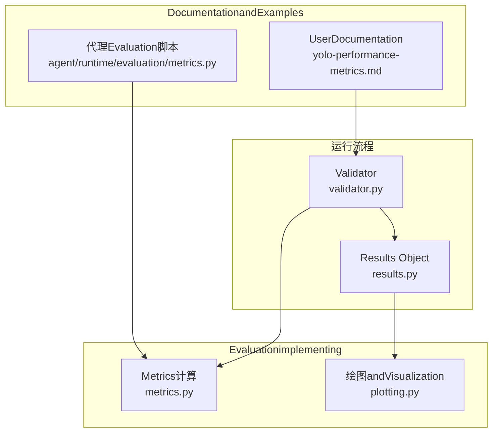
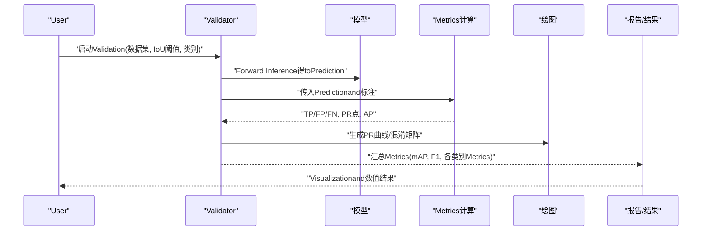
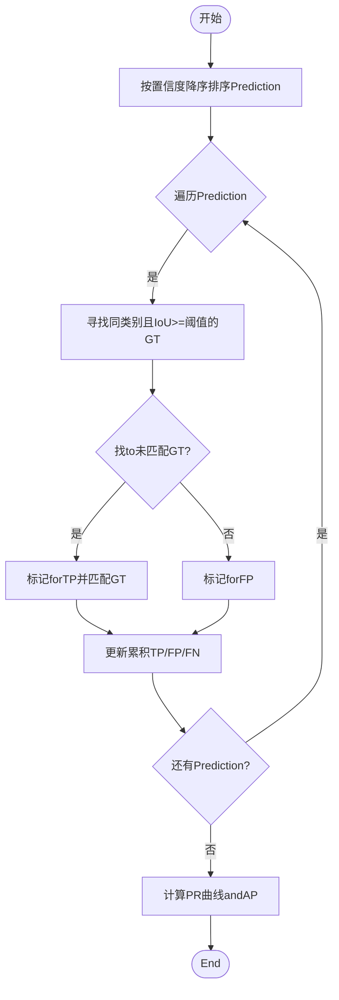
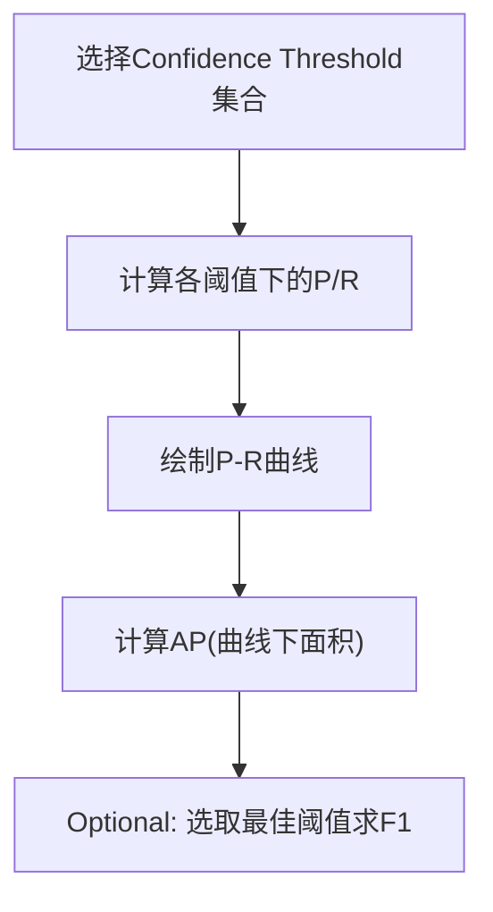
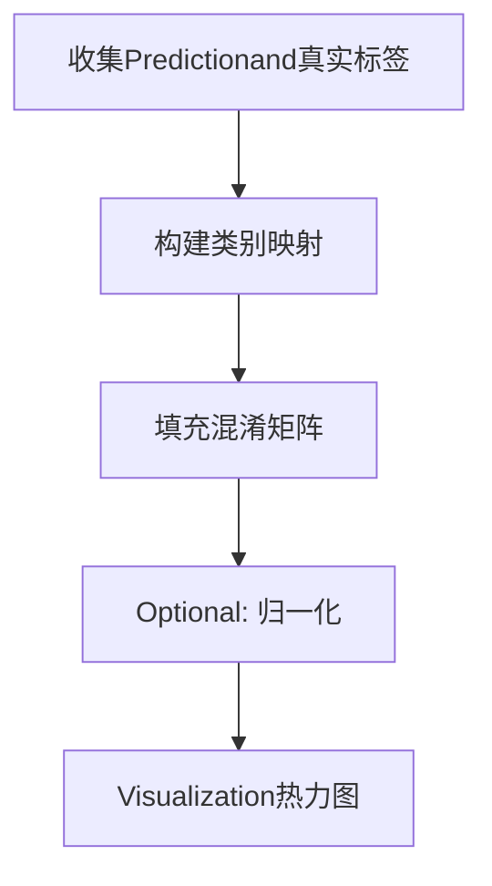
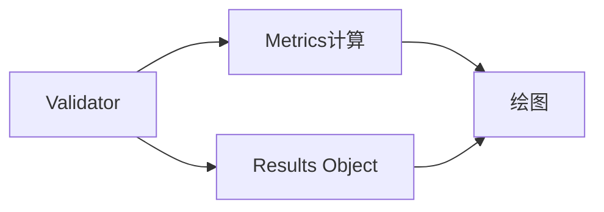

# EvaluationMetricsand性能分析

<cite>
**Files Referenced in This Document**
- [ultralytics/utils/metrics.py](file://ultralytics/utils/metrics.py)
- [ultralytics/engine/validator.py](file://ultralytics/engine/validator.py)
- [ultralytics/engine/results.py](file://ultralytics/engine/results.py)
- [ultralytics/utils/plotting.py](file://ultralytics/utils/plotting.py)
- [docs/en/guides/yolo-performance-metrics.md](file://docs/en/guides/yolo-performance-metrics.md)
- [agent/runtime/evaluation/metrics.py](file://agent/runtime/evaluation/metrics.py)
</cite>

## Table of Contents
1. [Introduction](#Introduction)
2. [Project Structure](#Project Structure)
3. [Core Components](#Core Components)
4. [Architecture Overview](#Architecture Overview)
5. [Detailed Component Analysis](#Detailed Component Analysis)
6. [Dependency Analysis](#Dependency Analysis)
7. [性能考量](#性能考量)
8. [Troubleshooting Guide](#Troubleshooting Guide)
9. [Conclusion](#Conclusion)
10. [Appendix](#Appendix)

## Introduction
本文件targetingObject DetectionTasks，系统化讲解EvaluationMetricsand性能分析方法，重点覆盖：
- mAP（mean Average Precision）计算原理、IoU阈值的影响and常见变体
- Precision-Recall曲线、F1分数、混淆矩阵的含义and分析方法
- 按类别的性能分析and错误类型识别（漏检、误检、定位不准）
- 性能基准测试方法and多模型对比技巧

## Project Structure
本项目while多个位置provides检测Evaluationcapabilities：
- 核心Metricsimplementing位于工具Modules中，负责IoU、PR曲线、mAPetc.基础计算
- Validation流程whileEngine Layer编排，串联Prediction、匹配、统计and汇总
- Results Object承载单样本或批次的检测结果andVisualization接口
- Documentation侧providestargetingUser的Metrics说明andUses指引
- 代理运行时provides轻量Evaluation脚本and辅助函数

Figure Source
- [ultralytics/utils/metrics.py](file://ultralytics/utils/metrics.py)
- [ultralytics/engine/validator.py](file://ultralytics/engine/validator.py)
- [ultralytics/engine/results.py](file://ultralytics/engine/results.py)
- [ultralytics/utils/plotting.py](file://ultralytics/utils/plotting.py)
- [docs/en/guides/yolo-performance-metrics.md](file://docs/en/guides/yolo-performance-metrics.md)
- [agent/runtime/evaluation/metrics.py](file://agent/runtime/evaluation/metrics.py)

Section Source
- [ultralytics/utils/metrics.py](file://ultralytics/utils/metrics.py)
- [ultralytics/engine/validator.py](file://ultralytics/engine/validator.py)
- [ultralytics/engine/results.py](file://ultralytics/engine/results.py)
- [ultralytics/utils/plotting.py](file://ultralytics/utils/plotting.py)
- [docs/en/guides/yolo-performance-metrics.md](file://docs/en/guides/yolo-performance-metrics.md)
- [agent/runtime/evaluation/metrics.py](file://agent/runtime/evaluation/metrics.py)

## Core Components
- Metrics计算Modules
  - 负责IoU计算、置信度排序、TP/FP/FN判定、PR曲线构建、APandmAP聚合
  - Supporting不同IoU阈值and类别维度的统计
- Validator
  - 组织Data Loading、Inference、Post-Processing、匹配andMetrics统计
  - 输出每类and整体的Precision、Recall、mAPetc.
- Results Object
  - Encapsulates单图/批量检测结果，便于后续VisualizationandExport
- 绘图Modules
  - 绘制PR曲线、混淆矩阵、各类别Metrics图
- Documentationand脚本
  - providesMetrics定义、参数说明and快速上手Examples

Section Source
- [ultralytics/utils/metrics.py](file://ultralytics/utils/metrics.py)
- [ultralytics/engine/validator.py](file://ultralytics/engine/validator.py)
- [ultralytics/engine/results.py](file://ultralytics/engine/results.py)
- [ultralytics/utils/plotting.py](file://ultralytics/utils/plotting.py)
- [docs/en/guides/yolo-performance-metrics.md](file://docs/en/guides/yolo-performance-metrics.md)
- [agent/runtime/evaluation/metrics.py](file://agent/runtime/evaluation/metrics.py)

## Architecture Overview
下图展示从ValidationtoMetrics计算的端to端流程。

Figure Source
- [ultralytics/engine/validator.py](file://ultralytics/engine/validator.py)
- [ultralytics/utils/metrics.py](file://ultralytics/utils/metrics.py)
- [ultralytics/utils/plotting.py](file://ultralytics/utils/plotting.py)

## Detailed Component Analysis

### mAP（平均精度均值）andIoU阈值
- 基本概念
  - 对每个类别，依据置信度从高to低排序Prediction框，逐条判定是否for真阳性（TP）、假阳性（FP），并累计假阴性（FN）
  - while每个阈值下计算PrecisionandRecall，进而得to该阈值的Average Precision（AP）
  - mAPfor所有类别AP的平均值；COCO常用mAP@[.5:.95]表示while多个IoU阈值上取平均
- IoU阈值的影响
  - 较低阈值（such as0.5）更宽容，更容易获得较高AP
  - 较高阈值（such as0.75andCentered on上）强调定位准确性，AP通常更低但更能反映定位质量
  - 多阈值平均（such as0.5至0.95步长0.05）能综合衡量分类and定位capabilities
- 计算要点
  - 同一图像内一个GT只能被一个Prediction匹配，避免重复计数
  - 类别一致性必须严格，跨类别的匹配不计入
  - 未匹配的Prediction均forFP，未匹配的GT均forFN

Figure Source
- [ultralytics/utils/metrics.py](file://ultralytics/utils/metrics.py)

Section Source
- [ultralytics/utils/metrics.py](file://ultralytics/utils/metrics.py)

### Precision-Recall曲线andF1分数
- Precision-Recall曲线
  - 横轴for召回率（Recall），纵轴for精确率（Precision）
  - 曲线下面积即forAP；曲线越靠近右上角，性能越好
  - 低Confidence Threshold会提升召回率但降低精确率，需权衡
- F1分数
  - 精确率and召回率的调和平均，常用于单一阈值下的综合度量
  - 适合关注“查全”and“查准”平衡的场景，但不直接替代AP用于排序比较

Figure Source
- [ultralytics/utils/metrics.py](file://ultralytics/utils/metrics.py)
- [ultralytics/utils/plotting.py](file://ultralytics/utils/plotting.py)

Section Source
- [ultralytics/utils/metrics.py](file://ultralytics/utils/metrics.py)
- [ultralytics/utils/plotting.py](file://ultralytics/utils/plotting.py)

### 混淆矩阵（Confusion Matrix）
- 含义
  - 行通常for真实标签，列通常forPrediction标签
  - 对角线for正确分类数量，非对角线for误分类
- Uses方法
  - 观察主要误分方向，定位易混淆类别
  - Combining类别不平衡情况解读，必要时采用归一化混淆矩阵
- Visualization
  - 热力图形式直观呈现各类别间的混淆强度

Figure Source
- [ultralytics/utils/plotting.py](file://ultralytics/utils/plotting.py)

Section Source
- [ultralytics/utils/plotting.py](file://ultralytics/utils/plotting.py)

### 按类别性能分析and错误类型识别
- 类别维度分析
  - 分别查看各类别的Precision、Recall、APandmAP
  - 针对长尾类别进行专项Optimization（Data Augmentation、难例挖掘、阈值调优）
- 常见错误类型
  - 漏检（False Negative）：召回率低，可能由小目标、遮挡、阈值过高导致
  - 误检（False Positive）：精确率低，可能由背景相似、阈值过低、类别混淆导致
  - 定位不准：高IoU阈值下AP显著下降，需改进边界框回归或NMS策略
- 诊断建议
  - ViaPR曲线and混淆矩阵定位问题类别
  - 抽样Visualization典型失败案例，针对性调整Training数据and超参

Section Source
- [ultralytics/utils/metrics.py](file://ultralytics/utils/metrics.py)
- [ultralytics/utils/plotting.py](file://ultralytics/utils/plotting.py)

### 性能基准测试and多模型对比
- 基准测试方法
  - 固定数据集and预处理，统一IoU阈值and类别设置
  - 记录mAP、mAP@.5、mAP@.75、各类别AP、Inference时延and吞吐
- 对比技巧
  - 控制变量法：仅改变模型结构或权重，其他条件一致
  - 分层对比：整体mAPand关键类别AP并重
  - 稳定性Evaluation：多次运行取均值and方差，排除随机性影响
- 自动化and可复现
  - UsesValidatorandMetricsModules自动产出结果
  - 保存配置and随机种子，确保可复现实验

Section Source
- [ultralytics/engine/validator.py](file://ultralytics/engine/validator.py)
- [ultralytics/utils/metrics.py](file://ultralytics/utils/metrics.py)

## Dependency Analysis
- Validator依赖Metrics计算andResults Object
- Metrics计算依赖IoUand匹配逻辑
- 绘图Modules依赖MetricsandResults ObjectCentered on生成Visualization
- Documentationand脚本作for上层入口，Calls上述组件完成评测

Figure Source
- [ultralytics/engine/validator.py](file://ultralytics/engine/validator.py)
- [ultralytics/utils/metrics.py](file://ultralytics/utils/metrics.py)
- [ultralytics/engine/results.py](file://ultralytics/engine/results.py)
- [ultralytics/utils/plotting.py](file://ultralytics/utils/plotting.py)

Section Source
- [ultralytics/engine/validator.py](file://ultralytics/engine/validator.py)
- [ultralytics/utils/metrics.py](file://ultralytics/utils/metrics.py)
- [ultralytics/engine/results.py](file://ultralytics/engine/results.py)
- [ultralytics/utils/plotting.py](file://ultralytics/utils/plotting.py)

## 性能考量
- 阈值选择
  - 根据业务需求选择合适的IoU阈值andConfidence Threshold
  - 若重视定位精度，提高IoU阈值；若重视召回，适当降低阈值
- 类别不平衡
  - 对少数类进行加权采样或损失重标定
  - 单独监控少数类的APandPR曲线
- 计算效率
  - 批处理and并行化减少IOand内存拷贝开销
  - Set appropriatelyNMSandPost-Processing参数，避免过度过滤

[This section provides general guidance and does not directly analyze specific files]

## Troubleshooting Guide
- Metrics异常
  - 检查类别映射是否一致，避免跨类别匹配
  - 确认GTandPrediction坐标格式and归一化方式一致
- Visualization缺失
  - 确认绘图Modules可用，路径and权限正常
- 结果不一致
  - 固定随机种子and数据顺序，确保可复现
  - 检查NMSand阈值参数是否稳定

Section Source
- [ultralytics/utils/metrics.py](file://ultralytics/utils/metrics.py)
- [ultralytics/utils/plotting.py](file://ultralytics/utils/plotting.py)

## Conclusion
- mAP是衡量分类and定位capabilities的核心Metrics，IoU阈值直接影响结果
- PR曲线andF1分数provides不同视角的综合Evaluation
- 混淆矩阵有助于识别易混淆类别and系统性误差
- Via严格的基准测试and对比方法，可客观Evaluation模型差异并指导Optimization

[本节for总结，不直接分析具体文件]

## Appendix
- Refer toDocumentation
  - User级Metrics说明andUses指南
- 辅助脚本
  - 代理运行时中的轻量Evaluation脚本，便于快速Validation

Section Source
- [docs/en/guides/yolo-performance-metrics.md](file://docs/en/guides/yolo-performance-metrics.md)
- [agent/runtime/evaluation/metrics.py](file://agent/runtime/evaluation/metrics.py)