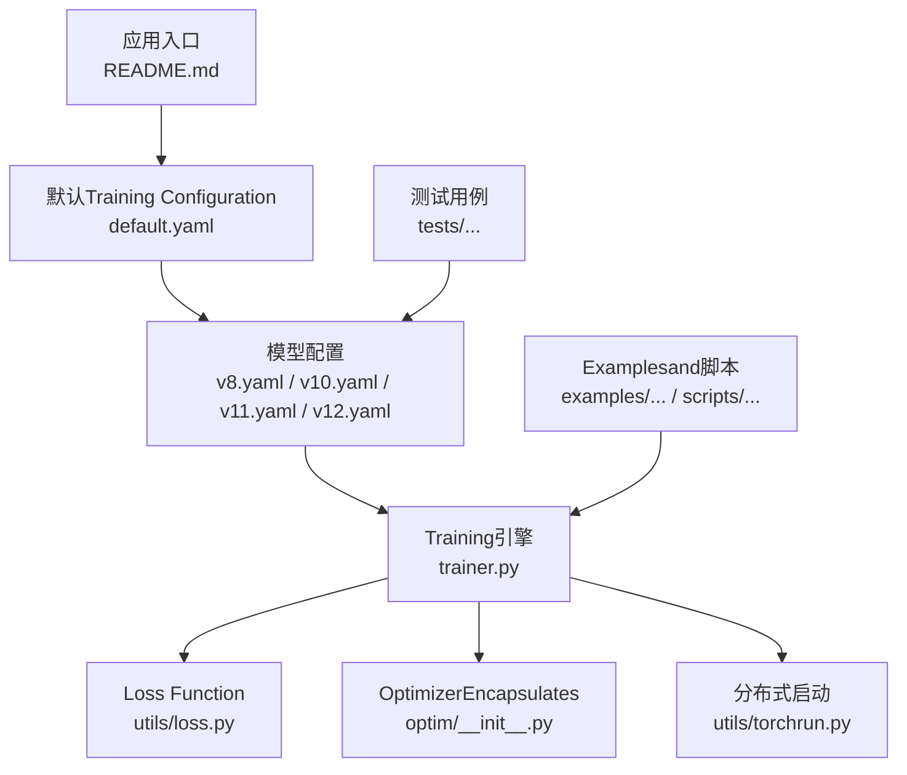
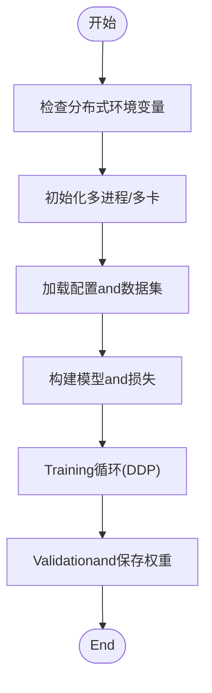
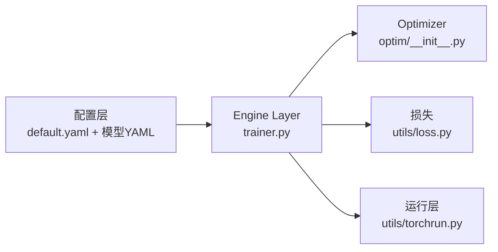

# 模型选择andTraining Configuration

<cite>
**Files Referenced in This Document**
- [README.md](file://README.md)
- [ultralytics/cfg/default.yaml](file://ultralytics/cfg/default.yaml)
- [ultralytics/cfg/models/yolo/v8.yaml](file://ultralytics/cfg/models/yolo/v8.yaml)
- [ultralytics/cfg/models/yolo/v10.yaml](file://ultralytics/cfg/models/yolo/v10.yaml)
- [ultralytics/cfg/models/yolo/v11.yaml](file://ultralytics/cfg/models/yolo/v11.yaml)
- [ultralytics/cfg/models/yolo/v12.yaml](file://ultralytics/cfg/models/yolo/v12.yaml)
- [ultralytics/engine/trainer.py](file://ultralytics/engine/trainer.py)
- [ultralytics/utils/loss.py](file://ultralytics/utils/loss.py)
- [ultralytics/optim/__init__.py](file://ultralytics/optim/__init__.py)
- [ultralytics/utils/torchrun.py](file://ultralytics/utils/torchrun.py)
- [examples/YOLOv10-Master-MoA/README.md](file://examples/YOLOv10-Master-MoA/README.md)
- [scripts/smoke_test_coco2017.py](file://scripts/smoke_test_coco2017.py)
- [tests/test_master_model_configs.py](file://tests/test_master_model_configs.py)
</cite>

## Table of Contents
1. [Introduction](#Introduction)
2. [Project Structure](#Project Structure)
3. [Core Components](#Core Components)
4. [Architecture Overview](#Architecture Overview)
5. [Detailed Component Analysis](#Detailed Component Analysis)
6. [Dependency Analysis](#Dependency Analysis)
7. [性能考量](#性能考量)
8. [Troubleshooting Guide](#Troubleshooting Guide)
9. [Conclusion](#Conclusion)
10. [Appendix](#Appendix)

## Introduction
本教程targeting希望whileYOLO-Master中选择并Training不同YOLO Series Models的EngineersandResearchers，系统讲解：
- 模型选择：YOLOv8（平衡性能）、YOLOv10（高效Inference）、YOLOv11（精度提升）、YOLOv12（最新架构）的特点andApplicable Scenarios
- Training Configuration：网络结构参数、Optimizer（SGD、AdamW）、Learning Rate调度（CosineAnnealing、StepLR）
- Loss Function：CIoU Loss、DFL Loss的配置要点
- 超参数调优方法：Learning Rate、权重衰减、Data Augmentation、Batch Sizeetc.
- Distributed Trainingand多GPU设置：torchrun启动、DDP环境、常见坑位andValidation方式

## Project Structure
YOLO-Master采用Modules化设计，模型定义集中于配置andModulesTable of Contents，Training引擎位于engine层，损失andOptimizerwhileutilsandoptim中provides，Examplesand脚本covering from快速Validationto完整Training的多种路径。



Figure Source
- [README.md:1-120](file://README.md#L1-L120)
- [ultralytics/cfg/default.yaml:1-200](file://ultralytics/cfg/default.yaml#L1-L200)
- [ultralytics/cfg/models/yolo/v8.yaml:1-200](file://ultralytics/cfg/models/yolo/v8.yaml#L1-L200)
- [ultralytics/cfg/models/yolo/v10.yaml:1-200](file://ultralytics/cfg/models/yolo/v10.yaml#L1-L200)
- [ultralytics/cfg/models/yolo/v11.yaml:1-200](file://ultralytics/cfg/models/yolo/v11.yaml#L1-L200)
- [ultralytics/cfg/models/yolo/v12.yaml:1-200](file://ultralytics/cfg/models/yolo/v12.yaml#L1-L200)
- [ultralytics/engine/trainer.py:1-200](file://ultralytics/engine/trainer.py#L1-L200)
- [ultralytics/utils/loss.py:1-200](file://ultralytics/utils/loss.py#L1-L200)
- [ultralytics/optim/__init__.py:1-200](file://ultralytics/optim/__init__.py#L1-L200)
- [ultralytics/utils/torchrun.py:1-200](file://ultralytics/utils/torchrun.py#L1-L200)

Section Source
- [README.md:1-120](file://README.md#L1-L120)
- [ultralytics/cfg/default.yaml:1-200](file://ultralytics/cfg/default.yaml#L1-L200)

## Core Components
- 模型配置体系：ViaYAML描述网络结构andTasks头，Supportingv8/v10/v11/v12etc.多版本
- Training引擎：统一加载配置、构建模型、初始化Optimizerand调度器、执行Training循环andValidation
- Loss Function：包含分类、回归、分布焦点损失（DFL）etc.，SupportingCIoU类IoU变体
- Optimizerand调度：Encapsulates常用OptimizerandLearning Rate策略，便于while配置中切换
- Distributed Training：基于torchrun的DDP启动and设备管理

Section Source
- [ultralytics/cfg/models/yolo/v8.yaml:1-200](file://ultralytics/cfg/models/yolo/v8.yaml#L1-L200)
- [ultralytics/cfg/models/yolo/v10.yaml:1-200](file://ultralytics/cfg/models/yolo/v10.yaml#L1-L200)
- [ultralytics/cfg/models/yolo/v11.yaml:1-200](file://ultralytics/cfg/models/yolo/v11.yaml#L1-L200)
- [ultralytics/cfg/models/yolo/v12.yaml:1-200](file://ultralytics/cfg/models/yolo/v12.yaml#L1-L200)
- [ultralytics/engine/trainer.py:1-200](file://ultralytics/engine/trainer.py#L1-L200)
- [ultralytics/utils/loss.py:1-200](file://ultralytics/utils/loss.py#L1-L200)
- [ultralytics/optim/__init__.py:1-200](file://ultralytics/optim/__init__.py#L1-L200)
- [ultralytics/utils/torchrun.py:1-200](file://ultralytics/utils/torchrun.py#L1-L200)

## Architecture Overview
下图展示从配置toTraining的关键流程：解析YAML配置→构建模型→初始化Optimizerand调度器→Training循环→Evaluationand保存。

```mermaid
sequenceDiagram
participant U as "User"
participant CFG as "配置解析<br/>default.yaml + 模型YAML"
participant TR as "Training引擎<br/>trainer.py"
participant OPT as "Optimizer<br/>optim/__init__.py"
participant LOS as "Loss Function<br/>utils/loss.py"
participant DIST as "分布式启动<br/>utils/torchrun.py"
U->>CFG : 指定数据集与模型版本
CFG-->>TR : 返回结构化配置
TR->>DIST : 初始化多进程/多卡
TR->>OPT : 创建优化器(如SGD/AdamW)
TR->>LOS : 构建损失(CIoU/DFL等)
loop 每个Epoch
TR->>TR : 前向传播
TR->>LOS : 计算损失
TR->>OPT : 反向传播与参数更新
TR->>TR : 记录指标与日志
end
TR-->>U : 输出权重与评估结果
```

Figure Source
- [ultralytics/cfg/default.yaml:1-200](file://ultralytics/cfg/default.yaml#L1-L200)
- [ultralytics/engine/trainer.py:1-200](file://ultralytics/engine/trainer.py#L1-L200)
- [ultralytics/optim/__init__.py:1-200](file://ultralytics/optim/__init__.py#L1-L200)
- [ultralytics/utils/loss.py:1-200](file://ultralytics/utils/loss.py#L1-L200)
- [ultralytics/utils/torchrun.py:1-200](file://ultralytics/utils/torchrun.py#L1-L200)

## Detailed Component Analysis

### 模型选择and特点对比
- YOLOv8：while速度and精度之间取得良好平衡，适合通用Object DetectionTasksand中etc.算力环境
- YOLOv10：强调高效Inference，减少Post-Processing开销，适合部署and实时场景
- YOLOv11：while特征表达andDetection Head方面进行改进，带来精度提升
- YOLOv12：引入最新架构思想，进一步提升性能上限

建议依据Tasks需求and部署约束选择：
- 资源受限或需要低延迟：优先v10
- 追求更高mAP且算力充足：优先v11或v12
- 通用基准and稳定性：v8作for基线

Section Source
- [ultralytics/cfg/models/yolo/v8.yaml:1-200](file://ultralytics/cfg/models/yolo/v8.yaml#L1-L200)
- [ultralytics/cfg/models/yolo/v10.yaml:1-200](file://ultralytics/cfg/models/yolo/v10.yaml#L1-L200)
- [ultralytics/cfg/models/yolo/v11.yaml:1-200](file://ultralytics/cfg/models/yolo/v11.yaml#L1-L200)
- [ultralytics/cfg/models/yolo/v12.yaml:1-200](file://ultralytics/cfg/models/yolo/v12.yaml#L1-L200)

### Training Configuration要点（网络结构、Optimizer、Learning Rate调度）
- 网络结构参数：while对应版本的模型YAML中定义骨干、颈部、Detection Headetc.关键Modulesand通道数
- Optimizer设置：
  - SGD：适合稳定收敛and经典Training范式
  - AdamW：对稀疏Gradientand小样本更友好，常Combined with权重衰减
- Learning Rate调度策略：
  - CosineAnnealing：平滑下降，利于后期精细调整
  - StepLR：按固定步长衰减，简单直观

配置组织建议：
- Usesdefault.yaml统一管理通用Training参数（Batch Size、图像尺寸、数据路径etc.）
- 针对具体模型版本选择对应的YAMLCentered on覆盖网络结构差异

Section Source
- [ultralytics/cfg/default.yaml:1-200](file://ultralytics/cfg/default.yaml#L1-L200)
- [ultralytics/cfg/models/yolo/v8.yaml:1-200](file://ultralytics/cfg/models/yolo/v8.yaml#L1-L200)
- [ultralytics/cfg/models/yolo/v10.yaml:1-200](file://ultralytics/cfg/models/yolo/v10.yaml#L1-L200)
- [ultralytics/cfg/models/yolo/v11.yaml:1-200](file://ultralytics/cfg/models/yolo/v11.yaml#L1-L200)
- [ultralytics/cfg/models/yolo/v12.yaml:1-200](file://ultralytics/cfg/models/yolo/v12.yaml#L1-L200)
- [ultralytics/optim/__init__.py:1-200](file://ultralytics/optim/__init__.py#L1-L200)

### Loss Function配置（CIoU Loss、DFL Loss）
- CIoU Loss：whileIoU基础上加入中心点距离and长宽比惩罚，有助于边界框回归稳定性
- DFL Loss（Distribution Focal Loss）：将边界框Prediction建模for分布，提高定位精度

配置要点：
- whileTraining引擎中根据Tasks类型选择相应Loss combination
- 调节各损失项权重Centered on平衡分类、定位and分布建模

Section Source
- [ultralytics/utils/loss.py:1-200](file://ultralytics/utils/loss.py#L1-L200)
- [ultralytics/engine/trainer.py:1-200](file://ultralytics/engine/trainer.py#L1-L200)

### 超参数调优方法
- Learning Rate：Combining调度策略进行网格搜索或贝叶斯Optimization
- 权重衰减：防止过拟合，尤其while小数据集上
- Batch Size：受显存限制，可Combined withGradient累积
- Data Augmentation：Mosaic、MixUp、随机仿射etc.，提升泛化capabilities
- 早停andValidation频率：避免过拟合，缩短实验周期

Section Source
- [ultralytics/cfg/default.yaml:1-200](file://ultralytics/cfg/default.yaml#L1-L200)
- [ultralytics/engine/trainer.py:1-200](file://ultralytics/engine/trainer.py#L1-L200)

### Distributed Trainingand多GPU设置
- Usestorchrun启动多进程Training，自动分配设备and同步Gradient
- 关键环境变量：进程数、本地端口、节点信息etc.
- 注意事项：确保Data Loading并行度and内存占用匹配硬件；Set appropriately每卡Batch Size



Figure Source
- [ultralytics/utils/torchrun.py:1-200](file://ultralytics/utils/torchrun.py#L1-L200)
- [ultralytics/engine/trainer.py:1-200](file://ultralytics/engine/trainer.py#L1-L200)

Section Source
- [ultralytics/utils/torchrun.py:1-200](file://ultralytics/utils/torchrun.py#L1-L200)
- [ultralytics/engine/trainer.py:1-200](file://ultralytics/engine/trainer.py#L1-L200)

### 端to端Training流程（代码级序列图）
```mermaid
sequenceDiagram
participant CLI as "命令行/脚本"
participant TR as "Training引擎<br/>trainer.py"
participant CFG as "配置<br/>default.yaml + 模型YAML"
participant OPT as "Optimizer<br/>optim/__init__.py"
participant LOS as "损失<br/>utils/loss.py"
participant DIST as "分布式<br/>utils/torchrun.py"
CLI->>TR : 传入数据集与模型版本
TR->>CFG : 解析配置
TR->>DIST : 初始化DDP
TR->>OPT : 创建优化器
TR->>LOS : 构建损失
loop Epochs
TR->>TR : 前向+损失计算
TR->>OPT : 反向传播与更新
TR->>TR : 记录指标
end
TR-->>CLI : 输出权重与报告
```

Figure Source
- [ultralytics/engine/trainer.py:1-200](file://ultralytics/engine/trainer.py#L1-L200)
- [ultralytics/cfg/default.yaml:1-200](file://ultralytics/cfg/default.yaml#L1-L200)
- [ultralytics/optim/__init__.py:1-200](file://ultralytics/optim/__init__.py#L1-L200)
- [ultralytics/utils/loss.py:1-200](file://ultralytics/utils/loss.py#L1-L200)
- [ultralytics/utils/torchrun.py:1-200](file://ultralytics/utils/torchrun.py#L1-L200)

## Dependency Analysis
- 配置层：default.yamland各模型YAML共同决定网络结构andTraining行for
- Engine Layer：trainer.py协调数据、模型、Optimizer、损失and分布式
- 工具层：loss.pyandoptim/__init__.pyprovides核心算法implementing
- 运行层：torchrun.py负责多进程and设备管理



Figure Source
- [ultralytics/cfg/default.yaml:1-200](file://ultralytics/cfg/default.yaml#L1-L200)
- [ultralytics/cfg/models/yolo/v8.yaml:1-200](file://ultralytics/cfg/models/yolo/v8.yaml#L1-L200)
- [ultralytics/cfg/models/yolo/v10.yaml:1-200](file://ultralytics/cfg/models/yolo/v10.yaml#L1-L200)
- [ultralytics/cfg/models/yolo/v11.yaml:1-200](file://ultralytics/cfg/models/yolo/v11.yaml#L1-L200)
- [ultralytics/cfg/models/yolo/v12.yaml:1-200](file://ultralytics/cfg/models/yolo/v12.yaml#L1-L200)
- [ultralytics/engine/trainer.py:1-200](file://ultralytics/engine/trainer.py#L1-L200)
- [ultralytics/optim/__init__.py:1-200](file://ultralytics/optim/__init__.py#L1-L200)
- [ultralytics/utils/loss.py:1-200](file://ultralytics/utils/loss.py#L1-L200)
- [ultralytics/utils/torchrun.py:1-200](file://ultralytics/utils/torchrun.py#L1-L200)

Section Source
- [ultralytics/cfg/default.yaml:1-200](file://ultralytics/cfg/default.yaml#L1-L200)
- [ultralytics/engine/trainer.py:1-200](file://ultralytics/engine/trainer.py#L1-L200)

## 性能考量
- Inference效率：v10whilePost-Processingand算子层面做了Optimization，适合Edge Deployment
- 精度上限：v11andv12while特征融合andDetection Head上有改进，适合高精度需求
- Training吞吐：增大批次and数据并行度可提升吞吐，但需关注显存and通信开销
- Mixture精度and编译：Combining框架特性（such asAMP、TorchCompile）进一步加速

[This section provides general guidance and does not directly analyze specific files]

## Troubleshooting Guide
- 分布式启动失败：检查torchrun环境变量and端口占用；确认进程数andGPU数量一致
- Training不稳定：降低Learning Rate或更换调度策略；检查损失权重是否合理
- 显存不足：减小Batch Size或图像分辨率；启用Gradient累积
- Validation异常：核对数据集路径and标签格式；Refer toExamplesand脚本进行最小复现

Section Source
- [ultralytics/utils/torchrun.py:1-200](file://ultralytics/utils/torchrun.py#L1-L200)
- [scripts/smoke_test_coco2017.py:1-200](file://scripts/smoke_test_coco2017.py#L1-L200)
- [tests/test_master_model_configs.py:1-200](file://tests/test_master_model_configs.py#L1-L200)

## Conclusion
Via合理的模型选择andTraining Configuration，可while不同算力and部署条件下获得稳定的检测性能。建议Centered onv8for基线，逐步Migration至v10/v11/v12，并CombiningOptimizerand调度策略进行系统化调参。Distributed Training能显著提升Training效率，但需注意环境and资源配置。

[This section is summary content and does not directly analyze specific files]

## Appendix
- ExamplesandRefer to：
  - 快速Validation脚本：smoke_test_coco2017.py
  - 相关Examples说明：examples/YOLOv10-Master-MoA/README.md
  - 模型配置一致性测试：tests/test_master_model_configs.py

Section Source
- [scripts/smoke_test_coco2017.py:1-200](file://scripts/smoke_test_coco2017.py#L1-L200)
- [examples/YOLOv10-Master-MoA/README.md:1-200](file://examples/YOLOv10-Master-MoA/README.md#L1-L200)
- [tests/test_master_model_configs.py:1-200](file://tests/test_master_model_configs.py#L1-L200)