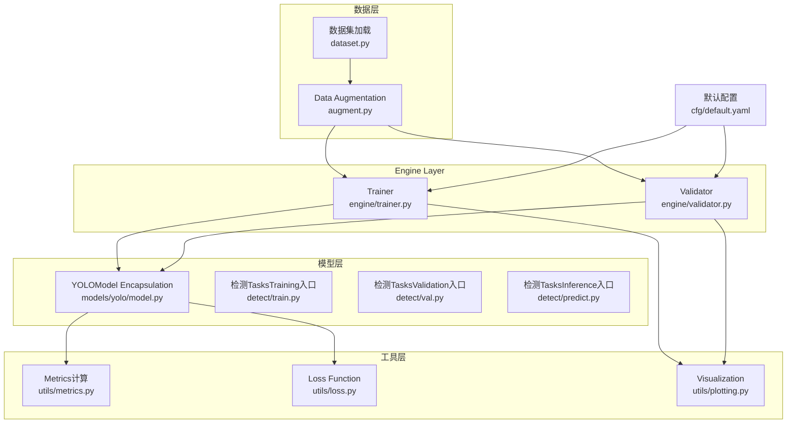
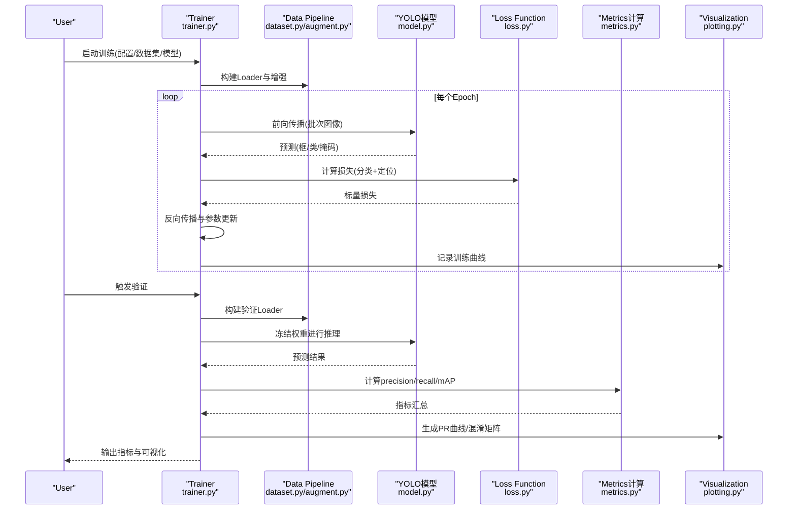
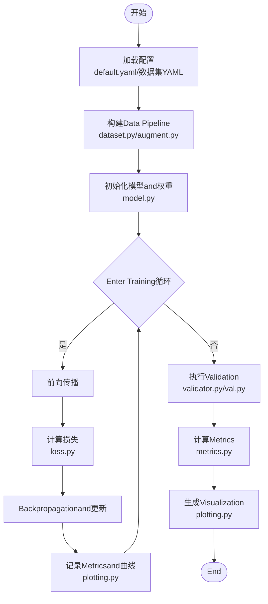
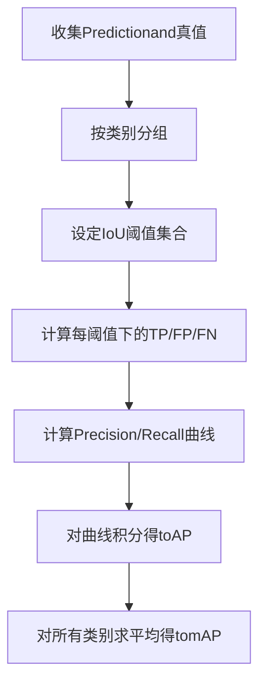
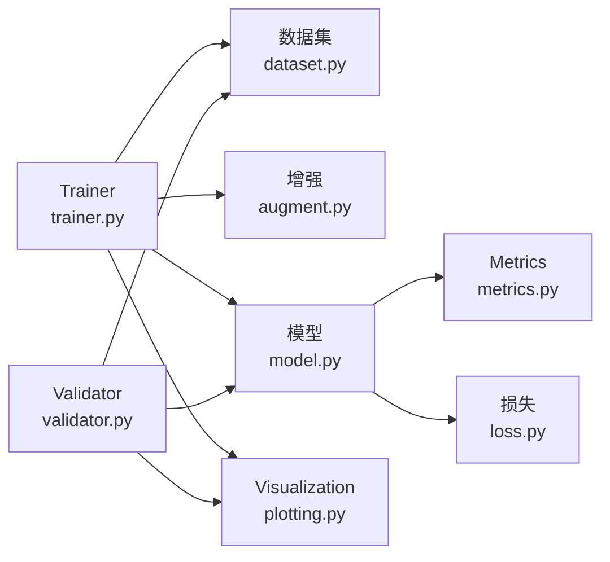

# Object Detection Tutorial

<cite>
**Files Referenced in This Document**
- [README.md](file://README.md)
- [ultralytics/cfg/default.yaml](file://ultralytics/cfg/default.yaml)
- [ultralytics/data/dataset.py](file://ultralytics/data/dataset.py)
- [ultralytics/data/augment.py](file://ultralytics/data/augment.py)
- [ultralytics/engine/trainer.py](file://ultralytics/engine/trainer.py)
- [ultralytics/engine/validator.py](file://ultralytics/engine/validator.py)
- [ultralytics/utils/metrics.py](file://ultralytics/utils/metrics.py)
- [ultralytics/utils/loss.py](file://ultralytics/utils/loss.py)
- [ultralytics/models/yolo/model.py](file://ultralytics/models/yolo/model.py)
- [ultralytics/models/yolo/detect/train.py](file://ultralytics/models/yolo/detect/train.py)
- [ultralytics/models/yolo/detect/val.py](file://ultralytics/models/yolo/detect/val.py)
- [ultralytics/models/yolo/detect/predict.py](file://ultralytics/models/yolo/detect/predict.py)
- [ultralytics/utils/plotting.py](file://ultralytics/utils/plotting.py)
- [examples/YOLOv8-ONNXRuntime-Python/main.py](file://examples/YOLOv8-ONNXRuntime-Python/main.py)
- [scripts/smoke_test_coco2017.py](file://scripts/smoke_test_coco2017.py)
- [docs/en/guides/yolo-data-augmentation.md](file://docs/en/guides/yolo-data-augmentation.md)
- [docs/en/guides/yolo-performance-metrics.md](file://docs/en/guides/yolo-performance-metrics.md)
- [docs/en/guides/model-training-tips.md](file://docs/en/guides/model-training-tips.md)
- [docs/en/guides/hyperparameter-tuning.md](file://docs/en/guides/hyperparameter-tuning.md)
- [docs/en/guides/export-non-yolo-models.md](file://docs/en/guides/export-non-yolo-models.md)
- [docs/en/guides/model-deployment-options.md](file://docs/en/guides/model-deployment-options.md)
</cite>

## Table of Contents
1. [Introduction](#Introduction)
2. [Project Structure](#Project Structure)
3. [Core Components](#Core Components)
4. [Architecture Overview](#Architecture Overview)
5. [Detailed Component Analysis](#Detailed Component Analysis)
6. [Dependency Analysis](#Dependency Analysis)
7. [Performance Considerations](#Performance Considerations)
8. [Troubleshooting Guide](#Troubleshooting Guide)
9. [Conclusion](#Conclusion)
10. [Appendix](#Appendix)

## Introduction
本教程targeting希望系统掌握YOLO-MasterwhileObject DetectionTasks上从Data Preparation、模型选择、Training Configuration、EvaluationMetricstoVisualization调试and部署的读者。内容覆盖：
- 标准数据集格式（COCO、PASCAL VOC）and自定义数据标注、转换流程
- YOLO Series Models（YOLOv8、YOLOv10、YOLOv11、YOLOv12）特点and选型策略
- 完整Training ConfigurationExamples（Learning Rate调度、Data Augmentation、Loss Functionetc.）
- EvaluationMetrics（mAP、precision、recall）含义and计算方法
- 结果Visualization、混淆矩阵分析and错误案例分析
- 性能Optimization建议and部署前准备

## Project Structure
仓库采用Modules化组织，核心代码位于 ultralytics package，DocumentationandExamples分别位于 docs and examples Table of Contents，脚本and基准测试位于 scripts and benchmarks Table of Contents。关键路径说明：
- 数据and增强：ultralytics/data/*
- Training/Validation/Prediction引擎：ultralytics/engine/*
- 模型定义andTasksimplementing：ultralytics/models/yolo/*
- Metricsand损失：ultralytics/utils/metrics.py, ultralytics/utils/loss.py
- Visualization：ultralytics/utils/plotting.py
- 默认配置：ultralytics/cfg/default.yaml
- Documentationand指南：docs/en/guides/*
- Examplesand部署：examples/*

Figure Source
- [ultralytics/data/dataset.py](file://ultralytics/data/dataset.py)
- [ultralytics/data/augment.py](file://ultralytics/data/augment.py)
- [ultralytics/models/yolo/model.py](file://ultralytics/models/yolo/model.py)
- [ultralytics/models/yolo/detect/train.py](file://ultralytics/models/yolo/detect/train.py)
- [ultralytics/models/yolo/detect/val.py](file://ultralytics/models/yolo/detect/val.py)
- [ultralytics/models/yolo/detect/predict.py](file://ultralytics/models/yolo/detect/predict.py)
- [ultralytics/engine/trainer.py](file://ultralytics/engine/trainer.py)
- [ultralytics/engine/validator.py](file://ultralytics/engine/validator.py)
- [ultralytics/utils/metrics.py](file://ultralytics/utils/metrics.py)
- [ultralytics/utils/loss.py](file://ultralytics/utils/loss.py)
- [ultralytics/utils/plotting.py](file://ultralytics/utils/plotting.py)
- [ultralytics/cfg/default.yaml](file://ultralytics/cfg/default.yaml)

Section Source
- [README.md](file://README.md)

## Core Components
- Data Pipeline
  - 数据集加载and解析：SupportingCOCO JSON、YOLO TXTetc.多种格式；providesUnified Interface供Training/ValidationUses。
  - Data Augmentation：几何变换、色彩扰动、MixUp/Mosaicetc.，提升泛化capabilities。
- Models and Tasks
  - YOLOModel Encapsulation：统一模型注册and权重管理，适配不同版本（v8/v10/v11/v12）。
  - 检测Tasks：Training、Validation、Inference三入口清晰分离，便于扩展and集成。
- TrainingandValidation引擎
  - Trainer：负责Optimizer、Learning Rate调度、EMA、Logging、断点恢复etc.。
  - Validator：负责Metrics统计、曲线绘制、混淆矩阵生成andExport。
- Metricsand损失
  - Metrics：precision、recall、mAP@0.5:0.95etc.，Supporting多类别and多阈值。
  - 损失：分类损失、定位损失、正则项组合，Supporting动态权重andTasks特定调整。
- Visualization
  - Training曲线、PR曲线、混淆矩阵、检测结果图Export，便于诊断and报告。

Section Source
- [ultralytics/data/dataset.py](file://ultralytics/data/dataset.py)
- [ultralytics/data/augment.py](file://ultralytics/data/augment.py)
- [ultralytics/models/yolo/model.py](file://ultralytics/models/yolo/model.py)
- [ultralytics/models/yolo/detect/train.py](file://ultralytics/models/yolo/detect/train.py)
- [ultralytics/models/yolo/detect/val.py](file://ultralytics/models/yolo/detect/val.py)
- [ultralytics/models/yolo/detect/predict.py](file://ultralytics/models/yolo/detect/predict.py)
- [ultralytics/engine/trainer.py](file://ultralytics/engine/trainer.py)
- [ultralytics/engine/validator.py](file://ultralytics/engine/validator.py)
- [ultralytics/utils/metrics.py](file://ultralytics/utils/metrics.py)
- [ultralytics/utils/loss.py](file://ultralytics/utils/loss.py)
- [ultralytics/utils/plotting.py](file://ultralytics/utils/plotting.py)

## Architecture Overview
下图展示一次端to端TrainingandValidation的关键Calls链：Trainerdrivers are installedData Pipelineand模型，计算损失并Updating Parameters；Validatorwhile固定权重下统计Metrics并输出Visualization。

Figure Source
- [ultralytics/engine/trainer.py](file://ultralytics/engine/trainer.py)
- [ultralytics/data/dataset.py](file://ultralytics/data/dataset.py)
- [ultralytics/data/augment.py](file://ultralytics/data/augment.py)
- [ultralytics/models/yolo/model.py](file://ultralytics/models/yolo/model.py)
- [ultralytics/utils/loss.py](file://ultralytics/utils/loss.py)
- [ultralytics/utils/metrics.py](file://ultralytics/utils/metrics.py)
- [ultralytics/utils/plotting.py](file://ultralytics/utils/plotting.py)

## Detailed Component Analysis

### Data Preparationand标注转换
- 标准数据集格式
  - COCO：JSON标注，包含图像信息、类别映射、边界框坐标and可见性标记；适合大规模通用场景。
  - PASCAL VOC：XML标注，结构简单，适合中小规模Tasksand教学演示。
- 自定义数据标注and转换
  - 标注工具：Recommended to useSupportingCOCO或YOLO格式的标注工具，确保类别ID一致、坐标归一化正确。
  - 转换流程：将原始标注转换forCOCO JSON或YOLO TXT；校验类别数and名称映射；划分train/val/test集。
  - 配置文件：Via数据集YAML指定路径、类别数、类别名and数据源，便于Training/Validation复用。
- Data Augmentation策略
  - 几何增强：随机裁剪、翻转、旋转、缩放、仿射变换。
  - 色彩增强：亮度、对比度、饱和度、色调抖动。
  - Mixture增强：Mosaic、MixUp，提升小目标and遮挡鲁棒性。
  - Refer to指南：[yolo-data-augmentation.md](file://docs/en/guides/yolo-data-augmentation.md)

Section Source
- [ultralytics/data/dataset.py](file://ultralytics/data/dataset.py)
- [ultralytics/data/augment.py](file://ultralytics/data/augment.py)
- [docs/en/guides/yolo-data-augmentation.md](file://docs/en/guides/yolo-data-augmentation.md)

### 模型选择and特性对比（YOLOv8 / v10 / v11 / v12）
- 选择策略
  - 精度优先：YOLOv11/v12通常具备更强表征capabilities，适合复杂场景and长尾分布。
  - 速度优先：YOLOv8/v10while边缘设备and低延迟场景更具优势。
  - 资源约束：根据GPU显存、算力and部署平台权衡模型大小and复杂度。
- 实践建议
  - 基线实验：while同一数据集and配置下对比各版本，关注mAPandInference时延。
  - Migration学习：PreferPre-trained Weights微调，缩短收敛时间并提升稳定性。
  - Refer toDocumentation：各版本模型页面and性能表，Combining业务需求选择合适尺寸（n/s/m/l/x）。

Section Source
- [ultralytics/models/yolo/model.py](file://ultralytics/models/yolo/model.py)
- [docs/en/guides/yolo-performance-metrics.md](file://docs/en/guides/yolo-performance-metrics.md)

### Training Configurationand流程
- Learning Rate调度
  - 常用策略：余弦退火、阶梯下降、Warmup+Cosine；Combined with早停andEMA提升稳定性。
  - Refer to指南：[hyperparameter-tuning.md](file://docs/en/guides/hyperparameter-tuning.md)
- Data Augmentation
  - 根据数据规模and场景选择增强强度；小样本数据建议强增强and大batch。
- Loss Function
  - 分类损失and定位损失加权；可引入Focal Loss缓解类别不平衡。
  - Refer toimplementing：[loss.py](file://ultralytics/utils/loss.py)
- Training入口and流程
  - Trainer负责Optimizer初始化、LR调度、EMA、Loggingand保存；Validator负责Metrics统计andVisualization。
  - Refer to入口：[detect/train.py](file://ultralytics/models/yolo/detect/train.py), [engine/trainer.py](file://ultralytics/engine/trainer.py)

Figure Source
- [ultralytics/cfg/default.yaml](file://ultralytics/cfg/default.yaml)
- [ultralytics/data/dataset.py](file://ultralytics/data/dataset.py)
- [ultralytics/data/augment.py](file://ultralytics/data/augment.py)
- [ultralytics/models/yolo/model.py](file://ultralytics/models/yolo/model.py)
- [ultralytics/utils/loss.py](file://ultralytics/utils/loss.py)
- [ultralytics/engine/trainer.py](file://ultralytics/engine/trainer.py)
- [ultralytics/engine/validator.py](file://ultralytics/engine/validator.py)
- [ultralytics/utils/plotting.py](file://ultralytics/utils/plotting.py)

Section Source
- [ultralytics/cfg/default.yaml](file://ultralytics/cfg/default.yaml)
- [ultralytics/models/yolo/detect/train.py](file://ultralytics/models/yolo/detect/train.py)
- [ultralytics/engine/trainer.py](file://ultralytics/engine/trainer.py)
- [docs/en/guides/hyperparameter-tuning.md](file://docs/en/guides/hyperparameter-tuning.md)

### EvaluationMetricsand计算方法
- Metrics含义
  - Precision：Predictionfor正样本中真实正样本的比例。
  - Recall：真实正样本中被正确Prediction的比例。
  - mAP：while不同IoU阈值下的平均精度，综合衡量检测质量。
- 计算方法
  - 基于Confidence ThresholdandIoU阈值生成TP/FP/FN，逐类计算Precision/Recall，再积分得toAP，最终求平均得mAP。
  - Refer toimplementingand说明：[metrics.py](file://ultralytics/utils/metrics.py), [yolo-performance-metrics.md](file://docs/en/guides/yolo-performance-metrics.md)

Figure Source
- [ultralytics/utils/metrics.py](file://ultralytics/utils/metrics.py)
- [docs/en/guides/yolo-performance-metrics.md](file://docs/en/guides/yolo-performance-metrics.md)

Section Source
- [ultralytics/utils/metrics.py](file://ultralytics/utils/metrics.py)
- [docs/en/guides/yolo-performance-metrics.md](file://docs/en/guides/yolo-performance-metrics.md)

### 结果Visualizationand调试技巧
- Visualization内容
  - Training曲线：损失、Metrics随迭代变化趋势。
  - PR曲线：不同阈值下的Precision-Recall表现。
  - 混淆矩阵：类别间误判热点，辅助定位困难类别。
  - 检测结果图：框、类别、置信度叠加，直观检查漏检/误检。
- 调试步骤
  - 查看Training曲线是否稳定收敛；若震荡，降低Learning Rate或增大batch。
  - 分析混淆矩阵，针对高频误判类别增加数据或调整增强。
  - 抽样错误案例，检查标注质量and数据一致性。
- Refer to入口
  - VisualizationModules：[plotting.py](file://ultralytics/utils/plotting.py)
  - Validation入口：[detect/val.py](file://ultralytics/models/yolo/detect/val.py)

Section Source
- [ultralytics/utils/plotting.py](file://ultralytics/utils/plotting.py)
- [ultralytics/models/yolo/detect/val.py](file://ultralytics/models/yolo/detect/val.py)

### Inferenceand部署准备
- Inference入口
  - 检测Inference：[detect/predict.py](file://ultralytics/models/yolo/detect/predict.py)
  - Examples：ONNXRuntime PythonInferenceExamples，便于快速集成andCross-Platform Deployment。
- Exportand部署
  - Export非YOLO模型and多种后端（ONNX/TensorRT/OpenVINOetc.），Refer to指南：
    - [export-non-yolo-models.md](file://docs/en/guides/export-non-yolo-models.md)
    - [model-deployment-options.md](file://docs/en/guides/model-deployment-options.md)
- Examples路径
  - ONNXRuntimeExamples：[examples/YOLOv8-ONNXRuntime-Python/main.py](file://examples/YOLOv8-ONNXRuntime-Python/main.py)

Section Source
- [ultralytics/models/yolo/detect/predict.py](file://ultralytics/models/yolo/detect/predict.py)
- [examples/YOLOv8-ONNXRuntime-Python/main.py](file://examples/YOLOv8-ONNXRuntime-Python/main.py)
- [docs/en/guides/export-non-yolo-models.md](file://docs/en/guides/export-non-yolo-models.md)
- [docs/en/guides/model-deployment-options.md](file://docs/en/guides/model-deployment-options.md)

## Dependency Analysis
- 组件耦合
  - TrainerandValidator均依赖Data PipelineandModel Encapsulation；MetricsandVisualization作for工具层被上层Calls。
  - Loss FunctionandMetrics紧密关联，共同构成Evaluation闭环。
- External Dependencies
  - Deep Learning Framework（PyTorch）、Visualization工具（Matplotlib/Seaborn）、Export Backends（ONNX/TensorRT/OpenVINO）。
- 潜while风险
  - 数据格式不一致导致解析失败；类别映射错误影响Metrics计算；增强过度导致过拟合。

Figure Source
- [ultralytics/engine/trainer.py](file://ultralytics/engine/trainer.py)
- [ultralytics/engine/validator.py](file://ultralytics/engine/validator.py)
- [ultralytics/data/dataset.py](file://ultralytics/data/dataset.py)
- [ultralytics/data/augment.py](file://ultralytics/data/augment.py)
- [ultralytics/models/yolo/model.py](file://ultralytics/models/yolo/model.py)
- [ultralytics/utils/metrics.py](file://ultralytics/utils/metrics.py)
- [ultralytics/utils/loss.py](file://ultralytics/utils/loss.py)
- [ultralytics/utils/plotting.py](file://ultralytics/utils/plotting.py)

Section Source
- [ultralytics/engine/trainer.py](file://ultralytics/engine/trainer.py)
- [ultralytics/engine/validator.py](file://ultralytics/engine/validator.py)
- [ultralytics/data/dataset.py](file://ultralytics/data/dataset.py)
- [ultralytics/data/augment.py](file://ultralytics/data/augment.py)
- [ultralytics/models/yolo/model.py](file://ultralytics/models/yolo/model.py)
- [ultralytics/utils/metrics.py](file://ultralytics/utils/metrics.py)
- [ultralytics/utils/loss.py](file://ultralytics/utils/loss.py)
- [ultralytics/utils/plotting.py](file://ultralytics/utils/plotting.py)

## Performance Considerations
- Training阶段
  - Set appropriatelybatch sizeandLearning Rate，避免Gradient爆炸或欠拟合。
  - UsesEMA平滑权重，提升Validation期稳定性。
  - Data Augmentation强度and数据规模匹配，防止过拟合或欠拟合。
- Inference阶段
  - 选择合适的模型尺寸and输入分辨率，平衡精度and时延。
  - 利用Export Backends（TensorRT/OpenVINO）加速Inference。
- 监控and调优
  - 关注Training曲线andMetrics拐点，and时调整超参。
  - Refer to指南：[model-training-tips.md](file://docs/en/guides/model-training-tips.md)

Section Source
- [docs/en/guides/model-training-tips.md](file://docs/en/guides/model-training-tips.md)

## Troubleshooting Guide
- 常见问题
  - 数据路径错误或类别映射不一致：检查数据集YAMLand标注文件。
  - Training不收敛：降低Learning Rate、增大batch、检查Data Augmentation强度。
  - Metrics异常：确认IoU阈值andConfidence Threshold设置，核对类别数量。
- 快速Validation
  - Uses轻量脚本进行端to端冒烟测试，确保环境、数据and模型正常。
  - Refer to脚本：[smoke_test_coco2017.py](file://scripts/smoke_test_coco2017.py)

Section Source
- [scripts/smoke_test_coco2017.py](file://scripts/smoke_test_coco2017.py)

## Conclusion
本教程从Data Preparation、模型选择、Training Configuration、EvaluationMetricstoVisualization调试and部署，provides了YOLO-MasterObject DetectionTasks的系统化实践路径。建议while真实项目中Centered on小规模实验快速Validation假设，逐步扩大规模并Optimization性能，同时重视数据质量and标注一致性，Centered on获得稳定可靠的检测效果。

## Appendix
- 快速上手
  - 阅读仓库主Documentationand英文指南，了解Installation and Environment Configuration。
  - Refer toExamplesand脚本，完成首次TrainingandInference。
- 进一步阅读
  - Data Augmentationand超参调优指南
  - 性能Metricsand部署选项Documentation