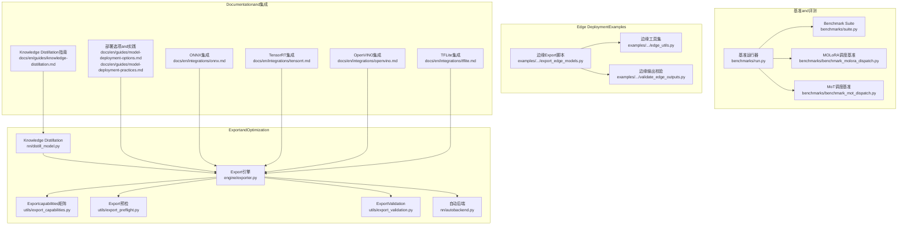
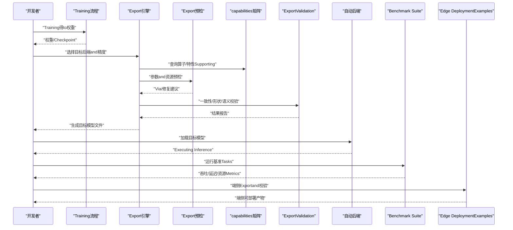
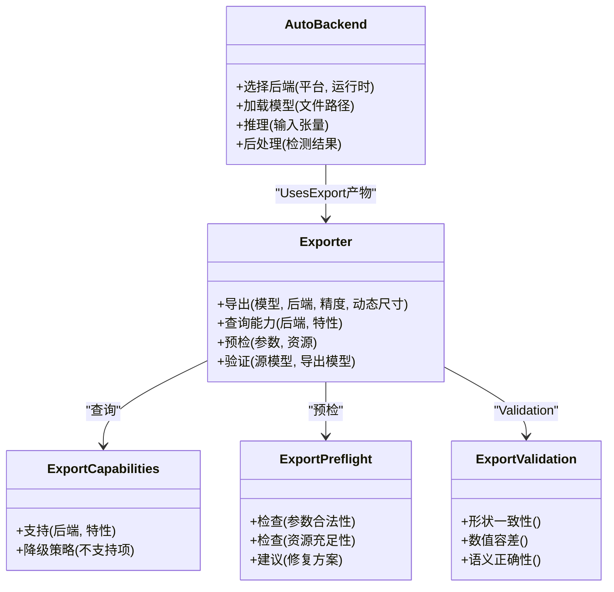
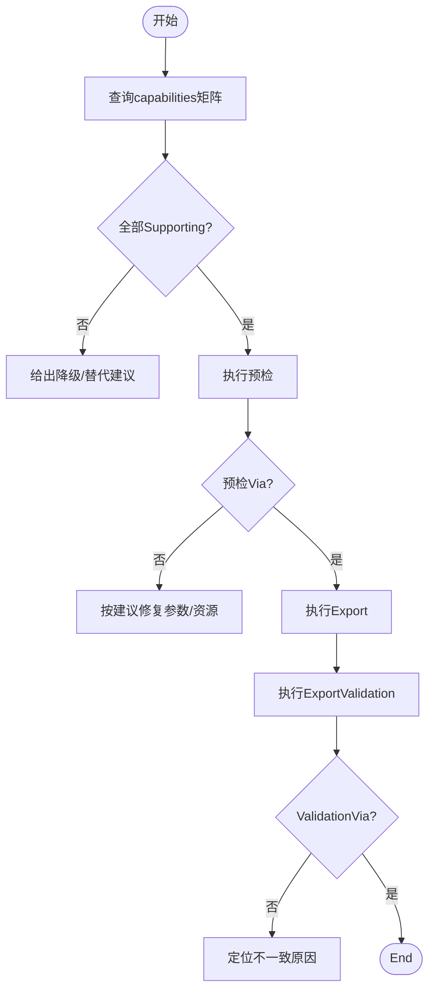
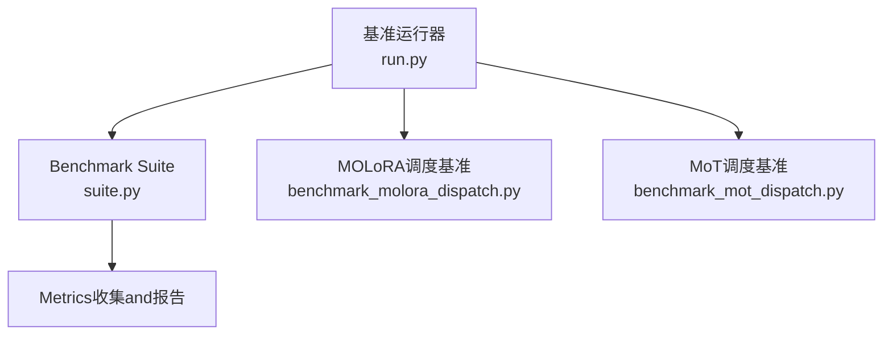
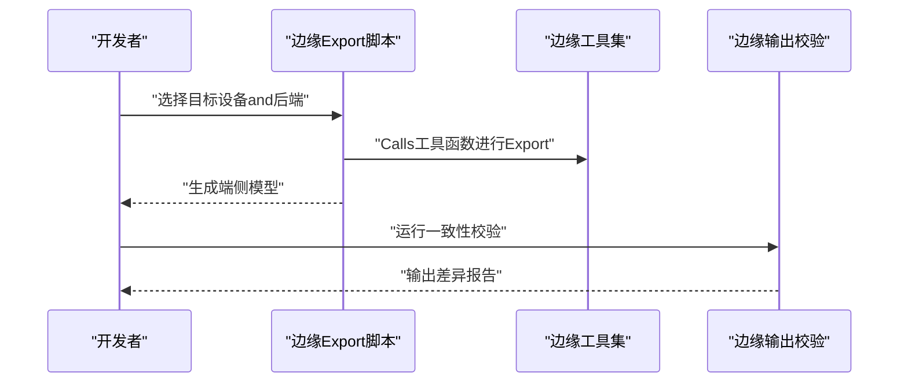
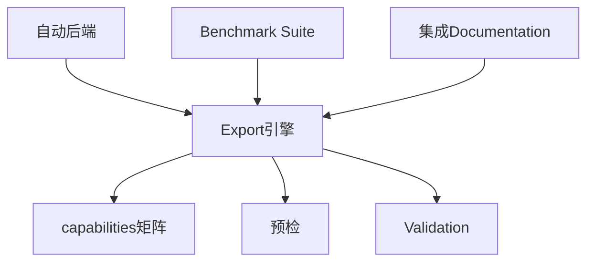

# 性能Optimizationand部署准备

<cite>
**Files Referenced in This Document**
- [exporter.py](file://ultralytics/engine/exporter.py)
- [autobackend.py](file://ultralytics/nn/autobackend.py)
- [distill_model.py](file://ultralytics/nn/distill_model.py)
- [export_capabilities.py](file://ultralytics/utils/export_capabilities.py)
- [export_preflight.py](file://ultralytics/utils/export_preflight.py)
- [export_validation.py](file://ultralytics/utils/export_validation.py)
- [benchmark_molora_dispatch.py](file://benchmarks/benchmark_molora_dispatch.py)
- [benchmark_mot_dispatch.py](file://benchmarks/benchmark_mot_dispatch.py)
- [run.py](file://benchmarks/run.py)
- [suite.py](file://benchmarks/suite.py)
- [yolo_master_edge_deployment_export.py](file://examples/YOLO-Master-Edge-Deployment/export_edge_models.py)
- [edge_utils.py](file://examples/YOLO-Master-Edge-Deployment/edge_utils.py)
- [validate_edge_outputs.py](file://examples/YOLO-Master-Edge-Deployment/validate_edge_outputs.py)
- [knowledge_distillation.md](file://docs/en/guides/knowledge-distillation.md)
- [model-deployment-options.md](file://docs/en/guides/model-deployment-options.md)
- [model-deployment-practices.md](file://docs/en/guides/model-deployment-practices.md)
- [tensorrt.md](file://docs/en/integrations/tensorrt.md)
- [openvino.md](file://docs/en/integrations/openvino.md)
- [tflite.md](file://docs/en/integrations/tflite.md)
- [onnx.md](file://docs/en/integrations/onnx.md)
</cite>

## Table of Contents
1. [Introduction](#Introduction)
2. [Project Structure](#Project Structure)
3. [Core Components](#Core Components)
4. [Architecture Overview](#Architecture Overview)
5. [Detailed Component Analysis](#Detailed Component Analysis)
6. [Dependency Analysis](#Dependency Analysis)
7. [性能考量](#性能考量)
8. [Troubleshooting Guide](#Troubleshooting Guide)
9. [Conclusion](#Conclusion)
10. [Appendix](#Appendix)

## Introduction
本指南targetingObject Detection模型的性能Optimizationand生产部署，围绕量化（INT8、FP16）、剪枝、Knowledge Distillationetc.Optimization技术，Centered onand多格式Export（ONNX、TensorRT、OpenVINO、TFLite）的配置andUses。同时覆盖Edge Device Deployment策略（内存管理、Inference速度Optimization）和生产环境最佳实践（服务化Encapsulates、Monitoring and Alerting、版本管理）。DocumentationCombining仓库中的Export引擎、自动后端选择、Exportcapabilities矩阵、预检andValidation工具、基准Test SuiteCentered onand官方指南进行系统化梳理，帮助读者从Training后Optimizationto端侧/云端部署形成闭环。

## Project Structure
本项目while“Exportand部署”相关的关键路径包括：
- Export引擎andcapabilities矩阵：engine/exporter.py、utils/export_capabilities.py、utils/export_preflight.py、utils/export_validation.py
- 自动后端加载：nn/autobackend.py
- Knowledge Distillation：nn/distill_model.py
- 基准and性能评测：benchmarks/*.py
- Edge DeploymentExamples：examples/YOLO-Master-Edge-Deployment/*
- 官方指南and集成Documentation：docs/en/guides/*、docs/en/integrations/*



Figure Source
- [exporter.py](file://ultralytics/engine/exporter.py)
- [export_capabilities.py](file://ultralytics/utils/export_capabilities.py)
- [export_preflight.py](file://ultralytics/utils/export_preflight.py)
- [export_validation.py](file://ultralytics/utils/export_validation.py)
- [autobackend.py](file://ultralytics/nn/autobackend.py)
- [distill_model.py](file://ultralytics/nn/distill_model.py)
- [run.py](file://benchmarks/run.py)
- [suite.py](file://benchmarks/suite.py)
- [benchmark_molora_dispatch.py](file://benchmarks/benchmark_molora_dispatch.py)
- [benchmark_mot_dispatch.py](file://benchmarks/benchmark_mot_dispatch.py)
- [yolo_master_edge_deployment_export.py](file://examples/YOLO-Master-Edge-Deployment/export_edge_models.py)
- [edge_utils.py](file://examples/YOLO-Master-Edge-Deployment/edge_utils.py)
- [validate_edge_outputs.py](file://examples/YOLO-Master-Edge-Deployment/validate_edge_outputs.py)
- [knowledge_distillation.md](file://docs/en/guides/knowledge-distillation.md)
- [model-deployment-options.md](file://docs/en/guides/model-deployment-options.md)
- [model-deployment-practices.md](file://docs/en/guides/model-deployment-practices.md)
- [onnx.md](file://docs/en/integrations/onnx.md)
- [tensorrt.md](file://docs/en/integrations/tensorrt.md)
- [openvino.md](file://docs/en/integrations/openvino.md)
- [tflite.md](file://docs/en/integrations/tflite.md)

Section Source
- [exporter.py](file://ultralytics/engine/exporter.py)
- [export_capabilities.py](file://ultralytics/utils/export_capabilities.py)
- [export_preflight.py](file://ultralytics/utils/export_preflight.py)
- [export_validation.py](file://ultralytics/utils/export_validation.py)
- [autobackend.py](file://ultralytics/nn/autobackend.py)
- [distill_model.py](file://ultralytics/nn/distill_model.py)
- [run.py](file://benchmarks/run.py)
- [suite.py](file://benchmarks/suite.py)
- [benchmark_molora_dispatch.py](file://benchmarks/benchmark_molora_dispatch.py)
- [benchmark_mot_dispatch.py](file://benchmarks/benchmark_mot_dispatch.py)
- [yolo_master_edge_deployment_export.py](file://examples/YOLO-Master-Edge-Deployment/export_edge_models.py)
- [edge_utils.py](file://examples/YOLO-Master-Edge-Deployment/edge_utils.py)
- [validate_edge_outputs.py](file://examples/YOLO-Master-Edge-Deployment/validate_edge_outputs.py)
- [knowledge_distillation.md](file://docs/en/guides/knowledge-distillation.md)
- [model-deployment-options.md](file://docs/en/guides/model-deployment-options.md)
- [model-deployment-practices.md](file://docs/en/guides/model-deployment-practices.md)
- [onnx.md](file://docs/en/integrations/onnx.md)
- [tensorrt.md](file://docs/en/integrations/tensorrt.md)
- [openvino.md](file://docs/en/integrations/openvino.md)
- [tflite.md](file://docs/en/integrations/tflite.md)

## Core Components
- Export引擎（Exporter）：统一Encapsulates多种后端Export流程，协调图转换、算子Supporting检查、精度配置and权重序列化。
- 自动后端（AutoBackend）：根据目标平台and可用运行时动态选择最优执行后端，并处理输入输出形状、数据类型andNMSetc.Post-Processing适配。
- Exportcapabilities矩阵（ExportCapabilities）：维护各后端对模型特性（such as动态尺寸、特定算子、精度模式）的Supporting情况，用于预检and降级策略。
- Export预检（ExportPreflight）：while正式Export前进行兼容性、资源and参数校验，避免失败或低质量Export。
- ExportValidation（ExportValidation）：对比源模型andExport模型的数值一致性、形状and语义正确性，保障Export可靠性。
- Knowledge Distillation（DistillModel）：provides教师-学生框架andLoss combination，便于whileTraining阶段压缩模型容量或提升小模型性能。
- Benchmark Suite（Benchmarks）：provides跨后端、跨Tasks的吞吐/延迟Evaluation入口，辅助定位bottlenecksand回归。
- Edge DeploymentExamples：providestargeting端侧的Export脚本、工具函数and输出校验流程，便于快速落地。

Section Source
- [exporter.py](file://ultralytics/engine/exporter.py)
- [autobackend.py](file://ultralytics/nn/autobackend.py)
- [export_capabilities.py](file://ultralytics/utils/export_capabilities.py)
- [export_preflight.py](file://ultralytics/utils/export_preflight.py)
- [export_validation.py](file://ultralytics/utils/export_validation.py)
- [distill_model.py](file://ultralytics/nn/distill_model.py)
- [run.py](file://benchmarks/run.py)
- [suite.py](file://benchmarks/suite.py)
- [benchmark_molora_dispatch.py](file://benchmarks/benchmark_molora_dispatch.py)
- [benchmark_mot_dispatch.py](file://benchmarks/benchmark_mot_dispatch.py)
- [yolo_master_edge_deployment_export.py](file://examples/YOLO-Master-Edge-Deployment/export_edge_models.py)
- [edge_utils.py](file://examples/YOLO-Master-Edge-Deployment/edge_utils.py)
- [validate_edge_outputs.py](file://examples/YOLO-Master-Edge-Deployment/validate_edge_outputs.py)

## Architecture Overview
下图展示从Training完成to多后端部署的整体流程：Training后的权重经Export引擎转换for中间或目标格式，随后由自动后端while不同平台上加载and执行；Export前后Viacapabilities矩阵、预检andValidation确保一致性and可用性；Benchmark Suite贯穿Optimizationand部署过程，持续度量性能变化。



Figure Source
- [exporter.py](file://ultralytics/engine/exporter.py)
- [export_capabilities.py](file://ultralytics/utils/export_capabilities.py)
- [export_preflight.py](file://ultralytics/utils/export_preflight.py)
- [export_validation.py](file://ultralytics/utils/export_validation.py)
- [autobackend.py](file://ultralytics/nn/autobackend.py)
- [run.py](file://benchmarks/run.py)
- [suite.py](file://benchmarks/suite.py)
- [yolo_master_edge_deployment_export.py](file://examples/YOLO-Master-Edge-Deployment/export_edge_models.py)

## Detailed Component Analysis

### Export引擎and自动后端
- 职责分工
  - Export引擎负责将PyTorch模型转换for指定后端格式，协调精度设置、动态维度、NMSandPost-ProcessingModules的嵌入。
  - 自动后端负责while运行时选择最合适的执行环境，并对输入预处理、输出解析进行适配。
- 关键交互
  - Export前Callscapabilities矩阵and预检，确认目标后端是否Supporting当前模型结构and参数。
  - Export后进行一致性Validation，确保数值and形状符合预期。
  - 运行时由自动后端Load model，屏蔽不同后端差异，providesUnified Interface。



Figure Source
- [exporter.py](file://ultralytics/engine/exporter.py)
- [autobackend.py](file://ultralytics/nn/autobackend.py)
- [export_capabilities.py](file://ultralytics/utils/export_capabilities.py)
- [export_preflight.py](file://ultralytics/utils/export_preflight.py)
- [export_validation.py](file://ultralytics/utils/export_validation.py)

Section Source
- [exporter.py](file://ultralytics/engine/exporter.py)
- [autobackend.py](file://ultralytics/nn/autobackend.py)
- [export_capabilities.py](file://ultralytics/utils/export_capabilities.py)
- [export_preflight.py](file://ultralytics/utils/export_preflight.py)
- [export_validation.py](file://ultralytics/utils/export_validation.py)

### Exportcapabilities矩阵and预检/Validation
- capabilities矩阵
  - 维护各后端对动态尺寸、Mixture精度、特定算子（such as自定义NMS）的Supporting状态。
  - forExport决策provides依据，必要时触发降级或替换策略。
- 预检
  - 校验Export参数（such as输入尺寸、精度、NMS阈值）and系统资源（显存/CPU内存）。
  - 给出修复建议，减少无效Export尝试。
- Validation
  - 对比源模型andExport模型的输出分布、边界框and类别置信度，确保端to端一致性。



Figure Source
- [export_capabilities.py](file://ultralytics/utils/export_capabilities.py)
- [export_preflight.py](file://ultralytics/utils/export_preflight.py)
- [export_validation.py](file://ultralytics/utils/export_validation.py)

Section Source
- [export_capabilities.py](file://ultralytics/utils/export_capabilities.py)
- [export_preflight.py](file://ultralytics/utils/export_preflight.py)
- [export_validation.py](file://ultralytics/utils/export_validation.py)

### Knowledge Distillation
- 目标
  - Via教师模型指导小模型学习，提升小模型精度或稳定性，间接降低部署成本。
- implementing要点
  - 定义教师and学生模型、Loss combination（分类/回归/特征对齐），并whileTraining循环中联合Optimization。
  - andExport流程衔接：蒸馏后可直接Export轻量化模型至目标后端。
- Refer toDocumentation
  - 指南Documentationprovides蒸馏思路、配置and实验方法，便于快速上手。

```mermaid
sequenceDiagram
participant T as "教师模型"
participant S as "学生模型"
participant L as "蒸馏损失"
participant Opt as "Optimizer"
participant Exp as "Export引擎"
T->>S : "provides软标签/特征"
S->>L : "计算蒸馏损失"
L->>Opt : "Gradient更新学生模型"
Opt-->>S : "更新权重"
S-->>Exp : "Training完成后Export"
```

Figure Source
- [distill_model.py](file://ultralytics/nn/distill_model.py)
- [knowledge_distillation.md](file://docs/en/guides/knowledge-distillation.md)

Section Source
- [distill_model.py](file://ultralytics/nn/distill_model.py)
- [knowledge_distillation.md](file://docs/en/guides/knowledge-distillation.md)

### 基准and性能评测
- 基准运行器and套件
  - provides统一的基准入口andTasks编排，Supporting跨后端、跨数据集的吞吐/延迟测量。
  - 针对复杂场景（such asMOLoRA调度、Multi-Object Tracking）provides专用基准脚本，便于定位热点路径。
- Uses建议
  - whileOptimization前后分别运行基准，记录关键Metrics（FPS、P95/P99延迟、内存占用）。
  - CombiningExportValidation结果，确保性能提升不牺牲精度。



Figure Source
- [run.py](file://benchmarks/run.py)
- [suite.py](file://benchmarks/suite.py)
- [benchmark_molora_dispatch.py](file://benchmarks/benchmark_molora_dispatch.py)
- [benchmark_mot_dispatch.py](file://benchmarks/benchmark_mot_dispatch.py)

Section Source
- [run.py](file://benchmarks/run.py)
- [suite.py](file://benchmarks/suite.py)
- [benchmark_molora_dispatch.py](file://benchmarks/benchmark_molora_dispatch.py)
- [benchmark_mot_dispatch.py](file://benchmarks/benchmark_mot_dispatch.py)

### Edge DeploymentExamples
- 边缘Export脚本
  - targeting端侧设备的批量Exportand参数调优，涵盖常见后端and精度配置。
- 边缘工具集
  - provides数据预处理、模型加载、InferenceEncapsulatesandVisualization辅助函数。
- 边缘输出校验
  - 对比云端and端侧输出，确保一致性，便于问题定位。



Figure Source
- [yolo_master_edge_deployment_export.py](file://examples/YOLO-Master-Edge-Deployment/export_edge_models.py)
- [edge_utils.py](file://examples/YOLO-Master-Edge-Deployment/edge_utils.py)
- [validate_edge_outputs.py](file://examples/YOLO-Master-Edge-Deployment/validate_edge_outputs.py)

Section Source
- [yolo_master_edge_deployment_export.py](file://examples/YOLO-Master-Edge-Deployment/export_edge_models.py)
- [edge_utils.py](file://examples/YOLO-Master-Edge-Deployment/edge_utils.py)
- [validate_edge_outputs.py](file://examples/YOLO-Master-Edge-Deployment/validate_edge_outputs.py)

## Dependency Analysis
- Export链路依赖
  - Export引擎依赖capabilities矩阵and预检/Validation工具，确保Export的可行性and正确性。
  - 自动后端依赖Export产物，屏蔽后端差异，provides统一Inference接口。
- 基准andOptimization联动
  - Benchmark Suite贯穿Optimization全流程，drivers are installedExport参数and后端选择的迭代调整。
- Documentationand集成
  - 官方指南and集成Documentationfor具体后端（ONNX、TensorRT、OpenVINO、TFLite）provides配置andUses指引。



Figure Source
- [exporter.py](file://ultralytics/engine/exporter.py)
- [export_capabilities.py](file://ultralytics/utils/export_capabilities.py)
- [export_preflight.py](file://ultralytics/utils/export_preflight.py)
- [export_validation.py](file://ultralytics/utils/export_validation.py)
- [autobackend.py](file://ultralytics/nn/autobackend.py)
- [run.py](file://benchmarks/run.py)
- [suite.py](file://benchmarks/suite.py)
- [onnx.md](file://docs/en/integrations/onnx.md)
- [tensorrt.md](file://docs/en/integrations/tensorrt.md)
- [openvino.md](file://docs/en/integrations/openvino.md)
- [tflite.md](file://docs/en/integrations/tflite.md)

Section Source
- [exporter.py](file://ultralytics/engine/exporter.py)
- [export_capabilities.py](file://ultralytics/utils/export_capabilities.py)
- [export_preflight.py](file://ultralytics/utils/export_preflight.py)
- [export_validation.py](file://ultralytics/utils/export_validation.py)
- [autobackend.py](file://ultralytics/nn/autobackend.py)
- [run.py](file://benchmarks/run.py)
- [suite.py](file://benchmarks/suite.py)
- [onnx.md](file://docs/en/integrations/onnx.md)
- [tensorrt.md](file://docs/en/integrations/tensorrt.md)
- [openvino.md](file://docs/en/integrations/openvino.md)
- [tflite.md](file://docs/en/integrations/tflite.md)

## 性能考量
- 量化（INT8、FP16）
  - INT8：显著降低内存带宽and存储体积，适合CPU/嵌入式设备；需关注校准数据代表性andNMS精度影响。
  - FP16：whileGPU/部分加速器上获得更高吞吐，注意数值稳定性and回退策略。
- 剪枝
  - 结构化剪枝更易被后端加速，非结构化剪枝需Combined with稀疏算子或重排策略。
  - 剪枝后需重新微调Centered on恢复精度，再进入ExportandValidation流程。
- Knowledge Distillation
  - 作forTraining期压缩手段，可and量化/剪枝组合，进一步提升小模型性能。
- Exportand后端选择
  - Prefercapabilities矩阵and预检规避不Supporting特性；必要时采用降级策略（such as关闭动态尺寸、替换算子）。
  - 自动后端while运行时选择最优执行路径，减少手动适配成本。
- 基准and回归
  - 建立固定基准Tasksand数据集，定期运行Centered on捕获性能回归。
  - 记录关键Metrics并纳入CI，确保Optimization收益稳定。

[本节for通用性能讨论，无需列出具体文件来源]

## Troubleshooting Guide
- Export Failure
  - 检查capabilities矩阵是否Supporting目标特性；查看预检报告中的修复建议。
  - 若出现算子不Supporting，考虑替换或禁用相关功能，再进行Export。
- 一致性异常
  - UsesExportValidation工具对比源模型andExport模型输出，定位差异范围（形状、数值、语义）。
  - 逐步缩小范围，检查NMS阈值、输入归一化、动态尺寸处理。
- 性能不达预期
  - 运行Benchmark Suite，识别热点路径；对比不同后端and精度的表现。
  - 检查内存占用and缓存命中，必要时调整批大小and输入分辨率。
- Edge Deployment问题
  - Uses边缘输出校验工具对比云端and端侧结果，定位差异来源。
  - 检查端侧运行时版本and依赖，确保andExport时一致。

Section Source
- [export_capabilities.py](file://ultralytics/utils/export_capabilities.py)
- [export_preflight.py](file://ultralytics/utils/export_preflight.py)
- [export_validation.py](file://ultralytics/utils/export_validation.py)
- [run.py](file://benchmarks/run.py)
- [suite.py](file://benchmarks/suite.py)
- [validate_edge_outputs.py](file://examples/YOLO-Master-Edge-Deployment/validate_edge_outputs.py)

## Conclusion
Via将Export引擎、capabilities矩阵、预检andValidation、自动后端andBenchmark Suite有机Combining，本项目forYOLO系列Object Detection模型provides了从Training后Optimizationto多后端部署的完整闭环。CombiningKnowledge Distillation、量化and剪枝etc.技术，可while保证精度的前提下显著提升部署效率。Edge DeploymentExamplesand官方集成Documentation进一步降低了落地门槛，使生产环境的性能and稳定性可控、可测、可复现。

[本节for总结性内容，无需列出具体文件来源]

## Appendix
- 多格式Exportand集成Refer to
  - ONNX：适用于跨平台Inference，便于后续转换for其他后端。
  - TensorRT：GPU高吞吐场景首选，需关注算子Supportingand精度配置。
  - OpenVINO：Intel CPU/NPUOptimization良好，适合服务器and边缘CPU设备。
  - TFLite：移动端and嵌入式设备友好，需注意动态尺寸andNMSSupporting。
- 部署实践
  - 服务化Encapsulates：统一API接口、请求队列and超时控制。
  - Monitoring and Alerting：采集吞吐、延迟、错误率and资源Uses，设置阈值告警。
  - 版本管理：模型and运行时版本绑定，灰度发布and回滚策略。

Section Source
- [onnx.md](file://docs/en/integrations/onnx.md)
- [tensorrt.md](file://docs/en/integrations/tensorrt.md)
- [openvino.md](file://docs/en/integrations/openvino.md)
- [tflite.md](file://docs/en/integrations/tflite.md)
- [model-deployment-options.md](file://docs/en/guides/model-deployment-options.md)
- [model-deployment-practices.md](file://docs/en/guides/model-deployment-practices.md)