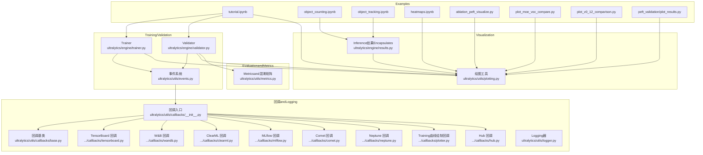
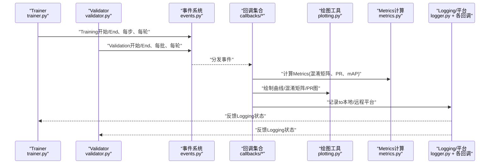
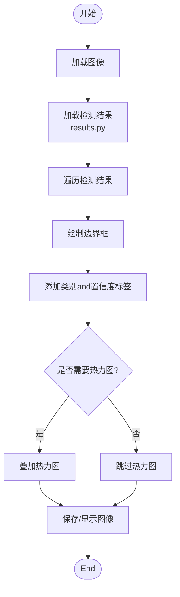
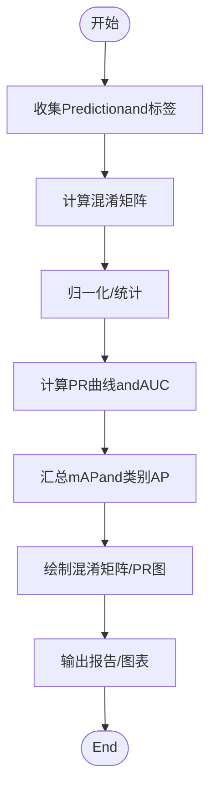
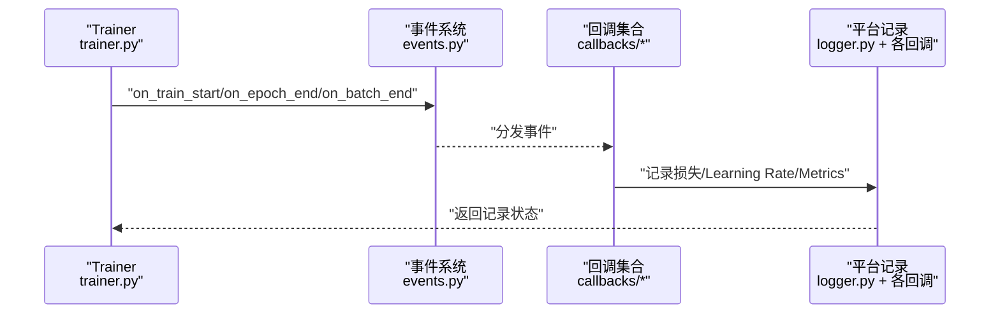
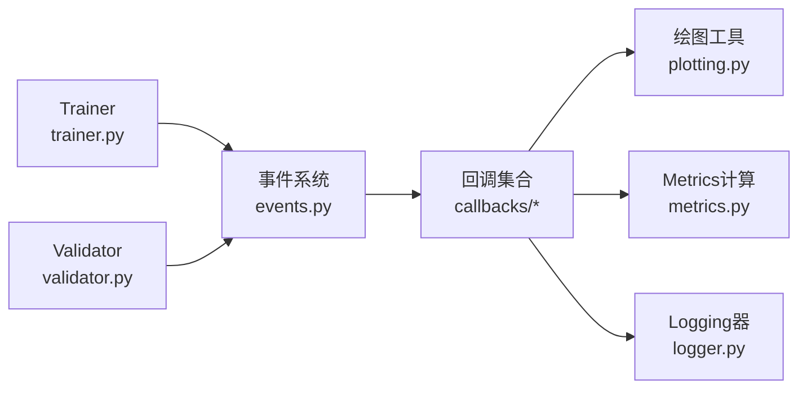

# 结果Visualizationand调试

<cite>
**Files Referenced in This Document**
- [ultralytics/utils/plotting.py](file://ultralytics/utils/plotting.py)
- [ultralytics/utils/metrics.py](file://ultralytics/utils/metrics.py)
- [ultralytics/engine/trainer.py](file://ultralytics/engine/trainer.py)
- [ultralytics/engine/validator.py](file://ultralytics/engine/validator.py)
- [ultralytics/engine/results.py](file://ultralytics/engine/results.py)
- [ultralytics/utils/callbacks/__init__.py](file://ultralytics/utils/callbacks/__init__.py)
- [ultralytics/utils/callbacks/base.py](file://ultralytics/utils/callbacks/base.py)
- [ultralytics/utils/callbacks/tensorboard.py](file://ultralytics/utils/callbacks/tensorboard.py)
- [ultralytics/utils/callbacks/clearml.py](file://ultralytics/utils/callbacks/clearml.py)
- [ultralytics/utils/callbacks/wandb.py](file://ultralytics/utils/callbacks/wandb.py)
- [ultralytics/utils/callbacks/mlflow.py](file://ultralytics/utils/callbacks/mlflow.py)
- [ultralytics/utils/callbacks/comet.py](file://ultralytics/utils/callbacks/comet.py)
- [ultralytics/utils/callbacks/neptune.py](file://ultralytics/utils/callbacks/neptune.py)
- [ultralytics/utils/callbacks/plotter.py](file://ultralytics/utils/callbacks/plotter.py)
- [ultralytics/utils/callbacks/hub.py](file://ultralytics/utils/callbacks/hub.py)
- [ultralytics/utils/events.py](file://ultralytics/utils/events.py)
- [ultralytics/utils/logger.py](file://ultralytics/utils/logger.py)
- [examples/tutorial.ipynb](file://examples/tutorial.ipynb)
- [examples/object_counting.ipynb](file://examples/object_counting.ipynb)
- [examples/object_tracking.ipynb](file://examples/object_tracking.ipynb)
- [examples/heatmaps.ipynb](file://examples/heatmaps.ipynb)
- [scripts/ablation_suite/ablation_peft_visualize.py](file://scripts/ablation_suite/ablation_peft_visualize.py)
- [scripts/plot_moe_voc_compare.py](file://scripts/plot_moe_voc_compare.py)
- [scripts/plot_v0_12_comparison.py](file://scripts/plot_v0_12_comparison.py)
- [scripts/peft_validation/plot_results.py](file://scripts/peft_validation/plot_results.py)
</cite>

## Table of Contents
1. [Introduction](#Introduction)
2. [Project Structure](#Project Structure)
3. [Core Components](#Core Components)
4. [Architecture Overview](#Architecture Overview)
5. [Detailed Component Analysis](#Detailed Component Analysis)
6. [Dependency Analysis](#Dependency Analysis)
7. [性能考量](#性能考量)
8. [Troubleshooting Guide](#Troubleshooting Guide)
9. [Conclusion](#Conclusion)
10. [Appendix](#Appendix)

## Introduction
本指南聚焦于Object Detection结果Visualizationand调试的实用方法，覆盖检测框绘制、Confidence Threshold调整、类别标签显示、混淆矩阵生成and解读、Training过程监控（损失曲线、Learning Rate变化）etc.。同时provides常见问题诊断思路，such as过拟合、欠拟合、数据不平衡etc.的识别and解决建议。内容基于仓库中Visualization、Metrics计算、回调andLogging相关implementing进行梳理，帮助读者快速定位问题并Optimization模型表现。

## Project Structure
围绕“结果Visualizationand调试”的关键代码主要分布whileCentered on下Modules：
- Visualization绘图：绘图工具and图表生成
- MetricsandEvaluation：混淆矩阵、PR/AUC、mAP etc.
- Training/Validation流程：事件触发、Metrics写入、回调机制
- 回调集成：TensorBoard、Weights & Biases、ClearML、MLflow、Comet、Neptune etc.
- Examples脚本：Jupyter Notebook and Python 脚本用于端to端演示

Figure Source
- [ultralytics/utils/plotting.py](file://ultralytics/utils/plotting.py)
- [ultralytics/utils/metrics.py](file://ultralytics/utils/metrics.py)
- [ultralytics/engine/trainer.py](file://ultralytics/engine/trainer.py)
- [ultralytics/engine/validator.py](file://ultralytics/engine/validator.py)
- [ultralytics/engine/results.py](file://ultralytics/engine/results.py)
- [ultralytics/utils/callbacks/__init__.py](file://ultralytics/utils/callbacks/__init__.py)
- [ultralytics/utils/callbacks/base.py](file://ultralytics/utils/callbacks/base.py)
- [ultralytics/utils/callbacks/tensorboard.py](file://ultralytics/utils/callbacks/tensorboard.py)
- [ultralytics/utils/callbacks/wandb.py](file://ultralytics/utils/callbacks/wandb.py)
- [ultralytics/utils/callbacks/clearml.py](file://ultralytics/utils/callbacks/clearml.py)
- [ultralytics/utils/callbacks/mlflow.py](file://ultralytics/utils/callbacks/mlflow.py)
- [ultralytics/utils/callbacks/comet.py](file://ultralytics/utils/callbacks/comet.py)
- [ultralytics/utils/callbacks/neptune.py](file://ultralytics/utils/callbacks/neptune.py)
- [ultralytics/utils/callbacks/plotter.py](file://ultralytics/utils/callbacks/plotter.py)
- [ultralytics/utils/callbacks/hub.py](file://ultralytics/utils/callbacks/hub.py)
- [ultralytics/utils/events.py](file://ultralytics/utils/events.py)
- [ultralytics/utils/logger.py](file://ultralytics/utils/logger.py)
- [examples/tutorial.ipynb](file://examples/tutorial.ipynb)
- [examples/object_counting.ipynb](file://examples/object_counting.ipynb)
- [examples/object_tracking.ipynb](file://examples/object_tracking.ipynb)
- [examples/heatmaps.ipynb](file://examples/heatmaps.ipynb)
- [scripts/ablation_suite/ablation_peft_visualize.py](file://scripts/ablation_suite/ablation_peft_visualize.py)
- [scripts/plot_moe_voc_compare.py](file://scripts/plot_moe_voc_compare.py)
- [scripts/plot_v0_12_comparison.py](file://scripts/plot_v0_12_comparison.py)
- [scripts/peft_validation/plot_results.py](file://scripts/peft_validation/plot_results.py)

Section Source
- [ultralytics/utils/plotting.py](file://ultralytics/utils/plotting.py)
- [ultralytics/utils/metrics.py](file://ultralytics/utils/metrics.py)
- [ultralytics/engine/trainer.py](file://ultralytics/engine/trainer.py)
- [ultralytics/engine/validator.py](file://ultralytics/engine/validator.py)
- [ultralytics/engine/results.py](file://ultralytics/engine/results.py)
- [ultralytics/utils/callbacks/__init__.py](file://ultralytics/utils/callbacks/__init__.py)
- [ultralytics/utils/callbacks/base.py](file://ultralytics/utils/callbacks/base.py)
- [ultralytics/utils/callbacks/tensorboard.py](file://ultralytics/utils/callbacks/tensorboard.py)
- [ultralytics/utils/callbacks/wandb.py](file://ultralytics/utils/callbacks/wandb.py)
- [ultralytics/utils/callbacks/clearml.py](file://ultralytics/utils/callbacks/clearml.py)
- [ultralytics/utils/callbacks/mlflow.py](file://ultralytics/utils/callbacks/mlflow.py)
- [ultralytics/utils/callbacks/comet.py](file://ultralytics/utils/callbacks/comet.py)
- [ultralytics/utils/callbacks/neptune.py](file://ultralytics/utils/callbacks/neptune.py)
- [ultralytics/utils/callbacks/plotter.py](file://ultralytics/utils/callbacks/plotter.py)
- [ultralytics/utils/callbacks/hub.py](file://ultralytics/utils/callbacks/hub.py)
- [ultralytics/utils/events.py](file://ultralytics/utils/events.py)
- [ultralytics/utils/logger.py](file://ultralytics/utils/logger.py)
- [examples/tutorial.ipynb](file://examples/tutorial.ipynb)
- [examples/object_counting.ipynb](file://examples/object_counting.ipynb)
- [examples/object_tracking.ipynb](file://examples/object_tracking.ipynb)
- [examples/heatmaps.ipynb](file://examples/heatmaps.ipynb)
- [scripts/ablation_suite/ablation_peft_visualize.py](file://scripts/ablation_suite/ablation_peft_visualize.py)
- [scripts/plot_moe_voc_compare.py](file://scripts/plot_moe_voc_compare.py)
- [scripts/plot_v0_12_comparison.py](file://scripts/plot_v0_12_comparison.py)
- [scripts/peft_validation/plot_results.py](file://scripts/peft_validation/plot_results.py)

## Core Components
- Visualization绘图
  - 负责将检测结果渲染for图像，包括边界框、类别标签、置信度标注、热力图etc.。
  - Refer to路径：[ultralytics/utils/plotting.py](file://ultralytics/utils/plotting.py)
- Inference结果Encapsulates
  - 统一EncapsulatesPrediction输出（框、分数、类别、掩码etc.），便于后续VisualizationandExport。
  - Refer to路径：[ultralytics/engine/results.py](file://ultralytics/engine/results.py)
- Metricsand混淆矩阵
  - 计算混淆矩阵、PR 曲线、AUC、各类 mAP etc.，Supporting按类别统计and汇总。
  - Refer to路径：[ultralytics/utils/metrics.py](file://ultralytics/utils/metrics.py)
- Training/Validation流程and事件
  - TrainerandValidatorwhile关键阶段触发事件，drivers are installed回调记录Metrics、保存图表andLogging。
  - Refer to路径：[ultralytics/engine/trainer.py](file://ultralytics/engine/trainer.py)、[ultralytics/engine/validator.py](file://ultralytics/engine/validator.py)、[ultralytics/utils/events.py](file://ultralytics/utils/events.py)
- 回调and外部平台集成
  - Via回调机制对接 TensorBoard、W&B、ClearML、MLflow、Comet、Neptune etc.，自动记录Training曲线、Learning Rate、混淆矩阵、PR 曲线etc.。
  - Refer to路径：
    - [ultralytics/utils/callbacks/__init__.py](file://ultralytics/utils/callbacks/__init__.py)
    - [ultralytics/utils/callbacks/base.py](file://ultralytics/utils/callbacks/base.py)
    - [ultralytics/utils/callbacks/tensorboard.py](file://ultralytics/utils/callbacks/tensorboard.py)
    - [ultralytics/utils/callbacks/wandb.py](file://ultralytics/utils/callbacks/wandb.py)
    - [ultralytics/utils/callbacks/clearml.py](file://ultralytics/utils/callbacks/clearml.py)
    - [ultralytics/utils/callbacks/mlflow.py](file://ultralytics/utils/callbacks/mlflow.py)
    - [ultralytics/utils/callbacks/comet.py](file://ultralytics/utils/callbacks/comet.py)
    - [ultralytics/utils/callbacks/neptune.py](file://ultralytics/utils/callbacks/neptune.py)
    - [ultralytics/utils/callbacks/plotter.py](file://ultralytics/utils/callbacks/plotter.py)
    - [ultralytics/utils/callbacks/hub.py](file://ultralytics/utils/callbacks/hub.py)
- Examplesand脚本
  - Jupyter Notebook and Python 脚本展示Visualizationand对比分析用法。
  - Refer to路径：
    - [examples/tutorial.ipynb](file://examples/tutorial.ipynb)
    - [examples/object_counting.ipynb](file://examples/object_counting.ipynb)
    - [examples/object_tracking.ipynb](file://examples/object_tracking.ipynb)
    - [examples/heatmaps.ipynb](file://examples/heatmaps.ipynb)
    - [scripts/ablation_suite/ablation_peft_visualize.py](file://scripts/ablation_suite/ablation_peft_visualize.py)
    - [scripts/plot_moe_voc_compare.py](file://scripts/plot_moe_voc_compare.py)
    - [scripts/plot_v0_12_comparison.py](file://scripts/plot_v0_12_comparison.py)
    - [scripts/peft_validation/plot_results.py](file://scripts/peft_validation/plot_results.py)

Section Source
- [ultralytics/utils/plotting.py](file://ultralytics/utils/plotting.py)
- [ultralytics/engine/results.py](file://ultralytics/engine/results.py)
- [ultralytics/utils/metrics.py](file://ultralytics/utils/metrics.py)
- [ultralytics/engine/trainer.py](file://ultralytics/engine/trainer.py)
- [ultralytics/engine/validator.py](file://ultralytics/engine/validator.py)
- [ultralytics/utils/events.py](file://ultralytics/utils/events.py)
- [ultralytics/utils/callbacks/__init__.py](file://ultralytics/utils/callbacks/__init__.py)
- [ultralytics/utils/callbacks/base.py](file://ultralytics/utils/callbacks/base.py)
- [ultralytics/utils/callbacks/tensorboard.py](file://ultralytics/utils/callbacks/tensorboard.py)
- [ultralytics/utils/callbacks/wandb.py](file://ultralytics/utils/callbacks/wandb.py)
- [ultralytics/utils/callbacks/clearml.py](file://ultralytics/utils/callbacks/clearml.py)
- [ultralytics/utils/callbacks/mlflow.py](file://ultralytics/utils/callbacks/mlflow.py)
- [ultralytics/utils/callbacks/comet.py](file://ultralytics/utils/callbacks/comet.py)
- [ultralytics/utils/callbacks/neptune.py](file://ultralytics/utils/callbacks/neptune.py)
- [ultralytics/utils/callbacks/plotter.py](file://ultralytics/utils/callbacks/plotter.py)
- [ultralytics/utils/callbacks/hub.py](file://ultralytics/utils/callbacks/hub.py)
- [examples/tutorial.ipynb](file://examples/tutorial.ipynb)
- [examples/object_counting.ipynb](file://examples/object_counting.ipynb)
- [examples/object_tracking.ipynb](file://examples/object_tracking.ipynb)
- [examples/heatmaps.ipynb](file://examples/heatmaps.ipynb)
- [scripts/ablation_suite/ablation_peft_visualize.py](file://scripts/ablation_suite/ablation_peft_visualize.py)
- [scripts/plot_moe_voc_compare.py](file://scripts/plot_moe_voc_compare.py)
- [scripts/plot_v0_12_comparison.py](file://scripts/plot_v0_12_comparison.py)
- [scripts/peft_validation/plot_results.py](file://scripts/peft_validation/plot_results.py)

## Architecture Overview
下图展示了从Training/ValidationtoVisualizationandLogging的完整链路：TrainerandValidatorwhile关键节点触发事件，回调订阅事件并Calls绘图andMetricsModules，最终输出图表andLogging至本地或第三方平台。

Figure Source
- [ultralytics/engine/trainer.py](file://ultralytics/engine/trainer.py)
- [ultralytics/engine/validator.py](file://ultralytics/engine/validator.py)
- [ultralytics/utils/events.py](file://ultralytics/utils/events.py)
- [ultralytics/utils/callbacks/__init__.py](file://ultralytics/utils/callbacks/__init__.py)
- [ultralytics/utils/plotting.py](file://ultralytics/utils/plotting.py)
- [ultralytics/utils/metrics.py](file://ultralytics/utils/metrics.py)
- [ultralytics/utils/logger.py](file://ultralytics/utils/logger.py)

## Detailed Component Analysis

### Visualization组件：检测框绘制and标签显示
- 功能要点
  - 将检测结果（框、分数、类别）渲染to图像上，Supporting添加类别名称and置信度文本。
  - 可配置颜色映射、字体大小、透明度etc.Centered on增强可读性。
  - and热力图、计数、Trackingetc.ExamplesCombiningUses，形成完整的Visualization流水线。
- 典型流程
  - 读取图像and检测Results Object
  - 遍历每个检测项，绘制矩形框and文本标签
  - Optional叠加热力图或轨迹线
- Refer to路径
  - [ultralytics/utils/plotting.py](file://ultralytics/utils/plotting.py)
  - [ultralytics/engine/results.py](file://ultralytics/engine/results.py)
  - [examples/object_counting.ipynb](file://examples/object_counting.ipynb)
  - [examples/object_tracking.ipynb](file://examples/object_tracking.ipynb)
  - [examples/heatmaps.ipynb](file://examples/heatmaps.ipynb)

Figure Source
- [ultralytics/utils/plotting.py](file://ultralytics/utils/plotting.py)
- [ultralytics/engine/results.py](file://ultralytics/engine/results.py)
- [examples/heatmaps.ipynb](file://examples/heatmaps.ipynb)

Section Source
- [ultralytics/utils/plotting.py](file://ultralytics/utils/plotting.py)
- [ultralytics/engine/results.py](file://ultralytics/engine/results.py)
- [examples/object_counting.ipynb](file://examples/object_counting.ipynb)
- [examples/object_tracking.ipynb](file://examples/object_tracking.ipynb)
- [examples/heatmaps.ipynb](file://examples/heatmaps.ipynb)

### Metricsand混淆矩阵：生成and解读
- 功能要点
  - 计算混淆矩阵，统计真阳性、假阳性、假阴性etc.，辅助分析类别间误判情况。
  - 生成 PR 曲线and AUC，Evaluation不同Confidence Threshold下的精度-召回权衡。
  - 汇总 mAP and各类别 AP，定位薄弱类别。
- 典型流程
  - 收集Predictionand真实标签
  - 构建混淆矩阵并归一化
  - 计算 PR 曲线and AUC
  - 输出图表andMetrics摘要
- Refer to路径
  - [ultralytics/utils/metrics.py](file://ultralytics/utils/metrics.py)
  - [ultralytics/utils/callbacks/plotter.py](file://ultralytics/utils/callbacks/plotter.py)

Figure Source
- [ultralytics/utils/metrics.py](file://ultralytics/utils/metrics.py)
- [ultralytics/utils/callbacks/plotter.py](file://ultralytics/utils/callbacks/plotter.py)

Section Source
- [ultralytics/utils/metrics.py](file://ultralytics/utils/metrics.py)
- [ultralytics/utils/callbacks/plotter.py](file://ultralytics/utils/callbacks/plotter.py)

### Training过程监控：损失曲线、Learning Rateand回调
- 功能要点
  - Trainerwhile每步/每轮触发事件，回调记录损失、Learning Rate、Metricsetc.。
  - Supporting多平台记录：TensorBoard、W&B、ClearML、MLflow、Comet、Neptune。
  - Training曲线回调自动生成损失曲线、Learning Rate曲线、Metrics趋势图。
- 典型流程
  - Trainer初始化回调集合
  - Training循环中按事件写入Metrics
  - 回调根据配置选择后端存储andVisualization
- Refer to路径
  - [ultralytics/engine/trainer.py](file://ultralytics/engine/trainer.py)
  - [ultralytics/utils/events.py](file://ultralytics/utils/events.py)
  - [ultralytics/utils/callbacks/__init__.py](file://ultralytics/utils/callbacks/__init__.py)
  - [ultralytics/utils/callbacks/base.py](file://ultralytics/utils/callbacks/base.py)
  - [ultralytics/utils/callbacks/tensorboard.py](file://ultralytics/utils/callbacks/tensorboard.py)
  - [ultralytics/utils/callbacks/wandb.py](file://ultralytics/utils/callbacks/wandb.py)
  - [ultralytics/utils/callbacks/clearml.py](file://ultralytics/utils/callbacks/clearml.py)
  - [ultralytics/utils/callbacks/mlflow.py](file://ultralytics/utils/callbacks/mlflow.py)
  - [ultralytics/utils/callbacks/comet.py](file://ultralytics/utils/callbacks/comet.py)
  - [ultralytics/utils/callbacks/neptune.py](file://ultralytics/utils/callbacks/neptune.py)
  - [ultralytics/utils/callbacks/plotter.py](file://ultralytics/utils/callbacks/plotter.py)
  - [ultralytics/utils/callbacks/hub.py](file://ultralytics/utils/callbacks/hub.py)
  - [ultralytics/utils/logger.py](file://ultralytics/utils/logger.py)

Figure Source
- [ultralytics/engine/trainer.py](file://ultralytics/engine/trainer.py)
- [ultralytics/utils/events.py](file://ultralytics/utils/events.py)
- [ultralytics/utils/callbacks/__init__.py](file://ultralytics/utils/callbacks/__init__.py)
- [ultralytics/utils/callbacks/base.py](file://ultralytics/utils/callbacks/base.py)
- [ultralytics/utils/callbacks/tensorboard.py](file://ultralytics/utils/callbacks/tensorboard.py)
- [ultralytics/utils/callbacks/wandb.py](file://ultralytics/utils/callbacks/wandb.py)
- [ultralytics/utils/callbacks/clearml.py](file://ultralytics/utils/callbacks/clearml.py)
- [ultralytics/utils/callbacks/mlflow.py](file://ultralytics/utils/callbacks/mlflow.py)
- [ultralytics/utils/callbacks/comet.py](file://ultralytics/utils/callbacks/comet.py)
- [ultralytics/utils/callbacks/neptune.py](file://ultralytics/utils/callbacks/neptune.py)
- [ultralytics/utils/callbacks/plotter.py](file://ultralytics/utils/callbacks/plotter.py)
- [ultralytics/utils/callbacks/hub.py](file://ultralytics/utils/callbacks/hub.py)
- [ultralytics/utils/logger.py](file://ultralytics/utils/logger.py)

Section Source
- [ultralytics/engine/trainer.py](file://ultralytics/engine/trainer.py)
- [ultralytics/utils/events.py](file://ultralytics/utils/events.py)
- [ultralytics/utils/callbacks/__init__.py](file://ultralytics/utils/callbacks/__init__.py)
- [ultralytics/utils/callbacks/base.py](file://ultralytics/utils/callbacks/base.py)
- [ultralytics/utils/callbacks/tensorboard.py](file://ultralytics/utils/callbacks/tensorboard.py)
- [ultralytics/utils/callbacks/wandb.py](file://ultralytics/utils/callbacks/wandb.py)
- [ultralytics/utils/callbacks/clearml.py](file://ultralytics/utils/callbacks/clearml.py)
- [ultralytics/utils/callbacks/mlflow.py](file://ultralytics/utils/callbacks/mlflow.py)
- [ultralytics/utils/callbacks/comet.py](file://ultralytics/utils/callbacks/comet.py)
- [ultralytics/utils/callbacks/neptune.py](file://ultralytics/utils/callbacks/neptune.py)
- [ultralytics/utils/callbacks/plotter.py](file://ultralytics/utils/callbacks/plotter.py)
- [ultralytics/utils/callbacks/hub.py](file://ultralytics/utils/callbacks/hub.py)
- [ultralytics/utils/logger.py](file://ultralytics/utils/logger.py)

### Examplesand脚本：端to端Visualizationand对比分析
- Jupyter Notebook
  - tutorial.ipynb：基础Training/ValidationandVisualization流程
  - object_counting.ipynb：目标计数andVisualization
  - object_tracking.ipynb：目标TrackingandVisualization
  - heatmaps.ipynb：热力图叠加andVisualization
- Python 脚本
  - ablation_peft_visualize.py：消融实验Visualization
  - plot_moe_voc_compare.py：Mixture-of-Experts 对比绘图
  - plot_v0_12_comparison.py：版本对比绘图
  - peft_validation/plot_results.py：PEFT Validation结果绘图

Section Source
- [examples/tutorial.ipynb](file://examples/tutorial.ipynb)
- [examples/object_counting.ipynb](file://examples/object_counting.ipynb)
- [examples/object_tracking.ipynb](file://examples/object_tracking.ipynb)
- [examples/heatmaps.ipynb](file://examples/heatmaps.ipynb)
- [scripts/ablation_suite/ablation_peft_visualize.py](file://scripts/ablation_suite/ablation_peft_visualize.py)
- [scripts/plot_moe_voc_compare.py](file://scripts/plot_moe_voc_compare.py)
- [scripts/plot_v0_12_comparison.py](file://scripts/plot_v0_12_comparison.py)
- [scripts/peft_validation/plot_results.py](file://scripts/peft_validation/plot_results.py)

## Dependency Analysis
- 耦合and内聚
  - Trainer/Validatorand事件系统松耦合，Via回调扩展capabilities，提升内聚性and可维护性。
  - 绘图andMetricsModules被回调集中Calls，职责清晰。
- External Dependencies
  - 多平台回调分别依赖各自 SDK，统一Via回调接口接入。
- Potential Cycles依赖
  - 事件系统and回调之间单向依赖，未见明显循环。
- 接口契约
  - 回调基类定义标准接口，具体回调implementing遵循约定。

Figure Source
- [ultralytics/engine/trainer.py](file://ultralytics/engine/trainer.py)
- [ultralytics/engine/validator.py](file://ultralytics/engine/validator.py)
- [ultralytics/utils/events.py](file://ultralytics/utils/events.py)
- [ultralytics/utils/callbacks/__init__.py](file://ultralytics/utils/callbacks/__init__.py)
- [ultralytics/utils/plotting.py](file://ultralytics/utils/plotting.py)
- [ultralytics/utils/metrics.py](file://ultralytics/utils/metrics.py)
- [ultralytics/utils/logger.py](file://ultralytics/utils/logger.py)

Section Source
- [ultralytics/engine/trainer.py](file://ultralytics/engine/trainer.py)
- [ultralytics/engine/validator.py](file://ultralytics/engine/validator.py)
- [ultralytics/utils/events.py](file://ultralytics/utils/events.py)
- [ultralytics/utils/callbacks/__init__.py](file://ultralytics/utils/callbacks/__init__.py)
- [ultralytics/utils/plotting.py](file://ultralytics/utils/plotting.py)
- [ultralytics/utils/metrics.py](file://ultralytics/utils/metrics.py)
- [ultralytics/utils/logger.py](file://ultralytics/utils/logger.py)

## 性能考量
- 批量Visualization开销
  - 大规模数据集下频繁绘制可能成forbottlenecks，建议按需采样或异步写入。
- Metrics计算复杂度
  - 混淆矩阵and PR 曲线计算随类别数and样本量增长，注意内存and时间开销。
- 回调and平台写入
  - 多平台并发写入可能导致 I/O 阻塞，Set appropriately刷新频率and批处理策略。
- 设备and并行
  - while GPU 上进行Visualization需注意显存占用，必要时Migration至 CPU 或Uses轻量库。

## Troubleshooting Guide
- 常见症状and定位
  - 损失不收敛或震荡：检查Learning Rate调度、Gradient裁剪、数据质量and标签一致性。
  - 过拟合迹象：Training损失持续下降而ValidationMetrics停滞或下降；观察混淆矩阵中特定类别的高误判。
  - 欠拟合迹象：TrainingandValidation损失均较高且接近；考虑增加模型容量或Data Augmentation。
  - 数据不平衡：某些类别 AP 显著偏低；查看混淆矩阵行/列分布，针对性重采样或加权损失。
- 调试步骤
  - 启用回调记录：确保 TensorBoard/W&B/ClearML/MLflow/Comet/Neptune 回调已正确初始化and连接。
  - 检查事件触发：确认Training/Validation事件是否按预期写入Metricsand图表。
  - 抽样Visualization：对错误样例进行Visualization，核对标签andPrediction差异。
  - 阈值调优：调整Confidence Threshold，观察 PR 曲线and混淆矩阵变化，平衡精度and召回。
- Refer to路径
  - [ultralytics/utils/callbacks/tensorboard.py](file://ultralytics/utils/callbacks/tensorboard.py)
  - [ultralytics/utils/callbacks/wandb.py](file://ultralytics/utils/callbacks/wandb.py)
  - [ultralytics/utils/callbacks/clearml.py](file://ultralytics/utils/callbacks/clearml.py)
  - [ultralytics/utils/callbacks/mlflow.py](file://ultralytics/utils/callbacks/mlflow.py)
  - [ultralytics/utils/callbacks/comet.py](file://ultralytics/utils/callbacks/comet.py)
  - [ultralytics/utils/callbacks/neptune.py](file://ultralytics/utils/callbacks/neptune.py)
  - [ultralytics/utils/callbacks/plotter.py](file://ultralytics/utils/callbacks/plotter.py)
  - [ultralytics/utils/metrics.py](file://ultralytics/utils/metrics.py)
  - [ultralytics/utils/plotting.py](file://ultralytics/utils/plotting.py)

Section Source
- [ultralytics/utils/callbacks/tensorboard.py](file://ultralytics/utils/callbacks/tensorboard.py)
- [ultralytics/utils/callbacks/wandb.py](file://ultralytics/utils/callbacks/wandb.py)
- [ultralytics/utils/callbacks/clearml.py](file://ultralytics/utils/callbacks/clearml.py)
- [ultralytics/utils/callbacks/mlflow.py](file://ultralytics/utils/callbacks/mlflow.py)
- [ultralytics/utils/callbacks/comet.py](file://ultralytics/utils/callbacks/comet.py)
- [ultralytics/utils/callbacks/neptune.py](file://ultralytics/utils/callbacks/neptune.py)
- [ultralytics/utils/callbacks/plotter.py](file://ultralytics/utils/callbacks/plotter.py)
- [ultralytics/utils/metrics.py](file://ultralytics/utils/metrics.py)
- [ultralytics/utils/plotting.py](file://ultralytics/utils/plotting.py)

## Conclusion
through a unifiedVisualizationand回调体系，本项目provides了从检测框绘制、Confidence Threshold调整、类别标签显示to混淆矩阵andTraining曲线监控的完整工具链。借助多平台集成and丰富的Examples脚本，User可高效定位问题并进行针对性Optimization。建议while工程实践中CombiningMetrics分析andVisualization结果，持续迭代数据and模型，Centered on获得更稳健的性能。

## Appendix
- 快速上手
  - Refer to教程 Notebook 完成基础TrainingandVisualization。
  - Uses对比脚本进行版本或消融实验的Visualization分析。
- 最佳实践
  - 定期生成混淆矩阵and PR 曲线，关注薄弱类别。
  - Set appropriately回调刷新频率，避免 I/O bottlenecks。
  - while资源受限环境下Prefer轻量Visualization方案。