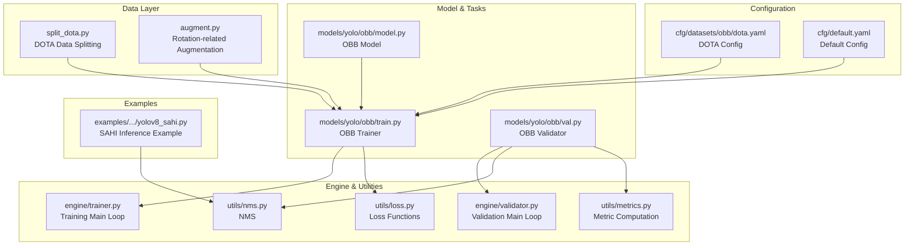
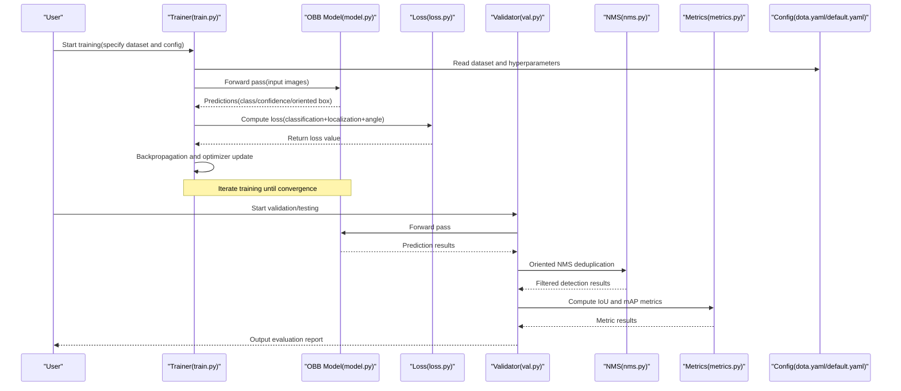
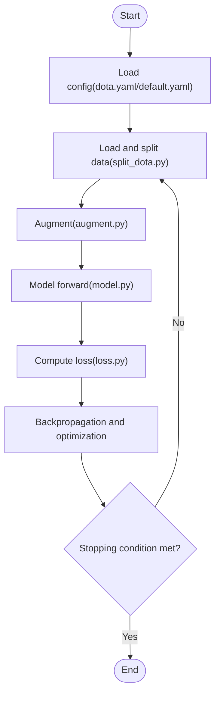
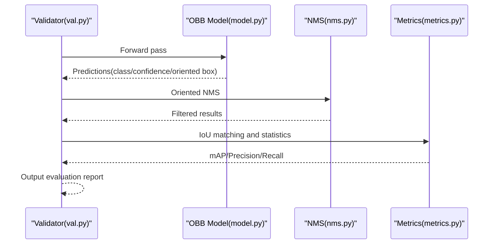
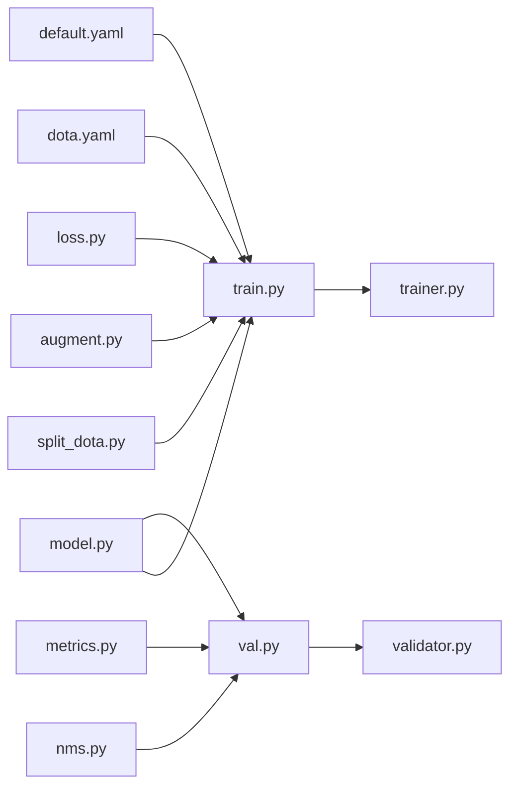

# Oriented Object Detection Tutorial

<cite>
**Files referenced in this document**
- [ultralytics/data/split_dota.py](file://ultralytics/data/split_dota.py)
- [ultralytics/data/augment.py](file://ultralytics/data/augment.py)
- [ultralytics/utils/nms.py](file://ultralytics/utils/nms.py)
- [ultralytics/utils/loss.py](file://ultralytics/utils/loss.py)
- [ultralytics/utils/metrics.py](file://ultralytics/utils/metrics.py)
- [ultralytics/engine/trainer.py](file://ultralytics/engine/trainer.py)
- [ultralytics/engine/validator.py](file://ultralytics/engine/validator.py)
- [ultralytics/models/yolo/detect/train.py](file://ultralytics/models/yolo/detect/train.py)
- [ultralytics/models/yolo/detect/val.py](file://ultralytics/models/yolo/detect/val.py)
- [ultralytics/models/yolo/obb/model.py](file://ultralytics/models/yolo/obb/model.py)
- [ultralytics/models/yolo/obb/train.py](file://ultralytics/models/yolo/obb/train.py)
- [ultralytics/models/yolo/obb/val.py](file://ultralytics/models/yolo/obb/val.py)
- [ultralytics/cfg/datasets/obb/dota.yaml](file://ultralytics/cfg/datasets/obb/dota.yaml)
- [ultralytics/cfg/default.yaml](file://ultralytics/cfg/default.yaml)
- [examples/YOLOv8-SAHI-Inference-Video/yolov8_sahi.py](file://examples/YOLOv8-SAHI-Inference-Video/yolov8_sahi.py)
</cite>

## Table of Contents
1. [Introduction](#introduction)
2. [Project Structure](#project-structure)
3. [Core Components](#core-components)
4. [Architecture Overview](#architecture-overview)
5. [Detailed Component Analysis](#detailed-component-analysis)
6. [Dependency Analysis](#dependency-analysis)
7. [Performance Considerations](#performance-considerations)
8. [Troubleshooting Guide](#troubleshooting-guide)
9. [Conclusion](#conclusion)
10. [Appendix](#appendix)

## Introduction
This tutorial is designed for engineers and researchers who want to perform "Oriented Bounding Box (OBB)" detection tasks on the YOLO-Master framework. The content covers:
- Differences and advantages of oriented object detection vs. traditional axis-aligned detection
- Format and annotation specifications for oriented datasets like DOTA
- Oriented box representation methods (center point + width/height + angle) and coordinate transformation principles
- Training configuration essentials: oriented loss, angle regression optimization, NMS post-processing
- Visualization methods and evaluation metric computation
- Typical application scenarios: remote sensing images, text detection, etc.
- High-performance inference optimization solutions

## Project Structure
For oriented object detection, OBB-related code in the repository is mainly distributed across the following modules:
- Data and augmentation: Data splitting, augmentation pipeline
- Model and tasks: OBB model definition, training and validation workflows
- Utilities: NMS, loss functions, metric computation
- Configuration: Default configuration and DOTA dataset configuration
- Examples: SAHI sliced inference example (suitable for large-scene remote sensing)

**Diagram Sources**
- [ultralytics/data/split_dota.py](file://ultralytics/data/split_dota.py)
- [ultralytics/data/augment.py](file://ultralytics/data/augment.py)
- [ultralytics/models/yolo/obb/model.py](file://ultralytics/models/yolo/obb/model.py)
- [ultralytics/models/yolo/obb/train.py](file://ultralytics/models/yolo/obb/train.py)
- [ultralytics/models/yolo/obb/val.py](file://ultralytics/models/yolo/obb/val.py)
- [ultralytics/engine/trainer.py](file://ultralytics/engine/trainer.py)
- [ultralytics/engine/validator.py](file://ultralytics/engine/validator.py)
- [ultralytics/utils/nms.py](file://ultralytics/utils/nms.py)
- [ultralytics/utils/loss.py](file://ultralytics/utils/loss.py)
- [ultralytics/utils/metrics.py](file://ultralytics/utils/metrics.py)
- [ultralytics/cfg/datasets/obb/dota.yaml](file://ultralytics/cfg/datasets/obb/dota.yaml)
- [ultralytics/cfg/default.yaml](file://ultralytics/cfg/default.yaml)
- [examples/YOLOv8-SAHI-Inference-Video/yolov8_sahi.py](file://examples/YOLOv8-SAHI-Inference-Video/yolov8_sahi.py)

**Section Sources**
- [ultralytics/data/split_dota.py](file://ultralytics/data/split_dota.py)
- [ultralytics/data/augment.py](file://ultralytics/data/augment.py)
- [ultralytics/models/yolo/obb/model.py](file://ultralytics/models/yolo/obb/model.py)
- [ultralytics/models/yolo/obb/train.py](file://ultralytics/models/yolo/obb/train.py)
- [ultralytics/models/yolo/obb/val.py](file://ultralytics/models/yolo/obb/val.py)
- [ultralytics/engine/trainer.py](file://ultralytics/engine/trainer.py)
- [ultralytics/engine/validator.py](file://ultralytics/engine/validator.py)
- [ultralytics/utils/nms.py](file://ultralytics/utils/nms.py)
- [ultralytics/utils/loss.py](file://ultralytics/utils/loss.py)
- [ultralytics/utils/metrics.py](file://ultralytics/utils/metrics.py)
- [ultralytics/cfg/datasets/obb/dota.yaml](file://ultralytics/cfg/datasets/obb/dota.yaml)
- [ultralytics/cfg/default.yaml](file://ultralytics/cfg/default.yaml)
- [examples/YOLOv8-SAHI-Inference-Video/yolov8_sahi.py](file://examples/YOLOv8-SAHI-Inference-Video/yolov8_sahi.py)

## Core Components
- Data Splitting and Loading
  - DOTA data splitting: Splits large images into fixed-size sub-images while maintaining annotation mapping relationships for training and validation.
  - Augmentation pipeline: Supports geometrically consistent augmentation for oriented boxes (e.g., random affine, crop, flip), ensuring angle semantic consistency.
- Model and Tasks
  - OBB model: Extends the generic detection head with an angle prediction branch, outputting class, confidence, and oriented box parameters.
  - Trainer: Integrates oriented loss, angle regression optimization strategies, and learning rate scheduling.
  - Validator: Implements oriented NMS, IoU computation, and mAP metric statistics.
- Utilities
  - NMS: Overlap suppression for oriented boxes to avoid duplicate detections.
  - Loss functions: Includes classification, localization, and angle regression terms with numerical stability considerations.
  - Metrics: Statistics of Precision, Recall, mAP, etc., by oriented box IoU thresholds.
- Configuration
  - DOTA dataset configuration: Paths, number of classes, label format description.
  - Default configuration: Global hyperparameters, device, logging, etc.
- Examples
  - SAHI inference example: Sliced inference and result stitching for large-scene high-resolution images.

**Section Sources**
- [ultralytics/data/split_dota.py](file://ultralytics/data/split_dota.py)
- [ultralytics/data/augment.py](file://ultralytics/data/augment.py)
- [ultralytics/models/yolo/obb/model.py](file://ultralytics/models/yolo/obb/model.py)
- [ultralytics/models/yolo/obb/train.py](file://ultralytics/models/yolo/obb/train.py)
- [ultralytics/models/yolo/obb/val.py](file://ultralytics/models/yolo/obb/val.py)
- [ultralytics/utils/nms.py](file://ultralytics/utils/nms.py)
- [ultralytics/utils/loss.py](file://ultralytics/utils/loss.py)
- [ultralytics/utils/metrics.py](file://ultralytics/utils/metrics.py)
- [ultralytics/cfg/datasets/obb/dota.yaml](file://ultralytics/cfg/datasets/obb/dota.yaml)
- [ultralytics/cfg/default.yaml](file://ultralytics/cfg/default.yaml)
- [examples/YOLOv8-SAHI-Inference-Video/yolov8_sahi.py](file://examples/YOLOv8-SAHI-Inference-Video/yolov8_sahi.py)

## Architecture Overview
The following diagram shows the overall flow from data to training, validation, and inference, along with the calling relationships between key modules.

**Diagram Sources**
- [ultralytics/models/yolo/obb/train.py](file://ultralytics/models/yolo/obb/train.py)
- [ultralytics/models/yolo/obb/model.py](file://ultralytics/models/yolo/obb/model.py)
- [ultralytics/utils/loss.py](file://ultralytics/utils/loss.py)
- [ultralytics/models/yolo/obb/val.py](file://ultralytics/models/yolo/obb/val.py)
- [ultralytics/utils/nms.py](file://ultralytics/utils/nms.py)
- [ultralytics/utils/metrics.py](file://ultralytics/utils/metrics.py)
- [ultralytics/cfg/datasets/obb/dota.yaml](file://ultralytics/cfg/datasets/obb/dota.yaml)
- [ultralytics/cfg/default.yaml](file://ultralytics/cfg/default.yaml)

## Detailed Component Analysis

### Data Splitting and Annotation Specification (DOTA)
- Annotation format
  - One target per line: class ID + x1 y1 x2 y2 x3 y3 x4 y4 (four vertices clockwise)
  - Class ID is an integer; class names are provided by the configuration file
- Splitting strategy
  - Split high-resolution remote sensing images into fixed-size tiles while maintaining annotation-to-tile correspondence
  - Generate new annotation files after splitting for training and validation use
- Notes
  - Ensure completeness and validity of oriented boxes at split boundaries
  - Keep class indices consistent with the configuration file

**Section Sources**
- [ultralytics/data/split_dota.py](file://ultralytics/data/split_dota.py)
- [ultralytics/cfg/datasets/obb/dota.yaml](file://ultralytics/cfg/datasets/obb/dota.yaml)

### Augmentation and Coordinate Transformation
- Oriented box representation
  - Common representation: center point (x, y), width w, height h, angle θ (radians or degrees must be unified)
  - Can be converted to/from four-vertex representation; note angle periodicity and direction conventions
- Geometric augmentation
  - Random affine, crop, flip, and other operations must synchronously update oriented box parameters to maintain geometric consistency
  - Angle normalization and boundary handling to avoid overflow and ambiguity
- Coordinate transformation principles
  - Affine matrix applied to vertices or center point + rotation transformation
  - Note the order of scaling, translation, rotation, and coordinate system conventions

**Section Sources**
- [ultralytics/data/augment.py](file://ultralytics/data/augment.py)

### Model and Training Workflow (OBB)
- Model structure
  - Backbone extracts features; detection head outputs class probabilities, confidence, and oriented box parameters
  - Angle branch requires attention to numerical stability and periodicity handling
- Training configuration
  - Loss function: Combination of classification loss, localization loss, and angle regression loss
  - Optimization strategy: Angle regression can use smooth loss or periodicity constraints to avoid angle jumps
  - Learning rate scheduling and regularization: Tune in combination with default configuration
- Training main loop
  - Read configuration and data, execute forward pass, loss computation, backpropagation, and weight updates

**Diagram Sources**
- [ultralytics/models/yolo/obb/train.py](file://ultralytics/models/yolo/obb/train.py)
- [ultralytics/models/yolo/obb/model.py](file://ultralytics/models/yolo/obb/model.py)
- [ultralytics/utils/loss.py](file://ultralytics/utils/loss.py)
- [ultralytics/data/split_dota.py](file://ultralytics/data/split_dota.py)
- [ultralytics/data/augment.py](file://ultralytics/data/augment.py)
- [ultralytics/cfg/datasets/obb/dota.yaml](file://ultralytics/cfg/datasets/obb/dota.yaml)
- [ultralytics/cfg/default.yaml](file://ultralytics/cfg/default.yaml)

**Section Sources**
- [ultralytics/models/yolo/obb/train.py](file://ultralytics/models/yolo/obb/train.py)
- [ultralytics/models/yolo/obb/model.py](file://ultralytics/models/yolo/obb/model.py)
- [ultralytics/utils/loss.py](file://ultralytics/utils/loss.py)
- [ultralytics/data/split_dota.py](file://ultralytics/data/split_dota.py)
- [ultralytics/data/augment.py](file://ultralytics/data/augment.py)
- [ultralytics/cfg/datasets/obb/dota.yaml](file://ultralytics/cfg/datasets/obb/dota.yaml)
- [ultralytics/cfg/default.yaml](file://ultralytics/cfg/default.yaml)

### Validation and NMS Post-Processing
- Oriented NMS
  - Overlap suppression based on oriented box IoU, retaining high-confidence targets
  - Threshold selection affects the recall-precision balance
- Metric computation
  - Statistics of Precision, Recall, and mAP at different IoU thresholds
  - Supports multi-class aggregation and per-class reporting

**Diagram Sources**
- [ultralytics/models/yolo/obb/val.py](file://ultralytics/models/yolo/obb/val.py)
- [ultralytics/models/yolo/obb/model.py](file://ultralytics/models/yolo/obb/model.py)
- [ultralytics/utils/nms.py](file://ultralytics/utils/nms.py)
- [ultralytics/utils/metrics.py](file://ultralytics/utils/metrics.py)

**Section Sources**
- [ultralytics/models/yolo/obb/val.py](file://ultralytics/models/yolo/obb/val.py)
- [ultralytics/utils/nms.py](file://ultralytics/utils/nms.py)
- [ultralytics/utils/metrics.py](file://ultralytics/utils/metrics.py)

### Visualization and Evaluation
- Visualization
  - Draw oriented boxes and class labels; note angle display and color differentiation
  - Supports batch image and video stream visualization
- Evaluation metrics
  - mAP@IoU threshold, per-class AP, confusion matrix, etc.
  - Recommended to compare axis-aligned vs. oriented box performance at different IoU thresholds

**Section Sources**
- [ultralytics/utils/metrics.py](file://ultralytics/utils/metrics.py)

### Typical Application Scenarios and Practice Cases
- Remote sensing image object detection
  - Use SAHI sliced inference to improve recall and precision for large-scene high-resolution images
  - Refer to example scripts for end-to-end inference and visualization
- Text detection
  - Text regions typically exhibit elongated oriented shapes; oriented boxes fit text contours better
  - Adjust angle range and IoU threshold to suit text detection requirements

**Section Sources**
- [examples/YOLOv8-SAHI-Inference-Video/yolov8_sahi.py](file://examples/YOLOv8-SAHI-Inference-Video/yolov8_sahi.py)

## Dependency Analysis
- Module coupling
  - Trainer depends on model, loss, and configuration; validator depends on model, NMS, and metrics
  - Data splitting and augmentation are upstream dependencies that directly affect training quality
- External dependencies
  - Deep learning framework (PyTorch), numerical computation, and visualization tools
- Potential risks
  - Inconsistent angle representation causing loss instability
  - Improper NMS threshold settings causing missed or false detections

**Diagram Sources**
- [ultralytics/data/split_dota.py](file://ultralytics/data/split_dota.py)
- [ultralytics/data/augment.py](file://ultralytics/data/augment.py)
- [ultralytics/models/yolo/obb/model.py](file://ultralytics/models/yolo/obb/model.py)
- [ultralytics/models/yolo/obb/train.py](file://ultralytics/models/yolo/obb/train.py)
- [ultralytics/models/yolo/obb/val.py](file://ultralytics/models/yolo/obb/val.py)
- [ultralytics/utils/nms.py](file://ultralytics/utils/nms.py)
- [ultralytics/utils/loss.py](file://ultralytics/utils/loss.py)
- [ultralytics/utils/metrics.py](file://ultralytics/utils/metrics.py)
- [ultralytics/engine/trainer.py](file://ultralytics/engine/trainer.py)
- [ultralytics/engine/validator.py](file://ultralytics/engine/validator.py)
- [ultralytics/cfg/datasets/obb/dota.yaml](file://ultralytics/cfg/datasets/obb/dota.yaml)
- [ultralytics/cfg/default.yaml](file://ultralytics/cfg/default.yaml)

**Section Sources**
- [ultralytics/data/split_dota.py](file://ultralytics/data/split_dota.py)
- [ultralytics/data/augment.py](file://ultralytics/data/augment.py)
- [ultralytics/models/yolo/obb/model.py](file://ultralytics/models/yolo/obb/model.py)
- [ultralytics/models/yolo/obb/train.py](file://ultralytics/models/yolo/obb/train.py)
- [ultralytics/models/yolo/obb/val.py](file://ultralytics/models/yolo/obb/val.py)
- [ultralytics/utils/nms.py](file://ultralytics/utils/nms.py)
- [ultralytics/utils/loss.py](file://ultralytics/utils/loss.py)
- [ultralytics/utils/metrics.py](file://ultralytics/utils/metrics.py)
- [ultralytics/engine/trainer.py](file://ultralytics/engine/trainer.py)
- [ultralytics/engine/validator.py](file://ultralytics/engine/validator.py)
- [ultralytics/cfg/datasets/obb/dota.yaml](file://ultralytics/cfg/datasets/obb/dota.yaml)
- [ultralytics/cfg/default.yaml](file://ultralytics/cfg/default.yaml)

## Performance Considerations
- Training phase
  - Set batch size and learning rate appropriately to avoid gradient explosion or slow convergence
  - Use smooth form for angle regression loss to reduce numerical jitter
- Inference phase
  - Use half precision or model export (ONNX/TensorRT/OpenVINO) for acceleration
  - Adjust NMS threshold and confidence threshold to balance speed and accuracy
- Large-scene inference
  - Use SAHI sliced inference to reduce VRAM usage and improve recall
  - Pay attention to angle consistency when merging overlapping detection results

[This section provides general guidance and does not directly analyze specific files]

## Troubleshooting Guide
- Angle anomalies
  - Check angle representation and normalization logic; ensure periodicity and direction consistency
  - Observe whether the loss curve shows spikes or NaN
- Poor NMS performance
  - Adjust IoU threshold and confidence threshold; check for missed and duplicate detections
  - Confirm oriented box vertex order and angle range
- Low metrics
  - Check whether data splitting and annotation mapping are correct
  - Verify consistency of class indices with the configuration file

**Section Sources**
- [ultralytics/utils/loss.py](file://ultralytics/utils/loss.py)
- [ultralytics/utils/nms.py](file://ultralytics/utils/nms.py)
- [ultralytics/utils/metrics.py](file://ultralytics/utils/metrics.py)
- [ultralytics/data/split_dota.py](file://ultralytics/data/split_dota.py)
- [ultralytics/cfg/datasets/obb/dota.yaml](file://ultralytics/cfg/datasets/obb/dota.yaml)

## Conclusion
Through this tutorial, readers should master the key steps for oriented object detection on the YOLO-Master framework: understanding oriented box representation and coordinate transformation, preparing DOTA-style data, configuring training and validation workflows, implementing oriented NMS and metric evaluation, and combining with SAHI for large-scene inference. It is recommended to prioritize oriented boxes in remote sensing and text detection scenarios to improve fit and accuracy, while selecting appropriate inference optimization solutions based on actual deployment requirements.

[This section is summary content and does not directly analyze specific files]

## Appendix
- Quick start checklist
  - Prepare DOTA data and configuration files
  - Run training script, monitor loss and metrics
  - Use validation script to evaluate model performance
  - Perform large-scene inference based on SAHI example
- Common issues
  - Angle units and periodicity problems
  - NMS threshold and class imbalance issues
  - Large-scene memory insufficiency and slicing strategies

[This section provides supplementary information and does not directly analyze specific files]
