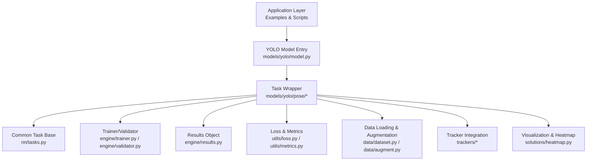
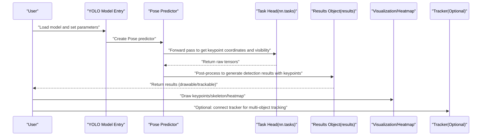
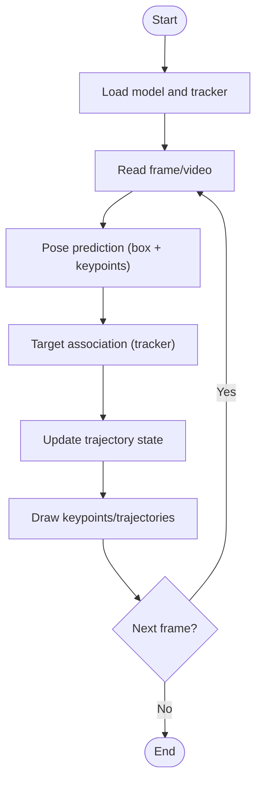
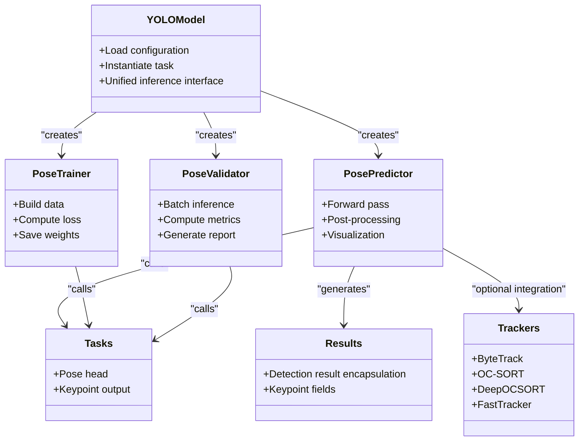

# Pose Estimation Tutorial

<cite>
**Files referenced in this document**
- [README.md](file://README.md)
- [ultralytics/models/yolo/pose/__init__.py](file://ultralytics/models/yolo/pose/__init__.py)
- [ultralytics/models/yolo/pose/predict.py](file://ultralytics/models/yolo/pose/predict.py)
- [ultralytics/models/yolo/pose/train.py](file://ultralytics/models/yolo/pose/train.py)
- [ultralytics/models/yolo/pose/val.py](file://ultralytics/models/yolo/pose/val.py)
- [ultralytics/models/yolo/model.py](file://ultralytics/models/yolo/model.py)
- [ultralytics/nn/tasks.py](file://ultralytics/nn/tasks.py)
- [ultralytics/utils/loss.py](file://ultralytics/utils/loss.py)
- [ultralytics/utils/metrics.py](file://ultralytics/utils/metrics.py)
- [ultralytics/data/dataset.py](file://ultralytics/data/dataset.py)
- [ultralytics/data/augment.py](file://ultralytics/data/augment.py)
- [ultralytics/engine/trainer.py](file://ultralytics/engine/trainer.py)
- [ultralytics/engine/validator.py](file://ultralytics/engine/validator.py)
- [ultralytics/engine/results.py](file://ultralytics/engine/results.py)
- [ultralytics/solutions/heatmap.py](file://ultralytics/solutions/heatmap.py)
- [ultralytics/trackers/basetrack.py](file://ultralytics/trackers/basetrack.py)
- [ultralytics/trackers/byte_tracker.py](file://ultralytics/trackers/byte_tracker.py)
- [ultralytics/trackers/oc_sort.py](file://ultralytics/trackers/oc_sort.py)
- [ultralytics/trackers/deep_oc_sort.py](file://ultralytics/trackers/deep_oc_sort.py)
- [ultralytics/trackers/fast_tracker.py](file://ultralytics/trackers/fast_tracker.py)
- [ultralytics/trackers/track.py](file://ultralytics/trackers/track.py)
- [ultralytics/cfg/default.yaml](file://ultralytics/cfg/default.yaml)
- [examples/YOLO-Master-Cross-Platform-Edge-Deployment/TECHNICAL_REPORT.md](file://examples/YOLO-Master-Cross-Platform-Edge-Deployment/TECHNICAL_REPORT.md)
- [examples/YOLO-Master-Edge-Deployment/export_edge_models.py](file://examples/YOLO-Master-Edge-Deployment/export_edge_models.py)
- [examples/YOLOv8-TFLite-Python/main.py](file://examples/YOLOv8-TFLite-Python/main.py)
- [examples/YOLOv8-ONNXRuntime-Python/main.py](file://examples/YOLOv8-ONNXRuntime-Python/main.py)
- [examples/YOLOv8-OpenVINO-CPP-Inference/main.cc](file://examples/YOLOv8-OpenVINO-CPP-Inference/main.cc)
- [examples/YOLO11-Triton-CPP/inference.cpp](file://examples/YOLO11-Triton-CPP/inference.cpp)
- [examples/YOLOv8-Region-Counter/yolov8_region_counter.py](file://examples/YOLOv8-Region-Counter/yolov8_region_counter.py)
- [examples/object_tracking.ipynb](file://examples/object_tracking.ipynb)
- [examples/tutorial.ipynb](file://examples/tutorial.ipynb)
</cite>

## Table of Contents
1. [Introduction](#introduction)
2. [Project Structure](#project-structure)
3. [Core Components](#core-components)
4. [Architecture Overview](#architecture-overview)
5. [Detailed Component Analysis](#detailed-component-analysis)
6. [Dependency Analysis](#dependency-analysis)
7. [Performance and Deployment Optimization](#performance-and-deployment-optimization)
8. [Troubleshooting Guide](#troubleshooting-guide)
9. [Conclusion](#conclusion)
10. [Appendix](#appendix)

## Introduction
This tutorial is designed for engineers and researchers who want to use YOLO-Master for human keypoint detection and animal pose estimation. The content covers:
- Principles and application scenarios of human keypoint and animal pose estimation
- Keypoint annotation formats and dataset preparation workflows
- Model architecture characteristics, training configuration, and output formats
- Visualization and skeleton drawing methods
- Multi-object pose tracking solutions
- Mobile and embedded device deployment optimization strategies

## Project Structure
YOLO-Master organizes code with "tasks" as first-class citizens. Pose estimation (Pose) is located under models/yolo/pose, with supporting datasets, losses, metrics, inference, and export in corresponding submodules. Training, validation, and prediction are each implemented by independent classes, uniformly dispatched through the YOLO model entry point.

**Diagram Sources**
- [ultralytics/models/yolo/model.py](file://ultralytics/models/yolo/model.py)
- [ultralytics/models/yolo/pose/__init__.py](file://ultralytics/models/yolo/pose/__init__.py)
- [ultralytics/nn/tasks.py](file://ultralytics/nn/tasks.py)
- [ultralytics/engine/trainer.py](file://ultralytics/engine/trainer.py)
- [ultralytics/engine/validator.py](file://ultralytics/engine/validator.py)
- [ultralytics/engine/results.py](file://ultralytics/engine/results.py)
- [ultralytics/utils/loss.py](file://ultralytics/utils/loss.py)
- [ultralytics/utils/metrics.py](file://ultralytics/utils/metrics.py)
- [ultralytics/data/dataset.py](file://ultralytics/data/dataset.py)
- [ultralytics/data/augment.py](file://ultralytics/data/augment.py)
- [ultralytics/solutions/heatmap.py](file://ultralytics/solutions/heatmap.py)
- [ultralytics/trackers/basetrack.py](file://ultralytics/trackers/basetrack.py)

**Section Sources**
- [README.md](file://README.md)
- [ultralytics/models/yolo/pose/__init__.py](file://ultralytics/models/yolo/pose/__init__.py)
- [ultralytics/models/yolo/model.py](file://ultralytics/models/yolo/model.py)

## Core Components
- Task Wrapper: The Pose task provides predict, train, and val interfaces under models/yolo/pose, internally reusing the Pose head and related logic from nn.tasks.
- Training and Validation: Inheriting from the generic Trainer/Validator, responsible for building DataLoaders, computing losses, recording metrics, and saving weights.
- Results Object: engine/results.py uniformly encapsulates detection results, containing boxes, classes, confidence scores, keypoints, and other fields for subsequent visualization and tracking.
- Loss and Metrics: Keypoint regression typically uses coordinate regression loss (e.g., BCE/L1/SmoothL1 combinations), combined with visibility classification or confidence; metrics include keypoint accuracy, AP, etc.
- Data Pipeline: Supports standard YOLO annotation format with keypoint coordinates and visibility flags; data augmentation maintains geometric consistency for keypoints.
- Tracking Integration: Can be combined with ByteTrack, OC-SORT, DeepOCSORT, FastTracker, etc., to achieve multi-object pose trajectories.

**Section Sources**
- [ultralytics/models/yolo/pose/predict.py](file://ultralytics/models/yolo/pose/predict.py)
- [ultralytics/models/yolo/pose/train.py](file://ultralytics/models/yolo/pose/train.py)
- [ultralytics/models/yolo/pose/val.py](file://ultralytics/models/yolo/pose/val.py)
- [ultralytics/nn/tasks.py](file://ultralytics/nn/tasks.py)
- [ultralytics/engine/trainer.py](file://ultralytics/engine/trainer.py)
- [ultralytics/engine/validator.py](file://ultralytics/engine/validator.py)
- [ultralytics/engine/results.py](file://ultralytics/engine/results.py)
- [ultralytics/utils/loss.py](file://ultralytics/utils/loss.py)
- [ultralytics/utils/metrics.py](file://ultralytics/utils/metrics.py)
- [ultralytics/data/dataset.py](file://ultralytics/data/dataset.py)
- [ultralytics/data/augment.py](file://ultralytics/data/augment.py)

## Architecture Overview
The following diagram shows the end-to-end flow from input image to keypoint output, along with optional tracking and visualization branches.

**Diagram Sources**
- [ultralytics/models/yolo/model.py](file://ultralytics/models/yolo/model.py)
- [ultralytics/models/yolo/pose/predict.py](file://ultralytics/models/yolo/pose/predict.py)
- [ultralytics/nn/tasks.py](file://ultralytics/nn/tasks.py)
- [ultralytics/engine/results.py](file://ultralytics/engine/results.py)
- [ultralytics/solutions/heatmap.py](file://ultralytics/solutions/heatmap.py)
- [ultralytics/trackers/track.py](file://ultralytics/trackers/track.py)

## Detailed Component Analysis

### Human Keypoint and Animal Pose Estimation Principles
- Human keypoints: Typically define several joint points (e.g., COCO 17 points), each containing x, y coordinates and a visibility flag.
- Animal pose estimation: Custom skeleton topology and keypoint semantics based on species, such as common body parts for dogs/cats/horses.
- Detection + regression paradigm: First localize the target box, then regress keypoint coordinates; single-stage direct regression is also possible.

**Section Sources**
- [ultralytics/models/yolo/pose/__init__.py](file://ultralytics/models/yolo/pose/__init__.py)
- [ultralytics/nn/tasks.py](file://ultralytics/nn/tasks.py)

### Keypoint Annotation Format and Dataset Preparation
- Annotation format: Follows the YOLO keypoint format, with one keypoint per line containing normalized coordinates and visibility flags; also requires target box and class information.
- Dataset configuration: Declare paths, number of classes, keypoint count, and connection relationships (skeleton edges) in YAML.
- Data augmentation: Rotation, affine, scaling, and other operations must synchronously transform keypoint coordinates and maintain visibility consistency.

**Section Sources**
- [ultralytics/data/dataset.py](file://ultralytics/data/dataset.py)
- [ultralytics/data/augment.py](file://ultralytics/data/augment.py)
- [ultralytics/cfg/default.yaml](file://ultralytics/cfg/default.yaml)

### Model Architecture and Output Format
- Backbone: Shared feature extraction backbone, adapted to different scales.
- Detection head: Outputs target boxes, classes, and confidence scores.
- Keypoint head: Outputs N keypoint coordinates and visibility/confidence for each target.
- Output structure: Uniformly encapsulated in engine/results.py for subsequent visualization and tracking.

**Section Sources**
- [ultralytics/nn/tasks.py](file://ultralytics/nn/tasks.py)
- [ultralytics/engine/results.py](file://ultralytics/engine/results.py)

### Training Configuration and Loss Functions
- Loss composition:
  - Keypoint coordinate regression loss: Commonly uses BCE/L1/SmoothL1, etc., computed for visible keypoints.
  - Visibility/confidence loss: Distinguishes visibility or confidence threshold filtering.
  - Detection loss: Box regression and classification loss jointly optimized with keypoint loss.
- Hyperparameter recommendations:
  - Keypoint loss weight: Adjust based on task difficulty to avoid dominating the overall loss.
  - Confidence threshold: Search for optimal threshold on the validation set after training.
  - Coordinate regression optimization: Use smooth L1 for improved robustness, or reduce learning rate in later fine-tuning stages.

**Section Sources**
- [ultralytics/utils/loss.py](file://ultralytics/utils/loss.py)
- [ultralytics/models/yolo/pose/train.py](file://ultralytics/models/yolo/pose/train.py)
- [ultralytics/engine/trainer.py](file://ultralytics/engine/trainer.py)

### Evaluation Metrics and Validation
- Metrics: Keypoint accuracy, AP, etc., filtering participating keypoints based on visibility.
- Validation flow: Batch inference on the validation set, post-processing, metric computation, and summary reporting.

**Section Sources**
- [ultralytics/utils/metrics.py](file://ultralytics/utils/metrics.py)
- [ultralytics/models/yolo/pose/val.py](file://ultralytics/models/yolo/pose/val.py)
- [ultralytics/engine/validator.py](file://ultralytics/engine/validator.py)

### Visualization and Skeleton Drawing
- Keypoint visualization: Draw keypoints and connections (skeleton) on detection results.
- Heatmap: Use solutions/heatmap.py to generate keypoint density heatmaps for quality inspection and presentation.
- Interactive demo: Refer to notebooks in examples for quick start.

**Section Sources**
- [ultralytics/solutions/heatmap.py](file://ultralytics/solutions/heatmap.py)
- [examples/tutorial.ipynb](file://examples/tutorial.ipynb)

### Multi-Object Pose Tracking Solution
- Tracker selection: ByteTrack, OC-SORT, DeepOCSORT, FastTracker, etc., can all be combined with the Pose task.
- Flow: Detection + keypoints → target association → trajectory maintenance → visualization.
- Configuration: Pass tracker type and parameters during prediction to achieve multi-object pose tracking on video streams.

**Diagram Sources**
- [ultralytics/models/yolo/pose/predict.py](file://ultralytics/models/yolo/pose/predict.py)
- [ultralytics/trackers/basetrack.py](file://ultralytics/trackers/basetrack.py)
- [ultralytics/trackers/byte_tracker.py](file://ultralytics/trackers/byte_tracker.py)
- [ultralytics/trackers/oc_sort.py](file://ultralytics/trackers/oc_sort.py)
- [ultralytics/trackers/deep_oc_sort.py](file://ultralytics/trackers/deep_oc_sort.py)
- [ultralytics/trackers/fast_tracker.py](file://ultralytics/trackers/fast_tracker.py)
- [ultralytics/trackers/track.py](file://ultralytics/trackers/track.py)
- [examples/object_tracking.ipynb](file://examples/object_tracking.ipynb)

**Section Sources**
- [ultralytics/trackers/basetrack.py](file://ultralytics/trackers/basetrack.py)
- [ultralytics/trackers/byte_tracker.py](file://ultralytics/trackers/byte_tracker.py)
- [ultralytics/trackers/oc_sort.py](file://ultralytics/trackers/oc_sort.py)
- [ultralytics/trackers/deep_oc_sort.py](file://ultralytics/trackers/deep_oc_sort.py)
- [ultralytics/trackers/fast_tracker.py](file://ultralytics/trackers/fast_tracker.py)
- [ultralytics/trackers/track.py](file://ultralytics/trackers/track.py)
- [examples/object_tracking.ipynb](file://examples/object_tracking.ipynb)

## Dependency Analysis
- Task coupling: The Pose task depends on nn.tasks for task heads and utilities; training/validation depends on the generic engine; the results object runs through inference and visualization.
- External integration: Trackers are connected as plugins without affecting the main task logic; visualization and heatmaps are independent of the training pipeline.

**Diagram Sources**
- [ultralytics/models/yolo/model.py](file://ultralytics/models/yolo/model.py)
- [ultralytics/models/yolo/pose/predict.py](file://ultralytics/models/yolo/pose/predict.py)
- [ultralytics/models/yolo/pose/train.py](file://ultralytics/models/yolo/pose/train.py)
- [ultralytics/models/yolo/pose/val.py](file://ultralytics/models/yolo/pose/val.py)
- [ultralytics/nn/tasks.py](file://ultralytics/nn/tasks.py)
- [ultralytics/engine/results.py](file://ultralytics/engine/results.py)
- [ultralytics/trackers/byte_tracker.py](file://ultralytics/trackers/byte_tracker.py)
- [ultralytics/trackers/oc_sort.py](file://ultralytics/trackers/oc_sort.py)
- [ultralytics/trackers/deep_oc_sort.py](file://ultralytics/trackers/deep_oc_sort.py)
- [ultralytics/trackers/fast_tracker.py](file://ultralytics/trackers/fast_tracker.py)

**Section Sources**
- [ultralytics/models/yolo/model.py](file://ultralytics/models/yolo/model.py)
- [ultralytics/nn/tasks.py](file://ultralytics/nn/tasks.py)
- [ultralytics/engine/results.py](file://ultralytics/engine/results.py)

## Performance and Deployment Optimization
- Export formats:
  - ONNX: Cross-platform inference, suitable for desktop and server.
  - TensorRT: GPU acceleration, high throughput and low latency.
  - OpenVINO: Intel CPU/GPU/NPU optimization.
  - TFLite: Mobile and edge devices.
- Quantization and pruning:
  - Dynamic/static quantization to reduce size and latency.
  - Structured pruning to reduce computation.
- Batching and pipeline:
  - Appropriate batch size and preprocessing parallelism.
  - Video stream decode-inference-render pipeline optimization.
- Example references:
  - Edge export scripts and cross-platform deployment technical reports.
  - ONNXRuntime/TensorRT/OpenVINO/TFLite example projects.

**Section Sources**
- [examples/YOLO-Master-Edge-Deployment/export_edge_models.py](file://examples/YOLO-Master-Edge-Deployment/export_edge_models.py)
- [examples/YOLO-Master-Cross-Platform-Edge-Deployment/TECHNICAL_REPORT.md](file://examples/YOLO-Master-Cross-Platform-Edge-Deployment/TECHNICAL_REPORT.md)
- [examples/YOLOv8-ONNXRuntime-Python/main.py](file://examples/YOLOv8-ONNXRuntime-Python/main.py)
- [examples/YOLOv8-TFLite-Python/main.py](file://examples/YOLOv8-TFLite-Python/main.py)
- [examples/YOLOv8-OpenVINO-CPP-Inference/main.cc](file://examples/YOLOv8-OpenVINO-CPP-Inference/main.cc)
- [examples/YOLO11-Triton-CPP/inference.cpp](file://examples/YOLO11-Triton-CPP/inference.cpp)

## Troubleshooting Guide
- Keypoints invisible or offset:
  - Check whether data augmentation breaks keypoint geometric consistency.
  - Adjust keypoint loss weight and visibility threshold.
- Training instability:
  - Reduce learning rate or use more robust loss (e.g., SmoothL1).
  - Check gradient clipping and mixed precision settings.
- Slow inference speed:
  - Enable export and quantization; optimize batch size and preprocessing.
  - Use appropriate backend (TensorRT/OpenVINO/TFLite).
- Tracking loss:
  - Adjust tracker thresholds and motion model parameters.
  - Add keypoint constraints or introduce appearance features.

**Section Sources**
- [ultralytics/data/augment.py](file://ultralytics/data/augment.py)
- [ultralytics/utils/loss.py](file://ultralytics/utils/loss.py)
- [ultralytics/engine/trainer.py](file://ultralytics/engine/trainer.py)
- [ultralytics/trackers/byte_tracker.py](file://ultralytics/trackers/byte_tracker.py)
- [ultralytics/trackers/oc_sort.py](file://ultralytics/trackers/oc_sort.py)
- [ultralytics/trackers/deep_oc_sort.py](file://ultralytics/trackers/deep_oc_sort.py)
- [ultralytics/trackers/fast_tracker.py](file://ultralytics/trackers/fast_tracker.py)

## Conclusion
YOLO-Master provides a complete integrated solution for pose estimation: from data preparation, model training, evaluation to visualization and multi-object tracking, and then to multi-platform deployment. Through proper loss design, threshold tuning, and export optimization, high-accuracy and high-performance pose estimation can be achieved on various devices.

## Appendix
- Quick start:
  - Refer to notebooks and example scripts in examples for quick data preparation, training, and inference.
- Region counting and statistics:
  - Combine with the region counter example to implement keypoint-based behavior analysis and statistics.

**Section Sources**
- [examples/tutorial.ipynb](file://examples/tutorial.ipynb)
- [examples/YOLOv8-Region-Counter/yolov8_region_counter.py](file://examples/YOLOv8-Region-Counter/yolov8_region_counter.py)
