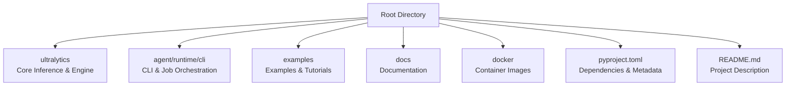
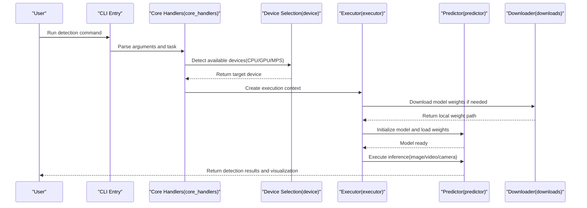
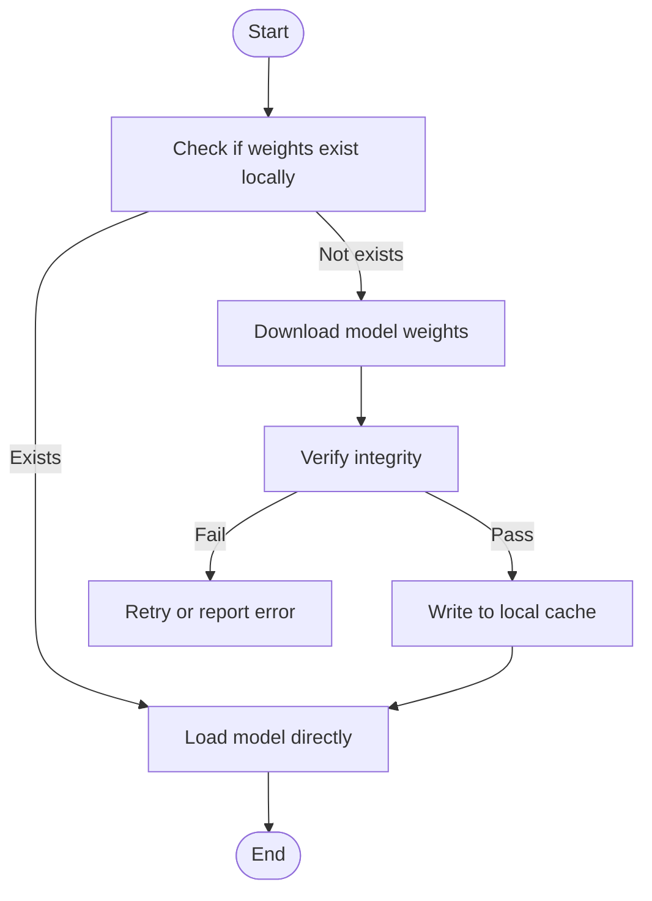
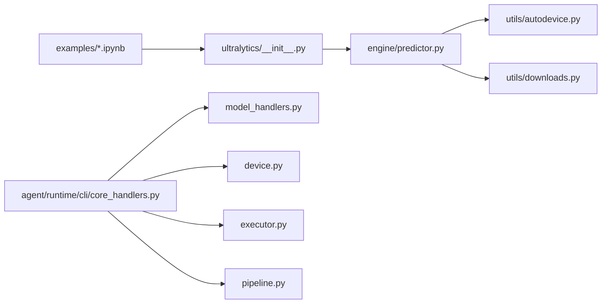

# Quick Start Guide

<cite>
**Files referenced in this document**
- [README.md](file://README.md)
- [pyproject.toml](file://pyproject.toml)
- [docker/Dockerfile](file://docker/Dockerfile)
- [ultralytics/__init__.py](file://ultralytics/__init__.py)
- [ultralytics/engine/predictor.py](file://ultralytics/engine/predictor.py)
- [ultralytics/utils/autodevice.py](file://ultralytics/utils/autodevice.py)
- [ultralytics/utils/downloads.py](file://ultralytics/utils/downloads.py)
- [examples/tutorial.ipynb](file://examples/tutorial.ipynb)
- [examples/object_tracking.ipynb](file://examples/object_tracking.ipynb)
- [examples/object_counting.ipynb](file://examples/object_counting.ipynb)
- [agent/runtime/cli/core_handlers.py](file://agent/runtime/cli/core_handlers.py)
- [agent/runtime/cli/model_handlers.py](file://agent/runtime/cli/model_handlers.py)
- [agent/runtime/cli/device.py](file://agent/runtime/cli/device.py)
- [agent/runtime/cli/executor.py](file://agent/runtime/cli/executor.py)
- [agent/runtime/cli/pipeline.py](file://agent/runtime/cli/pipeline.py)
- [agent/runtime/cli/job_handlers.py](file://agent/runtime/cli/job_handlers.py)
- [agent/runtime/cli/system_handlers.py](file://agent/runtime/cli/system_handlers.py)
- [agent/runtime/cli/progress.py](file://agent/runtime/cli/progress.py)
- [agent/runtime/cli/snapshot.py](file://agent/runtime/cli/snapshot.py)
- [agent/runtime/cli/validate.py](file://agent/runtime/cli/validate.py)
- [agent/runtime/cli/stability.py](file://agent/runtime/cli/stability.py)
- [agent/runtime/cli/multimodal_handlers.py](file://agent/runtime/cli/multimodal_handlers.py)
- [agent/runtime/cli/lora_tools.py](file://agent/runtime/cli/lora_tools.py)
- [agent/runtime/cli/moe_tools.py](file://agent/runtime/cli/moe_tools.py)
- [agent/runtime/cli/peft_compare.py](file://agent/runtime/cli/peft_compare.py)
- [agent/runtime/cli/sahi_compare.py](file://agent/runtime/cli/sahi_compare.py)
- [agent/runtime/cli/regenerate_open_world_report.py](file://agent/runtime/cli/regenerate_open_world_report.py)
- [agent/runtime/cli/compare_open_world_profiles.py](file://agent/runtime/cli/compare_open_world_profiles.py)
- [agent/runtime/cli/normalize.py](file://agent/runtime/cli/normalize.py)
- [agent/runtime/cli/dispatcher.py](file://agent/runtime/cli/dispatcher.py)
- [agent/runtime/cli/async_jobs.py](file://agent/runtime/cli/async_jobs.py)
- [agent/runtime/cli/dataset.py](file://agent/runtime/cli/dataset.py)
- [agent/runtime/cli/contract.py](file://agent/runtime/cli/contract.py)
</cite>

## Table of Contents
1. [Introduction](#introduction)
2. [Project Structure](#project-structure)
3. [Core Components](#core-components)
4. [Architecture Overview](#architecture-overview)
5. [Detailed Component Analysis](#detailed-component-analysis)
6. [Dependency Analysis](#dependency-analysis)
7. [Performance Considerations](#performance-considerations)
8. [Troubleshooting Guide](#troubleshooting-guide)
9. [Conclusion](#conclusion)
10. [Appendix](#appendix)

## Introduction
This guide is designed for first-time YOLO-Master users, with the goal of completing environment setup, pretrained model preparation, and the first object detection task within 30 minutes. The content covers:
- Python environment and GPU driver configuration
- Dependency installation (pip and Docker)
- Pretrained model download and usage
- Image inference, video processing, and real-time camera detection examples
- Command-line tool basic usage
- Common issues and quick troubleshooting

## Project Structure
The repository adopts a modular organization, with core inference and engine located in the ultralytics package; CLI entry and job scheduling in agent/runtime/cli; examples and tutorials in examples; documentation in docs; Docker image definition in docker.

**Diagram Sources**
- [pyproject.toml:1-200](file://pyproject.toml#L1-L200)
- [README.md:1-200](file://README.md#L1-L200)
- [docker/Dockerfile:1-200](file://docker/Dockerfile#L1-L200)

**Section Sources**
- [README.md:1-200](file://README.md#L1-L200)
- [pyproject.toml:1-200](file://pyproject.toml#L1-L200)
- [docker/Dockerfile:1-200](file://docker/Dockerfile#L1-L200)

## Core Components
- Inference Engine and Predictor: Responsible for loading models, device selection, forward inference, and result post-processing.
- Automatic Device Selection: Automatically selects CPU/GPU/MPS backends based on system capabilities.
- Model Download and Caching: Supports fetching weights from remote repositories with local caching.
- CLI Command Set: Provides commands for model management, device detection, inference execution, snapshots, and validation.
- Examples and Tutorials: Jupyter Notebook demonstrations of common task workflows.

**Section Sources**
- [ultralytics/engine/predictor.py:1-200](file://ultralytics/engine/predictor.py#L1-L200)
- [ultralytics/utils/autodevice.py:1-200](file://ultralytics/utils/autodevice.py#L1-L200)
- [ultralytics/utils/downloads.py:1-200](file://ultralytics/utils/downloads.py#L1-L200)
- [agent/runtime/cli/core_handlers.py:1-200](file://agent/runtime/cli/core_handlers.py#L1-L200)
- [agent/runtime/cli/model_handlers.py:1-200](file://agent/runtime/cli/model_handlers.py#L1-L200)
- [agent/runtime/cli/device.py:1-200](file://agent/runtime/cli/device.py#L1-L200)
- [agent/runtime/cli/executor.py:1-200](file://agent/runtime/cli/executor.py#L1-L200)
- [agent/runtime/cli/pipeline.py:1-200](file://agent/runtime/cli/pipeline.py#L1-L200)
- [examples/tutorial.ipynb:1-200](file://examples/tutorial.ipynb#L1-L200)

## Architecture Overview
The following diagram shows the typical path from user invocation to inference execution, including the CLI layer, job scheduling, device selection, model loading, and predictor execution.

**Diagram Sources**
- [agent/runtime/cli/core_handlers.py:1-200](file://agent/runtime/cli/core_handlers.py#L1-L200)
- [agent/runtime/cli/device.py:1-200](file://agent/runtime/cli/device.py#L1-L200)
- [agent/runtime/cli/executor.py:1-200](file://agent/runtime/cli/executor.py#L1-L200)
- [ultralytics/engine/predictor.py:1-200](file://ultralytics/engine/predictor.py#L1-L200)
- [ultralytics/utils/downloads.py:1-200](file://ultralytics/utils/downloads.py#L1-L200)

## Detailed Component Analysis

### Environment Installation and Configuration
- Python version requirements and dependency declarations are in pyproject.toml. It is recommended to use a virtual environment or conda to isolate dependencies.
- GPU drivers and CUDA versions must match the PyTorch build. Device capabilities can be automatically detected via autodevice.
- Optionally use the Docker image for one-click startup to avoid local environment differences.

Recommended steps
- Create and activate a Python virtual environment
- Install project dependencies (refer to pyproject.toml)
- Verify GPU is correctly recognized (CPU/GPU/MPS)
- For offline deployment, download model weights to local cache in advance

**Section Sources**
- [pyproject.toml:1-200](file://pyproject.toml#L1-L200)
- [ultralytics/utils/autodevice.py:1-200](file://ultralytics/utils/autodevice.py#L1-L200)
- [docker/Dockerfile:1-200](file://docker/Dockerfile#L1-L200)

### Pretrained Model Download and Usage
- On first inference, required weights are automatically downloaded to the local cache directory.
- You can manually specify a model path or use the default name to trigger a download.
- The download process is managed by the downloads module, supporting resume and verification.

**Diagram Sources**
- [ultralytics/utils/downloads.py:1-200](file://ultralytics/utils/downloads.py#L1-L200)
- [ultralytics/engine/predictor.py:1-200](file://ultralytics/engine/predictor.py#L1-L200)

**Section Sources**
- [ultralytics/utils/downloads.py:1-200](file://ultralytics/utils/downloads.py#L1-L200)
- [ultralytics/engine/predictor.py:1-200](file://ultralytics/engine/predictor.py#L1-L200)

### First Object Detection Example (Image/Video/Camera)
- Image inference: Read a single image, perform prediction, save or display results.
- Video processing: Read video stream frame by frame, batch inference and output annotated video.
- Real-time camera: Open camera device, loop inference and display real-time footage.

Recommended example locations
- Image and general workflow: [examples/tutorial.ipynb](file://examples/tutorial.ipynb)
- Tracking and counting extensions: [examples/object_tracking.ipynb](file://examples/object_tracking.ipynb), [examples/object_counting.ipynb](file://examples/object_counting.ipynb)

**Section Sources**
- [examples/tutorial.ipynb:1-200](file://examples/tutorial.ipynb#L1-L200)
- [examples/object_tracking.ipynb:1-200](file://examples/object_tracking.ipynb#L1-L200)
- [examples/object_counting.ipynb:1-200](file://examples/object_counting.ipynb#L1-L200)

### Command-Line Tool Basic Usage
Common command categories
- Model management: view, download, export, validate
- Device information: list available devices and capabilities
- Inference execution: predict on images, videos, cameras
- Jobs and pipelines: batch processing, async tasks, progress monitoring
- Snapshots and diagnostics: save intermediate state, stability checks, report generation

Key entry points and responsibilities
- Core handlers: Unified command and argument parsing
- Model handlers: Model lifecycle operations
- Device handlers: Device detection and selection
- Executor: Task orchestration and resource management
- Pipeline: Multi-stage task composition
- Job handlers: Background tasks and queues
- System handlers: System and platform information
- Progress: Task progress visualization
- Snapshot: Runtime state saving and restoration
- Validation: Configuration and output consistency checks
- Stability: Numerical stability and anomaly detection
- Multimodal: Text/vision fusion related commands
- LoRA/PEFT: Fine-tuning and comparison tools
- MoE: Mixture of Experts related tools
- SAHI/Comparison: Sliced inference and comparison scripts
- Dataset: Data preparation and conversion
- Contract: Interface and behavior contracts
- Dispatcher: Command routing and dispatch
- Async jobs: Concurrency and task scheduling

**Section Sources**
- [agent/runtime/cli/core_handlers.py:1-200](file://agent/runtime/cli/core_handlers.py#L1-L200)
- [agent/runtime/cli/model_handlers.py:1-200](file://agent/runtime/cli/model_handlers.py#L1-L200)
- [agent/runtime/cli/device.py:1-200](file://agent/runtime/cli/device.py#L1-L200)
- [agent/runtime/cli/executor.py:1-200](file://agent/runtime/cli/executor.py#L1-L200)
- [agent/runtime/cli/pipeline.py:1-200](file://agent/runtime/cli/pipeline.py#L1-L200)
- [agent/runtime/cli/job_handlers.py:1-200](file://agent/runtime/cli/job_handlers.py#L1-L200)
- [agent/runtime/cli/system_handlers.py:1-200](file://agent/runtime/cli/system_handlers.py#L1-L200)
- [agent/runtime/cli/progress.py:1-200](file://agent/runtime/cli/progress.py#L1-L200)
- [agent/runtime/cli/snapshot.py:1-200](file://agent/runtime/cli/snapshot.py#L1-L200)
- [agent/runtime/cli/validate.py:1-200](file://agent/runtime/cli/validate.py#L1-L200)
- [agent/runtime/cli/stability.py:1-200](file://agent/runtime/cli/stability.py#L1-L200)
- [agent/runtime/cli/multimodal_handlers.py:1-200](file://agent/runtime/cli/multimodal_handlers.py#L1-L200)
- [agent/runtime/cli/lora_tools.py:1-200](file://agent/runtime/cli/lora_tools.py#L1-L200)
- [agent/runtime/cli/moe_tools.py:1-200](file://agent/runtime/cli/moe_tools.py#L1-L200)
- [agent/runtime/cli/peft_compare.py:1-200](file://agent/runtime/cli/peft_compare.py#L1-L200)
- [agent/runtime/cli/sahi_compare.py:1-200](file://agent/runtime/cli/sahi_compare.py#L1-L200)
- [agent/runtime/cli/regenerate_open_world_report.py:1-200](file://agent/runtime/cli/regenerate_open_world_report.py#L1-L200)
- [agent/runtime/cli/compare_open_world_profiles.py:1-200](file://agent/runtime/cli/compare_open_world_profiles.py#L1-L200)
- [agent/runtime/cli/normalize.py:1-200](file://agent/runtime/cli/normalize.py#L1-L200)
- [agent/runtime/cli/dispatcher.py:1-200](file://agent/runtime/cli/dispatcher.py#L1-L200)
- [agent/runtime/cli/async_jobs.py:1-200](file://agent/runtime/cli/async_jobs.py#L1-L200)
- [agent/runtime/cli/dataset.py:1-200](file://agent/runtime/cli/dataset.py#L1-L200)
- [agent/runtime/cli/contract.py:1-200](file://agent/runtime/cli/contract.py#L1-L200)

## Dependency Analysis
- Top-level entry and package initialization: ultralytics/__init__.py exposes the high-level API.
- Inference chain: predictor depends on autodevice and downloads.
- CLI layer: core_handlers coordinates model_handlers, device, executor, pipeline, and other submodules.
- Examples and tutorials: Written based on the ultralytics high-level API for quick start.

**Diagram Sources**
- [ultralytics/__init__.py:1-200](file://ultralytics/__init__.py#L1-L200)
- [ultralytics/engine/predictor.py:1-200](file://ultralytics/engine/predictor.py#L1-L200)
- [ultralytics/utils/autodevice.py:1-200](file://ultralytics/utils/autodevice.py#L1-L200)
- [ultralytics/utils/downloads.py:1-200](file://ultralytics/utils/downloads.py#L1-L200)
- [agent/runtime/cli/core_handlers.py:1-200](file://agent/runtime/cli/core_handlers.py#L1-L200)
- [agent/runtime/cli/model_handlers.py:1-200](file://agent/runtime/cli/model_handlers.py#L1-L200)
- [agent/runtime/cli/device.py:1-200](file://agent/runtime/cli/device.py#L1-L200)
- [agent/runtime/cli/executor.py:1-200](file://agent/runtime/cli/executor.py#L1-L200)
- [agent/runtime/cli/pipeline.py:1-200](file://agent/runtime/cli/pipeline.py#L1-L200)
- [examples/tutorial.ipynb:1-200](file://examples/tutorial.ipynb#L1-L200)

**Section Sources**
- [ultralytics/__init__.py:1-200](file://ultralytics/__init__.py#L1-L200)
- [ultralytics/engine/predictor.py:1-200](file://ultralytics/engine/predictor.py#L1-L200)
- [ultralytics/utils/autodevice.py:1-200](file://ultralytics/utils/autodevice.py#L1-L200)
- [ultralytics/utils/downloads.py:1-200](file://ultralytics/utils/downloads.py#L1-L200)
- [agent/runtime/cli/core_handlers.py:1-200](file://agent/runtime/cli/core_handlers.py#L1-L200)
- [agent/runtime/cli/model_handlers.py:1-200](file://agent/runtime/cli/model_handlers.py#L1-L200)
- [agent/runtime/cli/device.py:1-200](file://agent/runtime/cli/device.py#L1-L200)
- [agent/runtime/cli/executor.py:1-200](file://agent/runtime/cli/executor.py#L1-L200)
- [agent/runtime/cli/pipeline.py:1-200](file://agent/runtime/cli/pipeline.py#L1-L200)
- [examples/tutorial.ipynb:1-200](file://examples/tutorial.ipynb#L1-L200)

## Performance Considerations
- Device selection: Prefer GPU; fall back to CPU if unavailable; MPS provides good acceleration on macOS.
- Batch size and resolution: Increasing batch and input size improves throughput but increases VRAM usage; trade-offs needed.
- Model format: Exporting to ONNX/TensorRT/OpenVINO, etc., can significantly reduce latency.
- I/O optimization: Use efficient decoders and thread pools for video and camera reading.
- Caching strategy: Reuse downloaded model weights and preprocessing cache to reduce redundant computation.

## Troubleshooting Guide
- GPU not recognized
  - Check if CUDA driver and PyTorch build versions match
  - Use device commands to view available device list
  - Refer to autodevice's device detection logic to locate issues
- Model download failure
  - Check network connectivity and proxy settings
  - Confirm disk space and permissions
  - Use the downloader's retry and verification features
- Inference errors or abnormal results
  - Verify input image size and normalization method
  - Check confidence threshold and non-maximum suppression parameters
  - Use snapshots and stability checks to locate intermediate state anomalies
- Real-time camera stuttering
  - Reduce resolution or disable unnecessary post-processing
  - Enable multi-threaded reading and inference
  - Consider exporting a lightweight model or enabling hardware acceleration

**Section Sources**
- [ultralytics/utils/autodevice.py:1-200](file://ultralytics/utils/autodevice.py#L1-L200)
- [ultralytics/utils/downloads.py:1-200](file://ultralytics/utils/downloads.py#L1-L200)
- [agent/runtime/cli/device.py:1-200](file://agent/runtime/cli/device.py#L1-L200)
- [agent/runtime/cli/snapshot.py:1-200](file://agent/runtime/cli/snapshot.py#L1-L200)
- [agent/runtime/cli/stability.py:1-200](file://agent/runtime/cli/stability.py#L1-L200)

## Conclusion
With this guide, you should be able to complete environment setup, model preparation, and your first object detection within 30 minutes. You can then explore advanced topics such as video processing, real-time camera, export deployment, and custom dataset training based on your needs.

## Appendix
- Official documentation and examples: The docs and examples directories contain more detailed tutorials and best practices.
- Community and support: If you encounter issues, refer to the README and help documentation, or submit an Issue in the community.
