# Best Practices Guide

<cite>
**Files referenced in this document**
- [README.md](file://README.md)
- [pyproject.toml](file://pyproject.toml)
- [docker/Dockerfile](file://docker/Dockerfile)
- [ultralytics/engine/trainer.py](file://ultralytics/engine/trainer.py)
- [ultralytics/engine/validator.py](file://ultralytics/engine/validator.py)
- [ultralytics/engine/predictor.py](file://ultralytics/engine/predictor.py)
- [ultralytics/engine/exporter.py](file://ultralytics/engine/exporter.py)
- [ultralytics/utils/dist.py](file://ultralytics/utils/dist.py)
- [ultralytics/utils/checks.py](file://ultralytics/utils/checks.py)
- [ultralytics/utils/logger.py](file://ultralytics/utils/logger.py)
- [ultralytics/utils/benchmarks.py](file://ultralytics/utils/benchmarks.py)
- [ultralytics/data/build.py](file://ultralytics/data/build.py)
- [ultralytics/data/dataset.py](file://ultralytics/data/dataset.py)
- [ultralytics/cfg/default.yaml](file://ultralytics/cfg/default.yaml)
- [tests/test_engine.py](file://tests/test_engine.py)
- [tests/test_export_roundtrip.py](file://tests/test_export_roundtrip.py)
- [tests/test_moe_ddp_fixes.py](file://tests/test_moe_ddp_fixes.py)
- [scripts/smoke_test_coco2017.py](file://scripts/smoke_test_coco2017.py)
- [benchmarks/run.py](file://benchmarks/run.py)
- [benchmarks/suite.py](file://benchmarks/suite.py)
- [examples/YOLO-Master-Cross-Platform-Edge-Deployment/TECHNICAL_REPORT.md](file://examples/YOLO-Master-Cross-Platform-Edge-Deployment/TECHNICAL_REPORT.md)
- [docs/en/guides/model-deployment-practices.md](file://docs/en/guides/model-deployment-practices.md)
- [docs/en/guides/yolo-performance-metrics.md](file://docs/en/guides/yolo-performance-metrics.md)
- [docs/en/guides/model-monitoring-and-maintenance.md](file://docs/en/guides/model-monitoring-and-maintenance.md)
- [docs/en/help/security.md](file://docs/en/help/security.md)
- [docs/en/help/privacy.md](file://docs/en/help/privacy.md)
- [model-zoo/models.json](file://model-zoo/models.json)
- [model-zoo/submission.schema.json](file://model-zoo/submission.schema.json)
- [model-zoo/submissions/example.yaml](file://model-zoo/submissions/example.yaml)
- [tools/model_zoo_automation.py](file://tools/model_zoo_automation.py)
</cite>

## Update Summary
**Changes**
- Added Model Zoo best practices section covering model submission standards, performance benchmarking criteria, and metadata format requirements
- Expanded model version management section with community contribution consistency assurance mechanisms
- Improved continuous integration and release pipeline with model quality gates and automated validation workflows

## Table of Contents
1. [Introduction](#introduction)
2. [Project Structure](#project-structure)
3. [Core Components](#core-components)
4. [Architecture Overview](#architecture-overview)
5. [Detailed Component Analysis](#detailed-component-analysis)
6. [Dependency Analysis](#dependency-analysis)
7. [Performance and Memory Optimization](#performance-and-memory-optimization)
8. [Large-Scale Data Processing and Distributed Training](#large-scale-data-processing-and-distributed-training)
9. [Model Version Management and Experiment Tracking](#model-version-management-and-experiment-tracking)
10. [Model Zoo Best Practices](#model-zoo-best-practices)
11. [Code Quality Assurance and Testing Strategy](#code-quality-assurance-and-testing-strategy)
12. [Continuous Integration and Release Pipeline](#continuous-integration-and-release-pipeline)
13. [Security, Privacy, and Compliance](#security-privacy-and-compliance)
14. [Monitoring, Alerting, and Log Management](#monitoring-alerting-and-log-management)
15. [Fault Diagnosis and Troubleshooting](#fault-diagnosis-and-troubleshooting)
16. [Team Collaboration and Knowledge Transfer](#team-collaboration-and-knowledge-transfer)
17. [Conclusion](#conclusion)

## Introduction
This guide targets production environment deployment and engineering implementation, providing systematic best practices across the full lifecycle of YOLO-Master including inference, training, export, evaluation, monitoring, security, and collaboration. Content covers:
- Production deployment workflows and considerations (containerization, resource quotas, canary releases)
- Performance tuning and memory optimization (batch size, precision, I/O, caching)
- Error handling and observability (structured logging, metrics, alerting)
- Model version management, experiment tracking, and result reproduction (configuration as code, data and weight provenance)
- **Model Zoo management and community contribution standards** (new)
- Large-scale data processing and distributed training (DDP, data parallelism, multi-processing)
- Code quality assurance and testing strategy (unit, regression, end-to-end, benchmark)
- Security, privacy, and compliance (key management, data anonymization, auditing)
- Monitoring, alerting, and log management (Prometheus/Grafana, centralized logging)
- Team collaboration and documentation maintenance (standards, templates, knowledge base)

## Project Structure
The repository uses a layered modular organization:
- ultralytics: Core framework (engine, models, data, utils, export, tracking, solutions)
- tests: Unit tests, integration tests, regression and benchmarks
- scripts: Scripted tasks (reproduction experiments, evaluation, benchmarks, migration)
- benchmarks: Benchmark suites and runners
- examples: Samples and cross-platform deployment references
- docs: User documentation and help
- docker: Container image builds
- model-zoo: Model registry and management tools (new)
- tools: Automation tools and utility scripts
- pyproject.toml: Dependencies and metadata

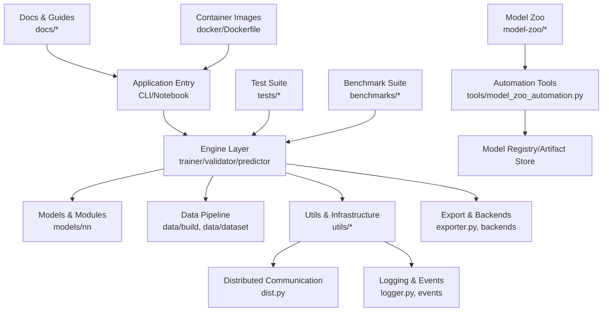

Diagram Sources
- [ultralytics/engine/trainer.py](file://ultralytics/engine/trainer.py)
- [ultralytics/engine/validator.py](file://ultralytics/engine/validator.py)
- [ultralytics/engine/predictor.py](file://ultralytics/engine/predictor.py)
- [ultralytics/engine/exporter.py](file://ultralytics/engine/exporter.py)
- [ultralytics/utils/dist.py](file://ultralytics/utils/dist.py)
- [ultralytics/utils/logger.py](file://ultralytics/utils/logger.py)
- [ultralytics/data/build.py](file://ultralytics/data/build.py)
- [ultralytics/data/dataset.py](file://ultralytics/data/dataset.py)
- [docker/Dockerfile](file://docker/Dockerfile)
- [model-zoo/models.json](file://model-zoo/models.json)
- [tools/model_zoo_automation.py](file://tools/model_zoo_automation.py)

Section Sources
- [README.md](file://README.md)
- [pyproject.toml](file://pyproject.toml)

## Core Components
- Trainer: Responsible for the training loop, optimizer scheduling, EMA, checkpoint saving, callbacks, and logging.
- Validator: Responsible for validation set evaluation, metric computation, visualization, and report generation.
- Predictor: Responsible for inference loading, preprocessing, post-processing, result serialization, and streaming inference.
- Exporter: Responsible for exporting PyTorch models to ONNX/TensorRT/OpenVINO/TFLite formats with pre-checks and validation.
- Distributed Utilities (dist): Encapsulates DDP initialization, device discovery, inter-process communication, and error propagation.
- Data Construction (data/build, dataset): Dataset building, augmentation, sharding, caching, and multi-process loading.
- Utils and Infrastructure (utils): Logging, events, benchmarks, export capability matrix, pre-checks, error hierarchy, etc.
- **Model Zoo Management (new)**: Provides model submission, validation, registration, and automation workflows.

Section Sources
- [ultralytics/engine/trainer.py](file://ultralytics/engine/trainer.py)
- [ultralytics/engine/validator.py](file://ultralytics/engine/validator.py)
- [ultralytics/engine/predictor.py](file://ultralytics/engine/predictor.py)
- [ultralytics/engine/exporter.py](file://ultralytics/engine/exporter.py)
- [ultralytics/utils/dist.py](file://ultralytics/utils/dist.py)
- [ultralytics/data/build.py](file://ultralytics/data/build.py)
- [ultralytics/data/dataset.py](file://ultralytics/data/dataset.py)

## Architecture Overview
The following diagram shows the interaction from entry points to core engine, data and export, and external systems.

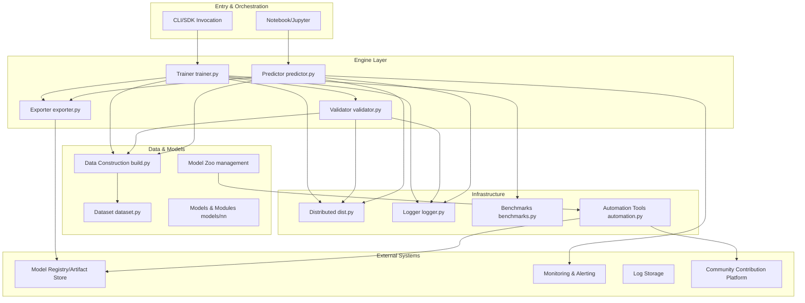

Diagram Sources
- [ultralytics/engine/trainer.py](file://ultralytics/engine/trainer.py)
- [ultralytics/engine/validator.py](file://ultralytics/engine/validator.py)
- [ultralytics/engine/predictor.py](file://ultralytics/engine/predictor.py)
- [ultralytics/engine/exporter.py](file://ultralytics/engine/exporter.py)
- [ultralytics/utils/dist.py](file://ultralytics/utils/dist.py)
- [ultralytics/utils/logger.py](file://ultralytics/utils/logger.py)
- [ultralytics/utils/benchmarks.py](file://ultralytics/utils/benchmarks.py)
- [ultralytics/data/build.py](file://ultralytics/data/build.py)
- [ultralytics/data/dataset.py](file://ultralytics/data/dataset.py)
- [model-zoo/models.json](file://model-zoo/models.json)
- [tools/model_zoo_automation.py](file://tools/model_zoo_automation.py)

## Detailed Component Analysis

### Trainer
- Responsibilities: Training loop, loss composition, optimizer and learning rate scheduling, EMA, checkpoints, callbacks, logging and metric reporting.
- Key Points:
  - Uses unified configuration-driven approach (default.yaml) to ensure reproducible experiments.
  - Combines with distributed utilities for multi-GPU training, noting gradient synchronization and normalization consistency.
  - Integrates experiment tracking and monitoring via callback mechanisms.
  - Exception paths should log context and propagate upward for root cause identification.

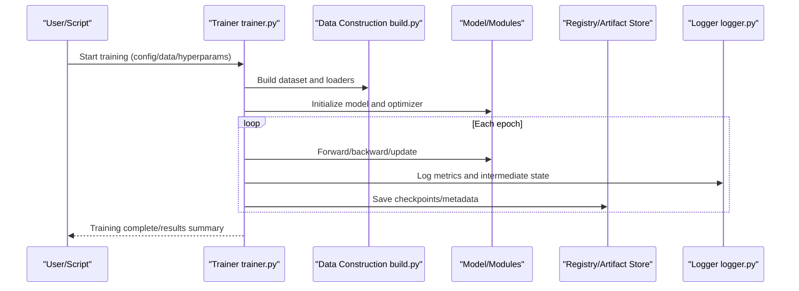

Diagram Sources
- [ultralytics/engine/trainer.py](file://ultralytics/engine/trainer.py)
- [ultralytics/data/build.py](file://ultralytics/data/build.py)
- [ultralytics/utils/logger.py](file://ultralytics/utils/logger.py)

Section Sources
- [ultralytics/engine/trainer.py](file://ultralytics/engine/trainer.py)
- [ultralytics/cfg/default.yaml](file://ultralytics/cfg/default.yaml)

### Validator
- Responsibilities: Validation set evaluation, metric computation, visualization output, report generation.
- Key Points:
  - Fixed random seeds and deterministic settings ensure reproducible evaluation.
  - Supports multiple tasks and metrics with a unified interface for easy extension.
  - Integrates with the exporter for consistency validation of exported models.

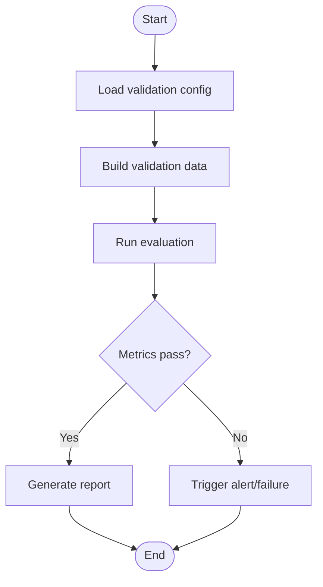

Diagram Sources
- [ultralytics/engine/validator.py](file://ultralytics/engine/validator.py)

Section Sources
- [ultralytics/engine/validator.py](file://ultralytics/engine/validator.py)

### Predictor
- Responsibilities: Inference loading, preprocessing, post-processing, batch and streaming inference, result serialization.
- Key Points:
  - Warmup and caching strategies reduce first-frame latency.
  - Dynamic batch size and precision selection balance throughput and latency.
  - Works with the exporter to preferentially use target backend-optimized models.

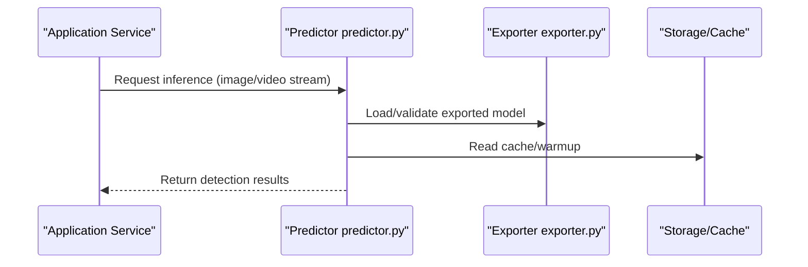

Diagram Sources
- [ultralytics/engine/predictor.py](file://ultralytics/engine/predictor.py)
- [ultralytics/engine/exporter.py](file://ultralytics/engine/exporter.py)

Section Sources
- [ultralytics/engine/predictor.py](file://ultralytics/engine/predictor.py)
- [ultralytics/engine/exporter.py](file://ultralytics/engine/exporter.py)

### Exporter
- Responsibilities: Model export, pre-checks, capability matrix matching, post-export validation.
- Key Points:
  - Pre-export checks for input shape, operator support, and precision compatibility.
  - Post-export round-trip consistency testing to ensure numerical stability.
  - Integrates with benchmark suites to compare performance across different backends.

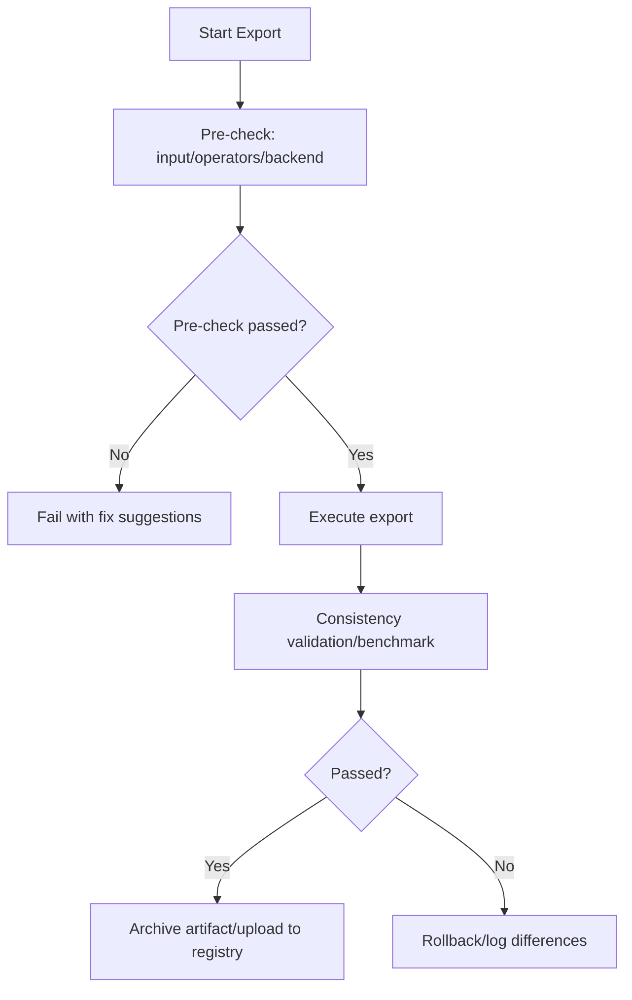

Diagram Sources
- [ultralytics/engine/exporter.py](file://ultralytics/engine/exporter.py)
- [tests/test_export_roundtrip.py](file://tests/test_export_roundtrip.py)

Section Sources
- [ultralytics/engine/exporter.py](file://ultralytics/engine/exporter.py)
- [tests/test_export_roundtrip.py](file://tests/test_export_roundtrip.py)

### Distributed Utilities (dist)
- Responsibilities: DDP initialization, device discovery, process communication, error propagation and recovery.
- Key Points:
  - Unified environment variables and port allocation to avoid conflicts.
  - Captures and aggregates exceptions from all processes for improved observability.
  - Deep integration with trainer/validator, abstracting underlying details.

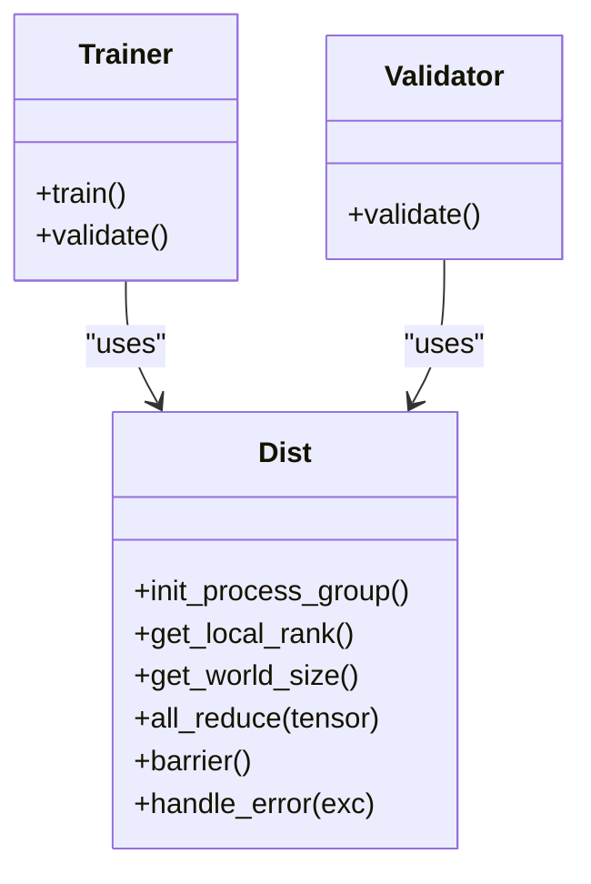

Diagram Sources
- [ultralytics/utils/dist.py](file://ultralytics/utils/dist.py)
- [ultralytics/engine/trainer.py](file://ultralytics/engine/trainer.py)
- [ultralytics/engine/validator.py](file://ultralytics/engine/validator.py)

Section Sources
- [ultralytics/utils/dist.py](file://ultralytics/utils/dist.py)
- [tests/test_moe_ddp_fixes.py](file://tests/test_moe_ddp_fixes.py)

### Data Construction and Dataset (data/build, dataset)
- Responsibilities: Dataset parsing, augmentation, sharding, caching, multi-process loading.
- Key Points:
  - Properly set workers and batch size to avoid I/O bottlenecks.
  - Enable caching and persistence to accelerate repeated training and evaluation.
  - Data validation and anomalous sample isolation for improved robustness.

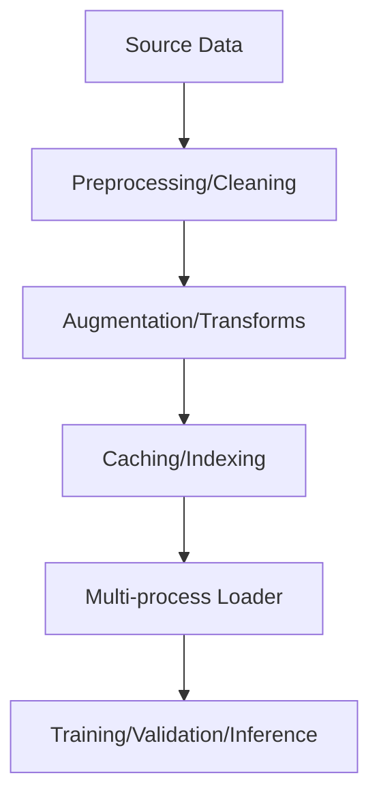

Diagram Sources
- [ultralytics/data/build.py](file://ultralytics/data/build.py)
- [ultralytics/data/dataset.py](file://ultralytics/data/dataset.py)

Section Sources
- [ultralytics/data/build.py](file://ultralytics/data/build.py)
- [ultralytics/data/dataset.py](file://ultralytics/data/dataset.py)

## Dependency Analysis
- Internal Dependencies:
  - Engine layer depends on data construction and utility modules; exporter depends on backend capability matrix and validation tools.
  - Distributed utilities are shared by trainer and validator, forming lateral support.
  - **Model Zoo management depends on automation tools for validation and registration**.
- External Dependencies:
  - Container images define runtime environment and dependency versions, ensuring consistency and portability.
  - Benchmark suites are used for regression and performance gates.

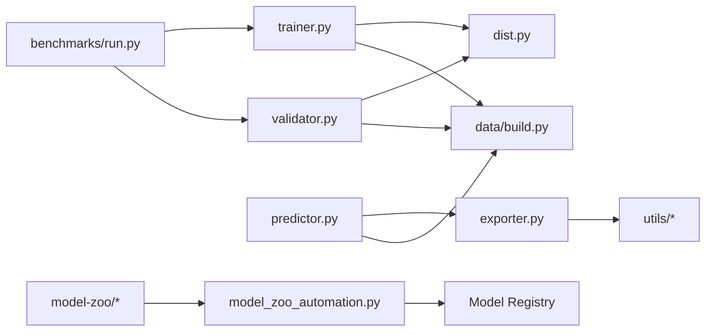

Diagram Sources
- [ultralytics/engine/trainer.py](file://ultralytics/engine/trainer.py)
- [ultralytics/engine/validator.py](file://ultralytics/engine/validator.py)
- [ultralytics/engine/predictor.py](file://ultralytics/engine/predictor.py)
- [ultralytics/engine/exporter.py](file://ultralytics/engine/exporter.py)
- [ultralytics/utils/dist.py](file://ultralytics/utils/dist.py)
- [ultralytics/data/build.py](file://ultralytics/data/build.py)
- [benchmarks/run.py](file://benchmarks/run.py)
- [model-zoo/models.json](file://model-zoo/models.json)
- [tools/model_zoo_automation.py](file://tools/model_zoo_automation.py)

Section Sources
- [pyproject.toml](file://pyproject.toml)
- [docker/Dockerfile](file://docker/Dockerfile)

## Performance and Memory Optimization
- Inference Side
  - Use the exporter to generate target backend-optimized models (e.g., TensorRT/OpenVINO), reducing Python overhead.
  - Warmup models and cache common inputs to reduce first-frame latency.
  - Dynamic batch size and half-precision inference to balance throughput and latency.
- Training Side
  - Adjust workers and pin_memory to alleviate I/O bottlenecks.
  - Use mixed precision and gradient accumulation to improve VRAM utilization.
  - Set EMA and checkpoint frequency appropriately to balance stability and IO.
- Benchmarks and Regression
  - Use benchmark suites for version-to-version comparison and establish performance gates.

Section Sources
- [ultralytics/engine/exporter.py](file://ultralytics/engine/exporter.py)
- [ultralytics/utils/benchmarks.py](file://ultralytics/utils/benchmarks.py)
- [docs/en/guides/yolo-performance-metrics.md](file://docs/en/guides/yolo-performance-metrics.md)

## Large-Scale Data Processing and Distributed Training
- Data Scale
  - Sharding and incremental loading to avoid loading all data at once.
  - Persistent caching and indexing to accelerate multiple iterations.
- Distributed Training
  - Use DDP for multi-GPU parallelism, ensuring correct global normalization and gradient synchronization.
  - Process error aggregation and root cause reporting to reduce troubleshooting time.
- Resource Management
  - Containerized deployment with explicit CPU/GPU/memory quotas and limits.
  - Queuing and rate limiting to protect downstream services and storage.

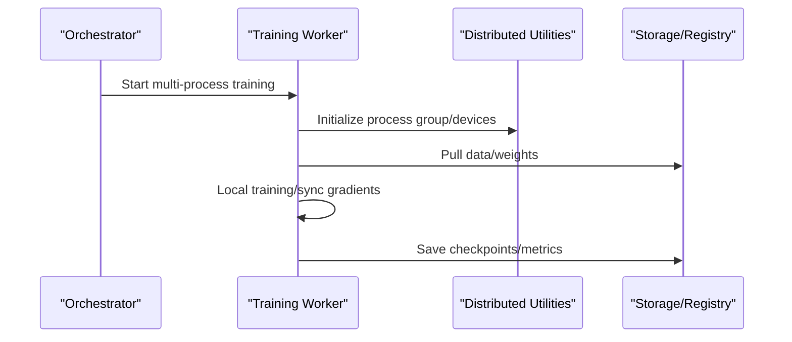

Diagram Sources
- [ultralytics/utils/dist.py](file://ultralytics/utils/dist.py)
- [ultralytics/engine/trainer.py](file://ultralytics/engine/trainer.py)

Section Sources
- [ultralytics/utils/dist.py](file://ultralytics/utils/dist.py)
- [tests/test_moe_ddp_fixes.py](file://tests/test_moe_ddp_fixes.py)

## Model Version Management and Experiment Tracking
- Configuration as Code
  - All hyperparameters and data paths are codified in YAML/JSON format under version control.
- Artifacts and Registry
  - Exported models and checkpoints are archived with semantic versioning, accompanied by metadata and hash fingerprints.
- Experiment Tracking
  - Training and validation metrics, logs, and visualizations are uniformly reported, supporting retrospection and comparison.
- Result Reproduction
  - Fixed random seeds, determinism, and backend versions ensure reproducibility.

Section Sources
- [ultralytics/cfg/default.yaml](file://ultralytics/cfg/default.yaml)
- [ultralytics/engine/trainer.py](file://ultralytics/engine/trainer.py)
- [ultralytics/engine/validator.py](file://ultralytics/engine/validator.py)

## Model Zoo Best Practices

### Model Submission Standards
To ensure model quality and community contribution consistency, all model submissions must follow these standards:

- **Metadata Format Requirements**
  - Use standardized JSON Schema to validate model metadata
  - Include complete model description, author information, and license declaration
  - Provide detailed performance benchmark results and applicable scenario descriptions
  - Specify supported export formats and hardware platform compatibility

- **Model File Structure**
  - Unified directory organization and naming conventions
  - Include configuration files, weight files, and validation scripts
  - Provide minimal reproducible example code and dataset references

- **Quality Gate Standards**
  - Must pass automated test suite validation
  - Performance metrics must meet benchmark threshold requirements
  - Export compatibility validation must pass
  - Security scan must show no vulnerabilities

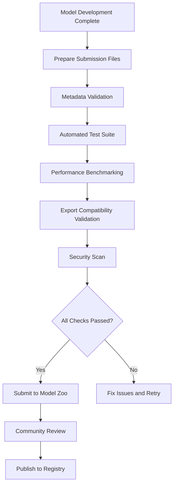

Diagram Sources
- [model-zoo/submission.schema.json](file://model-zoo/submission.schema.json)
- [model-zoo/submissions/example.yaml](file://model-zoo/submissions/example.yaml)
- [tools/model_zoo_automation.py](file://tools/model_zoo_automation.py)

### Performance Benchmarking Standards
- **Benchmark Test Suite**
  - Standardized test datasets and evaluation metrics
  - Multi-hardware platform performance comparison testing
  - Accuracy and speed comparison across different export formats
  - Regression testing to prevent performance degradation

- **Performance Metric Requirements**
  - mAP, mAR and other detection accuracy metrics
  - Inference latency and throughput metrics
  - Memory usage and GPU utilization
  - Model file size and compression ratio

- **Benchmarking Workflow**
  - Automated execution of benchmark test suites
  - Generate detailed performance reports
  - Comparative analysis with historical versions
  - Set performance gate thresholds

### Automated Validation Workflow
- **Validation Pipeline Design**
  - GitHub Actions-based CI/CD pipeline
  - Parallel execution of multiple validation tasks
  - Automatic generation of validation reports and documentation
  - Detailed error diagnostic information on failure

- **Quality Assurance Measures**
  - Code static analysis and style checking
  - Unit test coverage requirements
  - Integration testing and end-to-end testing
  - Security vulnerability scanning and dependency auditing

**Section Sources**
- [model-zoo/models.json](file://model-zoo/models.json)
- [model-zoo/submission.schema.json](file://model-zoo/submission.schema.json)
- [model-zoo/submissions/example.yaml](file://model-zoo/submissions/example.yaml)
- [tools/model_zoo_automation.py](file://tools/model_zoo_automation.py)

## Code Quality Assurance and Testing Strategy
- Test Layering
  - Unit tests: Cover core functions and utilities.
  - Integration tests: Training/validation/export pipeline closure.
  - End-to-end tests: Simulate real scenarios and boundary conditions.
  - Benchmark tests: Performance regression gates.
- Key Use Cases
  - Engine behavior and error propagation.
  - Export round-trip consistency.
  - MoE/DDP fix path validation.
- Automation
  - Pre-commit static checks and test suite execution.
  - Coverage thresholds and quality gates.

Section Sources
- [tests/test_engine.py](file://tests/test_engine.py)
- [tests/test_export_roundtrip.py](file://tests/test_export_roundtrip.py)
- [tests/test_moe_ddp_fixes.py](file://tests/test_moe_ddp_fixes.py)

## Continuous Integration and Release Pipeline
- CI Stage
  - Dependency installation and environment preparation (container images).
  - Static checks, unit tests, integration tests, and benchmark regression.
  - **Model Zoo submission validation and quality gates**.
- CD Stage
  - Build and sign artifacts, upload to registry.
  - Canary release and rollback strategies, health checks and automatic rollback.
  - **Automated validation and community review before model release**.
- Documentation and Changes
  - Auto-generate API and changelog, keeping documentation in sync with code.
  - **Auto-generation and maintenance of Model Zoo documentation and examples**.

Section Sources
- [docker/Dockerfile](file://docker/Dockerfile)
- [scripts/smoke_test_coco2017.py](file://scripts/smoke_test_coco2017.py)
- [benchmarks/run.py](file://benchmarks/run.py)
- [benchmarks/suite.py](file://benchmarks/suite.py)
- [tools/model_zoo_automation.py](file://tools/model_zoo_automation.py)

## Security, Privacy, and Compliance
- Security
  - Principle of least privilege and key management, avoiding hardcoded sensitive information.
  - Input validation and whitelisting to prevent malicious payloads.
  - Exported model integrity verification and signing.
  - **Model Zoo security scanning and dependency auditing**.
- Privacy
  - Data anonymization and de-identification, following the principle of minimum necessity.
  - Access control and audit logging to meet compliance requirements.
- Compliance
  - Third-party dependency license review and security vulnerability scanning.
  - Data cross-border and retention policies compliant with regulations.
  - **Model license and intellectual property compliance checks**.

Section Sources
- [docs/en/help/security.md](file://docs/en/help/security.md)
- [docs/en/help/privacy.md](file://docs/en/help/privacy.md)

## Monitoring, Alerting, and Log Management
- Logging
  - Structured logging with leveled output, including context and TraceID.
  - Centralized log collection and search for rapid issue identification.
- Metrics and Alerting
  - Collect key metrics including latency, throughput, error rate, and resource usage.
  - Threshold-based alerting and self-healing strategies.
- Observability
  - Distributed tracing and sampling to identify hotspots and bottlenecks.
  - Dashboards and reports to support decision-making and retrospectives.

Section Sources
- [ultralytics/utils/logger.py](file://ultralytics/utils/logger.py)
- [docs/en/guides/model-monitoring-and-maintenance.md](file://docs/en/guides/model-monitoring-and-maintenance.md)

## Fault Diagnosis and Troubleshooting
- Common Issues
  - Distributed communication failure: Check network, ports, and firewalls.
  - Export inconsistency: Verify input shape, operator support, and precision.
  - Slow data loading: Adjust workers, caching, and disk I/O.
  - **Model submission failure: Check metadata format and validation rules**.
- Diagnostic Tools
  - Use benchmark suites and logs to identify performance bottlenecks.
  - Leverage error hierarchy and root cause reporting for rapid issue convergence.
  - **Model Zoo automation tool diagnostic reports**.
- Recovery Strategies
  - Checkpoint rollback and canary switching to reduce impact scope.
  - Degradation mode and circuit breaker protection to ensure availability.

Section Sources
- [ultralytics/utils/checks.py](file://ultralytics/utils/checks.py)
- [ultralytics/utils/benchmarks.py](file://ultralytics/utils/benchmarks.py)
- [tests/test_engine.py](file://tests/test_engine.py)

## Team Collaboration and Knowledge Transfer
- Standards and Templates
  - Unified configuration templates, commit messages, and change descriptions.
  - Documentation templates and case libraries to reduce onboarding costs.
  - **Model submission templates and best practices guide**.
- Review and Sharing
  - Code review checklists and best practices sharing sessions.
  - Incident retrospectives and experience accumulation to form a knowledge base.
  - **Model review process and community contribution guide**.
- Knowledge Management
  - Versioned documentation and change records for traceability.
  - New member onboarding and mentorship programs to accelerate growth.
  - **Model Zoo usage tutorials and case sharing**.

Section Sources
- [examples/YOLO-Master-Cross-Platform-Edge-Deployment/TECHNICAL_REPORT.md](file://examples/YOLO-Master-Cross-Platform-Edge-Deployment/TECHNICAL_REPORT.md)
- [docs/en/guides/model-deployment-practices.md](file://docs/en/guides/model-deployment-practices.md)

## Conclusion
Through containerization and standardized pipelines, rigorous testing and benchmark gates, comprehensive monitoring and logging systems, and standardized version and experiment management, YOLO-Master achieves high availability, high performance, and high maintainability in production environments. **The newly added Model Zoo best practices further ensure model quality and community contribution consistency**. It is recommended to promote the best practices in this guide within teams and continuously optimize and evolve based on business characteristics.
