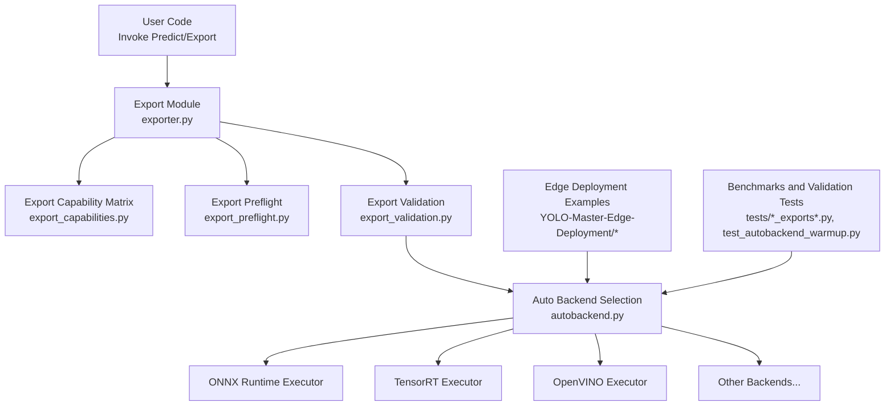
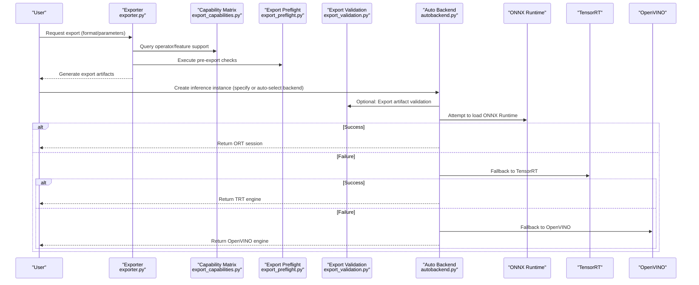
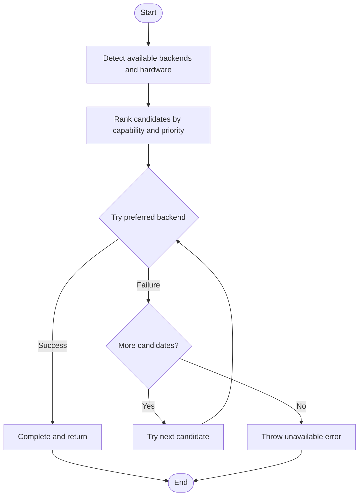
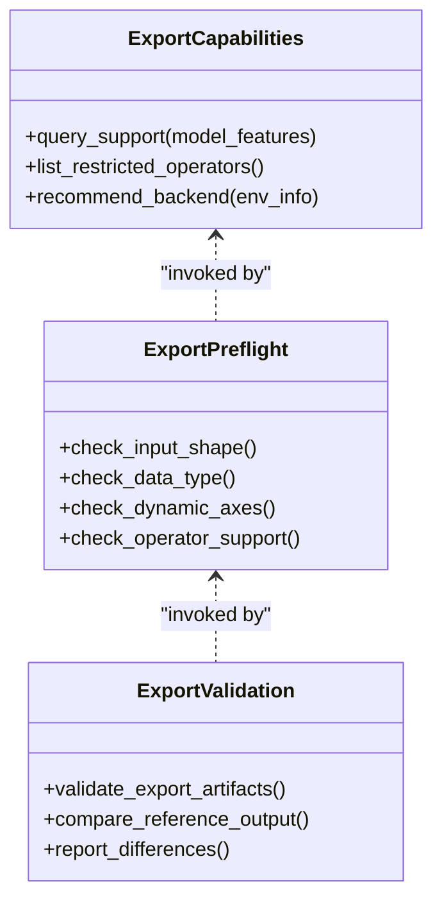
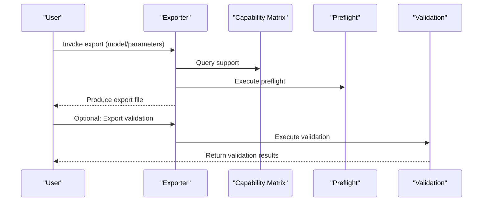
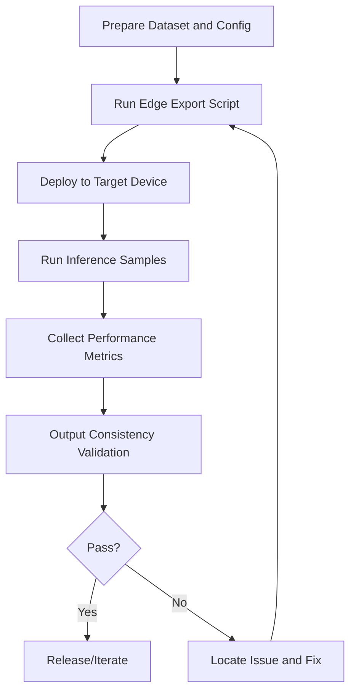
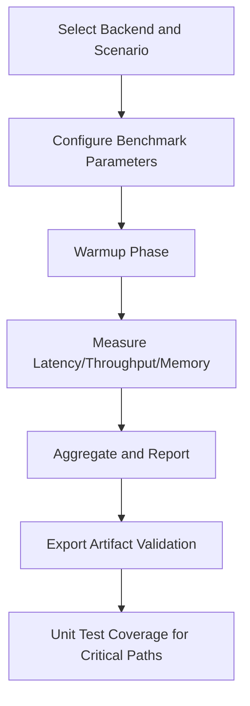
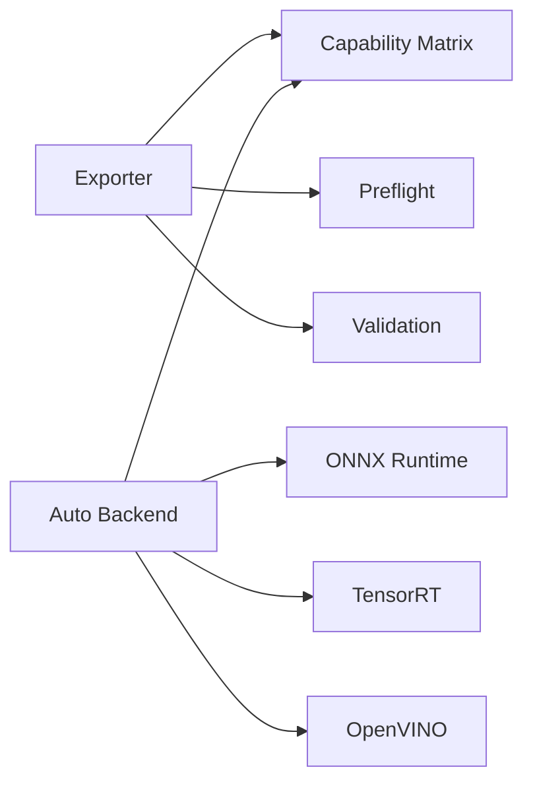

# Backend Adapter Development

<cite>
**Files referenced in this document**
- [autobackend.py](file://ultralytics/nn/autobackend.py)
- [exporter.py](file://ultralytics/engine/exporter.py)
- [export_capabilities.py](file://ultralytics/utils/export_capabilities.py)
- [export_preflight.py](file://ultralytics/utils/export_preflight.py)
- [export_validation.py](file://ultralytics/utils/export_validation.py)
- [benchmarks.py](file://ultralytics/utils/benchmarks.py)
- [test_autobackend_warmup.py](file://tests/test_autobackend_warmup.py)
- [test_export_capability_matrix.py](file://tests/test_export_capability_matrix.py)
- [test_export_preflight.py](file://tests/test_export_preflight.py)
- [test_exports.py](file://tests/test_exports.py)
- [test_edge_deployment_utils.py](file://tests/test_edge_deployment_utils.py)
- [README.md](file://examples/YOLO-Master-Edge-Deployment/README.md)
- [edge_utils.py](file://examples/YOLO-Master-Edge-Deployment/edge_utils.py)
- [export_edge_models.py](file://examples/YOLO-Master-Edge-Deployment/export_edge_models.py)
- [validate_edge_outputs.py](file://examples/YOLO-Master-Edge-Deployment/validate_edge_outputs.py)
</cite>

## Table of Contents
1. [Introduction](#introduction)
2. [Project Structure](#project-structure)
3. [Core Components](#core-components)
4. [Architecture Overview](#architecture-overview)
5. [Detailed Component Analysis](#detailed-component-analysis)
6. [Dependency Analysis](#dependency-analysis)
7. [Performance Considerations](#performance-considerations)
8. [Troubleshooting Guide](#troubleshooting-guide)
9. [Conclusion](#conclusion)
10. [Appendix](#appendix)

## Introduction
This guide is intended for developers who wish to add new "inference backend adapters" to the YOLO inference system. It covers interface abstraction, ONNX Runtime/TensorRT/OpenVINO and other framework integration, model export and optimization (including operator support and precision calibration), edge device adaptation (ARM/GPU/dedicated accelerators), backend selection and automatic fallback strategies, performance benchmarking and compatibility validation tool usage, as well as memory management and resource tuning best practices. The document also provides reusable adapter templates and development environment setup recommendations to help quickly implement new backends.

## Project Structure
This project adopts a layered design of "unified export + automatic backend selection + multi-backend execution" for inference backend capabilities:
- Export and preflight: Responsible for converting PyTorch models to intermediate formats (e.g., ONNX), performing capability matrix validation and pre-export checks.
- Automatic backend selection: Dynamically selects the optimal backend based on target platform, available libraries, and model capabilities, with fallback support.
- Executors: Encapsulate loading, warmup, inference, result parsing, and resource management for each backend.
- Tests and examples: Provide end-to-end export, edge deployment and validation scripts, as well as unit tests for auto-backend and export capabilities.

Diagram sources
- [exporter.py](file://ultralytics/engine/exporter.py)
- [export_capabilities.py](file://ultralytics/utils/export_capabilities.py)
- [export_preflight.py](file://ultralytics/utils/export_preflight.py)
- [export_validation.py](file://ultralytics/utils/export_validation.py)
- [autobackend.py](file://ultralytics/nn/autobackend.py)
- [README.md](file://examples/YOLO-Master-Edge-Deployment/README.md)
- [test_autobackend_warmup.py](file://tests/test_autobackend_warmup.py)
- [test_export_capability_matrix.py](file://tests/test_export_capability_matrix.py)
- [test_export_preflight.py](file://tests/test_export_preflight.py)
- [test_exports.py](file://tests/test_exports.py)

Section sources
- [exporter.py](file://ultralytics/engine/exporter.py)
- [autobackend.py](file://ultralytics/nn/autobackend.py)
- [README.md](file://examples/YOLO-Master-Edge-Deployment/README.md)

## Core Components
- Export and Capability Matrix
  - Responsible for exporting models to target formats, performing capability validation before and after export to ensure the target backend can correctly run the model.
  - Key responsibilities: Export parameter parsing, graph conversion, operator support determination, export artifact validation.
- Automatic Backend Selection
  - Selects the optimal backend based on runtime environment and capability matrix; falls back to other available backends by priority when the preferred one fails.
  - Key responsibilities: Environment detection, capability matching, loading and initialization, error recovery and fallback.
- Edge Deployment Toolchain
  - Provides export scripts, edge inference samples, and output consistency validation tools for deployment and regression validation on ARM/GPU/dedicated accelerators.
- Benchmarks and Tests
  - Provides unit tests for end-to-end export and auto-backend selection, as well as edge deployment tools, ensuring functional stability and compatibility.

Section sources
- [exporter.py](file://ultralytics/engine/exporter.py)
- [export_capabilities.py](file://ultralytics/utils/export_capabilities.py)
- [export_preflight.py](file://ultralytics/utils/export_preflight.py)
- [export_validation.py](file://ultralytics/utils/export_validation.py)
- [autobackend.py](file://ultralytics/nn/autobackend.py)
- [edge_utils.py](file://examples/YOLO-Master-Edge-Deployment/edge_utils.py)
- [export_edge_models.py](file://examples/YOLO-Master-Edge-Deployment/export_edge_models.py)
- [validate_edge_outputs.py](file://examples/YOLO-Master-Edge-Deployment/validate_edge_outputs.py)
- [test_autobackend_warmup.py](file://tests/test_autobackend_warmup.py)
- [test_export_capability_matrix.py](file://tests/test_export_capability_matrix.py)
- [test_export_preflight.py](file://tests/test_export_preflight.py)
- [test_exports.py](file://tests/test_exports.py)

## Architecture Overview
The following diagram shows the overall flow from "export" to "automatic backend selection and execution," as well as the integration points for edge deployment and test validation.

Diagram sources
- [exporter.py](file://ultralytics/engine/exporter.py)
- [export_capabilities.py](file://ultralytics/utils/export_capabilities.py)
- [export_preflight.py](file://ultralytics/utils/export_preflight.py)
- [export_validation.py](file://ultralytics/utils/export_validation.py)
- [autobackend.py](file://ultralytics/nn/autobackend.py)

## Detailed Component Analysis

### Automatic Backend Selection and Fallback Mechanism
- Design key points
  - Environment detection: Detect available libraries (e.g., onnxruntime, tensorrt, openvino) and hardware capabilities (CPU/GPU/NPU).
  - Capability matching: Combine export capability matrix with model features to filter candidate backends.
  - Loading and warmup: Try the preferred backend first, fall back by priority on failure; perform necessary warmup on the selected backend to stabilize latency.
  - Error handling: Catch import missing, version incompatibility, operator unsupported exceptions, record diagnostic information and trigger fallback.
- Typical flow
  - User passes target backend or leaves it empty for automatic system selection.
  - If not explicitly specified, the system ranks candidates based on capability matrix and environment detection results.
  - Attempts loading sequentially; any stage failure moves to the next candidate.
  - Returns a unified interface for upper-layer invocation upon success.

Diagram sources
- [autobackend.py](file://ultralytics/nn/autobackend.py)

Section sources
- [autobackend.py](file://ultralytics/nn/autobackend.py)
- [test_autobackend_warmup.py](file://tests/test_autobackend_warmup.py)

### Export and Capability Matrix
- Capability Matrix
  - Maintains support status of different backends for model features (input shapes, data types, operator sets), used for pre-export evaluation and runtime selection.
- Export Preflight
  - Checks input dimensions, data types, dynamic axis configuration, operator support, etc. before export to avoid invalid exports.
- Export Validation
  - Performs basic validation on exported intermediate artifacts (e.g., shapes, value ranges, key node existence) to reduce runtime failure probability.
- Best practices
  - Add capability entries for new backends, specifying supported input/output constraints and known limitations.
  - Expose necessary optimization switches in export parameters (e.g., precision, graph optimization level, kernel selection).

Diagram sources
- [export_capabilities.py](file://ultralytics/utils/export_capabilities.py)
- [export_preflight.py](file://ultralytics/utils/export_preflight.py)
- [export_validation.py](file://ultralytics/utils/export_validation.py)

Section sources
- [export_capabilities.py](file://ultralytics/utils/export_capabilities.py)
- [export_preflight.py](file://ultralytics/utils/export_preflight.py)
- [export_validation.py](file://ultralytics/utils/export_validation.py)
- [test_export_capability_matrix.py](file://tests/test_export_capability_matrix.py)
- [test_export_preflight.py](file://tests/test_export_preflight.py)

### Exporter and Execution Entry
- Exporter
  - Responsible for converting trained models to target formats (e.g., ONNX), adjusting export options based on capability matrix and preflight results.
  - Supports batch export, step-by-step export, and incremental updates for parallel builds on different platforms.
- Execution Entry
  - Exposes a unified prediction interface externally, internally obtaining specific executors via the auto-backend selector.
  - Provides standardized input/output protocols for common tasks (detection, segmentation, pose, etc.).

Diagram sources
- [exporter.py](file://ultralytics/engine/exporter.py)
- [export_capabilities.py](file://ultralytics/utils/export_capabilities.py)
- [export_preflight.py](file://ultralytics/utils/export_preflight.py)
- [export_validation.py](file://ultralytics/utils/export_validation.py)

Section sources
- [exporter.py](file://ultralytics/engine/exporter.py)
- [test_exports.py](file://tests/test_exports.py)

### Edge Device Adaptation and Deployment
- Adaptation methods
  - Use export scripts in edge deployment examples to generate optimized models for different targets (ARM CPU, NVIDIA Jetson, RKNN, CoreML, etc.).
  - Use edge inference samples for end-to-end validation, comparing results with reference implementations via output consistency tools.
- Key steps
  - Prepare data and configuration files, set target platform and optimization options.
  - Execute export scripts to generate target format models.
  - Install corresponding runtimes and dependencies on target devices.
  - Run inference samples and collect metrics (throughput, latency, memory usage).
  - Use validation tools to compare outputs, ensuring precision and stability.
- Considerations
  - Pay attention to the trade-off between dynamic and static sizes; fix input shapes when necessary to improve performance.
  - Enable corresponding optimization switches for NPU/GPU (e.g., quantization, kernel fusion, batch size).

Diagram sources
- [README.md](file://examples/YOLO-Master-Edge-Deployment/README.md)
- [edge_utils.py](file://examples/YOLO-Master-Edge-Deployment/edge_utils.py)
- [export_edge_models.py](file://examples/YOLO-Master-Edge-Deployment/export_edge_models.py)
- [validate_edge_outputs.py](file://examples/YOLO-Master-Edge-Deployment/validate_edge_outputs.py)
- [test_edge_deployment_utils.py](file://tests/test_edge_deployment_utils.py)

Section sources
- [README.md](file://examples/YOLO-Master-Edge-Deployment/README.md)
- [edge_utils.py](file://examples/YOLO-Master-Edge-Deployment/edge_utils.py)
- [export_edge_models.py](file://examples/YOLO-Master-Edge-Deployment/export_edge_models.py)
- [validate_edge_outputs.py](file://examples/YOLO-Master-Edge-Deployment/validate_edge_outputs.py)
- [test_edge_deployment_utils.py](file://tests/test_edge_deployment_utils.py)

### Performance Benchmarking and Compatibility Validation
- Benchmark tools
  - Provide a unified benchmark entry, supporting latency, throughput, and resource usage measurements for different backends.
  - Configurable batch size, input resolution, repeat count, and warmup rounds for stable statistical results.
- Compatibility validation
  - Ensure consistent model behavior across different backends via export capability matrix and export preflight/validation.
  - Use unit test suites to cover critical paths, including auto-backend warmup, export capability matrix, export preflight, and end-to-end export.

Diagram sources
- [benchmarks.py](file://ultralytics/utils/benchmarks.py)
- [test_autobackend_warmup.py](file://tests/test_autobackend_warmup.py)
- [test_export_capability_matrix.py](file://tests/test_export_capability_matrix.py)
- [test_export_preflight.py](file://tests/test_export_preflight.py)
- [test_exports.py](file://tests/test_exports.py)

Section sources
- [benchmarks.py](file://ultralytics/utils/benchmarks.py)
- [test_autobackend_warmup.py](file://tests/test_autobackend_warmup.py)
- [test_export_capability_matrix.py](file://tests/test_export_capability_matrix.py)
- [test_export_preflight.py](file://tests/test_export_preflight.py)
- [test_exports.py](file://tests/test_exports.py)

## Dependency Analysis
- Component coupling
  - Exporter depends on capability matrix and preflight/validation modules, forming a closed loop of "pre-export evaluation—export—post-export validation."
  - Auto-backend selector depends on capability matrix and environment detection results to determine the final executor.
- External dependencies
  - ONNX Runtime, TensorRT, OpenVINO, and other third-party runtimes are loaded on demand, falling back on failure.
- Potential risks
  - Version incompatibility causing import failures or runtime crashes; minimum version requirements should be specified in the capability matrix.
  - Missing or unsupported operators should be intercepted in pre-checks to avoid wasting export time.

Diagram sources
- [exporter.py](file://ultralytics/engine/exporter.py)
- [export_capabilities.py](file://ultralytics/utils/export_capabilities.py)
- [export_preflight.py](file://ultralytics/utils/export_preflight.py)
- [export_validation.py](file://ultralytics/utils/export_validation.py)
- [autobackend.py](file://ultralytics/nn/autobackend.py)

Section sources
- [exporter.py](file://ultralytics/engine/exporter.py)
- [autobackend.py](file://ultralytics/nn/autobackend.py)

## Performance Considerations
- Backend selection strategy
  - Prefer backends with hardware acceleration and complete operator support; fall back to CPU-optimized paths in environments without GPU/NPU.
- Export optimization
  - Fix input shapes, enable graph optimization and operator fusion; enable corresponding optimization switches on TensorRT/OpenVINO.
- Warmup and caching
  - Perform warmup before first inference to reduce cold-start jitter; reuse session/engine objects to lower overhead.
- Memory and resources
  - Control batch size and input resolution to avoid excessive peak memory; properly allocate thread count and memory pools.
- Precision and stability
  - Perform calibration and validation in quantized or low-precision modes to ensure precision loss is within acceptable range.

[This section provides general guidance; no specific file references required]

## Troubleshooting Guide
- Common issues
  - Import failure: Missing third-party libraries or version requirements not met; check capability matrix and dependency declarations.
  - Operator unsupported: Export preflight failure or runtime error; check restricted operator list and replace/downgrade.
  - Fallback failure: All candidate backends unavailable; verify hardware drivers and runtime installation.
  - Precision deviation: Export artifact validation failure or inconsistent results; check input preprocessing and dynamic axis configuration.
- Diagnostic methods
  - Enable export preflight and validation logging to locate failure stages.
  - Use benchmark tools to compare performance across different backends and identify bottlenecks.
  - Use edge deployment validation tools to compare outputs and narrow down the problem scope.

Section sources
- [export_preflight.py](file://ultralytics/utils/export_preflight.py)
- [export_validation.py](file://ultralytics/utils/export_validation.py)
- [benchmarks.py](file://ultralytics/utils/benchmarks.py)
- [validate_edge_outputs.py](file://examples/YOLO-Master-Edge-Deployment/validate_edge_outputs.py)

## Conclusion
Through the design of "capability matrix + export preflight/validation + automatic backend selection and fallback," the project achieves a unified inference experience across frameworks and platforms. Developers only need to extend the capability matrix and backend executors to quickly integrate new inference backends. Combined with the edge deployment toolchain and benchmark/validation tests, stable and efficient deployment results can be achieved while ensuring precision.

[This section is a summary; no specific file references required]

## Appendix

### Adapter Template and Development Checklist
- Create new backend executor
  - Implement unified interface: load, warmup, inference, release resources.
  - Register in the auto-backend selector's candidate list and declare capabilities and limitations.
- Update capability matrix
  - Add input/output constraints, data types, dynamic axes, and operator support for the new backend.
- Export and validation
  - Add export options for new formats in the exporter; add corresponding rules in preflight/validation.
- Tests and benchmarks
  - Write unit tests covering load, warmup, inference, and fallback paths; add benchmark cases to evaluate performance.
- Edge deployment
  - Add target platform export scripts and inference samples in edge deployment examples; improve consistency validation.

[This section is an operational checklist; no specific file references required]
