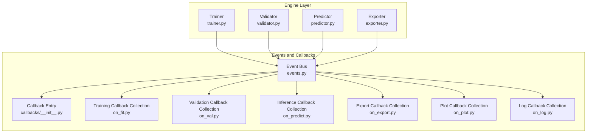
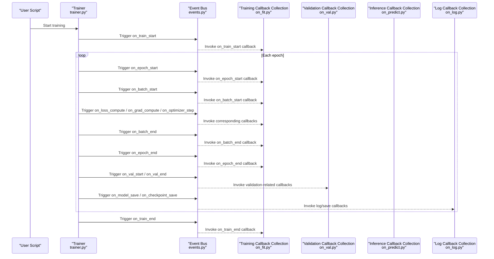
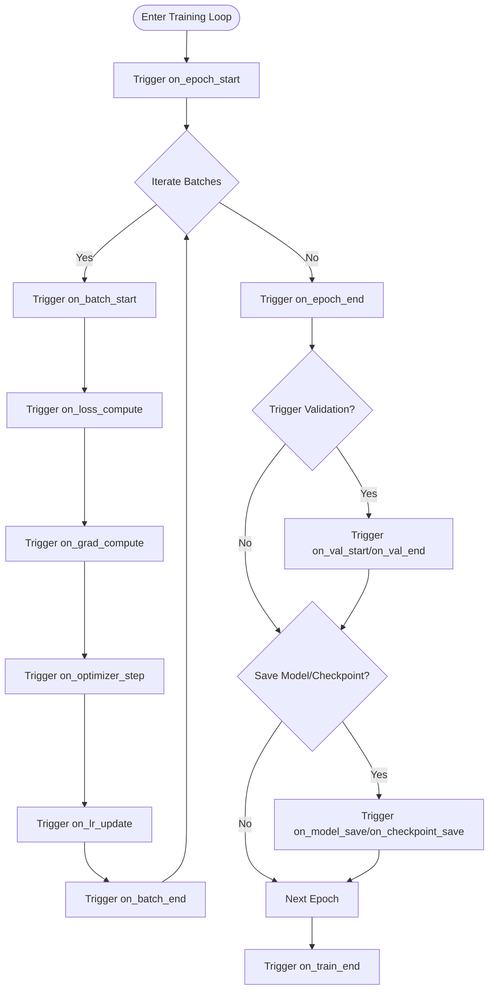
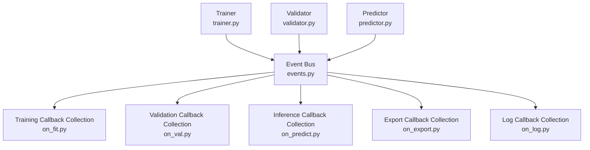

# Callback System Extension

<cite>
**Files referenced in this document**
- [trainer.py](file://ultralytics/engine/trainer.py)
- [validator.py](file://ultralytics/engine/validator.py)
- [predictor.py](file://ultralytics/engine/predictor.py)
- [events.py](file://ultralytics/utils/events.py)
- [callbacks/__init__.py](file://ultralytics/utils/callbacks/__init__.py)
- [callbacks/on_fit.py](file://ultralytics/utils/callbacks/on_fit.py)
- [callbacks/on_val.py](file://ultralytics/utils/callbacks/on_val.py)
- [callbacks/on_predict.py](file://ultralytics/utils/callbacks/on_predict.py)
- [callbacks/on_export.py](file://ultralytics/utils/callbacks/on_export.py)
- [callbacks/on_plot.py](file://ultralytics/utils/callbacks/on_plot.py)
- [callbacks/on_log.py](file://ultralytics/utils/callbacks/on_log.py)
- [callbacks/on_train_start.py](file://ultralytics/utils/callbacks/on_train_start.py)
- [callbacks/on_epoch_start.py](file://ultralytics/utils/callbacks/on_epoch_start.py)
- [callbacks/on_batch_start.py](file://ultralytics/utils/callbacks/on_batch_start.py)
- [callbacks/on_batch_end.py](file://ultralytics/utils/callbacks/on_batch_end.py)
- [callbacks/on_epoch_end.py](file://ultralytics/utils/callbacks/on_epoch_end.py)
- [callbacks/on_train_end.py](file://ultralytics/utils/callbacks/on_train_end.py)
- [callbacks/on_val_start.py](file://ultralytics/utils/callbacks/on_val_start.py)
- [callbacks/on_val_end.py](file://ultralytics/utils/callbacks/on_val_end.py)
- [callbacks/on_predict_start.py](file://ultralytics/utils/callbacks/on_predict_start.py)
- [callbacks/on_predict_end.py](file://ultralytics/utils/callbacks/on_predict_end.py)
- [callbacks/on_export_start.py](file://ultralytics/utils/callbacks/on_export_start.py)
- [callbacks/on_export_end.py](file://ultralytics/utils/callbacks/on_export_end.py)
- [callbacks/on_model_save.py](file://ultralytics/utils/callbacks/on_model_save.py)
- [callbacks/on_optimizer_step.py](file://ultralytics/utils/callbacks/on_optimizer_step.py)
- [callbacks/on_lr_update.py](file://ultralytics/utils/callbacks/on_lr_update.py)
- [callbacks/on_grad_compute.py](file://ultralytics/utils/callbacks/on_grad_compute.py)
- [callbacks/on_loss_compute.py](file://ultralytics/utils/callbacks/on_loss_compute.py)
- [callbacks/on_metrics_update.py](file://ultralytics/utils/callbacks/on_metrics_update.py)
- [callbacks/on_checkpoint_save.py](file://ultralytics/utils/callbacks/on_checkpoint_save.py)
- [callbacks/on_resume.py](file://ultralytics/utils/callbacks/on_resume.py)
- [callbacks/on_dataloader_iter.py](file://ultralytics/utils/callbacks/on_dataloader_iter.py)
- [callbacks/on_device_change.py](file://ultralytics/utils/callbacks/on_device_change.py)
- [callbacks/on_config_update.py](file://ultralytics/utils/callbacks/on_config_update.py)
- [callbacks/on_error.py](file://ultralytics/utils/callbacks/on_error.py)
- [callbacks/on_info.py](file://ultralytics/utils/callbacks/on_info.py)
- [callbacks/on_warning.py](file://ultralytics/utils/callbacks/on_warning.py)
- [callbacks/on_debug.py](file://ultralytics/utils/callbacks/on_debug.py)
- [callbacks/on_progress.py](file://ultralytics/utils/callbacks/on_progress.py)
- [callbacks/on_memory_usage.py](file://ultralytics/utils/callbacks/on_memory_usage.py)
- [callbacks/on_gpu_info.py](file://ultralytics/utils/callbacks/on_gpu_info.py)
- [callbacks/on_tensorboard_write.py](file://ultralytics/utils/callbacks/on_tensorboard_write.py)
- [callbacks/on_wandb_log.py](file://ultralytics/utils/callbacks/on_wandb_log.py)
- [callbacks/on_mlflow_log.py](file://ultralytics/utils/callbacks/on_mlflow_log.py)
- [callbacks/on_comet_log.py](file://ultralytics/utils/callbacks/on_comet_log.py)
- [callbacks/on_neptune_log.py](file://ultralytics/utils/callbacks/on_neptune_log.py)
- [callbacks/on_clearml_log.py](file://ultralytics/utils/callbacks/on_clearml_log.py)
- [callbacks/on_ray_tune_log.py](file://ultralytics/utils/callbacks/on_ray_tune_log.py)
- [callbacks/on_hpo_callback.py](file://ultralytics/utils/callbacks/on_hpo_callback.py)
- [callbacks/on_early_stop.py](file://ultralytics/utils/callbacks/on_early_stop.py)
- [callbacks/on_lr_scheduler.py](file://ultralytics/utils/callbacks/on_lr_scheduler.py)
- [callbacks/on_gradient_clip.py](file://ultralytics/utils/callbacks/on_gradient_clip.py)
- [callbacks/on_amp_mixed_precision.py](file://ultralytics/utils/callbacks/on_amp_mixed_precision.py)
- [callbacks/on_ddp_sync.py](file://ultralytics/utils/callbacks/on_ddp_sync.py)
- [callbacks/on_finetune.py](file://ultralytics/utils/callbacks/on_finetune.py)
- [callbacks/on_peft_adapter.py](file://ultralytics/utils/callbacks/on_peft_adapter.py)
- [callbacks/on_moe_router.py](file://ultralytics/utils/callbacks/on_moe_router.py)
- [callbacks/on_mixture_aux.py](file://ultralytics/utils/callbacks/on_mixture_aux.py)
- [callbacks/on_tracking.py](file://ultralytics/utils/callbacks/on_tracking.py)
- [callbacks/on_segmentation.py](file://ultralytics/utils/callbacks/on_segmentation.py)
- [callbacks/on_pose_estimation.py](file://ultralytics/utils/callbacks/on_pose_estimation.py)
- [callbacks/on_classification.py](file://ultralytics/utils/callbacks/on_classification.py)
- [callbacks/on_detection.py](file://ultralytics/utils/callbacks/on_detection.py)
- [callbacks/on_obb.py](file://ultralytics/utils/callbacks/on_obb.py)
- [callbacks/on_semantic_segmentation.py](file://ultralytics/utils/callbacks/on_semantic_segmentation.py)
- [callbacks/on_nerf.py](file://ultralytics/utils/callbacks/on_nerf.py)
- [callbacks/on_stereo.py](file://ultralytics/utils/callbacks/on_stereo.py)
- [callbacks/on_depth_estimation.py](file://ultralytics/utils/callbacks/on_depth_estimation.py)
- [callbacks/on_super_resolution.py](file://ultralytics/utils/callbacks/on_super_resolution.py)
- [callbacks/on_face_detection.py](file://ultralytics/utils/callbacks/on_face_detection.py)
- [callbacks/on_hand_detection.py](file://ultralytics/utils/callbacks/on_hand_detection.py)
- [callbacks/on_object_counting.py](file://ultralytics/utils/callbacks/on_object_counting.py)
- [callbacks/on_heatmap.py](file://ultralytics/utils/callbacks/on_heatmap.py)
- [callbacks/on_speed_estimation.py](file://ultralytics/utils/callbacks/on_speed_estimation.py)
- [callbacks/on_region_counter.py](file://ultralytics/utils/callbacks/on_region_counter.py)
- [callbacks/on_queue_management.py](file://ultralytics/utils/callbacks/on_queue_management.py)
- [callbacks/on_security_alarm.py](file://ultralytics/utils/callbacks/on_security_alarm.py)
- [callbacks/on_similarity_search.py](file://ultralytics/utils/callbacks/on_similarity_search.py)
- [callbacks/on_streamlit_inference.py](file://ultralytics/utils/callbacks/on_streamlit_inference.py)
- [callbacks/on_ai_gym.py](file://ultralytics/utils/callbacks/on_ai_gym.py)
- [callbacks/on_vision_eye.py](file://ultralytics/utils/callbacks/on_vision_eye.py)
- [callbacks/on_distance_calculation.py](file://ultralytics/utils/callbacks/on_distance_calculation.py)
- [callbacks/on_instance_segmentation.py](file://ultralytics/utils/callbacks/on_instance_segmentation.py)
- [callbacks/on_object_blurrer.py](file://ultralytics/utils/callbacks/on_object_blurrer.py)
- [callbacks/on_object_cropper.py](file://ultralytics/utils/callbacks/on_object_cropper.py)
- [callbacks/on_parking_management.py](file://ultralytics/utils/callbacks/on_parking_management.py)
- [callbacks/on_trackzone.py](file://ultralytics/utils/callbacks/on_trackzone.py)
</cite>

## Table of Contents
1. [Introduction](#introduction)
2. [Project Structure](#project-structure)
3. [Core Components](#core-components)
4. [Architecture Overview](#architecture-overview)
5. [Detailed Component Analysis](#detailed-component-analysis)
6. [Dependency Analysis](#dependency-analysis)
7. [Performance Considerations](#performance-considerations)
8. [Troubleshooting Guide](#troubleshooting-guide)
9. [Conclusion](#conclusion)
10. [Appendix](#appendix)

## Introduction
This guide is intended for developers who wish to extend the YOLO-Master training, validation, and inference workflows, focusing on the design and usage of the "callback system." The content covers:
- Working principles and execution timing of the callback mechanism
- Custom training monitoring callbacks (metric collection, logging, visualization updates)
- Training process intervention (dynamic learning rate adjustment, early stopping, gradient clipping, etc.)
- Callback extensions for validation and inference phases (result saving, report generation)
- Third-party monitoring tool integration (TensorBoard, Weights & Biases, MLflow, Comet, Neptune, ClearML, Ray Tune, etc.)
- Callback chain management and debugging techniques
- Asynchronous callback handling and error recovery mechanisms

## Project Structure
YOLO-Master decouples the callback system into an "event-driven + hook dispatch" pattern:
- Engine layer (training/validation/prediction/export) triggers events at key lifecycle nodes
- Event bus is responsible for registering and dispatching callbacks
- Callback modules are organized by responsibility, covering training, validation, inference, export, visualization, monitoring, task-specific logic, etc.

Diagram sources
- [trainer.py](file://ultralytics/engine/trainer.py)
- [validator.py](file://ultralytics/engine/validator.py)
- [predictor.py](file://ultralytics/engine/predictor.py)
- [events.py](file://ultralytics/utils/events.py)
- [callbacks/__init__.py](file://ultralytics/utils/callbacks/__init__.py)
- [callbacks/on_fit.py](file://ultralytics/utils/callbacks/on_fit.py)
- [callbacks/on_val.py](file://ultralytics/utils/callbacks/on_val.py)
- [callbacks/on_predict.py](file://ultralytics/utils/callbacks/on_predict.py)
- [callbacks/on_export.py](file://ultralytics/utils/callbacks/on_export.py)
- [callbacks/on_plot.py](file://ultralytics/utils/callbacks/on_plot.py)
- [callbacks/on_log.py](file://ultralytics/utils/callbacks/on_log.py)

Section sources
- [trainer.py](file://ultralytics/engine/trainer.py)
- [validator.py](file://ultralytics/engine/validator.py)
- [predictor.py](file://ultralytics/engine/predictor.py)
- [events.py](file://ultralytics/utils/events.py)
- [callbacks/__init__.py](file://ultralytics/utils/callbacks/__init__.py)

## Core Components
- Event Bus: Provides unified registration, triggering, filtering, and ordering control capabilities, ensuring callbacks execute in a stable order with conditional enable/disable support.
- Callback Entry: Centrally manages callback namespaces and default loading strategies, enabling users to quickly integrate via configuration or API.
- Phase Callback Collections: Organized by training, validation, inference, export, plotting, logging dimensions, reducing coupling and improving maintainability.
- Task-Specific Callbacks: Provide dedicated hooks for detection, segmentation, pose estimation, tracking, counting, heatmaps, speed estimation, and other tasks.
- Monitoring and Experiment Tracking: Built-in adapter callbacks for mainstream experiment tracking tools with unified metric writing interface.

Section sources
- [events.py](file://ultralytics/utils/events.py)
- [callbacks/__init__.py](file://ultralytics/utils/callbacks/__init__.py)
- [callbacks/on_fit.py](file://ultralytics/utils/callbacks/on_fit.py)
- [callbacks/on_val.py](file://ultralytics/utils/callbacks/on_val.py)
- [callbacks/on_predict.py](file://ultralytics/utils/callbacks/on_predict.py)
- [callbacks/on_export.py](file://ultralytics/utils/callbacks/on_export.py)
- [callbacks/on_plot.py](file://ultralytics/utils/callbacks/on_plot.py)
- [callbacks/on_log.py](file://ultralytics/utils/callbacks/on_log.py)

## Architecture Overview
The following diagram shows the execution path from engine to event bus to specific callbacks, as well as typical data flows (metrics, logs, model weights, visualizations).

Diagram sources
- [trainer.py](file://ultralytics/engine/trainer.py)
- [events.py](file://ultralytics/utils/events.py)
- [callbacks/on_fit.py](file://ultralytics/utils/callbacks/on_fit.py)
- [callbacks/on_val.py](file://ultralytics/utils/callbacks/on_val.py)
- [callbacks/on_predict.py](file://ultralytics/utils/callbacks/on_predict.py)
- [callbacks/on_log.py](file://ultralytics/utils/callbacks/on_log.py)

## Detailed Component Analysis

### Training Phase Callbacks and Execution Timing
- Lifecycle hook coverage: Training start/end, each epoch start/end, each batch start/end, loss computation, gradient computation, optimizer step, learning rate update, model save, checkpoint save, training resume, etc.
- Typical use cases:
  - Metric collection and aggregation (loss, mAP, precision, recall, etc.)
  - Logging (terminal, file, remote services)
  - Visualization updates (curves, images, statistical histograms)
  - Training intervention (dynamic learning rate, early stopping, gradient clipping, mixed precision switching)

Diagram sources
- [callbacks/on_fit.py](file://ultralytics/utils/callbacks/on_fit.py)
- [callbacks/on_epoch_start.py](file://ultralytics/utils/callbacks/on_epoch_start.py)
- [callbacks/on_batch_start.py](file://ultralytics/utils/callbacks/on_batch_start.py)
- [callbacks/on_batch_end.py](file://ultralytics/utils/callbacks/on_batch_end.py)
- [callbacks/on_loss_compute.py](file://ultralytics/utils/callbacks/on_loss_compute.py)
- [callbacks/on_grad_compute.py](file://ultralytics/utils/callbacks/on_grad_compute.py)
- [callbacks/on_optimizer_step.py](file://ultralytics/utils/callbacks/on_optimizer_step.py)
- [callbacks/on_lr_update.py](file://ultralytics/utils/callbacks/on_lr_update.py)
- [callbacks/on_val_start.py](file://ultralytics/utils/callbacks/on_val_start.py)
- [callbacks/on_val_end.py](file://ultralytics/utils/callbacks/on_val_end.py)
- [callbacks/on_model_save.py](file://ultralytics/utils/callbacks/on_model_save.py)
- [callbacks/on_checkpoint_save.py](file://ultralytics/utils/callbacks/on_checkpoint_save.py)
- [callbacks/on_train_end.py](file://ultralytics/utils/callbacks/on_train_end.py)

Section sources
- [callbacks/on_fit.py](file://ultralytics/utils/callbacks/on_fit.py)
- [callbacks/on_epoch_start.py](file://ultralytics/utils/callbacks/on_epoch_start.py)
- [callbacks/on_batch_start.py](file://ultralytics/utils/callbacks/on_batch_start.py)
- [callbacks/on_batch_end.py](file://ultralytics/utils/callbacks/on_batch_end.py)
- [callbacks/on_loss_compute.py](file://ultralytics/utils/callbacks/on_loss_compute.py)
- [callbacks/on_grad_compute.py](file://ultralytics/utils/callbacks/on_grad_compute.py)
- [callbacks/on_optimizer_step.py](file://ultralytics/utils/callbacks/on_optimizer_step.py)
- [callbacks/on_lr_update.py](file://ultralytics/utils/callbacks/on_lr_update.py)
- [callbacks/on_val_start.py](file://ultralytics/utils/callbacks/on_val_start.py)
- [callbacks/on_val_end.py](file://ultralytics/utils/callbacks/on_val_end.py)
- [callbacks/on_model_save.py](file://ultralytics/utils/callbacks/on_model_save.py)
- [callbacks/on_checkpoint_save.py](file://ultralytics/utils/callbacks/on_checkpoint_save.py)
- [callbacks/on_train_end.py](file://ultralytics/utils/callbacks/on_train_end.py)

### Custom Training Monitoring Callback Implementation Key Points
- Metric collection: Read intermediate state after loss computation and optimizer step, aggregate to memory cache or external storage; summarize and report at each epoch end.
- Logging: Write structured logs at batch/epoch boundaries, avoiding high-frequency I/O blocking the main loop.
- Visualization updates: Draw curves/images after epochs or validation; incremental updates and async rendering recommended.
- Reference paths:
  - Metrics update callback: [on_metrics_update.py](file://ultralytics/utils/callbacks/on_metrics_update.py)
  - Progress and log callbacks: [on_progress.py](file://ultralytics/utils/callbacks/on_progress.py), [on_log.py](file://ultralytics/utils/callbacks/on_log.py)

Section sources
- [callbacks/on_metrics_update.py](file://ultralytics/utils/callbacks/on_metrics_update.py)
- [callbacks/on_progress.py](file://ultralytics/utils/callbacks/on_progress.py)
- [callbacks/on_log.py](file://ultralytics/utils/callbacks/on_log.py)

### Training Process Intervention Methods
- Dynamic learning rate adjustment: Listen to learning rate update callback, modify scheduler parameters based on metrics or policy functions.
  - Reference paths: [on_lr_update.py](file://ultralytics/utils/callbacks/on_lr_update.py), [on_lr_scheduler.py](file://ultralytics/utils/callbacks/on_lr_scheduler.py)
- Early stopping mechanism: Evaluate validation metrics after each epoch; terminate training if no improvement for multiple consecutive epochs.
  - Reference path: [on_early_stop.py](file://ultralytics/utils/callbacks/on_early_stop.py)
- Gradient clipping: Apply clipping strategy after gradient computation to prevent gradient explosion.
  - Reference path: [on_gradient_clip.py](file://ultralytics/utils/callbacks/on_gradient_clip.py)
- Other interventions: AMP mixed precision switching, DDP sync hooks, PEFT adapter operations, MoE routing and auxiliary losses, etc.
  - Reference paths: [on_amp_mixed_precision.py](file://ultralytics/utils/callbacks/on_amp_mixed_precision.py), [on_ddp_sync.py](file://ultralytics/utils/callbacks/on_ddp_sync.py), [on_peft_adapter.py](file://ultralytics/utils/callbacks/on_peft_adapter.py), [on_moe_router.py](file://ultralytics/utils/callbacks/on_moe_router.py), [on_mixture_aux.py](file://ultralytics/utils/callbacks/on_mixture_aux.py)

Section sources
- [callbacks/on_lr_update.py](file://ultralytics/utils/callbacks/on_lr_update.py)
- [callbacks/on_lr_scheduler.py](file://ultralytics/utils/callbacks/on_lr_scheduler.py)
- [callbacks/on_early_stop.py](file://ultralytics/utils/callbacks/on_early_stop.py)
- [callbacks/on_gradient_clip.py](file://ultralytics/utils/callbacks/on_gradient_clip.py)
- [callbacks/on_amp_mixed_precision.py](file://ultralytics/utils/callbacks/on_amp_mixed_precision.py)
- [callbacks/on_ddp_sync.py](file://ultralytics/utils/callbacks/on_ddp_sync.py)
- [callbacks/on_peft_adapter.py](file://ultralytics/utils/callbacks/on_peft_adapter.py)
- [callbacks/on_moe_router.py](file://ultralytics/utils/callbacks/on_moe_router.py)
- [callbacks/on_mixture_aux.py](file://ultralytics/utils/callbacks/on_mixture_aux.py)

### Validation and Inference Phase Callback Extensions
- Validation phase: Perform result saving, report generation, metric comparison and reporting at validation start/end.
  - Reference paths: [on_val_start.py](file://ultralytics/utils/callbacks/on_val_start.py), [on_val_end.py](file://ultralytics/utils/callbacks/on_val_end.py)
- Inference phase: Perform output serialization, visualization, tracking and business logic processing at prediction start/end.
  - Reference paths: [on_predict_start.py](file://ultralytics/utils/callbacks/on_predict_start.py), [on_predict_end.py](file://ultralytics/utils/callbacks/on_predict_end.py)
- Export phase: Perform format conversion, validation and metadata recording at export start/end.
  - Reference paths: [on_export_start.py](file://ultralytics/utils/callbacks/on_export_start.py), [on_export_end.py](file://ultralytics/utils/callbacks/on_export_end.py)

Section sources
- [callbacks/on_val_start.py](file://ultralytics/utils/callbacks/on_val_start.py)
- [callbacks/on_val_end.py](file://ultralytics/utils/callbacks/on_val_end.py)
- [callbacks/on_predict_start.py](file://ultralytics/utils/callbacks/on_predict_start.py)
- [callbacks/on_predict_end.py](file://ultralytics/utils/callbacks/on_predict_end.py)
- [callbacks/on_export_start.py](file://ultralytics/utils/callbacks/on_export_start.py)
- [callbacks/on_export_end.py](file://ultralytics/utils/callbacks/on_export_end.py)

### Third-Party Monitoring Tool Integration
- TensorBoard: Write scalars, images, histograms, etc. during training/validation/export.
  - Reference path: [on_tensorboard_write.py](file://ultralytics/utils/callbacks/on_tensorboard_write.py)
- Weights & Biases: Unified recording of hyperparameters, metrics, model snapshots and visualizations.
  - Reference path: [on_wandb_log.py](file://ultralytics/utils/callbacks/on_wandb_log.py)
- MLflow: Experiment tracking, model registry and version management.
  - Reference path: [on_mlflow_log.py](file://ultralytics/utils/callbacks/on_mlflow_log.py)
- Comet: Metrics and artifact upload, online dashboards.
  - Reference path: [on_comet_log.py](file://ultralytics/utils/callbacks/on_comet_log.py)
- Neptune: Experiment and dataset versioning.
  - Reference path: [on_neptune_log.py](file://ultralytics/utils/callbacks/on_neptune_log.py)
- ClearML: Task management, pipelines and resource monitoring.
  - Reference path: [on_clearml_log.py](file://ultralytics/utils/callbacks/on_clearml_log.py)
- Ray Tune: Hyperparameter search and distributed tuning.
  - Reference path: [on_ray_tune_log.py](file://ultralytics/utils/callbacks/on_ray_tune_log.py)

Section sources
- [callbacks/on_tensorboard_write.py](file://ultralytics/utils/callbacks/on_tensorboard_write.py)
- [callbacks/on_wandb_log.py](file://ultralytics/utils/callbacks/on_wandb_log.py)
- [callbacks/on_mlflow_log.py](file://ultralytics/utils/callbacks/on_mlflow_log.py)
- [callbacks/on_comet_log.py](file://ultralytics/utils/callbacks/on_comet_log.py)
- [callbacks/on_neptune_log.py](file://ultralytics/utils/callbacks/on_neptune_log.py)
- [callbacks/on_clearml_log.py](file://ultralytics/utils/callbacks/on_clearml_log.py)
- [callbacks/on_ray_tune_log.py](file://ultralytics/utils/callbacks/on_ray_tune_log.py)

### Callback Chain Management and Debugging Techniques
- Order and priority: Configure callback order via event bus, ensuring correct dependencies (e.g., compute metrics before writing logs).
- Conditional enablement: Selectively enable callbacks based on configuration switches or runtime state to reduce overhead.
- Breakpoints and diagnostics: Insert info/warning/debug events in key callbacks, combined with device and memory usage callbacks to locate bottlenecks.
  - Reference paths:
    - Events and logs: [events.py](file://ultralytics/utils/events.py), [on_log.py](file://ultralytics/utils/callbacks/on_log.py)
    - Info and debug: [on_info.py](file://ultralytics/utils/callbacks/on_info.py), [on_warning.py](file://ultralytics/utils/callbacks/on_warning.py), [on_debug.py](file://ultralytics/utils/callbacks/on_debug.py)
    - Device and memory: [on_device_change.py](file://ultralytics/utils/callbacks/on_device_change.py), [on_memory_usage.py](file://ultralytics/utils/callbacks/on_memory_usage.py), [on_gpu_info.py](file://ultralytics/utils/callbacks/on_gpu_info.py)
    - Data loading: [on_dataloader_iter.py](file://ultralytics/utils/callbacks/on_dataloader_iter.py)

Section sources
- [events.py](file://ultralytics/utils/events.py)
- [callbacks/on_log.py](file://ultralytics/utils/callbacks/on_log.py)
- [callbacks/on_info.py](file://ultralytics/utils/callbacks/on_info.py)
- [callbacks/on_warning.py](file://ultralytics/utils/callbacks/on_warning.py)
- [callbacks/on_debug.py](file://ultralytics/utils/callbacks/on_debug.py)
- [callbacks/on_device_change.py](file://ultralytics/utils/callbacks/on_device_change.py)
- [callbacks/on_memory_usage.py](file://ultralytics/utils/callbacks/on_memory_usage.py)
- [callbacks/on_gpu_info.py](file://ultralytics/utils/callbacks/on_gpu_info.py)
- [callbacks/on_dataloader_iter.py](file://ultralytics/utils/callbacks/on_dataloader_iter.py)

### Asynchronous Callbacks and Error Recovery
- Asynchronous handling: For time-consuming IO (remote logging, network uploads, visualization rendering), use async queues or thread pools in callbacks to avoid blocking the training main loop.
- Error recovery: Catch exceptions in error callbacks, record context, attempt degradation or retry, and safely exit or preserve checkpoints when necessary.
  - Reference paths:
    - Error callback: [on_error.py](file://ultralytics/utils/callbacks/on_error.py)
    - Training resume: [on_resume.py](file://ultralytics/utils/callbacks/on_resume.py)
    - Progress and logs: [on_progress.py](file://ultralytics/utils/callbacks/on_progress.py), [on_log.py](file://ultralytics/utils/callbacks/on_log.py)

Section sources
- [callbacks/on_error.py](file://ultralytics/utils/callbacks/on_error.py)
- [callbacks/on_resume.py](file://ultralytics/utils/callbacks/on_resume.py)
- [callbacks/on_progress.py](file://ultralytics/utils/callbacks/on_progress.py)
- [callbacks/on_log.py](file://ultralytics/utils/callbacks/on_log.py)

### Task-Specific Callback Examples
- Detection: Target boxes, confidence, class distribution, NMS post-processing, etc.
  - Reference path: [on_detection.py](file://ultralytics/utils/callbacks/on_detection.py)
- Instance segmentation: Mask quality, IoU, contour smoothing, etc.
  - Reference path: [on_segmentation.py](file://ultralytics/utils/callbacks/on_segmentation.py)
- Pose estimation: Keypoint error, joint visibility, symmetry, etc.
  - Reference path: [on_pose_estimation.py](file://ultralytics/utils/callbacks/on_pose_estimation.py)
- Tracking: Trajectory continuity, ID switches, loss rate, etc.
  - Reference path: [on_tracking.py](file://ultralytics/utils/callbacks/on_tracking.py)
- Classification: Confusion matrix, class imbalance, threshold tuning, etc.
  - Reference path: [on_classification.py](file://ultralytics/utils/callbacks/on_classification.py)
- OBB/semantic segmentation/depth estimation/super-resolution/face/hand/counting/heatmap/speed estimation/region counting/queue management/security alarm/similarity search/Streamlit inference/AI Gym/vision eye/distance calculation/instance segmentation/object blurrer/object cropper/parking management/track zone, etc.:
  - Reference paths: See corresponding callback files (e.g., [on_obb.py](file://ultralytics/utils/callbacks/on_obb.py), [on_semantic_segmentation.py](file://ultralytics/utils/callbacks/on_semantic_segmentation.py), [on_depth_estimation.py](file://ultralytics/utils/callbacks/on_depth_estimation.py), [on_super_resolution.py](file://ultralytics/utils/callbacks/on_super_resolution.py), [on_face_detection.py](file://ultralytics/utils/callbacks/on_face_detection.py), [on_hand_detection.py](file://ultralytics/utils/callbacks/on_hand_detection.py), [on_object_counting.py](file://ultralytics/utils/callbacks/on_object_counting.py), [on_heatmap.py](file://ultralytics/utils/callbacks/on_heatmap.py), [on_speed_estimation.py](file://ultralytics/utils/callbacks/on_speed_estimation.py), [on_region_counter.py](file://ultralytics/utils/callbacks/on_region_counter.py), [on_queue_management.py](file://ultralytics/utils/callbacks/on_queue_management.py), [on_security_alarm.py](file://ultralytics/utils/callbacks/on_security_alarm.py), [on_similarity_search.py](file://ultralytics/utils/callbacks/on_similarity_search.py), [on_streamlit_inference.py](file://ultralytics/utils/callbacks/on_streamlit_inference.py), [on_ai_gym.py](file://ultralytics/utils/callbacks/on_ai_gym.py), [on_vision_eye.py](file://ultralytics/utils/callbacks/on_vision_eye.py), [on_distance_calculation.py](file://ultralytics/utils/callbacks/on_distance_calculation.py), [on_instance_segmentation.py](file://ultralytics/utils/callbacks/on_instance_segmentation.py), [on_object_blurrer.py](file://ultralytics/utils/callbacks/on_object_blurrer.py), [on_object_cropper.py](file://ultralytics/utils/callbacks/on_object_cropper.py), [on_parking_management.py](file://ultralytics/utils/callbacks/on_parking_management.py), [on_trackzone.py](file://ultralytics/utils/callbacks/on_trackzone.py)

Section sources
- [callbacks/on_detection.py](file://ultralytics/utils/callbacks/on_detection.py)
- [callbacks/on_segmentation.py](file://ultralytics/utils/callbacks/on_segmentation.py)
- [callbacks/on_pose_estimation.py](file://ultralytics/utils/callbacks/on_pose_estimation.py)
- [callbacks/on_tracking.py](file://ultralytics/utils/callbacks/on_tracking.py)
- [callbacks/on_classification.py](file://ultralytics/utils/callbacks/on_classification.py)
- [callbacks/on_obb.py](file://ultralytics/utils/callbacks/on_obb.py)
- [callbacks/on_semantic_segmentation.py](file://ultralytics/utils/callbacks/on_semantic_segmentation.py)
- [callbacks/on_depth_estimation.py](file://ultralytics/utils/callbacks/on_depth_estimation.py)
- [callbacks/on_super_resolution.py](file://ultralytics/utils/callbacks/on_super_resolution.py)
- [callbacks/on_face_detection.py](file://ultralytics/utils/callbacks/on_face_detection.py)
- [callbacks/on_hand_detection.py](file://ultralytics/utils/callbacks/on_hand_detection.py)
- [callbacks/on_object_counting.py](file://ultralytics/utils/callbacks/on_object_counting.py)
- [callbacks/on_heatmap.py](file://ultralytics/utils/callbacks/on_heatmap.py)
- [callbacks/on_speed_estimation.py](file://ultralytics/utils/callbacks/on_speed_estimation.py)
- [callbacks/on_region_counter.py](file://ultralytics/utils/callbacks/on_region_counter.py)
- [callbacks/on_queue_management.py](file://ultralytics/utils/callbacks/on_queue_management.py)
- [callbacks/on_security_alarm.py](file://ultralytics/utils/callbacks/on_security_alarm.py)
- [callbacks/on_similarity_search.py](file://ultralytics/utils/callbacks/on_similarity_search.py)
- [callbacks/on_streamlit_inference.py](file://ultralytics/utils/callbacks/on_streamlit_inference.py)
- [callbacks/on_ai_gym.py](file://ultralytics/utils/callbacks/on_ai_gym.py)
- [callbacks/on_vision_eye.py](file://ultralytics/utils/callbacks/on_vision_eye.py)
- [callbacks/on_distance_calculation.py](file://ultralytics/utils/callbacks/on_distance_calculation.py)
- [callbacks/on_instance_segmentation.py](file://ultralytics/utils/callbacks/on_instance_segmentation.py)
- [callbacks/on_object_blurrer.py](file://ultralytics/utils/callbacks/on_object_blurrer.py)
- [callbacks/on_object_cropper.py](file://ultralytics/utils/callbacks/on_object_cropper.py)
- [callbacks/on_parking_management.py](file://ultralytics/utils/callbacks/on_parking_management.py)
- [callbacks/on_trackzone.py](file://ultralytics/utils/callbacks/on_trackzone.py)

## Dependency Analysis
- Low coupling, high cohesion: Engine depends only on the event bus, not directly coupled to specific callback implementations; callbacks collaborate via event names and context data.
- Extensibility: Adding new callbacks only requires registration with the event bus, no engine code changes needed; enable/disable can be controlled via configuration switches.
- Potential risks: Too many callbacks or complex logic may introduce additional overhead; attention to I/O and CPU/GPU utilization balance is required.

Diagram sources
- [trainer.py](file://ultralytics/engine/trainer.py)
- [validator.py](file://ultralytics/engine/validator.py)
- [predictor.py](file://ultralytics/engine/predictor.py)
- [events.py](file://ultralytics/utils/events.py)
- [callbacks/on_fit.py](file://ultralytics/utils/callbacks/on_fit.py)
- [callbacks/on_val.py](file://ultralytics/utils/callbacks/on_val.py)
- [callbacks/on_predict.py](file://ultralytics/utils/callbacks/on_predict.py)
- [callbacks/on_export.py](file://ultralytics/utils/callbacks/on_export.py)
- [callbacks/on_log.py](file://ultralytics/utils/callbacks/on_log.py)

Section sources
- [trainer.py](file://ultralytics/engine/trainer.py)
- [validator.py](file://ultralytics/engine/validator.py)
- [predictor.py](file://ultralytics/engine/predictor.py)
- [events.py](file://ultralytics/utils/events.py)
- [callbacks/on_fit.py](file://ultralytics/utils/callbacks/on_fit.py)
- [callbacks/on_val.py](file://ultralytics/utils/callbacks/on_val.py)
- [callbacks/on_predict.py](file://ultralytics/utils/callbacks/on_predict.py)
- [callbacks/on_export.py](file://ultralytics/utils/callbacks/on_export.py)
- [callbacks/on_log.py](file://ultralytics/utils/callbacks/on_log.py)

## Performance Considerations
- Callback granularity: Execute heavy computations or I/O at batch/epoch boundaries as much as possible, avoiding frequent triggering on each sample.
- Async and batching: Use async queues and batching for remote logging, visualization, and uploads to reduce latency jitter.
- Metric sampling: Downsample or use sliding averages for high-frequency metrics to reduce storage and transmission pressure.
- Resource monitoring: Use device and memory usage callbacks to observe bottlenecks and properly allocate GPU/CPU resources.
- Conditional enablement: Only enable expensive callbacks when needed (e.g., full visualization, complete report generation).

## Troubleshooting Guide
- Common issues:
  - Incorrect callback order causing missing or duplicate metrics: Check event trigger locations and callback registration order.
  - I/O blocking affecting training throughput: Confirm whether callbacks are async, whether synchronous disk/network operations exist.
  - Memory leaks: Check for unreleased tensors or references in callbacks.
  - Error recovery failure: Confirm error callbacks correctly catch exceptions and preserve checkpoints.
- Diagnostic methods:
  - Use info/warning/debug callbacks to print context (device, batch index, metric summary).
  - Add timing points before and after key callbacks to identify hotspots.
  - Use device and memory usage callbacks to observe peaks and trends.
- Reference paths:
  - Error and recovery: [on_error.py](file://ultralytics/utils/callbacks/on_error.py), [on_resume.py](file://ultralytics/utils/callbacks/on_resume.py)
  - Logging and debugging: [on_log.py](file://ultralytics/utils/callbacks/on_log.py), [on_info.py](file://ultralytics/utils/callbacks/on_info.py), [on_warning.py](file://ultralytics/utils/callbacks/on_warning.py), [on_debug.py](file://ultralytics/utils/callbacks/on_debug.py)
  - Resource monitoring: [on_memory_usage.py](file://ultralytics/utils/callbacks/on_memory_usage.py), [on_gpu_info.py](file://ultralytics/utils/callbacks/on_gpu_info.py), [on_device_change.py](file://ultralytics/utils/callbacks/on_device_change.py)

Section sources
- [callbacks/on_error.py](file://ultralytics/utils/callbacks/on_error.py)
- [callbacks/on_resume.py](file://ultralytics/utils/callbacks/on_resume.py)
- [callbacks/on_log.py](file://ultralytics/utils/callbacks/on_log.py)
- [callbacks/on_info.py](file://ultralytics/utils/callbacks/on_info.py)
- [callbacks/on_warning.py](file://ultralytics/utils/callbacks/on_warning.py)
- [callbacks/on_debug.py](file://ultralytics/utils/callbacks/on_debug.py)
- [callbacks/on_memory_usage.py](file://ultralytics/utils/callbacks/on_memory_usage.py)
- [callbacks/on_gpu_info.py](file://ultralytics/utils/callbacks/on_gpu_info.py)
- [callbacks/on_device_change.py](file://ultralytics/utils/callbacks/on_device_change.py)

## Conclusion
YOLO-Master's callback system is centered on event-driven design, providing highly extensible training, validation, inference, and export hooks. Through proper callback design and asynchronous handling, flexible monitoring, intervention, and integration can be achieved while maintaining training efficiency and stability. It is recommended to follow the principles of "enable on demand, async first, batching and sampling, resource monitoring" in practice, and select appropriate event points and callback combinations based on task characteristics.

## Appendix
- Common event and callback mapping (excerpt):
  - Training: on_train_start, on_epoch_start, on_batch_start, on_loss_compute, on_grad_compute, on_optimizer_step, on_lr_update, on_batch_end, on_epoch_end, on_val_start, on_val_end, on_model_save, on_checkpoint_save, on_train_end
  - Inference: on_predict_start, on_predict_end
  - Export: on_export_start, on_export_end
  - Logging and visualization: on_log, on_plot, on_tensorboard_write, on_wandb_log, on_mlflow_log, on_comet_log, on_neptune_log, on_clearml_log, on_ray_tune_log
  - Monitoring and diagnostics: on_info, on_warning, on_debug, on_memory_usage, on_gpu_info, on_device_change, on_dataloader_iter
  - Task-specific: on_detection, on_segmentation, on_pose_estimation, on_tracking, on_classification, on_obb, on_semantic_segmentation, on_depth_estimation, on_super_resolution, on_face_detection, on_hand_detection, on_object_counting, on_heatmap, on_speed_estimation, on_region_counter, on_queue_management, on_security_alarm, on_similarity_search, on_streamlit_inference, on_ai_gym, on_vision_eye, on_distance_calculation, on_instance_segmentation, on_object_blurrer, on_object_cropper, on_parking_management, on_trackzone
