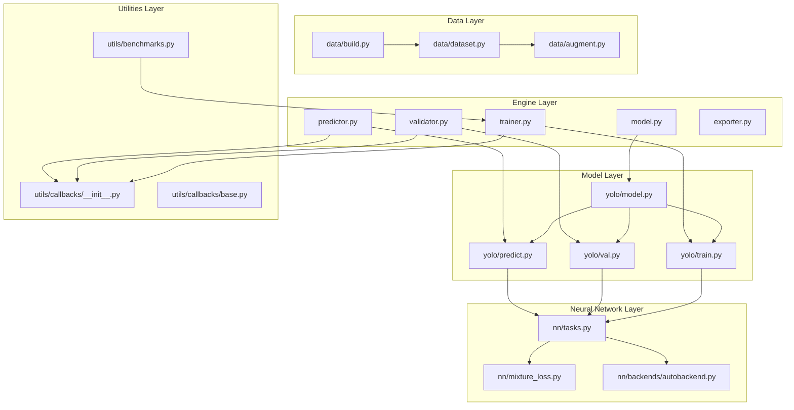
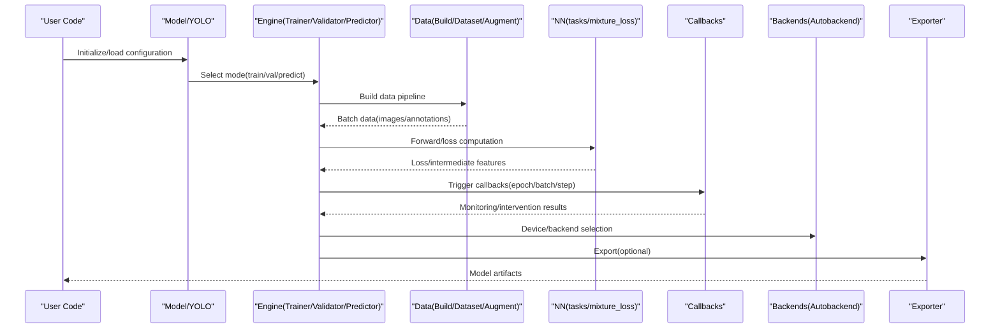
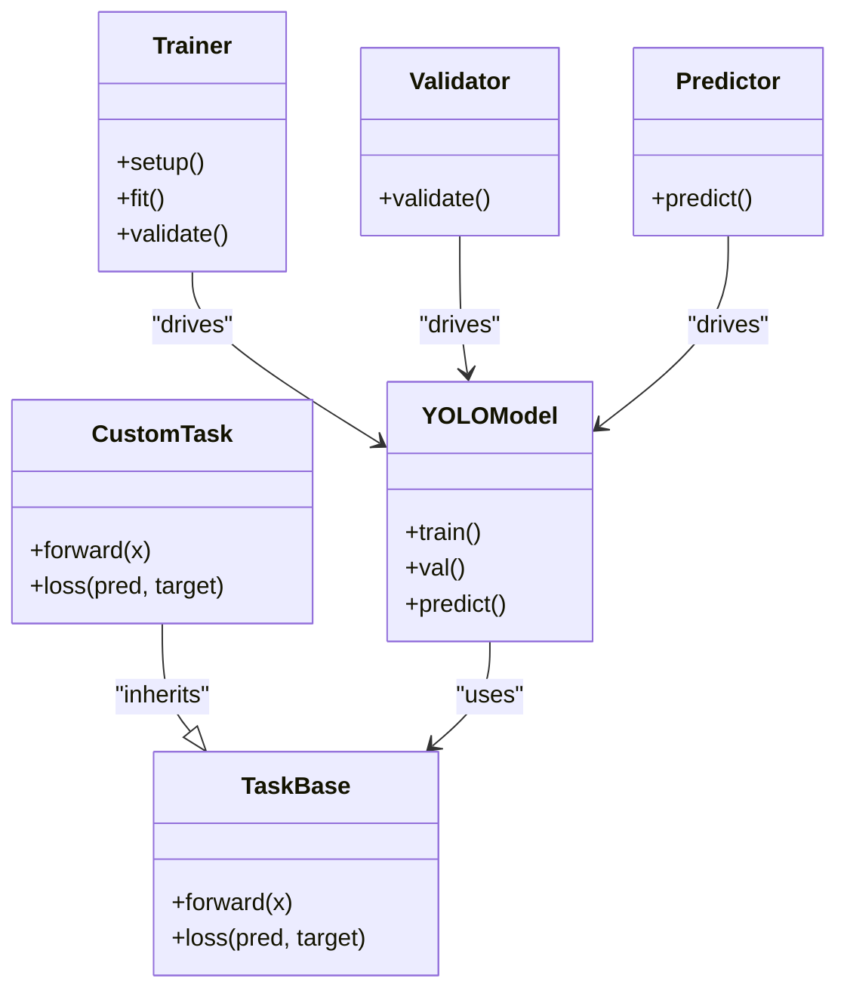
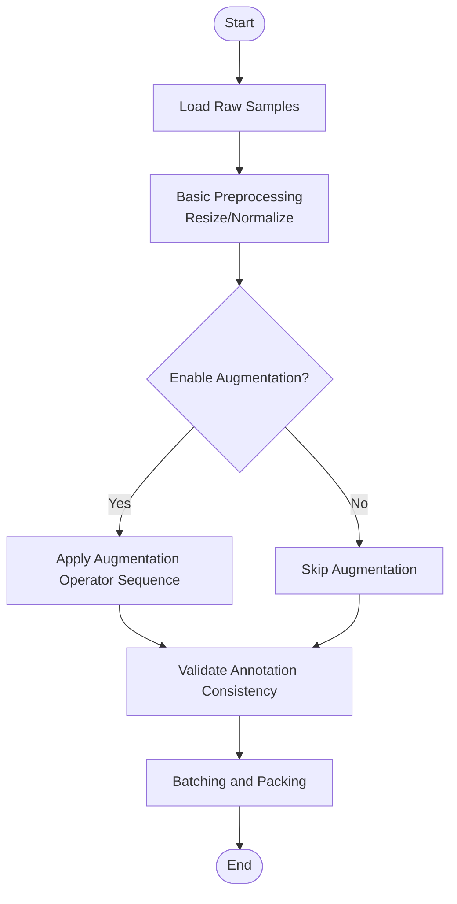
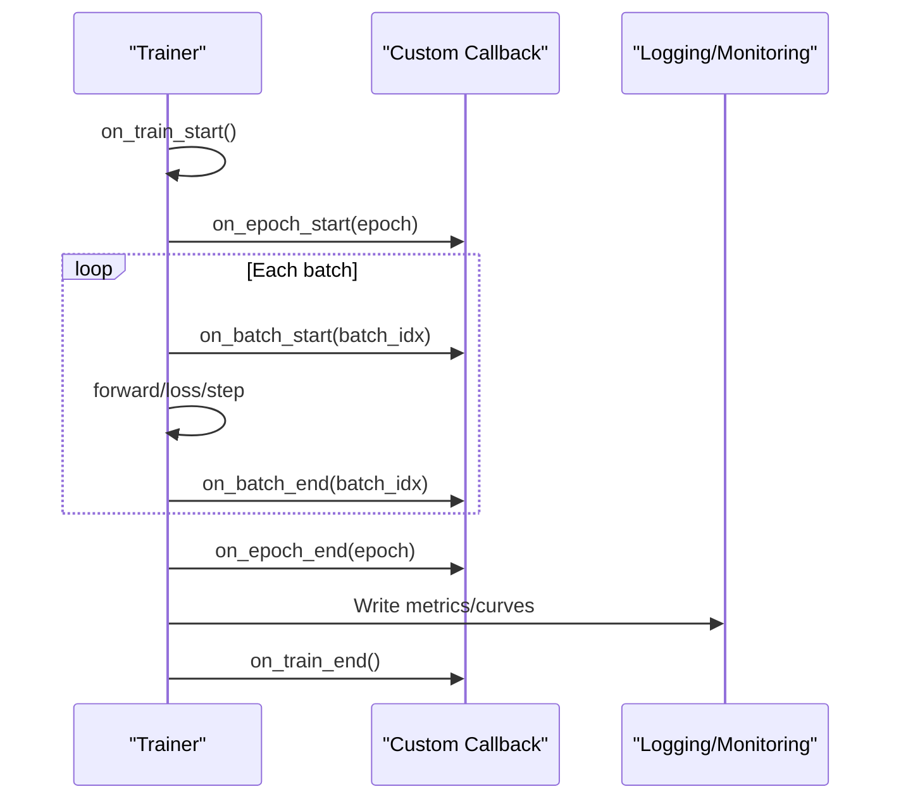
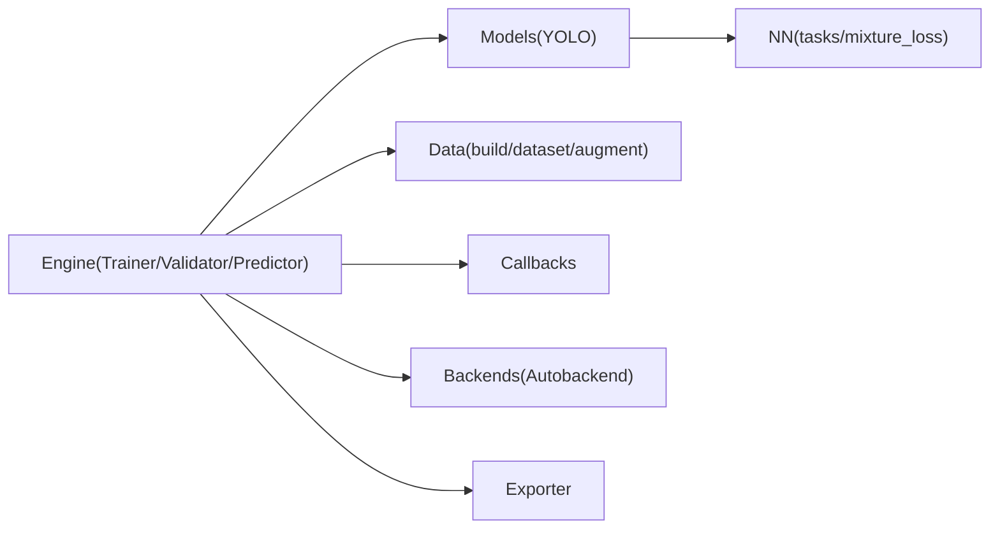

# Custom Extension Development

<cite>
**Files referenced in this document**
- [README.md](file://README.md)
- [ultralytics/engine/trainer.py](file://ultralytics/engine/trainer.py)
- [ultralytics/engine/validator.py](file://ultralytics/engine/validator.py)
- [ultralytics/engine/predictor.py](file://ultralytics/engine/predictor.py)
- [ultralytics/engine/model.py](file://ultralytics/engine/model.py)
- [ultralytics/engine/exporter.py](file://ultralytics/engine/exporter.py)
- [ultralytics/utils/callbacks/__init__.py](file://ultralytics/utils/callbacks/__init__.py)
- [ultralytics/utils/callbacks/base.py](file://ultralytics/utils/callbacks/base.py)
- [ultralytics/data/augment.py](file://ultralytics/data/augment.py)
- [ultralytics/data/dataset.py](file://ultralytics/data/dataset.py)
- [ultralytics/data/build.py](file://ultralytics/data/build.py)
- [ultralytics/models/yolo/model.py](file://ultralytics/models/yolo/model.py)
- [ultralytics/models/yolo/train.py](file://ultralytics/models/yolo/train.py)
- [ultralytics/models/yolo/val.py](file://ultralytics/models/yolo/val.py)
- [ultralytics/models/yolo/predict.py](file://ultralytics/models/yolo/predict.py)
- [ultralytics/nn/tasks.py](file://ultralytics/nn/tasks.py)
- [ultralytics/nn/mixture_loss.py](file://ultralytics/nn/mixture_loss.py)
- [ultralytics/nn/backends/autobackend.py](file://ultralytics/nn/backends/autobackend.py)
- [ultralytics/utils/loss.py](file://ultralytics/utils/loss.py)
- [ultralytics/utils/benchmarks.py](file://ultralytics/utils/benchmarks.py)
- [tests/test_engine.py](file://tests/test_engine.py)
- [tests/test_model_registry.py](file://tests/test_model_registry.py)
- [tests/test_mixture_config_registry.py](file://tests/test_mixture_config_registry.py)
- [tests/test_peft_adapters.py](file://tests/test_peft_adapters.py)
</cite>

## Table of Contents
1. [Introduction](#introduction)
2. [Project Structure](#project-structure)
3. [Core Components](#core-components)
4. [Architecture Overview](#architecture-overview)
5. [Detailed Component Analysis](#detailed-component-analysis)
6. [Dependency Analysis](#dependency-analysis)
7. [Performance Considerations](#performance-considerations)
8. [Troubleshooting Guide](#troubleshooting-guide)
9. [Conclusion](#conclusion)
10. [Appendix](#appendix)

## Introduction
This guide is intended for engineers who wish to develop custom extensions in YOLO-Master, covering the full workflow from network architecture design, loss function definition, training configuration to data augmentation and preprocessing, callback system extension, plugin and backend adapter registration, performance profiling and debugging, and testing strategies. The document is based on the existing repository implementation, providing actionable steps, key entry points, and best practices to help developers safely inject new capabilities without compromising existing stability.

## Project Structure
YOLO-Master adopts a layered modular organization:
- Engine Layer (engine): Runtime control flows for training, validation, prediction, export, etc.
- Model Layer (models): Task-level encapsulation and high-level interfaces
- Neural Network Layer (nn): Modules, task graphs, losses, backend adaptation
- Data Layer (data): Dataset construction, loading, and augmentation
- Utilities Layer (utils): Callbacks, logging, benchmarks, export helpers, etc.
- Tests (tests): Unit and integration test suites

Diagram sources
- [ultralytics/engine/trainer.py](file://ultralytics/engine/trainer.py)
- [ultralytics/engine/validator.py](file://ultralytics/engine/validator.py)
- [ultralytics/engine/predictor.py](file://ultralytics/engine/predictor.py)
- [ultralytics/engine/model.py](file://ultralytics/engine/model.py)
- [ultralytics/engine/exporter.py](file://ultralytics/engine/exporter.py)
- [ultralytics/models/yolo/model.py](file://ultralytics/models/yolo/model.py)
- [ultralytics/models/yolo/train.py](file://ultralytics/models/yolo/train.py)
- [ultralytics/models/yolo/val.py](file://ultralytics/models/yolo/val.py)
- [ultralytics/models/yolo/predict.py](file://ultralytics/models/yolo/predict.py)
- [ultralytics/nn/tasks.py](file://ultralytics/nn/tasks.py)
- [ultralytics/nn/mixture_loss.py](file://ultralytics/nn/mixture_loss.py)
- [ultralytics/nn/backends/autobackend.py](file://ultralytics/nn/backends/autobackend.py)
- [ultralytics/data/augment.py](file://ultralytics/data/augment.py)
- [ultralytics/data/dataset.py](file://ultralytics/data/dataset.py)
- [ultralytics/data/build.py](file://ultralytics/data/build.py)
- [ultralytics/utils/callbacks/__init__.py](file://ultralytics/utils/callbacks/__init__.py)
- [ultralytics/utils/callbacks/base.py](file://ultralytics/utils/callbacks/base.py)
- [ultralytics/utils/benchmarks.py](file://ultralytics/utils/benchmarks.py)

Section sources
- [README.md](file://README.md)

## Core Components
- Trainer: Responsible for training lifecycle, optimizer/scheduler assembly, EMA, logging and callback triggering, checkpoint saving, etc.
- Validator: Responsible for evaluation metric computation, result aggregation and visualization.
- Predictor: Responsible for inference pipeline, post-processing and result output.
- Model Wrapper (Model/YOLO): Decouples specific task models from the engine, providing a unified API.
- Tasks and Losses (tasks/mixture_loss): Defines forward logic, loss composition and multi-task fusion.
- Data Pipeline (data/*): Dataset construction, loading, augmentation and batching.
- Callback System (callbacks): Executes monitoring, intervention and logging at various training stage hooks.
- Backend Adaptation (backends/autobackend): Automatically selects and adapts to different deployment backends.
- Benchmark Tools (benchmarks): Used for performance profiling and regression comparison.

Section sources
- [ultralytics/engine/trainer.py](file://ultralytics/engine/trainer.py)
- [ultralytics/engine/validator.py](file://ultralytics/engine/validator.py)
- [ultralytics/engine/predictor.py](file://ultralytics/engine/predictor.py)
- [ultralytics/engine/model.py](file://ultralytics/engine/model.py)
- [ultralytics/models/yolo/model.py](file://ultralytics/models/yolo/model.py)
- [ultralytics/nn/tasks.py](file://ultralytics/nn/tasks.py)
- [ultralytics/nn/mixture_loss.py](file://ultralytics/nn/mixture_loss.py)
- [ultralytics/data/augment.py](file://ultralytics/data/augment.py)
- [ultralytics/data/dataset.py](file://ultralytics/data/dataset.py)
- [ultralytics/data/build.py](file://ultralytics/data/build.py)
- [ultralytics/utils/callbacks/__init__.py](file://ultralytics/utils/callbacks/__init__.py)
- [ultralytics/utils/callbacks/base.py](file://ultralytics/utils/callbacks/base.py)
- [ultralytics/nn/backends/autobackend.py](file://ultralytics/nn/backends/autobackend.py)
- [ultralytics/utils/benchmarks.py](file://ultralytics/utils/benchmarks.py)

## Architecture Overview
The following diagram shows the extension points and call chains for custom extensions in the system: users enter through the unified interface exposed by Model/YOLO, the engine dispatches to the corresponding controller based on mode (train/val/predict); the data side assembles Dataset and augmentation via data/build; during training, callbacks trigger monitoring and intervention; loss and task logic reside in the nn layer; export and deployment are accomplished collaboratively by exporter and autobackend.

Diagram sources
- [ultralytics/engine/trainer.py](file://ultralytics/engine/trainer.py)
- [ultralytics/engine/validator.py](file://ultralytics/engine/validator.py)
- [ultralytics/engine/predictor.py](file://ultralytics/engine/predictor.py)
- [ultralytics/models/yolo/model.py](file://ultralytics/models/yolo/model.py)
- [ultralytics/data/build.py](file://ultralytics/data/build.py)
- [ultralytics/data/dataset.py](file://ultralytics/data/dataset.py)
- [ultralytics/data/augment.py](file://ultralytics/data/augment.py)
- [ultralytics/nn/tasks.py](file://ultralytics/nn/tasks.py)
- [ultralytics/nn/mixture_loss.py](file://ultralytics/nn/mixture_loss.py)
- [ultralytics/utils/callbacks/__init__.py](file://ultralytics/utils/callbacks/__init__.py)
- [ultralytics/nn/backends/autobackend.py](file://ultralytics/nn/backends/autobackend.py)
- [ultralytics/engine/exporter.py](file://ultralytics/engine/exporter.py)

## Detailed Component Analysis

### Custom Network Architecture and Task Models
- Goal: Replace or extend task forward logic and loss composition without modifying the core engine.
- Recommended path:
  - Add or inherit existing task classes in the task layer (nn/tasks), implementing new forward branches and output alignment.
  - For multi-task fusion, refer to the composition approach in mixture_loss, carrying additional heads or auxiliary signals in task returns.
  - Register new tasks in the task wrapper under models/yolo, ensuring consistency with the engine's input/output contract.
- Key points:
  - Keep tensor shapes and semantic conventions unchanged to avoid downstream parsing failures.
  - Explicitly declare new parameters for serialization and recovery.
  - Add necessary numerical stability protection for complex branches (e.g., normalization, clipping).

Section sources
- [ultralytics/nn/tasks.py](file://ultralytics/nn/tasks.py)
- [ultralytics/nn/mixture_loss.py](file://ultralytics/nn/mixture_loss.py)
- [ultralytics/models/yolo/model.py](file://ultralytics/models/yolo/model.py)

#### Class Relationship Diagram

Diagram sources
- [ultralytics/nn/tasks.py](file://ultralytics/nn/tasks.py)
- [ultralytics/models/yolo/model.py](file://ultralytics/models/yolo/model.py)
- [ultralytics/engine/trainer.py](file://ultralytics/engine/trainer.py)
- [ultralytics/engine/validator.py](file://ultralytics/engine/validator.py)
- [ultralytics/engine/predictor.py](file://ultralytics/engine/predictor.py)

### Custom Loss Functions and Composition
- Goal: Introduce new loss terms or compose with existing losses, supporting multi-task scenarios.
- Recommended path:
  - Implement new losses in utils/loss or nn/mixture_loss, following unified signature and return value conventions.
  - Compute and return loss dictionaries as needed in the task's forward pass, letting the Trainer aggregate them.
  - For dynamic weights or conditional activation, adjust via epoch/step in the Trainer's callbacks.
- Key points:
  - Ensure gradient stability; add regularization or clipping when necessary.
  - Handle missing labels or empty batches defensively.

Section sources
- [ultralytics/utils/loss.py](file://ultralytics/utils/loss.py)
- [ultralytics/nn/mixture_loss.py](file://ultralytics/nn/mixture_loss.py)
- [ultralytics/engine/trainer.py](file://ultralytics/engine/trainer.py)

### Training Configuration and Lifecycle
- Goal: Drive training behavior through configuration, including optimizer, scheduler, EMA, logging and export.
- Recommended path:
  - Read configuration and instantiate corresponding components during the Trainer's setup phase.
  - Use callbacks to insert custom logic at epoch/batch/step nodes (e.g., early stopping, learning rate warmup, checkpoint resumption).
  - Combine with Exporter to automatically export multiple formats after training completes.
- Key points:
  - Configuration changes should be backward compatible to avoid breaking existing experiment reproducibility.
  - Handle synchronization and communication robustly in distributed environments.

Section sources
- [ultralytics/engine/trainer.py](file://ultralytics/engine/trainer.py)
- [ultralytics/engine/exporter.py](file://ultralytics/engine/exporter.py)

### Data Augmentation and Preprocessing Extensions
- Goal: Add new augmentation operators or preprocessing pipelines to improve model generalization.
- Recommended path:
  - Implement new augmentation classes in data/augment, following unified input/output specifications.
  - Register augmentation strategies in data/build, and compose them by configuration in data/dataset.
  - For expensive augmentations, consider asynchronous loading and caching strategies.
- Key points:
  - Augmentations should maintain annotation consistency (coordinates, categories, masks, etc.).
  - Design specifically for edge cases (small objects, occlusion).

Section sources
- [ultralytics/data/augment.py](file://ultralytics/data/augment.py)
- [ultralytics/data/build.py](file://ultralytics/data/build.py)
- [ultralytics/data/dataset.py](file://ultralytics/data/dataset.py)

#### Augmentation Pipeline Flowchart

Diagram sources
- [ultralytics/data/augment.py](file://ultralytics/data/augment.py)
- [ultralytics/data/build.py](file://ultralytics/data/build.py)
- [ultralytics/data/dataset.py](file://ultralytics/data/dataset.py)

### Callback System Extension Mechanism
- Goal: Insert monitoring, intervention and logging logic at various training stages.
- Recommended path:
  - Implement custom callbacks based on the base class in utils/callbacks/base.
  - Trigger callbacks at appropriate hooks in the Trainer/Validator/Predictor lifecycle.
  - Support event-driven logging (e.g., TensorBoard, MLFlow, custom storage).
- Key points:
  - Callbacks should avoid blocking the main thread; execute asynchronously when necessary.
  - Catch and report exceptions to prevent affecting the main training flow.

Section sources
- [ultralytics/utils/callbacks/base.py](file://ultralytics/utils/callbacks/base.py)
- [ultralytics/utils/callbacks/__init__.py](file://ultralytics/utils/callbacks/__init__.py)
- [ultralytics/engine/trainer.py](file://ultralytics/engine/trainer.py)
- [ultralytics/engine/validator.py](file://ultralytics/engine/validator.py)
- [ultralytics/engine/predictor.py](file://ultralytics/engine/predictor.py)

#### Callback Sequence Diagram

Diagram sources
- [ultralytics/engine/trainer.py](file://ultralytics/engine/trainer.py)
- [ultralytics/utils/callbacks/base.py](file://ultralytics/utils/callbacks/base.py)

### Plugin Architecture and Backend Adapters
- Goal: Extend model registration, task routing and backend adaptation without intruding into core logic.
- Recommended path:
  - Register new tasks or variants in models/yolo, ensuring consistency with the engine contract.
  - Register new backend types in nn/backends/autobackend, implementing device/format adaptation.
  - Interface with the export flow in engine/exporter, supporting new backend artifacts.
- Key points:
  - Plugins should follow the principle of least privilege, exposing only necessary interfaces.
  - Perform strict version compatibility checks to avoid runtime crashes.

Section sources
- [ultralytics/models/yolo/model.py](file://ultralytics/models/yolo/model.py)
- [ultralytics/nn/backends/autobackend.py](file://ultralytics/nn/backends/autobackend.py)
- [ultralytics/engine/exporter.py](file://ultralytics/engine/exporter.py)

### Performance Profiling Tool Integration
- Goal: Identify bottlenecks and compare performance differences before and after optimization.
- Recommended path:
  - Use benchmark scripts provided by utils/benchmarks to run standard tasks on different hardware.
  - Integrate timing and memory statistics in the Trainer, outputting reports via callbacks.
  - Write micro-benchmarks for custom modules and include them in regression tests.
- Key points:
  - Focus on end-to-end latency and throughput, distinguishing operator time from I/O overhead.
  - Perform fair comparisons in multi-GPU/multi-process scenarios.

Section sources
- [ultralytics/utils/benchmarks.py](file://ultralytics/utils/benchmarks.py)
- [ultralytics/engine/trainer.py](file://ultralytics/engine/trainer.py)

### Unit Tests and Integration Tests
- Goal: Ensure stability and compatibility of extensions.
- Recommended path:
  - Write unit tests for custom tasks/losses/augmentations, covering normal and edge cases.
  - Use tests/test_engine.py as the integration entry point to verify end-to-end flows.
  - Perform dedicated tests on model registry and configuration parsing to ensure no conflicts.
- Key points:
  - Fix random seeds to ensure reproducible results.
  - Perform smoke tests on distributed paths to quickly identify communication issues.

Section sources
- [tests/test_engine.py](file://tests/test_engine.py)
- [tests/test_model_registry.py](file://tests/test_model_registry.py)
- [tests/test_mixture_config_registry.py](file://tests/test_mixture_config_registry.py)
- [tests/test_peft_adapters.py](file://tests/test_peft_adapters.py)

## Dependency Analysis
- Coupling:
  - The engine layer and model layer are decoupled through unified interfaces, reducing replacement costs.
  - The data layer and augmentation module are loosely coupled, facilitating independent evolution.
- External dependencies:
  - Backend adaptation abstracts differences across deployment frameworks, reducing upper-layer awareness.
  - The callback system allows seamless integration of third-party monitoring tools.
- Potential risks:
  - Excessive customization may lead to contract drift; centralized management in the registry is needed.
  - Attention to synchronization and error propagation is required in distributed environments.

Diagram sources
- [ultralytics/engine/trainer.py](file://ultralytics/engine/trainer.py)
- [ultralytics/engine/validator.py](file://ultralytics/engine/validator.py)
- [ultralytics/engine/predictor.py](file://ultralytics/engine/predictor.py)
- [ultralytics/models/yolo/model.py](file://ultralytics/models/yolo/model.py)
- [ultralytics/nn/tasks.py](file://ultralytics/nn/tasks.py)
- [ultralytics/nn/mixture_loss.py](file://ultralytics/nn/mixture_loss.py)
- [ultralytics/data/build.py](file://ultralytics/data/build.py)
- [ultralytics/data/dataset.py](file://ultralytics/data/dataset.py)
- [ultralytics/data/augment.py](file://ultralytics/data/augment.py)
- [ultralytics/utils/callbacks/__init__.py](file://ultralytics/utils/callbacks/__init__.py)
- [ultralytics/nn/backends/autobackend.py](file://ultralytics/nn/backends/autobackend.py)
- [ultralytics/engine/exporter.py](file://ultralytics/engine/exporter.py)

## Performance Considerations
- Data I/O: Prioritize prefetching and parallel loading to reduce GPU idle time.
- Operator Fusion: Merge adjacent operations where possible to reduce kernel launch overhead.
- Accuracy vs. Speed Tradeoff: Mixed precision and quantization require calibration sets and regression tests.
- Distributed: Properly partition batch sizes and communication steps to avoid synchronization hotspots.
- Monitoring: Instrument critical paths and continuously track latency distribution and peaks.

## Troubleshooting Guide
- Common issues:
  - Dimension mismatch: Check shape conventions between task outputs and loss inputs.
  - Gradient explosion/vanishing: Introduce gradient clipping and numerical stability techniques.
  - Callback blocking: Confirm no long-blocking operations inside callbacks.
  - Backend incompatibility: Verify export format matches target device requirements.
- Diagnostic methods:
  - Use callbacks to print intermediate tensor statistics (mean, variance, NaN ratio).
  - Use benchmark scripts to compare timing differences across implementations.
  - Capture and report root cause information in distributed environments to shorten diagnosis time.

Section sources
- [ultralytics/engine/trainer.py](file://ultralytics/engine/trainer.py)
- [ultralytics/utils/benchmarks.py](file://ultralytics/utils/benchmarks.py)

## Conclusion
Through well-defined extension points in the engine, model, data, callback, and backend adaptation layers, YOLO-Master provides comprehensive customization capabilities. By following contracts and testing strategies, developers can safely introduce new architectures, losses, and augmentations, and achieve efficient monitoring and optimization through callbacks and benchmark tools. It is recommended to run the full test suite after each change to ensure compatibility and stability.

## Appendix
- Development template checklist:
  - Custom task class skeleton
  - Custom loss function skeleton
  - Custom augmentation operator skeleton
  - Custom callback skeleton
  - Backend adapter skeleton
- Debugging tips:
  - Progressively disable augmentations and callbacks to isolate the problem scope
  - Quickly validate on small datasets, then scale to full data
  - Use fixed seeds and minimal reproduction scripts to improve collaboration efficiency
