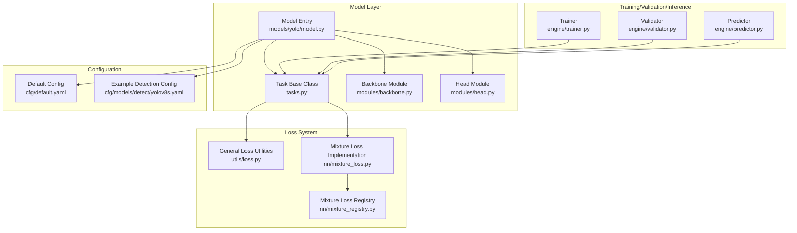
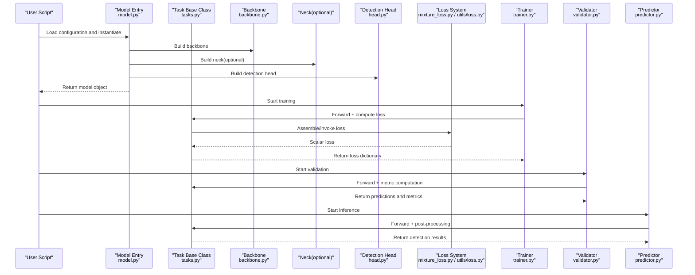
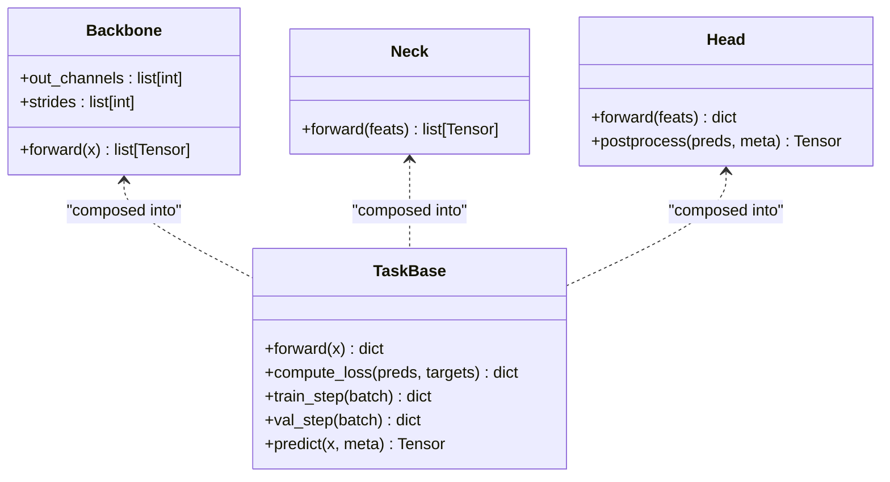
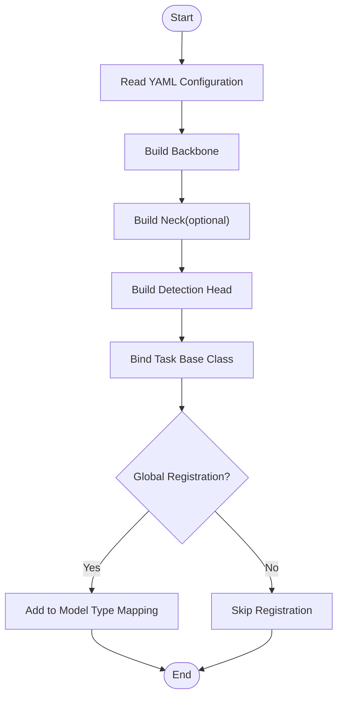
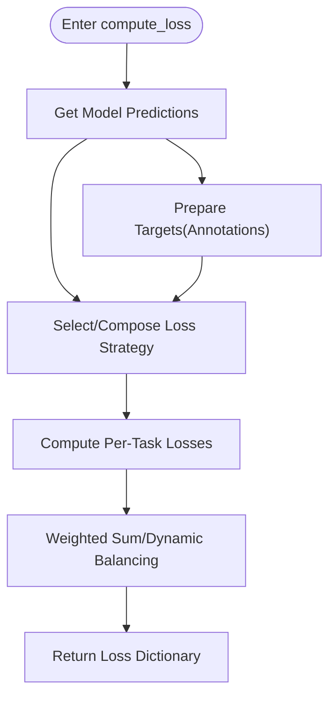
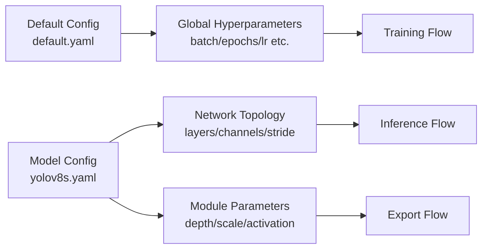
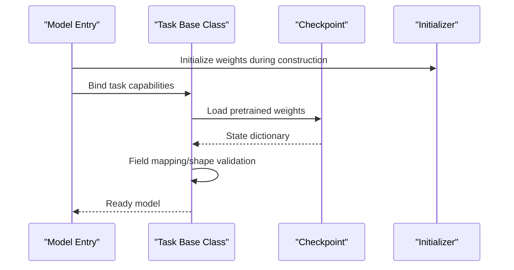
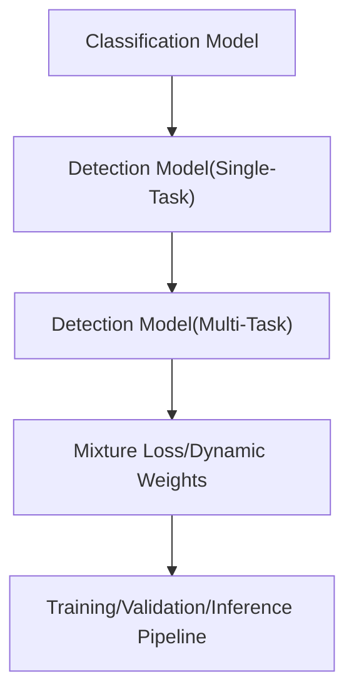
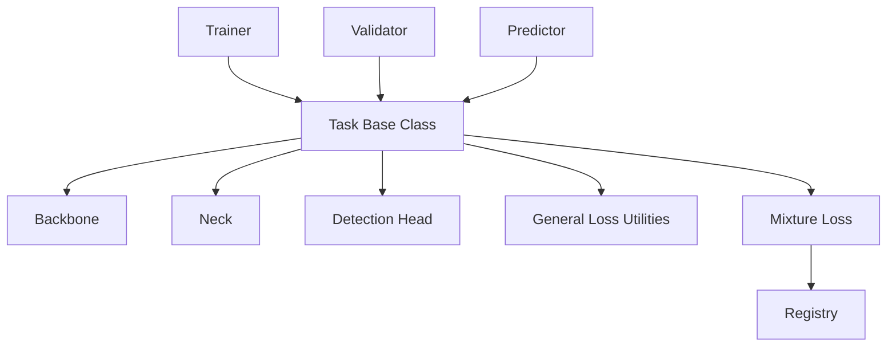

# Custom Model Development

<cite>
**Files referenced in this document**
- [ultralytics/models/yolo/model.py](file://ultralytics/models/yolo/model.py)
- [ultralytics/nn/tasks.py](file://ultralytics/nn/tasks.py)
- [ultralytics/nn/mixture_loss.py](file://ultralytics/nn/mixture_loss.py)
- [ultralytics/nn/mixture_registry.py](file://ultralytics/nn/mixture_registry.py)
- [ultralytics/utils/loss.py](file://ultralytics/utils/loss.py)
- [ultralytics/engine/trainer.py](file://ultralytics/engine/trainer.py)
- [ultralytics/engine/validator.py](file://ultralytics/engine/validator.py)
- [ultralytics/engine/predictor.py](file://ultralytics/engine/predictor.py)
- [ultralytics/nn/modules/backbone.py](file://ultralytics/nn/modules/backbone.py)
- [ultralytics/nn/modules/head.py](file://ultralytics/nn/modules/head.py)
- [ultralytics/cfg/default.yaml](file://ultralytics/cfg/default.yaml)
- [ultralytics/cfg/models/detect/yolov8s.yaml](file://ultralytics/cfg/models/detect/yolov8s.yaml)
</cite>

## Table of Contents
1. [Introduction](#introduction)
2. [Project Structure](#project-structure)
3. [Core Components](#core-components)
4. [Architecture Overview](#architecture-overview)
5. [Detailed Component Analysis](#detailed-component-analysis)
6. [Dependency Analysis](#dependency-analysis)
7. [Performance Considerations](#performance-considerations)
8. [Troubleshooting Guide](#troubleshooting-guide)
9. [Conclusion](#conclusion)
10. [Appendix](#appendix)

## Introduction
This guide is intended for developers who wish to extend or fully customize detection/multi-task models based on the YOLO-Master framework. Content covers:
- How to design new backbone networks, necks, and detection heads, and combine them into a complete model
- How to inherit base model classes and register new model types
- How to implement custom losses (including multi-task and mixture losses)
- Model configuration file structure and parameter definitions
- Weight initialization and loading mechanisms
- Performance optimization and memory management best practices

## Project Structure
YOLO-Master's model system revolves around "task base class + module assembly + configuration-driven" design:
- Task base class encapsulates training/validation/inference flows and loss assembly
- Module layer provides reusable building blocks such as backbone, neck, and head
- Configuration files describe model topology and hyperparameters in YAML
- Loss system supports standard loss and mixture loss registration

Diagram sources
- [ultralytics/models/yolo/model.py](file://ultralytics/models/yolo/model.py)
- [ultralytics/nn/tasks.py](file://ultralytics/nn/tasks.py)
- [ultralytics/nn/modules/backbone.py](file://ultralytics/nn/modules/backbone.py)
- [ultralytics/nn/modules/head.py](file://ultralytics/nn/modules/head.py)
- [ultralytics/engine/trainer.py](file://ultralytics/engine/trainer.py)
- [ultralytics/engine/validator.py](file://ultralytics/engine/validator.py)
- [ultralytics/engine/predictor.py](file://ultralytics/engine/predictor.py)
- [ultralytics/utils/loss.py](file://ultralytics/utils/loss.py)
- [ultralytics/nn/mixture_loss.py](file://ultralytics/nn/mixture_loss.py)
- [ultralytics/nn/mixture_registry.py](file://ultralytics/nn/mixture_registry.py)
- [ultralytics/cfg/default.yaml](file://ultralytics/cfg/default.yaml)
- [ultralytics/cfg/models/detect/yolov8s.yaml](file://ultralytics/cfg/models/detect/yolov8s.yaml)

Section sources
- [ultralytics/models/yolo/model.py](file://ultralytics/models/yolo/model.py)
- [ultralytics/nn/tasks.py](file://ultralytics/nn/tasks.py)
- [ultralytics/nn/mixture_loss.py](file://ultralytics/nn/mixture_loss.py)
- [ultralytics/nn/mixture_registry.py](file://ultralytics/nn/mixture_registry.py)
- [ultralytics/utils/loss.py](file://ultralytics/utils/loss.py)
- [ultralytics/engine/trainer.py](file://ultralytics/engine/trainer.py)
- [ultralytics/engine/validator.py](file://ultralytics/engine/validator.py)
- [ultralytics/engine/predictor.py](file://ultralytics/engine/predictor.py)
- [ultralytics/nn/modules/backbone.py](file://ultralytics/nn/modules/backbone.py)
- [ultralytics/nn/modules/head.py](file://ultralytics/nn/modules/head.py)
- [ultralytics/cfg/default.yaml](file://ultralytics/cfg/default.yaml)
- [ultralytics/cfg/models/detect/yolov8s.yaml](file://ultralytics/cfg/models/detect/yolov8s.yaml)

## Core Components
- Task Base Class: Uniformly encapsulates forward, compute_loss, train_step, val_step, predict flows, and provides loss assembly interfaces
- Model Entry: Instantiates backbone-neck-head based on configuration, binding task base class capabilities
- Module Library: Reusable sub-modules such as backbone/head for rapid assembly of new architectures
- Loss System: General loss utilities + mixture loss registry, supporting multi-task and weighted composition
- Training/Validation/Inference Engines: Trainer/Validator/Predictor invoke the task base class to complete end-to-end flows

Section sources
- [ultralytics/nn/tasks.py](file://ultralytics/nn/tasks.py)
- [ultralytics/models/yolo/model.py](file://ultralytics/models/yolo/model.py)
- [ultralytics/nn/modules/backbone.py](file://ultralytics/nn/modules/backbone.py)
- [ultralytics/nn/modules/head.py](file://ultralytics/nn/modules/head.py)
- [ultralytics/utils/loss.py](file://ultralytics/utils/loss.py)
- [ultralytics/nn/mixture_loss.py](file://ultralytics/nn/mixture_loss.py)
- [ultralytics/nn/mixture_registry.py](file://ultralytics/nn/mixture_registry.py)
- [ultralytics/engine/trainer.py](file://ultralytics/engine/trainer.py)
- [ultralytics/engine/validator.py](file://ultralytics/engine/validator.py)
- [ultralytics/engine/predictor.py](file://ultralytics/engine/predictor.py)

## Architecture Overview
The following diagram shows the key path from configuration to model instantiation, then to training/validation/inference.

Diagram sources
- [ultralytics/models/yolo/model.py](file://ultralytics/models/yolo/model.py)
- [ultralytics/nn/tasks.py](file://ultralytics/nn/tasks.py)
- [ultralytics/nn/modules/backbone.py](file://ultralytics/nn/modules/backbone.py)
- [ultralytics/nn/modules/head.py](file://ultralytics/nn/modules/head.py)
- [ultralytics/nn/mixture_loss.py](file://ultralytics/nn/mixture_loss.py)
- [ultralytics/utils/loss.py](file://ultralytics/utils/loss.py)
- [ultralytics/engine/trainer.py](file://ultralytics/engine/trainer.py)
- [ultralytics/engine/validator.py](file://ultralytics/engine/validator.py)
- [ultralytics/engine/predictor.py](file://ultralytics/engine/predictor.py)

## Detailed Component Analysis

### 1) Designing New Network Architectures (Backbone/Neck/Detection Head)
- Backbone Network
  - Recommended to follow existing module interfaces, outputting multi-scale feature maps
  - Pay attention to channel counts, strides, and downsampling strategies to ensure alignment with neck/head
- Neck Network
  - Responsible for fusing multi-scale features, commonly using top-down/bottom-up paths
  - Note feature resolution and channel consistency
- Detection Head
  - Outputs class probabilities, bounding box regression, segmentation masks, etc.
  - Maintain consistency with the task base class input/output contract

Diagram sources
- [ultralytics/nn/modules/backbone.py](file://ultralytics/nn/modules/backbone.py)
- [ultralytics/nn/modules/head.py](file://ultralytics/nn/modules/head.py)
- [ultralytics/nn/tasks.py](file://ultralytics/nn/tasks.py)

Section sources
- [ultralytics/nn/modules/backbone.py](file://ultralytics/nn/modules/backbone.py)
- [ultralytics/nn/modules/head.py](file://ultralytics/nn/modules/head.py)
- [ultralytics/nn/tasks.py](file://ultralytics/nn/tasks.py)

### 2) Inheriting Base Model Classes and Registering New Model Types
- Instantiate backbone-neck-head via the model entry based on configuration, binding task base class capabilities
- Declare new model names and hierarchical structure in configuration so training/validation/inference can parse correctly
- For global registration of new model types, add mapping logic at the model entry to enable creation via unified API

Diagram sources
- [ultralytics/models/yolo/model.py](file://ultralytics/models/yolo/model.py)
- [ultralytics/cfg/models/detect/yolov8s.yaml](file://ultralytics/cfg/models/detect/yolov8s.yaml)

Section sources
- [ultralytics/models/yolo/model.py](file://ultralytics/models/yolo/model.py)
- [ultralytics/cfg/models/detect/yolov8s.yaml](file://ultralytics/cfg/models/detect/yolov8s.yaml)

### 3) Custom Loss Functions (Multi-Task Learning and Mixture Losses)
- Single-task Loss
  - Use general loss utilities for numerical stability and normalization
- Multi-Task Learning
  - Sum losses from multiple tasks with weights, or track them separately in the training loop
- Mixture Loss
  - Leverage mixture loss implementation and registry to dynamically select/compose different loss strategies

Diagram sources
- [ultralytics/nn/tasks.py](file://ultralytics/nn/tasks.py)
- [ultralytics/utils/loss.py](file://ultralytics/utils/loss.py)
- [ultralytics/nn/mixture_loss.py](file://ultralytics/nn/mixture_loss.py)
- [ultralytics/nn/mixture_registry.py](file://ultralytics/nn/mixture_registry.py)

Section sources
- [ultralytics/nn/tasks.py](file://ultralytics/nn/tasks.py)
- [ultralytics/utils/loss.py](file://ultralytics/utils/loss.py)
- [ultralytics/nn/mixture_loss.py](file://ultralytics/nn/mixture_loss.py)
- [ultralytics/nn/mixture_registry.py](file://ultralytics/nn/mixture_registry.py)

### 4) Model Configuration File Structure and Parameter Definitions
- Default Configuration
  - Contains global options for data, training, export, etc.
- Model Configuration
  - Specifies backbone/neck/head layers, channels, depth, activation, etc.
  - Describes network topology and hyperparameters via key-value pairs

Diagram sources
- [ultralytics/cfg/default.yaml](file://ultralytics/cfg/default.yaml)
- [ultralytics/cfg/models/detect/yolov8s.yaml](file://ultralytics/cfg/models/detect/yolov8s.yaml)

Section sources
- [ultralytics/cfg/default.yaml](file://ultralytics/cfg/default.yaml)
- [ultralytics/cfg/models/detect/yolov8s.yaml](file://ultralytics/cfg/models/detect/yolov8s.yaml)

### 5) Weight Initialization and Loading Mechanism
- Initialization
  - Apply appropriate initialization strategies to key layers during model construction (e.g., convolution kernels, BN layers)
- Loading
  - Restore weights from checkpoints, compatible with old version formats and field name mappings
- Validation
  - Perform shape and device consistency checks before and after loading to avoid runtime errors

Diagram sources
- [ultralytics/models/yolo/model.py](file://ultralytics/models/yolo/model.py)
- [ultralytics/nn/tasks.py](file://ultralytics/nn/tasks.py)

Section sources
- [ultralytics/models/yolo/model.py](file://ultralytics/models/yolo/model.py)
- [ultralytics/nn/tasks.py](file://ultralytics/nn/tasks.py)

### 6) End-to-End Example Path (From Classification to Multi-Task Detection)
- Simple Classification Model
  - Uses lightweight backbone + classification head, minimal configuration, training/validation/inference share the same task base class
- Complex Multi-Task Detection Model
  - Backbone + neck + detection head, outputting multi-task results such as class/box/segmentation; loss uses mixture strategy

[This diagram is a conceptual flowchart, no diagram sources required]

Section sources
- [ultralytics/nn/tasks.py](file://ultralytics/nn/tasks.py)
- [ultralytics/nn/mixture_loss.py](file://ultralytics/nn/mixture_loss.py)
- [ultralytics/nn/mixture_registry.py](file://ultralytics/nn/mixture_registry.py)

## Dependency Analysis
- Low Coupling, High Cohesion
  - Task base class depends only on module interfaces, not on specific implementation details
  - Loss system is decoupled from tasks, dynamically assembled via registry
- External Dependencies
  - Training/validation/inference engines indirectly depend on models and losses through the task base class

Diagram sources
- [ultralytics/engine/trainer.py](file://ultralytics/engine/trainer.py)
- [ultralytics/engine/validator.py](file://ultralytics/engine/validator.py)
- [ultralytics/engine/predictor.py](file://ultralytics/engine/predictor.py)
- [ultralytics/nn/tasks.py](file://ultralytics/nn/tasks.py)
- [ultralytics/nn/modules/backbone.py](file://ultralytics/nn/modules/backbone.py)
- [ultralytics/nn/modules/head.py](file://ultralytics/nn/modules/head.py)
- [ultralytics/utils/loss.py](file://ultralytics/utils/loss.py)
- [ultralytics/nn/mixture_loss.py](file://ultralytics/nn/mixture_loss.py)
- [ultralytics/nn/mixture_registry.py](file://ultralytics/nn/mixture_registry.py)

Section sources
- [ultralytics/engine/trainer.py](file://ultralytics/engine/trainer.py)
- [ultralytics/engine/validator.py](file://ultralytics/engine/validator.py)
- [ultralytics/engine/predictor.py](file://ultralytics/engine/predictor.py)
- [ultralytics/nn/tasks.py](file://ultralytics/nn/tasks.py)
- [ultralytics/nn/modules/backbone.py](file://ultralytics/nn/modules/backbone.py)
- [ultralytics/nn/modules/head.py](file://ultralytics/nn/modules/head.py)
- [ultralytics/utils/loss.py](file://ultralytics/utils/loss.py)
- [ultralytics/nn/mixture_loss.py](file://ultralytics/nn/mixture_loss.py)
- [ultralytics/nn/mixture_registry.py](file://ultralytics/nn/mixture_registry.py)

## Performance Considerations
- Computational Efficiency
  - Reduce unnecessary intermediate tensor copies; prefer in-place operations
  - Set batch size and image dimensions appropriately to avoid memory fluctuations
- Memory Management
  - Release intermediate variable references promptly to avoid computation graph accumulation
  - Use gradient accumulation instead of extremely large batches
- Numerical Stability
  - Add numerical protection in loss computation (e.g., small constants in log/division denominators)
  - Monitor gradient norms and NaN/Inf
- Parallelism and Distribution
  - Ensure all modules support DDP communication primitives
  - Synchronize BN statistics to avoid cross-device inconsistencies

[This section provides general guidance, no section sources required]

## Troubleshooting Guide
- Common Issues
  - Dimension mismatch: Check whether backbone output channels/strides match neck/head configuration
  - Loss explosion: Check label ranges, loss weights, and numerical stability
  - Weight loading failure: Verify field name mappings and version compatibility
- Diagnostic Methods
  - Print key tensor shapes and device information
  - Comment out modules step by step to narrow down the problem scope
  - Use minimal reproducible configuration and dataset

Section sources
- [ultralytics/nn/tasks.py](file://ultralytics/nn/tasks.py)
- [ultralytics/utils/loss.py](file://ultralytics/utils/loss.py)
- [ultralytics/models/yolo/model.py](file://ultralytics/models/yolo/model.py)

## Conclusion
By composing reusable modules on top of the task base class, driving model topology through configuration, and managing loss strategies via registry, YOLO-Master provides a highly extensible custom model development paradigm. Following the steps in this guide, you can start from a simple classification model and progressively evolve to complex multi-task detection models, achieving a consistent experience across training, validation, and inference flows.

## Appendix
- Reference Paths
  - Task base class and model entry: [ultralytics/nn/tasks.py](file://ultralytics/nn/tasks.py), [ultralytics/models/yolo/model.py](file://ultralytics/models/yolo/model.py)
  - Module library: [ultralytics/nn/modules/backbone.py](file://ultralytics/nn/modules/backbone.py), [ultralytics/nn/modules/head.py](file://ultralytics/nn/modules/head.py)
  - Loss system: [ultralytics/utils/loss.py](file://ultralytics/utils/loss.py), [ultralytics/nn/mixture_loss.py](file://ultralytics/nn/mixture_loss.py), [ultralytics/nn/mixture_registry.py](file://ultralytics/nn/mixture_registry.py)
  - Training/validation/inference: [ultralytics/engine/trainer.py](file://ultralytics/engine/trainer.py), [ultralytics/engine/validator.py](file://ultralytics/engine/validator.py), [ultralytics/engine/predictor.py](file://ultralytics/engine/predictor.py)
  - Configuration: [ultralytics/cfg/default.yaml](file://ultralytics/cfg/default.yaml), [ultralytics/cfg/models/detect/yolov8s.yaml](file://ultralytics/cfg/models/detect/yolov8s.yaml)
