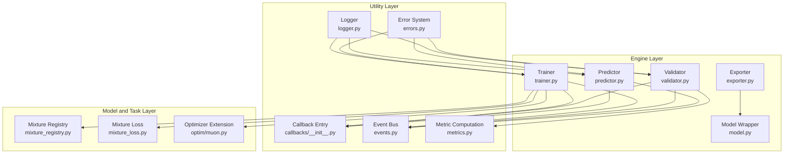
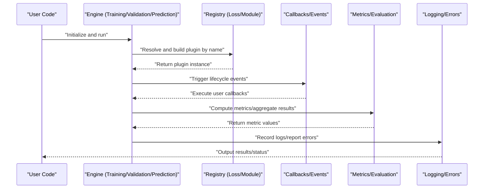
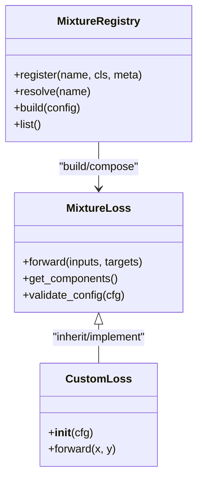
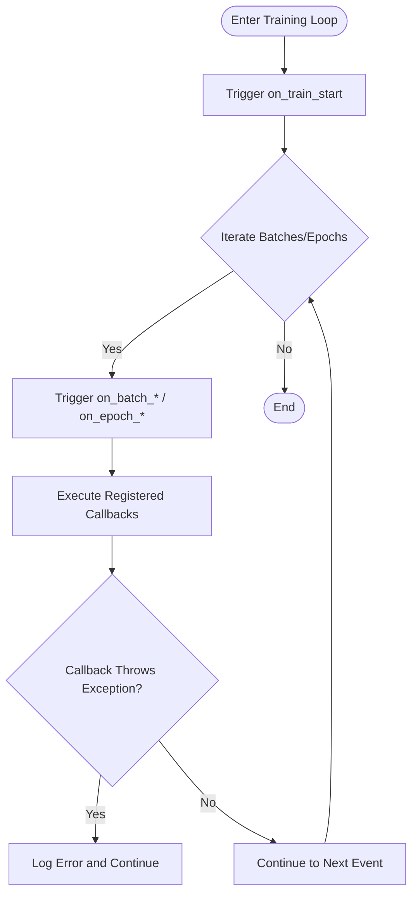
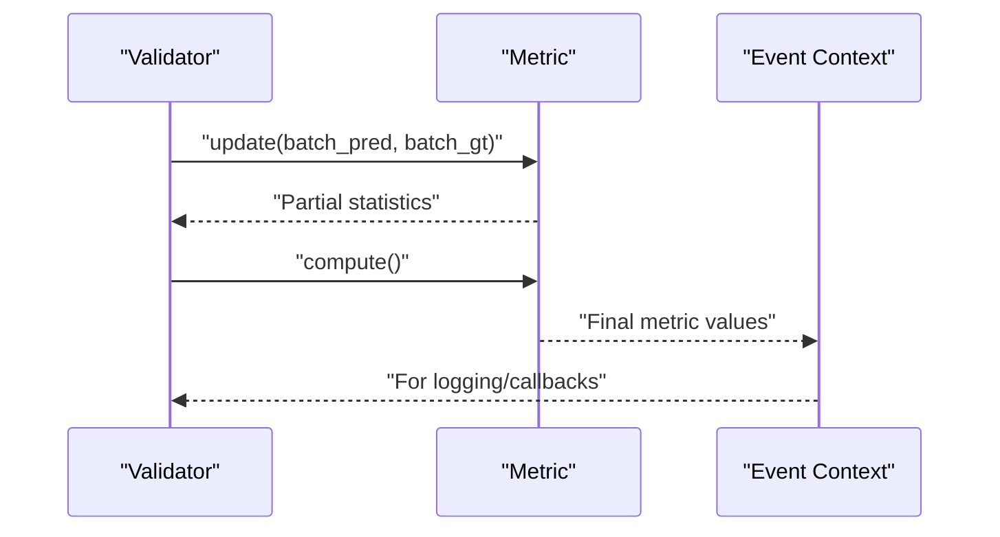
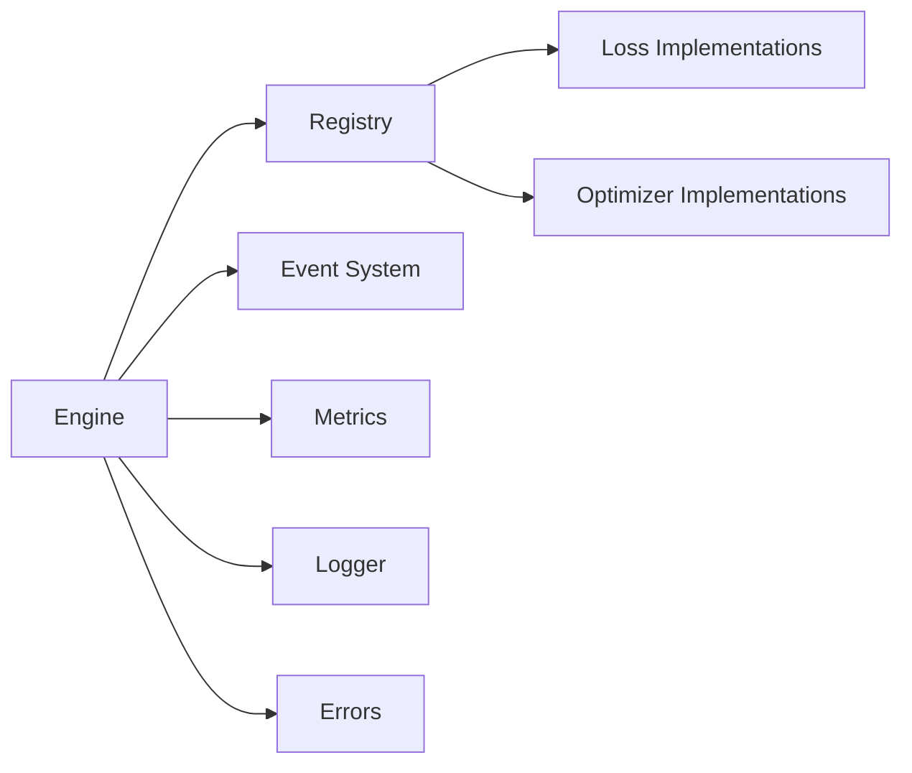

# Plugin Architecture Usage Guide

<cite>
**Files referenced in this document**
- [README.md](file://README.md)
- [pyproject.toml](file://pyproject.toml)
- [ultralytics/engine/trainer.py](file://ultralytics/engine/trainer.py)
- [ultralytics/engine/validator.py](file://ultralytics/engine/validator.py)
- [ultralytics/engine/predictor.py](file://ultralytics/engine/predictor.py)
- [ultralytics/engine/model.py](file://ultralytics/engine/model.py)
- [ultralytics/engine/exporter.py](file://ultralytics/engine/exporter.py)
- [ultralytics/utils/callbacks/__init__.py](file://ultralytics/utils/callbacks/__init__.py)
- [ultralytics/utils/events.py](file://ultralytics/utils/events.py)
- [ultralytics/utils/logger.py](file://ultralytics/utils/logger.py)
- [ultralytics/utils/errors.py](file://ultralytics/utils/errors.py)
- [ultralytics/nn/mixture_registry.py](file://ultralytics/nn/mixture_registry.py)
- [ultralytics/nn/mixture_loss.py](file://ultralytics/nn/mixture_loss.py)
- [ultralytics/optim/muon.py](file://ultralytics/optim/muon.py)
- [ultralytics/utils/metrics.py](file://ultralytics/utils/metrics.py)
- [tests/test_mixture_config_registry.py](file://tests/test_mixture_config_registry.py)
- [tests/test_mixture_loss_composition.py](file://tests/test_mixture_loss_composition.py)
- [tests/test_metrics_numerical_stability.py](file://tests/test_metrics_numerical_stability.py)
</cite>

## Table of Contents
1. [Introduction](#introduction)
2. [Project Structure](#project-structure)
3. [Core Components](#core-components)
4. [Architecture Overview](#architecture-overview)
5. [Detailed Component Analysis](#detailed-component-analysis)
6. [Dependency Analysis](#dependency-analysis)
7. [Performance Considerations](#performance-considerations)
8. [Troubleshooting Guide](#troubleshooting-guide)
9. [Conclusion](#conclusion)
10. [Appendix](#appendix)

## Introduction
This guide is intended for engineers and researchers who wish to develop "pluggable" components in YOLO-Master, focusing on the following objectives:
- Plugin lifecycle and management mechanisms: discovery, loading, unloading
- Pluggable component types: loss functions, optimizers, evaluation metrics
- Configuration and dependency management best practices
- Inter-plugin communication protocols and data exchange formats
- Version compatibility and upgrade strategies
- Plugin marketplace or shared platform integration methods (conceptual description)
- Security sandbox and permission control (conceptual description)
- Plugin development templates and testing frameworks

To facilitate implementation, the document analyzes the repository's registries, event callbacks, training/validation/prediction flows, and existing extension points, providing visualizations and reference paths.

## Project Structure
YOLO-Master adopts a layered modular design, with key extension points concentrated in:
- Engine layer: Training, validation, prediction, export and other main flows
- Utility layer: Event system, logging, error handling, metric computation
- Model and task layer: Mixture loss and registry, optimizer extension points
- Test layer: Coverage for registry, loss composition, numerical stability, etc.

Diagram sources
- [ultralytics/engine/trainer.py](file://ultralytics/engine/trainer.py)
- [ultralytics/engine/validator.py](file://ultralytics/engine/validator.py)
- [ultralytics/engine/predictor.py](file://ultralytics/engine/predictor.py)
- [ultralytics/engine/model.py](file://ultralytics/engine/model.py)
- [ultralytics/engine/exporter.py](file://ultralytics/engine/exporter.py)
- [ultralytics/utils/callbacks/__init__.py](file://ultralytics/utils/callbacks/__init__.py)
- [ultralytics/utils/events.py](file://ultralytics/utils/events.py)
- [ultralytics/utils/logger.py](file://ultralytics/utils/logger.py)
- [ultralytics/utils/errors.py](file://ultralytics/utils/errors.py)
- [ultralytics/utils/metrics.py](file://ultralytics/utils/metrics.py)
- [ultralytics/nn/mixture_registry.py](file://ultralytics/nn/mixture_registry.py)
- [ultralytics/nn/mixture_loss.py](file://ultralytics/nn/mixture_loss.py)
- [ultralytics/optim/muon.py](file://ultralytics/optim/muon.py)

Section sources
- [README.md](file://README.md)
- [pyproject.toml](file://pyproject.toml)

## Core Components
- Registry and Factory Pattern
  - Centrally manages pluggable implementations (e.g., mixture losses) via registry, supporting resolution and instantiation by name for dynamic selection and composition.
  - Typical responsibilities: registration, lookup, validation, construction.
- Event System and Callbacks
  - Triggers events at key stages of training/validation/prediction, allowing external logic injection (e.g., custom logging, monitoring, early stopping, checkpoints).
  - Typical responsibilities: event definition, subscribe/publish, ordering guarantee, exception isolation.
- Metrics and Evaluation
  - Provides unified metric interfaces and aggregation methods, facilitating addition of custom metrics for use in validation flows.
- Optimizer Extension Points
  - Creates optimizers via unified entry, supporting third-party optimizer integration with minimal changes.
- Errors and Logging
  - Standardizes error types and log output, improving observability and troubleshooting efficiency.

Section sources
- [ultralytics/nn/mixture_registry.py](file://ultralytics/nn/mixture_registry.py)
- [ultralytics/nn/mixture_loss.py](file://ultralytics/nn/mixture_loss.py)
- [ultralytics/utils/callbacks/__init__.py](file://ultralytics/utils/callbacks/__init__.py)
- [ultralytics/utils/events.py](file://ultralytics/utils/events.py)
- [ultralytics/utils/metrics.py](file://ultralytics/utils/metrics.py)
- [ultralytics/optim/muon.py](file://ultralytics/optim/muon.py)
- [ultralytics/utils/logger.py](file://ultralytics/utils/logger.py)
- [ultralytics/utils/errors.py](file://ultralytics/utils/errors.py)

## Architecture Overview
The following diagram shows the end-to-end flow from user invocation to plugin implementation, including registry resolution, event dispatch, metric computation, and error handling.

Diagram sources
- [ultralytics/engine/trainer.py](file://ultralytics/engine/trainer.py)
- [ultralytics/engine/validator.py](file://ultralytics/engine/validator.py)
- [ultralytics/engine/predictor.py](file://ultralytics/engine/predictor.py)
- [ultralytics/nn/mixture_registry.py](file://ultralytics/nn/mixture_registry.py)
- [ultralytics/utils/callbacks/__init__.py](file://ultralytics/utils/callbacks/__init__.py)
- [ultralytics/utils/events.py](file://ultralytics/utils/events.py)
- [ultralytics/utils/metrics.py](file://ultralytics/utils/metrics.py)
- [ultralytics/utils/logger.py](file://ultralytics/utils/logger.py)
- [ultralytics/utils/errors.py](file://ultralytics/utils/errors.py)

## Detailed Component Analysis

### Registry and Factory (Using Mixture Loss as Example)
- Responsibilities
  - Maintain plugin metadata (name, version, dependencies, constructor parameters)
  - Provide registration, query, instantiation, validation capabilities
  - Support compositional construction (e.g., multi-loss weighting)
- Key flows
  - Registration: Auto-register on module import
  - Resolution: Look up implementation class by configuration key name
  - Construction: Instantiate and validate based on configuration parameters
  - Composition: Combine multiple sub-losses into composite loss
- Complexity
  - Registration/lookup is typically O(1) dictionary operation
  - Composition construction time depends on sub-item count and parameter validation cost
- Optimization recommendations
  - Cache resolved implementation class references
  - Perform lazy validation for heavy parameters
  - Provide read-only snapshots for concurrency safety

Diagram sources
- [ultralytics/nn/mixture_registry.py](file://ultralytics/nn/mixture_registry.py)
- [ultralytics/nn/mixture_loss.py](file://ultralytics/nn/mixture_loss.py)

Section sources
- [ultralytics/nn/mixture_registry.py](file://ultralytics/nn/mixture_registry.py)
- [ultralytics/nn/mixture_loss.py](file://ultralytics/nn/mixture_loss.py)
- [tests/test_mixture_config_registry.py](file://tests/test_mixture_config_registry.py)
- [tests/test_mixture_loss_composition.py](file://tests/test_mixture_loss_composition.py)

### Event System and Callbacks (Training/Validation/Prediction)
- Responsibilities
  - Define standard events (e.g., on_train_start, on_epoch_end, on_val_batch_end, etc.)
  - Provide subscribe/publish mechanism, ensuring callback ordering and exception isolation
  - Collaborate with logging, metrics, checkpoints and other subsystems
- Key flows
  - Engine triggers events at key nodes
  - Callback handlers receive context objects (containing progress, metrics, configuration, etc.)
  - Exceptions are caught and reported, avoiding impact on main flow
- Extension recommendations
  - Provide base classes and default empty implementations for custom callbacks
  - Pass immutable snapshots in event context to reduce side-effect risks

Diagram sources
- [ultralytics/utils/callbacks/__init__.py](file://ultralytics/utils/callbacks/__init__.py)
- [ultralytics/utils/events.py](file://ultralytics/utils/events.py)
- [ultralytics/engine/trainer.py](file://ultralytics/engine/trainer.py)
- [ultralytics/engine/validator.py](file://ultralytics/engine/validator.py)
- [ultralytics/engine/predictor.py](file://ultralytics/engine/predictor.py)

Section sources
- [ultralytics/utils/callbacks/__init__.py](file://ultralytics/utils/callbacks/__init__.py)
- [ultralytics/utils/events.py](file://ultralytics/utils/events.py)
- [ultralytics/engine/trainer.py](file://ultralytics/engine/trainer.py)
- [ultralytics/engine/validator.py](file://ultralytics/engine/validator.py)
- [ultralytics/engine/predictor.py](file://ultralytics/engine/predictor.py)

### Metrics and Evaluation (Pluggable Metrics)
- Responsibilities
  - Define metric interfaces (input/output specifications, normalization, accumulation strategies)
  - Provide common metric implementations and aggregators
  - Enable/disable on demand in validation flows
- Key flows
  - Validator collects intermediate results at each batch/global end
  - Metric computation results are written to event context for callback consumption
- Extension recommendations
  - Metrics should be stateless or explicitly resettable
  - Provide numerical stability guarantees and unit tests

Diagram sources
- [ultralytics/utils/metrics.py](file://ultralytics/utils/metrics.py)
- [ultralytics/engine/validator.py](file://ultralytics/engine/validator.py)

Section sources
- [ultralytics/utils/metrics.py](file://ultralytics/utils/metrics.py)
- [tests/test_metrics_numerical_stability.py](file://tests/test_metrics_numerical_stability.py)

### Optimizer Extension Points
- Responsibilities
  - Provide unified optimizer creation entry
  - Support third-party optimizer integration with minimal changes
- Key flows
  - Resolve optimizer class by configuration key name
  - Pass model parameters and hyperparameters to complete instantiation
- Extension recommendations
  - Maintain consistent parameter naming to avoid breaking compatibility
  - Cover common configuration scenarios in unit tests

Section sources
- [ultralytics/optim/muon.py](file://ultralytics/optim/muon.py)

### Export and Model Wrapper (Plugin Related)
- Responsibilities
  - Model wrapper exposes unified interface externally
  - Exporter handles serialization and backend adaptation
- Plugin associations
  - If plugins involve weight/graph structure changes, merging or conversion must be completed before export
  - Export capability matrix can be used to constrain available plugin combinations

Section sources
- [ultralytics/engine/model.py](file://ultralytics/engine/model.py)
- [ultralytics/engine/exporter.py](file://ultralytics/engine/exporter.py)

## Dependency Analysis
- Component coupling
  - Engine layer depends on registry, events, metrics, logging, and error handling
  - Registry is decoupled from loss/optimizer implementations, bound via names and configuration
- Potential circular dependencies
  - Avoid directly importing specific implementations in registry; use lazy imports or explicit registration instead
- External dependencies
  - Third-party libraries (e.g., torch, numpy) should be introduced at extension points to avoid polluting core paths

Diagram sources
- [ultralytics/engine/trainer.py](file://ultralytics/engine/trainer.py)
- [ultralytics/engine/validator.py](file://ultralytics/engine/validator.py)
- [ultralytics/engine/predictor.py](file://ultralytics/engine/predictor.py)
- [ultralytics/nn/mixture_registry.py](file://ultralytics/nn/mixture_registry.py)
- [ultralytics/utils/events.py](file://ultralytics/utils/events.py)
- [ultralytics/utils/metrics.py](file://ultralytics/utils/metrics.py)
- [ultralytics/utils/logger.py](file://ultralytics/utils/logger.py)
- [ultralytics/utils/errors.py](file://ultralytics/utils/errors.py)

Section sources
- [ultralytics/engine/trainer.py](file://ultralytics/engine/trainer.py)
- [ultralytics/engine/validator.py](file://ultralytics/engine/validator.py)
- [ultralytics/engine/predictor.py](file://ultralytics/engine/predictor.py)
- [ultralytics/nn/mixture_registry.py](file://ultralytics/nn/mixture_registry.py)
- [ultralytics/utils/events.py](file://ultralytics/utils/events.py)
- [ultralytics/utils/metrics.py](file://ultralytics/utils/metrics.py)
- [ultralytics/utils/logger.py](file://ultralytics/utils/logger.py)
- [ultralytics/utils/errors.py](file://ultralytics/utils/errors.py)

## Performance Considerations
- Registry lookup and instantiation
  - Cache resolved class references; lazy load and validate heavy parameters
- Event callback overhead
  - Batch event merging, async callbacks, skip empty callbacks
- Metric computation
  - Incremental updates, vectorized computation, reduce memory allocation
- Logging and errors
  - Structured logging, sampling frequency reduction, error deduplication

[This section provides general guidance and does not directly analyze specific files]

## Troubleshooting Guide
- Common issue identification
  - Plugin not found: Check registry key name and import timing
  - Parameter mismatch: Verify configuration structure and default values
  - Callback exception: Check event context and error stack
  - Metric instability: Check numerical precision and boundary conditions
- Diagnostic methods
  - Enable verbose log level
  - Print context snapshots at key events
  - Use minimal reproduction cases and unit test regression

Section sources
- [ultralytics/utils/logger.py](file://ultralytics/utils/logger.py)
- [ultralytics/utils/errors.py](file://ultralytics/utils/errors.py)
- [ultralytics/utils/events.py](file://ultralytics/utils/events.py)

## Conclusion
YOLO-Master provides a comprehensive plugin foundation through registry, event callbacks, metrics, and error/logging systems. Around these extension points, developers can implement new loss functions, optimizers, and evaluation metrics at low cost, flexibly combining them via configuration-driven approaches. It is recommended to follow the principle of minimal intrusion during development, clarify contracts and version strategies, and improve test coverage to ensure system stability and evolvability.

[This section is a summary and does not directly analyze specific files]

## Appendix

### Plugin Lifecycle and Management Mechanisms (Discovery, Loading, Unloading)
- Discovery
  - Trigger registration via package scanning or explicit imports; registration at module top level recommended
- Loading
  - Resolve implementation class by configuration key name, instantiate on demand; supports lazy loading
- Unloading
  - Release resources (handles, caches, temporary files); clean up event subscriptions
- Recommendations
  - Provide idempotent init/destroy hooks
  - Add on_plugin_loaded/on_plugin_unloaded in event system

[This section is a conceptual description and does not directly analyze specific files]

### How to Develop Pluggable Components
- New loss functions
  - Implement standard interface; register in registry; write unit tests covering forward/boundary/numerical stability
- New optimizers
  - Follow unified parameter conventions; register in optimizer entry; cover common configuration scenarios
- New evaluation metrics
  - Implement update/compute; enable in validation flow; provide numerical stability unit tests

Section sources
- [ultralytics/nn/mixture_registry.py](file://ultralytics/nn/mixture_registry.py)
- [ultralytics/nn/mixture_loss.py](file://ultralytics/nn/mixture_loss.py)
- [ultralytics/optim/muon.py](file://ultralytics/optim/muon.py)
- [ultralytics/utils/metrics.py](file://ultralytics/utils/metrics.py)
- [tests/test_mixture_config_registry.py](file://tests/test_mixture_config_registry.py)
- [tests/test_mixture_loss_composition.py](file://tests/test_mixture_loss_composition.py)
- [tests/test_metrics_numerical_stability.py](file://tests/test_metrics_numerical_stability.py)

### Plugin Configuration and Dependency Management Best Practices
- Configuration
  - Use clear hierarchical structure (global/task/plugin); provide defaults and validation
- Dependencies
  - Declare optional dependencies; detect at runtime and gracefully degrade
- Versioning
  - Include version ranges in plugin metadata; provide readable prompts on conflicts

[This section provides general guidance and does not directly analyze specific files]

### Inter-Plugin Communication Protocols and Data Exchange Formats
- Event context
  - Serves as cross-plugin data carrier, containing progress, metrics, configuration snapshots, etc.
- Data formats
  - Prefer lightweight, serializable structures (e.g., dict/tuple/tensors)
- Consistency
  - Clarify field meanings and types in contract documentation to avoid implicit conventions

Section sources
- [ultralytics/utils/events.py](file://ultralytics/utils/events.py)
- [ultralytics/utils/callbacks/__init__.py](file://ultralytics/utils/callbacks/__init__.py)

### Version Compatibility and Upgrade Strategies
- Backward compatibility
  - Retain old key name mappings; provide migration scripts
- Gradual upgrades
  - Deprecate old interfaces in phases; grayscale releases
- Rollback
  - Save last known good configuration and state snapshots

[This section provides general guidance and does not directly analyze specific files]

### Plugin Marketplace or Shared Platform Integration Methods (Conceptual)
- Packaging specifications
  - Manifest file (name, version, dependencies, entry point)
- Installation and discovery
  - Package manager integration; auto-registration
- Quality gates
  - Automated testing, benchmarks, license checks

[This section is a conceptual description and does not directly analyze specific files]

### Security Sandbox and Permission Control (Conceptual)
- Sandbox
  - Restrict filesystem/network access; whitelist imports
- Permissions
  - Role-based least privilege principle
- Auditing
  - Record plugin behavior and resource usage

[This section is a conceptual description and does not directly analyze specific files]

### Plugin Development Templates and Testing Frameworks
- Template key points
  - Registration entry, configuration validation, core implementation, documentation comments
- Testing frameworks
  - Unit/integration/end-to-end; cover normal paths and exception branches
  - Provide specialized unit tests for registry, loss composition, metric numerical stability

Section sources
- [tests/test_mixture_config_registry.py](file://tests/test_mixture_config_registry.py)
- [tests/test_mixture_loss_composition.py](file://tests/test_mixture_loss_composition.py)
- [tests/test_metrics_numerical_stability.py](file://tests/test_metrics_numerical_stability.py)
