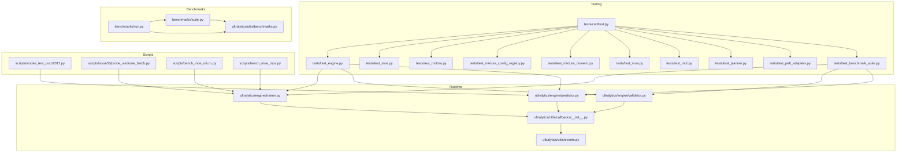
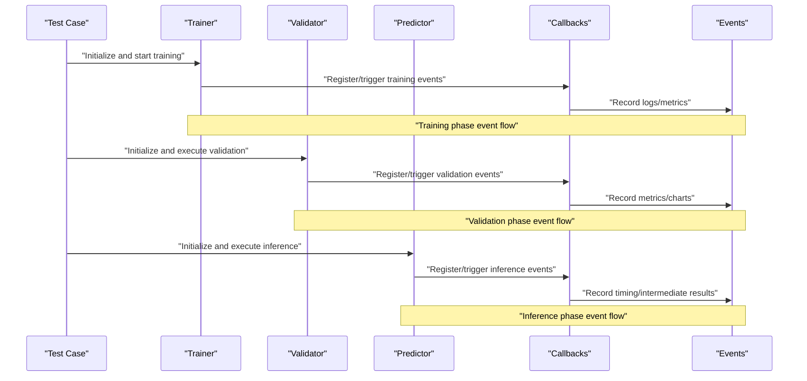
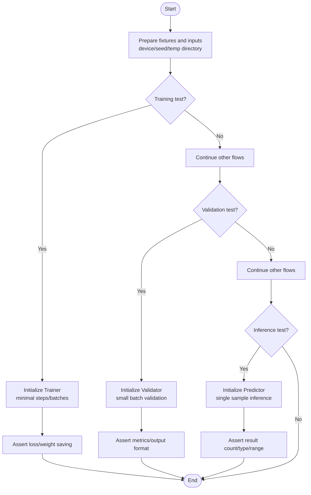
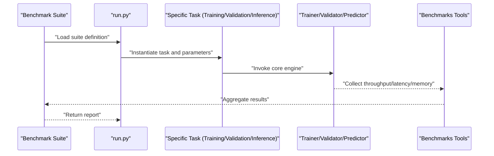
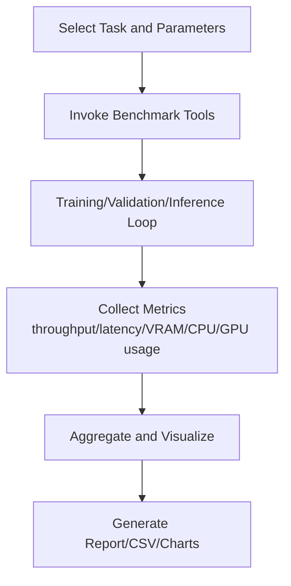
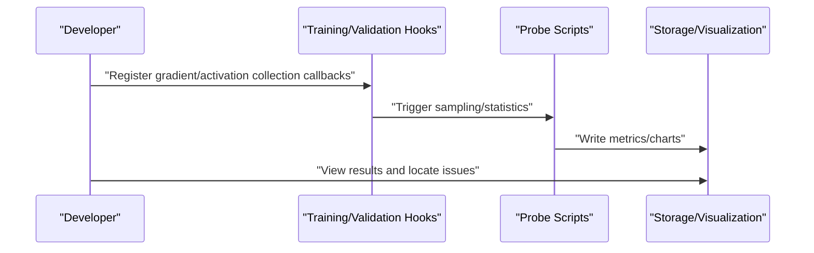
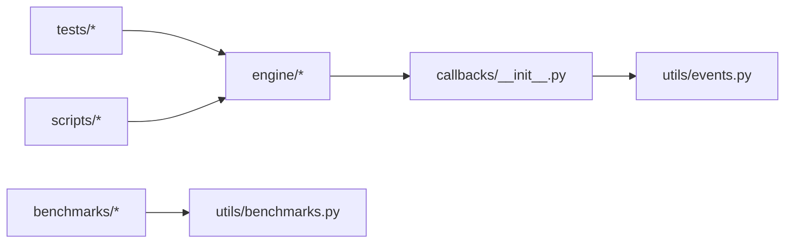

# Testing and Debugging Tools

<cite>
**Files referenced in this document**
- [tests/conftest.py](file://tests/conftest.py)
- [tests/test_engine.py](file://tests/test_engine.py)
- [tests/test_moe.py](file://tests/test_moe.py)
- [tests/test_molora.py](file://tests/test_molora.py)
- [tests/test_mixture_config_registry.py](file://tests/test_mixture_config_registry.py)
- [tests/test_mixture_numeric.py](file://tests/test_mixture_numeric.py)
- [tests/test_moa.py](file://tests/test_moa.py)
- [tests/test_mot.py](file://tests/test_mot.py)
- [tests/test_planner.py](file://tests/test_planner.py)
- [tests/test_peft_adapters.py](file://tests/test_peft_adapters.py)
- [tests/test_benchmark_suite.py](file://tests/test_benchmark_suite.py)
- [benchmarks/suite.py](file://benchmarks/suite.py)
- [benchmarks/run.py](file://benchmarks/run.py)
- [ultralytics/utils/benchmarks.py](file://ultralytics/utils/benchmarks.py)
- [ultralytics/engine/trainer.py](file://ultralytics/engine/trainer.py)
- [ultralytics/engine/validator.py](file://ultralytics/engine/validator.py)
- [ultralytics/engine/predictor.py](file://ultralytics/engine/predictor.py)
- [ultralytics/utils/callbacks/__init__.py](file://ultralytics/utils/callbacks/__init__.py)
- [ultralytics/utils/events.py](file://ultralytics/utils/events.py)
- [scripts/smoke_test_coco2017.py](file://scripts/smoke_test_coco2017.py)
- [scripts/issue53/probe_visdrone_batch.py](file://scripts/issue53/probe_visdrone_batch.py)
- [scripts/bench_moe_micro.py](file://scripts/bench_moe_micro.py)
- [scripts/bench_moe_mps.py](file://scripts/bench_moe_mps.py)
- [.github/workflows/ci.yml](file://.github/workflows/ci.yml)
</cite>

## Table of Contents
1. [Introduction](#introduction)
2. [Project Structure](#project-structure)
3. [Core Components](#core-components)
4. [Architecture Overview](#architecture-overview)
5. [Detailed Component Analysis](#detailed-component-analysis)
6. [Dependency Analysis](#dependency-analysis)
7. [Performance Considerations](#performance-considerations)
8. [Troubleshooting Guide](#troubleshooting-guide)
9. [Conclusion](#conclusion)
10. [Appendix](#appendix)

## Introduction
This guide is intended for extension developers, focusing on "testing and debugging tool usage for custom extensions." The content covers:
- Unit test writing methods (including mock data, assertion validation)
- Integration test design patterns (ensuring extension compatibility with core system)
- Performance analysis tools (memory leak detection, CPU/GPU utilization analysis)
- Debugging techniques and problem diagnosis flows (gradient checking, activation analysis, computation graph visualization)
- Benchmark construction and result interpretation
- Automated testing configuration in continuous integration
- Common troubleshooting methods and solutions

## Project Structure
The repository is organized around two major themes: "testing" and "benchmarks/performance":
- tests: PyTest test suite, organized by module (engine, moe, molora, mixture, moa, mot, planner, peft, etc.), with conftest global fixtures.
- benchmarks: Benchmark suite definitions and run entry, unified orchestration of benchmark cases for different tasks and datasets.
- ultralytics/utils/benchmarks.py: Common benchmark utility functions (e.g., throughput/latency statistics).
- scripts: Scripted testing and diagnostic tools (smoke tests, micro-benchmarks, MPS environment probing, etc.).
- .github/workflows: CI pipeline configuration, driving automated testing and benchmarks.

Diagram sources
- [tests/conftest.py](file://tests/conftest.py)
- [tests/test_engine.py](file://tests/test_engine.py)
- [tests/test_moe.py](file://tests/test_moe.py)
- [tests/test_molora.py](file://tests/test_molora.py)
- [tests/test_mixture_config_registry.py](file://tests/test_mixture_config_registry.py)
- [tests/test_mixture_numeric.py](file://tests/test_mixture_numeric.py)
- [tests/test_moa.py](file://tests/test_moa.py)
- [tests/test_mot.py](file://tests/test_mot.py)
- [tests/test_planner.py](file://tests/test_planner.py)
- [tests/test_peft_adapters.py](file://tests/test_peft_adapters.py)
- [tests/test_benchmark_suite.py](file://tests/test_benchmark_suite.py)
- [benchmarks/suite.py](file://benchmarks/suite.py)
- [benchmarks/run.py](file://benchmarks/run.py)
- [ultralytics/utils/benchmarks.py](file://ultralytics/utils/benchmarks.py)
- [ultralytics/engine/trainer.py](file://ultralytics/engine/trainer.py)
- [ultralytics/engine/validator.py](file://ultralytics/engine/validator.py)
- [ultralytics/engine/predictor.py](file://ultralytics/engine/predictor.py)
- [ultralytics/utils/callbacks/__init__.py](file://ultralytics/utils/callbacks/__init__.py)
- [ultralytics/utils/events.py](file://ultralytics/utils/events.py)
- [scripts/smoke_test_coco2017.py](file://scripts/smoke_test_coco2017.py)
- [scripts/issue53/probe_visdrone_batch.py](file://scripts/issue53/probe_visdrone_batch.py)
- [scripts/bench_moe_micro.py](file://scripts/bench_moe_micro.py)
- [scripts/bench_moe_mps.py](file://scripts/bench_moe_mps.py)

Section sources
- [tests/conftest.py](file://tests/conftest.py)
- [benchmarks/suite.py](file://benchmarks/suite.py)
- [benchmarks/run.py](file://benchmarks/run.py)
- [ultralytics/utils/benchmarks.py](file://ultralytics/utils/benchmarks.py)

## Core Components
- PyTest Fixtures and Shared Resources (conftest)
  - Provides device selection, random seed, temporary directory, model weight cache, dataset path fixtures, ensuring test repeatability and environment isolation.
- Engine Layer Tests (trainer/validator/predictor)
  - Constructs training/validation/inference flows with minimal inputs, asserts output shapes, types, and key metric ranges, validating extension compatibility with core engine.
- MoE/MoA/Mixture Specialized Tests
  - Covers routing, expert loading, sparse scheduling, numerical stability, export consistency and other critical paths.
- MOLORA Specialized Tests
  - Validates routing-aware merging, sparse dispatch, data type compatibility, and semantic correctness.
- MOT and Planner Tests
  - Validates multi-object tracking chains, scene-aware routing, and planner behavior.
- PEFT/LoRA Adapter Tests
  - Validates adapter injection, parameter freezing/unfreezing, merging and export flows.
- Benchmark Suite and Tools
  - Unified benchmark definition, execution, and result aggregation; encapsulates throughput/latency statistics and visualization helpers.

Section sources
- [tests/conftest.py](file://tests/conftest.py)
- [tests/test_engine.py](file://tests/test_engine.py)
- [tests/test_moe.py](file://tests/test_moe.py)
- [tests/test_molora.py](file://tests/test_molora.py)
- [tests/test_mixture_config_registry.py](file://tests/test_mixture_config_registry.py)
- [tests/test_mixture_numeric.py](file://tests/test_mixture_numeric.py)
- [tests/test_moa.py](file://tests/test_moa.py)
- [tests/test_mot.py](file://tests/test_mot.py)
- [tests/test_planner.py](file://tests/test_planner.py)
- [tests/test_peft_adapters.py](file://tests/test_peft_adapters.py)
- [tests/test_benchmark_suite.py](file://tests/test_benchmark_suite.py)
- [benchmarks/suite.py](file://benchmarks/suite.py)
- [benchmarks/run.py](file://benchmarks/run.py)
- [ultralytics/utils/benchmarks.py](file://ultralytics/utils/benchmarks.py)

## Architecture Overview
The following diagram shows the call chain from tests to runtime core components and the event callback mechanism.

Diagram sources
- [ultralytics/engine/trainer.py](file://ultralytics/engine/trainer.py)
- [ultralytics/engine/validator.py](file://ultralytics/engine/validator.py)
- [ultralytics/engine/predictor.py](file://ultralytics/engine/predictor.py)
- [ultralytics/utils/callbacks/__init__.py](file://ultralytics/utils/callbacks/__init__.py)
- [ultralytics/utils/events.py](file://ultralytics/utils/events.py)

## Detailed Component Analysis

### Unit Test Writing Guide (Including Mock Data and Assertions)
- Fixtures and shared resources
  - Use conftest-provided device, seed, temporary directory, and weight cache to avoid hardcoded paths and randomness differences.
- Construct minimal reproducible inputs
  - Use fixed shape and type tensors or image arrays as inputs, combine with lightweight dataset paths for end-to-end validation when necessary.
- Assertion strategies
  - Shape and type: Ensure output dimensions and dtype match expectations.
  - Value ranges: Reasonable threshold assertions for loss, confidence, coordinates, etc.
  - Stability: Compare variance across multiple runs, or assert relative error under low precision.
- Common patterns
  - Training: Initialize Trainer -> set minimal epoch/batch -> assert loss convergence trend and saved artifacts.
  - Validation: Initialize Validator -> run one round on small set -> assert mAP/metrics non-empty and reasonable.
  - Inference: Initialize Predictor -> single sample inference -> assert detection result count and format.

Section sources
- [tests/conftest.py](file://tests/conftest.py)
- [tests/test_engine.py](file://tests/test_engine.py)
- [tests/test_moe.py](file://tests/test_moe.py)
- [tests/test_molora.py](file://tests/test_molora.py)
- [tests/test_mixture_config_registry.py](file://tests/test_mixture_config_registry.py)
- [tests/test_mixture_numeric.py](file://tests/test_mixture_numeric.py)
- [tests/test_moa.py](file://tests/test_moa.py)
- [tests/test_mot.py](file://tests/test_mot.py)
- [tests/test_planner.py](file://tests/test_planner.py)
- [tests/test_peft_adapters.py](file://tests/test_peft_adapters.py)

### Integration Test Design Patterns (Extension and Core System Compatibility)
- End-to-end smoke tests
  - Use real dataset paths and default configurations to quickly verify training/validation/inference main flows don't crash and produce reasonable outputs.
- Subsystem linkage
  - For MoE/MoA/Mixture/MOT/Planner/PEFT subsystems, chain their interfaces to validate cross-module contracts (e.g., routing output, expert weight loading, adapter merging).
- Regression and compatibility
  - Verify export consistency, weight version compatibility, configuration drift detection, etc.

Diagram sources
- [benchmarks/suite.py](file://benchmarks/suite.py)
- [benchmarks/run.py](file://benchmarks/run.py)
- [ultralytics/utils/benchmarks.py](file://ultralytics/utils/benchmarks.py)
- [ultralytics/engine/trainer.py](file://ultralytics/engine/trainer.py)
- [ultralytics/engine/validator.py](file://ultralytics/engine/validator.py)
- [ultralytics/engine/predictor.py](file://ultralytics/engine/predictor.py)

Section sources
- [tests/test_benchmark_suite.py](file://tests/test_benchmark_suite.py)
- [benchmarks/suite.py](file://benchmarks/suite.py)
- [benchmarks/run.py](file://benchmarks/run.py)
- [scripts/smoke_test_coco2017.py](file://scripts/smoke_test_coco2017.py)

### Performance Analysis Tool Usage
- Benchmark suite
  - Use suite to define different task/dataset/batch size combinations, run executes uniformly and aggregates throughput and latency.
- Common tools
  - Encapsulates timing, memory sampling, GPU utilization collection capabilities for inserting measurement points in training/validation/inference.
- Specialized scripts
  - Micro-benchmark scripts for specific module (e.g., MoE) performance profiling; MPS scripts for Apple Silicon environment probing and stability validation.

Section sources
- [benchmarks/suite.py](file://benchmarks/suite.py)
- [benchmarks/run.py](file://benchmarks/run.py)
- [ultralytics/utils/benchmarks.py](file://ultralytics/utils/benchmarks.py)
- [scripts/bench_moe_micro.py](file://scripts/bench_moe_micro.py)
- [scripts/bench_moe_mps.py](file://scripts/bench_moe_mps.py)

### Debugging Techniques and Problem Diagnosis Flows
- Gradient checking
  - Record gradient norms and means of key layers in training callbacks to locate gradient explosion/vanishing.
- Activation analysis
  - Capture intermediate feature distributions during inference/validation, observe abnormal peaks or zero regions.
- Computation graph visualization
  - Use event system and callbacks to draw execution timing and resource usage of key operators/modules as charts.
- Typical scripts
  - Smoke tests quickly confirm main flows; batch probe scripts for reproducing experimental environment and memory usage issues.

Section sources
- [ultralytics/utils/callbacks/__init__.py](file://ultralytics/utils/callbacks/__init__.py)
- [ultralytics/utils/events.py](file://ultralytics/utils/events.py)
- [scripts/smoke_test_coco2017.py](file://scripts/smoke_test_coco2017.py)
- [scripts/issue53/probe_visdrone_batch.py](file://scripts/issue53/probe_visdrone_batch.py)

### Benchmark Construction and Result Interpretation
- Construction methods
  - Declare tasks, datasets, hyperparameters, and hardware constraints in suite; run handles parallel/serial execution and result aggregation.
- Result interpretation
  - Focus on throughput (FPS), latency (ms), VRAM peak, CPU/GPU utilization; compare Pareto frontiers under different configurations.
- Regression gates
  - Include key metrics in CI, block merging on failure to prevent performance degradation.

Section sources
- [benchmarks/suite.py](file://benchmarks/suite.py)
- [benchmarks/run.py](file://benchmarks/run.py)
- [tests/test_benchmark_suite.py](file://tests/test_benchmark_suite.py)

### Automated Testing Configuration in Continuous Integration
- Trigger conditions
  - Code commits/PRs automatically trigger testing and benchmark tasks.
- Task matrix
  - Matrix execution by Python version, operating system, CUDA/MPS environment combinations.
- Caching and acceleration
  - Cache dependencies and weights to shorten build time.
- Reporting and archiving
  - Upload test results and benchmark reports for retrospective and review.

Section sources
- [.github/workflows/ci.yml](file://.github/workflows/ci.yml)

## Dependency Analysis
- Test and runtime coupling
  - Tests directly depend on trainer/validator/predictor public interfaces, ensuring extensions connect via stable contracts.
- Events and callbacks
  - Decouple observation logic via callbacks and events, facilitating custom monitoring and diagnostics extension.
- Benchmarks and tools
  - Benchmark suite reuses common utility functions, reducing duplicate implementation costs.

Diagram sources
- [tests/test_engine.py](file://tests/test_engine.py)
- [ultralytics/engine/trainer.py](file://ultralytics/engine/trainer.py)
- [ultralytics/engine/validator.py](file://ultralytics/engine/validator.py)
- [ultralytics/engine/predictor.py](file://ultralytics/engine/predictor.py)
- [ultralytics/utils/callbacks/__init__.py](file://ultralytics/utils/callbacks/__init__.py)
- [ultralytics/utils/events.py](file://ultralytics/utils/events.py)
- [benchmarks/suite.py](file://benchmarks/suite.py)
- [benchmarks/run.py](file://benchmarks/run.py)
- [ultralytics/utils/benchmarks.py](file://ultralytics/utils/benchmarks.py)
- [scripts/smoke_test_coco2017.py](file://scripts/smoke_test_coco2017.py)

## Performance Considerations
- Batch size and precision
  - Prioritize numerical stability validation under small batch/half precision, then evaluate throughput under large batch/full precision.
- Device differences
  - CUDA and MPS behavior differences need separate coverage to avoid platform-related regression.
- Memory management
  - Pay attention to intermediate activation and cache release strategies to avoid OOM during long training.
- Parallelism and communication
  - Focus on synchronization overhead and error propagation paths in distributed scenarios to ensure scalability.

[This section provides general guidance; no source code references required]

## Troubleshooting Guide
- Training not converging or NaN
  - Check learning rate, gradient clipping, mixed precision configuration; use gradient norm and activation distribution probes to locate abnormal layers.
- Abnormal inference results
  - Verify preprocessing/postprocessing pipeline; compare with single sample inference and visualization output.
- Export failure or inconsistency
  - Use export preflight and roundtrip tests to confirm operator support and numerical consistency.
- Memory leaks
  - Use memory snapshots and incremental comparison to locate unreleased tensors or caches.
- Distributed errors
  - Focus on root cause reporting and error propagation paths, reproduce minimal reproducible scenarios.

Section sources
- [ultralytics/utils/callbacks/__init__.py](file://ultralytics/utils/callbacks/__init__.py)
- [ultralytics/utils/events.py](file://ultralytics/utils/events.py)
- [scripts/issue53/probe_visdrone_batch.py](file://scripts/issue53/probe_visdrone_batch.py)
- [tests/test_engine.py](file://tests/test_engine.py)

## Conclusion
Through unified fixtures, clear test layering, comprehensive benchmark and diagnostic tools, and stable CI gates, this project provides reliable testing and debugging infrastructure for extension development. It is recommended to follow existing patterns when adding new extensions, supplement corresponding unit/integration/benchmark cases, and include performance regression reports in PRs.

[This section is a summary; no source code references required]

## Appendix
- Common commands
  - Run tests: Use pytest to specify modules or tags
  - Run benchmarks: Load suite definitions via run
  - Smoke tests: Execute smoke scripts to quickly verify main flows
- Reference cases
  - Engine layer, MoE/MoA/Mixture, MOLORA, MOT, Planner, PEFT and other test files can serve as template references

Section sources
- [tests/test_engine.py](file://tests/test_engine.py)
- [tests/test_moe.py](file://tests/test_moe.py)
- [tests/test_molora.py](file://tests/test_molora.py)
- [tests/test_mixture_config_registry.py](file://tests/test_mixture_config_registry.py)
- [tests/test_mixture_numeric.py](file://tests/test_mixture_numeric.py)
- [tests/test_moa.py](file://tests/test_moa.py)
- [tests/test_mot.py](file://tests/test_mot.py)
- [tests/test_planner.py](file://tests/test_planner.py)
- [tests/test_peft_adapters.py](file://tests/test_peft_adapters.py)
- [tests/test_benchmark_suite.py](file://tests/test_benchmark_suite.py)
- [benchmarks/suite.py](file://benchmarks/suite.py)
- [benchmarks/run.py](file://benchmarks/run.py)
- [scripts/smoke_test_coco2017.py](file://scripts/smoke_test_coco2017.py)
