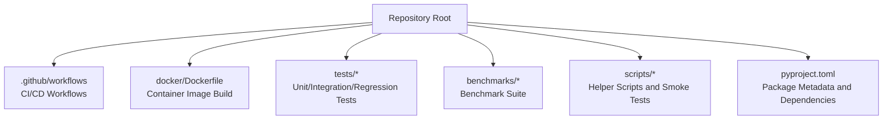
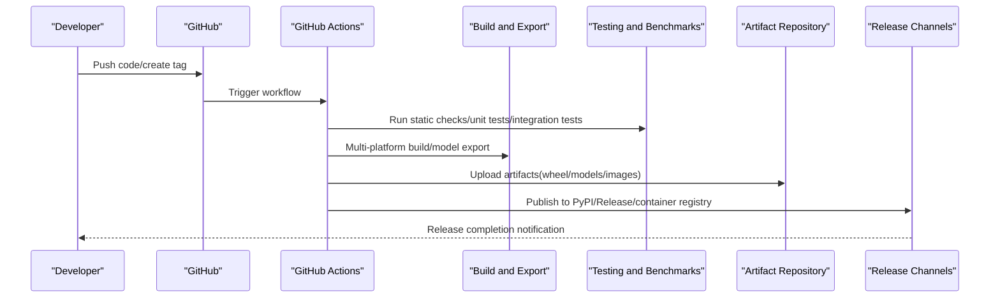
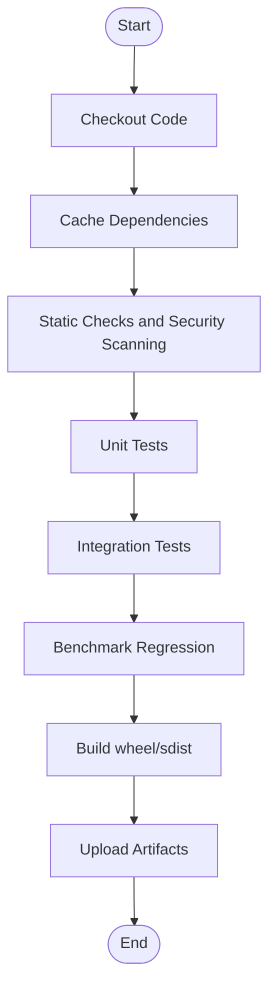
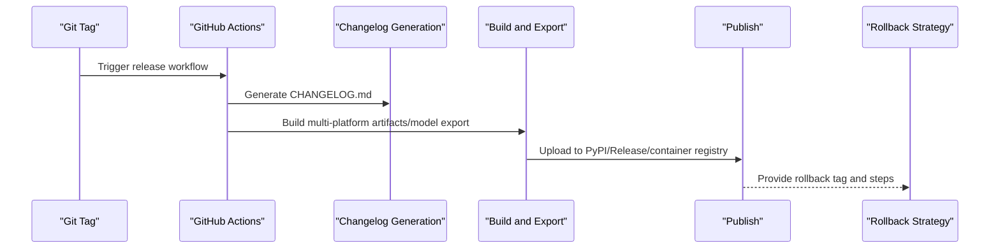
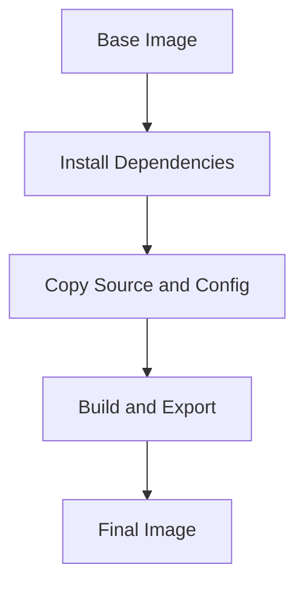
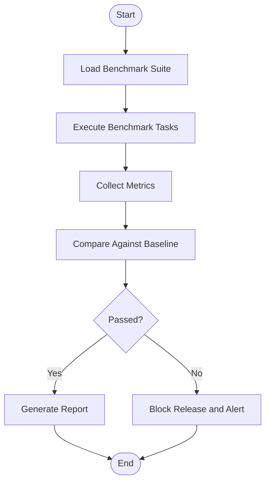
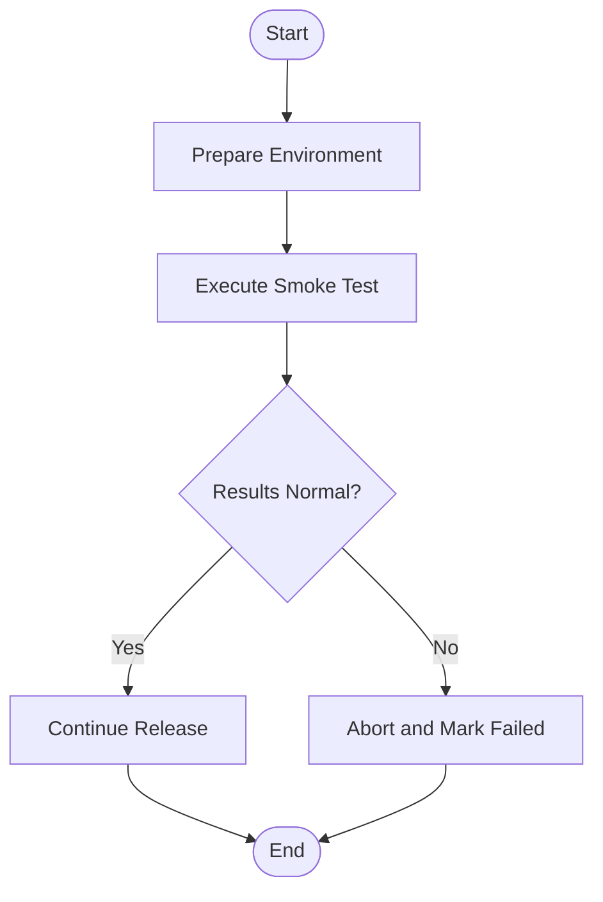
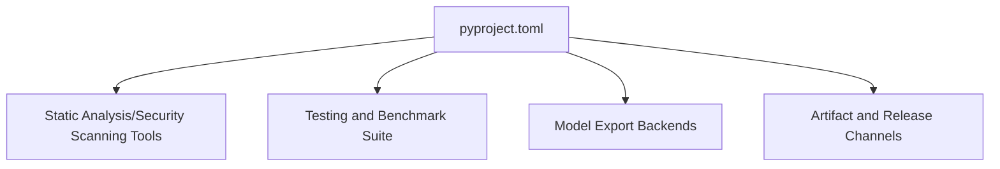

# CI/CD Pipeline

<cite>
**Files referenced in this document**
- [pyproject.toml](file://pyproject.toml)
- [.github/workflows/ci.yml](file://.github/workflows/ci.yml)
- [.github/workflows/release.yml](file://.github/workflows/release.yml)
- [docker/Dockerfile](file://docker/Dockerfile)
- [tests/conftest.py](file://tests/conftest.py)
- [benchmarks/suite.py](file://benchmarks/suite.py)
- [scripts/smoke_test_coco2017.py](file://scripts/smoke_test_coco2017.py)
- [ultralytics/utils/benchmarks.py](file://ultralytics/utils/benchmarks.py)
</cite>

## Table of Contents
1. [Introduction](#introduction)
2. [Project Structure](#project-structure)
3. [Core Components](#core-components)
4. [Architecture Overview](#architecture-overview)
5. [Detailed Component Analysis](#detailed-component-analysis)
6. [Dependency Analysis](#dependency-analysis)
7. [Performance Considerations](#performance-considerations)
8. [Troubleshooting Guide](#troubleshooting-guide)
9. [Conclusion](#conclusion)
10. [Appendix](#appendix)

## Introduction
This document is the complete CI/CD pipeline design document for YOLO-Master, aiming to build an end-to-end automated workflow in GitHub Actions: code inspection, unit testing, integration testing and performance regression; multi-platform compilation and model export; artifact packaging and publishing; quality gates (static analysis, security scanning, license checking); semantic version management and changelog generation; as well as rollback strategies and failure recovery mechanisms. The document also provides actionable pipeline orchestration recommendations and key script paths for direct implementation.

## Project Structure
The repository already has the infrastructure locations and artifact output conventions required for CI/CD:
- GitHub Actions workflows are stored in .github/workflows
- Docker image build entry point is at docker/Dockerfile
- Test cases are concentrated in the tests directory, including configuration and convergence assertions
- Benchmark and regression scripts are in benchmarks and scripts
- Python package metadata and dependencies are defined in pyproject.toml

**Section sources**
- [pyproject.toml](file://pyproject.toml)
- [.github/workflows/ci.yml](file://.github/workflows/ci.yml)
- [.github/workflows/release.yml](file://.github/workflows/release.yml)
- [docker/Dockerfile](file://docker/Dockerfile)
- [tests/conftest.py](file://tests/conftest.py)
- [benchmarks/suite.py](file://benchmarks/suite.py)
- [scripts/smoke_test_coco2017.py](file://scripts/smoke_test_coco2017.py)
- [ultralytics/utils/benchmarks.py](file://ultralytics/utils/benchmarks.py)

## Core Components
- Code Quality Gates
  - Static analysis and format checking: Based on ruff/flake8/isort/black toolchain (managed via pyproject.toml)
  - Security scanning: Use trivy or gitleaks for vulnerability and secret scanning of source code and dependencies
  - License compliance: Use license-checker or scancode to verify third-party licenses
- Test Suite
  - Unit tests: pytest + conftest environment initialization
  - Integration tests: End-to-end training/validation/export chains
  - Performance regression: Metric collection and threshold comparison based on benchmarks and ultralytics.utils.benchmarks
- Build and Export
  - Multi-platform builds: Linux/macOS/Windows matrix
  - Model export: ONNX/TensorRT/OpenVINO/CoreML/TFLite, etc.
  - Package artifacts: wheel/sdist and optional Docker images
- Release and Version Management
  - Semantic versioning: Trigger release workflow based on Git tags
  - Changelog: Automatically generate CHANGELOG.md
  - Artifact archiving: PyPI/GitHub Releases/container registry
- Rollback and Recovery
  - Quick rollback: Revert to stable version by tag
  - Canary release: Phased deployment with automatic circuit breaking
  - Health checks: Execute smoke tests and benchmark regression after release; rollback on failure

**Section sources**
- [pyproject.toml](file://pyproject.toml)
- [tests/conftest.py](file://tests/conftest.py)
- [benchmarks/suite.py](file://benchmarks/suite.py)
- [ultralytics/utils/benchmarks.py](file://ultralytics/utils/benchmarks.py)

## Architecture Overview
The following diagram shows the end-to-end pipeline from commit to release, including quality gates, testing, building, export, artifacts, and publishing.

[This diagram is a conceptual flowchart, not directly mapped to specific source files]

## Detailed Component Analysis

### Workflow 1: Continuous Integration (ci.yml)
Responsibilities
- Pull code and cache dependencies
- Run static checks and security scanning
- Execute unit tests and integration tests
- Run benchmark regression and compare against baseline
- Build multi-platform wheel/sdist
- Upload artifacts and test results

Key Step Recommendations
- Set up Python environment and dependency caching
- Install ruff/flake8/isort/black and execute checks
- Run pytest and output JUnit reports
- Invoke benchmarks suite and ultralytics.utils.benchmarks to collect metrics
- Build wheel/sdist and upload to artifact storage

**Section sources**
- [.github/workflows/ci.yml](file://.github/workflows/ci.yml)
- [tests/conftest.py](file://tests/conftest.py)
- [benchmarks/suite.py](file://benchmarks/suite.py)
- [ultralytics/utils/benchmarks.py](file://ultralytics/utils/benchmarks.py)

### Workflow 2: Release and Version Management (release.yml)
Responsibilities
- Listen for Git tag events (e.g., v*.*.*)
- Validate semantic version
- Generate changelog
- Build cross-platform artifacts and model exports
- Publish to PyPI/GitHub Releases/container registry
- Record release summary and rollback instructions

Key Step Recommendations
- Parse tag and validate semantic version
- Generate CHANGELOG.md (based on commit messages or PR templates)
- Build multi-platform wheel/sdist and Docker images
- Signing and integrity verification (optional)
- Publish and trigger downstream environment deployment

**Section sources**
- [.github/workflows/release.yml](file://.github/workflows/release.yml)

### Container Image Build (Dockerfile)
Responsibilities
- Define base image and runtime dependencies
- Install project dependencies and build tools
- Copy source code and configuration files
- Expose ports and default commands

Recommendations
- Use multi-stage builds to reduce image size
- Pin dependency versions to ensure reproducibility
- Separate model export and inference as independent image layers

**Section sources**
- [docker/Dockerfile](file://docker/Dockerfile)

### Testing and Benchmarks
- Unit Tests and Integration Tests
  - Use pytest to organize test cases; conftest.py handles environment initialization and fixtures
  - Integration tests cover end-to-end scenarios for training/validation/export/tracking
- Benchmarks and Performance Regression
  - Use benchmarks/suite.py to define benchmark tasks and parameters
  - Use ultralytics.utils.benchmarks to collect latency, throughput, and accuracy metrics
  - Compare against historical baseline; block release if threshold exceeded

**Section sources**
- [tests/conftest.py](file://tests/conftest.py)
- [benchmarks/suite.py](file://benchmarks/suite.py)
- [ultralytics/utils/benchmarks.py](file://ultralytics/utils/benchmarks.py)

### Smoke Tests and Quick Validation
- Use scripts/smoke_test_coco2017.py for lightweight end-to-end validation
- Perform quick regression on critical paths before release to ensure basic functionality is available

**Section sources**
- [scripts/smoke_test_coco2017.py](file://scripts/smoke_test_coco2017.py)

## Dependency Analysis
- Package Metadata and Dependencies
  - pyproject.toml centrally manages dependencies, build system, and toolchain configuration
  - Recommend caching pip dependencies in CI to accelerate builds
- External Dependencies and Integration Points
  - Static analysis and security scanning tools
  - Benchmark and export backends (ONNX/TensorRT/OpenVINO, etc.)
  - Artifact and release channels (PyPI/GitHub Releases/container registry)

**Section sources**
- [pyproject.toml](file://pyproject.toml)

## Performance Considerations
- Parallelization
  - Use matrix strategy in CI to run different platforms and tasks in parallel
  - Split benchmark tasks to avoid timeout from overly long single steps
- Caching
  - Cache Python dependencies, model weights, and export intermediate artifacts
- Resource Limits
  - Allocate CPU/GPU resources appropriately to avoid memory overflow
- Incremental Builds
  - Only build modules and export targets related to changes
- Metric Monitoring
  - Continuously collect latency, throughput, and accuracy metrics; establish trend charts and alerts

[This section provides general guidance, not directly analyzing specific files]

## Troubleshooting Guide
- Common Issue Identification
  - Static check failures: Review ruff/flake8/isort/black output, fix formatting and style issues
  - Test failures: Locate failed cases and environment differences based on pytest reports
  - Benchmark regression failures: Compare metric changes, confirm whether it's expected optimization or degradation
  - Build failures: Check dependency version conflicts and platform-specific issues
- Logs and Artifacts
  - Retain test reports and benchmark results for traceability
  - Upload build logs and error stack traces to assist diagnosis
- Rollback and Recovery
  - Use the most recent stable tag for quick rollback
  - During canary releases, gradually increase traffic; circuit break and rollback immediately on anomalies

**Section sources**
- [tests/conftest.py](file://tests/conftest.py)
- [benchmarks/suite.py](file://benchmarks/suite.py)
- [ultralytics/utils/benchmarks.py](file://ultralytics/utils/benchmarks.py)

## Conclusion
Through the CI/CD pipeline design described above, YOLO-Master can achieve end-to-end automation from code commit to production release, covering quality gates, testing, building, export, artifacts, and publishing, while providing comprehensive version management, rollback, and failure recovery mechanisms. It is recommended to refine the details and alerting strategies of each phase incrementally based on team conventions and infrastructure conditions during actual implementation.

[This section is summary content, not directly analyzing specific files]

## Appendix
- Recommended Pipeline Stage Checklist
  - Code inspection: ruff/flake8/isort/black
  - Security scanning: trivy/gitleaks
  - License checking: license-checker/scancode
  - Unit tests: pytest
  - Integration tests: End-to-end training/validation/export
  - Benchmark regression: benchmarks + ultralytics.utils.benchmarks
  - Build: wheel/sdist + Docker images
  - Release: PyPI/GitHub Releases/container registry
  - Rollback: Tag-based revert and canary circuit breaking

[This section is supplementary information, not directly analyzing specific files]
